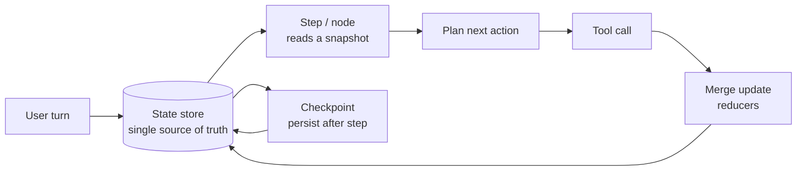

# State Management and Persistence

> **Interview answer (say this first).** Agent state is the single source of truth for one run: everything the loop needs to decide its next step lives in one structured object — messages, plan, step count, tool outputs, and scratch data. Steps read a snapshot and return an update; the store merges and persists it. Persist it outside the process (Redis for speed, Postgres/SQLite for durability) so a restart, retry, or second worker can resume instead of starting over.

## Why this exists

Picture an agent that helps a user book travel. It is written the obvious way: small pieces of data held in local variables and passed around.

```python
messages = []
plan = []
step = 0
def run_turn(user_text):
    messages.append({"role": "user", "content": user_text})
    # ... decide, call tools, append results ...
    return messages[-1]
```

This works in a notebook. It fails in production for three reasons.

**Failure 1 — the process forgets everything on restart.** Servers are restarted for deploys, crash under memory pressure, and get killed by autoscalers. When that happens, `messages`, `plan`, and `step` vanish. The next request from the same user begins from nothing, and the agent asks again for information it already had.

**Failure 2 — a retry repeats a side effect.** A user says "send the summary to my team." The agent calls `send_email`, then the network times out before the result is recorded. The framework retries the whole step. There is no memory that the email already left, so it sends twice.

**Failure 3 — two workers disagree.** A load balancer sends the user's next message to a different instance. That instance has its own empty variables. The conversation forks into two contradictory histories.

All three are the same bug: **the state of the run is trapped inside one process's memory.** The fix is to make state explicit data, stored somewhere all steps — and all workers — can read and write. That data is the run's **single source of truth**.

> **Note:**
>
> **The one-sentence purpose.** Keep everything the agent needs to continue in one serialisable object, stored outside the process, so any step on any machine can resume from it.


## Start from zero

| Word | Plain meaning |
| --- | --- |
| **State** | The data describing where a run is right now: history, plan, counters, results. |
| **Run / thread** | One execution of the agent loop for a task. Identified by a `thread_id`. |
| **Session** | The longer-lived conversation a user returns to. One session contains many runs. |
| **Conversation** | The ordered list of user and assistant messages. A part of state, not all of it. |
| **Message** | One entry in the conversation: role (`user`, `assistant`, `tool`) plus content. |
| **Plan** | The remaining steps the agent intends to take. |
| **Scratch** | Free-form working memory: intermediate values, notes, small computed values. Not shown to the user. |
| **Tool output** | What a tool returned, tagged with which tool and call produced it. |
| **Schema** | The declared shape of state: which fields exist and what type each has. |
| **Store** | The component that saves and loads state by id. In-memory, Redis, Postgres. |
| **Serialisation** | Turning state into bytes (usually JSON) so it can be written to a store and read back. |
| **Snapshot** | A copy of state at one moment, safe to read without it changing under you. |
| **Reducer** | A function that merges a step's update into the current state (for example, append vs overwrite). |
| **Optimistic concurrency** | Saving with an expected version number; the write fails if someone else changed it first. |
| **TTL** | Time to live: how long a stored entry is kept before automatic deletion. |
| **Single source of truth** | The one place state is authoritative; everything else is a derived view. |

Two distinctions matter most.

**State is not memory.** State is the live working set needed to continue *this run*. Memory (covered in the memory topics) is knowledge retrieved across runs: past episodes, user preferences, facts. Memory is an archive you query; state is the current position on the board.

**A session is not a run.** A user keeps one session for days. Each time the agent actually works, that is a run with its own `thread_id`, plan, and checkpoints. Keying state only by user id means two simultaneous runs for one user overwrite each other's plans.

## The core idea

Think of a **control-room whiteboard**. Every operator reads the board, does their part, and writes the result back in the same agreed layout. Nobody keeps the mission status in their own pocket. A shift change is easy: the next operator reads the board and continues.

The alternative is the broken version: each operator remembers their own piece, and when a shift changes, the new crew knows nothing.



The loop has one shared object, not many private ones. A step never holds a long-lived reference to state; it receives a snapshot, returns an update, and the store merges it.

What belongs on the board, and what does not:

| Belongs in state | Why |
| --- | --- |
| Messages | The model needs the conversation to decide the next step. |
| Plan / remaining steps | Lets the run resume mid-plan and show progress. |
| Step count and budget used | Enforces limits and detects loops. |
| Tool outputs | Later steps depend on earlier results; re-calling may be unsafe or costly. |
| Scratch data | Intermediate values that avoid recomputation. |
| Approval decisions and ids | Proves who approved what (see the HITL topic). |
| Errors and retry counts | Lets the loop back off or stop instead of spinning. |

| Does **not** belong in state | Why |
| --- | --- |
| Open sockets, locks, DB connections | Not serialisable; cannot survive a restart. |
| Large binaries and full documents | Bloats every checkpoint; store a reference/id instead. |
| Secrets and API keys | State is often logged and copied; fetch secrets at use time. |
| Derived caches you can rebuild | They add size without adding truth. |

Which store to use:

| Store | Speed | Survives restart | Best for | Watch out for |
| --- | --- | --- | --- | --- |
| In-process dict | Fastest | No | Tests, single-process demos, request-scoped scratch | Lost on restart; not shared between workers |
| Redis | Very fast | Depends on persistence config | Hot state, short TTLs, rate/budget counters, queues | Eviction can drop state; logical DBs do **not** isolate eviction |
| Postgres / SQLite | Fast enough | Yes | Durable state, audit, multi-worker, queries | Schema migrations; row size; transaction contention |

A common production shape is **both**: Redis holds the hot working state with a TTL, and Postgres holds the durable record used for resume and audit.

## How it works

1. **Declare a schema.** Decide the fields and their types up front, so every step agrees on the shape. A `TypedDict` is often enough; Pydantic adds runtime validation.
2. **Create the initial state.** For each new run, build a state with empty messages, an empty plan, `step = 0`, and empty results.
3. **Load by id.** At the start of each step, the runner loads the latest state for the `thread_id`. If none exists, it creates the initial state.
4. **Hand the step a snapshot.** The step receives a copy so it cannot mutate stored state by accident.
5. **The step returns an update (a patch).** For example, "append this message" or "set the plan to these three steps". It does not rewrite the whole state.
6. **A reducer merges the update.** Append-style fields concatenate; scalar fields overwrite. LangGraph calls these reducers; a hand-rolled loop uses a merge function.
7. **Persist after the step.** Write the merged state to the store and bump a version. This write is the checkpoint (next topic).
8. **Serve the next step from the store.** Any worker can now pick up the run, because state does not depend on process memory.
9. **Guard against lost updates.** Save with a version check. Two workers that read version 3 cannot both write version 4; the second gets a conflict and retries on fresh state.
10. **Add retention.** Give ephemeral state a TTL and archive the durable record. Otherwise the store grows without bound.

## The syntax you will use

**A state schema with `TypedDict`.** This is the agreed layout of the whiteboard.

```python
from typing import Any, TypedDict
class AgentState(TypedDict):
    messages: list[dict[str, str]]       # full conversation, oldest first
    plan: list[str]                      # remaining steps
    step: int                            # how many actions taken
    tool_outputs: list[dict[str, Any]]   # results, each tagged with its tool
    scratch: dict[str, Any]              # free-form working memory
```

**Create the initial state for a run.**

```python
def new_state() -> AgentState:
    return {"messages": [], "plan": [], "step": 0,
            "tool_outputs": [], "scratch": {}}
```

**Mutable update: simple, and easy to leak.** This appends in place and returns the same object. Anyone holding a reference sees the change.

```python
def add_message_mutable(state: AgentState, role: str, content: str) -> AgentState:
    state["messages"].append({"role": role, "content": content})
    return state
```

**Immutable update: return a fresh state.** Build a new dict and a new list, leaving the old one untouched.

```python
def add_message(state: AgentState, role: str, content: str) -> AgentState:
    return {**state, "messages": [*state["messages"],
                                  {"role": role, "content": content}]}
```

**A frozen dataclass for a session record.** `frozen=True` makes mutation an error, and `dataclasses.replace` returns an updated copy.

```python
from dataclasses import dataclass, replace
@dataclass(frozen=True)
class SessionRecord:
    session_id: str
    tenant_id: str
    messages: tuple[dict[str, str], ...] = ()
    step: int = 0
seed = SessionRecord(session_id="s1", tenant_id="tenant-a")
grown = replace(seed, messages=(*seed.messages,
               {"role": "user", "content": "hi"}), step=1)  # seed is unchanged
```

**In-memory store keyed by session id.** `deepcopy` matters: without it, a later mutation of the caller's dict corrupts the stored copy.

```python
import copy
class InMemoryStore:
    def __init__(self) -> None:
        self._data: dict[str, AgentState] = {}
    def save(self, session_id: str, state: AgentState) -> None:
        self._data[session_id] = copy.deepcopy(state)
    def load(self, session_id: str) -> AgentState | None:
        stored = self._data.get(session_id)
        return copy.deepcopy(stored) if stored is not None else None
```

**Serialisation: JSON round trip.** Whatever you store must become bytes and come back.

```python
import json
blob = json.dumps(state)          # state -> str
restored = json.loads(blob)       # str -> state
```

**A durable SQLite store (standard library).** Upsert by primary key, with a `version` column that `save_cas` uses for concurrency control.

```python
import sqlite3
def open_db(path: str = ":memory:") -> sqlite3.Connection:
    conn = sqlite3.connect(path)
    conn.execute(
        "CREATE TABLE IF NOT EXISTS agent_state ("
        " session_id TEXT PRIMARY KEY,"
        " state_json TEXT NOT NULL,"
        " version INTEGER NOT NULL)")
    return conn
def save_sqlite(conn, session_id: str, state, version: int) -> bool:
    cur = conn.execute(
        "INSERT INTO agent_state (session_id, state_json, version) VALUES (?, ?, ?) "
        "ON CONFLICT(session_id) DO UPDATE SET state_json=excluded.state_json, "
        "version=MAX(version, excluded.version) "
        "WHERE excluded.version >= version",
        (session_id, json.dumps(state), version))
    conn.commit()
    return cur.rowcount == 1
def load_sqlite(conn, session_id: str):
    row = conn.execute(
        "SELECT state_json, version FROM agent_state WHERE session_id = ?",
        (session_id,)).fetchone()
    return (json.loads(row[0]), row[1]) if row else None
```

**Caveat: `save_sqlite` is a monotonic blind write, not a compare-and-swap.** It clamps the stored version with `MAX(version, excluded.version)` so mixing it with `save_cas` can never move the version backwards, and it rejects a write whose version is older (`rowcount == 0`). But two workers that both read version 1 can both write at version 1: the version does not advance, so the second silently overwrites the first. Use `save_cas` when you need to detect that lost update.

**Optimistic concurrency: refuse a stale write.** `rowcount == 1` means the version matched and the write won; `0` means someone else got there first.

```python
def save_cas(conn, session_id: str, state, expected_version: int) -> bool:
    cur = conn.execute(
        "UPDATE agent_state SET state_json = ?, version = version + 1 "
        "WHERE session_id = ? AND version = ?",
        (json.dumps(state), session_id, expected_version))
    conn.commit()
    return cur.rowcount == 1
```

**Redis for hot state (standard client form).** `ex` is a TTL in seconds. Prefer `SET` with an explicit TTL over unbounded keys.

```python
r.set(f"agent:{thread_id}", json.dumps(state), ex=3600)   # redis-py
raw = r.get(f"agent:{thread_id}")
```

**Postgres `jsonb` for durable state (standard SQL).** `jsonb` stores JSON efficiently and lets you query inside it.

```sql
INSERT INTO agent_state (thread_id, state, version)
VALUES ($1, $2::jsonb, 1)
ON CONFLICT (thread_id)
DO UPDATE SET state = EXCLUDED.state, version = agent_state.version + 1
WHERE agent_state.version = $3;   -- 0 rows updated = a stale write
```

## Examples: simple to real

**Example 1 — the agreed shape, and the first message.**

```python
s = new_state()
s["messages"].append({"role": "user", "content": "book a flight"})
s["plan"] = ["search", "compare", "book"]
s["step"] = 1
print(sorted(s))
```

Illustrative output:

```text
['messages', 'plan', 'scratch', 'step', 'tool_outputs']
```

The keys are the schema. Any step can now rely on `messages`, `plan`, `step`, `tool_outputs`, and `scratch` existing.

**Example 2 — the mutable-update bug.** Two names end up pointing at the same list.

```python
before = new_state()
alias = before
add_message_mutable(before, "assistant", "ok")
print("alias changed too:", alias is before, len(alias["messages"]))
```

Illustrative output:

```text
alias changed too: True 1
```

If `before` was a snapshot taken for a retry, the retry now sees a corrupted history. Mutable updates couple every holder to every future change.

**Example 3 — immutable update keeps history intact.**

```python
base = new_state()
next_state = add_message(base, "user", "hi")
print(len(base["messages"]), len(next_state["messages"]))
```

Illustrative output:

```text
0 1
```

`base` is still the empty starting state, so it can be replayed or compared safely. This is what makes time-travel and retries possible.

**Example 4 — a store that cannot be corrupted from outside.**

```python
store = InMemoryStore()
live = new_state()
live["step"] = 3
store.save("s1", live)
live["step"] = 99                 # mutate after saving
loaded = store.load("s1")
print("stored step:", loaded["step"], "| unknown:", store.load("nope"))
```

Illustrative output:

```text
stored step: 3 | unknown: None
```

The `deepcopy` on both `save` and `load` is what protects the store. `None` for an unknown id is the signal to start a fresh run.

**Example 5 — serialise state, restore it, and check equality.**

```python
blob = json.dumps(next_state)
restored = json.loads(blob)
print("equal:", restored == next_state, "| type:", type(restored).__name__)
```

Illustrative output:

```text
equal: True | type: dict
```

This is the whole basis of resumability. If state cannot survive a JSON round trip, it cannot survive a restart.

**Example 6 — SQLite persistence plus a lost-update check.** Two workers read version 1; only one may write version 2.

```python
conn = open_db()
save_sqlite(conn, "s9", new_state(), version=1)
writer_a = load_sqlite(conn, "s9")     # both read version 1
writer_b = load_sqlite(conn, "s9")
first = save_cas(conn, "s9", add_message(writer_a[0], "user", "A"), writer_a[1])
second = save_cas(conn, "s9", add_message(writer_b[0], "user", "B"), writer_b[1])
print("A wins:", first, "| B stale:", second)
```

Illustrative output:

```text
A wins: True | B stale: False
```

Worker B must reload, merge, and retry. Without the version check, B would silently erase A's message — the classic **lost update**.

## In production

- **Key state by `(session_id, thread_id)`.** A session groups conversations; a thread is one run. Keying only by user id lets two concurrent runs overwrite each other's plan and counters.
- **Write state after every step, not at the end.** If you only persist on completion, a crash at step 9 of 10 loses everything. Frequent small writes are cheap; lost work is not.
- **Prefer immutable updates and merge patches.** They make retries, time travel, and comparisons safe. In-place mutation couples every holder to every later change.
- **Deep-copy on store boundaries.** In-memory stores that keep a reference let callers mutate stored state after saving. Copy in and copy out.
- **Use optimistic concurrency for shared state.** A `version` column and a compare-and-swap write turn a silent lost update into a detectable conflict you can retry.
- **Keep state small.** Every byte is written on every step and copied into every checkpoint. Store document references, not whole documents; store secrets nowhere.
- **Never put secrets or raw PII in state.** State is logged, traced, snapshotted, and sometimes shown in a debug UI. Fetch secrets at use time; redact PII before it enters state.
- **Pick the store by recovery need.** Redis alone is not a durability guarantee unless persistence is configured and understood; its eviction policy can remove keys under memory pressure. Use Postgres/SQLite when losing state is unacceptable.
- **Do not rely on Redis logical databases for isolation.** Databases separate namespaces, not memory; the eviction policy applies to the whole instance. A noisy key can still be evicted and take agent state with it.
- **Version your state schema.** Add fields with defaults and record a schema version. A resume after a deploy may load state written by older code.
- **Set a TTL and an archive policy.** Finished runs should expire or move to cold storage. Unbounded state is a slow-motion outage.
- **Make the store the only writer.** Do not let one path write directly and another mutate a cached object. A single write path is what "single source of truth" means in practice.

## Interview questions

### 1. Why is agent state the single source of truth?

**Answer.** Because every step must be able to decide the next action from the same facts, on any worker, after any restart. If state lives in local variables, a crash or a retry loses it, a second worker has a different copy, and a retried side effect can run twice. One stored, structured state removes all three problems.

**Follow-up: "What is the cost of that?"** Every step pays to load and save it, and you must version the schema. For a tiny single-process script the cost is not worth it, which is why the pattern appears when agents become long-running or multi-worker.

**Trap.** Saying state is just the message list. Messages are one field. Plan, step count, tool outputs, budgets, and approvals also belong in state.

### 2. What belongs in agent state, and what should stay out?

**Answer.** In: messages, the plan, step and budget counters, tool outputs, scratch values, errors, retry counts, and approval decisions. Out: open connections, locks, large binaries, secrets, and caches you can rebuild. The test is whether a step needs the value to continue and whether it can be serialised.

**Follow-up: "Where do large documents go?"** In object storage or the database, with an id or URL in state. Copying a 5 MB document into every checkpoint will dominate your write cost.

**Trap.** Putting a database connection or lock in state. It is not serialisable, so the first restart or worker handoff fails.

### 3. Mutable versus immutable state updates — what is the trade-off?

**Answer.** Immutable updates return a new state and leave the old one intact, which makes retries, snapshots, and time travel safe. Mutable updates are cheaper in memory and simpler to write, but every holder of the object sees the change, so a "snapshot" is not really a snapshot. For agents, correctness wins: prefer immutability or a merge layer that treats updates as patches.

**Follow-up: "Is copying expensive?"** Deep copying large state per step is. LangGraph-style reducers merge patches instead of copying everything, and persistent data structures share structure, so the cost is usually manageable.

**Trap.** Claiming mutable updates are always wrong. In a hot loop over a small object they are fine; the bug appears when a reference is shared across retries or workers.

### 4. How do you choose between in-memory, Redis, and Postgres for state?

**Answer.** By recovery requirement and access pattern. In-memory is for tests and single-process runs. Redis is for hot, short-lived state, counters, and queues where speed matters and loss is tolerable. Postgres or SQLite is for durable state that must survive restarts, support multiple workers, and be queryable for audit. Many systems use Redis in front and Postgres behind.

**Follow-up: "Why not just Postgres for everything?"** Latency and write volume. A checkpoint every step to a relational database can be too slow for high-frequency loops, so hot state goes to Redis and durable snapshots go to Postgres.

**Trap.** Assuming Redis is automatically durable because it can persist to disk. Persistence is configurable, eviction can still drop keys, and asynchronous replication can lose recent writes in a failover.

### 5. Session, conversation, run, thread — how do you model them?

**Answer.** A session is the long-lived relationship with a user. A conversation is the ordered messages. A run (or thread) is one execution of the agent loop, with its own plan and checkpoints. One session has many conversations and runs. Key state by session and thread, and put the user and tenant on the session.

**Follow-up: "Why not use a single id for everything?"** Because concurrent runs in one session are normal, and a shared id makes them overwrite each other. Separate ids also let you expire old runs without deleting the user's history.

**Trap.** Treating `conversation_id` and `thread_id` as interchangeable. One conversation can contain several runs, especially when a long task is retried.

### 6. How do you make state resumable across a restart?

**Answer.** Keep state serialisable, persist it after each step keyed by thread id, store a schema version, and load the latest snapshot on resume. Anything non-serialisable — sockets, locks — must be rebuilt on load, not stored.

**Follow-up: "What breaks the JSON round trip?"** Sets, tuples, datetimes without a format, custom classes, and bytes. Convert them to lists, ISO strings, ids, and base64, or use a serialiser that supports them.

**Trap.** Storing Python objects and assuming `json.dumps` will handle them. It will not; it raises `TypeError` at the worst possible time.

### 7. What is the difference between agent state and agent memory?

**Answer.** State is the live working set needed to continue the current run: messages, plan, counters, results. Memory is knowledge retrieved across runs: user preferences, past episodes, learned facts. State is read and written every step and often expires with the run; memory is searched when relevant and lives much longer.

**Follow-up: "Where do they meet?"** Retrieved memory is injected into state as context for the current step. The state records that it was injected; the memory store remains the source of truth for the fact itself.

**Trap.** Using state as long-term memory. A conversation's messages are not a knowledge base, and growing state without bound eventually breaks every write.

### 8. How do you prevent two workers from overwriting each other's state?

**Answer.** Use optimistic concurrency. Store a version or `updated_at` with the state; a writer must present the version it read, and the write fails if the stored version has moved on. The loser reloads the new state, merges, and retries. Some systems use locks or a single writer per key instead.

**Follow-up: "Why not a lock?"** Locks are simpler mentally but dangerous in distributed systems: a crashed holder can leave the lock stuck, and lock timeouts create their own race. Version checks are usually safer because they cannot deadlock.

**Trap.** Read-modify-write without a version check. Two workers both read version 3, both write version 4, and one update disappears with no error.

## Remember this

- **State is the single source of truth for a run**, and it lives in a store, not in process memory.
- **Key by session and thread**; a session contains many runs, and concurrent runs must not collide.
- **Prefer immutable updates and merged patches**, so retries and snapshots stay safe.
- **Persist after every step** and version the schema; a resume may load state written by older code.
- **Use a version check to stop lost updates**, and choose Redis for hot state, Postgres/SQLite for durable state.
