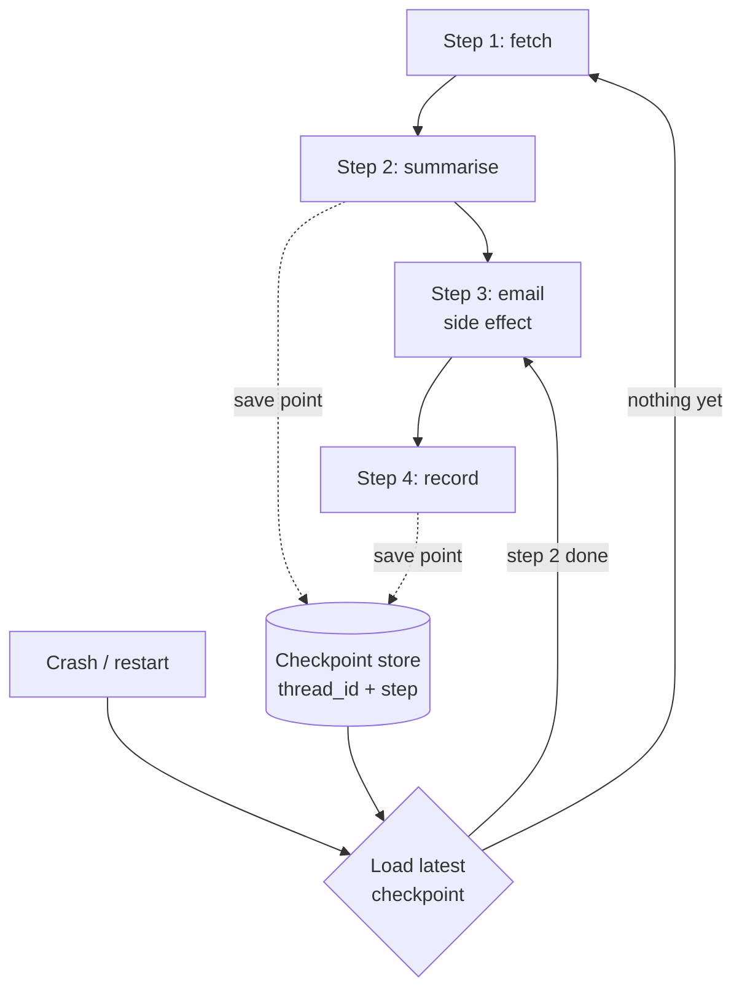

# Checkpointing and Durable Execution

> **Interview answer (say this first).** A checkpoint is a durable snapshot of agent state written after each step, keyed by a thread id, so a crash or restart can resume from the last completed step instead of the beginning. Durable execution is running the workflow so that it survives process death and replays safely. You never get exactly-once *delivery* over a network; you get exactly-once *effect* by making each side effect idempotent — recording an idempotency key when the effect succeeds, and skipping it on replay.

## Why this exists

An agent processes an invoice: read the PDF, extract totals, post to the ledger, then email the customer. It runs in a normal request handler.

```python
def process_invoice(pdf_path):
    text = read_pdf(pdf_path)
    totals = extract_totals(text)
    ledger.post(totals)                 # side effect 1
    email.send(customer, totals)        # side effect 2
    return totals
```

The process posts to the ledger, then crashes while sending the email. The job runner sees a failure and retries. Now the function starts again: it re-reads the PDF, posts to the ledger **a second time**, and emails the customer again. The customer gets duplicate mail; the ledger double-counts revenue.

This is not an unusual bug. It is the default behaviour of every retry system, because retries cannot tell "the step never ran" from "the step ran and the process died before recording it."

The same class of failure appears in gentler forms:

- A deploy restarts the worker mid-task, and a 40-step agent loses 39 steps of work.
- A long-running agent pauses for human approval overnight, and the server that was holding it is recycled.
- A queue redelivers a message because the acknowledgement was lost, and a tool fires twice.

Retrying is necessary. Retrying is also what duplicates side effects. **Checkpointing and durable execution exist to make retry safe.**

> **Note:**
>
> **The one-sentence purpose.** Record progress durably after each step and make every side effect idempotent, so a resumed run skips what is done and never repeats what already happened.


## Start from zero

| Word | Plain meaning |
| --- | --- |
| **Checkpoint** | A durable snapshot of state plus the step it represents, written so it can be reloaded later. |
| **Durable** | Survives process death, restarts, and usually machine failure. Stored on disk or in a database, not only in memory. |
| **Thread id** | The stable id for one run. All checkpoints for that run share it. |
| **Step** | One unit of work between checkpoints: a node, a tool call, a model call. |
| **Resume** | Load the latest checkpoint and continue from the next step. |
| **Replay** | Re-executing steps from a recorded history, usually to rebuild state after a crash. |
| **Idempotent** | Running it twice has the same effect as running it once. |
| **Idempotency key** | A unique value identifying one intended side effect, so a repeat can be recognised and skipped. |
| **Side effect** | A change outside the program's own memory: sending mail, charging a card, writing a row, calling an API. |
| **At-most-once** | The effect happens zero or one time. Risk: it may never happen. |
| **At-least-once** | The effect happens one or more times. Risk: duplicates. |
| **Exactly-once** | In practice, at-least-once delivery plus idempotent handling, so the effect is applied once. |
| **Workflow engine** | A system built to run long-lived, durable workflows: Temporal, Cadence, AWS Step Functions, Airflow, LangGraph. |
| **Journal / event log** | An append-only record of what happened. Replay reads it to rebuild state. |
| **Compensating action** | An action that undoes or offsets a completed step when the workflow must roll back. |
| **Saga** | A long transaction made of local steps, each with a compensating action instead of a global rollback. |
| **Transactional outbox** | Writing the intent to act into the same database transaction as the state change, then performing the effect from the outbox. |

Two distinctions carry the topic.

**Retry is not durable execution.** A retry re-runs the work from the start and hopes the work is safe to repeat. Durable execution records each completed step, so a resume skips completed work entirely.

**Delivery vs effect.** Exactly-once *delivery* is impossible across an unreliable network — a message can always be lost after the receiver acts but before the sender learns it. Exactly-once *effect* is achievable: deliver at least once, and make the receiver idempotent.

## The core idea

Think of a **video game save point**. You do not restart the level when you die; you reload the last save. The save records your position, inventory, and progress. Between saves, a crash loses only the work since the last save point.

A checkpoint is that save. The stronger idea — durable execution — is that the game engine itself restarts and reloads your save automatically, without you pressing anything.



The essential detail is **where** the save point goes: after a completed step, and atomically with the record of any side effect. If the checkpoint says "email sent" but the email never left, the customer is never notified. If the email left but the record failed, the next replay sends it again.

| Approach | On crash | Duplicate side effects | Lost work |
| --- | --- | --- | --- |
| No persistence | Start over | Yes | All of it |
| Retry the whole request | Start over | Often | All of it |
| Checkpoint, replay all | Replay from the start | Only if steps are non-idempotent | None after last checkpoint |
| Checkpoint, resume from last | Continue at next step | No, if effects are recorded | Only since last checkpoint |
| Durable engine + idempotency keys | Continue at next step | No | Only since last checkpoint |

## How it works

1. **Assign a thread id when the run starts.** Every checkpoint, log line, and resume uses it. Without a stable id there is nothing to resume from.
2. **Break the run into steps.** A step is a unit small enough that repeating it is cheap and losing it is acceptable. Model calls, tool calls, and human-approval waits are natural step boundaries.
3. **Before a side effect, compute an idempotency key.** Derive it from stable facts: `f"charge:{invoice_id}"`, `f"email:{thread_id}:{step}"`. The key names the *intent*, so a repeat produces the same key.
4. **Record the intent, then perform the effect, then record success.** The safe order writes the key to durable storage first (or in the same transaction as the state change) and marks it done after success. This is the transactional outbox idea.
5. **Write a checkpoint after each step.** Store the state, the step number, and a version. The write must be atomic: a half-written checkpoint is worse than none.
6. **On restart, load the latest checkpoint.** Find the row with the highest step for the thread id.
7. **Resume from the next step, not the first.** Completed steps are skipped because their results are already in state. If you must replay them, they are safe because of idempotency keys.
8. **Make replay deterministic where you can.** Replay records the recorded result of each step rather than calling the tool again. Never re-invoke a non-idempotent side effect during replay.
9. **Handle schema drift.** Store a schema version with the checkpoint. A resume after a deploy may load state written by older code; migrate or refuse explicitly.
10. **Retain and clean up.** Checkpoints are history. Keep enough to resume and audit, then archive or delete. A mature run has hundreds of them.

> **Warning:**
>
> **The atomicity trap.** If the side effect and the record of it are in different systems, a crash between them either repeats the effect or loses it. Prefer making the effect idempotent by key, or write the intent in the same transaction as the state change (the outbox pattern). "We will remember after we send it" is not a design.


## The syntax you will use

**A checkpoint as data.** Everything needed to resume goes in one serialisable object.

```python
from dataclasses import dataclass
@dataclass
class Checkpoint:
    thread_id: str
    step: int
    completed: list[str]
    pending: list[str]
    result: dict
```

**A store keyed by `(thread_id, step)`.** In production this is a Redis hash, a Postgres table, or a dedicated checkpointer; a dict shows the shape.

```python
class CheckpointStore:
    def __init__(self) -> None:
        self._data: dict[tuple[str, int], Checkpoint] = {}
    def save(self, cp: Checkpoint) -> None:
        self._data[(cp.thread_id, cp.step)] = cp
    def latest(self, thread_id: str) -> Checkpoint | None:
        mine = [cp for (tid, _), cp in self._data.items() if tid == thread_id]
        return max(mine, key=lambda c: c.step) if mine else None
```

**An idempotency ledger.** `run_once` performs the effect only if the key is unseen, and records the key **after** success.

```python
class IdempotencyLedger:
    def __init__(self) -> None:
        self.done: set[str] = set()
    def run_once(self, key: str, fn):
        if key in self.done:
            return f"skipped:{key}"
        result = fn()
        self.done.add(key)          # record AFTER success
        return result
```

**A unique constraint, in SQL.** The unique key is the durable idempotency lock.

```sql
CREATE TABLE side_effects (
    key        TEXT PRIMARY KEY,   -- 'charge:invoice-42'
    applied_at TIMESTAMPTZ NOT NULL DEFAULT now()
);

-- If this insert conflicts, the effect already happened: do not repeat it.
INSERT INTO side_effects (key) VALUES ($1)
ON CONFLICT (key) DO NOTHING;
```

**Versioned checkpoints for resume.** Load the highest step; write the next step with a compare-and-swap on `version`, so two workers cannot both advance the run. A conflict updates zero rows: that is a lost update, so reload the latest checkpoint and retry.

```sql
-- $4 is the version this worker read; the write only succeeds if it is still current.
INSERT INTO checkpoints (thread_id, step, state, version)
VALUES ($1, $2, $3::jsonb, $4 + 1)
ON CONFLICT (thread_id, step)
DO UPDATE SET state = EXCLUDED.state, version = checkpoints.version + 1
WHERE checkpoints.version = $4;   -- 0 rows updated = a lost-update conflict

SELECT thread_id, step, state FROM checkpoints
WHERE thread_id = $1 ORDER BY step DESC LIMIT 1;
```

**LangGraph: a checkpointer turns any graph durable.** `InMemorySaver` is for tests; `SqliteSaver` and `PostgresSaver` persist durably to disk or a database (verified with LangGraph 1.x).

```python
from langgraph.graph import StateGraph, START, END
from langgraph.checkpoint.memory import InMemorySaver
graph = builder.compile(checkpointer=InMemorySaver())
config = {"configurable": {"thread_id": "invoice-42"}}   # the run id
result = graph.invoke({"messages": []}, config)
```

**LangGraph: resume the same thread from a durable file.** Open a fresh connection in a new process and continue; the interrupted step re-runs from the checkpoint.

```python
from langgraph.checkpoint.sqlite import SqliteSaver
from langgraph.types import Command
with SqliteSaver.from_conn_string("checkpoints.sqlite") as saver:
    graph = builder.compile(checkpointer=saver)
    state = graph.get_state(config)          # .values, .next, .interrupts
    result = graph.invoke(Command(resume="yes"), config)
```

**Pause and stop with an interrupt (durable execution plus human input).**

```python
from langgraph.types import interrupt
def gate(state):
    answer = interrupt("Approve this payment?")   # stops here; state is checkpointed
    return {"log": state["log"] + [f"answer={answer}"]}
```

## Examples: simple to real

These examples share one tiny workflow: `fetch`, `summarise`, and `email`. Only `email` is a side effect, and running the steps again is what creates duplicates.

```python
STEPS = ["fetch", "summarise", "email"]
SIDE_EFFECTS: list[str] = []
def run_step(name: str, state: dict) -> dict:
    if name == "fetch":
        state["doc"] = "quarterly report"
    elif name == "summarise":
        state["summary"] = "revenue up"
    elif name == "email":
        state["sent_to"] = ["team@example.com"]
    return state
def execute(thread_id: str, store: CheckpointStore,
            crash_after: int | None = None,
            ledger: IdempotencyLedger | None = None) -> dict:
    ledger = ledger or IdempotencyLedger()
    cp = store.latest(thread_id)
    if cp is None:
        state, completed, step = {}, [], 0
    else:
        state, completed, step = cp.result, list(cp.completed), cp.step
    for name in STEPS:
        if name in completed:                 # resume skips finished steps
            continue
        state = run_step(name, state)
        if name == "email":                   # a side effect, guarded by a key
            ledger.run_once(f"email:{thread_id}", lambda: SIDE_EFFECTS.append("sent"))
        completed.append(name)
        step += 1
        store.save(Checkpoint(thread_id, step, completed,
                              [s for s in STEPS if s not in completed], dict(state)))
        if crash_after is not None and step == crash_after:
            raise RuntimeError(f"crash after {step} steps")
    return state
```

**Example 1 — retrying a non-idempotent workflow duplicates the effect.**

```python
sends: list[str] = []
def naive_run() -> None:
    for name in STEPS:
        if name == "email":
            sends.append("sent")     # no memory of any earlier run
naive_run(); naive_run()
print("sends:", len(sends))
```

Illustrative output:

```text
sends: 2
```

Two runs, two emails. This is the default unless you add memory and idempotency.

**Example 2 — an idempotency key makes the effect happen once.**

```python
ledger = IdempotencyLedger()
calls = {"n": 0}
def charge():
    calls["n"] += 1
    return "charged"
print(ledger.run_once("charge:order-1", charge))
print(ledger.run_once("charge:order-1", charge))
print("provider calls:", calls["n"])
```

Illustrative output:

```text
charged
skipped:charge:order-1
provider calls: 1
```

The second call is recognised by its key and skipped. This is what makes at-least-once delivery safe: the effect is applied exactly once.

**Example 3 — checkpoint after each step, crash halfway, resume.** The runner loads the latest checkpoint and skips completed steps.

```python
store = CheckpointStore()
ledger = IdempotencyLedger()
try:
    execute("thread-1", store, crash_after=2, ledger=ledger)
except RuntimeError as exc:
    print("crashed:", exc)
cp = store.latest("thread-1")
print("step:", cp.step, "completed:", cp.completed)
```

Illustrative output:

```text
crashed: crash after 2 steps
step: 2 completed: ['fetch', 'summarise']
```

`fetch` and `summarise` are recorded, so they will not run again. Only `email` is left.

**Example 4 — resume sends the email once, and replay does not resend.**

```python
final = execute("thread-1", store, ledger=ledger)
print("resumed:", final)
print("side effects:", SIDE_EFFECTS)
execute("thread-1", store, ledger=ledger)   # replay the whole thread again
print("after replay:", SIDE_EFFECTS)
```

Illustrative output:

```text
resumed: {'doc': 'quarterly report', 'summary': 'revenue up', 'sent_to': ['team@example.com']}
side effects: ['sent']
after replay: ['sent']
```

The run finished after the crash, and running it again changed nothing. That is **replay safety**: replay observes and skips, it does not re-fire.

**Example 5 — checkpoints survive serialisation.** A checkpoint that cannot round-trip through JSON cannot survive a restart.

```python
cp = store.latest("thread-1")
blob = json.dumps({"thread_id": cp.thread_id, "step": cp.step,
                   "completed": cp.completed, "pending": cp.pending,
                   "result": cp.result}, sort_keys=True)
back = json.loads(blob)
print("step:", back["step"], "pending:", back["pending"])
```

Illustrative output:

```text
step: 3 pending: []
```

A finished run has no pending steps. If this raised `TypeError`, the state contains something JSON cannot encode, and durable resume would fail.

**Example 6 — durable resume across two processes with LangGraph.** The first block runs, pauses, and exits; the second opens the same SQLite file in a new process and continues. Verified output from two separate connections:

```text
process 1 paused, state.log: ['first']
process 1 next: ('gate',)
process 1 closed, db exists: True 20480 bytes
resumed from disk, log: ['first'] next: ('gate',)
final: {'log': ['first', 'gate=yes']}
```

The second process knew the run had reached `gate` because the checkpointer wrote it to disk. That is durable execution in one picture.

## In production

- **Checkpoint after every step, not at the end.** A crash at step 9 of 10 should cost one step, not the whole run. Small frequent writes are the point.
- **Make every truly-once side effect idempotent.** Stripe-style idempotency keys, unique constraints, or `INSERT ... ON CONFLICT DO NOTHING`. Retries are inevitable; duplicate charges are not.
- **Write the intent before the effect.** Use the transactional outbox pattern or a unique key committed with the state change. A crash between the effect and the record is the exact window that duplicates or loses work.
- **Treat replay as a first-class mode.** Replay must consume recorded results and must not re-invoke non-idempotent tools. Have a flag or a journal that makes this explicit.
- **Store enough to resume but no secrets.** Checkpoints are copied, logged, and sometimes exposed in debug UIs. Keep API keys and raw PII out; reference them.
- **Version the checkpoint schema and the code.** A resume after a deploy can load old-shaped state. Record a schema version and either migrate or fail loudly.
- **Cap checkpoints per run.** Hundreds are normal; thousands mean your steps are too small or you are not pruning. Archive completed runs and expire old checkpoints.
- **Mind write latency and contention.** A checkpoint per token is too expensive. Checkpoint at step boundaries, batch where safe, and expect write contention if many runs share a key.
- **Make step boundaries line up with side effects.** A step that both calls an LLM and charges a card cannot be retried cheaply. Split the irreversible part into its own small, idempotent step.
- **Detect divergence between the record and reality.** Periodically reconcile: keys marked sent but never delivered, or delivered but never recorded. Reconciliation catches the crashes inside the atomicity window.
- **Use a workflow engine when the workflow is long and critical.** Temporal and Step Functions solve resume, retries, timers, and signals. LangGraph checkpointers solve resume and retries but do not provide durable timers. Rolling your own is fine until the edge cases arrive.
- **Test crash points deliberately.** Inject failures before and after each side effect and assert that a resume neither duplicates nor drops. Untested resume code is wishful thinking.

## Interview questions

### 1. What is a checkpoint, and when do you write one?

**Answer.** A checkpoint is a durable snapshot of the run's state plus the step it represents. You write one after each completed step, keyed by thread id and step number. The frequency is a trade-off: more checkpoints mean less lost work but more write load. Step boundaries — a model call, a tool call, an approval wait — are the natural points.

**Follow-up: "Why not checkpoint after every token?"** The write cost and contention would dominate the work, and a partially generated model response is usually not useful state. Checkpoint at meaningful boundaries.

**Trap.** Saying "checkpoint when the task finishes." That is a result store, not a checkpoint, and it loses all intermediate work on a crash.

### 2. What is durable execution, and why does an agent need it?

**Answer.** Durable execution means the workflow survives process death and resumes from its last completed step, with its state and timers intact. Agents need it because they are long-running, call external services that fail, and pause for human input. A 30-minute agent in a normal request handler loses everything on a deploy.

**Follow-up: "How is that different from retrying the request?"** A retry starts over and re-runs side effects. Durable execution continues from the last recorded step and skips completed work.

**Trap.** Confusing durability with persistence of the final answer. The valuable part is the intermediate progress and the records of side effects.

### 3. How do you achieve exactly-once side effects?

**Answer.** You cannot guarantee exactly-once *delivery* over a network, so you deliver at least once and make the effect idempotent. Compute a stable idempotency key for each intended effect, record it durably when the effect succeeds, and skip the effect when the key is already present. A unique database constraint enforces this even across workers.

**Follow-up: "What if the effect succeeds but recording the key fails?"** That is the atomicity window. Reduce it by writing the intent in the same transaction as the state change, or by having the external provider honour an idempotency key so a repeat is harmless.

**Trap.** Claiming a framework gives exactly-once. Frameworks give at-least-once plus helpers; the idempotency is still your design.

### 4. What is replay, and how do you make it safe?

**Answer.** Replay re-executes the workflow from a recorded history, usually to rebuild state after a crash or to migrate. It is safe when steps are deterministic given recorded inputs and when non-idempotent steps consume recorded results instead of firing again. The journal of completed effects is what replay consults.

**Follow-up: "What breaks replay?"** Non-deterministic code paths that depend on wall-clock time, random values, or live external state, and side effects that run during replay. Record the values that were used so replay sees the same ones.

**Trap.** Replaying by re-calling every tool. Replay should read recorded outputs for completed steps, not re-invoke them.

### 5. What breaks without checkpoints?

**Answer.** A restart loses all in-flight work, so long tasks never finish under normal deploy frequency. Retries re-run completed side effects, causing duplicate emails and double charges. There is no record to resume from, so human-approval pauses cannot outlive the process. And there is no audit trail of what the agent actually did.

**Follow-up: "Give the smallest example."** A two-minute task that sends an email: the process crashes right after sending, the retry sends again, and the customer gets two copies. One checkpoint plus one idempotency key prevents it.

**Trap.** Thinking checkpoints only help "big" workflows. Any workflow with a side effect and a retry benefits.

### 6. How do thread ids and step ids work?

**Answer.** A thread id identifies one run across all its checkpoints; it is the resume handle. A step id or step number orders the checkpoints within the run, so "latest" is well defined and duplicates at the same step can be detected. The pair `(thread_id, step)` is usually the primary key. A version field guards concurrent writes.

**Follow-up: "What if two runs share a thread id?"** They will overwrite each other's checkpoints and corrupt resume. Generate a fresh thread id per run, and keep the user-facing session id separate.

**Trap.** Reusing a thread id across unrelated tasks. Resume will load the wrong history and skip the wrong steps.

### 7. Checkpoints, event logs, and workflow engines — how do they relate?

**Answer.** A checkpoint is a snapshot of the latest state; an event log is an append-only record of everything that happened. Snapshots make resume fast, while event logs make replay and audit possible; many systems keep both. A workflow engine packages checkpoints, retries, timers, and signals into one runtime so you do not hand-roll them.

**Follow-up: "When would you use an event log over snapshots?"** When you need a full audit trail, time travel, or to rebuild derived views. Snapshots alone tell you the current position, not the path taken.

**Trap.** Assuming a snapshot is a substitute for an audit log. It records where you are, not every decision and side effect along the way.

### 8. How do you handle a checkpoint written by an older version of the code?

**Answer.** Treat state as a versioned API. Store a schema version with every checkpoint. On resume, if the version differs, run an explicit migration, or refuse to resume and start a new run. Never let old-shaped state flow into new code silently.

**Follow-up: "What about adding a new field?"** Give it a default so old checkpoints remain loadable, and bump the schema version. Removing or retyping a field needs a migration.

**Trap.** Deploying with no schema version and discovering the incompatibility in production, when a user's paused run fails to resume.

## Remember this

- **Checkpoint after every step**, keyed by `(thread_id, step)`, so resume is cheap and crashes are small.
- **Exactly-once effect = at-least-once delivery + idempotency**; delivery alone can never be exactly once.
- **Write the intent before the effect** (outbox or unique key) to close the crash window between them.
- **Replay reads recorded results**; it must not re-fire non-idempotent side effects.
- **Version both the checkpoint schema and the code**, or a resume after a deploy will fail in production.
