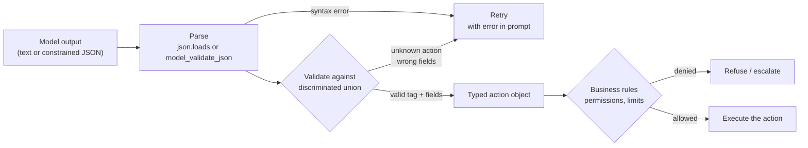

# Structured Agent Outputs

> **Interview answer (say this first).** An agent's decision is the most dangerous thing in the system, because it decides what the agent does next. If that decision is free text, every consumer has to guess at the intent, and a single malformed answer can stop the loop or trigger the wrong action. Structured agent outputs force the decision into a typed schema — usually a Pydantic model with a discriminated union of actions — so you can parse it, validate it, and only then act on it.

## Why this exists

An agent is a model inside a loop. Each turn the model must answer one question: **what do I do next?** That answer is an **action** — call a tool, answer the user, ask a human, or stop.

If you ask a chat model for that decision in plain words, you get plain words back:

```text
Assistant: Sure! I think I'll search the docs for "LoRA" first, then summarize.
```

That is readable to a person. It is useless to a program. The code wants a tool name and its arguments, and instead it has a sentence. To act on it you would need to write a parser that understands English, and that parser fails on the next turn when the model phrases the same idea differently.

Even when you demand JSON, the model often wraps it in prose or a markdown fence:

~~~~text
Assistant: Here is my decision:

```json
{"action": "search", "query": "lora"}
```

Let me know if you want more.
~~~~

Now `json.loads()` raises. So you write a regex to strip the fence. It works for a week, then the model changes its phrasing and your regex silently matches the wrong text.

When the JSON does parse, the failures continue:

- **Wrong type.** `"top_k": "five"` where you need an integer.
- **Missing field.** The model picks `"action": "search"` but forgets `query`.
- **Invented action.** `"action": "delete_database"`, which is not a tool you have.
- **Wrong shape.** A string where you expected a list of steps.
- **Two actions at once.** The model returns an array you did not ask for.
- **Truncation.** The output hits `max_tokens` halfway through the object.

Each of these is a decision the agent will try to execute. The scariest case is not the crash. It is the **valid-looking but wrong decision** — a well-formed object that names the wrong tool or the wrong tenant. If your code trusts it, the agent acts.

Structured agent outputs fix this by making the decision a **typed value**: a known action tag plus the fields that action requires. You parse it into an object, validate it against a schema, and only then let it touch anything.

> **Note:**
>
> **The one-sentence purpose.** A structured agent output turns "what should I do?" from a sentence you hope to parse into an object you can prove is valid before acting.


## Start from zero

| Word | Plain meaning |
| --- | --- |
| **Agent** | A language model in a loop that observes state, decides, and acts. |
| **Action** | The decision for one turn: which tool to call, or to finish. |
| **Tool** | A function the agent may call, such as `search_docs` or `send_email`. |
| **Tool call** | A structured request naming one tool and its arguments. |
| **Structured output** | Model output constrained to a schema instead of free text. |
| **JSON** | A text format for objects, arrays, strings, numbers, booleans, and null. |
| **JSON Schema** | A standard document that describes which JSON values are valid. |
| **Pydantic** | A Python library that reads type annotations, validates data, and generates JSON Schema. |
| **Parse** | Turning text into an in-memory value such as a dict. |
| **Validate** | Checking that a value matches the schema and the rules. |
| **Discriminated union** | A union where one field (the *tag*) decides which variant applies. |
| **Type tag** | The field that names the variant, often called `action` or `type`. |
| **Side effect** | Anything the action changes in the world — writes, sends, deletes. |
| **Idempotent** | Safe to run twice with the same result, e.g. a read. |
| **Retry loop** | Calling the model again with the validation error in the prompt. |
| **Refusal** | The model declines to answer and returns prose instead. |
| **Truncation** | Output stops early because the token budget ran out. |

Two distinctions to pin down now:

- **Parse vs validate.** Parsing can succeed on a string that is still wrong — `{"action": "nope"}` parses fine. Validation is the separate check that the action is one you allow.
- **Syntax vs meaning.** A schema can guarantee the shape. It can never guarantee the choice is a good one. You still need business rules and evaluation.

## The core idea

Think of an airport departure board versus a handwritten note. The handwritten note says *"leave around 6, BA something, terminal maybe 5."* A person can muddle through. The departure board has fixed columns — flight, time, gate, status — and every row must fill them. The board is machine-readable, unambiguous, and any malformed row is obviously wrong.

An agent's decision should be a departure board row, not a note. The fixed columns are the **type tag** (`action`) plus the fields that action requires. A `search` row must have a `query`. A `finish` row must have an `answer`. A row with an unknown action is rejected before boarding.

The mechanism is a **discriminated union**. You define one Pydantic model per action, each with a `Literal` tag. Then you combine them with `Field(discriminator="action")`. The tag tells the validator which model to check against, so errors point at the right variant.



The key insight: **valid is not the same as allowed.** The schema proves the object is well-formed. A second, independent check proves the action is permitted. Both must pass before anything with a side effect runs.

| Approach | Guarantees | Typical failure |
| --- | --- | --- |
| Free text | Nothing | Unparseable sentence, wrong intent |
| Prose with JSON | Nothing | Fence and commentary break `json.loads` |
| JSON mode | Valid JSON syntax | Right syntax, wrong fields |
| Pydantic model | Exact shape and types | Valid shape, semantically wrong value |
| Discriminated union | Exact shape per action | To act, you still gate with permissions |

## How it works

1. **Define one model per action.** Each model has a `Literal` tag plus only the fields that action needs. `SearchAction` has `query`; `FinishAction` has `answer`.
2. **Combine them into a discriminated union.** `Annotated[Search | Finish, Field(discriminator="action")]`. Pydantic reads the tag first and then validates the matching fields.
3. **Ask the provider for that schema.** With constrained decoding, the provider compiles the schema to a grammar and masks invalid tokens, so malformed JSON is impossible unless generation is truncated.
4. **Parse the raw text into the union.** `TypeAdapter(Decision).validate_json(raw)` returns a typed object or raises `ValidationError`.
5. **Read the error path on failure.** `err["loc"]` names the exact field and index. Log it and build feedback for the retry.
6. **Retry with the error in the prompt.** A bounded loop — two or three attempts — then a safe fallback. Never loop forever.
7. **Run business rule checks on the typed object.** Permissions, tenant boundaries, value limits, and confirmation requirements.
8. **Execute only after both checks pass.** For side-effecting actions, log the decision before acting so the audit trail exists even if the action fails.

There are two failure paths grammar cannot cover:

- **Refusal.** The model declines in prose. That is valid text, not a schema violation. Detect it separately and decide whether to retry, rephrase, or escalate.
- **Truncation.** If `max_tokens` is too small, the object stops mid-field. Partial JSON is invalid, so budget tokens for the largest valid action.

## The syntax you will use

**One model per action.** Each starts with a `Literal` tag.

```python
from typing import Literal
from pydantic import BaseModel, Field

class SearchAction(BaseModel):
    action: Literal["search"]
    query: str = Field(min_length=1)

class FinishAction(BaseModel):
    action: Literal["finish"]
    answer: str
```

**The discriminated union.** `Annotated` attaches the discriminator to the union type.

```python
from typing import Annotated

Decision = Annotated[SearchAction | FinishAction, Field(discriminator="action")]
```

**Validate raw text into a typed object.** `TypeAdapter` works on a bare union where no wrapper model exists.

```python
from pydantic import TypeAdapter, ValidationError

adapter = TypeAdapter(Decision)
try:
    decision = adapter.validate_json(raw_text)
except ValidationError as e:
    for err in e.errors():
        print(err["loc"], err["type"])   # e.g. ('search', 'query') missing
```

**Generate the schema you send to the provider.** One source of truth for schema and validation.

```python
schema = adapter.json_schema()
```

Pydantic emits `oneOf` plus a `discriminator` block naming the tag and each variant:

```json
{
  "discriminator": {
    "propertyName": "action",
    "mapping": {"search": "#/$defs/SearchAction", "finish": "#/$defs/FinishAction"}
  },
  "oneOf": [{"$ref": "#/$defs/SearchAction"}, {"$ref": "#/$defs/FinishAction"}]
}
```

**Reject unknown fields.** `extra="forbid"` makes a stray field an error instead of silent drift.

```python
from pydantic import ConfigDict

class StrictSearch(BaseModel):
    model_config = ConfigDict(extra="forbid")
    action: Literal["search"]
    query: str
```

**A tool call is just another structured object.** The arguments are JSON that you validate against the tool's own argument model.

```python
class SearchArgs(BaseModel):
    model_config = ConfigDict(extra="forbid")
    query: str

class ToolCall(BaseModel):
    name: str
    arguments: dict

call = ToolCall.model_validate_json(raw)
args = SearchArgs.model_validate(call.arguments)   # validate before executing
```

**OpenAI: parse straight into Pydantic.** The SDK builds the schema and returns a parsed object. Wrap the union in a model, because `response_format` takes a model class.

```python
class DecisionEnvelope(BaseModel):
    step: Decision

parsed = client.beta.chat.completions.parse(
    model="<a-model-with-structured-outputs>",
    messages=messages,
    response_format=DecisionEnvelope,
)
decision = parsed.choices[0].message.parsed.step
```

**Force a single action through a tool call (Anthropic style).** Tool input schemas are JSON Schema, so this is structured output with a different name.

```python
resp = client.messages.create(
    model="<a-claude-model>",
    max_tokens=1024,
    tools=[{"name": "decide", "description": "Emit the next action.",
            "input_schema": adapter.json_schema()}],
    tool_choice={"type": "tool", "name": "decide"},
    messages=messages,
)
payload = resp.content[0].input
```

**A bounded retry loop.** Feed the validation error back instead of repeating the prompt.

```python
feedback = None
for attempt in range(3):
    raw = call_model(prompt, feedback)
    try:
        decision = adapter.validate_json(raw)
        break
    except ValidationError as e:
        feedback = str(e.errors())
else:
    decision = None            # fall back to a safe path
```

## Examples: simple to real

**Example 1 — free text cannot be executed.** The model answers with a sentence, and `json.loads` fails immediately.

```python
import json

raw = 'Sure! I will search for "lora" now.'
json.loads(raw)     # json.JSONDecodeError: Expecting value
```

There is no reliable way to recover the tool name and query from that sentence. You own the parsing bug.

**Example 2 — a Pydantic model gives a precise error.** The same prose fails validation, but now the error has a type and a location.

```python
adapter.validate_json('Sure! I will search for "lora" now.')
# ValidationError: type='json_invalid'
```

Switching to a valid-looking but wrong action fails differently and just as precisely:

```text
{"action": "delete_all"}  ->  loc=() type='union_tag_invalid'
{"action": "search"}      ->  loc=('search', 'query') type='missing'
```

The first says the tag is unknown. The second names the missing field. That specificity is what makes retries work.

**Example 3 — parse failure does not have to stop the agent.** A retry with the error in the prompt recovers.

```python
# attempt 1: '{"action": "search", "query": "lora"}' wrapped in prose -> invalid
# attempt 2: '{"action": "search", "query": "lora"}'              -> valid
# recovered: SearchAction, attempts: 2
```

The retry costs one extra call. That is cheap next to a crashed loop or a wrong action.

**Example 4 — validate, then act.** Dispatch with `isinstance`, and never call the tool before validation returns.

```python
def execute(decision: Decision) -> str:
    if isinstance(decision, SearchAction):
        return run_search(decision.query)
    if isinstance(decision, FinishAction):
        return decision.answer
    raise TypeError("unhandled action")

decision = adapter.validate_json(raw)   # raises before this line
output = execute(decision)
```

**Example 5 — a tool call is structured output too.** A provider returns a tool call; you validate the arguments against the tool's model before running it.

```python
call = ToolCall.model_validate_json('{"name": "search_docs", "arguments": {"query": "lora"}}')
args = SearchArgs.model_validate(call.arguments)
# query -> 'lora'
```

Because `SearchArgs` sets `extra="forbid"`, a smuggled field is caught:

```text
{"query": "lora", "admin": true}  ->  type='extra_forbidden'
```

That is the difference between "the model called a tool" and "the model called the tool with exactly the arguments I allow."

**Example 6 — validate before acting means two gates.** Shape is gate one. Permission is gate two.

```python
decision = adapter.validate_json(raw)          # gate 1: shape

if isinstance(decision, DeleteAction):
    if not principal.can("delete", decision.account_id):
        raise PermissionError("not allowed")   # gate 2: policy
    audit(principal, decision)
    execute(decision)
```

Gate one stops malformed decisions. Gate two stops valid decisions the caller may not make. A tool-calling model that skips gate two is one prompt injection away from an incident.

## In production

- **Give the schema one source of truth.** Generate it from the same Pydantic model you validate with. Hand-written duplicates drift and produce confusing failures.
- **Keep the union small and flat.** Deep nesting and dozens of variants raise decoding cost and failure rates. Prefer a handful of clear actions over a giant taxonomy.
- **Constrain the tag, not just the fields.** `Literal` on the tag is what makes the union safe. A plain `str` action field lets the model invent tools.
- **Cap `max_tokens` above the largest valid action.** Truncation produces invalid JSON no matter how good the schema is.
- **Detect refusals separately from schema errors.** A refusal is valid text that is not JSON. Log it, then decide whether to retry or escalate.
- **Bound the retry loop.** Two or three attempts, then a fallback path. Unbounded retries turn a bad decision into a latency and cost incident.
- **Log the raw output on failure.** Debugging validation errors is far easier with the exact bytes the model produced.
- **Never pass unvalidated output to a side-effecting tool.** This is the whole point. Validation must sit between the model and the action.
- **Validate business rules after shape validation.** The schema cannot know that this user may not touch this account, or that the amount exceeds a limit.
- **Make repeated actions idempotent.** Agents retry. A read is safe to repeat; a send or a payment needs an idempotency key so a duplicate call does not double-charge.
- **Prefer `extra="forbid"` for your own actions.** A stray field usually means an upstream change or a prompt-injected payload, and you want it surfaced.
- **Test the schema with adversarial outputs.** Feed prose, refusals, wrong tags, and partial JSON in unit tests, not just the happy path.

## Interview questions

### 1. Why is free-text output unsafe for an agent?

**Answer.** The agent's decision drives actions, so an unparseable or misinterpreted answer is not a cosmetic problem. Free text forces you to write brittle parsing, and it fails unpredictably as the model rephrases itself. Worse, some failures are silent: a well-formed sentence can name the wrong tool or the wrong argument, and code that guessed right once may guess wrong later.

**Follow-up: "Can't a strong prompt fix the format?"** A prompt makes the right format more likely. It cannot make it guaranteed. Constraints in the schema and validation on your side are what remove the parsing failure class.

**Trap.** Saying "JSON output solves it." `json.loads` proves syntax, not shape or intent. `{"action": "delete_everything"}` is valid JSON.

### 2. What is a discriminated union, and why use one here?

**Answer.** A union is "one of several models." A discriminated union names a tag field (`action`) that tells the validator which variant applies. Pydantic reads the tag first, then validates only that variant. The result is error messages that point at the correct fields and a schema with `oneOf` plus a `discriminator` mapping.

**Follow-up: "What happens with an unknown tag?"** You get `union_tag_invalid` at the union's location, not at the tag. With a bare `TypeAdapter` the location is empty (`loc=()`); when the union is nested inside another model, the location is the containing field (for example `loc=('step',)`). That is exactly the case where the model invented a tool, and it is caught before any dispatch.

**Trap.** Using `Union[A, B]` without a discriminator. Pydantic then tries variants in order, which is slower and can match the wrong one when models overlap.

### 3. How do you turn a model's tool call into a validated action?

**Answer.** A tool call is already structured: a name plus an arguments object. Parse it into a small model, then validate `arguments` against that tool's own argument model. Only call the function after both succeed. This keeps the model's output and the tool's contract in sync.

**Follow-up: "What if arguments contain extra fields?"** Reject them with `extra="forbid"`. A smuggled field is usually a prompt-injection attempt or an upstream drift you want to see, not ignore.

**Trap.** Trusting the provider's validation. Providers vary in what they enforce, and your own validator is the guarantee you control.

### 4. A valid decision arrives, but the agent should not act. What do you do?

**Answer.** That is gate two. Shape validation proves the object is well-formed; a separate policy check proves the action is permitted. Check scopes, tenant boundaries, value limits, and confirmation rules on the typed object. If any fails, do not execute. Return a refusal or escalate to a human.

**Follow-up: "Why not encode permissions in the schema?"** Some you can — enums and bounds help. But permissions depend on the caller and the current state, which the model does not know and must not decide. Keep authorization in code you control.

**Trap.** Treating a schema-valid action as authorized. A `Literal` tag proves the action exists; it says nothing about whether this user may run it.

### 5. How do you handle validation failures?

**Answer.** Retry with the validation error in the prompt so the model can see the exact field and problem, cap the attempts, and fall back safely if it keeps failing. Log the raw output and the error path. Never retry silently forever.

**Follow-up: "Why include the error instead of just re-asking?"** The identical prompt tends to reproduce the same mistake. The specific error narrows the correction.

**Trap.** Raising the retry limit to "fix" a common failure. Repeated failure means the schema or prompt is wrong; fix the cause.

### 6. What are the failure modes structured output does not remove?

**Answer.** Refusals, truncation, and semantically wrong but well-formed content. A refusal is valid text that is not JSON. Truncation cuts the object short, and no schema helps a partial string. A wrong-but-valid action passes every shape check, so it needs business rules or evaluation to catch.

**Follow-up: "Which is hardest to detect?"** The last one. Nothing alerts you because the schema passed. Only a policy check or an eval harness notices.

**Trap.** Assuming a successful parse means a correct decision. Shape and correctness are different properties.

### 7. How do retries and idempotency interact?

**Answer.** An agent retries for many reasons — a validation failure, a timeout, a restart. If the repeated action has a side effect, a retry can duplicate it. Read actions are naturally safe to repeat. Writes and destructive actions need an idempotency key, a dedupe check, or a "already applied" guard so the second call is a no-op.

**Follow-up: "Where does the key come from?"** Derive it from the decision and the request — for example `(run_id, step_index)` — so a retried step maps to the same key and the downstream system can collapse duplicates.

**Trap.** Retrying a payment or an email "to be safe." That doubles the effect.

### 8. How do structured agent outputs relate to plain structured outputs and tool calling?

**Answer.** They are the same machinery used for a different purpose. Structured outputs get data back to your program. Tool calling asks the model to trigger an action. An agent decision is the fusion: the structured object *is* the action, so it must be validated and authorized, not just parsed.

**Follow-up: "So what changes for the agent?"** The blast radius. A malformed data object wastes a call. A malformed or unauthorized action changes the world, which is why the validation-before-acting gate exists.

**Trap.** Reusing a response schema as the action schema. Keep "data I want back" and "action I will execute" as separate contracts.

## Remember this

- **An agent's output is a decision, not data.** Treat it as a typed action, not a sentence.
- **Discriminated unions make the action explicit.** The tag decides the variant, and unknown tags are rejected.
- **Parsing is not validating, and validating is not authorizing.** Shape, then policy, then act.
- **Retry with the error, bounded, then fall back.** Never pass a raw failure into the loop.
- **Valid is not correct.** The schema proves form; business rules and evals prove meaning.
