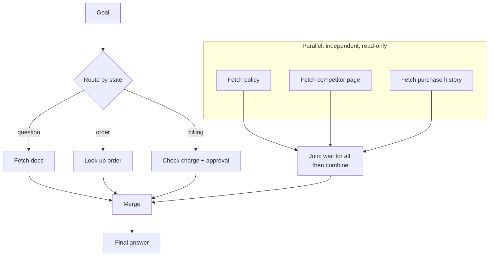

# Parallel and Conditional Workflows

> **Interview answer (say this first).** Not every agent step should run one after another. A conditional workflow routes to the right branch based on state, and a parallel workflow runs independent steps at the same time and merges the results — fan-out then fan-in. Parallelism is only safe when the steps are independent and, usually, read-only; dependent steps and side-effecting writes must stay ordered. You also have to handle partial failure, because some parallel branches will fail while others succeed.

## Why this exists

A naive agent runs one tool at a time, in a straight line. That is correct but often slow, and it is not how the task actually decomposes.

Consider a research agent answering "compare our refund policy with the competitor's." It needs three independent things: the internal policy, the competitor's page, and the customer's purchase history. Run them in sequence and the wall-clock time is the sum:

```text
policy lookup    1.0s
competitor fetch 1.5s
purchase history 0.8s
total            3.3s
```

Nothing about the first result changes the second request. They are **independent**, so the 3.3 seconds is wasted waiting. Fan them out and they overlap:

```text
fan-out (all three at once)   1.5s
```

The other problem is branching. A fixed sequence runs every step even when the path is wrong. A support agent that always searches the knowledge base, then always calls the billing API, then always emails is doing work nobody asked for. Most requests need exactly one branch:

```text
"Where is my order?"   -> order lookup
"How do I reset my password?" -> docs search
"Refund my last charge." -> billing tool (needs approval)
```

A **conditional workflow** picks the branch from the current state. It saves latency, tokens, and the chance of a wrong tool running.

Parallelism has a sharp edge, though. Run two steps at once that are not independent and you get real bugs:

- **A read that depends on a write.** The second step reads before the first has written.
- **Two writes to the same record.** Last writer wins, and the result depends on timing.
- **A non-idempotent side effect.** A retry of a parallel branch sends a second email.
- **A rate limit.** Fanning out twenty API calls at once trips the provider's limit and turns one request into twenty failures.

So the engineering question is not "can we parallelize?" but "are these steps independent and safe to repeat?" When the answer is yes, fan out. When it is no, order them.

> **Note:**
>
> **The one-sentence purpose.** Route when the path depends on state; fan out when steps are independent and read-only; fan in to merge; and always handle the branch that fails.


## Start from zero

| Word | Plain meaning |
| --- | --- |
| **Workflow** | A fixed or semi-fixed flow of steps the agent runs. |
| **Sequential** | One step after another; each waits for the previous. |
| **Conditional** | The next step depends on state, so the flow branches. |
| **Routing** | Choosing which branch or tool handles the current input. |
| **Branch** | One possible path through the flow. |
| **Fan-out** | Starting several independent steps at the same time. |
| **Fan-in** | Collecting the results of several steps into one place. |
| **Parallel** | Steps that overlap in time. |
| **Concurrency** | Managing many in-flight tasks, not necessarily at once on one core. |
| **Dependency** | Step B needs step A's output, so B must wait. |
| **Independent** | Steps that do not need each other's output; safe to overlap. |
| **Join / barrier** | The point where the flow waits for all parallel branches. |
| **Partial failure** | Some branches succeed and some fail in the same run. |
| **Fail-fast** | On the first error, cancel the rest and stop. |
| **Race condition** | A bug whose outcome depends on timing between concurrent steps. |
| **Side effect** | Anything changed in the world — sends, writes, deletes. |
| **Idempotent** | Safe to run twice with the same effect. |

Two distinctions to pin down:

- **Parallel vs concurrent.** Parallel means actively at the same time; concurrent means in flight together and interleaved. An `async` agent is concurrent even on a single core, and that is usually enough because it is waiting on I/O.
- **Independent vs dependent.** This decides safety. Independent reads can fan out. Dependent steps and writes must be ordered.

## The core idea

Think of a professional kitchen. The head chef (the agent) reads the order and decides what happens. Some tasks are independent — boil pasta, chop vegetables, reduce a sauce — and three cooks do them at once. Then comes the plate, and that step **depends** on all three, so it waits at the pass: the fan-in point. But two cooks cannot both salt the same pot without agreeing, and nobody plates before the pasta is done. Ordering and coordination are the whole game.

A workflow graph is that kitchen. Nodes are steps. Edges are "happens before." Conditional edges are the chef's decision. Fan-out and fan-in are the cooks starting together and the plate waiting at the pass.



The safety test is a short list of questions:

| Question | Safe to parallelize when… |
| --- | --- |
| Do the steps need each other's output? | No — they are independent. |
| Do they change shared state? | No — ideally read-only. |
| Are they idempotent if retried? | Yes, or they carry an idempotency key. |
| Does the provider allow the volume? | Yes, or you bound concurrency. |

If any answer is wrong, keep the steps sequential or restructure the task. Parallelizing dependent work is how you get races that appear once a week and nobody can reproduce.

## How it works

1. **Build the step graph.** For each step, record what it needs as input. That input requirement is the dependency edge.
2. **Find the independent set.** Steps with no unmet dependencies can run now. That set is the fan-out group.
3. **Start them concurrently.** Use `asyncio.gather` for async tools, or a thread pool for blocking ones.
4. **Route conditional edges.** Before choosing a branch, evaluate the state (an intent label, a flag, a prior result) and take exactly one path.
5. **Wait at the join.** The next step starts only after all branches in the group finish — or, for partial failure, after each finishes in its own time.
6. **Merge results.** Combine outputs into one state object, with a rule for what happens when two branches touch the same key.
7. **Handle failures per policy.** Fail-fast cancels siblings on the first error. Best-effort keeps the successes and records the failures. Choose deliberately.
8. **Continue or stop.** Feed the merged state back into the agent, which either answers or starts another round.

Two policies define the failure behavior, and you should pick one explicitly:

- **Fail-fast:** one branch fails, the whole group fails, siblings are cancelled. Use when the group result is all-or-nothing.
- **Best-effort:** collect each result, mark failures, and let the agent decide. Use when partial data is still useful.

`asyncio.gather(..., return_exceptions=True)` gives best-effort. An `asyncio.TaskGroup` gives fail-fast and cancels the siblings.

## The syntax you will use

**A result object.** Every branch returns the same shape, so merging is easy.

```python
from dataclasses import dataclass

@dataclass
class Result:
    name: str
    ok: bool
    value: str | None = None
    error: str | None = None
```

**An async tool call.** Real tools do I/O; `await` lets other branches run while this one waits.

```python
import asyncio

async def call_tool(name: str, delay: float, fail: bool = False) -> Result:
    await asyncio.sleep(delay)                 # stand-in for a network call
    if fail:
        raise RuntimeError("tool timeout")     # a real tool raises; it does not return a Result
    return Result(name, True, value=f"{name}-ok")
```

**Fan-out with best-effort semantics.** `gather` starts every call together and returns results in order.

```python
async def fan_out(calls):
    results = await asyncio.gather(
        *(call_tool(*c) for c in calls),
        return_exceptions=True,                # do not raise on the first error
    )
    return [r if isinstance(r, Result)
            else Result(c[0], False, error=str(r))   # keep the branch name
            for c, r in zip(calls, results)]
```

**Fail-fast with a task group.** If one raises, the group cancels its siblings and re-raises as an exception group.

```python
async def fan_out_strict(calls):
    async with asyncio.TaskGroup() as tg:
        tasks = [tg.create_task(call_tool(*c)) for c in calls]
    return [t.result() for t in tasks]
```

**Parallel blocking tools with a thread pool.** Use this for sync SDKs that do not offer `async`.

```python
from concurrent.futures import ThreadPoolExecutor

def fan_out_sync(calls):
    with ThreadPoolExecutor(max_workers=3) as pool:
        return list(pool.map(lambda c: sync_tool(*c), calls))
```

**Conditional routing.** A dict is a clear, testable router.

```python
def route(intent: str) -> str:
    table = {"lookup": "search_docs", "math": "calculator", "chat": "finish"}
    return table.get(intent, "search_docs")     # default branch
```

**Merging results into state.** Decide the merge rule up front for duplicate keys.

```python
def merge(state: dict, results: list[Result]) -> dict:
    state = dict(state)
    state["errors"] = list(state.get("errors", []))   # copy so callers are not mutated
    for r in results:
        if r.ok:
            state[r.name] = r.value
        else:
            state["errors"].append({"tool": r.name, "error": r.error})
    return state
```

## Examples: simple to real

**Example 1 — sequential is the sum, parallel is the max.** Three 0.2-second tools tell the story.

```text
sequential=0.61s parallel=0.21s
```

The sequential run pays 0.2 + 0.2 + 0.2 plus overhead. The parallel run pays about the slowest branch. That is the whole latency argument for fan-out.

**Example 2 — fan-out for independent reads.** All three branches succeed and the results come back in order.

```text
fan-out: [('search_docs', True), ('get_weather', True), ('read_customer', True)]
```

Order is preserved even though the completion times differ, which makes merging deterministic.

**Example 3 — partial failure is normal.** One branch fails; the rest are still usable.

```text
partial: [('search_docs', True, None), ('slow_tool', False, 'tool timeout'),
          ('get_weather', True, None)]
usable: 2 of 3
```

Best-effort keeps the two successes and records the failure. The agent can answer with what it has, or retry only the failed branch — not the whole group.

**Example 4 — fail-fast cancels the siblings.** Use a task group when the group result is all-or-nothing.

```text
done a
caught: unhandled errors in a TaskGroup (1 sub-exception)
caught.exceptions: (RuntimeError('tool failed'),)
after group: cancelled siblings, control returned
```

Catch the group with `except* RuntimeError as eg` and read `eg.exceptions` to reach the underlying error; `print(eg)` only shows the group summary. Notice `b` never prints "done": the task group cancelled it as soon as `boom` raised. If you need every branch to finish regardless, fail-fast is the wrong policy.

**Example 5 — conditional routing picks one branch.** The same agent handles three intents without running all three tools.

```text
route lookup  -> search_docs True
route math    -> calculator  True
route unknown -> search_docs True
```

The last line is the default branch. Always define one, so an unrecognized intent does not crash the flow.

**Example 6 — sequence the dependent step.** Fan-out the reads, then run the step that needs all of them.

```text
fan-out: [policy, competitor, history]   # concurrent
join:    wait for all three
merge:   build a comparison prompt
then:    await call_tool("summarize", ...)  # depends on the merge
```

The summarize step is not parallel with the fetches because it needs their output. Parallelizing it would read empty data. Dependency decides, not convenience.

## In production

- **Parallelize reads, serialize writes.** The safest rule. Independent read-only calls fan out well; writes and destructive actions stay ordered.
- **Check independence, not just speed.** If step B reads what step A writes, they are dependent. Overlapping them is a race, not an optimization.
- **Pick a failure policy per group.** Fail-fast or best-effort, chosen deliberately and documented.
- **Bound concurrency.** Fanning out a hundred calls trips rate limits and can overload a downstream service. Use a semaphore or a pool size.
- **Cap total time with a deadline.** A slow branch should be cancelled, not left hanging. Timeouts are part of the parallel design.
- **Merge deterministically.** Preserve branch order and define rules for duplicate keys, or the same run produces different state on different days.
- **Keep branches idempotent.** Retries and cancellations both re-run work. An idempotency key makes that safe.
- **Give each concurrent call its own credentials and tenant scope.** Parallelism is not an excuse to share one broad token.
- **Log per-branch start, end, and failure.** Aggregate latency hides which branch was slow. Per-branch timing is how you find it.
- **Do not parallelize dependent model calls.** Each LLM turn usually needs the previous result. Fan out tool calls, not reasoning steps.
- **Test partial failure explicitly.** A workflow that has only ever seen success has never really been tested.
- **Watch shared mutable state.** Two branches writing the same dict key is a race. Merge through one owned step.

## Interview questions

### 1. When is it safe to run agent steps in parallel?

**Answer.** When the steps are independent — neither needs the other's output — and ideally read-only and idempotent. If the steps share state or one depends on the other, order them. A useful rule of thumb is: fan out reads, serialize writes and destructive actions.

**Follow-up: "What if two reads hit the same rate-limited API?"** They are still independent, but bound the concurrency so you do not exceed the limit. Independence is necessary, not sufficient; resources matter too.

**Trap.** Parallelizing steps that look independent but share a resource — like two calls that both mutate a cache or a counter.

### 2. What do fan-out and fan-in mean?

**Answer.** Fan-out starts several independent branches at once. Fan-in is the join point where the flow waits for them and combines the results. The fan-in step is where you merge, deduplicate, and decide what to do with failures.

**Follow-up: "Does fan-in mean waiting for all?"** Usually. You can also join as each completes, but then merging order is nondeterministic, which makes state harder to reason about.

**Trap.** Starting branches without a clear join, so the next step reads half-finished state.

### 3. What is a conditional workflow, and why use one?

**Answer.** A conditional workflow branches on the current state — an intent label, a flag, or a prior result — and runs the matching path. It avoids running every possible tool, which saves latency and tokens and reduces the chance of a wrong action. Routing is the common form.

**Follow-up: "How do you test routing?"** Build a labeled set of inputs and expected branches, then measure accuracy. It is the same idea as testing tool selection.

**Trap.** Forgetting a default branch, so an unknown intent falls through and crashes or silently does nothing.

### 4. How do you handle partial failure in a parallel group?

**Answer.** Choose a policy. Best-effort collects each result, marks failures, and lets the agent proceed with what succeeded. Fail-fast cancels the siblings on the first error. `asyncio.gather(..., return_exceptions=True)` is best-effort; a task group is fail-fast. Then never merge a failed branch as if it were data.

**Follow-up: "When is fail-fast better?"** When the combined result is all-or-nothing, such as a transaction that only makes sense if every part succeeded.

**Trap.** Treating a failed branch's default or `None` as a real value, which silently corrupts the merged state.

### 5. What are the risks of unbounded fan-out?

**Answer.** Rate-limit errors, downstream overload, memory growth from many in-flight tasks, and long tails where one slow branch holds the join. Concurrency limits, timeouts, and a deadline cap those risks. A pool or semaphore is the usual control.

**Follow-up: "How do you pick the limit?"** From the downstream service's documented limit, divided across your instances, with headroom. Measure, then tune.

**Trap.** Using `gather` on a thousand items because the code is short. The provider's rate limiter will teach you why that is wrong.

### 6. Why is deterministic merging important?

**Answer.** Parallel branches finish in nondeterministic order. If merging depends on completion order, the same inputs can produce different state and different answers. Rerunning a failed run would then not reproduce it, which makes debugging and auditing impossible. Preserve branch order and define duplicate-key rules.

**Follow-up: "How do you keep order with `gather`?"** `gather` preserves the input order of its results regardless of completion time. Build the merge around that order.

**Trap.** Letting two branches write the same key and calling it a merge. That is a race.

### 7. Should model reasoning steps be parallelized?

**Answer.** Usually not. Each turn of the agent loop depends on the previous observation, so it is sequential by nature. What you parallelize is the tool calls within a turn — the independent reads. Planning can be done once and then executed in parallel, but the planning turn itself is a single sequential step.

**Follow-up: "Can you ever parallelize model calls?"** Yes, for independent sub-tasks, like summarizing five unrelated documents. They must not depend on each other and the results must merge deterministically.

**Trap.** Fanning out agent turns that share conversation state. They will race on the same context.

### 8. How do you make parallel workflows safe to retry?

**Answer.** Make each branch idempotent, or give writes an idempotency key derived from the run and step. On retry, passes through the same key collapse into one effect. Reads are naturally safe. Also re-check permissions on every attempt, and keep denials terminal.

**Follow-up: "What about a partially completed fan-out?"** Retry only the branches that failed, and rely on idempotency so re-running a branch that actually succeeded does not duplicate its effect.

**Trap.** Retrying the whole group and doubling the side effects of the branches that already succeeded.

## Remember this

- **Route when the path depends on state; fan out when steps are independent.**
- **Parallelize reads; serialize writes and destructive actions.**
- **Fan-in is a real step.** Merge deterministically and decide the failure policy.
- **Partial failure is normal.** Handle it with best-effort or fail-fast, chosen on purpose.
- **Bound concurrency and time, and make branches idempotent.**
