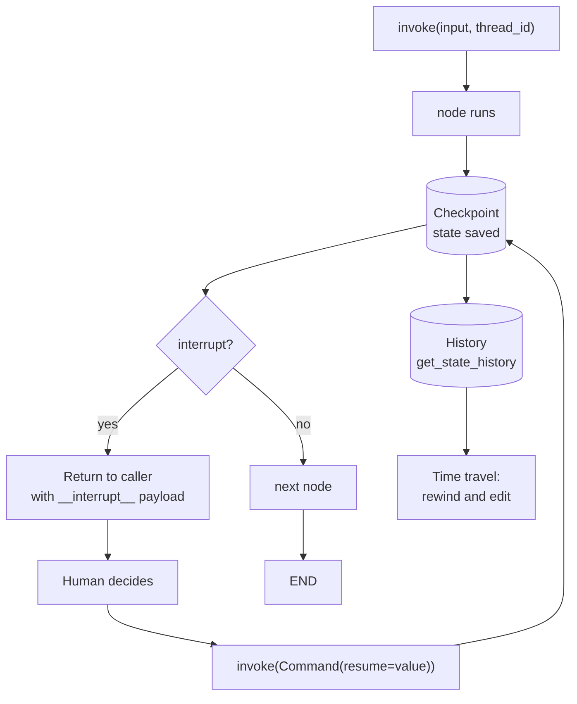

# LangGraph: Checkpoints, Interrupts, and Subgraphs

> **Interview answer (say this first).** A **checkpointer** saves the graph's state after every superstep, keyed by a `thread_id`, so a run can be inspected, resumed, or rewound. The **interrupt** primitive pauses inside a node and surfaces a payload to the caller; you resume by invoking the graph with `Command(resume=value)`. A **subgraph** is a compiled graph used as a node, with its own namespaced state. Checkpointing plus interrupts is exactly what makes human-in-the-loop approval and durable execution work. Verified with **langgraph 1.2.11**, **langgraph-checkpoint 4.2.0**, and **langgraph-checkpoint-sqlite 3.1.1**.

## Why this exists

A graph (the previous chapter) describes *what* an agent does. It does not survive a restart, and it cannot pause. Both are requirements for real agents.

- **Durable execution.** An agent that has run for thirty minutes and made twenty model calls must not restart from zero because a pod was rescheduled.
- **Human-in-the-loop.** A refund, a code change, or an email needs a person's approval. The agent must stop, wait — possibly for hours — and continue with that person's answer.
- **Inspection and debugging.** When a run ends in a surprising state, you want the history of every step, not just the final output.
- **Rewind and edit.** A production operator wants to correct one value and re-run from that point without redoing everything.

Without checkpoints, all four are impossible. The run lives in memory and is gone when the process ends.

The failing example is easy to picture:

```python
# A graph with no checkpointer:
graph.invoke({"messages": ["hello"], "plan": ["search", "draft"]})
# Process restarts, or the user closes the tab.
# The plan, the tool results, and forty minutes of work are gone.
```

Adding a checkpointer turns that run into a resumable object. Adding `interrupt` turns it into one that can wait for a person.

This matters for agentic AI because the expensive, high-value agents are exactly the long, stateful, approval-gated ones. The Project 2 workflow — plan, get approval, change code, open a pull request — is only possible because of the machinery on this page.

## Start from zero

| Word | Plain meaning |
| --- | --- |
| **Checkpointer** | An object that saves graph state after each superstep. In-memory for tests, SQLite/Postgres for production. |
| **Thread** | A named conversation or run. All checkpoints with the same `thread_id` belong to it. |
| **`thread_id`** | The string key that groups checkpoints. It is how you say "continue *this* run." |
| **Checkpoint** | One saved snapshot of the state, identified by a `checkpoint_id`. |
| **`checkpoint_ns`** | The namespace of a checkpoint. Empty for the top-level graph; namespaced for subgraphs. |
| **Time travel** | Loading an earlier checkpoint and re-running from it, optionally after editing the state. |
| **Interrupt** | A pause raised inside a node with `interrupt(payload)`. The run stops and the payload reaches the caller. |
| **Resume** | Continuing an interrupted run by invoking it with `Command(resume=value)`. |
| **`Command`** | A return value that can carry a state update, a resume value, and/or a `goto` target. |
| **Static interrupt** | `interrupt_before`/`interrupt_after` on `compile()`, which pauses around named nodes without editing them. |
| **Subgraph** | A compiled graph added as a node inside another graph. Its state is namespaced. |
| **Parallel branch** | Two nodes that become ready in the same superstep and run at the same time. |
| **Streaming mode** | What `stream()` yields each step: full `values`, `updates`, `custom`, or `messages`. |
| **Durable execution** | Saving each step so a crash resumes from the last one instead of the start. |
| **Human-in-the-loop (HITL)** | A person inspects or approves before the agent continues. |

Two distinctions worth pinning down:

- **Checkpointer vs interrupt** is *storage vs pause*. The checkpointer saves the run; the interrupt stops it on purpose.
- **Static vs dynamic interrupt** is *configuration vs code*. `interrupt_before` is a compile option; `interrupt()` is a call inside a node that can carry a payload.

## The core idea

Think of a video game. The **checkpointer** is the save system: it writes your position after every level, under a slot name (the `thread_id`). The **interrupt** is a cutscene that asks you a question and waits. When you answer, the game resumes from exactly where it paused.



The state is saved **after every superstep**, not only at the end. That is what makes resume cheap: at most one step is replayed. The cost is storage — a long run with a large state writes many checkpoints, so checkpointer choice and retention matter.

| Checkpointer | Lives in | Survives process restart? | Use it for |
| --- | --- | --- | --- |
| `InMemorySaver` | Process memory | No | Tests, notebooks, local demos |
| `SqliteSaver` | A SQLite file | Yes | Single-host prototypes and small services |
| `PostgresSaver` | PostgreSQL | Yes | Production, multi-worker |
| Custom / cloud saver | Your store | Yes | Managed platforms (for example, LangGraph Platform) |

`MemorySaver` is an alias of `InMemorySaver`, kept for older code.

## How it works

1. **Compile with a checkpointer.** `builder.compile(checkpointer=InMemorySaver())`. Without one, the graph runs but nothing is saved.
2. **Pass a `thread_id` on every call.** `config = {"configurable": {"thread_id": "refund-1"}}`. Missing it raises `ValueError`: *"Checkpointer requires one or more of the following 'configurable' keys: thread_id, checkpoint_ns, checkpoint_id"*
3. **After each superstep, write a checkpoint.** LangGraph stores the full state, the node that produced it, which nodes run next, and the parent checkpoint id.
4. **Read the current state.** `graph.get_state(config)` returns a `StateSnapshot` with `.values`, `.next`, `.config`, `.tasks`, and `.created_at`.
5. **Walk the history.** `graph.get_state_history(config)` yields snapshots newest-first for time travel and debugging.
6. **Interrupt inside a node.** `interrupt(payload)` raises a special signal. LangGraph saves the checkpoint, marks the interrupted node as next, and returns the state with an `__interrupt__` entry. The payload is a plain value (a dict works well).
7. **Resume with `Command`.** Invoke the same thread with `Command(resume=value)`. LangGraph restarts the interrupted node from its first line; when execution reaches the `interrupt(...)` call again, it returns `value` instead of pausing, and the node continues. Because the node restarts, any code before the `interrupt()` runs again on every resume and must be idempotent.
8. **Static interrupts gate a node.** `compile(interrupt_before=["b"])` pauses before `b`; resume by invoking with `None` on the same thread.
9. **Subgraphs run as nodes.** A compiled graph added with `add_node("sub", subgraph)` runs when the outer graph reaches it. It keeps its own namespaced state, and any keys it shares with the parent are propagated.
10. **Parallel branches share the superstep.** Branches run together and their updates merge through reducers at the boundary.
11. **Stream the run.** `stream()` with `stream_mode="updates"` shows each node's write, which is how a UI renders progress.
12. **Persist for the long term.** Swap `InMemorySaver` for `SqliteSaver` or `PostgresSaver`, and the same code resumes after a restart.

> **Note:**
>
> **Resume restarts the interrupted node from its first line.** When you pass `Command(resume=True)`, LangGraph re-runs the interrupted node from the top; the `interrupt(...)` call returns `True` when it is reached again, and execution continues from there. Code before the `interrupt()` does run again on every resume, so it must be idempotent. Put irreversible side effects after the `interrupt()` call and guard them with an idempotency key.


## The syntax you will use

**Compile with an in-memory checkpointer.** The standard starting point.

```python
from langgraph.checkpoint.memory import InMemorySaver

graph = builder.compile(checkpointer=InMemorySaver())
config = {"configurable": {"thread_id": "thread-1"}}
graph.invoke({"n": 1}, config)
```

**Read the current state.** `get_state` returns a snapshot object, not a plain dict.

```python
snapshot = graph.get_state(config)
snapshot.values     # {'n': 2}
snapshot.next       # () when finished, or e.g. ('approve',) when paused
snapshot.config     # includes the checkpoint_id
```

**Walk the history.** Newest first; each entry is a checkpoint you can inspect or rewind to. This example uses a two-node graph (`first` adds 1, `second` multiplies by 10) so the node names below have a definition.

```python
from typing import TypedDict
from langgraph.graph import StateGraph, START, END

class StepState(TypedDict):
    n: int

def first(state: StepState) -> dict:
    return {"n": state["n"] + 1}

def second(state: StepState) -> dict:
    return {"n": state["n"] * 10}

builder = StateGraph(StepState)
builder.add_node("first", first)
builder.add_node("second", second)
builder.add_edge(START, "first")
builder.add_edge("first", "second")
builder.add_edge("second", END)
graph = builder.compile(checkpointer=InMemorySaver())

config = {"configurable": {"thread_id": "history-1"}}
graph.invoke({"n": 1}, config)

for snap in graph.get_state_history(config):
    print(snap.next, snap.values)
# ()          {'n': 20}
# ('second',) {'n': 2}
# ('first',)  {'n': 1}
# ('__start__',) {}
```

**Persist to SQLite.** Install `langgraph-checkpoint-sqlite`; the same code then survives a process restart.

```python
import sqlite3
from langgraph.checkpoint.sqlite import SqliteSaver

conn = sqlite3.connect("checkpoints.sqlite", check_same_thread=False)
graph = builder.compile(checkpointer=SqliteSaver(conn))
# After a restart, a new connection sees the same thread and state.
```

**Interrupt inside a node.** The paused state carries `__interrupt__`, a list of `Interrupt` objects with `.value` and `.id`.

```python
from langgraph.types import interrupt

def approve(state):
    answer = interrupt({"question": "Approve refund?", "amount": state["amount"]})
    return {"approved": bool(answer)}
```

**Resume with `Command`.** The value becomes the return of the `interrupt(...)` call.

```python
from langgraph.types import Command

graph.invoke(Command(resume=True), config)   # answer the pending interrupt
```

**A static interrupt.** No node edits needed; the graph pauses before the named nodes.

```python
graph = builder.compile(checkpointer=InMemorySaver(), interrupt_before=["b"])
graph.invoke({"n": 0}, config)     # pauses with next == ('b',)
graph.invoke(None, config)         # resume
```

**A subgraph as a node.** Compile the inner graph, then add it like any node.

```python
subgraph = sub_builder.compile()

outer = StateGraph(State)
outer.add_node("double_it", subgraph)
outer.add_edge(START, "double_it")
outer.add_edge("double_it", END)
```

**Dynamic routing with `Command(goto=...)`.** A node can update state and choose the next node in one return value.

```python
def router(state):
    return Command(goto="email") if state["route"] == "email" else Command(goto="ticket")
```

**Rewind and edit.** `update_state` writes a new checkpoint on the thread; the next invoke continues from it.

```python
graph.update_state(config, {"n": 100})   # correct the state
graph.invoke(None, config)               # continue from the corrected state
```

## Examples: simple to real

**Example 1 — a run you can inspect.** With a checkpointer and a thread id, the state is queryable after the run.

```python
from typing import TypedDict
from langgraph.graph import StateGraph, START, END
from langgraph.checkpoint.memory import InMemorySaver

class Counter(TypedDict):
    n: int

def bump(state: Counter) -> dict:
    return {"n": state["n"] + 1}

builder = StateGraph(Counter)
builder.add_node("bump", bump)
builder.add_edge(START, "bump")
builder.add_edge("bump", END)
graph = builder.compile(checkpointer=InMemorySaver())

config = {"configurable": {"thread_id": "thread-1"}}
graph.invoke({"n": 1}, config)
graph.get_state(config).values   # {'n': 2}
```

**Example 2 — the history of a two-step run.** For the `first`/`second` graph from the history example above, newest first, ending with the empty input checkpoint.

```python
# ((), {'n': 20})          finished
# (('second',), {'n': 2})  paused-ready-to-run-second (the saved boundary)
# (('first',), {'n': 1})   input state
# (('__start__',), {})     before START
```

This is the data behind time travel: pick a `checkpoint_id`, optionally edit, and invoke from it.

**Example 3 — persistence across a restart.** Close the connection, reopen it, and the thread is intact.

```python
# process 1
conn = sqlite3.connect("checkpoints.sqlite", check_same_thread=False)
graph = builder.compile(checkpointer=SqliteSaver(conn))
graph.invoke({"n": 1}, {"configurable": {"thread_id": "durable-1"}})
conn.close()

# process 2 (after a restart)
conn = sqlite3.connect("checkpoints.sqlite", check_same_thread=False)
graph = builder.compile(checkpointer=SqliteSaver(conn))
graph.get_state({"configurable": {"thread_id": "durable-1"}}).values  # {'n': 2}
```

The graph definition is unchanged; only the checkpointer moved out of memory.

**Example 4 — human-in-the-loop approval.** The graph pauses inside `approve`, returns the question, and continues when the human answers.

```python
import operator
from typing import Annotated, TypedDict
from langgraph.graph import StateGraph, START, END
from langgraph.checkpoint.memory import InMemorySaver
from langgraph.types import interrupt, Command

class Refund(TypedDict):
    amount: int
    approved: bool
    log: Annotated[list[str], operator.add]

def prepare(state: Refund) -> dict:
    return {"log": ["prepared"]}

def approve(state: Refund) -> dict:
    answer = interrupt({"question": "Approve refund?", "amount": state["amount"]})
    return {"approved": bool(answer), "log": ["approved"]}

def pay(state: Refund) -> dict:
    return {"log": ["paid" if state["approved"] else "rejected"]}

builder = StateGraph(Refund)
builder.add_node("prepare", prepare)
builder.add_node("approve", approve)
builder.add_node("pay", pay)
builder.add_edge(START, "prepare")
builder.add_edge("prepare", "approve")
builder.add_edge("approve", "pay")
builder.add_edge("pay", END)
graph = builder.compile(checkpointer=InMemorySaver())
config = {"configurable": {"thread_id": "refund-1"}}

paused = graph.invoke({"amount": 500, "approved": False, "log": []}, config)
paused["__interrupt__"][0].value
# {'question': 'Approve refund?', 'amount': 500}
graph.get_state(config).next
# ('approve',)

resumed = graph.invoke(Command(resume=True), config)
# {'amount': 500, 'approved': True, 'log': ['prepared', 'approved', 'paid']}
```

This is the whole HITL pattern: pause with a payload, wait as long as you like, resume with the decision. Because the state is checkpointed, the pause can outlive the process.

**Example 5 — a static approval gate.** Sometimes you want to pause *around* a node without touching its code. This example is self-contained: `a` adds 1, `b` adds 10, and the graph runs `START -> a -> b -> END`.

```python
import operator
from typing import Annotated, TypedDict
from langgraph.graph import StateGraph, START, END
from langgraph.checkpoint.memory import InMemorySaver

class GateState(TypedDict):
    n: int
    log: Annotated[list[str], operator.add]

def a(state: GateState) -> dict:
    return {"n": state["n"] + 1, "log": ["a"]}

def b(state: GateState) -> dict:
    return {"n": state["n"] + 10, "log": ["b"]}

builder = StateGraph(GateState)
builder.add_node("a", a)
builder.add_node("b", b)
builder.add_edge(START, "a")
builder.add_edge("a", "b")
builder.add_edge("b", END)

config = {"configurable": {"thread_id": "gate-1"}}
graph = builder.compile(checkpointer=InMemorySaver(), interrupt_before=["b"])

graph.invoke({"n": 0, "log": []}, config)
# {'n': 1, 'log': ['a']}  and next == ('b',)
graph.invoke(None, config)
# {'n': 11, 'log': ['a', 'b']}
```

`interrupt_before` is an operator control: you can add a gate to a compiled graph without redeploying node logic. `interrupt()` inside a node is for data the node itself must collect.

**Example 6 — a subgraph and parallel branches together.** The inner graph runs as one node, and the outer graph runs two branches in parallel before joining.

```python
import operator
from typing import Annotated, TypedDict
from langgraph.graph import StateGraph, START, END

class State(TypedDict):
    n: int
    parts: Annotated[list[str], operator.add]

def sub_double(state: State) -> dict:
    return {"n": state["n"] * 2, "parts": ["sub"]}

sub = StateGraph(State)
sub.add_node("double", sub_double)
sub.add_edge(START, "double")
sub.add_edge("double", END)

def left(state: State) -> dict:
    return {"parts": ["left"]}

def right(state: State) -> dict:
    return {"parts": ["right"]}

def join(state: State) -> dict:
    return {"parts": ["joined"]}

outer = StateGraph(State)
outer.add_node("double_it", sub.compile())   # a compiled graph used as a node
outer.add_node("left", left)
outer.add_node("right", right)
outer.add_node("join", join)
outer.add_edge(START, "double_it")
outer.add_edge(START, "left")
outer.add_edge(START, "right")
outer.add_edge("double_it", "join")
outer.add_edge("left", "join")
outer.add_edge("right", "join")
outer.add_edge("join", END)
outer.compile().invoke({"n": 5, "parts": []})
# {'n': 10, 'parts': ['sub', 'left', 'right', 'joined']}
# the order of 'sub', 'left', 'right' may vary between runs
```

Subgraphs keep their own state namespace, so a shared key like `n` propagates to the parent, while a key only the subgraph defines stays local.

## In production

- **Pick the checkpointer for the durability you need.** `InMemorySaver` is for tests only; a restart erases it. Use `SqliteSaver` for a single host and `PostgresSaver` when several workers must share threads.
- **`thread_id` is your tenancy and idempotency boundary.** Two users must never share a thread id. Derive it from stable data (tenant + workflow + business id) so a retried submit lands on the same thread instead of starting a twin run.
- **A missing `thread_id` is a hard `ValueError`.** Compiling with a checkpointer but invoking without one fails immediately; wrap `invoke` so the config is always present.
- **Checkpoints grow with state size and step count.** Large message histories written every superstep add up. Trim or summarise messages inside the graph, and set a retention policy on the checkpoint store.
- **Interrupts are not transactions, and resume restarts the node.** On resume, the interrupted node replays from its first line and `interrupt()` returns the resume value when reached again. Any side effect before the `interrupt()` runs again on every resume, so put irreversible effects after the `interrupt()` call and guard them with an idempotency key, because a resume can itself be retried.
- **Do not put non-deterministic work before an interrupt.** Because the interrupted node restarts from the top on resume, code before the `interrupt()` re-runs and can produce a different value than the first pass. Capture timestamps and random values in state before the interrupt if replay must be stable.
- **Subgraph state is namespaced; shared keys propagate and private keys do not.** If the parent must see a result, declare that key in both schemas. Reading subgraph state directly needs the `checkpoint_ns` from the parent snapshot's tasks.
- **Static interrupts are coarse.** `interrupt_before` pauses at a node boundary, so it cannot ask a question mid-node. Use `interrupt()` for payloads and `interrupt_before` for operator gates.
- **`stream_mode` affects only observation.** `updates` is the right default for progress; `values` sends the whole state each step and can be heavy; `custom` needs `get_stream_writer()` inside nodes; `messages` is for chat tokens.
- **Parallel branch order is not guaranteed.** The merged list order depends on scheduling, not source order. Sort explicitly downstream if order matters.
- **SQLite needs `check_same_thread=False` or a per-thread connection.** The saver may be touched from more than one thread; the wrong connection mode raises `ProgrammingError`.
- **Time travel can fork a run.** `update_state` writes a new checkpoint on the thread; invoking again continues from it and may branch differently. Treat it as a privileged operator action with an audit trail.

## Interview questions

### 1. What does a checkpointer do, and why is a `thread_id` required?

**Answer.** A checkpointer saves the graph state after every superstep and assigns each snapshot a `checkpoint_id`. The `thread_id` groups those snapshots into one logical run, so a later call can load, inspect, or resume that run. Without a thread id there is no way to know which saved run you mean, which is why passing one is mandatory once a checkpointer is configured.

**Follow-up: "In-memory vs persistent?"** `InMemorySaver` is fast but dies with the process and is for tests. `SqliteSaver` and `PostgresSaver` write to disk or a database, so runs survive restarts and can be shared across workers.

**Trap.** Saying a checkpointer is caching. It is durable state, not a performance cache, and it stores every step, not just the latest value.

### 2. How does `interrupt()` work, and how do you resume?

**Answer.** `interrupt(payload)` pauses execution inside a node, saves a checkpoint, and returns the state with an `__interrupt__` entry containing the payload. You resume by invoking the same thread with `Command(resume=value)`. LangGraph restarts the interrupted node from its first line; when execution reaches the `interrupt(...)` call again, that call returns `value` and the node continues. Because the node restarts, code before the interrupt runs again on every resume and must be idempotent.

**Follow-up: "How long can the pause last?"** As long as the checkpoint is retained. It can be seconds or days, and it can span a process restart, because the state is on disk in production.

**Trap.** Assuming `interrupt()` resumes mid-function. LangGraph restarts the interrupted node from the top, and `interrupt()` returns the resume value when it is reached again, so code before the interrupt re-runs on every resume and must be idempotent.

### 3. `interrupt()` versus `interrupt_before` — when do you use each?

**Answer.** `interrupt()` lives in the node and can carry a payload — the question, the amount, the diff — so it is for data the node must collect from a human. `interrupt_before=["node"]` is a compile-time option that pauses at a node boundary without editing the node, so it is for operator gates and debugging. One is application logic; the other is operational control.

**Follow-up: "How do you resume a static interrupt?"** Invoke the thread with `None` as input; the graph continues from the saved boundary.

**Trap.** Thinking `interrupt_before` can ask a question. It only stops; it carries no payload and no decision logic.

### 4. What is a subgraph and how does its state relate to the parent's?

**Answer.** A subgraph is a compiled graph added as a node in another graph. It runs like a node but keeps its own namespaced state. Keys that exist in both the parent and child schemas are propagated between them; keys only the child defines stay inside the child. This lets you build and test a reusable sub-flow independently and then compose it.

**Follow-up: "Why namespace it?"** So two subgraphs can use the same key names without colliding, and so the parent history stays readable. The namespace also makes it possible to read a subgraph's state directly for debugging.

**Trap.** Expecting a private subgraph key to appear in the parent result. If the parent needs it, declare it in both state schemas.

### 5. How do checkpoints enable durable execution?

**Answer.** Because the state is saved after every superstep, a crash loses at most the work since the last checkpoint. On restart, the same thread loads its last snapshot and continues from the saved `next` nodes instead of from the beginning. Combined with idempotent steps and a persistent saver, this is what makes a long agent run survivable.

**Follow-up: "What can still break replay?"** Non-deterministic steps. If a node branches on the current time or a random sample, a replay can take a different path. Capture those values in the checkpointed state so replay is deterministic.

**Trap.** Claiming durable execution means exactly-once effects. It gives at-most-one-step replay, and side effects still need idempotency keys.

### 6. How do parallel branches behave with a checkpointer?

**Answer.** Nodes ready in the same superstep run in parallel, and their state updates merge through the reducers when the superstep ends. Each branch's result is part of the same checkpoint. Order across branches is not guaranteed, so keys with `operator.add` may interleave; sort or key explicitly if order matters.

**Follow-up: "How do you see branch progress?"** `stream(..., stream_mode="updates")` yields each node's write as it completes, so the UI can show which branch finished.

**Trap.** Expecting one branch to see another's update. Branches in the same superstep only see the state as of the start of that superstep.

### 7. What are the streaming modes and when do you use each?

**Answer.** `"values"` yields the full state after each step, for a UI that renders everything. `"updates"` yields only each node's changes, for progress. `"custom"` yields whatever nodes emit via `get_stream_writer()`, for tool logs and token streams. `"messages"` yields chat model token chunks. Streaming changes observation only; execution is identical.

**Follow-up: "Why not always use `values`?"** Large states make `values` expensive to serialise and send on every step. `updates` is usually the better default.

**Trap.** Thinking streaming implies durable execution. Streaming is transport; durability comes from the checkpointer.

### 8. How would you design a human approval step for a high-risk action?

**Answer.** Put the action in its own node after an approval node. The approval node calls `interrupt()` with a payload describing the exact action and its impact. The caller surfaces that to a human, then resumes the same thread with `Command(resume=approved)`. The action node runs only on approval and uses an idempotency key so a retried resume cannot execute it twice. Checkpoints let the pause survive restarts, and an audit log records who approved what and when.

**Follow-up: "What if nobody ever answers?"** Add a timeout or expiry job that resumes the thread with a rejection, and alert on threads that have been paused too long, so approval queues do not silently fill up.

**Trap.** Performing the side effect before the interrupt, or making the action node non-idempotent. Both turn a normal retry into a duplicate charge, email, or pull request.

## Remember this

- **A checkpointer saves state after every superstep, keyed by `thread_id`; without a `thread_id` the call fails.**
- **`interrupt(payload)` pauses and returns `__interrupt__`; `Command(resume=value)` continues the same thread.**
- **`interrupt_before` is a compile-time gate; `interrupt()` is in-node logic with a payload.**
- **Subgraphs are compiled graphs used as nodes, with namespaced state and shared keys propagated.**
- **Checkpoints are the foundation of durable execution, time travel, and human-in-the-loop approval.**
