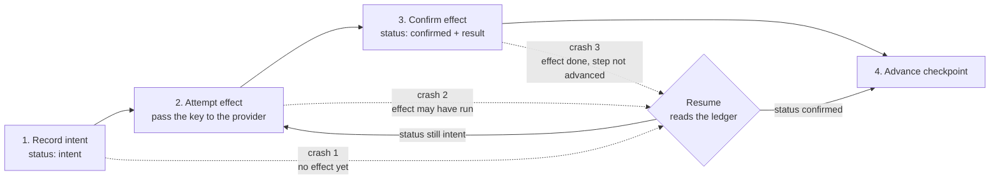

# Side-Effect Safety, Replay, and Idempotency

> **Interview answer (say this first).** A **side effect** is any change outside the agent's own memory: a commit, a comment, a pull request, a charge. Delivery over a network is **at-least-once**, so a crash, retry, or replay can fire the same effect twice. What you build is exactly-once **effect**: record the intent durably *before* the effect, derive a deterministic **idempotency key** from the run id, step, and a canonical hash of the payload, pass that key to the external system, and on resume look the key up in an **effect ledger** before re-executing. Confirm completion *after* the effect, advance the checkpoint, and use **compensation** when an effect cannot be undone. Bind every approval to a payload hash so a mutated payload is refused.

## Why this exists

An agent is asked to review a repository and open a pull request with a fix. The obvious implementation holds everything in memory and calls the world directly.

```python
def review_repo(repo: str) -> None:
    files = read_files(repo)
    patch = propose_patch(files)
    commit_and_push(repo, patch)      # side effect 1
    open_pull_request(repo, patch)    # side effect 2
    post_comment(repo, "PR opened")   # side effect 3
```

It works in a notebook. In production the worker is killed after `open_pull_request` returns but before the checkpoint that records "PR opened" reaches disk. The supervisor restarts the run and resumes from the last checkpoint, which still says the PR is pending. The agent opens a **second pull request** for one task. A reviewer now sees two PRs, two branches, and two comment threads. Nobody can tell which one is real.

The same window appears in every system that retries:

- A queue redelivers a message because the acknowledgement was lost, and a card is charged twice.
- A deploy restarts the worker mid-task, and the same notification email is sent to every customer.
- A model reruns a tool after a timeout, and a duplicate row appears in the ledger.

Retrying is necessary for reliability. Retrying is also what duplicates side effects, because a retry cannot tell "the step never ran" from "the step ran and the process died before recording it." **Side-effect safety exists to make retry, replay, and resume safe.**

> **Note:**
>
> **The one-sentence purpose.** Record the intent to act before you act, give every effect a stable key so a repeat is recognisable, confirm after the act, and compensate when you cannot undo.

## Start from zero

| Word | Plain meaning |
| --- | --- |
| **Side effect** | A change outside the agent's own memory: writing a file, posting a comment, opening a PR, charging a card, sending mail. |
| **Effect intent vs effect completion** | The intent is the durable record "we are about to do X". The completion is the durable record "X succeeded, here is the result". They are two different rows, and the gap between them is the dangerous window. |
| **Idempotency** | Doing the same operation twice has the same effect as doing it once. |
| **Idempotency key** | A stable value that names one intended effect, so a repeat can be recognised and skipped. |
| **At-least-once delivery** | A message or request is delivered one or more times. The practical default over a network. |
| **At-most-once delivery** | Delivered zero or one time. The risk is that it never arrives. |
| **Exactly-once effect** | The effect is applied once, built as at-least-once delivery plus idempotent handling. Exactly-once *delivery* is not achievable over an unreliable network. |
| **Deduplication** | Recognising a repeat by its key and ignoring it, or returning the stored result instead of repeating the work. |
| **Effect ledger** | A durable table of effects: intent id, key, status, result, lease. It is the memory that makes resume safe. |
| **Lease** | A time-limited claim on one unit of work, so only one worker performs it at a time. |
| **Micro-lease** | A very short lease (seconds) held just around one effect attempt, renewed by a heartbeat. Small enough that a dead worker releases it quickly. |
| **Checkpoint** | A durable snapshot of run state at a step, so a restart resumes instead of starting over. |
| **Replay** | Re-executing steps from a recorded history, usually to rebuild state after a crash. |
| **Resume** | Loading the latest checkpoint and continuing from the next step. |
| **Compensation / saga** | An action that offsets a completed effect you cannot undo (refund, cancel, reverse). A saga is a long transaction built from local steps, each with a compensating action. It is *not* rollback. |
| **Transactional outbox** | Writing the intent to act into the same database transaction as the state change, then performing the effect from the outbox. |
| **Approval payload binding** | Tying an approval to a hash of the exact payload that was approved, so a later mutation no longer matches and is refused. |
| **Replay attack** | Reusing a recorded request, approval, or signed message to cause a second effect, or an attacker replaying a captured approval. |

Two distinctions carry the topic.

**Intent is not completion.** "We intended to post the comment" and "the comment was posted" are different facts with different recovery actions. Collapsing them into one flag is where duplicates come from.

**Compensation is not rollback.** A database rollback erases a transaction and pretends it never happened. A compensation is a *new* effect that offsets the old one. The money moved; you move it back and record both movements.

## The core idea

Think of a **cheque book with numbered slips**. Before you hand over money, you write the cheque number, the payee, and the amount in your stub book. Only then do you tear out the cheque. If the cheque is lost, the stub tells you it was written; if it clears twice, the bank sees the same number and refuses the second one. The stub is the intent. The bank's clearing is the completion.

The state machine is small. Four transitions and three crash points.



The rule to memorise is the order of transitions 1 and 3:

> **Record intent before the effect; confirm after.**

Crash 1 is safe: the effect never ran, so re-attempting it is correct. Crash 3 is safe: the ledger already says confirmed, so resume returns the stored result and skips the effect. Crash 2 is the hard one. The effect may have run, but the process died before recording it. You cannot fix crash 2 by ordering alone, because the effect and the record live in different systems. You fix it by giving the external system the same key, so a repeated attempt is deduplicated on its side.

How the guarantees compare:

| Guarantee | What can happen | How you build it |
| --- | --- | --- |
| **At-most-once delivery** | The effect happens zero or one time. It may be silently lost. | Never retry. Rarely acceptable. |
| **At-least-once delivery** | The effect happens one or more times. Duplicates are possible. | Retry until acknowledged. The network default. |
| **Exactly-once effect** | The effect is applied once, even though delivery repeats. | At-least-once delivery plus a stable key, a ledger, and provider-side deduplication. |

## How it works

1. **Assign a run id and number the steps.** Every intent, ledger row, checkpoint, and log line carries the same `run_id` and a step name. Without stable ids there is nothing to deduplicate against.
2. **Build the payload, then freeze it.** Serialise the exact arguments the effect will use. A payload that changes between attempts changes the key, and deduplication stops working.
3. **Derive the idempotency key deterministically.** Use the run id, the step, and a canonical hash of the payload: `github.comment:run-7:post:52b630e3f5c908e9`. The same intent must always produce the same key, on any worker, after any restart.
4. **Write the intent durably before the effect.** Insert a ledger row with `status = 'intent'`. This is the cheque stub. Use `INSERT ... ON CONFLICT DO NOTHING` so two workers racing produce exactly one row.
5. **Take a lease on the effect.** Claim the row with a short expiry, so a concurrent worker cannot also perform it. A micro-lease is held only for the duration of one attempt and renewed if the attempt is slow.
6. **Pass the key to the external system.** A provider that supports idempotency keys (payments, some APIs) will refuse or replay a repeat with the same key. If the provider does not support keys, use a deduplication window on your side: keep the key and result for as long as a repeat can arrive.
7. **Perform the effect, then confirm.** On success, update the row to `status = 'confirmed'` with the result. Confirmation is a separate durable write. Do not mark it done before the effect succeeds, or a crash loses the effect.
8. **Advance the checkpoint.** Only after the effect is confirmed does the run move past the step. If you advance first and then crash, resume skips an effect that never happened.
9. **On resume, read the ledger before re-executing.** Load the latest checkpoint, then for each pending effect look up its key. `confirmed` means return the stored result and skip. `intent` means re-attempt with the same key. No row means record the intent and perform it.
10. **Compensate when you cannot undo.** If a later step fails and an earlier effect is irreversible, run a compensating action (refund, cancel, reverse) and mark the row `compensated`. Do not pretend the original effect never happened.
11. **Bind approvals to the payload hash.** When a human approves an action, store a hash of the exact approved payload. Before executing, recompute the hash of the arguments and refuse on mismatch. This is what stops a mutated or replayed payload from executing under an old approval.
12. **Reconcile and audit.** Periodically compare the ledger against the external system: rows marked `confirmed` with no matching external object, or external objects with no row. Reconciliation catches the crashes inside the atomicity window.

> **Warning:**
>
> **The atomicity window.** If the effect and the record of it are in different systems, a crash between them either repeats the effect or loses it. You cannot remove the window with ordering alone. You close it with a key the external system honours, or with a reconciliation job that compares the two sides.

## The syntax you will use

**A payload hash with a canonical encoding.** Sorting the keys and removing whitespace makes the hash stable across processes and dictionary orderings.

```python
import hashlib, json
from collections.abc import Mapping

def payload_hash(payload: Mapping[str, object]) -> str:
    # Require JSON-native types. A silent str() fallback is not deterministic:
    # set order and object reprs vary between processes.
    canonical = json.dumps(dict(payload), sort_keys=True, separators=(",", ":"), allow_nan=False)
    return hashlib.sha256(canonical.encode()).hexdigest()
```

**An `EffectIntent` with a stable key.** The payload is frozen in `__post_init__`, so a caller cannot mutate it after the key is derived — `frozen=True` alone would not stop `intent.payload["body"] = ...`. `intent_id` names the step in the run; `key` names the effect for the provider.

```python
from dataclasses import dataclass
from types import MappingProxyType

@dataclass(frozen=True)
class EffectIntent:
    run_id: str
    step: str
    kind: str
    payload: Mapping[str, object]

    def __post_init__(self) -> None:
        # Freeze the mapping so the derived key cannot change afterwards.
        object.__setattr__(self, "payload", MappingProxyType(dict(self.payload)))

    @property
    def intent_id(self) -> str:
        return f"{self.run_id}:{self.step}:{self.kind}"

    @property
    def key(self) -> str:
        digest = payload_hash(self.payload)[:16]
        return f"{self.kind}:{self.run_id}:{self.step}:{digest}"
```

Reordering the dictionary does not change the key, because the hash is canonicalised. Changing the body does.

```python
a = EffectIntent("run-7", "post", "github.comment",
                 {"repo": "acme/app", "issue": 12, "body": "Deploy done"})
b = EffectIntent("run-7", "post", "github.comment",
                 {"body": "Deploy done", "issue": 12, "repo": "acme/app"})
print(a.key == b.key, a.key)
```

Illustrative output:

```text
True github.comment:run-7:post:52b630e3f5c908e9
```

**The effect ledger, in SQL.** The unique `key` is the durable deduplication lock; the `intent_id` identifies the step that owns the effect.

```sql
CREATE TABLE effect_ledger (
    intent_id     TEXT PRIMARY KEY,          -- run-7:post:github.comment
    key           TEXT NOT NULL UNIQUE,      -- github.comment:run-7:post:52b630e3f5c908e9
    status        TEXT NOT NULL,             -- intent | confirmed | compensated
    result        JSONB,
    lease_owner   TEXT,
    lease_expires TIMESTAMPTZ
);

-- Record the intent before the effect. 0 rows inserted means it is already known.
INSERT INTO effect_ledger (intent_id, key, status)
VALUES ($1, $2, 'intent')
ON CONFLICT (key) DO NOTHING;
```

**Record an intent, in Python (SQLite form).** `rowcount == 1` means this worker created the row; `0` means the effect is already in the ledger.

```python
import sqlite3

def open_ledger() -> sqlite3.Connection:
    conn = sqlite3.connect(":memory:")
    conn.execute(
        "CREATE TABLE effect_ledger ("
        " intent_id TEXT PRIMARY KEY,"
        " key TEXT NOT NULL UNIQUE,"
        " status TEXT NOT NULL,"
        " result TEXT,"
        " lease_owner TEXT,"
        " lease_expires TEXT)")
    return conn

def record_intent(conn: sqlite3.Connection, intent: EffectIntent) -> bool:
    cur = conn.execute(
        "INSERT INTO effect_ledger (intent_id, key, status) VALUES (?, ?, 'intent') "
        "ON CONFLICT(key) DO NOTHING",
        (intent.intent_id, intent.key))
    conn.commit()
    return cur.rowcount == 1
```

**A lease with an expiry.** The `UPDATE` only matches a row that is unowned or whose lease has expired, so a dead worker cannot block work for ever. `0` rows updated means someone else holds it.

```python
from datetime import datetime, timedelta, timezone

def claim_lease(conn, key: str, owner: str, ttl_s: int = 30) -> bool:
    now = datetime.now(timezone.utc)
    expires = (now + timedelta(seconds=ttl_s)).isoformat()
    cur = conn.execute(
        "UPDATE effect_ledger SET lease_owner = ?, lease_expires = ? "
        "WHERE key = ? AND status = 'intent' "
        "AND (lease_owner IS NULL OR lease_expires < ?)",
        (owner, expires, key, now.isoformat()))
    conn.commit()
    return cur.rowcount == 1
```

In Postgres, use a `TIMESTAMPTZ` column so `lease_expires < now()` compares real timestamps rather than strings.

**Confirm the effect and store its result.**

```python
import json

def confirm(conn, key: str, result: dict) -> None:
    conn.execute(
        "UPDATE effect_ledger SET status = 'confirmed', result = ?, "
        "lease_owner = NULL, lease_expires = NULL WHERE key = ?",
        (json.dumps(result), key))
    conn.commit()
```

**A resume function that checks the ledger.** This is the heart of the page. It records the intent if unseen, returns the stored result if confirmed, and otherwise takes a lease and performs the effect with the key.

```python
from typing import Callable

def perform_once(conn, intent: EffectIntent, owner: str,
                 effect: Callable[[EffectIntent], dict]) -> dict:
    row = conn.execute(
        "SELECT status, result FROM effect_ledger WHERE key = ?", (intent.key,)
    ).fetchone()
    if row is None:
        record_intent(conn, intent)
    elif row[0] == "confirmed":
        return json.loads(row[1])          # replay: return the recorded result
    elif row[0] == "compensated":
        return {"status": "compensated"}   # reversed earlier; do not re-run
    if not claim_lease(conn, intent.key, owner):
        return {"status": "lease_held"}    # another worker owns this effect
    result = effect(intent)                # the real side effect
    confirm(conn, intent.key, result)
    return result
```

**Compensate an effect that cannot be undone.** Claim the row atomically *before* the compensation runs, so two workers cannot both reverse the same effect.

```python
def compensate(conn, key: str, compensation: Callable[[], None]) -> str:
    cur = conn.execute(
        "UPDATE effect_ledger SET status = 'compensated' "
        "WHERE key = ? AND status = 'confirmed'",
        (key,))
    conn.commit()
    if cur.rowcount != 1:
        return "nothing to compensate"     # already compensated, or never confirmed
    compensation()                         # the real reversal
    return "compensated"
```

If the compensation is itself fallible or expensive, treat it as another durable effect: mark `compensating` with a lease first, perform it, then mark `compensated`. A crash between the claim and the reversal must be retryable, not silently lost.

**Payload-hash comparison for approvals.** An approval stores the hash of what the human saw. Execution recomputes the hash of what it is about to run. A mismatch is a refusal, not a warning.

```python
@dataclass(frozen=True)
class Approval:
    run_id: str
    step: str
    payload_sha256: str
    approver: str
    approved_at: str
    expires_at: str | None = None

def approve(run_id: str, step: str, payload: Mapping[str, object],
            approver: str, approved_at: str,
            expires_at: str | None = None) -> Approval:
    return Approval(
        run_id=run_id, step=step, payload_sha256=payload_hash(payload),
        approver=approver, approved_at=approved_at, expires_at=expires_at,
    )

def execute_approved(intent: EffectIntent, approval: Approval, now: str) -> str:
    if (intent.run_id, intent.step) != (approval.run_id, approval.step):
        raise ValueError("approval is for a different run or step")
    if approval.expires_at is not None and now > approval.expires_at:
        raise ValueError("approval has expired")
    if payload_hash(intent.payload) != approval.payload_sha256:
        raise ValueError("approved payload does not match the payload to execute")
    return "executed"
```

> **Warning:**
>
> **Bind the approval to the payload, the run, and the step.** Storing `step="refund"` and trusting it proves nothing; anyone can reuse that approval for a different amount. The payload hash makes it non-transferable, the run and step checks stop an old approval being replayed into a different run, and an expiry stops a stale approval being used at all. Record who approved it and when, or the audit trail is incomplete.

## Examples: simple to real

**Example 1 — the naive post duplicates on retry.** This is the default behaviour of every retry system.

```python
comments: list[str] = []
comments.append("Deploy done")          # first attempt
comments.append("Deploy done")          # the retry after a crash, no memory
print("comments:", len(comments))
```

Illustrative output:

```text
comments: 2
```

The function had no way to know the first call already happened, so the retry posted again.

**Example 2 — the same effect made idempotent with a key and a ledger.** The provider stores results by key and returns the stored value on a repeat.

```python
class GitHub:
    def __init__(self) -> None:
        self.comments: list[str] = []
        self._by_key: dict[str, dict] = {}

    def post_comment(self, key: str, body: str) -> dict:
        if key in self._by_key:
            return self._by_key[key]            # provider-side dedupe
        comment = {"id": len(self.comments) + 1, "body": body}
        self.comments.append(body)
        self._by_key[key] = comment
        return comment

conn = open_ledger()
gh = GitHub()
intent = EffectIntent("run-7", "post", "github.comment",
                      {"repo": "acme/app", "issue": 12, "body": "Deploy done"})
effect = lambda i: gh.post_comment(i.key, i.payload["body"])
print(perform_once(conn, intent, "worker-a", effect))
print(perform_once(conn, intent, "worker-a", effect))
print("comments:", gh.comments)
```

Illustrative output:

```text
{'id': 1, 'body': 'Deploy done'}
{'id': 1, 'body': 'Deploy done'}
comments: ['Deploy done']
```

The second call found `status = 'confirmed'` in the ledger and returned the stored result without calling the provider. The effect happened once.

**Example 3 — a crash between intent and confirmation, resumed without a duplicate.** This is crash point 2, the hard one. The intent row exists, the effect ran, but the worker died before confirming.

```python
conn = open_ledger()
gh = GitHub()
intent = EffectIntent("run-8", "post", "github.comment",
                      {"repo": "acme/app", "issue": 13, "body": "Two"})
record_intent(conn, intent)
gh.post_comment(intent.key, "Two")                 # the effect ran
# worker dies here, before confirm(...)
print("after crash, comments:", gh.comments)
resumed = perform_once(conn, intent, "worker-b",
                       lambda i: gh.post_comment(i.key, i.payload["body"]))
print("resumed:", resumed, "| comments:", len(gh.comments))
```

Illustrative output:

```text
after crash, comments: ['Two']
resumed: {'id': 1, 'body': 'Two'} | comments: 1
```

Resume saw `status = 'intent'` (not `confirmed`), so it could not be sure whether the effect ran. It re-attempted with the **same key**, and the provider recognised the key and returned the existing comment instead of creating a second one. The ledger alone cannot close this window; the key passed to the provider does.

**Example 4 — a mutated approval payload is refused.** The human approved $49.99. The agent later tries to execute $4,999.00 under the same approval.

```python
approval = approve("run-9", "refund", {"order": "A-1002", "amount": 49.99},
                   approver="dana", approved_at="2026-09-14T10:00:00Z")
good = EffectIntent("run-9", "refund", "payments.refund",
                    {"order": "A-1002", "amount": 49.99})
bad = EffectIntent("run-9", "refund", "payments.refund",
                   {"order": "A-1002", "amount": 4999.00})
now = "2026-09-14T10:05:00Z"
print("good:", execute_approved(good, approval, now))
try:
    execute_approved(bad, approval, now)
except ValueError as exc:
    print("mutated refused:", exc)

stolen = EffectIntent("run-999", "refund", "payments.refund",
                      {"order": "A-1002", "amount": 49.99})   # same payload, different run
try:
    execute_approved(stolen, approval, now)
except ValueError as exc:
    print("wrong run refused:", exc)
```

Illustrative output:

```text
good: executed
mutated refused: approved payload does not match the payload to execute
wrong run refused: approval is for a different run or step
```

The hash is the binding for the payload; the run and step checks stop the same approval being replayed somewhere else. A replayed approval, a buggy edit, or a prompt-injected payload all fail the same way.

**Example 5 — compensation for an effect that cannot be undone.** The order already shipped. The workflow then fails, and the correct response is a refund, not a rewrite of history.

```python
conn = open_ledger()
ship = EffectIntent("run-10", "ship", "orders.ship", {"order": "A-77"})
record_intent(conn, ship)
confirm(conn, ship.key, {"tracking": "TRK-1"})
refunds: list[str] = []
print(compensate(conn, ship.key, lambda: refunds.append("A-77")))
print("refunds:", refunds)
print("again:", compensate(conn, ship.key, lambda: refunds.append("A-77")))
```

Illustrative output:

```text
compensated
refunds: ['A-77']
again: nothing to compensate
```

The shipping effect is not deleted. A new effect offsets it, and the ledger records both. The `compensated` status makes the compensation itself idempotent, so a retry does not refund twice.

**Example 6 — a lease stops a second worker, and expiry frees a dead one.** Two workers try to own the same effect. The first holds the lease; the second is refused until the lease expires.

```python
conn = open_ledger()
intent = EffectIntent("run-11", "charge", "payments.charge", {"order": "A-88"})
record_intent(conn, intent)
print("worker-a lease:", claim_lease(conn, intent.key, "a", ttl_s=30))
print("worker-b lease:", claim_lease(conn, intent.key, "b", ttl_s=30))
past = (datetime.now(timezone.utc) - timedelta(seconds=1)).isoformat()
conn.execute("UPDATE effect_ledger SET lease_expires = ? WHERE key = ?",
             (past, intent.key))
conn.commit()
print("worker-b after expiry:", claim_lease(conn, intent.key, "b", ttl_s=30))
```

Illustrative output:

```text
worker-a lease: True
worker-b lease: False
worker-b after expiry: True
```

Worker A's lease is a micro-lease: short, renewable, and released on confirmation. When A dies, the expiry lets B take over, so work is not blocked for ever but is also not performed twice at the same time.

Here is how each crash point should be handled:

| Crash point | Ledger state | Resume action | Risk if unguarded |
| --- | --- | --- | --- |
| Before intent is written | no row | Nothing ran; perform normally | None |
| After intent, before effect | `intent` | Re-attempt with the same key | None if the key is honoured |
| After effect, before confirm | `intent` | Re-attempt with the same key; provider dedupes | Duplicate if the provider ignores the key |
| After confirm, before checkpoint | `confirmed` | Return the stored result; skip the effect | None |
| During compensation | `confirmed` | Compensate again; the action must be idempotent | Duplicate refund if not guarded |

## In production

- **Delivery is at-least-once, so effects must be idempotent.** Assume every request can arrive again. Design the effect so a repeat is either refused or harmless.
- **Never rely on the model to avoid duplicates.** The model cannot see whether a previous attempt succeeded, and a prompt is a suggestion, not a guarantee. Deduplication lives in deterministic code around the tool.
- **Keys must be deterministic and stable across retries.** Derive them from the run id, step, and a canonical payload hash. A key that includes a timestamp, a random uuid, or a retry counter defeats deduplication by design.
- **Record the intent before the effect.** Write the cheque stub first. If you record only after success, a crash in between loses the effect; if you confirm before acting, a crash loses the effect silently.
- **A ledger row beats an in-memory flag.** A set in a process dies with the process and is invisible to other workers. The durable row is what survives a restart and a second machine.
- **Leases need an expiry, so a dead worker does not block work for ever.** A short lease plus a heartbeat keeps the blocking time bounded. Prefer a micro-lease around one attempt over a long lease around a whole run.
- **Approvals must bind to content, not to a step name.** Store the hash of the exact approved payload and recompute it before executing. A mismatch is a refusal.
- **Compensation is not rollback.** An irreversible effect is offset by a new effect, and both are recorded. Make the compensation itself idempotent and keyed, or a retry refunds twice.
- **External systems need their own idempotency support, or a dedup window.** Pass the key if the provider honours one. If it does not, keep the key and result for at least as long as a repeat can arrive, and reconcile the two sides.
- **Replays must be safe to run twice.** Replaying a run should observe completed effects and skip them. Never re-invoke a non-idempotent effect during replay; return the recorded result instead.
- **Audit every effect.** Record who or what caused it, the run and step, the key, the payload hash, the result, and the timestamps. In an incident review, the ledger is the evidence.
- **Forget deduplication keys eventually.** The deduplication table grows without bound. Keep keys long enough to cover the maximum retry and replay horizon, then archive or expire them deliberately.

## Interview questions

### 1. What does exactly-once mean, and why can't you get exactly-once delivery?

**Answer.** Exactly-once delivery is impossible over an unreliable network: a message can be lost after the receiver acts but before the sender learns it, and a sender that retries can always produce a second copy. What you build instead is exactly-once **effect**. Deliver at least once, give each intended effect a stable key, and make the receiver idempotent so a repeat is recognised and skipped. The guarantee is on the outcome, not on the wire.

**Follow-up: "Where does the guarantee actually live?"** On the receiving side, in the ledger and the provider's key handling. The sender can only promise to retry; the receiver decides whether a repeat is a new effect or the same one.

**Trap.** Claiming a framework gives exactly-once. Frameworks give at-least-once plus helpers. The idempotency is still your design.

### 2. How do you derive an idempotency key, and what makes a bad one?

**Answer.** Derive it from stable facts about the one intended effect: the run id, the step, and a canonical hash of the payload. The same intent must produce the same key on any worker and after any restart. A good key is deterministic, unique per intended effect, and short enough to send to the provider.

**Follow-up: "What is the payload hash for?"** It makes the key change when the arguments change, so two genuinely different effects do not collide, while a retry of the same effect reuses the key. Canonicalise the encoding with sorted keys so dictionary order does not change the hash.

**Trap.** A random uuid or an auto-increment id generated per attempt. Each retry gets a new key, the provider sees a new effect, and the duplicate still happens.

### 3. What is the crash window between intent and confirmation, and how do you close it?

**Answer.** The window is the gap between performing the effect and recording that it succeeded. The effect and the record live in different systems, so no ordering removes the window. You close it with the transactional outbox pattern — write the intent in the same transaction as the state change and perform the effect from there — or by passing a key the external provider honours, so a repeated attempt is deduplicated on its side. Reconciliation catches whatever still slips through.

**Follow-up: "What if you cannot tell whether the effect ran?"** That is exactly the case the provider key is for. If the provider has no key support, you need a query or reconciliation job that asks the provider what happened.

**Trap.** Assuming you can make the two writes atomic across services. Without a distributed transaction you cannot; you can only make the repeat harmless.

### 4. What is a lease, and why does it need an expiry?

**Answer.** A lease is a time-limited claim on one unit of work, so only one worker performs it at a time. It needs an expiry because a worker can die while holding it. Without an expiry, the effect is blocked for ever; with an expiry, another worker takes over after the timeout. A micro-lease is held only around a single attempt and renewed by a heartbeat.

**Follow-up: "What happens if two workers both think they hold the lease?"** That is why the claim is a conditional update: the database only grants the lease if the row is unowned or the previous lease expired, and only one contender can win. The loser backs off.

**Trap.** Reaching for a distributed lock without a timeout. A crashed holder then blocks the effect permanently, which is a worse outage than a duplicate.

### 5. How do you handle an effect that cannot be undone?

**Answer.** You compensate. A compensation is a new effect that offsets the original — a refund, a cancellation, a reversal — and the saga records both. The original effect is never erased. Make the compensation idempotent and keyed, because it can be retried too, and mark the ledger row `compensated` so a repeat is refused.

**Follow-up: "Give a case where compensation is impossible."** Sending an email to a customer cannot be unsent. You can send a correction, but the original delivery stands. That is why irreversible, high-blast-radius effects belong behind human approval before they run.

**Trap.** Calling compensation "rollback". Rollback restores a previous state and hides the history; a compensation adds a new fact to it, and the money genuinely moved twice.

### 6. How do you bind an approval to the payload it approved?

**Answer.** Store a hash of the exact payload the approver saw, next to the decision and the approver's identity. Before executing, recompute the hash of the arguments about to be used. If the two differ, refuse. Because the hash is content-addressed, an edited amount, a swapped recipient, or a replayed approval all fail the check.

**Follow-up: "Why is binding to the step name not enough?"** The step name says which action, not what it does. An approval to "refund" does not say how much or to whom. The hash of the arguments carries the detail that makes the authorisation specific.

**Trap.** Showing a summary in the approval UI but executing the model's raw arguments. The human approves one thing and a different thing runs; the hash check must be on the executed payload.

### 7. What is a replay attack, and how does an agent defend against it?

**Answer.** A replay attack reuses a captured request, approval, or signed message to cause a second effect, or reuses an old approval for a new payload. Defences are a stable key plus a ledger row, so the second use is visible and refused; an expiry on approvals, so an old decision cannot be replayed later; and binding to a payload hash, so the reused approval only matches the original payload. The idempotency key doubles as a replay defence: the same key can only apply once.

**Follow-up: "Where does replay protection have to live?"** On the receiver, in the ledger. Treating the inbound request as untrusted and deduplicating it by key is the only check that holds, because the sender can always resend.

**Trap.** Trusting a signature alone. A valid signature proves who signed, not that this is the first time it was used. Pair it with a nonce or a key that the receiver records.

### 8. A run crashes after a side effect but before the checkpoint. How do you resume?

**Answer.** Resume from the last checkpoint, which still lists the effect as pending. Before re-executing, look the effect's key up in the ledger. If the row is `confirmed`, return the stored result and advance; if it is `intent`, the effect may or may not have run, so re-attempt with the same key and let the provider or the reconciliation job decide. Then confirm and advance the checkpoint. The checkpoint tells you where you were; the ledger tells you what already happened.

**Follow-up: "Why not trust the checkpoint alone?"** The checkpoint records the step, not whether its effect reached the outside world. The ledger is the record of effects, and the two are written at different moments.

**Trap.** Re-running the step without consulting the ledger because "the checkpoint says it is pending". The checkpoint is deliberately conservative; the ledger is the source of truth for effects.

## Remember this

- **Record intent before the effect, confirm after.** The ledger row is the cheque stub that makes a crash recoverable.
- **Exactly-once effect = at-least-once delivery + a deterministic key + an idempotent receiver.** Delivery alone can never be exactly once.
- **Derive the key from the run id, step, and canonical payload hash**, and pass it to the external system so crash point 2 is deduplicated on the provider's side.
- **Leases need expiry and approvals bind to a payload hash**; a dead worker must not block work, and a mutated payload must be refused.
- **Compensation offsets an irreversible effect; it is not rollback.** Record both effects and make the compensation idempotent.
