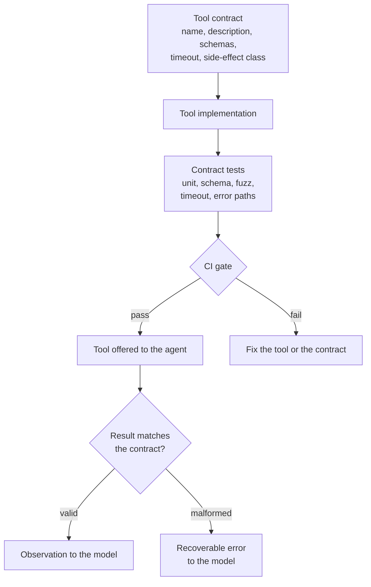
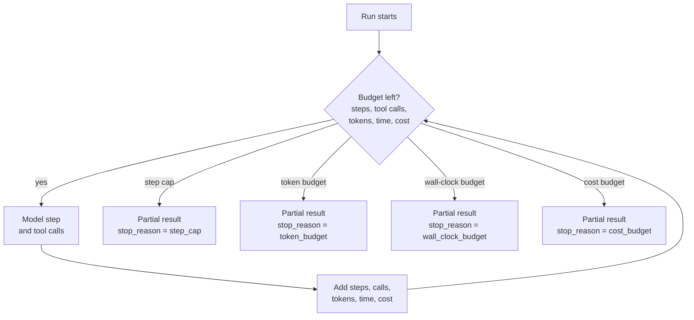

# Tool Contract Testing and Bounded Autonomy

> **Interview answer (say this first).** A tool is a contract, not just a function. It promises a name, a description, an argument schema, a result schema, an error schema, a timeout, and a side-effect class, and you test that promise like a public API: unit tests, schema tests, fuzzed arguments, timeout tests, and error-path tests. Autonomy is bounded by explicit budgets — step cap, tool-call cap, token, wall-clock, and cost — enforced by your loop, never by the model. When a budget is hit, stop with a partial result and a recorded stop reason, degrade, or escalate for human approval.

## Why this exists

Two failures, both common, both preventable.

**Failure one: the tool changed shape and nobody noticed.** A tool named `lookup_invoice` used to return this:

```text
{"invoice_id": "A-1002", "total": 1299.00}
```

A dependency upgrade changed the shape to this:

```text
{"id": "A-1002", "amount": {"value": 1299.00, "currency": "USD"}}
```

Nothing validated the result, so it went straight into the conversation. The model found no `total` field, assumed the tool had failed, and called it again with identical arguments:

```text
step 1: lookup_invoice({'invoice_id': 'A-1002'}) -> no 'total' in result
...
step 41: gave up after 41 tool calls
```

Every call was "successful". The tool returned a normal response. The only broken thing was the shape, and no test pinned the shape, so no build failed. A single contract test would have failed the upgrade in CI instead of letting the agent loop.

**Failure two: the run had no budget.** A nightly research agent was given a goal and a tool, but no limits. One tool returned empty results, the model kept rephrasing the same query, and the run continued until a person opened the dashboard the next morning. Six hours, roughly 12,000 tool calls, about $1,400 of model and search spend — from one task nobody was waiting for.

Neither failure needs a smarter model. The first needs a contract test. The second needs a budget. This page teaches both.

## Start from zero

| Word | Plain meaning |
| --- | --- |
| **Tool contract** | The complete written promise a tool makes: name, description, argument schema, result schema, error schema, timeout, and side-effect class. |
| **Schema** | A declared shape for data: field names, types, required fields, and allowed values. |
| **Contract test** | A test that pins the tool's declared shape and behaviour, so an unintended change fails the build. |
| **Fixture** | Reusable test setup or test data, created fresh for each test. |
| **Fuzzing** | Generating many inputs automatically, including odd ones, to find inputs the code mishandles. |
| **Malformed output** | A tool result that does not match the declared result schema. |
| **Timeout** | The maximum time one call may take before it is abandoned. |
| **Retry** | Running a failed call again; only safe for a transient failure. |
| **Error taxonomy** | A fixed classification of failures: transient, permanent, or validation. |
| **Transient error** | A temporary failure that a retry may fix: a timeout, a rate limit, a 5xx response. |
| **Permanent error** | A failure that will keep failing with the same input: a 404, bad credentials, a missing record. |
| **Validation error** | Arguments or output that break the schema; retrying the same call changes nothing. |
| **Autonomy budget** | A hard limit on what a run may spend before it must stop. |
| **Step cap** | A maximum number of agent loop iterations. |
| **Tool-call cap** | A maximum number of tool executions; one step may call several tools. |
| **Token budget** | A maximum number of model tokens for the run. |
| **Wall-clock budget** | A maximum elapsed time for the run. |
| **Cost budget** | A maximum amount of money for the run. |
| **Circuit breaker** | A switch that stops calling a failing tool for a cooldown period. |
| **Kill switch** | An operator action that stops in-flight runs or disables a tool immediately. |
| **Dry run** | Executing the plan without side effects, recording what would have happened. |
| **Idempotency** | Running an action twice has the same effect as running it once — see [tool execution and result validation](03-tool-execution-and-result-validation.md). |

Three distinctions carry the topic.

- **A contract is enforced, not documented.** If a shape is written in a comment but never validated and never tested, it is a wish. A contract is code plus a test that fails when the code breaks the promise.
- **A budget is enforced outside the model.** The model cannot count its own tokens or dollars reliably, and it has no incentive to stop. Your loop holds the counter and decides.
- **Classification comes before response.** Transient, permanent, and validation errors are handled three different ways. Choosing the wrong one either retries a doomed call or throws away a recoverable run.

## The core idea

Think of a **shipping container**. It has a standard size, so any crane can lift it. It has a label, so the right ship takes it. It declares a maximum weight, so the crane is not overloaded. It carries a hazard class, so dangerous goods are handled differently. And it travels with a manifest (a list of what is inside), so the receiving dock can check that what arrived matches what was promised.

A tool is that container, and the contract is the manifest. Three audiences read it:

- **The model** reads the name, description, and schemas as text. It never sees your code.
- **Your runtime** reads the timeout and side-effect class and enforces them.
- **The outside world** experiences the side effect, if there is one.

Contract tests are the inspection that the container matches its manifest. Budgets are the crane's load limit.



| Contract field | What it promises | Failure it prevents |
| --- | --- | --- |
| **Name** | The exact string the model must emit | Hallucinated or renamed tools |
| **Description** | What it does, when to use it, when not to | Wrong-tool selection |
| **Argument schema** | Types, required fields, bounds, enums | Bad inputs reaching the tool |
| **Result schema** | The exact shape and ranges a caller may rely on | Shape drift poisoning the loop |
| **Error schema** | Which errors appear, with which fields | Unparseable failures and blind retries |
| **Timeout** | The longest one call may take | A hung tool stalling the whole run |
| **Side-effect class** | read, write, or destructive | Unapproved or non-idempotent writes |

Autonomy is the freedom the agent has inside those walls. Budgets are the walls. Each budget answers a different question, and each has a defined ending.

| Budget | What it limits | Checked | What happens when it is hit |
| --- | --- | --- | --- |
| **Step cap** | Loop iterations | Top of every iteration, before the model call | Stop, return the partial result, `stop_reason=step_cap` |
| **Token budget** | Model tokens (input plus output) across the run | Before every model call, from a running total | Stop, return the partial result, `stop_reason=token_budget` |
| **Wall-clock budget** | Elapsed seconds for the whole run | Top of every iteration, and around every tool call | Stop, or degrade to a faster path, `stop_reason=wall_clock_budget` |
| **Cost budget** | Money spent on models and tools | Before every model and tool call, using a price table | Stop, return the partial result, `stop_reason=cost_budget` |

Two extra guards sit beside the four budgets. A **tool-call cap** is separate from the step cap because one step can fan out to several calls. A **circuit breaker** counts consecutive failures against one tool and stops calling it for a cooldown, so a dead dependency does not absorb the whole budget.



The checks happen **before** the spend, not after. A budget that is only checked at the end of a step is a report, not a limit.

## How it works

1. **Define the contract in one place.** A small record holds the name, description, argument model, result model, timeout, side-effect class, and whether the tool is idempotent. The model-facing schema, the validators, and the tests are all derived from it, so they cannot drift apart.
2. **Validate arguments before the side effect.** Parse the model's JSON into the argument model. Unknown fields, missing fields, and out-of-range values are rejected here, before any function runs.
3. **Check permission and risk.** Validation is not authorisation. A well-formed refund may still need approval or a lower cap — see [tool permissions](15-tool-permissions.md) and [human-in-the-loop and approvals](11-human-in-the-loop-and-approvals.md).
4. **Execute under a timeout.** Pass a timeout to the network client and add a wall-clock guard around the call. A Python thread cannot be forcibly killed, so the guard returns control to the caller while the worker may keep running; for work that must be terminable, run it in a subprocess or sandbox.
5. **Validate the result against the contract.** Parse the raw return value into the result model. This is the check that catches the `lookup_invoice` shape change.
6. **Turn malformed output into a recoverable error.** Do not raise out of the loop and do not pass bad data to the model. Return a short error result that says the tool broke its contract, so the model can adapt instead of retrying blindly.
7. **Classify failures with the taxonomy.** Transient errors are retried with backoff and jitter (a randomised wait). Permanent errors fail fast. Validation errors go back to the model as data, because only the model can change the arguments.
8. **Test the contract at five levels.** A unit test for the happy path, a schema test that pins the exact result shape, a fuzz test over arguments, a timeout test, and an error-path test for each taxonomy class. These run in CI (continuous integration) like any other API test.
9. **Version the contract when it changes on purpose.** A deliberate shape change is a new version, with a migration path. An accidental shape change is a failed test. The test is what tells the two apart.
10. **Set the budgets before the run.** Decide the step cap, tool-call cap, token budget, wall-clock budget, and cost budget from the task's value and the user's patience. Make them explicit configuration, not constants buried in the loop.
11. **Enforce the budgets at the top of each iteration.** Check every counter before the next model or tool call. Add the token and cost of each step as soon as it is known.
12. **Record a stop reason on every exit.** Goal reached, step cap, tool-call cap, token budget, wall-clock, cost, no progress, or an error. Detecting no progress is simple: if the same tool call with the same arguments returns the same error twice, stop. A run that ends without a reason is not debuggable.
13. **Degrade or escalate instead of running for ever.** If the budget is nearly spent, use a cheaper model, a cached answer, or a narrower tool. If the action is important, pause for approval. A **dry run** lets the agent plan a write-heavy task without touching the world, and a **kill switch** lets an operator stop in-flight runs immediately.

> **Note:**
>
> **The pairing to remember.** The contract decides what a valid result looks like; the budgets decide how long the agent may look for one. Without the contract, the agent acts on garbage. Without the budgets, it acts for ever.

## The syntax you will use

**The argument and result models.** Pydantic (a Python validation library) turns these annotations into the contract's two schemas. `extra="forbid"` rejects any field the model was not given.

```python
from typing import Literal
from pydantic import BaseModel, ConfigDict, Field

class WeatherArgs(BaseModel):
    model_config = ConfigDict(extra="forbid")
    city: str = Field(min_length=1, max_length=80)
    units: Literal["celsius", "fahrenheit"] = "celsius"

class WeatherResult(BaseModel):
    model_config = ConfigDict(extra="forbid")
    city: str
    temp_c: float = Field(ge=-90, le=60)
    source: str = Field(min_length=1)
```

**The tool spec.** One record per tool, holding the contract fields and the side-effect class.

```python
from collections.abc import Callable
from dataclasses import dataclass
from enum import Enum
class SideEffect(Enum):
    READ = "read"                 # changes nothing
    WRITE = "write"               # a reversible change
    DESTRUCTIVE = "destructive"   # hard to undo

@dataclass(frozen=True)
class ToolSpec:
    name: str
    description: str
    args_model: type[BaseModel]
    result_model: type[BaseModel]
    run: Callable[[BaseModel], dict]
    timeout_s: float = 5.0
    side_effect: SideEffect = SideEffect.READ
    idempotent: bool = False
```

**A validator that rejects malformed results.** A broken result becomes a typed error, not a crash and not silent garbage.

```python
from pydantic import ValidationError
class ToolContractError(Exception):
    """Raised when a tool breaks its declared contract."""

def parse_result(spec: ToolSpec, raw: object) -> dict:
    try:
        return spec.result_model.model_validate(raw).model_dump()
    except ValidationError as exc:
        raise ToolContractError(f"{spec.name} returned malformed output") from exc
```

**Execute with a timeout.** The timeout belongs to the tool spec, so every call has one.

```python
import concurrent.futures
def execute_once(spec: ToolSpec, args: BaseModel) -> dict:
    pool = concurrent.futures.ThreadPoolExecutor(max_workers=1)
    future = pool.submit(spec.run, args)
    try:
        return parse_result(spec, future.result(timeout=spec.timeout_s))
    except TimeoutError as exc:
        raise ToolContractError(f"{spec.name} exceeded {spec.timeout_s}s") from exc
    finally:
        pool.shutdown(wait=False)   # return promptly; the worker may still run
```

**Fuzz the arguments with `hypothesis`.** `hypothesis` is a property-based testing library: you state a rule and it searches for a counterexample. The property is: once validation passes, the tool must never raise. (`DivideArgs` and `divide` appear in Example 2 below.)

```python
from hypothesis import given, settings, strategies as st

@given(st.floats(allow_nan=False, allow_infinity=False),
       st.floats(allow_nan=False, allow_infinity=False))
@settings(max_examples=300, deadline=None)
def test_validated_arguments_never_crash(a: float, b: float) -> None:
    try:
        args = DivideArgs.model_validate({"a": a, "b": b})
    except ValidationError:
        return                      # rejecting bad input is correct
    divide(args)                    # must never raise once validation passes
```

**Or hand-roll the fuzz loop** when you want no extra dependency. Seeded randomness makes a failure reproducible.

```python
import random
def fuzz(model: type[BaseModel], tool, attempts: int = 500, seed: int = 7) -> list[str]:
    rng = random.Random(seed)
    failures: list[str] = []
    for _ in range(attempts):
        payload = {"a": rng.uniform(-100, 100),
                   "b": rng.choice([0.0, 1.0, -1.0, 2.5])}
        try:
            args = model.model_validate(payload)
        except ValidationError:
            continue
        try:
            tool(args)
        except Exception as exc:            # a crash after validation is a bug
            failures.append(f"{payload} -> {type(exc).__name__}: {exc}")
    return failures
```

**The error taxonomy.** Three classes, three responses.

```python
class ToolError(Exception):
    """Base class for a tool failure."""

class TransientToolError(ToolError):
    """Temporary: a retry may succeed."""

class PermanentToolError(ToolError):
    """Will keep failing with the same input."""

class ValidationToolError(ToolError):
    """The arguments or the result broke the schema."""

def error_payload(exc: ToolError) -> dict:
    if isinstance(exc, TransientToolError):
        return {"ok": False, "kind": "transient", "retry": True, "error": str(exc)}
    if isinstance(exc, ValidationToolError):
        return {"ok": False, "kind": "validation", "retry": False,
                "error": str(exc), "hint": "fix the arguments and call again"}
    return {"ok": False, "kind": "permanent", "retry": False, "error": str(exc)}
```

**The budget record and the stop check.** One dataclass for the limits, one for the running totals, one function that answers "should we stop?".

```python
import time
from dataclasses import dataclass, field
from enum import Enum

class StopReason(Enum):
    GOAL = "goal_reached"
    STEP_CAP = "step_cap"
    TOOL_CALL_CAP = "tool_call_cap"
    TOKEN_BUDGET = "token_budget"
    WALL_CLOCK = "wall_clock_budget"
    COST_BUDGET = "cost_budget"
    NO_PROGRESS = "no_progress"     # repeated identical call with an identical error

@dataclass
class Budgets:
    max_steps: int = 12
    max_tool_calls: int = 30
    max_tokens: int = 60_000
    max_seconds: float = 120.0
    max_cost_usd: float = 0.50

@dataclass
class Usage:
    steps: int = 0
    tool_calls: int = 0
    tokens: int = 0
    cost_usd: float = 0.0
    started: float = field(default_factory=time.monotonic)

    def elapsed(self) -> float:
        return time.monotonic() - self.started

def budget_stop(budgets: Budgets, usage: Usage) -> StopReason | None:
    if usage.steps >= budgets.max_steps:
        return StopReason.STEP_CAP
    if usage.tool_calls >= budgets.max_tool_calls:
        return StopReason.TOOL_CALL_CAP
    if usage.tokens >= budgets.max_tokens:
        return StopReason.TOKEN_BUDGET
    if usage.elapsed() >= budgets.max_seconds:
        return StopReason.WALL_CLOCK
    if usage.cost_usd >= budgets.max_cost_usd:
        return StopReason.COST_BUDGET
    return None
```

**The loop that enforces them.** Every exit carries a stop reason, so nobody has to guess why a run ended.

```python
from dataclasses import dataclass

@dataclass
class Call:
    name: str
    args: dict

@dataclass
class Step:
    kind: str              # "tool" or "finish"
    calls: list[Call]      # one or more tool calls when kind == "tool"
    tokens: int
    cost_usd: float

def run_agent(goal: str, budgets: Budgets, model_step, call_tool) -> dict:
    usage = Usage()
    transcript: list[str] = []
    while True:
        stop = budget_stop(budgets, usage)          # check before spending on the model
        if stop is not None:
            return {"status": "partial", "stop_reason": stop.value,
                    "transcript": transcript, "usage": usage}
        step = model_step(goal, transcript)
        usage.steps += 1
        usage.tokens += step.tokens
        usage.cost_usd += step.cost_usd
        if step.kind == "finish":
            return {"status": "success", "stop_reason": StopReason.GOAL.value,
                    "answer": step.calls, "transcript": transcript,
                    "usage": usage}
        for call in step.calls:                     # one step can fan out to several calls
            stop = budget_stop(budgets, usage)      # re-check before each tool call
            if stop is not None:
                return {"status": "partial", "stop_reason": stop.value,
                        "transcript": transcript, "usage": usage}
            usage.tool_calls += 1
            transcript.append(call_tool(call.name, call.args))
```

**A dry-run mode.** Read tools run; write tools are recorded and not called.

```python
class DryRun:
    """Runs a plan without side effects, recording every call it would make."""

    def __init__(self) -> None:
        self.calls: list[dict] = []

    def execute(self, spec: ToolSpec, args: BaseModel) -> dict:
        if spec.side_effect is SideEffect.READ:
            return parse_result(spec, spec.run(args))   # reads are safe
        record = {"tool": spec.name, "args": args.model_dump(),
                  "side_effect": spec.side_effect.value}
        self.calls.append(record)
        return {"dry_run": True, **record}
```

## Examples: simple to real

**Example 1 — a validator catches shape drift.** The result schema is pinned, so the changed tool fails loudly at the boundary.

```python
from pydantic import BaseModel, ConfigDict, Field

class InvoiceResult(BaseModel):
    model_config = ConfigDict(extra="forbid")
    invoice_id: str
    total: float = Field(ge=0)

OLD = {"invoice_id": "A-1002", "total": 1299.00}
NEW = {"id": "A-1002", "amount": {"value": 1299.00, "currency": "USD"}}
```

```text
old shape accepted: {'invoice_id': 'A-1002', 'total': 1299.0}
new shape rejected: lookup_invoice returned malformed output
agent sees: {'ok': False, 'kind': 'validation', 'retry': False,
             'error': 'lookup_invoice returned malformed output',
             'hint': 'the tool contract changed; do not retry the same call'}
```

The loop does not crash and the model does not loop. It receives one clear, non-retryable error and can tell the user that a tool is misbehaving. The real fix happens in CI: the schema test fails on the pull request that changed the shape.

**Example 2 — an argument fuzz test finds a bad input.** A `divide` tool validates `a` and `b` as floats but forgets that `b` must not be zero. A seeded fuzz loop runs 500 random payloads and finds the crash.

```text
without the validator, failures: 119
first: {'a': -21.035300715365295, 'b': 0.0} -> ZeroDivisionError: float division by zero
with the validator, failures: 0
```

The constraint belongs in the argument schema, not in a comment:

```python
from pydantic import field_validator

class DivideArgs(BaseModel):
    model_config = ConfigDict(extra="forbid")
    a: float
    b: float

    @field_validator("b")
    @classmethod
    def b_must_not_be_zero(cls, value: float) -> float:
        if value == 0:
            raise ValueError("b must not be zero")
        return value
```

Now the fuzzer has nothing to find: 119 crashes become 0. The property is simple and strong — **if validation passes, the tool must not raise**.

**Example 3 — budgets stop a runaway loop with a reason.** The model is stuck calling the same search, and each step costs $0.02. A cost budget of $0.05 stops the run at step 3 instead of step 12,000.

```text
cost stop: cost_budget steps: 3 cost: 0.06
step stop: step_cap steps: 4
```

The cost overshoots slightly because the check happens at the top of the iteration, before the next spend. That is the correct trade-off: you cannot know the price of a step before choosing it, so you stop before the next one and record why. Run the same loop with a step cap of 4 and a cost budget large enough not to fire, and it stops with `step_cap` instead. Different limit, same honest record of why the run ended.

**Example 4 — transient, permanent, and validation errors are handled differently.** Only the transient one is retried.

```text
transient: {'ok': True, 'result': 'ok'} attempts: 3
permanent: {'ok': False, 'kind': 'permanent', 'retry': False, 'error': '404 no such order'}
validation: {'ok': False, 'kind': 'validation', 'retry': False,
             'error': 'amount must be > 0', 'hint': 'fix the arguments and call again'}
```

The transient `503` succeeds on the third attempt. The permanent `404` stops immediately, because a 404 will still be a 404 in ten seconds. The validation error is handed back to the model, because only the model can supply a different amount. Retrying all three the same way is the bug this taxonomy prevents.

**Example 5 — a dry run lets the agent plan without side effects.** The refund is a write, so the dry run records it and charges nobody.

```text
planned: {'dry_run': True, 'tool': 'refund',
          'args': {'order_id': 'A-1002', 'amount': 49.0}, 'side_effect': 'write'}
charges made: 0 planned calls: 1
```

The agent can present the full plan, a human can approve it, and only then does the real path run with idempotency keys. A dry run is the cheapest safety valve in the page: it costs one extra code path and catches order-of-magnitude mistakes before money moves.

## In production

- **A tool is an API, so it needs a contract and tests.** Pin the argument and result schemas with tests that run in CI. A shape change should fail a build, not appear as a confused agent three days later.
- **Validate arguments before the side effect.** Parse the model's JSON into the argument model first. Reject unknown fields, missing fields, and out-of-range values before the function runs. Never let a malformed call reach a write.
- **Treat malformed output as a recoverable error, not a crash.** Catch the validation failure at the boundary, return a short non-retryable error, and let the model explain or change approach. A raised exception ends the run and loses the context that explains it.
- **Put a timeout on every tool.** Include the timeout in the tool spec so it cannot be forgotten. Add a client timeout for cancellation and a wall-clock guard as a backstop. A hung tool is a hung agent.
- **Retry only transient errors.** Timeouts, rate limits, and 5xx responses may succeed later. Validation errors, permission errors, and 404s will not. Retry with backoff and jitter, and only for idempotent work — see [retries, termination, and loop detection](08-retries-termination-and-loop-detection.md).
- **Keep validation errors separate from provider errors.** A schema failure is your contract being broken; a provider error is the platform failing. They have different owners, different alerts, and different retry policies. Do not collapse them into one `except Exception`.
- **Enforce budgets outside the model.** The model will not police its own spend, and it cannot count tokens reliably. The loop owns the counters and checks them before each spend.
- **Give every run a stop reason.** `goal_reached`, `step_cap`, `tool_call_cap`, `token_budget`, `wall_clock_budget`, `cost_budget`, or `no_progress`. Without it, a partial result is a mystery instead of a decision, and you cannot alert on the difference between success and exhaustion.
- **Make dry run the default for write-heavy plans.** Let the agent produce the plan, show it, and execute only after approval. This turns an irreversible mistake into a reviewable diff.
- **Log every tool call with redacted arguments and its result.** Record the contract version, the validation outcome, the duration, the retry count, and the tokens and cost. Redact secrets and personal data before export, and set a retention window.
- **Keep a kill switch, and test it.** An operator must be able to stop in-flight runs and disable a single tool without a deploy. A switch nobody has exercised is not a control; rehearse it during an incident drill.
- **Version the contract like an API.** Adding an optional result field is usually safe; renaming a field, removing one, or narrowing a type is a breaking change. Bump the version, keep the old shape during a migration, and record which version each run used.

## Interview questions

### 1. What is a tool contract, and what belongs in it?

**Answer.** A tool contract is the complete promise a tool makes to its callers. It contains the name, the description, the argument schema, the result schema, the error schema, the timeout, and the side-effect class. The model reads only the name, description, and schemas; your runtime enforces the timeout and side-effect rules. Everything about the tool's behaviour that another component relies on belongs in the contract.

**Follow-up: "Why is the result schema part of the contract?"** Because the model and the code both consume the result. If the result shape can change without notice, every consumer breaks silently, as in the invoice example.

**Trap.** Treating the contract as documentation. An untested, unvalidated shape is a wish, not a contract.

### 2. How do you test a tool contract?

**Answer.** Five levels. A unit test for the happy path and the tool's own logic. A schema test that pins the exact argument and result shapes, including a deliberate failure case. A fuzz or property test over arguments. A timeout test with a deliberately slow tool. And an error-path test for each taxonomy class — transient, permanent, and validation. These run in CI like any API test.

**Follow-up: "Which one catches a provider changing a response shape?"** The schema test. It is the cheapest test that can see shape drift, and it fails at build time instead of in production.

**Trap.** Testing only the happy path. The interesting behaviour of a tool is what it does when the world is broken.

### 3. Why fuzz tool arguments instead of writing more examples?

**Answer.** Example tests only cover the cases you thought of. Fuzzing generates cases you did not, and shrinks any failure to the smallest input. For tools, the property is strong and simple: if the argument schema validates a payload, the tool must not raise. Hypothesis or a seeded hand-rolled loop finds boundary cases like zero, empty strings, and extreme numbers that examples miss.

**Follow-up: "What makes a good property?"** One that is always true and easy to state: no crash after validation, round-trip agreement, or output within a declared range. Seed the generator so a failure is reproducible.

**Trap.** Fuzzing without a property. Generating random inputs and asserting nothing finds nothing.

### 4. A tool silently changes its output shape. How do you prevent and contain that?

**Answer.** Prevent it with a result schema and a contract test that fails the build when the shape moves. Contain it by validating every result at the boundary. A malformed result becomes a short, non-retryable error result for the model, so the loop does not repeat the call and the model can tell the user something is wrong. Log the raw result and the validation error, and alert on the contract violation.

**Follow-up: "What if the change is intentional?"** Version the contract, keep both shapes during the migration, and update the consumer and the test together. Intentional changes are a deliberate release; accidental ones are a caught bug.

**Trap.** Passing the result through unvalidated because "it worked in the demo". The demo is one sample; the contract is all samples.

### 5. Which budgets should bound an agent run, and what happens when each is hit?

**Answer.** A step cap, a tool-call cap, a token budget, a wall-clock budget, and a cost budget. Each is checked at the top of the iteration, before the next spend. When one is hit, the run stops with a partial result and a recorded stop reason, or degrades to a cheaper path. The step cap bounds iterations; the tool-call cap bounds fan-out; the token and cost budgets bound the expensive model calls; the wall-clock budget bounds the user's wait.

**Follow-up: "Why not just a step cap?"** A few very expensive steps can blow the cost of a long, cheap run. Token and cost budgets bound the damage that one large call can do.

**Trap.** Checking budgets after the step. That reports an overspend instead of preventing it.

### 6. Why must budgets be enforced outside the model?

**Answer.** Because the model is a text generator, not an accountant. It cannot count its own tokens or dollars reliably, it cannot read a wall clock, and it has no incentive to stop when it believes it is close. The loop holds the counters, checks them before each action, and ends the run. The model may suggest stopping or ask for more budget, but the decision is deterministic code.

**Follow-up: "What should a stop reason contain?"** Which budget or condition fired, the counters at that moment, the work completed, and what remains. That is what turns a partial result into an actionable one.

**Trap.** Putting "stop after ten steps" in the system prompt. That is a suggestion the model can ignore; only the loop can enforce a limit.

### 7. How do you classify tool errors, and how does that drive retry?

**Answer.** Three classes. Transient errors — timeouts, rate limits, 5xx — are retried with backoff and jitter, and only if the action is idempotent. Permanent errors — 404s, bad credentials, business rule failures — stop immediately. Validation errors — bad arguments or malformed output — go back to the model as data, because only a different input can fix them. The classification is a policy, tested on its own, not an accident of which `except` clause was written first.

**Follow-up: "Where does the circuit breaker fit?"** After repeated failures to one tool, stop calling it for a cooldown. Retrying a dead dependency wastes the budget and delays the inevitable failure.

**Trap.** A blanket `except Exception: retry`. It retries permanent errors, doubles the cost, and can duplicate a side effect.

### 8. What are a dry run, a circuit breaker, and a kill switch, and when do you need each?

**Answer.** A dry run executes the plan without side effects, recording what would have happened; it is the default for write-heavy tasks so a human can review before anything irreversible. A circuit breaker stops calling a failing tool for a cooldown after repeated failures; it protects the tool and the budget. A kill switch is an operator action that stops in-flight runs or disables a tool immediately; it is the last line of defence when something is going wrong right now. All three reduce the blast radius — how much a wrong action can affect — of an agent that is behaving badly.

**Follow-up: "Which one do you build first?"** The dry run, because it is cheap and prevents the most common expensive mistake. Then the kill switch, because every system that can act needs an off button.

**Trap.** Relying on the agent's own judgement to avoid side effects. Safety controls live in the runtime, where the model cannot negotiate with them.

## Remember this

- **A tool is a contract.** Name, description, argument schema, result schema, error schema, timeout, and side-effect class — tested in CI like any API.
- **Validate both ends.** Arguments before the side effect; results before the model sees them; malformed output becomes a recoverable error, not a crash.
- **Classify errors before responding.** Retry transient, stop on permanent, hand validation back to the model.
- **Budgets live outside the model.** Steps, tool calls, tokens, wall-clock, and cost are checked before each spend, and every run ends with a stop reason.
- **Degrade or escalate instead of running for ever.** Dry run for writes, a circuit breaker for dead tools, and a kill switch for incidents.
