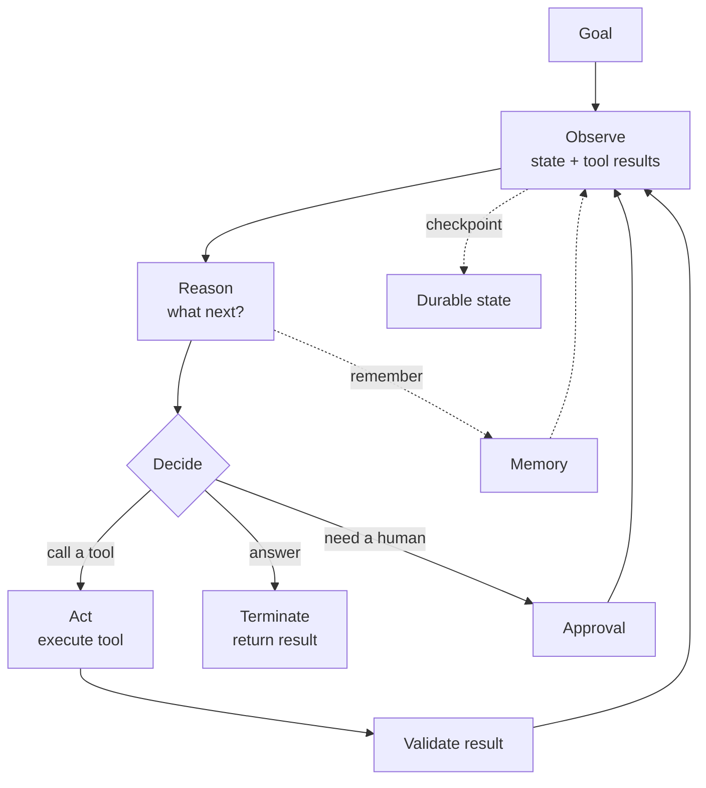

# Phase 4 — Agentic AI Engineering

An agent is a language model placed inside a loop, given tools, memory, and a goal. Instead of answering once, it acts: it decides what to do, calls a tool, looks at the result, and decides again — until the task is done or it decides to stop.

This is where AI systems stop being text generators and start doing work. It is also where most of the hard engineering lives. A single model call fails in simple ways; an agent loop fails in compound ways — it loops forever, calls the wrong tool, loses state, corrupts memory, spends money, or takes an irreversible action with no approval. This phase builds the machinery that makes agents reliable: loops, state, memory, planning, tools, permissions, checkpoints, human approval, and orchestration patterns.

## What you will be able to do

By the end of this phase you should be able to:

- Explain what an agent is and, more importantly, when **not** to build one.
- Implement the observe → reason → act loop with tool execution and result validation.
- Design memory: short-term, working, long-term, episodic, and semantic.
- Plan, decompose, route, reflect, and self-correct.
- Prevent infinite loops, manage retries, and terminate cleanly.
- Persist state, checkpoint, and support durable, long-running, resumable agents.
- Add human-in-the-loop approval and guardrails around dangerous actions.
- Define tool schemas, selection, and permissions safely.
- Build with LangGraph (nodes, edges, reducers, checkpoints, interrupts, subgraphs) and the OpenAI Agents SDK.
- Choose among ReAct, plan-and-execute, router, supervisor, worker, evaluator, and critic patterns.

## The agent loop

Everything in this phase is one of four concerns: **what the loop does** (planning, reasoning), **what it remembers** (state, memory, checkpoints), **what it can touch** (tools, permissions), and **how it stays safe and stops** (guardrails, approvals, termination, reliability).

## Topic order

1. [What an AI agent is](01-what-an-ai-agent-is.md) — and when a plain workflow is better.
2. [The agent loop](02-the-agent-loop.md) — observe, reason, act.
3. [Tool execution and result validation](03-tool-execution-and-result-validation.md) — acting safely on the world.
4. [Agent memory: short-term and working](04-agent-memory-short-term-and-working.md) — what is in context right now.
5. [Agent memory: long-term, episodic, semantic](05-agent-memory-long-term-episodic-semantic.md) — what survives the run.
6. [Planning, decomposition, and routing](06-planning-decomposition-and-routing.md) — breaking a goal into steps.
7. [Reflection and self-correction](07-reflection-and-self-correction.md) — catching your own mistakes.
8. [Retries, termination, and loop detection](08-retries-termination-and-loop-detection.md) — knowing when to stop.
9. [State management and persistence](09-state-management-and-persistence.md) — the single source of truth.
10. [Checkpointing and durable execution](10-checkpointing-and-durable-execution.md) — surviving restarts.
11. [Human-in-the-loop and approvals](11-human-in-the-loop-and-approvals.md) — putting a person in the path.
12. [Guardrails](12-guardrails.md) — bounding what the agent can do.
13. [Structured agent outputs](13-structured-agent-outputs.md) — machine-checkable actions.
14. [Tool schemas and selection](14-tool-schemas-and-selection.md) — describing and choosing tools.
15. [Tool permissions](15-tool-permissions.md) — least privilege for agents.
16. [Parallel and conditional workflows](16-parallel-and-conditional-workflows.md) — direction and fan-out.
17. [Long-running and background agents](17-long-running-and-background-agents.md) — work beyond a request.
18. [LangGraph: graphs and state](18-langgraph-graphs-and-state.md) — nodes, edges, reducers.
19. [LangGraph: checkpoints, interrupts, subgraphs](19-langgraph-checkpoints-interrupts-subgraphs.md) — durable and human-aware.
20. [OpenAI Agents SDK](20-openai-agents-sdk.md) — the batteries-included alternative.
21. [Agent orchestration patterns](21-agent-orchestration-patterns.md) — ReAct, plan-and-execute, supervisor, worker, critic.
22. [Agent reliability](22-agent-reliability.md) — making agents dependable in production.

> **Tip:**
>
> **How to study this phase.** The recurring theme is that agents are distributed systems with a stochastic component. Every time you add a capability, ask: what happens when it fails halfway, runs twice, or returns something invalid? If you can answer that, you can build production agents.

## Checkpoint project

At the end of the phase, build [Project 2 — Autonomous Enterprise Workflow Agent](../projects/02-autonomous-enterprise-workflow-agent.md): a LangGraph agent that plans, uses tools, checkpoints, pauses for human approval, resumes durably, and reports. The exact scope lives in the projects part of the book.
