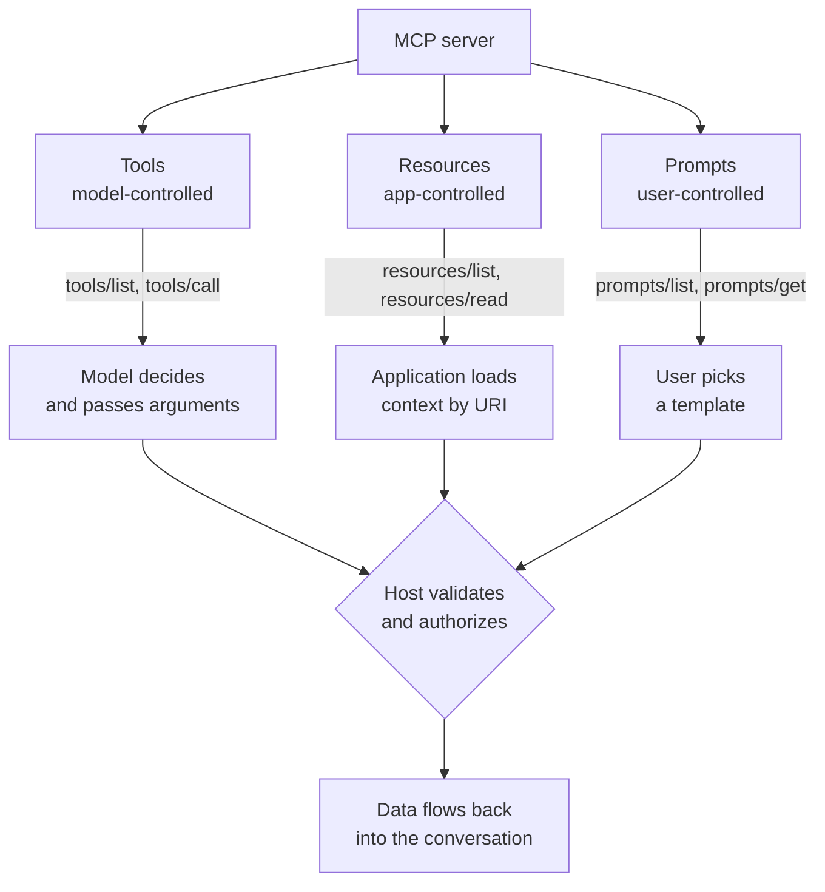

# MCP Tools, Resources, and Prompts

> **Interview answer (say this first).** MCP defines three primitives. **Tools** are actions the model can invoke — the model decides when to call them, and each has a JSON Schema for its arguments. **Resources** are read-only context addressed by URIs — the application decides what to load, such as a file or a database row. **Prompts** are reusable message templates with arguments — the user picks them, usually from a menu. Expose a tool when the model must decide and act, a resource when the app needs context, and a prompt when a person chooses a workflow.

## Why this exists

Imagine a server that exposes an internal wiki as MCP. The obvious first move is to make one tool per page: `get_page_1`, `get_page_2`, and so on. It seems to work, then falls apart.

- The tool catalog explodes, so it blows the model's context and hurts tool selection.
- Reading a page becomes an *action the model must choose*, even though the app already knows which page is relevant.
- Nothing tells the client which pages even exist.

The problem is that "fetch a page" is not an action, it is **context**. Forcing context into the action shape makes everything worse: more tokens, worse selection, and no discovery.

Now add a second kind of need. The user wants a "review this PR" workflow that always sends the same carefully worded instructions to the model, with the PR number as a parameter. That is not an action and not context. It is a **template** the user runs on demand. If you model it as a tool, the user has no menu; if you model it as a resource, the user cannot parameterize it.

Three needs, three shapes:

1. Something the **model** chooses and runs, with arguments. → a tool.
2. Something the **application** loads as context, identified by a URI. → a resource.
3. Something the **user** selects as a reusable workflow. → a prompt.

MCP defines exactly these three primitives because the alternatives — a single "tool" type, or free-form text — lose information the client needs to build a good interface.

> **Note:**
>
> **The one-sentence purpose.** Each primitive has a different owner and a different shape: tools are model-controlled actions, resources are application-controlled context, and prompts are user-controlled templates.


## Start from zero

| Word | Plain meaning |
| --- | --- |
| **Primitive** | One of the three core things a server exposes: tool, resource, prompt. |
| **Tool** | A function the model may call, with a JSON Schema for arguments. |
| **Resource** | Read-only content addressed by a URI, loaded by the application. |
| **Resource template** | A parameterized resource URI, such as `file://{path}`. |
| **Prompt** | A reusable message template with named arguments. |
| **URI** | A uniform resource identifier, such as `db://customers/42`. |
| **URI template** | A URI pattern with placeholders, using RFC 6570 syntax. |
| **MIME type** | A content type label, such as `text/markdown` or `image/png`. |
| **Content block** | One piece of tool output: text, image, audio, or a link/embedded resource. |
| **`inputSchema`** | JSON Schema describing a tool's arguments. |
| **`outputSchema`** | JSON Schema describing a tool's structured result. |
| **Structured content** | Machine-readable tool output alongside the human-readable text. |
| **Annotations** | Hints on a tool: read-only, destructive, idempotent, open-world. |
| **Control model** | Who decides when a primitive is used: model, app, or user. |
| **Argument completion** | Server-provided suggestions for prompt/resource arguments. |
| **Pagination** | Returning long lists in pages using a `cursor`. |
| **`ttlMs` / `cacheScope`** | Cache hints on list and read results. |
| **Resource link** | A content block that points at a resource by URI. |

Two distinctions to pin down:

- **Action vs context.** A tool *does* something and returns a result. A resource *is* something the app reads. When in doubt, ask whether the model should choose it or the app should.
- **Model-controlled vs app-controlled vs user-controlled.** This is the spec's own framing and the fastest way to answer "which primitive?" in an interview.

## The core idea

Picture a workshop. **Tools** are the machines: the drill press, the saw. The worker (the model) decides which to use and how. **Resources** are the reference shelf: drawings, manuals, a parts catalog. The worker does not "call" a manual; someone fetches the relevant page and puts it on the bench. **Prompts** are recipe cards pinned to the wall, each with blanks to fill in. A person chooses a card when they want that job done a certain way.



### The comparison that answers most questions

| Question | Tool | Resource | Prompt |
| --- | --- | --- | --- |
| Who decides to use it? | The model | The application | The user |
| Does it take arguments? | Yes, via `inputSchema` | Yes, via URI template | Yes, named arguments |
| Does it have side effects? | Often | Never (read-only) | Never |
| How is it identified? | A name | A URI | A name |
| Does it return? | Content and structured output | Text or blob content | A list of messages |
| Typical example | `send_email`, `search_docs` | `file:///notes.md` | "Review this PR" |
| Discovery method | `tools/list` | `resources/list`, `resources/templates/list` | `prompts/list` |
| Use method | `tools/call` | `resources/read` | `prompts/get` |
| Caching hints | List is cacheable | List and read are cacheable | List is cacheable |

The single most useful heuristic: **if the model must decide and act, it is a tool; if the app needs context, it is a resource; if a human picks a workflow, it is a prompt.**

### How a client surfaces each primitive to a model

This is where the abstraction meets reality, and it is a favourite interview follow-up.

| Primitive | How a host typically surfaces it |
| --- | --- |
| Tool | Converted into the provider's function-calling format and put in the model's tool list. |
| Resource | Loaded by the app and injected into the prompt as context, or exposed to the model through a generic read tool. |
| Prompt | Shown as a slash command or menu item; the chosen template becomes the first message. |

The important consequence: **a model cannot call a resource directly.** Resources are app-controlled, so a host that only gives the model tools must either pre-load resources or expose a read tool. Many real servers therefore provide both a resource and a thin `read_resource` tool.

## How it works

1. **The server registers primitives.** Decorators (or registration functions) attach a name, a description, and a handler to the server. Type hints become schemas.
2. **The server declares capabilities.** If it has tools, it advertises `tools`; likewise for `resources` and `prompts`. A client should only call a primitive the server declared.
3. **The client discovers them.** `tools/list`, `resources/list`, `resources/templates/list`, and `prompts/list` return descriptors. Lists are paginated and carry cache hints.
4. **The host decides what to show.** Tools go to the model as function definitions. Resources become addressable context. Prompts become user-facing commands.
5. **Use happens through the matching method.** `tools/call` for actions, `resources/read` for context, `prompts/get` for templates.
6. **The server validates and executes.** Tool arguments are validated against `inputSchema`; resource URIs are matched against static resources or templates (with security checks); prompt arguments are validated against declared names.
7. **Results are normalized.** A tool returns content blocks plus optional structured content and an error flag. A resource returns text or base64 blob content with a MIME type. A prompt returns messages.
8. **Change notifications flow.** `notifications/tools/list_changed` and friends tell the client to refresh its view. In `2026-07-28`, long-lived change notifications come over a `subscriptions/listen` stream.
9. **Arguments can be completed.** `completion/complete` lets a server suggest values for prompt and resource arguments as the user types.

### Design rules that fall out of the mechanism

- **One tool, one action.** If a tool both reads and writes, its description cannot be honest, and the model cannot reason about risk.
- **Resources are for identity-addressed data.** If the content is a fixed, addressable thing, a URI is the right key.
- **Prompts encode workflow, not capability.** A prompt is instructions plus parameters, not a hidden tool call.
- **Descriptions are part of the interface.** A resource with no description will never be selected by a host; a tool with a vague one will be misused.

## The syntax you will use

**Define a tool with a typed schema.** Type hints become JSON Schema, and the description is what the model reads.

```python
from mcp.server.mcpserver import MCPServer

server = MCPServer(name="docs", version="1.0.0")

@server.tool(description="Search internal documentation. Read-only; use for policy questions.")
def search_docs(query: str, top_k: int = 5) -> list[str]:
    return [f"{query}:{i}" for i in range(top_k)]
```

**Annotate a tool's risk.** These hints travel with the tool descriptor and guide the host's approval logic.

```python
from mcp.types import ToolAnnotations

@server.tool(
    description="Read the current temperature for a city. Read-only.",
    annotations=ToolAnnotations(read_only_hint=True, idempotent_hint=True, open_world_hint=True),
)
def get_temp(city: str) -> float:
    return 21.5
```

**Return structured output.** A Pydantic return type produces an `outputSchema` and structured content.

```python
from pydantic import BaseModel, Field

class Stats(BaseModel):
    n: int = Field(description="Number of rows.")
    total: int = Field(description="Sum of the rows.")

@server.tool(description="Compute basic statistics over rows.")
def stats(rows: list[int]) -> Stats:
    return Stats(n=len(rows), total=sum(rows))
# structured content: {'n': 3, 'total': 6}
```

**Expose a static resource.** The first argument is the URI; MIME type tells the client how to render it.

```python
@server.resource("policy://refund", name="refund-policy", mime_type="text/markdown")
def refund_policy() -> str:
    return "# Refund policy\n30 days."
```

**Expose a resource template.** Curly braces mark parameters; the client reads an actual URI like `notes://report`.

```python
@server.resource("notes://{name}", description="Read a named note.")
def read_note(name: str) -> str:
    return f"# Note: {name}"
```

**Define a prompt with arguments.** Arguments appear in `prompts/list` so the UI can collect them.

```python
@server.prompt(description="Review a pull request.")
def review_pr(pr: int, focus: str = "correctness") -> str:
    return f"Review pull request #{pr}, focusing on {focus}."
```

**Return a multi-turn prompt.** Returning `UserMessage` and `AssistantMessage` objects yields a real conversation.

```python
from mcp.server.mcpserver.prompts.base import UserMessage, AssistantMessage

@server.prompt(description="A two-turn review prompt.")
def review(code: str) -> list:
    return [
        UserMessage(f"Review this code:\n{code}"),
        AssistantMessage("I will review it for bugs and style."),
    ]
```

**Register primitives without decorators.** Useful when the functions already exist.

```python
def lookup(query: str) -> list[str]:
    "Search internal docs."
    return [f"doc:{query}"]

server.add_tool(lookup, name="lookup", description="Search internal docs.")
```

**Call each primitive from the client.** Note the three different methods.

```python
import asyncio
from mcp import Client

async def main() -> None:
    async with Client(server) as client:
        tools = (await client.list_tools()).tools
        resources = (await client.list_resources()).resources
        templates = (await client.list_resource_templates()).resource_templates
        prompts = (await client.list_prompts()).prompts

        result = await client.call_tool("search_docs", {"query": "billing", "top_k": 2})
        content = await client.read_resource("notes://report")
        # prompt arguments are strings; the server coerces "42" to the declared int
        rendered = await client.get_prompt("review_pr", {"pr": "42", "focus": "security"})

asyncio.run(main())
```

**List templates separately from static resources.** Templates live at `resources/templates/list`, not `resources/list`.

```python
# static:   [('policy://refund', 'refund-policy')]
# template: [('notes://{name}', 'read_note')]
```

## Examples: simple to real

**Example 1 — the wrong shape, then the right one.** Modeling context as many tools is the classic mistake.

```text
WRONG: get_page_1, get_page_2, get_page_3 ... get_page_500
RIGHT: resource  wiki://{slug}
```

The resource version is one descriptor instead of five hundred, and the app can decide which slug to load.

**Example 2 — a tool the model should choose.** An action with real arguments and side effects.

```python
@server.tool(description="Create a GitHub issue. Has side effects; requires approval.")
def create_issue(repo: str, title: str, body: str = "") -> str:
    return f"created issue in {repo}"
```

The description states the side effect, which is exactly what a host needs to prompt the user before running it.

**Example 3 — a resource and its template, verified side by side.** Static resources are fixed URIs; templates match a family of URIs.

```python
@server.resource("policy://refund", name="refund-policy", mime_type="text/markdown")
def refund_policy() -> str:
    return "# Refund policy\n30 days."

@server.resource("notes://{name}", description="Read a named note.")
def read_note(name: str) -> str:
    return f"# Note: {name}"
```

Verified discovery output: static resources list `policy://refund`, while `resources/templates/list` returns `notes://{name}`. Reading `notes://report` returns the rendered note.

**Example 4 — resource template arguments are a security boundary, verified.** Path traversal in a URI parameter is rejected by default.

```python
@server.resource("file://{+path}", description="Read a file from the workspace.")
def read(path: str) -> str:
    return f"contents of {path}"

# file://notes.md            -> "contents of notes.md"
# file://../../etc/passwd    -> MCPError: Unknown resource
```

The SDK checks extracted template parameters and rejects `..` components, absolute paths, and null bytes by default. You can exempt a specific parameter when a value legitimately contains those, but the default is safe.

**Example 5 — a prompt with real arguments, returned as messages.** The client collects `pr` and `focus`, then sends `prompts/get`.

```text
prompts/list -> review_pr (arguments: pr required, focus optional)
prompts/get  -> two messages: user instructions, assistant acknowledgement
```

The host shows this as a command, not as a tool the model can call. That keeps the user in control of the workflow.

**Example 6 — how the host wires the three primitives into a model.** This is the integration picture.

```python
async def main() -> None:
    # 1. Tools become provider function schemas.
    provider_tools = [to_provider_schema(t) for t in (await client.list_tools()).tools]

    # 2. Resources the app knows are relevant become context.
    notes = await client.read_resource("notes://project-brief")
    context = notes.contents[0].text

    # 3. A prompt chosen by the user becomes the opening message.
    opening = await client.get_prompt("review_pr", {"pr": "42"})
    messages = [to_chat_message(m) for m in opening.messages]

    response = model.create(messages=messages, tools=provider_tools, extra_context=context)
```

Notice that only the tools are offered to the model as callable. The resource is context, and the prompt is the conversation's start. Mixing these up is the most common design error in MCP servers.

## In production

- **Do not wrap read-only context as tools.** It inflates the catalog, costs context on every turn, and worsens selection. Use resources.
- **Do not hide actions inside prompts.** A prompt is instructions, not a capability. If it needs to run something, it should return a tool-use request the host can approve.
- **Always write descriptions.** A resource with no description is invisible in most hosts; a tool with a one-word description will be misused.
- **Annotate risky tools.** `read_only_hint`, `destructive_hint`, `idempotent_hint`, and `open_world_hint` tell the host how to gate the call. Hints are advisory — enforce policy yourself.
- **Validate tool arguments before execution.** The server validates against `inputSchema`, but the host should also check policy. Never trust the model's arguments.
- **Guard URI templates.** Path traversal, absolute paths, and null bytes are real attacks. Keep the default rejection on and exempt only when necessary.
- **Version prompts like code.** A prompt is part of your product surface; changing its wording changes model behaviour. Record which version produced a result.
- **Paginate and cache lists.** Large catalogs must use `cursor`/`next_cursor`. Honor `ttlMs` and `cacheScope` instead of refetching every turn.
- **Keep resource content small.** A resource that returns a whole database will blow the context window. Return a slice or a summary with a link.
- **Remember the model cannot read resources directly.** If the workflow needs the model to choose what to read, expose a read tool as well.
- **Use MIME types honestly.** A client may render markdown, refuse binaries, or pick a viewer by type. Wrong types mean broken UI.
- **Emit change notifications.** If the catalog can change, advertise `listChanged` and notify, or clients will operate on a stale catalog.

## Interview questions

### 1. What are the three MCP primitives, and how do they differ?

**Answer.** Tools are actions the model invokes, described by a JSON Schema. Resources are read-only context identified by URIs, loaded by the application. Prompts are reusable message templates with arguments, selected by the user. They differ primarily in *control*: model, app, and user respectively.

**Follow-up: "Why not just have tools?"** Because you lose information. The client could not tell an action from context, could not offer a workflow menu, and would have to model every readable thing as a callable. That explodes the catalog and worsens selection.

**Trap.** Describing the difference only by return type. The control model and the use method matter more than the data shape.

### 2. When do you expose a resource instead of a tool?

**Answer.** When the thing is identity-addressed read-only content that the application should load — a file, a wiki page, a database row, a log. If the model must decide and act, it is a tool. If the app already knows what context is relevant, it is a resource.

**Follow-up: "What if the model needs to choose which resource?"** Then the host has a gap, because resources are app-controlled. Common fixes: pre-load the top candidates, expose a search tool that returns resource links, or add a thin `read_resource` tool.

**Trap.** Assuming the model can browse resources. In most hosts it cannot; resources are fetched by the app.

### 3. What does a tool descriptor contain?

**Answer.** A name, an optional title and description, an `inputSchema` for arguments, an optional `outputSchema`, and optional annotations such as read-only or destructive. The description and schema are the entire contract the model sees — it never sees your implementation.

**Follow-up: "What are tool annotations for?"** They hint at risk and behaviour so the host can decide whether to prompt for approval. `read_only_hint` on a search tool and `destructive_hint` on a delete tool produce very different UX. They are advisory, not enforcement.

**Trap.** Treating annotations as a security control. A malicious server can lie about them, so the host must still authorize.

### 4. What is a resource template, and why does it need security checks?

**Answer.** A template is a parameterized URI, such as `file://{path}` or `notes://{name}`. The client sends a concrete URI and the server matches it against the template to extract parameters. Those parameters are attacker-controlled input, so the server must reject path traversal, absolute paths, and null bytes — otherwise the model or a hostile caller can read files outside the intended scope.

**Follow-up: "How does the Python SDK help?"** It applies a secure-by-default policy to extracted template parameters, rejecting `..`, absolute paths, and null bytes, with an option to exempt a specific parameter when it legitimately contains those characters.

**Trap.** Validating the URI only at the client. The server is the boundary; it must validate regardless of who sends the request.

### 5. How does a host surface each primitive to a model?

**Answer.** Tools become the provider's function-calling definitions, so the model can choose them. Resources are loaded by the app and injected as context, or exposed through a read tool. Prompts become slash commands or menu items, and the chosen template becomes the opening messages.

**Follow-up: "So the model can't call a resource?"** Correct. Resources are app-controlled by design. If the model must choose what to read, you bridge it with a tool that returns content or resource links.

**Trap.** Assuming all three primitives end up in the model's context. Only tools do by default; the host decides what else to inject.

### 6. What is structured tool output, and why does it matter?

**Answer.** A tool can declare an `outputSchema` and return structured content alongside the human-readable text. In the Python SDK, annotating the return type with a Pydantic model produces both. It matters because the host can then validate and route on the result instead of parsing prose, which makes downstream automation reliable.

**Follow-up: "What if you return a bare `dict`?"** You get text with no output schema, so the host must parse it. Be precise with return annotations: typed models yield schemas, loose types do not.

**Trap.** Relying on the model to read JSON from a text block. If the data drives a decision, give it a schema.

### 7. How do prompts differ from system messages or tools?

**Answer.** A prompt is a parameterized template the *user* selects, returned as messages the host can edit before sending. It is not a hidden system message and not an action. This keeps the workflow visible and user-controlled, and lets the server ship its expertise as reusable recipes.

**Follow-up: "Can a prompt cause a tool call?"** Indirectly, by instructing the model, but it should not hide a capability. If an action is needed, expose it as a tool so the host can approve it.

**Trap.** Using prompts to sneak in privileged instructions. The host should treat server-provided prompts as content, subject to the same review as any other server output.

### 8. A server has 300 resources and 40 tools. How do you make it usable?

**Answer.** Curate and route. Keep the model-facing tool list small and focused, since every tool costs context on every turn. For resources, rely on the app to load only what is relevant, and expose a search tool that returns resource links for the model-driven case. Paginate and cache all lists, honor `ttlMs`, and use change notifications so the client is not refetching blind.

**Follow-up: "How do you decide what to cut?"** By task, not by data. Expose the few actions the agent actually performs, and let the app fetch context. Measure selection accuracy on a labeled set after each change.

**Trap.** Dumping every internal endpoint into the tool list. A large, vague catalog is worse than a small, precise one because it adds distractors and latency.

## Remember this

- **Tools are model-controlled, resources are app-controlled, prompts are user-controlled.** That sentence answers most questions.
- **Tools act, resources are context, prompts are templates.** Match the primitive to the need.
- **The model can call tools but not resources.** Bridge with a read tool when the model must choose context.
- **Schemas and descriptions are the whole contract**; resource template parameters are an input boundary — validate them.
- **Keep the model-facing catalog small.** Curate, paginate, cache, and annotate risk.
