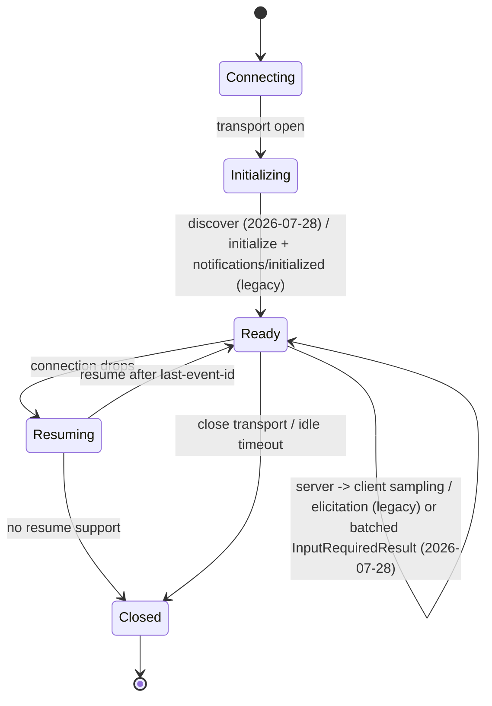

# Sessions and Stateful vs Stateless Servers

> **Interview answer (say this first).** An MCP session starts with the handshake — `server/discover` on protocol 2026-07-28, or `initialize` + `notifications/initialized` on legacy servers — and lasts until the transport closes. A **stateful** server keeps per-session state and a long-lived connection, which is required for subscriptions, legacy mid-call server-to-client requests, and resumable streams. A **stateless** server makes every request self-contained, so any replica can serve any request and you can scale horizontally without sticky sessions. On 2026-07-28 sampling and elicitation no longer need a live back-channel: the server returns a batched `InputRequiredResult` and the client resumes the call with `input_responses`/`request_state`, so they work on stateless workers. Choose stateful when the session carries real state or side channels; choose stateless when each call is independent and you want simple, elastic scaling. For stateful servers behind a load balancer, pin a session to one replica or externalize the state.

## Why this exists

An MCP request is not automatically independent. The protocol has a lifecycle, and some features only make sense inside a live session:

- **Subscriptions** stream updates for a resource or notification type over time.
- **Sampling** asks the client to run the server's prompt through the client's model. On 2026-07-28 it is batched with other asks into an `InputRequiredResult` and needs no live connection; legacy protocols send it mid-call over an open connection.
- **Elicitation** asks the user for input mid-tool-call. Modern protocols batch it alongside sampling; legacy protocols send it server-to-client mid-call.
- **Resumable streams** replay messages a client missed after a drop.

If you build a server that ignores the session, the stateful features break. If you build a server that assumes one process holds the session, horizontal scaling breaks instead.

The failure is easy to produce:

```text
User starts a long calculation. The client holds session S.
The load balancer sends the next request to a different replica.
That replica has never seen S. It either rejects the request
or, worse, starts a second calculation from scratch.
```

A second failure is pure waste: a stateless tool like `convert_units` or `get_time` does not need a session at all, yet the server keeps a connection and a per-session object for every caller. That caps how many clients one instance can serve.

Session design is choosing, deliberately, **where state lives** and **how long a connection lives**:

| State lives... | Consequence |
| --- | --- |
| In one server process, per session | Fast, simple, but breaks across replicas and restarts. |
| In the session's HTTP identity (`mcp-session-id`) | Works with sticky routing; still lost on restart. |
| In an external store (Redis, DB) | Survives restarts and scales, at the cost of a network hop. |
| Nowhere (stateless) | Trivially scalable; no subscriptions, but modern sampling/elicitation still work via a batched `InputRequiredResult`. |

> **Note:**
>
> **The one-sentence purpose.** The session is the unit of continuity; stateful servers keep it, stateless servers reject it, and the right choice follows from whether continuity actually buys you anything.


## Start from zero

| Word | Plain meaning |
| --- | --- |
| **Session** | One logical connection between a client and a server, from the handshake to close. |
| **Connection lifecycle** | The stages: connect, handshake, ready, (reconnect), close. |
| **Transport** | The byte channel: `stdio` (local process) or streamable HTTP (remote). |
| **stdio** | Client launches the server and talks over its stdin/stdout. One process per client. |
| **Streamable HTTP** | Remote transport. The client POSTs messages; the server may stream responses with SSE. |
| **SSE** | Server-Sent Events — a one-way stream from server to client used for long responses. |
| **Session id** | The `mcp-session-id` HTTP header the server issues and the client echoes back. |
| **Stateful server** | Keeps per-session state and a long-lived connection. |
| **Stateless server** | Treats each request independently; no per-session memory. |
| **Sticky session** | Load-balancer rule that sends a given session to the same replica every time. |
| **Replica** | One running copy of the server behind a load balancer. |
| **Resumability** | Replaying missed messages after a dropped stream. |
| **Event store** | Storage of stream events so they can be replayed by event id. |
| **`last-event-id`** | Header the client sends on reconnect to say "resume after this event". |
| **Idle timeout** | How long a session may sit unused before the server drops it. |
| **Backpressure** | Slowing a producer when the consumer cannot keep up. |
| **Server-initiated request** | A request from server to client, such as sampling or elicitation. |
| **Subscription** | A standing request to stream change events until cancelled. |

Three distinctions to carry:

- **Stateful is about continuity, not size.** A server is stateful if behavior depends on prior messages in the same session.
- **Stateless is about self-containment, not speed.** A stateless handler can be slow; it just cannot depend on the session.
- **A session is not authentication.** The session id identifies continuity. Identity comes from the token, checked per request.

## The core idea

A **stateful** session is a phone call: both sides stay connected, either can speak at any time, and the conversation has a history. A **stateless** request is a text message: each one stands alone, the receiver need not remember anything, and you can route it to any operator.



The state diagram is the same for both server styles; what differs is whether `Ready` has memory and whether `Resuming` is possible.

| Property | Stateful server | Stateless server |
| --- | --- | --- |
| Per-session state | Yes | No |
| Long-lived connection | Yes | Not required |
| Subscriptions | Supported | Not supported |
| Server-initiated requests | Supported via a live back-channel | Legacy back-channel: not possible; 2026-07-28: batched in `InputRequiredResult` |
| Resumable streams | With an event store | No |
| Horizontal scaling | Needs sticky routing or shared state | Any replica |
| Restart behavior | Sessions lost unless externalized | Unaffected |
| Typical use | Interactive agents, streams, multi-step flows | Simple tools, high fan-out, serverless |

A useful middle path: keep the **connection** stateful but make expensive state **external**, so a session can move or survive a restart.

## How it works

1. **The transport opens.** For `stdio`, the client spawns the server process. For HTTP, the client connects to the URL.
2. **The client negotiates the protocol.** On 2026-07-28 it sends `server/discover`; on legacy servers it sends `initialize` and then `notifications/initialized`. Either way, protocol version and capabilities are fixed.
3. **The server establishes the session.** If it is stateful, it creates a per-session object; if not, it creates nothing that outlives the request.
4. **The server returns `Mcp-Session-Id` over HTTP.** The client must send this header on later requests so the server can find the same session.
5. **Requests flow.** Tools, resources, and prompts are called. On legacy protocols the server may also send requests back to the client (sampling, elicitation) because the connection is open; on 2026-07-28 those asks ride back as a batched `InputRequiredResult`, and the client resumes the call with `input_responses`/`request_state` even with no live session.
6. **Streams flow.** Subscriptions and long responses use SSE. Events are numbered so they can be replayed.
7. **The connection drops.** The client may reconnect and resume by sending `Last-Event-ID`, if the server recorded events in an event store.
8. **The session ends.** Either side closes the transport, or the server drops an idle session after a timeout.

For a stateless server, steps 4–7 change: the server may issue a session id but keep nothing, or run without sessions entirely. Each request carries everything it needs — the token for identity, the arguments for the action, and an idempotency key if a retry must not repeat a side effect.

**Scaling.** Stateful servers behind a load balancer need **sticky sessions** (route by session id) so the session stays on one replica. Better, externalize the state so any replica can serve any request. Stateless servers need neither: any replica will do, which is why they fit serverless platforms and bursty traffic.

## The syntax you will use

Examples use `mcp` 2.2.0. The same `MCPServer` object can run over either transport.

**Run over stdio (local, stateful by nature).** One process per client, no session id needed.

```python
from mcp.server.mcpserver import MCPServer

mcp = MCPServer("local-demo")

# ... register tools ...

if __name__ == "__main__":
    mcp.run(transport="stdio")
```

**Run over streamable HTTP (remote).** This is the default remote transport.

```python
if __name__ == "__main__":
    mcp.run(transport="streamable-http", host="0.0.0.0", port=8000)
```

**Turn on stateless mode.** Each request is self-contained; no per-session state is kept. `run_streamable_http_async` is `async def`, so call it through the sync `run` (or wrap it in `anyio.run(lambda: ...)`); calling it bare only builds a coroutine and never starts the server.

```python
mcp.run(
    transport="streamable-http",
    host="0.0.0.0",
    port=8000,
    stateless_http=True,     # every request stands alone
)
```

**Tune the session manager.** These knobs bound memory and lifetime.

```python
mcp.run(
    transport="streamable-http",
    host="0.0.0.0",
    port=8000,
    json_response=False,           # stream responses with SSE when useful
    session_idle_timeout=1800,     # drop sessions idle for 30 minutes
    max_sessions=10_000,           # cap concurrent sessions
)
```

**Keep shared resources in a lifespan.** A lifespan is server-wide, not per session — the right place for a database pool.

```python
from collections.abc import AsyncIterator
from contextlib import asynccontextmanager

@asynccontextmanager
async def lifespan(server: MCPServer) -> AsyncIterator[dict]:
    pool = await open_pool()      # one pool for the whole server
    try:
        yield {"pool": pool}
    finally:
        await pool.close()

mcp = MCPServer("app", lifespan=lifespan)
```

**Implement resumability with an event store.** The store records events so a reconnect can replay them.

```python
from mcp.server.streamable_http import EventStore, EventId, StreamId
from mcp.server.streamable_http import EventCallback

class RedisEventStore(EventStore):
    async def store_event(self, stream_id: StreamId, message) -> EventId:
        ...   # persist the message, return its event id

    async def replay_events_after(self, last_event_id: EventId, send: EventCallback) -> StreamId | None:
        ...   # find the stream, replay everything after last_event_id
```

**The HTTP session header.** The client echoes it; the server uses it to find the session.

```text
Mcp-Session-Id: 4f3c...      # issued by the server, echoed by the client
Last-Event-ID: 17            # on reconnect, resume after event 17
Mcp-Protocol-Version: 2026-07-28
```

**Connect a remote client.** A URL selects the streamable HTTP transport.

```python
from mcp import Client

async with Client("https://mcp.example.com/mcp") as client:
    tools = await client.list_tools()
```

## Examples: simple to real

**Example 1 — a stateless tool needs no session.** Pure computations scale trivially.

```python
@mcp.tool()
def convert_units(value: float, unit: str) -> float:
    """Convert a distance to metres."""
    return value * 1000 if unit == "km" else value
```

No prior call affects this one. Run it stateless, put it on any replica, and you can restart freely.

**Example 2 — session state is genuinely required for a cart.** Multi-step operations need continuity.

```text
tools/call add_item(item="book")
tools/call add_item(item="pen")
tools/call checkout()
```

`checkout` depends on both prior calls. If each request can land on a different replica, the cart must live in a shared store keyed by session, or the session must be pinned to one replica. There is no stateless version of this behavior.

**Example 3 — sampling and elicitation work statelessly on 2026-07-28.** On the modern protocol the server does not need a live back-channel. It ends the tool call with an `InputRequiredResult` carrying the batched `input_requests` plus opaque `request_state`; the client resolves the asks and retries the same call with `input_responses` and that `request_state`. Everything needed to resume travels in the request, so any stateless worker can serve the retry.

```text
tool call 1 -> InputRequiredResult(
                 input_requests=[sampling/createMessage("summarize this run")],
                 request_state="...")
client resolves it, then retries:
tool call 2 (input_responses={...}, request_state="...") -> normal tool result
```

Only the legacy protocol (≤ 2025-11-25) sends each ask mid-call over the open connection, which a stateless worker cannot do. So choose stateful for legacy mid-call requests, subscriptions, and resumable streams; modern sampling and elicitation are stateless-friendly.

**Example 4 — subscriptions need session-scoped lifetime.** A stream ends when the session ends.

```python
# Server advertises resources.subscribe = True
# Client subscribes, then receives notifications until it unsubscribes
# or the session closes.
```

The subscription belongs to the session. A stateless request has no "until later", so there is nowhere for the stream to live.

**Example 5 — resumability turns a dropped stream into a replay.** The event store is what makes reconnection lossless.

```text
Client receives events 1..9, then the network drops.
Client reconnects with Last-Event-ID: 9.
Server replays 10, 11, 12 from the event store.
Client's view is complete — no gap, no duplicated work.
```

Without an event store, the client must re-list or restart, and in-flight work may be lost.

**Example 6 — choose per capability, not per server.** A single server can mix both styles by putting state in a shared store.

```text
Stateless tools: convert_units, get_time, search_public_docs
Stateful tools: cart_checkout, watch_repo, run_workflow
Shared store:   Redis keyed by session id, so any replica can serve either.
```

You get stateless scalability for the easy cases and correct continuity for the hard ones, at the cost of one network hop for the shared state.

## In production

- **Default to stateless when you can.** If a handler does not read session state, it should not force sticky routing. This is the single biggest scaling lever.
- **Externalize state before you scale out.** In-process session objects work on one replica and fail on two. Move them to Redis or a database, keyed by session.
- **Sticky sessions are a load-balancer decision, not a server one.** If you rely on them, configure the LB explicitly and document it. Otherwise the first scale-out event breaks you.
- **Cap sessions and idle them out.** `max_sessions` and `session_idle_timeout` bound memory. An unbounded session table is a memory leak with extra steps.
- **Do not treat the session id as authentication.** It provides continuity. Identity comes from the token, validated on every request.
- **Resumability needs durable events.** An in-memory event store helps only until the process restarts. For real replay, use shared storage and prune old events.
- **Handle reconnect gracefully.** A resumed session must still be principal-bound. If another user can attach, they inherit its authority.
- **Idempotency keys protect stateless retries.** Because a stateless retry may hit a new replica, a repeated write needs a key the server can collapse.
- **Long-lived connections hit proxy timeouts.** Load balancers and proxies cut idle connections. Send heartbeats, or design for reconnection.
- **Backpressure matters on streams.** A slow consumer with a fast producer grows a buffer. Bound it, and drop or pause the producer.
- **A server restart drops sessions.** Decide what happens: clients re-initialize, or state survives in an external store. Both are valid; silence is not.
- **stdio is inherently stateful and local.** One process per client, no auth needed, but it does not scale across machines.

## Interview questions

### 1. What is an MCP session, and when does it start and end?

**Answer.** A session is one logical client-to-server connection from the handshake to the transport closing. It starts when the client negotiates the protocol (`server/discover` on 2026-07-28, otherwise `initialize` + `notifications/initialized`) and the server accepts, and ends when either side closes the transport or the server drops an idle session. Capabilities are fixed at the start; catalog items can change during it.

**Follow-up: "Can one client have many sessions?"** Yes. A host can open several client connections, each with its own server and session. They are independent.

**Trap.** Conflating a session with an HTTP request. A stateful session spans many requests; a stateless server may process each request with no session at all.

### 2. What makes a server stateful?

**Answer.** Its behavior depends on prior messages in the same session. Keeping a cart, holding a subscription, or sending a legacy mid-call server-to-client request all require state that outlives a single request. On 2026-07-28 sampling and elicitation are batched into the tool result, so they do not force state. If the handler's output depends only on its arguments and external stores, the server can be stateless.

**Follow-up: "Is a database pool per-session state?"** No. It is a shared resource; scope it with a lifespan so one pool serves all sessions.

**Trap.** Saying "stateful means it uses a database". Using a database can make a server *stateless* if every request reads and writes without in-process session memory.

### 3. How do you scale a stateful MCP server?

**Answer.** Either pin each session to one replica with sticky routing, or externalize the session state so any replica can serve any request. Sticky routing is simpler but fragile on restart and rebalance. External state scales better and is the usual production answer, at the cost of a network hop and consistency handling.

**Follow-up: "What breaks with sticky sessions?"** A replica restart moves sessions and breaks in-flight streams. Rolling deploys disrupt active users unless clients reconnect and resume.

**Trap.** Assuming the load balancer will "just work". Session affinity is explicit configuration, and getting it wrong shows up only under load.

### 4. When should you choose a stateless server?

**Answer.** When each call is independent, you want elastic scaling, or you deploy to serverless where connections are short. Pure tools, lookups, and conversions fit. You give up subscriptions and resumable streams, and on legacy servers mid-call server-to-client requests. On 2026-07-28 sampling and elicitation still work because they are batched into the tool result. So stateless is the wrong choice for streams and legacy interactive flows, but many tool servers fit.

**Follow-up: "How do you keep writes safe across replicas?"** Use idempotency keys and a shared store for the write, so a retried request on another replica collapses to one effect.

**Trap.** Choosing stateless for a workflow with multiple dependent steps, then discovering the steps land on different replicas with no shared context.

### 5. How does resumability work after a dropped connection?

**Answer.** The server numbers stream events and records them in an event store. On reconnect the client sends `Last-Event-ID`, and the server replays everything after it. Without an event store there is no replay, so the client must re-list or restart. The store must be durable and bounded — prune old events.

**Follow-up: "What is replayed — requests or responses?"** The server-to-client stream events the client missed. In-flight work is not magically re-executed; the client resumes receiving the stream.

**Trap.** Using an in-memory event store and calling it resumable. It works until the process restarts, which is exactly when you need it.

### 6. Can sampling and elicitation work on a stateless server?

**Answer.** On protocol 2026-07-28, yes. The server returns the `tools/call` as a batched `InputRequiredResult`; the client answers and retries the same call with `input_responses` and `request_state`, all self-contained, so no live session or back-channel is needed. On legacy protocols they are mid-call server-to-client requests that need a channel back to the client while the connection is open, so a stateless server cannot drive them.

**Follow-up: "So what still forces stateful?"** Subscriptions and resumable streams, plus legacy mid-call requests. Modern sampling and elicitation do not.

**Trap.** Assuming stateless means "no sampling or elicitation" and adding needless sticky routing; the real question is which protocol revision the client and server negotiated.

### 7. What is the difference between the session id and the access token?

**Answer.** The session id provides continuity: it lets the server find the same session across HTTP requests. The access token provides identity and authorization. They answer different questions, and a valid session id proves nothing about who is calling. Never authorize from a session id.

**Follow-up: "How do they combine?"** Validate the token on every request, then use the session id to locate state. Binding the session to the token's principal prevents one user from attaching to another's session.

**Trap.** Treating `mcp-session-id` as a bearer credential. Sessions can be guessed or leaked; tokens are the security boundary.

### 8. What does `stateless_http=True` actually change?

**Answer.** It makes each HTTP request self-contained and prevents the server from keeping per-session in-memory state. Any replica can serve any request, so it scales without affinity. In exchange, subscriptions and resumable streams are unavailable, legacy mid-call requests cannot be driven, and any state must live in an external store. On 2026-07-28 sampling and elicitation still work: they arrive as a batched `InputRequiredResult` that the client resumes with `input_responses`/`request_state`.

**Follow-up: "Can you still issue a session id in stateless mode?"** The protocol may still carry an id, but the server must not rely on it for correctness. Behavior cannot depend on prior requests.

**Trap.** Flipping the flag to "improve scaling" without checking that no tool reads session state. Silent wrong behavior follows.

## Remember this

- **Session = handshake to close.** Capabilities fixed; items can change.
- **Stateful couples behavior to history.** It enables streams and legacy mid-call requests, and complicates scaling.
- **Stateless means self-contained.** Any replica, easy scaling, but no subscriptions or resumable streams; modern sampling/elicitation still work.
- **Externalize state to scale stateful servers.** Sticky sessions are a fallback, not the default.
- **Session id is continuity, not identity.** Authenticate with the token on every request.
