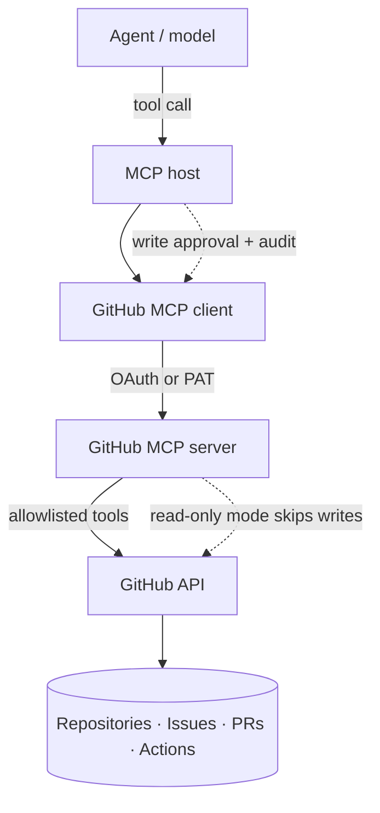

# GitHub MCP Integration

> **Interview answer (say this first).** A GitHub MCP server exposes GitHub as agent tools: read repositories and code, search issues and code, comment on issues, open and review pull requests, and inspect Actions runs. Authentication is a token or OAuth, and the token's scopes are the real permission boundary. The safe pattern is to start read-only, expose only the toolsets you need, require approval for writes, respect rate limits, and audit every action. Assume the agent can do anything the token allows, and scope the token so that is acceptable.

## Why this exists

Coding agents are most useful when they can see the repository and act on it. Without an integration, every team writes glue code against the GitHub API: fetch a file, search code, list pull requests, read logs. Each implementation drifts, and each one has its own authentication mistakes.

A GitHub MCP server standardizes that surface. It is also high-stakes, because GitHub is where source code and deployment live. The failure modes are concrete:

- An agent force-pushes to `main` and erases review history.
- An agent merges a pull request that was never reviewed.
- A token with `repo` scope is used to read one public file.
- A tool call returns a huge log, exceeds the context window, and costs a fortune.
- The agent hits the API rate limit mid-task and the workflow dies.

None of these are model bugs. They are integration design bugs. The token scope, the toolset selection, the write approvals, and the error handling decide the blast radius.

There is also a quieter cost. A broad catalog of GitHub tools is hard for the model to route correctly, because `search_code`, `search_repositories`, `search_issues`, and `search_pull_requests` all sound similar. Restricting toolsets is both a security control and a selection control, exactly like shortlisting in the tool-schema chapter.

> **Note:**
>
> **The one-sentence purpose.** A GitHub MCP integration lets an agent read and act on GitHub through a server, and its safety is determined by token scopes, toolset selection, write gating, and rate-limit handling.


## Start from zero

Before going further, here are the words this topic keeps using.

| Word | Plain meaning |
| --- | --- |
| **Repository** | A project's files and history on GitHub. |
| **Owner** | The user or organisation that owns a repository, such as a company account. |
| **Issue** | A tracked task, bug, or discussion item. |
| **Pull request (PR)** | A proposed set of changes asking to be merged into a branch. |
| **Merge** | Accepting a pull request's changes into the target branch. |
| **Actions** | GitHub's CI/CD system: workflows triggered by events. |
| **Workflow run** | One execution of a workflow, with jobs and logs. |
| **Toolset** | A named group of GitHub MCP tools, such as `repos` or `issues`. |
| **PAT** | Personal access token. A secret string that acts as your identity. |
| **Fine-grained PAT** | A PAT limited to chosen repositories and permissions. |
| **Classic PAT** | An older PAT that uses broad scopes such as `repo`. |
| **Scope** | A permission attached to a token, such as read-only access to repositories. |
| **OAuth app** | An application that logs a user in and receives a token on their behalf. |
| **GitHub App** | A first-class integration with its own identity and installation permissions. |
| **Read-only mode** | A server setting that removes write tools from the catalog. |
| **Rate limit** | A cap on how many API requests you may make in a window. |
| **Primary limit** | The hourly request budget for your authentication type. |
| **Secondary limit** | Extra anti-abuse limits on concurrency, points, or content creation. |
| **Branch protection** | Repository rules that block direct pushes or require reviews. |
| **Audit log** | A record of what the agent did, to whom, and when. |
| **Approval gate** | A human yes/no before a risky write is executed. |

Three distinctions matter:

- **Authentication vs authorization.** The token proves who you are; its scopes decide what you may do. Two tokens can share an identity and have very different power.
- **Read tools vs write tools.** Reading is usually safe to automate. Writing — comments, branches, pushes, merges — changes shared state and needs a policy.
- **Primary vs secondary rate limits.** The hourly budget is visible in headers. The anti-abuse limits are stricter, less visible, and can return `403` or `429` even when budget remains.

## The core idea

Think of an office building. A visitor badge opens the lobby and meeting rooms. A staff badge opens the archive. A master key opens everything, including the server room.

GitHub tokens are badges. The mistake is handing an agent the master key because it is convenient. The official GitHub MCP server supports the same idea in two places: the token you provide, and a read-only mode that hides write tools from the catalog entirely.



The catalog itself is a safety control. The server groups tools into **toolsets**. If you enable only `repos` and `issues`, the model never sees merge or Actions tools. That is less context, better selection, and a smaller blast radius.

| Read operations (examples) | Write operations (examples) |
| --- | --- |
| `get_file_contents` | `create_or_update_file` |
| `search_code`, `search_repositories` | `push_files`, `create_branch` |
| `issue_read`, `list_issues`, `search_issues` | `issue_write`, `add_issue_comment` |
| `pull_request_read`, `list_pull_requests` | `create_pull_request`, `update_pull_request`, `merge_pull_request` |
| `actions_list`, `actions_get`, `get_job_logs` | `actions_run_trigger` |
| `get_commit`, `list_commits`, `get_repository_tree` | `delete_file`, `delete_repository` |

These names come from the official GitHub MCP server's documented tool list. Names and toolsets change over time, so treat this as a representative mapping rather than a frozen contract. Always discover the catalog at runtime instead of hard-coding it.

The catalog is also a routing control. A small, named toolset is easier for the model to choose from than a hundred overlapping tools, and it is easier to reason about during an incident. When something goes wrong, you want to know that merge tools were never even in the prompt.

This is why the enterprise answer is usually a gateway rather than a pile of separately scoped tokens. One front door can enforce a single allowlist and audit every server, and that idea is the subject of the later gateway chapter.

## How it works

1. **Choose hosted or local.** GitHub hosts a remote server at `https://api.githubcopilot.com/mcp/`. The local server runs from the `ghcr.io/github/github-mcp-server` image or a built binary over stdio.
2. **Authenticate.** On github.com, the remote and local servers support a browser OAuth flow that keeps the token in memory. A personal access token set as `GITHUB_PERSONAL_ACCESS_TOKEN` takes precedence over OAuth and is the common choice for non-interactive setups.
3. **Scope the token.** Prefer a fine-grained PAT limited to specific repositories and only the permissions needed. A classic `repo` token is broad; avoid it unless you truly need it.
4. **Select toolsets.** Pass `--toolsets` or set `GITHUB_TOOLSETS`. The default set is `context`, `repos`, `issues`, `pull_requests`, and `users`. The special value `all` enables everything, which you rarely want.
5. **Consider read-only mode.** The `--read-only` flag causes write tools to be skipped, even if explicitly requested via `--tools`.
6. **Connect and discover.** The MCP client performs the handshake and lists tools. Only the enabled tools appear.
7. **Map tools to the model.** Translate each tool's name, description, and input schema into the provider's tool format.
8. **Execute reads freely.** File reads, searches, issue reads, and log reads do not change shared state.
9. **Gate writes.** Comments, pushes, and merges go through an approval gate and, ideally, a separate token or server instance with only the needed write toolsets.
10. **Respect the budget.** Read the rate-limit headers on every response and back off on `403` or `429`. Never hammer a limit; repeated violations can get the integration banned.
11. **Audit.** Log the caller, repository, tool, and outcome for every write. GitHub's own audit tooling helps, but your agent log should stand alone.
12. **Let branch protection be the last line.** Require reviews and disallow direct pushes to protected branches, so even a compromised token cannot merge unreviewed code.

For GitHub Enterprise Server, the hosted remote server is not available; run the local server and point it at your host. For Enterprise Cloud with data residency, the remote endpoint uses your subdomain rather than `api.githubcopilot.com`. Check the official installation guide for your host, because the exact URL and OAuth support vary.

## The syntax you will use

**Remote server with OAuth (no token to store).**

```json
{
  "servers": {
    "github": { "type": "http", "url": "https://api.githubcopilot.com/mcp/" }
  }
}
```

**Remote server with a PAT.** The token travels in the `Authorization` header.

```json
{
  "servers": {
    "github": {
      "type": "http",
      "url": "https://api.githubcopilot.com/mcp/",
      "headers": { "Authorization": "Bearer ${input:github_mcp_pat}" }
    }
  }
}
```

**Local server over stdio with Docker.** The `-i` flag is what makes stdio work.

```json
{
  "servers": {
    "github": {
      "command": "docker",
      "args": ["run", "-i", "--rm", "-e", "GITHUB_PERSONAL_ACCESS_TOKEN",
               "ghcr.io/github/github-mcp-server"],
      "env": { "GITHUB_PERSONAL_ACCESS_TOKEN": "${input:github_token}" }
    }
  }
}
```

**Select toolsets.** Only these groups are registered, which shrinks the catalog.

```bash
github-mcp-server --toolsets repos,issues,pull_requests,actions,code_security
```

**Enable read-only mode.** Write tools are removed from the catalog.

```bash
github-mcp-server --read-only --toolsets repos,issues,pull_requests
```

**Connect a Python client to the remote server with a PAT.** The v2 SDK passes an HTTP client for headers.

```python
from mcp.client.streamable_http import streamable_http_client
from mcp.shared._httpx_utils import create_mcp_http_client

http_client = create_mcp_http_client({"Authorization": f"Bearer {pat}"})
async with streamable_http_client(GITHUB_MCP_URL, http_client=http_client) as (read, write):
    ...
```

**Handle rate limits from headers.** Prefer `retry-after`; otherwise wait for the reset time. Header names are case-insensitive, so normalise them first — GitHub sends `Retry-After`, not `retry-after`, and a case-sensitive lookup would miss it and wrongly report "wait 0s".

```python
import time

def plan_retry(status: int, headers: dict[str, str], now: float | None = None) -> str:
    now = time.time() if now is None else now
    if status not in (403, 429):
        return "no retry needed"
    h = {k.lower(): v for k, v in headers.items()}   # HTTP header names are case-insensitive
    if "retry-after" in h:
        return f"wait {int(h['retry-after'])}s (secondary limit)"
    if int(h.get("x-ratelimit-remaining", "0")) == 0:
        reset = int(h.get("x-ratelimit-reset", str(int(now))))
        return f"primary limit: wait {max(0, reset - int(now))}s"
    return "wait at least 60s (unknown secondary limit)"
```

**Guard writes with an allowlist and approval.** Deny anything not explicitly allowed.

```python
READ_TOOLS = {"get_file_contents", "search_code", "list_issues", "pull_request_read"}
WRITE_TOOLS = {
    "add_issue_comment",
    "create_pull_request",
    "merge_pull_request",
    "add_comment_to_pending_review",   # used in Example 3
    "pull_request_review_write",       # creates, submits, or deletes reviews
}

def authorise(tool: str, *, read_only_mode: bool, approved: bool) -> str:
    if tool in READ_TOOLS:
        return "allow"
    if tool in WRITE_TOOLS:
        if read_only_mode:
            return "deny: server is read-only"
        if not approved:
            return "deny: requires human approval"
        return "allow: approved write"
    return "deny: unknown tool"
```

## Examples: simple to real

**Example 1 — a read-only code question.** The agent reads a file and searches for a symbol.

```text
get_file_contents(owner="acme", repo="billing", path="src/rates.py")
search_code(q="calculate_tax repo:acme/billing")
```

Both are reads. They change nothing and can run without approval.

**Example 2 — issue triage with one write.** The agent reads issues, then adds a comment.

```text
list_issues(owner="acme", repo="billing", state="open")
issue_read(owner="acme", repo="billing", issue_number=412)
add_issue_comment(owner="acme", repo="billing", issue_number=412,
                  body="Triaged: duplicate of #380. Closing after confirmation.")
```

`add_issue_comment` is a write. It should require approval and is disabled entirely by `--read-only`.

**Example 3 — review a pull request, but do not merge it.** Reading a PR is safe; merging is not.

```text
pull_request_read(owner="acme", repo="billing", pullNumber=917)
list_pull_requests(owner="acme", repo="billing", state="open")
# write, gated:
add_comment_to_pending_review(owner="acme", repo="billing", pullNumber=917,
                              body="Looks good; one nit on error handling.")
```

Keep `merge_pull_request` out of the catalog unless a human is in the loop. Merge is the highest-consequence action. Note that `pull_request_review_write` can create, submit, or delete reviews; even a review is a visible, attributed action, so treat it as a write and audit it.

**Example 4 — inspect a failed CI run.** Read tools answer "why did the build fail?"

```text
actions_list(owner="acme", repo="billing", method="list_workflow_runs")
get_job_logs(owner="acme", repo="billing", run_id=55321, failed_only=True, tail_lines=200)
```

Verified tool names from the official docs. `tail_lines` is important: full logs are large and can blow the context window. `actions_run_trigger` is a write — it starts a workflow and spends CI minutes — so keep it out of the default catalog and gate it behind approval.

**Example 5 — fail safely under a rate limit.** This retry planner is pure Python and was executed.

```python
plan_retry(403, {"x-ratelimit-remaining": "0", "x-ratelimit-reset": "1000000"}, now=999900)
# 'primary limit: wait 100s'
plan_retry(429, {"Retry-After": "30"})   # GitHub's actual header casing
# 'wait 30s (secondary limit)'
```

Verified output. Without this, a loop of agent retries turns a temporary limit into a locked-out integration.

**Example 6 — deny-by-default write authorization.** Also pure Python and executed.

```python
authorise("get_file_contents", read_only_mode=True, approved=False)   # 'allow'
authorise("merge_pull_request", read_only_mode=False, approved=False) # 'deny: requires human approval'
authorise("create_pull_request", read_only_mode=True, approved=True)  # 'deny: server is read-only'
authorise("pull_request_review_write", read_only_mode=False, approved=True)  # 'allow: approved write'
authorise("delete_repository", read_only_mode=False, approved=True)   # 'deny: unknown tool'
```

Verified output. Note the last line: the tool exists, but it is not on the allowlist, so it is denied. Authorization is a separate decision from what the server happens to expose. A write tool that appears in an example but not in `WRITE_TOOLS` would fall through to `deny: unknown tool`, which is why `add_comment_to_pending_review` and `pull_request_review_write` are listed explicitly.

## In production

- **Start read-only.** Run with `--read-only` and the smallest toolset list. Add writes one at a time with a named owner and an approval path.
- **Prefer fine-grained tokens.** Limit to specific repositories and exact permissions. A classic `repo` token can read and write everything the account can.
- **Never commit tokens.** Use the host's secret mechanism or environment variables, and add `.env` to `.gitignore`. A leaked PAT is a full account compromise.
- **Know the primary limits.** Unauthenticated REST is 60 requests/hour. Authenticated PAT or OAuth is 5,000/hour. `GITHUB_TOKEN` in Actions is 1,000/hour per repository. Verify current numbers in GitHub docs, because they change.
- **Know the secondary limits.** No more than 100 concurrent requests; roughly 900 points/minute for REST; content creation is limited too. They can trigger even with budget remaining.
- **Honour `retry-after` and back off exponentially.** On `403` or `429`, wait. Continuing to retry can get the integration banned.
- **Truncate large outputs.** Logs, diffs, and file trees can be enormous. Use `tail_lines`, path filters, and your own byte caps.
- **Keep merges human.** A merge changes the default branch. Require review and rely on branch protection as the backstop.
- **Do not let the agent push secrets.** Scan diffs, block obvious credential patterns, and use push protection where available.
- **Separate read and write identities.** Distinct tokens or server instances make the write surface obvious and easy to revoke.
- **Treat tool output as untrusted.** Issue text, PR descriptions, and logs can contain instructions aimed at the model. This is a prompt-injection surface, not just data.
- **Audit writes end to end.** Log the actor, repo, tool, arguments, result, and the approval that authorised it.

## Interview questions

### 1. What does a GitHub MCP server actually expose?

**Answer.** Tools grouped by toolsets: repository and file reads, code and repository search, issue read and write, pull request read, review, and merge, and Actions workflow reads and triggers, plus context tools like `get_me`. Each tool calls the GitHub API under the configured token. The server also supports read-only mode.

**Follow-up: "Are the tool names stable?"** Some are aliased across versions, but you should not depend on that. Discover the catalog at runtime and enable only the toolsets you need.

**Trap.** Assuming the tool list is fixed. Servers evolve; hard-coded names break silently.

### 2. How do you scope a GitHub token for an agent?

**Answer.** Use a fine-grained PAT limited to specific repositories with only the permissions needed. For a read-only agent, grant content read and metadata read, nothing more. For a write agent, add the single write permission it needs and keep that token separate. Never use a classic wide-scope token when a narrow one works.

**Follow-up: "What if the agent needs several repositories?"** Add exactly those repositories to the token rather than broadening the scope to all repositories.

**Trap.** Treating the token as configuration and not as a security boundary. The token is what the agent can do, regardless of prompts.

### 3. What is the difference between primary and secondary rate limits?

**Answer.** The primary limit is the hourly request budget for your authentication type: 60/hour unauthenticated, 5,000/hour authenticated, 1,000/hour for `GITHUB_TOKEN` in Actions. The secondary limits are anti-abuse rules on concurrency, request points, CPU time, and content creation. They can return `403` or `429` even when primary budget remains.

**Follow-up: "How do you respond?"** On `retry-after`, wait that many seconds. Otherwise wait for `x-ratelimit-reset` if remaining is zero, or at least a minute for an unknown secondary limit, with exponential backoff.

**Trap.** Retrying immediately in a loop. Repeated violations can get the integration banned.

### 4. How do you stop an agent merging unreviewed code?

**Answer.** Do not expose merge tools. Keep the server read-only, or enable only read and comment toolsets. Require human approval for any write, and turn on branch protection so the default branch cannot be pushed or merged without review. Defence in depth, not one control.

**Follow-up: "Is a prompt enough?"** No. Prompts are probabilistic. The catalog, the approval gate, and branch protection are deterministic.

**Trap.** Relying on the model to "know" it should not merge. Capability removal is the reliable control.

### 5. How do you design the review and CI workflows?

**Answer.** Use read tools to fetch the PR, diff, checks, and failed job logs, and let the agent summarize and suggest. If it comments, that is a gated write. Merging stays with a human. For CI, read workflow runs and logs; treat `actions_run_trigger` as a write because it starts jobs and spends minutes.

**Follow-up: "Why cap log output?"** Logs are large. Without `tail_lines` or a byte cap, one call can fill the context window and crowd out the actual task.

**Trap.** Letting the agent request full logs for every failed job. Cap and filter first, then fetch.

### 6. What are the safety concerns unique to code-writing agents?

**Answer.** They can push code, open PRs, and rewrite branches. Risks include committing secrets, introducing vulnerabilities, force-pushing over review history, and acting on instructions hidden in issue or PR text. Controls include scoped tokens, diff scanning, protected branches, no direct pushes, and human review.

**Follow-up: "What about prompt injection from GitHub content?"** It is real. A malicious issue body can tell the agent to exfiltrate a token or push a backdoor. Treat all fetched content as untrusted data, never as system instructions.

**Trap.** Assuming repository content is safe because it is technical. Attacker-controlled text can be in any issue, comment, or filename.

### 7. What should the audit record for write operations contain?

**Answer.** The authenticated actor, the repository, the tool, the arguments, the result, the timestamp, and which approval authorised it. For a comment or PR, include the target identifier. For a push, include the branch and commit. That is enough to reconstruct and, if needed, revert.

**Follow-up: "Does GitHub's audit log replace this?"** No. It shows GitHub-side events, but not the agent's reasoning, tool choice, or which server instance acted. Keep your own record.

**Trap.** Logging only "agent wrote to repo." Without the tool, target, and arguments, the log cannot answer what changed.

### 8. Hosted server or local server — how do you choose?

**Answer.** The hosted remote server is fastest to set up and supports OAuth with tokens kept in memory. The local server gives you control over the environment, toolsets, and network, and is required for GitHub Enterprise Server. Both expose the same capability model, so choose based on network policy, enterprise hosting, and how much control you need.

**Follow-up: "Which is more secure?"** Neither automatically. Security comes from token scopes, toolset selection, read-only mode, and approvals. Hosting changes where the process runs, not what it is allowed to do.

**Trap.** Assuming local means trusted. A local server with a wide token is just as dangerous.

## Remember this

- **The token is the boundary.** Scope it tightly; prefer fine-grained PATs.
- **Select toolsets and start read-only.** The catalog you expose is a safety control.
- **Gate every write.** Comments, pushes, and merges need approval and an audit record.
- **Respect both rate limits.** Read the headers, back off on `403`/`429`, cap output.
- **Treat GitHub content as untrusted.** Issues, PRs, and logs can carry injection attempts.
