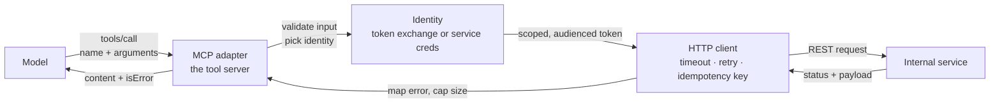

# Internal API MCP Integration

> **Interview answer (say this first).** Wrapping your own HTTP services as MCP tools means writing a thin adapter, not dumping the API. Choose a small set of task-level tools instead of one tool per endpoint, keep identity explicit instead of passing raw tokens around, make writes idempotent so retries are safe, and translate upstream errors into messages the model can act on. The adapter is a product surface for a model, not a mirror of your REST API.

## Why this exists

You already have internal services: orders, billing, inventory, user profiles. Your agent needs them. The question is how the model reaches them.

There are two tempting shortcuts, and both are wrong.

**Shortcut one: one generic HTTP tool.** Expose `http_request(method, path, body)` and let the model call anything. This looks flexible. In practice it hands the model your entire API surface, including the endpoints you never meant to expose at all. There is no schema to validate against, no per-action policy, and no clear name in the audit log. A hallucinated path is now a real request.

```text
Model: http_request("DELETE", "/internal/admin/v1/reset", {})
```

**Shortcut two: auto-generate one tool per endpoint.** Point a generator at your OpenAPI spec and publish 400 tools. Now the context is full of near-duplicate names, the model picks the wrong one, and every schema change breaks the catalogue. The model spends its reasoning budget choosing between `cancel_order` and `delete_order`.

Both shortcuts skip the real work: **deciding what capabilities a model should have**, then implementing exactly those.

There is also a subtler failure. An API is built for programs that already know the caller's identity, because the token is in the request. A model is not a program with a token; it is a text generator. If the design lets the model supply identity or credentials as arguments, you have created a path for a confused-deputy attack and a path for leaking secrets into transcripts.

> **Note:**
>
> **The one-sentence purpose.** The MCP layer turns a program-shaped API into a small set of safe, well-described, model-shaped capabilities.


## Start from zero

| Word | Plain meaning |
| --- | --- |
| **Adapter** | A thin layer that translates between two interfaces. Here, between MCP tools and HTTP endpoints. |
| **Endpoint** | One URL plus method on an HTTP service, such as `GET /orders/{id}`. |
| **REST** | A common style where URLs name resources and HTTP methods name actions. |
| **Resource** | A thing the API manages: an order, a customer, an invoice. |
| **Tool granularity** | How much work one tool does. Coarse tools do a lot; fine tools do a little. |
| **Idempotent** | Calling it twice has the same effect as calling it once. `GET`, `PUT`, and `DELETE` usually are. |
| **Idempotency key** | A caller-generated unique id sent with a write so the server can detect and ignore a repeat. |
| **Authentication (authN)** | Proving who the caller is. |
| **Authorization (authZ)** | Deciding what that caller may do. |
| **Service identity** | The adapter acts as itself, with its own credentials. |
| **Delegated identity** | The adapter acts on behalf of the end user, carrying that user's authority. |
| **Token exchange** | Trading a user's token for a new token aimed at a specific downstream service (RFC 8693). |
| **Audience (`aud`)** | The claim that says which service a token was minted for. |
| **Scope** | A named permission inside a token, such as `orders:write`. |
| **Token passthrough** | Forwarding a token to a service it was not issued for. MCP forbids it. |
| **Confused deputy** | A trusted service is tricked into using its authority for the attacker's goal. |
| **Retry** | Sending the same request again after a failure. |
| **Backoff + jitter** | Waiting longer after each failure, with randomness, so retries do not stampede. |
| **At-least-once** | A delivery guarantee where a message or call may happen more than once. |
| **Error mapping** | Translating upstream error codes into messages and shapes the model can use. |
| **Retryable error** | A failure that may disappear on its own: timeout, 429, 503. |
| **Terminal error** | A failure that will repeat: bad input, forbidden, not found. |
| **Pagination** | Returning results in pages, usually with a cursor. |
| **Versioning** | Naming and evolving a contract so old callers keep working. |
| **Sunset** | A published date after which a version stops working. |

Three distinctions to hold onto:

- **Transport error vs tool result.** A malformed request is a JSON-RPC protocol error. A failed API call is a normal tool result with `isError: true`. The second is what the model can read and reason about.
- **Service identity vs delegated identity.** Acting as the service is simple but hides the user from the downstream service. Acting as the user preserves per-user authorization and audit, but requires a real token exchange, not passthrough.
- **Retryable vs terminal.** Retrying a terminal error wastes time and tokens. Retrying a non-idempotent write can double an order.

## The core idea

Your internal API is a control panel with hundreds of labelled switches, indicator lights, and safety interlocks. A program reads the manual. A model needs something different: **a handful of clearly labelled buttons that each do one understandable thing.** The adapter is the operator who turns "cancel my order" into the correct sequence of switch flips, then reports back in words: "That order already shipped, so it cannot be cancelled."

A good adapter has four jobs:

| Job | What it does | What breaks without it |
| --- | --- | --- |
| Shape | Choose tool names, descriptions, and schemas | Model picks wrong tools or calls with invalid arguments |
| Identity | Decide who the downstream sees | Lost audit trail, confused deputy, privilege escalation |
| Safety | Idempotency, retries, limits | Duplicate writes, retry storms, huge outputs |
| Translation | Map errors and shape results | Model retries forever or gives up on a fixable error |

The flow has a clear direction and a clear return path:



Now the mapping decision, which is the heart of the design. For each endpoint, ask: *is this a button the model should press?*

| REST endpoint | Expose as a tool? | Why |
| --- | --- | --- |
| `GET /orders/{id}` | Yes, `get_order` | A clear read with a bounded result. |
| `GET /orders?status=&cursor=` | Yes, `list_orders` | Useful, but cap the page size. |
| `POST /orders` | Yes, `create_order`, with an idempotency key | A real user action. Make it safe to retry. |
| `PATCH /orders/{id}` | Yes, `update_order` | Keep the schema narrow and explicit. |
| `DELETE /orders/{id}` | Maybe, `cancel_order` | Prefer a business action over a raw delete. Require approval. |
| `POST /orders/bulk` | Rarely | One tool call can affect thousands of records. |
| `GET /internal/health` | No | Operational detail the model cannot use. |
| `GET /internal/metrics` | No | Noise and potential information leak. |
| `POST /internal/admin/reset` | Never | Not a model capability at any price. |

The rule of thumb: **name the tool after the intent, not the route.** `cancel_order` is better than `delete_order` because it matches how a person talks and it can enforce business rules, such as refusing to cancel a shipped order.

## How it works

1. **Inventory the endpoints.** List every route, its method, its auth requirements, and its side effects. Mark the ones that must never be exposed. This list is a security artefact, not paperwork.
2. **Group by user intent.** Merge noisy CRUD into a few meaningful actions. Reads can often combine; writes should stay explicit.
3. **Write names and descriptions for the model.** The description is the prompt for tool selection. Say when to use it, when not to, and what it returns. Keep it to a few concrete sentences.
4. **Define `inputSchema`.** Mark required fields. Use `enum` for closed sets. Add bounds for numbers and lengths. The schema is the first line of validation.
5. **Choose the identity model.** Either the adapter has its own service credentials, or it performs a token exchange so the downstream sees the real user. Never let the model pass a token as an argument.
6. **Call the service with limits.** Set a connect and read timeout. Add a bounded retry with backoff and jitter, and only for retryable failures.
7. **Send an idempotency key on writes.** Generate it once per logical operation, store the result, and return the stored result when the same key arrives again.
8. **Validate the response before trusting it.** Check status, parse the body, and cap its size. A 2 MB HTML error page must not enter the context.
9. **Map errors into model-readable results.** Say what happened, whether it is retryable, and what to do next. Set `isError: true` for execution failures.
10. **Return structured content.** Provide `structuredContent` that matches an `outputSchema`, plus a short text summary for the model.
11. **Version the tools.** Treat tool names and schemas as an API contract. Add new fields as optional; do not silently change meaning.

## The syntax you will use

**A tool definition is a name, a description, and a JSON Schema.** This is the unit you publish.

```json
{
  "name": "get_order",
  "description": "Fetch one order by its id. Use when the user gives an order id. Returns status, items, and total.",
  "inputSchema": {
    "type": "object",
    "properties": { "order_id": { "type": "string", "description": "Order id, e.g. ord_1024" } },
    "required": ["order_id"],
    "additionalProperties": false
  },
  "outputSchema": {
    "type": "object",
    "properties": {
      "order_id": { "type": "string" },
      "status": { "type": "string", "enum": ["pending", "shipped", "cancelled"] },
      "total": { "type": "number" }
    },
    "required": ["order_id", "status", "total"]
  }
}
```

**Calls carry the tool name and arguments.** The adapter receives this and does the HTTP work.

```json
{
  "jsonrpc": "2.0",
  "id": 7,
  "method": "tools/call",
  "params": { "name": "get_order", "arguments": { "order_id": "ord_1024" } }
}
```

**A model-facing result on success uses `structuredContent`.** The spec recommends also including the serialised JSON as text for compatibility.

```json
{
  "jsonrpc": "2.0",
  "id": 7,
  "result": {
    "content": [{ "type": "text", "text": "{\"order_id\":\"ord_1024\",\"status\":\"shipped\",\"total\":99.5}" }],
    "structuredContent": { "order_id": "ord_1024", "status": "shipped", "total": 99.5 },
    "isError": false
  }
}
```

**An execution error is a normal result with `isError: true`.** The model can read the message and try a different argument.

```json
{
  "jsonrpc": "2.0",
  "id": 8,
  "result": {
    "content": [{ "type": "text", "text": "Order ord_9999 not found. Check the id and try again." }],
    "isError": true
  }
}
```

**Map HTTP status codes to retry advice.** This function is the translation layer for failures.

```python
RETRYABLE_STATUS = {408, 425, 429, 500, 502, 503, 504}
AUTH_STATUS = {401}

def map_error(status: int | None = None, exc: str | None = None) -> dict:
    if exc in {"timeout", "connection_reset"}:
        return {"isError": True, "retryable": True, "kind": "transient",
                "message": "Upstream timed out. Safe to retry."}
    if status in AUTH_STATUS:
        return {"isError": True, "retryable": False, "kind": "auth",
                "message": "Credentials expired. Re-authenticate."}
    if status in RETRYABLE_STATUS:
        return {"isError": True, "retryable": True, "kind": "transient",
                "message": "Service busy. Retry after a short delay."}
    if status == 403:
        return {"isError": True, "retryable": False, "kind": "forbidden",
                "message": "Permission denied. This action is not allowed for you."}
    if status == 404:
        return {"isError": True, "retryable": False, "kind": "not-found",
                "message": "Not found. Check the id or path, then try again."}
    if status is not None and 400 <= status < 500:
        return {"isError": True, "retryable": False, "kind": "client",
                "message": "Request rejected. Fix the arguments."}
    return {"isError": True, "retryable": False, "kind": "unknown",
            "message": "Unexpected upstream failure."}
```

**Make writes replay-safe with an idempotency key.** The key is generated once per operation and reused on every retry.

```python
class IdempotencyStore:
    def __init__(self) -> None:
        self.seen: dict[str, dict] = {}
        self.calls = 0

    def call(self, key: str, op):
        if key in self.seen:
            return "replayed", self.seen[key]
        self.calls += 1
        result = op()
        self.seen[key] = result
        return "executed", result
```

**Retry only when it is safe.** A retryable error is not enough; the operation must also be repeatable.

```python
def should_retry(method: str, has_idempotency_key: bool, error: dict) -> bool:
    if not error["retryable"]:
        return False
    if method in {"GET", "PUT", "DELETE", "HEAD"}:
        return True
    return has_idempotency_key
```

**Validate the token audience before using it.** The adapter must only accept tokens minted for it, and only call downstream with tokens minted for that service.

Audience checks are meaningful **only after** the token's signature has been verified against a trusted issuer. An unverified token can claim any audience, so the checks below are a second gate, not a substitute for signature and issuer validation.

```python
TRUSTED_ISSUER = "https://auth.example.com"

def accept_token(claims: dict, expected_aud: str, now: int) -> tuple[bool, str]:
    # Precondition: the signature has already been verified against the
    # trusted issuer's keys, so the claims below have not been tampered with.
    if claims.get("iss") != TRUSTED_ISSUER:
        return (False, "untrusted-issuer")
    if claims.get("aud") != expected_aud:
        return (False, "wrong-audience")
    if claims.get("nbf", 0) > now:
        return (False, "not-yet-valid")
    if claims.get("exp", 0) <= now:
        return (False, "expired")
    return (True, "ok")
```

**Lint the schema so credentials never become arguments.** If a field is named `token` or `api_key`, it does not belong in a model-facing tool.

```python
import re

FORBIDDEN = {"token", "password", "secret", "authorization", "bearer",
             "credential", "apikey", "accesskey", "clientsecret", "privatekey"}

def _words(name: str) -> list[str]:
    # split camelCase and acronym boundaries, then non-alphanumerics
    spaced = re.sub(r"(?<=[a-z0-9])(?=[A-Z])", " ", name)
    spaced = re.sub(r"(?<=[A-Z])(?=[A-Z][a-z])", " ", spaced)
    return re.findall(r"[a-z0-9]+", spaced.lower())

def lint_fields(props: list[str]) -> list[str]:
    flagged = []
    for prop in props:
        words = _words(prop)
        if "".join(words) in FORBIDDEN or any(w in FORBIDDEN for w in words):
            flagged.append(prop)
    return sorted(set(flagged))
```

This is a backstop for credential-shaped names, not a proof of absence. A secret can always be hidden behind an innocuous field name, so review the schema by hand as well.

**Cap large responses.** Paginate rather than dumping a full table.

```python
def cap(payload: str, limit: int = 20_000) -> tuple[str, bool]:
    if len(payload) <= limit:
        return payload, False
    return payload[:limit] + "\n...[truncated]", True
```

## Examples: simple to real

**Example 1 — the generic HTTP tool is an unbounded proxy.** This schema lets the model name any method and any path, including endpoints you never intended to publish.

```json
{
  "name": "http_request",
  "inputSchema": {
    "type": "object",
    "properties": {
      "method": { "type": "string", "enum": ["GET", "POST", "PUT", "DELETE"] },
      "path": { "type": "string" },
      "body": { "type": "object" }
    },
    "required": ["method", "path"]
  }
}
```

There is no allowlist, no per-action policy, and no meaningful name in an audit log. If your service has a network path to an admin route, this tool reaches it. Replace it with named tools.

**Example 2 — map endpoints to intents.** The design table from earlier becomes code and review. Two small reads can merge; writes stay explicit; operational endpoints never appear.

```text
GET  /orders/{id}        -> get_order           (read, bounded)
GET  /orders             -> list_orders         (read, paginated, default page size 20)
POST /orders             -> create_order        (write, idempotency key required)
POST /orders/{id}/cancel -> cancel_order        (write, approval required)
GET  /internal/health    -> not exposed
POST /internal/admin/*   -> not exposed
```

**Example 3 — mapped errors tell the model what to do.** Running `map_error` across realistic statuses:

```text
status=400     retryable=False kind=client    Request rejected. Fix the arguments.
status=401     retryable=False kind=auth      Credentials expired. Re-authenticate.
status=403     retryable=False kind=forbidden Permission denied. This action is not allowed for you.
status=404     retryable=False kind=not-found Not found. Check the id or path, then try again.
status=429     retryable=True  kind=transient Service busy. Retry after a short delay.
status=500     retryable=True  kind=transient Service busy. Retry after a short delay.
status=503     retryable=True  kind=transient Service busy. Retry after a short delay.
exc=timeout    retryable=True  kind=transient Upstream timed out. Safe to retry.
```

Notice that 403 and 404 are terminal. The model should not retry them, but the fix differs: 403 means the caller lacks permission, so the model should stop and report that rather than rephrase; 404 means the resource does not exist, so the model can check the id or path. 429 and 503 are transient, so a bounded retry is reasonable.

**Example 4 — idempotency turns a double submit into one order.** The same key returns the stored result and the operation runs once.

```text
('executed', {'order_id': 991, 'status': 'created'})
('replayed', {'order_id': 991, 'status': 'created'})
op executions: 1
```

Without the key, the same two attempts create two orders:

```text
orders created: 2 [{'order_id': 1000}, {'order_id': 1001}]
```

This matters because an agent often retries after a timeout even when the first write succeeded. The network failed, not the order.

**Example 5 — retry only when the operation is repeatable.** A retryable error on a non-idempotent write is still not safe to retry.

```text
GET    key=False status=429     retry=True
POST   key=False status=429     retry=False
POST   key=True  status=429     retry=True
POST   key=True  status=400     retry=False
DELETE key=False status=500     retry=True
POST   key=True  status=timeout retry=True
```

`DELETE` is defined as idempotent, so a retry is acceptable. `POST` without a key is not, which is exactly why the adapter should attach a key to every write.

**Example 6 — identity checks and schema lint.** A token minted for the billing API is rejected by the orders adapter, and credential-shaped fields are flagged.

```text
minted-for-mcp           accept=True  ok
minted-for-billing-api   accept=False wrong-audience
wrong-issuer             accept=False untrusted-issuer
not-yet-valid            accept=False not-yet-valid
expired-mcp              accept=False expired

clean tool  : []
leaky tool  : ['access_token', 'apiKey', 'api_key', 'client_secret', 'user_token']
```

The audience and issuer checks implement the MCP rule that a server **must not** accept tokens that were not issued for it, but only once the signature has been verified against a trusted issuer: an unverified token can claim any audience and issuer. The lint is a backstop that catches common credential-shaped names at review time, before a secret can appear in a tool argument; it cannot prove that an innocuously named field hides no secret.

## In production

- **Fewer, better tools beat complete coverage.** Every tool costs context and adds a chance of wrong selection. Aim for the smallest set that covers real tasks.
- **Never expose a generic request tool.** It removes every control you would otherwise have: schema, policy, naming, and audit.
- **Attach an idempotency key to every write.** Agent retries are common, and a duplicate payment or duplicate order is expensive. Store the key and the result, with a retention window.
- **Do not put credentials in tool arguments.** They leak into transcripts, logs, and traces. The adapter holds the credential; the model never sees it.
- **Validate token audience on both sides.** Reject inbound tokens not minted for you, and only send downstream tokens minted for that service. Token passthrough is forbidden for good reasons.
- **Bound every call.** Connect timeout, read timeout, retry count, backoff with jitter, and a maximum response size. One slow dependency should not consume the whole agent run.
- **Map errors, do not dump them.** A raw stack trace or HTML error page wastes tokens and can leak internals. Produce one clear sentence plus a retryable flag.
- **Prefer business actions to raw CRUD.** `cancel_order` can enforce "not after shipping". `delete_order` cannot.
- **Cap list results and paginate.** Return the first page, the page size, and a cursor. Let the model ask for more if it needs more.
- **Version tools deliberately.** Add optional fields for compatible change. For breaking change, publish a new tool version and keep the old one until its sunset date.
- **Write the tool description for selection.** State when to use the tool and when not to. Vague descriptions cause wrong-tool calls, which look like model failures but are design failures.
- **Test the adapter without the model.** Unit-test the mapping, the error translation, and the idempotency store directly. These are ordinary software concerns and should not depend on an LLM.

## Interview questions

### 1. Why not expose your REST API to the model one-to-one?

**Answer.** Because an API is designed for programs and a tool list is designed for a model. A one-to-one mapping produces too many overlapping tools, bloats the context, and causes wrong selection. It also publishes operational and admin endpoints that no model should ever call. The adapter exists to choose a small set of safe, well-named capabilities.

**Follow-up: "When is a one-to-one mapping acceptable?"** Almost never for a large API. It can work for a tiny service with a few unambiguous operations and no dangerous routes.

**Trap.** Assuming auto-generation from OpenAPI is free. It is fast to produce and expensive to operate, because it ignores selection quality and safety.

### 2. How do you choose tool granularity?

**Answer.** Design tools around user intent, not routes. Merge noisy reads; keep writes explicit. A tool should be understandable from its name and description, and it should do one thing the user would recognise. If a tool needs a paragraph to explain, it is probably too coarse or poorly named.

**Follow-up: "What is the risk of a coarse tool?"** One call can change many records, and the model has less control over the details. Bulk operations should usually be reviewable or split.

**Trap.** Optimising for a small tool count by making each tool do everything. Few tools with vague purposes are as bad as hundreds.

### 3. What is token passthrough, and why is it forbidden?

**Answer.** Token passthrough is when an MCP server accepts a token that was not issued to it and forwards it to a downstream API. It breaks audience checks, rate limits, and the audit trail, because the downstream sees a token that does not belong to the caller. MCP requires servers to accept only tokens issued specifically for them.

**Follow-up: "What is the correct pattern for acting as the user?"** Token exchange, such as RFC 8693, where the adapter trades the user's token for a new token with the downstream service as its audience and a narrower scope.

**Trap.** Confusing authentication with authorization. A valid token still has to be checked for scope and for the right audience.

### 4. Explain idempotency and why an agent needs it.

**Answer.** An operation is idempotent if repeating it has the same effect as doing it once. Agents retry after timeouts, and a timeout does not mean the write failed — it means you did not see the response. An idempotency key lets the server recognise a repeat and return the original result instead of performing the write twice.

**Follow-up: "Where do you store the keys?"** A durable store with a retention window, keyed by the operation. It must survive the retry, so in-memory is not enough across restarts.

**Trap.** Saying HTTP makes writes safe. HTTP says `PUT` and `DELETE` are idempotent, but `POST` is not, and real APIs are full of `POST`-style writes.

### 5. How should errors be returned to the model?

**Answer.** As a normal tool result with `isError: true`, carrying a short human-readable message and a clear signal about whether retrying could help. Keep protocol-level JSON-RPC errors for malformed requests, which the model usually cannot fix. The model can act on the execution error; it cannot act on a JSON-RPC framing error.

**Follow-up: "What should you never include?"** Stack traces, internal hostnames, raw SQL, and secrets. They leak information and consume context without helping the model act.

**Trap.** Retrying every error. Retrying a 400 or 403 wastes calls and can look like an attack.

### 6. Service identity or delegated identity — how do you decide?

**Answer.** Use delegated identity when per-user authorization and audit matter, which is most user-facing cases. Use service identity when the action genuinely belongs to the system, such as a scheduled sync, and when the downstream cannot express per-user permissions. Be explicit about which one a tool uses.

**Follow-up: "What is the danger of service identity everywhere?"** Every user inherits the service's full authority, so a single confused call can act far beyond the user's rights. The downstream audit also cannot tell users apart.

**Trap.** Mixing the two silently. A tool that usually acts as the user but sometimes falls back to a service token is hard to reason about and hard to audit.

### 7. How do you version internal API tools?

**Answer.** Treat the tool name, description, and input and output schemas as a public contract. Add new optional fields for compatible changes. For a breaking change, publish a new tool version and keep the old one until a published sunset date. Record the version in the audit log so you can tell which contract was used.

**Follow-up: "Why not just change the schema quietly?"** Because the model's behaviour and any saved prompts or evaluation suites depend on it, and because callers cannot tell when behaviour changes. Silent change makes debugging nearly impossible.

**Trap.** Renaming a tool and calling it a minor change. To the model, the name is the identity; a rename is a breaking change.

### 8. What can go wrong when the adapter returns too much data?

**Answer.** A large result fills the context, pushes out earlier reasoning, costs tokens, and often contains the wrong thing anyway. It also slows every subsequent step. Cap the size, paginate lists, and return a summary plus a way to fetch detail when needed.

**Follow-up: "How do you know the cap is right?"** Measure token usage per tool and set the cap below the point where reasoning degrades. Return a truncated flag so the model knows there is more.

**Trap.** Returning the full upstream payload because "the model can decide what matters." The model cannot decide what it never had room to read.

## Remember this

- **The adapter is a product surface, not an API mirror.** Choose task-level tools and keep the set small.
- **Never expose a generic request tool or a credential argument.** Credentials live in the adapter, never in the tool schema.
- **Make every write idempotent, and retry only repeatable operations.** A timeout is not proof of failure.
- **Validate audience, exchange tokens, and never pass a token through.** Audience and issuer checks keep trust boundaries intact, but only after the token's signature is verified against a trusted issuer.
- **Map errors to a retryable flag and a plain sentence.** The model can act on that; it cannot act on a stack trace.
