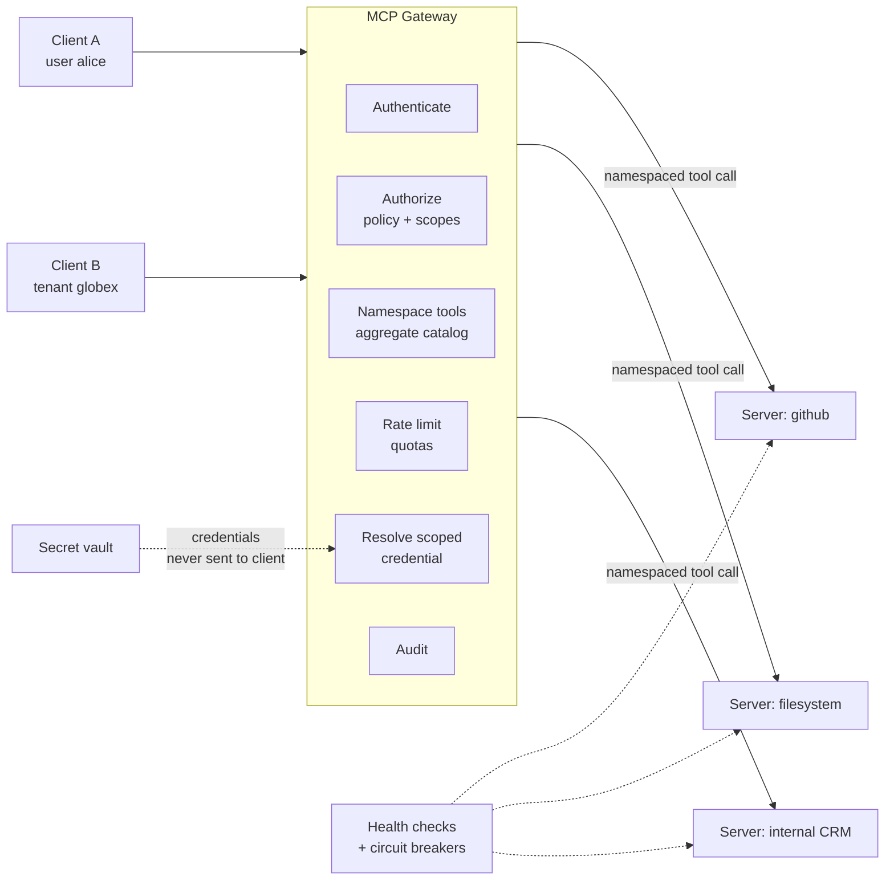

# Enterprise MCP Gateways

> **Interview answer (say this first).** An MCP gateway is one front door in front of many MCP servers. It aggregates their tools behind a single endpoint, authenticates the client, authorizes every tool call against policy, holds and scopes the upstream credentials, rate-limits and quota-limits usage, routes around unhealthy servers, and audits each call. It is the control plane for MCP. Be precise about what it guarantees: it enforces which calls are made, not what a server does with the authority it legitimately holds.

## Why this exists

Start with the naive setup. Every developer's host is configured with every MCP server. Every server implements its own authentication. Every team manages its own secrets.

This does not scale, and it fails in predictable ways:

- **Credential sprawl.** Every server's credentials live on every laptop and in every config file. One compromised laptop exposes all of them.
- **No central authorization.** There is no single place to say "contractors may not call the billing server." It is a convention, not a control.
- **No central audit.** When something goes wrong, there is no record that joins the user, the tool, the server, and the result.
- **Configuration drift.** Hosts run different server versions. A tool that works for one user fails for another, and nobody can explain why.
- **Ambiguous tools.** Two servers both expose `search`. The model calls "the" `search`, and the audit log cannot tell you which server answered.
- **Health blindness.** One flaky server slows down every agent, and there is no way to route around it.

A gateway fixes the operational problem by centralising the connection. Clients talk to one endpoint. The gateway knows every registered server, holds the credentials, and decides what each caller may do.

> **Note:**
>
> **The one-sentence purpose.** A gateway turns N servers times M clients of ad-hoc configuration into one governed endpoint with one policy and one audit trail.


## Start from zero

| Word | Plain meaning |
| --- | --- |
| **Gateway** | A service that sits between clients and upstream servers and handles policy, credentials, and routing. |
| **Front door / single endpoint** | One address clients connect to, instead of many. |
| **Aggregation** | Combining many servers' tools into one catalogue. |
| **Namespacing** | Prefixing tool names with the server, such as `github__search`, so names are unique. |
| **Authentication (authN)** | Proving who the caller is. |
| **Authorization (authZ)** | Deciding what that caller may do. |
| **Policy decision point (PDP)** | The component that makes the allow-or-deny decision. |
| **Policy enforcement point (PEP)** | The component that makes the decision stick, by blocking or allowing the call. |
| **Allowlist** | An explicit set of permitted items. Everything else is denied. |
| **Denylist** | An explicit set of forbidden items. It overrides an allowlist. |
| **Scoped credential** | A credential limited to specific permissions, services, or users. |
| **Secret store / vault** | A service that holds credentials and hands them out under policy. |
| **Rate limit** | A cap on how many calls are allowed in a time window. |
| **Quota** | A longer-term budget, such as calls per day per tenant. |
| **Token bucket** | A common rate-limit algorithm: tokens refill over time, each call spends one. |
| **Health check** | A periodic request that asks whether a server is working. |
| **Circuit breaker** | A switch that stops sending traffic to a failing server, then tests recovery. |
| **Backpressure** | Telling callers to slow down instead of accepting unlimited work. |
| **Canary** | Releasing a new version to a small share of traffic first. |
| **Multi-tenancy** | Serving several isolated customers from one system. |
| **Tenant isolation** | Making sure one customer cannot see or affect another's data or calls. |
| **Audit trail** | An append-only record of who did what, when, and with what result. |
| **Correlation id** | A unique id that ties one user request to every downstream action it caused. |
| **Control plane** | The part that manages configuration and policy. |
| **Data plane** | The part that carries the actual calls and results. |
| **Registry** | The catalogue of registered servers, versions, and owners. |

Two distinctions carry most of the weight:

- **Control plane vs data plane.** The registry, policy, and version metadata are the control plane. Tool calls passing through are the data plane. A gateway is in both paths, so it must be highly available.
- **Authentication at the gateway vs authorization at the server.** The gateway proves identity and makes a first decision. The upstream server should still authorize, because defence in depth means no single component is trusted completely.

## The core idea

Think of an office building with a single reception desk. Visitors do not get keys to every office. They present ID at reception. Reception checks which offices they are allowed to visit, calls ahead, issues a temporary badge limited to those doors, and writes the visit in the log. If an office is closed, reception does not send the visitor into a dark room.

The gateway is reception. The registry is the floor plan. The credentials in the vault are the keys, and the visitor never holds them. The badge is a scoped credential. The log is the audit trail.

Here is the shape:



And the boundary of what it can promise:

| The gateway can | The gateway cannot |
| --- | --- |
| Authenticate the caller and identify the tenant | Make a malicious or compromised server safe |
| Deny calls that policy forbids | Stop a server from misusing credentials it legitimately holds |
| Keep credentials away from the client and the model | Verify that a server obeys its declared schema |
| Rate-limit and quota-limit per user or tenant | Read payloads if end-to-end encryption hides them |
| Aggregate and namespace tools | Replace authorization logic inside the upstream service |
| Route around unhealthy servers | Prevent a supply-chain attack inside a trusted server image |
| Produce a central audit trail | Prove a server's output is truthful |

The honest framing: a gateway is a **policy enforcement point**. It narrows the set of calls that reach each server. It does not make the servers trustworthy, and it does not replace their own security.

> **Warning:**
>
> **Namespacing prevents ambiguity, not impersonation.** A malicious server can name its own tool `github__search`. The gateway must assign names from the registry based on which registration the tool came from, not trust the name the server claims.


## How it works

1. **Register each server.** The registry records the server id, its endpoint or command, its transport, its owner, and its version. Unregistered servers cannot be reached.
2. **The client authenticates to the gateway.** Typically OAuth 2.1 with PKCE, or an OIDC token, using the gateway as the token audience.
3. **The gateway maps the credential to a user and tenant.** This mapping is the basis for every later decision, so it must be reliable.
4. **The gateway builds the catalogue.** It fetches `tools/list` from each registered server, prefixes each tool with the server id, and detects collisions.
5. **The client calls a fully qualified tool.** For example `github__search`.
6. **The gateway authorizes.** It runs the policy: explicit denies first, then the allowlist, then scope checks. Default is deny. Dangerous tools may require human approval.
7. **The gateway resolves a scoped credential.** It fetches a credential from the vault that is limited to this tenant, this server, and this scope. The client never sees it.
8. **The gateway forwards the call.** With a timeout, a bounded retry for idempotent operations, and a rate-limit check before sending.
9. **The gateway validates the response envelope.** It checks structure, caps size, and stops raw upstream errors from reaching the model.
10. **The gateway records an audit event.** One record with the correlation id, user, tenant, server, tool, policy decision, and outcome.
11. **Health checks and circuit breakers manage availability.** An unhealthy server is skipped, with a clear error to the caller.
12. **The registry manages versions.** New versions are canaried, and the old version is supported until its sunset.

Two design points deserve emphasis:

- **The gateway is in the data path**, so it is both a bottleneck and a single point of failure. It must be deployed with redundancy and horizontal scale.
- **Authorization must fail closed.** An unreachable policy service, an unknown tool, or a missing scope all mean deny, never allow.

## The syntax you will use

**A registry entry.** This is the control-plane record that makes a server reachable and governable.

```json
{
  "server_id": "github",
  "transport": "streamable-http",
  "endpoint": "https://mcp-github.internal.example/mcp",
  "version": "2.3.0",
  "owner": "developer-platform",
  "scopes": ["repo:read", "repo:write"],
  "health_path": "/healthz",
  "status": "active"
}
```

**A policy document.** Deny is evaluated before allow, and default is deny.

```json
{
  "tenant": "acme",
  "server_deny": ["shell"],
  "tool_deny": ["github__delete_repo", "*__exec"],
  "tool_allow": ["github__search", "github__create_issue", "github__delete_repo", "wiki__search"],
  "require_approval": ["github__create_issue"],
  "tool_scopes": {
    "github__search": ["repo:read"],
    "github__create_issue": ["repo:write"],
    "github__delete_repo": ["repo:write"],
    "wiki__search": ["wiki:read"]
  },
  "user_scopes": {
    "alice": ["repo:read", "repo:write", "wiki:read"],
    "bob": ["repo:read"]
  }
}
```

**Namespace tools with an explicit prefix.** This function merges catalogues and detects name collisions.

```python
def aggregate(servers: dict[str, list[str]]) -> tuple[dict[str, str], list[str]]:
    catalogue: dict[str, str] = {}
    collisions: list[str] = []
    for server, names in servers.items():
        for name in names:
            qualified = f"{server}__{name}"
            if qualified in catalogue:
                collisions.append(qualified)
            catalogue[qualified] = server
    return catalogue, collisions
```

**Evaluate policy in a fixed order.** Explicit deny, server deny, allowlist, scope, approval.

```python
import fnmatch

def evaluate(user: str, tool: str, policy: dict) -> tuple[str, str]:
    server = tool.split("__", 1)[0] if "__" in tool else ""
    if any(fnmatch.fnmatchcase(tool, pattern) for pattern in policy["tool_deny"]):
        return ("deny", "explicit-deny")
    if server in policy["server_deny"]:
        return ("deny", "server-denied")
    if not any(fnmatch.fnmatchcase(tool, pattern) for pattern in policy["tool_allow"]):
        return ("deny", "not-in-allowlist")
    if not set(policy["tool_scopes"][tool]) <= set(policy["user_scopes"].get(user, [])):
        return ("deny", "missing-scope")
    if tool in policy["require_approval"]:
        return ("approval", "needs-human")
    return ("allow", "ok")
```

**Rate-limit with a token bucket.** Tokens refill at a fixed rate; each call costs one.

```python
class TokenBucket:
    def __init__(self, rate: float, capacity: float) -> None:
        self.rate, self.capacity = rate, capacity
        self.tokens = capacity
        self.updated = 0.0

    def allow(self, now: float, cost: float = 1.0) -> bool:
        self.tokens = min(self.capacity, self.tokens + (now - self.updated) * self.rate)
        self.updated = now
        if self.tokens >= cost:
            self.tokens -= cost
            return True
        return False
```

**Open a circuit for an unhealthy server.** After a threshold of failures, traffic stops until a cooldown, then one trial call is allowed.

```python
class Breaker:
    def __init__(self, threshold: int = 3, cooldown: float = 10.0) -> None:
        self.threshold, self.cooldown = threshold, cooldown
        self.failures = 0
        self.opened_at: float | None = None
        self.state = "closed"

    def allow(self, now: float) -> bool:
        if self.state == "half-open":
            # One trial call is already in flight; hold the rest back.
            return False
        if self.state == "open":
            if self.opened_at is not None and now - self.opened_at >= self.cooldown:
                self.state = "half-open"
                return True
            return False
        return True

    def record(self, ok: bool, now: float) -> None:
        if self.state == "half-open":
            self.state, self.failures = ("closed", 0) if ok else ("open", self.threshold)
            self.opened_at = None if ok else now
            return
        if ok:
            self.failures = 0
            return
        self.failures += 1
        if self.failures >= self.threshold:
            self.state, self.opened_at = "open", now
```

**Resolve credentials per tenant and server.** The gateway reads from the vault; the client receives only the result of the tool call.

```python
VAULT = {("acme", "github"): "vault://acme/github-token",
         ("globex", "github"): "vault://globex/github-token"}

def resolve_credential(tenant: str, server: str) -> str | None:
    return VAULT.get((tenant, server))
```

**Emit one audit record per call.** Keep it structured and joinable by correlation id.

```python
{
    "ts": "2026-09-13T10:00:00Z",
    "correlation_id": "c-9f21",
    "tenant": "acme",
    "user": "alice",
    "server": "github",
    "tool": "github__search",
    "decision": "allow",
    "result": "ok",
    "latency_ms": 84,
}
```

## Examples: simple to real

**Example 1 — without namespacing, two servers collide.** Both `github` and `wiki` expose a tool called `search`. If you key by bare name, one overwrites the other and the model cannot choose deliberately.

```text
naive name map   : {'search': 'wiki', 'create_issue': 'github', 'fetch': 'wiki'}
namespaced names : ['github__create_issue', 'github__search', 'wiki__fetch', 'wiki__search']
```

The namespaced catalogue makes the destination explicit in the tool name, the policy, and the audit log. The gateway should also reject a registration whose names collide, rather than silently overwriting.

**Example 2 — policy decisions are deterministic and deny by default.** Running the evaluator on realistic cases:

```text
alice  github__search         -> allow    (ok)
alice  github__create_issue   -> approval (needs-human)
bob    github__create_issue   -> deny     (missing-scope)
alice  github__delete_repo    -> deny     (explicit-deny)
alice  shell__exec            -> deny     (explicit-deny)
alice  wiki__search           -> allow    (ok)
alice  github__unknown_tool   -> deny     (not-in-allowlist)
```

Read three of these closely. Alice may create an issue, but it requires approval. Bob has only read scope, so his write is denied. Even though `github__delete_repo` is in the `tool_allow` list, the explicit deny wins — this ordering is the whole point of deny-first evaluation.

**Example 3 — a token bucket smooths bursts.** With a capacity of 3 and a refill rate of one token per second:

```text
t= 0s allow=True tokens=2.00
t= 0s allow=True tokens=1.00
t= 0s allow=True tokens=0.00
t= 0s allow=False tokens=0.00
t= 1s allow=True tokens=0.00
t= 1s allow=False tokens=0.00
```

The first three calls pass, the fourth is throttled, then one second of refill buys exactly one more call. Real gateways keep one bucket per tenant, per server, and per tool, so one noisy tenant cannot consume the shared capacity.

**Example 4 — the breaker contains a failing server.** After three failures the circuit opens. Calls fail fast until the cooldown, then a trial is allowed.

```text
after 3 failures : open
allow at t=5     : False state: open
allow at t=10    : True  state: half-open   (the one trial call)
allow at t=10    : False state: half-open   (trial already in flight)
after success    : closed failures: 0
```

Failing fast is a feature. Without a breaker, every agent request waits for a full timeout, and one sick server slows the whole platform.

**Example 5 — credentials are resolved per tenant and never returned.** The gateway hands the credential to the upstream call, not to the client.

```text
acme/github   -> vault://acme/github-token
globex/github -> vault://globex/github-token
acme/globex?  -> None
```

The third line matters: a request for a credential that is not registered returns nothing, so the gateway fails closed rather than falling back to a shared key. Tenant isolation depends on this lookup never widening.

**Example 6 — the audit record is the joinable spine.** One structured line per call:

```text
{"correlation_id": "c-9f21", "decision": "allow", "latency_ms": 84,
 "result": "ok", "server": "github", "tenant": "acme",
 "tool": "github__search", "ts": "2026-09-13T10:00:00Z", "user": "alice"}
```

With the correlation id you can join this record to the upstream service's own logs and to the agent trace. Without it, incident response becomes guesswork.

## In production

- **Run the gateway as a redundant, horizontally scaled service.** It sits in the data path. If it is down, every agent is down, so treat it with the same care as your API gateway.
- **Grade the decisions, and fail closed.** Unknown tool, missing scope, unreachable policy service, or an evaluation error all mean deny. Never let a policy outage become an implicit allow.
- **Keep policy out of the code path.** Load policy from a store with a clear version and an audit of changes. A policy you cannot review or roll back is as dangerous as no policy.
- **Never forward client credentials upstream.** Hold credentials in a vault, scope them per tenant and server, and rotate them on a schedule. Passthrough leaks authority and breaks audit.
- **Rate-limit per tenant, per server, and per tool.** A single bucket lets one noisy tenant starve everyone, and a global bucket lets one expensive tool exhaust the platform.
- **Use timeouts and circuit breakers on every upstream.** Track error rate and latency. Skip unhealthy servers and return a clear, retryable error to the caller.
- **Isolate tenants end to end.** Separate credentials, separate caches, and tenant-scoped keys everywhere. A shared cache keyed without the tenant is a data leak waiting to happen.
- **Audit before and after.** Record the decision when it is made and the outcome when it returns, both with the same correlation id. Log denials and approvals, not just successes.
- **Protect the audit store.** Append-only storage, restricted write access, and periodic export. If anyone can edit the log, it is not evidence.
- **Pin versions and canary changes.** Register an exact server version. Send a small share of traffic to a new version, watch error rates, then widen. Keep the previous version until the sunset date.
- **Limit catalogue size.** Thousands of aggregated tools bloat every client's context. Filter the catalogue by what each caller is allowed to use, so the model only sees relevant tools.
- **Do not treat the gateway as the only control.** Upstream servers must still validate input, authorize, and rate-limit. Defence in depth means the gateway is the first gate, not the only one.

## Interview questions

### 1. Why introduce a gateway instead of connecting clients directly to servers?

**Answer.** To centralise the hard parts: identity, authorization, credentials, rate limiting, health, versioning, and audit. Direct connections scatter all of those across every host and server, which leads to credential sprawl, inconsistent policy, and no single audit trail. A gateway makes the policy uniform and the usage visible.

**Follow-up: "What does it cost you?"** Another service in the data path, so you inherit its availability requirements, its latency, and its operational burden. You also add a place where a misconfiguration affects everyone.

**Trap.** Describing a gateway as a security guarantee. It is a policy enforcement point; a compromised server still has whatever power its credentials grant.

### 2. How do you aggregate tools from many servers without collisions?

**Answer.** Namespace every tool with a stable server id from the registry, such as `github__search`, instead of trusting the bare name the server reports. Detect collisions at registration and reject them. Then filter the aggregated catalogue by the caller's entitlements so the model only sees tools it may use.

**Follow-up: "Why not trust the server's own prefix?"** Because a malicious server can claim any name, including another server's prefix. The gateway must derive the prefix from the registration it actually connected to.

**Trap.** Prefixing with a display name that changes. The prefix is part of the tool identity and the audit schema, so it must be stable and versioned.

### 3. Where should authentication happen — gateway or server?

**Answer.** Both. The gateway authenticates the client and makes the first authorization decision, because it has the central view. The upstream server still validates input, checks its own authorization, and enforces its own limits. The gateway reduces the attack surface; the server owns the final check on its own resources.

**Follow-up: "What must the gateway validate about the token?"** That it was issued for the gateway as its audience, that it is not expired, and that its scopes cover the requested tool. Audience validation is what prevents token passthrough.

**Trap.** Forwarding the client's token upstream unchanged. It was not minted for that service, and the MCP rules forbid accepting it there.

### 4. How do scoped credentials work at the gateway?

**Answer.** The gateway stores each server's credentials in a vault and resolves a credential at call time based on tenant, server, and required scope. The credential is sent only to the upstream server. The client and the model never see it. Credentials are rotated, and a missing credential is a deny.

**Follow-up: "Why not one shared service credential per server?"** Then every tenant shares one identity, so per-user authorization and audit are impossible, and one leaked key exposes all tenants.

**Trap.** Injecting a credential into the model's context or tool arguments. Once a secret is in a prompt, it is in transcripts, logs, and traces.

### 5. What does rate limiting protect?

**Answer.** Three different things: the platform, the upstream services, and other tenants. A per-tenant limit prevents one customer from consuming shared capacity. A per-server limit protects a fragile dependency. A per-tool limit contains an expensive operation. Together they turn a runaway agent into a slowdown for its owner instead of an outage for everyone.

**Follow-up: "Why token bucket rather than a fixed window?"** A token bucket allows short bursts up to the bucket size while enforcing an average rate, which matches real traffic better and avoids the boundary spikes of fixed windows.

**Trap.** Setting one global limit. It is simultaneously too generous for expensive tools and too restrictive for cheap ones.

### 6. How do you handle a server that is down or slow?

**Answer.** With timeouts, health checks, and a circuit breaker. After repeated failures, the breaker opens and calls fail fast with a clear retryable error. After a cooldown, one trial request decides whether to close. This protects the gateway's threads and gives callers a fast, honest failure instead of a long hang.

**Follow-up: "What should the caller see?"** A structured error that says the server is temporarily unavailable and whether to retry. Not a stack trace, and not a silent empty success.

**Trap.** Retrying aggressively inside the gateway. Retries multiply load on a struggling service; use bounded retries with backoff and jitter, and only for idempotent operations.

### 7. How do you achieve tenant isolation?

**Answer.** Scope everything by tenant: credentials, policy, rate limits, caches, and audit records. Derive the tenant from the authenticated identity, never from a request parameter. Test isolation explicitly by trying to reach tenant A's data with tenant B's identity.

**Follow-up: "What is the most common isolation bug?"** A shared cache or connection pool keyed without the tenant, so one tenant's result is served to another. Keys must include the tenant everywhere.

**Trap.** Assuming separate credentials alone are isolation. Shared in-memory state can leak data even when the database access is correctly scoped.

### 8. What belongs in the audit record, and what does it not prove?

**Answer.** Include the correlation id, timestamp, authenticated user, tenant, server, tool, arguments (redacted), policy decision, approval if any, version, latency, and outcome. It proves what the gateway allowed and what it observed. It does not prove the server behaved correctly, and it does not prove the result was truthful. Those require server-side logs and, where it matters, independent verification.

**Follow-up: "How do you make it trustworthy?"** Append-only storage, restricted write access, and a hash chain or signed batches so tampering is detectable. "Immutable" is a property you design, not a label you apply.

**Trap.** Overclaiming. Auditing the gateway does not audit the whole system. It audits one enforcement point.

## Remember this

- **A gateway is one governed front door**: one endpoint, one policy, one audit trail, many servers.
- **Namespace by registration, deny by default, and make deny beat allow.** Policy order is part of correctness.
- **Credentials live in the vault and never reach the client or the model.** Scope them per tenant and per server.
- **The gateway is a policy enforcement point, not a trust guarantee.** A server with real authority can still misuse it.
- **It sits in the data path, so availability, timeout handling, and circuit breaking are core features, not extras.**
