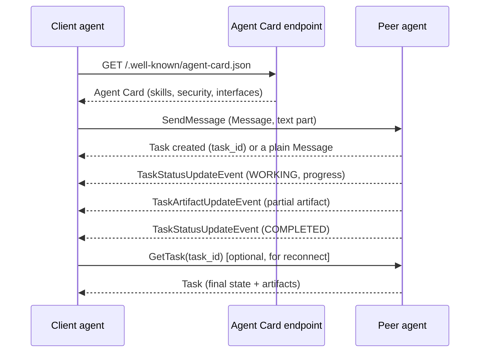

# Agent-to-Agent Communication and A2A

> **Interview answer (say this first).** MCP connects an agent to tools and data; A2A connects an agent to another agent. A2A is an open protocol where a peer publishes an Agent Card at a well-known URL describing its identity, skills, and security. A client sends a Message; the peer creates a Task with a lifecycle — submitted, working, input-required, completed, failed — and can stream status and artifact updates or use push notifications for long-running work. A handoff moves control to the peer; an MCP tool call keeps the caller in control. Trust comes from the card, signatures, auth schemes, and scoped permissions.

> **Note:**
>
> **Verified.** Every runnable pure-Python example on this page was executed on Python 3.14. The Agent Card shapes, task states, and client and server APIs were executed or introspected on Python 3.12 with the official `a2a-sdk` version `1.1.2` (protobuf-based types). A2A is evolving; check the spec and SDK version you ship.


## Why this exists

A single agent can only hold so much. At some point it needs another agent, not another function. The reasons are the same ones that justify multi-agent orchestration, but now the other agent lives behind a network boundary:

- **Specialisation.** One team owns billing, another owns compliance. Each has its own agent, tools, and data.
- **Ownership.** You cannot import another company's agent as a Python function. You call it.
- **Long-running work.** Some jobs run for minutes or hours. A plain function call cannot hold a connection that long.
- **Streaming.** The peer produces partial results and progress. The caller wants them as they arrive.

The naive solution is to wrap the remote agent as a tool. That loses things:

```text
agent_call(peer="billing", text="refund order A-100") -> "done"
```

Where is the task id? How do you ask for status an hour later? How do you cancel it? How do you get the receipt artifact? How do you know the peer's capabilities before sending a sensitive request? A flat function call answers none of these questions.

A2A (Agent-to-Agent) exists to give agent-to-agent work a real protocol: discovery through an Agent Card, work represented as a Task, updates delivered by streaming or push, and a lifecycle both sides agree on.

> **Tip:**
>
> **The one-sentence purpose.** A2A is the protocol that lets one agent delegate work to another agent it does not control, track that work over time, and receive artifacts back.


## Start from zero

| Word | Plain meaning |
| --- | --- |
| **A2A** | Agent-to-Agent: an open protocol for agents to send work to other agents. |
| **Agent** | An autonomous service that can accept a task and act on it. |
| **Agent Card** | A JSON document describing an agent: name, version, skills, security, and interfaces. |
| **Skill** | One capability an agent advertises, such as "refund processing". |
| **Well-known URL** | A fixed path where the card is served; the SDK uses `/.well-known/agent-card.json`. |
| **Message** | One unit sent to an agent, with a role and one or more parts. |
| **Part** | One piece of a message: text, raw bytes, a URL, or structured data. |
| **Task** | A stateful unit of work created from a message, with an id and a status. |
| **Task id** | The identifier used to fetch, stream, or cancel that task later. |
| **Context id** | An id grouping related tasks in one conversation or session. |
| **Task state** | The lifecycle stage, such as `WORKING` or `COMPLETED`. |
| **Artifact** | A concrete output of a task, such as a report or a JSON result. |
| **Streaming** | Receiving incremental status and artifact updates while the task runs. |
| **Push notification** | A webhook the server calls when a task updates, for work that outlives a connection. |
| **Handoff** | Transferring control so the peer owns the rest of the work. |
| **Delegation** | Sending a sub-task to a peer and using its result. |
| **Peer** | The remote agent on the other side of the call. |
| **Protocol binding** | How bytes are carried: `JSONRPC`, `HTTP+JSON`, or `GRPC`. |
| **Trust** | The reasons to believe the peer is who it claims and will behave correctly. |

Two distinctions matter:

- **Task versus RPC.** A tool call is one request and one response. A2A work is a task with a lifecycle you can observe, continue, or cancel.
- **Handoff versus delegation.** A handoff transfers ownership. Delegation keeps the caller in charge and treats the peer's result as an input.

## The core idea

Think of your agent as a person working at a desk, and a peer agent as a specialist firm.

- Before you call the firm, you read its **brochure and credentials** — the Agent Card.
- You send a **request letter** — a Message.
- The firm opens a **case file** with a reference number — a Task with a task id.
- They may write back asking for more detail — the `INPUT_REQUIRED` state.
- For a long job, they **phone you with updates** or let you **check the case online** — streaming or push plus `get_task`.
- When done, they deliver **documents** — Artifacts.



The two protocols divide the world cleanly:

| Question | MCP | A2A |
| --- | --- | --- |
| Connects | Agent to tools and data | Agent to another agent |
| Discovery | `tools/list`, resources, prompts | Agent Card at a well-known URL |
| Unit of work | Tool call (request/response) | Task with a lifecycle |
| Long-running | Progress notifications | Task states, streaming, push |
| Output | Tool result content | Messages and artifacts |
| Trust model | Host and gateway enforce scopes | Card, signatures, auth schemes |
| Typical caller | An agent runtime | An agent, or an orchestrator |

They compose. An agent uses MCP to reach its own tools, and A2A to reach another agent that uses its own MCP servers.

> **Note:**
>
> **Where the two meet.** MCP has recently added task support too, and A2A has grown more transport options. The clean mental model still holds: MCP is the tool and data plane, A2A is the peer-to-peer plane. Treat the overlap as an implementation detail and check the version you use.


## How it works

1. **Discover the peer.** Fetch the Agent Card from the well-known URL, or from a registry. The card states the interfaces, the supported bindings and versions, the skills, and the security schemes.
2. **Read the skills before sending work.** A skill has an id, a name, a description, tags, examples, and input and output modes. Matching the task to a skill is how you avoid sending work the peer cannot do.
3. **Authenticate as the security scheme requires.** The card may advertise OAuth2, API key, mTLS, or OpenID Connect. The client presents credentials; the peer validates them.
4. **Send a Message.** The message has a role and one or more parts. Text is the common case; data and URLs cover structured and large payloads.
5. **The peer may create a Task.** `SendMessage` is not guaranteed to start a task: the peer may reply with a plain Message instead, for a quick answer or a clarification. When it does create a task, the server returns a task id and status. If the peer works quickly, it may return the completed task immediately; if not, it returns a task in a working state.
6. **Follow the lifecycle.** `SUBMITTED` means accepted. `WORKING` means in progress. `INPUT_REQUIRED` means the peer needs the caller to answer. `AUTH_REQUIRED` means credentials are missing. Terminal states are `COMPLETED`, `FAILED`, `CANCELED`, and `REJECTED`.
7. **Receive updates by streaming or push.** Streaming sends status and artifact events over an open connection. Push notifications call a webhook the caller registered, which suits work that outlives any connection.
8. **Fetch state when you reconnect.** `get_task` returns the current task, including history and artifacts. This is what makes long-running work durable: the caller can come back later.
9. **Cancel when needed.** `cancel_task` asks the peer to stop. The peer decides whether cancellation is possible and moves the task to `CANCELED`, or rejects the request.
10. **Collect artifacts, not just status.** The result of real work is an artifact with parts. A status of `COMPLETED` with no artifact means the peer finished but produced nothing useful.
11. **Keep the context id across related tasks.** One context id ties a multi-turn conversation together and lets both sides log a coherent story.
12. **Verify trust inputs.** Check the card's signatures where present, pin the interface you expect, and treat every claim on the card as untrusted until the peer proves it by authenticating and completing work.

## The syntax you will use

**Build an Agent Card.** Skills are the advertised capabilities; capabilities flag streaming and push.

```python
import a2a.types as t

card = t.AgentCard()
card.name = "billing-agent"
card.description = "Handles refunds, invoices, and billing questions."
card.version = "1.4.0"

interface = card.supported_interfaces.add()
interface.url = "https://billing.example.com/a2a"
interface.protocol_binding = "JSONRPC"
interface.protocol_version = "1.0"

skill = card.skills.add()
skill.id = "refund"
skill.name = "Refund processing"
skill.description = "Start or check a refund for an order."
skill.tags.extend(["billing", "refund"])
skill.examples.append("Refund order A-100")
skill.input_modes.append("text/plain")
skill.output_modes.append("application/json")

card.capabilities.streaming = True
card.capabilities.push_notifications = True
card.default_input_modes.append("text/plain")
card.default_output_modes.append("application/json")
```

The serialized JSON uses camelCase field names such as `supportedInterfaces`, `pushNotifications`, and `defaultInputModes`.

**Discover the card at the well-known path.** The resolver takes an `httpx` client and the peer's base URL.

```python
import httpx
from a2a.client.card_resolver import A2ACardResolver
from a2a.utils import AGENT_CARD_WELL_KNOWN_PATH

async with httpx.AsyncClient() as http:
    resolver = A2ACardResolver(http, "https://billing.example.com")
    card = await resolver.get_agent_card()      # GET /.well-known/agent-card.json
```

`AGENT_CARD_WELL_KNOWN_PATH` is `/.well-known/agent-card.json` in `a2a-sdk` 1.1.2. Older drafts used `/.well-known/agent.json`, so verify the path your peer serves.

**Send a message and consume the stream.** `send_message` returns an async iterator of stream responses.

```python
import a2a.types as t
from a2a.client.client_factory import ClientFactory
from a2a.types import SendMessageRequest
from a2a.helpers import new_text_message

client = ClientFactory().create(card)           # card discovered earlier
request = SendMessageRequest(
    message=new_text_message("Refund order A-100", role=t.Role.ROLE_USER)
)

async for event in client.send_message(request):
    if event.HasField("status_update"):
        print("status:", event.status_update.status.state)
    elif event.HasField("artifact_update"):
        print("artifact:", event.artifact_update.artifact.name)
```

`StreamResponse` can hold a `task`, a `message`, a `status_update`, or an `artifact_update`. The boolean `event.HasField(...)` tells you which. `new_text_message` defaults to the agent role, so a client request sets `ROLE_USER` explicitly.

**Emit updates from the server.** The `TaskUpdater` writes status and artifact events to the event queue.

```python
import a2a.types as t
from a2a.helpers import new_text_part
from a2a.server.tasks.task_updater import TaskUpdater

async def execute(context, event_queue):
    updater = TaskUpdater(event_queue, context.task_id, context.context_id)
    await updater.start_work()
    await updater.update_status(
        t.TaskState.TASK_STATE_WORKING,
        message=updater.new_agent_message([new_text_part("Reading the order")]),
    )
    await updater.add_artifact([new_text_part("Refund of $20 approved")], name="summary")
    await updater.complete()
```

`TaskUpdater` also has `submit`, `requires_input`, `requires_auth`, `reject`, `failed`, and `cancel`, one per lifecycle state. `update_status` takes a `TaskState` enum value, not a string. This sequence was executed against a real event queue and produced four events: two status updates, one artifact update, and a final status update.

**Fetch and cancel a task later.** Both take a request object and return the current task.

```python
from a2a.types import GetTaskRequest, CancelTaskRequest

task = await client.get_task(GetTaskRequest(id=task_id))
print(task.status.state, [a.name for a in task.artifacts])

await client.cancel_task(CancelTaskRequest(id=task_id))
```

**Verify the card before trusting it.** The resolver and the client factory accept a verifier callback.

```python
def verify(card):
    if "https://billing.example.com" not in [i.url for i in card.supported_interfaces]:
        raise ValueError("unexpected interface")

card = await resolver.get_agent_card(signature_verifier=verify)
```

The callback runs after the card is fetched. Use it to check a signature, an expected host, or a pinned version.

## Examples: simple to real

**Example 1 — a serialized Agent Card.** This is the shape a peer serves at the well-known URL.

```text
{
  "capabilities": {"pushNotifications": true, "streaming": true},
  "defaultInputModes": ["text/plain"],
  "defaultOutputModes": ["application/json"],
  "description": "Handles refunds, invoices, and billing questions.",
  "name": "billing-agent",
  "skills": [{"description": "Start or check a refund for an order.",
             "examples": ["Refund order A-100"], "id": "refund",
             "inputModes": ["text/plain"], "name": "Refund processing",
             "outputModes": ["application/json"], "tags": ["billing", "refund"]}],
  "supportedInterfaces": [{"protocolBinding": "JSONRPC",
                           "protocolVersion": "1.0",
                           "url": "https://billing.example.com/a2a"}],
  "version": "1.4.0"
}
```

Everything a caller needs to decide whether to send work is here: what the agent does, how to reach it, how to authenticate, and whether it streams.

**Example 2 — parse the card back.** A discovered card round-trips to typed data.

```text
name: billing-agent | version: 1.4.0
skills: [('refund', 'Refund processing')]
streaming: True | push: True
interface: https://billing.example.com/a2a JSONRPC
```

Read the skills list to route work, and the capabilities to choose streaming or polling.

**Example 3 — discovery facts you can rely on.**

```text
well-known path: /.well-known/agent-card.json
default RPC url: /
bindings: ['JSONRPC', 'HTTP+JSON', 'GRPC']
```

Three protocol bindings are defined. The transport (HTTP, gRPC) is separate from the binding name, which is why the card lists a `protocolBinding` per interface.

**Example 4 — the task lifecycle accepts and rejects transitions.**

```text
ok: SUBMITTED -> WORKING
ok: WORKING -> INPUT_REQUIRED
ok: INPUT_REQUIRED -> WORKING
ok: WORKING -> COMPLETED
rejected: COMPLETED -> WORKING
```

Terminal states are terminal. A peer that tries to restart a completed task is buggy, and the client should reject the update rather than double-process it.

**Example 5 — streaming updates while the task runs.**

```text
('status', 'WORKING', None)
('status', 'WORKING', 'reading order')
('artifact', 'summary', 'Refund of $20 approved.')
('status', 'COMPLETED', 'done')
```

Status arrives first, then the artifact, then completion. A client that only reads the final status loses the partial result and cannot show progress.

**Example 6 — handoff versus an MCP tool call.**

```text
result of refund.create({'order_id': 'A-100'})
billing-agent now owns the task
  ('mcp', 'coordinator', 'stays in control')
  ('a2a', 'coordinator', 'control moves to billing-agent')
```

With MCP, the coordinator keeps control and gets a result. With a handoff, the peer owns the rest. The difference decides who answers the user, who logs the final state, and who handles failure.

**Example 7 — the trust surface on the card.**

```text
securitySchemes: ['oauth']
securityRequirements: [{'schemes': {'oauth': {'list': ['billing.refund']}}}]
signature fields: ['protected', 'signature']
AgentCardSignature fields: ['protected', 'signature', 'header']
```

The card can require OAuth scopes per skill, and can carry a JWS signature whose payload is the canonicalized Agent Card; the `protected` field is the base64url-encoded JWS header (including `alg` and `kid`) and `signature` is the signature over that payload. A client that ignores both is trusting whatever answered the network call.

**Example 8 — the SDK's client and server surface.**

```text
Client.send_message -> AsyncIterator[StreamResponse]
Client methods: get_task, cancel_task, subscribe, ...
ClientConfig fields: ['streaming', 'polling', 'httpx_client', 'grpc_channel_factory',
                      'supported_protocol_bindings', 'use_client_preference',
                      'accepted_output_modes', 'push_notification_config']
TaskUpdater methods: add_artifact, cancel, complete, failed, new_agent_message,
                     reject, requires_auth, requires_input, start_work, submit
```

One client handles streaming and polling, and one updater moves a task through every state. That is the whole interaction surface in two objects.

## In production

- **Verify the card before you use it.** A card is a plain network response. Check the signature where present, pin the expected interface and version, and never let an unexpected URL reach your credential store.
- **Do not treat a skill as a tool.** A skill is a broad capability. Send a message and let the peer decide how to fulfil it. Over-specifying the method turns A2A into brittle RPC.
- **Plan for `INPUT_REQUIRED`.** A peer may need clarification. The client must be able to resume a task with an answer, or the task sits forever and holds a slot.
- **Use push notifications for hours-long work.** An open stream will not survive a deploy or a laptop sleeping. Register a webhook and poll `get_task` as the fallback.
- **Make task handling idempotent.** A client that retries `send_message` after a timeout can create two tasks. Use a client-supplied reference or dedupe on the returned task id.
- **Bound the task lifetime.** Set a maximum duration and a maximum number of clarification rounds. An unbounded task is an unbounded spend on both sides.
- **Persist task ids and context ids.** They are the only handles for recovery. Store them with the rest of your run state.
- **Handle `AUTH_REQUIRED` and `REJECTED` as first-class outcomes.** They are not errors to retry blindly. `AUTH_REQUIRED` means refresh credentials; `REJECTED` means the peer refused the work.
- **Beware the confused deputy.** A peer with broad permissions can be used by your agent to reach data your user should not see. Pass identity and scopes through, and enforce at the peer too.
- **Treat messages and artifacts as untrusted input.** A remote agent's text can contain instructions. Never feed a peer's output directly into a privileged tool call without validation.
- **Version the interface you expect.** Pin a `protocolVersion` and a peer agent `version`, and fail fast when they change. Silent protocol drift is hard to debug.
- **Log the task id on every line.** The task id is the A2A correlation id. Without it, host and peer logs cannot be joined.

## Interview questions

### 1. What is A2A, and how is it different from MCP?

**Answer.** A2A is an open protocol for one agent to delegate work to another agent. MCP connects an agent to tools and data; A2A connects agents to agents. In MCP the unit is a tool call, usually request/response. In A2A the unit is a Task with a lifecycle, discoverable skills, streaming or push updates, and artifacts. They compose: an agent uses MCP for its tools and A2A to reach peers.

**Follow-up: "Why not just wrap the other agent as an MCP tool?"** You lose long-running tasks, status retrieval, cancellation, streaming artifacts, and capability discovery. A flat call cannot represent work that lasts an hour.

**Trap.** Saying they are competitors. The clean design uses both at different layers.

### 2. What is an Agent Card, and what does it contain?

**Answer.** A JSON document at a well-known URL describing the agent: name, description, version, supported interfaces and protocol bindings, provider, skills, capabilities such as streaming and push notifications, supported input and output modes, security schemes, and optional signatures. It is the discovery and trust entry point: a caller reads it before sending anything.

**Follow-up: "What is a skill?"** One advertised capability, with an id, name, description, tags, examples, and input and output modes. Skills are how a caller decides whether the peer can do the work.

**Trap.** Trusting the card's claims. The card is attacker-controlled data until you verify the host and the signature and the peer proves itself with authenticated work.

### 3. Walk through a task's lifecycle.

**Answer.** A message may cause the peer to create a task in `SUBMITTED`, though the peer can also answer with a plain Message and no task. When a task exists, the peer moves it to `WORKING`, and may pause in `INPUT_REQUIRED` or `AUTH_REQUIRED`. It ends in `COMPLETED`, `FAILED`, `CANCELED`, or `REJECTED`. Along the way the task accumulates status updates, history messages, and artifacts. Terminal states do not transition further.

**Follow-up: "How does a client observe it?"** By streaming the updates while connected, by receiving push notifications when not, or by calling `get_task` to fetch current state. The task id is the handle for all three.

**Trap.** Treating `INPUT_REQUIRED` as a failure. It is a request for information, and the task can resume.

### 4. When do you use streaming versus push notifications?

**Answer.** Streaming suits interactive work where a caller is waiting and can hold a connection. Push notifications suit work that outlives a connection — minutes to hours, across deploys, or on the server side with no client online. Use streaming when you can, and push with a poll fallback for durable long-running tasks.

**Follow-up: "What breaks a stream?"** Any network interruption, a deploy, an idle timeout, or a sleeping client. That is why a durable task must be retrievable by id rather than existing only inside the connection.

**Trap.** Assuming a completed stream means the work completed. Reconcile by fetching the task; the connection can drop after the peer finished.

### 5. Explain handoff versus delegation.

**Answer.** A handoff transfers control: the peer owns the rest of the task and the caller steps out. Delegation keeps the caller in control and uses the peer's result as an input to its own next step. A handoff is right when the specialist should finish; delegation is right when the caller must combine several results.

**Follow-up: "Which does A2A support?"** Both, as usage patterns. The protocol gives you tasks and messages; the pattern is which agent holds the task and answers the user.

**Trap.** Handing off and then expecting to post-process. After a handoff, the peer is the owner, and the caller may not see intermediate state.

### 6. How do agents trust each other in A2A?

**Answer.** Layered. The card declares security schemes such as OAuth2, API keys, mTLS, or OpenID Connect, and can carry a JWS whose payload is the canonicalized Agent Card and whose `protected` field is the encoded JWS header. The client verifies the card, authenticates, and requests scoped permissions per skill. The peer enforces its own authorization, and audit logging ties calls to identities. Trust is never a single check.

**Follow-up: "What is the confused-deputy risk?"** A peer with broad permissions can be used through your agent to reach data your user should not see. Pass the user's identity and scope through, and re-check at the peer rather than trusting the caller.

**Trap.** Relying on network location for trust. Being on the same VPC does not make a peer authorized.

### 7. What failure modes do you design for in A2A?

**Answer.** Duplicate tasks from retries, dropped streams, peers that need more input, auth expiring mid-task, tasks that never terminate, artifacts that are empty, and peers that claim a skill but fail it. Handle each with an idempotency key, task retrieval, bounded clarification rounds, credential refresh, a duration cap, artifact validation, and capability verification before routing.

**Follow-up: "What is the hardest one?"** The overclaiming peer. It advertises a skill and then fails. You cannot detect it from the card, only from outcomes, so track success rate per peer and demote peers that break their promises.

**Trap.** Retrying `send_message` blindly. A timeout does not mean the peer did not create the task, and a blind retry can run the work twice.

### 8. How does A2A relate to MCP tool permissions and scopes?

**Answer.** They are different boundaries. MCP scopes decide which tools an agent may call on its own servers. A2A security requirements decide what the peer demands from the caller for each skill. A well-designed agent carries the user's identity and scope through the whole chain, so the peer's check is meaningful, and the gateway still enforces its own allowlist.

**Follow-up: "Where does the audit record live?"** At both ends, joined by the task id and the trace context. Each side records who called, for which skill, under which scopes, and what happened.

**Trap.** Passing a broad service identity and losing the user. Then every peer sees the same powerful caller and your per-user access control disappears.

## Remember this

- **MCP is agent-to-tools; A2A is agent-to-agent.** They compose at different layers.
- **Agent Card at a well-known URL** is the discovery and trust entry point: skills, interfaces, capabilities, security.
- **A task has a lifecycle** — submitted, working, input-required, auth-required, completed, failed, canceled, rejected.
- **Stream when someone is waiting; push and poll for long-running work.** Persist the task id.
- **Handoff transfers control; delegation keeps the caller in charge.** Verify the peer before trusting it.
