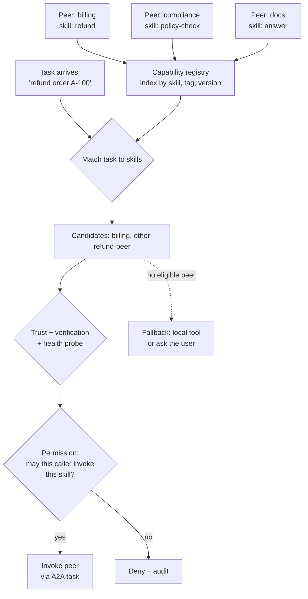

# Agent Capability Discovery and Interoperability

> **Interview answer (say this first).** Capability discovery is how an agent finds out what a peer can do before asking it. Peers publish capabilities — an A2A Agent Card with skills, or an MCP server with tool metadata — and a registry indexes them by skill, tag, and version. Discovery answers "who can do this?"; permission answers "am I allowed to ask?". Keep those separate and enforce both. Match the task to skills, negotiate a protocol version both sides support, rank peers by trust and track record, verify claims with signatures and health probes, and always fall back when a card is stale, a peer is unreachable, or a capability is overclaimed.

> **Note:**
>
> **Verified.** Every runnable pure-Python example on this page was executed on Python 3.14. The A2A discovery and card facts were verified against the official `a2a-sdk` version `1.1.2` on Python 3.12, and the MCP facts against `mcp` version `2.2.0`. Both protocols are evolving; check the versions you ship.


## Why this exists

The first version of a multi-agent system is wired by hand. The coordinator has a list of peers in its prompt or its config file. That works for three agents and fails after thirty:

- **The list goes stale.** A peer is renamed, moved, or retired, and the coordinator keeps calling a dead URL.
- **Nobody knows who can do what.** Adding a compliance check means reading every peer's code, because there is no catalog.
- **Routing is arbitrary.** Two peers both claim "refund", and the coordinator picks whichever appears first.
- **Sensitive work goes to unverified peers.** A new agent registers itself and immediately receives customer data.

Discovery fixes the first three. It does nothing for the fourth unless you also think about trust and permission. That is why capability discovery and interoperability are one topic: publishing what you can do is only useful if the other side can decide whether to trust and call you.

> **Tip:**
>
> **The one-sentence purpose.** Discovery is a search problem — find peers with a capability. Interoperability is a trust and protocol problem — agree on a version, prove your claims, and check permission before you call.


## Start from zero

| Word | Plain meaning |
| --- | --- |
| **Capability** | Something an agent can do, described at a useful level, such as "process refunds". |
| **Skill** | A2A's name for one advertised capability, with an id, description, tags, and examples. |
| **Tool metadata** | MCP's description of a tool: name, description, and parameter schema. |
| **Discovery** | Finding peers and the capabilities they offer. |
| **Registry** | A shared catalog of agents, skills, versions, and endpoints. |
| **Catalog** | The browsable view of the registry. |
| **Agent Card** | The document one agent publishes at a well-known URL to describe itself. |
| **Capability vs permission** | Knowing something is possible is not the same as being allowed to do it. |
| **Negotiation** | Agreeing on a protocol version and interaction style both sides support. |
| **Interoperability** | Two agents built on different frameworks can work together. |
| **Trust** | Evidence that a peer is who it claims to be and will behave as promised. |
| **Reputation** | A score built from a peer's past outcomes. |
| **Verification** | Checking a claim: a signature, a health probe, a scoped test call. |
| **Attestation** | A signed statement about identity or capability from a trusted issuer. |
| **Overclaim** | Advertising a capability the peer cannot actually deliver. |
| **Stale card** | A published card that no longer matches the peer. |
| **TTL** | Time to live: how long a cached card is trusted before a refresh. |
| **Health probe** | A cheap call that checks the peer is alive and answering. |
| **Fallback** | A safe alternative when discovery or invocation fails. |
| **Capability collision** | Two peers advertise the same skill, so the caller must choose. |
| **Broker** | A component that discovers on the caller's behalf and returns a shortlist. |

Two distinctions matter:

- **Discovery is not authorization.** A registry is a phone book, not a bouncer. Finding a peer does not grant the right to call it, and being allowed to call it does not grant broad scopes.
- **A published claim is not a proven fact.** Cards are self-described. Trust grows from verification and outcomes, not from the text on the card.

## The core idea

Think of a job marketplace.

- Workers publish **profiles** with skills and credentials — these are Agent Cards.
- A **directory** indexes the profiles so clients can search — this is the registry.
- A client searches for "can process refunds" and gets a **shortlist** — this is discovery.
- Before hiring, the client checks **credentials and reviews** — this is trust and reputation.
- Even a great worker cannot take a job the client is not **authorized** to offer — this is permission.
- If the chosen worker is busy or unavailable, the client moves to the **next candidate** — this is fallback.



Discovery finds candidates. Verification narrows them. Permission decides whether the call may happen. Fallback handles the case where the answer is no candidate at all.

| Layer | Question | Where it lives | Failure if skipped |
| --- | --- | --- | --- |
| Discovery | Who offers this skill? | Registry, well-known cards | Stale or missing peers |
| Matching | Which candidate fits this task? | Caller or broker | Wrong peer, wasted call |
| Trust | Is this peer credible? | Signatures, history | Data sent to a bad peer |
| Permission | May this caller invoke it? | Gateway and peer policy | Privilege escalation |
| Negotiation | Do we speak the same version? | Interface fields, policy | Silent protocol break |
| Fallback | What if none work? | Caller policy | Hard failure, no answer |

## How it works

1. **Peers publish capabilities.** An A2A peer serves an Agent Card at `/.well-known/agent-card.json` with skills, interfaces, and security. An MCP server exposes `tools/list` with names, descriptions, and schemas. Both are self-descriptions.
2. **A registry indexes them.** The registry records the agent id, endpoint, interface versions, skills, tags, security requirements, verification status, and a last-seen timestamp. It is the search surface.
3. **The caller expresses a need.** A task is turned into a query: required skill, required tags, acceptable versions, and the caller's identity.
4. **The registry returns a candidate shortlist.** Filter by skill and version first, then by freshness and verification. Do not return every peer that mentions the word.
5. **Score the candidates.** Match the task text to skill names, tags, and examples. A small lexical score is a cheap first pass; embeddings help when descriptions are varied.
6. **Verify before you trust.** Check the card signature where present, pin the expected interface and host, and run a cheap health probe. A fresh card means the peer is alive, not that it is honest.
7. **Rank by trust and reputation.** Combine verification, success rate, latency, and recency of evidence. A verified peer with a good record beats an unknown peer with a loud card.
8. **Negotiate the version.** Compare the caller's supported protocol versions and bindings with the peer's card, and pick the highest common one. If there is no intersection, fail fast rather than guessing.
9. **Check permission separately.** The gateway decides whether this caller may invoke this skill, under which scopes. Discovery never implies authorization.
10. **Invoke and record the outcome.** Success, failure, latency, and the version used. Reputation is built from these outcomes, not from the card.
11. **Cache with a TTL and refresh.** A cached card is a snapshot. Set a TTL, refresh on interval or on a list-changed signal, and treat an expired card as unknown.
12. **Always have a fallback.** No candidate, no trust, no permission, or a failed call should lead to a defined alternative: a local tool, a different peer, or a question to the user. Never a silent wrong answer.

## The syntax you will use

**A capability registry with freshness.** Publish peers, query by skill and tag, and check the card's TTL.

```python
from dataclasses import dataclass

@dataclass
class Peer:
    agent_id: str
    url: str
    protocol_versions: list[str]
    skills: list[dict]
    verified: bool = False
    card_fetched_at: float = 0.0
    card_ttl_s: float = 300.0

class Registry:
    def __init__(self):
        self.peers = {}

    def publish(self, peer):
        self.peers[peer.agent_id] = peer

    def by_skill(self, skill_id):
        return [p for p in self.peers.values()
                if any(s["id"] == skill_id for s in p.skills)]

    def by_tag(self, tag):
        return [p for p in self.peers.values()
                if any(tag in s.get("tags", []) for s in p.skills)]

    def is_fresh(self, peer, now):
        return now - peer.card_fetched_at <= peer.card_ttl_s
```

`by_skill` and `by_tag` return candidates; `is_fresh` decides whether their published claims are still worth reading.

**Match a task to skills.** Token overlap is a cheap, explainable first pass.

```python
def tokens(text):
    cleaned = "".join(c if c.isalnum() else " " for c in text.lower())
    return set(cleaned.split())

def skill_score(task, skill):
    task_words = tokens(task)
    skill_words = tokens(skill["name"]) | set(skill.get("tags", []))
    return len(task_words & skill_words)
```

Score every candidate skill and sort. Trust ranking breaks ties later.

**Capability versus permission.** One check answers "can they do it?", the other "may they?".

```python
def can_discover(peer, skill_id):
    return any(s["id"] == skill_id for s in peer.skills)

def can_invoke(grants, caller, skill_id):
    return (caller, skill_id) in grants
```

The first is a lookup in a catalog. The second is a policy decision, and it must run even when the first is true.

**Negotiate a protocol version.** Intersect the two supported lists and take the highest common version.

```python
def negotiate(client_versions, peer_versions):
    common = [v for v in client_versions if v in peer_versions]
    if not common:
        return None
    return max(common, key=lambda v: tuple(int(x) for x in v.split(".")))
```

`None` means the peers cannot talk. Fail fast and tell the caller; do not silently downgrade to an untested path.

**A trust score with recency decay.** Success rate, minus the penalty of age, plus a verification bonus.

```python
def trust_score(successes, failures, age_seconds, verified, half_life_s=3600.0):
    total = successes + failures
    base = successes / total if total else 0.5
    decay = 0.5 ** (max(0.0, age_seconds) / half_life_s)
    bonus = 0.1 if verified else 0.0
    return round(min(1.0, base * decay + bonus), 3)
```

An unknown peer scores `0.5`, so it is usable but not preferred. A once-good verified peer that has been silent for two hours decays past unknown — with a 98% record it lands at `0.345`, below the `0.5` of a peer you have never seen — so recency is evidence too.

**Resolve a peer through A2A discovery.** The resolver fetches the card and an optional verifier checks it.

```python
import httpx
from a2a.client.card_resolver import A2ACardResolver

async with httpx.AsyncClient() as http:
    resolver = A2ACardResolver(http, "https://billing.example.com")
    card = await resolver.get_agent_card(signature_verifier=verify_card)
skills = [(s.id, s.name) for s in card.skills]
```

The card's skills feed the registry; the verifier is where you check a signature or a pinned host.

**MCP tool metadata as a capability source.** A server advertises tools with descriptions and schemas.

```python
result = await session.list_tools()
capabilities = [
    {"name": t.name, "description": t.description}
    for t in result.tools
]
```

For MCP, the tool description is the discoverable capability text. It should say what the tool does, when to use it, and when not to, exactly like an A2A skill.

## Examples: simple to real

**Example 1 — publish and query a registry.**

```text
by skill 'refund': ['billing', 'sketchy']
by tag 'docs': ['docs']
fresh at t=1200: {'billing': True, 'docs': True, 'sketchy': True}
fresh at t=1400: {'billing': False, 'docs': False, 'sketchy': False}
```

Two peers claim `refund`, and by `t=1400` every cached card has expired. Freshness turned a stale claim into an unknown one.

**Example 2 — skill matching alone is not enough.**

```text
task: please process a refund for my last invoice
   1  sketchy  refund
   1  billing  refund
   0  docs     answer
```

The lexical score ties `sketchy` and `billing`, even though one is unverified. Matching is the first filter, not the decision. Trust and verification must break the tie.

**Example 3 — discovery says yes, permission says no.**

```text
coordinator can discover refund: True
coordinator can invoke refund: True
coordinator can invoke delete_account: False
```

The caller can see the peer has a `refund` skill and may invoke it. It cannot invoke `delete_account`, even if the peer exposes it. Capability and permission are separate checks, and both must pass.

**Example 4 — version negotiation picks the highest common version.**

```text
client [1.0,0.3] vs peer [1.0,0.3]: 1.0
client [1.0] vs peer [0.3]: None
client [0.3,1.0] vs peer [1.0]: 1.0
```

The second line is the important one: no common version, so the result is `None`. The caller must handle that as "cannot interoperate", not fall back to an arbitrary version.

**Example 5 — trust decays with age, and verification adds a bonus.**

```text
good      trust=1.0
stale-2h  trust=0.345
unknown   trust=0.5
```

A peer with a 98% success rate scores `1.0` right after a success and `0.345` after two hours of silence. The same peer becomes less preferred without any new failure. Recency is evidence.

**Example 6 — failure modes and fallback in one function.**

```text
chosen: billing | ok
after billing probe fails: sketchy | ok
after both fail: None | no eligible peer
```

The chooser skips unreachable peers and stale cards, then ranks by verification and trust. When nothing is eligible it returns `None` with a reason, which the caller turns into a fallback. This is the shape to test: stale card, down peer, failed probe, and empty candidate set.

**Example 7 — interoperability across frameworks is a contract, not a library.**

```text
A2A card: supportedInterfaces -> protocolBinding in {JSONRPC, HTTP+JSON, GRPC}
MCP:      tools/list -> each Tool has name, description, input_schema
```

An A2A agent written in one framework and a peer written in another interoperate because both speak the protocol, not because they share code. The same is true for MCP servers. The contract is the wire format, and the version is part of it.

## In production

- **Separate discovery from authorization in code, not just in your head.** Different functions, different owners, different audit events. If one function does both, permission will eventually be skipped.
- **Cache cards with a short TTL and a refresh path.** A stale card routes work to a renamed or retired peer. Refresh on interval, on `list_changed`, and on any failure that looks like drift.
- **Verify before you trust.** Check signatures where present, pin the expected host and interface version, and run a cheap health probe. A card that fails verification should be treated as absent, not as suspicious-but-usable.
- **Rank, then choose deterministically.** Ties must break on a defined field such as verification status or trust score, or routing becomes random across replicas.
- **Never let a peer describe its own permissions.** A card states what the peer offers and what credentials it wants. Your gateway decides what your caller may do. The peer re-checks on its side.
- **Pass identity through the chain.** If every call uses one service account, per-user access control disappears and the confused-deputy risk becomes real.
- **Treat overclaiming as a reputation event.** When a peer advertises a skill and fails the work, record it. Enough failures should demote or quarantine the peer automatically.
- **Set a discovery timeout.** A slow registry must not stall every run. Cache, time out, and fall back rather than blocking on discovery.
- **Bound the candidate list.** Ten well-chosen peers beat a hundred matches. A large shortlist invites arbitrary routing and hides the interesting trade-off.
- **Health probes are cheap but not free.** Probe on a schedule or on cache miss, not before every call, or you double the traffic to every peer.
- **Log the selection decision.** Record the task, the candidates, the scores, the verification result, and the chosen peer. When routing goes wrong, the decision log is the only way to see why.
- **Design the no-candidate path first.** "No peer can do this" is a normal outcome. Decide whether it becomes a local tool, a different peer, or a question to the user, and test it.

## Interview questions

### 1. Why do agents need capability discovery?

**Answer.** Because hardcoded peer lists go stale and do not scale. Discovery gives a single place to answer "who can do this, at which version, and how do I reach them?". It lets peers join and leave without editing every caller, and it gives you a control point for allowlists and versioning. It also lets a broker route on the caller's behalf.

**Follow-up: "What does it not solve?"** Trust and permission. Discovery tells you a peer exists and claims a skill. It says nothing about whether the peer is honest or whether you may call it.

**Trap.** Treating the registry as an authorization service. A phone book does not decide who you may call.

### 2. What is the difference between a capability and a permission?

**Answer.** A capability is what an agent can do. A permission is whether this caller may invoke it. The peer's card lists capabilities; your policy and the peer's policy decide permissions. Both checks must pass, and they belong to different components so neither can silently grant the other.

**Follow-up: "Give a concrete failure."** A peer exposes a `delete_account` skill. The coordinator can discover it. Without a permission check it calls it, and a routine refund task escalates into an account deletion.

**Trap.** Using "is the skill present?" as the authorization check. Presence is discoverability, nothing more.

### 3. How do you choose between two peers that offer the same skill?

**Answer.** Score the match first, then rank by trust. Verification status, success rate, latency, and recency of evidence break the tie. Choose deterministically so replicas agree. If the top candidate fails, move to the next, with a bounded number of attempts.

**Follow-up: "What if one peer is much faster but unverified?"** Policy decides. For low-risk reads, speed may win. For writes or sensitive data, require verification regardless of latency.

**Trap.** Sorting by registration order or by whichever response came first. That makes routing non-deterministic and impossible to explain after an incident.

### 4. What is protocol version negotiation between agents?

**Answer.** Each side advertises the protocol versions and bindings it supports. The caller intersects the lists and picks the highest common version. If there is no intersection, the peers cannot interoperate and the call fails fast with a clear reason. Version is part of the interface, not an afterthought.

**Follow-up: "Why not just use the latest?"** Because a peer may not support it, and the latest may change behavior. Pin and negotiate explicitly so a peer upgrade is a deliberate event.

**Trap.** Downgrading silently when negotiation fails. An untested version pair is a latent bug, and the failure will look like data corruption.

### 5. How do you build trust between agents that do not share an operator?

**Answer.** Layer it. Verify the card's signature and host, authenticate with the declared scheme, grant scoped permissions per skill, pass the user's identity through, and enforce policy at both ends. Then track outcomes: success rate, latency, and incidents build a reputation over time. Trust is earned through demonstrated behavior, not declared on a card.

**Follow-up: "What is attestation?"** A signed statement from a trusted issuer about identity or capability. It raises the cost of a fake peer because the attacker must compromise the issuer, not just the card.

**Trap.** Trusting a peer because it is on the internal network. Network location is not identity.

### 6. What does interoperability mean when frameworks differ?

**Answer.** It means both sides implement the same wire contract, so the frameworks do not matter. A2A defines cards, tasks, messages, and artifacts; MCP defines tools, resources, and prompts. An agent in framework A and a peer in framework B interoperate because they exchange the same JSON or protobuf messages and agree on a version. Code sharing is not required.

**Follow-up: "Where does interoperability actually break?"** At the edges: field names across spec drafts, optional features such as streaming or push, auth schemes, and error shapes. Test against the real peer, not only your own mock.

**Trap.** Assuming a shared SDK guarantees compatibility. Two different SDK versions can still disagree on a field or a default.

### 7. What are the failure modes of discovery, and how do you handle them?

**Answer.** Stale cards route to retired peers. Unreachable peers time out. Overclaiming peers accept work they cannot do. Capability collisions force a choice. A slow registry stalls runs. Handle them with TTLs and refresh, timeouts and health probes, outcome-based reputation and quarantine, deterministic ranking, and caching with a fallback.

**Follow-up: "Which is the hardest?"** Overclaiming, because the card looks fine and the failure only appears after work is underway. Require a cheap scoped test call before routing high-value work, or route it to a verified peer only.

**Trap.** Retrying a different peer forever. Bound the attempts and define the no-candidate outcome.

### 8. How do you keep discovery safe when a new agent registers itself?

**Answer.** Registration is not trust. A new peer starts unverified, gets no sensitive scopes, and is limited to a sandbox or read-only skills until it proves itself. Verification can require a signature from an approved issuer, a manual allowlist entry, or a probation period with outcome monitoring. High-risk skills stay on an explicit allowlist.

**Follow-up: "What about the registry itself?"** It is production infrastructure. It needs authentication, change auditing, an owner, and a way to revoke a peer quickly. A poisoned registry redirects every caller.

**Trap.** Auto-approving every registered peer. That turns the registry into an open redirect for sensitive traffic.

## Remember this

- **Discovery finds; permission decides.** Keep them in separate components and check both.
- **Publish capabilities at a known address** — an A2A Agent Card or MCP tool metadata — and index them in a registry.
- **A published claim is unverified.** Signatures, pinned hosts, health probes, and outcomes build trust.
- **Match, then rank, then negotiate a version.** Ties break deterministically; no common version fails fast.
- **Design the no-candidate fallback.** Stale cards, down peers, and overclaims are normal outcomes, not exceptions.
