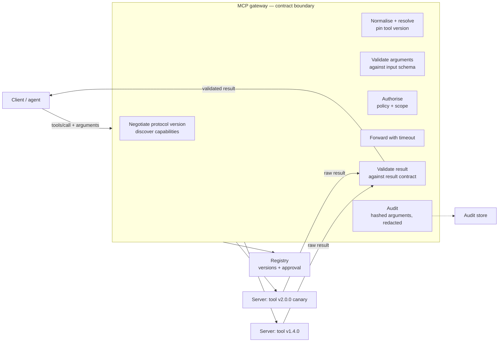

# MCP Conformance, Contract Testing, and Schema Evolution

> **Interview answer (say this first).** A gateway should be a contract enforcement point, not a dumb proxy. That means it negotiates the protocol version, pins each tool version, validates arguments against the declared schema before forwarding, validates the result against the tool's result contract before the model sees it, and returns a clear structured error when a server disappears mid-call. **Conformance tests** prove a server obeys the protocol and its own declared contracts; **contract tests** prove a change is compatible with the callers already in production. Schema evolution is the discipline of changing a tool additively, or, when you must break it, publishing a new version and running a migration window.

## Why this exists

A gateway that forwards bytes without checking is a **dumb proxy**. Protocol pass-through is not the same as contract enforcement, and a contract is only real if something tests it. Three failures show why.

**Failure one: the result shape changed, and nobody noticed.** A billing server exposes `order_status`. Version 1 returns this:

```json
{"status": "shipped"}
```

The server team ships version 1.1 and nests the value:

```json
{"status": {"code": "shipped"}}
```

No version bump, no deprecation, only a release note. The gateway validates nothing on the way back, so it forwards the new shape. The agent code runs `result["status"] == "shipped"`, which is now always false. The agent tells every customer their order is "still processing". The data is not missing and no exception was raised — it is silently wrong, which is the worst kind of bug.

**Failure two: a tool disappeared mid-call, and the gateway hung.** A stdio server crashes while a `tools/call` is in flight. The gateway has no deadline on the read, so the request waits forever. One stuck call is harmless; a hundred fill the connection pool, and then the whole gateway stops serving anyone. A crash should be a fast, structured error, not a hang.

**Failure three: an argument was renamed.** `refund.create` becomes `process_refund`, and the schema renames `order_id` to `orderId`. Discovery returns the new list correctly. But stored prompts and offline evals still name the old tool and the old argument. Those calls return "unknown tool", the agent retries, and the run fails. Because the gateway treated the catalogue as a pass-through, nobody saw the break until evaluation scores dropped.

All three share one root cause: the gateway trusted the other side instead of checking the contract it claimed to enforce. Conformance and contract testing exist to turn that trust into evidence.

> **Note:**
>
> **The one-sentence purpose.** A contract is a promise; conformance and contract tests are how you make the promise enforceable, and schema evolution is how you change the promise without breaking the people relying on it.

## Start from zero

| Word | Plain meaning |
| --- | --- |
| **Conformance test** | A test that checks a server obeys the MCP protocol and its own declared tool contracts. |
| **Contract test** | A test that checks a specific caller's expectations against a tool, so a change cannot silently break it. |
| **Capability declaration** | Which features each side supports. On the current revision it is declared per request in `_meta`; on older revisions it was exchanged in an `initialize` handshake. |
| **Protocol version** | A dated revision of the MCP specification, such as `2026-07-28`; peers must agree on one. |
| **Schema evolution** | Changing a tool's arguments or result over time while keeping existing callers working. |
| **Additive change** | A change that only adds optional surface; every existing valid input still works. |
| **Breaking change** | A change that makes an existing valid caller fail, or makes it behave differently. |
| **Deprecation** | A published warning that a tool or field will be removed, with a replacement and a date. |
| **Rollback** | Reverting traffic to the previous known-good version without rebuilding anything. |
| **Registry approval** | A gate that requires a human or policy sign-off before a tool version becomes reachable. |
| **Discovery** | Asking a server which tools it currently exposes, and what each schema looks like. |
| **Partial discovery** | The normal state where some servers answered and some did not; the catalogue is incomplete but usable. |
| **Reconnect** | Re-establishing a dropped connection, then re-listing tools because the catalogue may have changed. |
| **Argument fixture** | A saved, representative set of arguments used to replay a call in tests. |
| **Result fixture** | A saved, representative tool result used to test the result contract. |
| **Redaction** | Masking sensitive values before they are logged or stored. |
| **Argument hashing** | Storing a stable fingerprint of arguments instead of the raw values. |
| **Tool version pinning** | Locking a client to one exact tool version so a later change cannot alter its behaviour mid-run. |

Two distinctions carry most of the weight:

- **Conformance versus contract.** Conformance is *server versus the specification and its own declaration*. Contract is *caller versus server*. A server can be perfectly conformant and still break your caller, because your caller relied on a behaviour the schema never promised.
- **Discovery versus partial discovery.** Discovery is the request. Partial discovery is the honest result: some tools are known, some servers are unreachable, and "I do not know" is a real answer. Treating a partial catalogue as complete is how a missing tool becomes a silent failure.

## The core idea

Picture passport control at a border. The officer does not wave travellers through because they are standing at the desk. They check that the passport is valid, that the visa covers the purpose of the visit, and that the declared goods match the manifest. If something does not add up, the traveller is refused **with a reason**, and the attempt is recorded.

The gateway is that officer. The passport is the protocol version. The visa is the authorisation decision. The manifest is the JSON Schema for the arguments and the result. The record is the audit log.

The important shift is that the gateway owns **version negotiation and conformance**. Upstream servers own implementation. A server states what it offers; the gateway decides what is allowed to cross the boundary.



Two rules fall out of that picture. First, validation happens **twice**: arguments before forwarding, results after receiving. Checking only one side leaves a hole — a bad argument can corrupt a tool, and a bad result can corrupt the model's reasoning. Second, the gateway never lets a raw upstream error or a raw upstream payload reach the model unchanged. It normalises both into the shape the caller expects.

### What is compatible, and what breaks

A change is **compatible** if every caller that worked before still works and still means the same thing. It is **breaking** if any valid caller fails or gets a different meaning. The table below is the one to memorise for interviews.

| Change | Compatible or breaking? | Why |
| --- | --- | --- |
| Add an optional argument (not in `required`) | Compatible | Old callers omit it; the server uses a default. |
| Add an optional result field | Compatible | Old readers ignore keys they do not know. |
| Add a new tool | Compatible | Nothing that already existed changed. |
| Remove a tool | Breaking | Old callers and stored prompts still name it. |
| Rename an argument | Breaking | The old name becomes an unknown field; strict schemas reject it. |
| Add a required argument | Breaking | Callers that omitted it now fail validation. |
| Change a result type (string → object) | Breaking | Readers that indexed into it, or parsed it, now fail. |
| Tighten an enum (remove a value) | Breaking | Callers still send the removed value. |
| Widen an enum | Compatible | It only adds values nobody sent before. |
| Change the meaning, same shape | Breaking | Nothing fails validation, but the answer is wrong. The worst kind. |
| Turn `additionalProperties` off | Breaking | Callers that already send extra fields now fail. |

The last row is the one interviewers probe: a schema diff cannot see a meaning change. That is why compatibility is proven by replaying real requests and checking the *results*, not only by reading the diff.

## How it works

1. **Declare capabilities and the protocol version on every call.** On the current revision (`2026-07-28`) there is **no handshake**: every request carries its protocol version and client capabilities in `_meta` (and an `MCP-Protocol-Version` header over HTTP), and a version the server does not support returns `UnsupportedProtocolVersionError` so the client retries with a version both support. A dual-era client may call `server/discover` up front — optional for clients, required for servers — and on `stdio` that probe is how it detects a legacy server and falls back to `initialize` plus `notifications/initialized`. The gateway records the protocol version actually used, because it decides which change notifications and error shapes exist. Never call `tools/list` unless the server advertised `capabilities.tools`.
2. **Resolve and pin tool versions.** MCP's `Tool` object has no version field in the official SDK (`mcp` 2.2.0), so the version lives in the tool name, in `_meta`, or in the registry. The gateway resolves a registry entry for each `(server, tool)` once, at run start, and pins it. A registry update cannot change behaviour halfway through a run.
3. **Validate arguments before forwarding.** Validate the model's arguments against the tool's declared `input_schema`. On failure, return a structured error naming the failing path, and do not forward. The model never receives a raw transport error.
4. **Authorise with the pinned version in hand.** Policy can be version-aware: `create_issue@2.1.0` may need approval that `1.4.0` did not. Record which version the policy approved, so an incident review can tell a policy change from a server change.
5. **Forward with a timeout, and reconnect deliberately.** Every upstream call has a deadline. On timeout or transport drop, retry only idempotent calls, bounded, with backoff and jitter. After a reconnect, re-list the catalogue, because the tool set may have changed while the connection was down.
6. **Validate the result before the model sees it.** Check structured content against the declared `output_schema` or a result fixture. A malformed result becomes an error the model can react to, not silently wrong data.
7. **Treat partial discovery as a first-class state.** Some servers answer and some do not. Keep a per-server status (`available`, `stale`, `unavailable`) alongside the catalogue, so a call to a dead server fails fast while calls to healthy servers proceed. Do not block the whole catalogue on the slowest server.
8. **Deprecate and roll back without breaking callers.** A breaking change gets a new name and a deprecation record on the old name: `deprecated`, `sunset`, `replacement`. Rollback is a routing change to the previous pinned version — no rebuild, no redeploy of the server.
9. **Keep an audit-safe record.** Hash arguments with a stable key order, redact sensitive fields before serialisation, and record the tool version, protocol version, policy decision, latency, and outcome. The hash lets you group duplicate calls without storing the secret.

> **Warning:**
>
> **A tool that silently changes behaviour is worse than one that disappears.** A missing tool raises "unknown tool" and the agent stops. A tool that keeps the same name but changes meaning passes every schema check and quietly poisons downstream reasoning. Version the behaviour, not just the JSON.

## The syntax you will use

**A tool contract.** One record holds the argument schema, the result schema, and the version. The schemas are ordinary JSON-Schema-shaped dictionaries, which is exactly what MCP publishes.

```python
from dataclasses import dataclass
from typing import Any

@dataclass(frozen=True)
class ToolContract:
    server: str
    name: str
    version: str
    arguments_schema: dict[str, Any]
    result_schema: dict[str, Any]

    @property
    def qualified_name(self) -> str:
        return f"{self.server}__{self.name}"
```

`qualified_name` matches the gateway's namespacing rule from earlier in the phase: the prefix comes from the registry, not from the server's claim.

**A conformance test harness.** A harness replays fixtures against any server adapter. Running the same suite against two versions is what turns "I think it is compatible" into a result.

```python
from dataclasses import dataclass
from collections.abc import Callable
from typing import Any
import jsonschema

@dataclass(frozen=True)
class Fixture:
    label: str
    arguments: dict[str, Any]
    expect_ok: bool          # False means the arguments should be rejected locally

@dataclass(frozen=True)
class ConformanceReport:
    server_version: str
    passed: int
    failed: list[str]

async def run_suite(
    contract: ToolContract,
    fixtures: list[Fixture],
    call: Callable[[str, dict[str, Any]], Any],   # an async callable
    server_version: str,
) -> ConformanceReport:
    failed: list[str] = []
    passed = 0
    for fixture in fixtures:
        try:
            jsonschema.validate(fixture.arguments, contract.arguments_schema)
            arguments_valid = True
        except jsonschema.ValidationError:
            arguments_valid = False
        if arguments_valid != fixture.expect_ok:
            failed.append(f"{fixture.label}: argument validity mismatch")
            continue
        if not fixture.expect_ok:
            passed += 1
            continue
        try:
            result = await call(contract.name, fixture.arguments)
            jsonschema.validate(result, contract.result_schema)
        except (jsonschema.ValidationError, ServerUnavailable,
                ConnectionError, TimeoutError) as exc:
            failed.append(f"{fixture.label}: {type(exc).__name__}")
            continue
        except Exception as exc:              # a flaky server must not abort the whole run
            failed.append(f"{fixture.label}: {type(exc).__name__}")
            continue
        passed += 1
    return ConformanceReport(server_version, passed, failed)
```

The harness has two jobs. It checks that the fixtures that *should* validate do, and that the ones that should be rejected are rejected. Then it checks that a real call returns a result that satisfies the result schema.

**Run the suite against two server versions.** The old contract replayed against the new server is the backward-compatibility test.

```python
report_old = await run_suite(contract_v1, fixtures, call_server_a, "1.4.0")
report_new = await run_suite(contract_v1, fixtures, call_server_b, "2.0.0")

if report_new.failed:
    raise SystemExit(f"new server breaks old callers: {report_new.failed}")
```

If the new server fails the old contract's fixtures, the change is not backward compatible, whatever the diff says.

**A schema-compatibility function.** Compare the old and new contracts and return a verdict plus human-readable reasons. This checks both argument and result schemas.

```python
def compatibility(old: ToolContract, new: ToolContract) -> tuple[bool, list[str]]:
    """Top-level type, presence, enum, and additionalProperties checks.

    It does not resolve `$ref` or compare nested schemas; those need a richer diff.
    """
    reasons: list[str] = []
    old_props = old.arguments_schema.get("properties", {})
    new_props = new.arguments_schema.get("properties", {})
    new_required = set(new.arguments_schema.get("required", []))
    old_required = set(old.arguments_schema.get("required", []))
    for name in new_required - old_required:
        reasons.append(f"argument '{name}' became required")
    for name, old_prop in old_props.items():
        new_prop = new_props.get(name)
        if new_prop is None:
            reasons.append(f"argument '{name}' was removed")
            continue
        if new_prop.get("type") != old_prop.get("type"):
            reasons.append(f"argument '{name}' changed type")
        old_enum, new_enum = old_prop.get("enum"), new_prop.get("enum")
        if old_enum is not None and set(old_enum) - set(new_enum or []):
            reasons.append(f"argument '{name}' narrowed its enum")
    if old.arguments_schema.get("additionalProperties", True) is not False \
            and new.arguments_schema.get("additionalProperties", True) is False:
        reasons.append("arguments additionalProperties was turned off")
    old_out = old.result_schema.get("properties", {})
    new_out = new.result_schema.get("properties", {})
    for name, old_prop in old_out.items():
        new_prop = new_out.get(name)
        if new_prop is None:
            reasons.append(f"result field '{name}' was removed")
            continue
        if new_prop.get("type") != old_prop.get("type"):
            reasons.append(f"result field '{name}' changed type")
    if old.result_schema.get("additionalProperties", True) is not False \
            and new.result_schema.get("additionalProperties", True) is False:
        reasons.append("result additionalProperties was turned off")
    return (not reasons, reasons)
```

Adding an optional result field adds a key to `new_out` that the loop never visits, so it stays compatible. Removing a result field, changing its type, narrowing an enum, or turning off `additionalProperties` is caught. Note the direction for result enums: widening a *result* enum can still break a consumer that switches exhaustively on the values, so treat result-enum changes as breaking on the reader side even when the schema diff says compatible.

**A call with a timeout and a reconnect.** `asyncio.wait_for` turns a hang into an exception, and the caller reconnects with a bounded retry.

```python
import asyncio
import random

class ServerUnavailable(Exception):
    def __init__(self, server: str, reason: str) -> None:
        super().__init__(f"server '{server}' unavailable: {reason}")
        self.server = server
        self.reason = reason

async def call_with_timeout(session, name, arguments, *, server, timeout=5.0):
    try:
        return await asyncio.wait_for(session.call_tool(name, arguments), timeout)
    except TimeoutError as exc:
        raise ServerUnavailable(server, f"timed out after {timeout}s") from exc

async def call_with_reconnect(make_session, name, arguments, *, server,
                              idempotent: bool, attempts: int = 3, timeout: float = 5.0):
    if not idempotent:
        attempts = 1                        # never blind-retry a write
    last: Exception | None = None
    for attempt in range(attempts):
        session = await make_session()
        try:
            return await call_with_timeout(session, name, arguments,
                                           server=server, timeout=timeout)
        except (ServerUnavailable, ConnectionError) as exc:
            last = exc
            await session.list_tools()      # re-list after reconnecting: the tool set may have changed
            await asyncio.sleep(min(2 ** attempt, 8) * (0.5 + random.random()))  # backoff + jitter
    raise last if last is not None else RuntimeError("unreachable")
```

The `idempotent` flag is not decoration. A retried write with no idempotency key can duplicate the side effect, so the default for a write is a single attempt; only reads and effects that carry an idempotency key are retried. A timeout and a transport drop are handled the same way, because from the caller's point of view both are "the server may or may not have run this".

**An audit record that redacts first, then hashes.** Redaction keeps secrets out of storage; the hash of the *redacted* record lets you group duplicate calls. Hashing is not a substitute for redaction — an unkeyed hash of a secret is still a secret you can try to crack offline, and the non-secret fields stored next to it make the guess cheap.

```python
import hashlib, json

SENSITIVE_MARKERS = (
    "token", "secret", "authorization", "api_key", "apikey", "password",
    "passwd", "credential", "private_key", "card_number", "cookie", "bearer",
)

def _is_sensitive(key: str) -> bool:
    low = key.lower()
    return any(marker in low for marker in SENSITIVE_MARKERS)

def redact(value: object) -> object:
    if isinstance(value, dict):
        return {k: ("***" if _is_sensitive(k) else redact(v))
                for k, v in value.items()}
    if isinstance(value, list):
        return [redact(v) for v in value]
    return value

def hash_arguments(arguments: dict[str, object]) -> str:
    # Hash only what you store. allow_nan=False keeps the encoding deterministic.
    canonical = json.dumps(arguments, sort_keys=True, separators=(",", ":"), allow_nan=False)
    return hashlib.sha256(canonical.encode()).hexdigest()[:16]

def audit_record(*, server: str, tool: str, tool_version: str, protocol_version: str,
                 caller: str, arguments: dict[str, object], decision: str,
                 ok: bool, latency_ms: int) -> dict[str, object]:
    safe = redact(arguments)                 # secrets removed before anything is stored
    return {
        "server": server,
        "tool": tool,
        "tool_version": tool_version,
        "protocol_version": protocol_version,
        "caller": caller,
        "arguments": safe,
        "arguments_hash": hash_arguments(safe),   # hash the redacted record, never the secret
        "decision": decision,
        "ok": ok,
        "latency_ms": latency_ms,
    }
```

`sort_keys=True` matters: without a stable key order, two identical argument sets hash differently, and deduplication stops working. If you must correlate calls whose arguments cannot be stored at all, use a keyed HMAC whose key lives outside the log — not a bare hash. The 16-hex-character (64-bit) truncation is fine for deduplication at modest volume; at very large scale, collisions become possible, so keep more of the digest.

## Examples: simple to real

**Example 1 — a compatible change accepted by both versions.** Version 2 adds an optional result field, `eta`.

```text
compatibility v1.4.0 -> v2.0.0 (add optional result field 'eta'): (True, [])
old server v1.4.0, old contract: passed 3/3, failed []
new server v2.0.0, old contract: passed 3/3, failed []
```

The compatibility check visits every field the old contract promised and finds them all still present and unchanged. The extra `eta` key is invisible to old readers. The new server also replays the old fixtures cleanly, which is the stronger evidence: the promise still holds in practice, not just on paper.

**Example 2 — a breaking change rejected by the gateway.** Version 2.1.0 renames `order_id` to `orderId`.

```text
compatibility v2.0.0 -> v2.1.0 (rename order_id to orderId, both required): (False, ["argument 'orderId' became required", "argument 'order_id' was removed"])
gateway registration: REJECTED — breaking change needs a new major name and a migration window
```

The gateway refuses to register the new contract under the old name. The correct release is `order_status.v2` as a separate tool, with `order_status.v1` marked deprecated and a sunset date. Stored prompts keep working while teams migrate at their own pace.

**Example 3 — a server disappears mid-call.** The upstream stops responding, and the timeout fires.

```text
call order_status timed out after 5.0s
raised ServerUnavailable(server='billing', reason='timed out after 5.0s')
gateway-normalised error: {"error": {"code": "server_unavailable", "message": "billing did not respond within 5s", "retryable": true}}
```

MCP separates **tool execution errors** from **protocol errors**: an execution error is returned as a normal result with `result.isError: true` and `content` the model can act on, while a bad request or a transport failure is a JSON-RPC `error`. A mid-call timeout is the protocol class, so the gateway normalises it into an `error` object (this is the gateway's own shape, not an MCP frame) rather than pretending a tool ran. The `retryable` flag tells the caller whether a bounded retry is safe.

**Example 4 — a malformed tool result rejected before the model sees it.** The server returns a result that breaks its own declared contract.

```text
returned: {"status": {"code": "shipped"}}
expected: {"type": "object", "properties": {"status": {"type": "string"}}, "required": ["status"]}
result validation: REJECTED (status: expected string, got object)
gateway-normalised error: {"error": {"code": "contract_violation", "message": "status: expected string, got object", "retryable": false}}
```

This is the exact failure from the top of the page, now caught at the boundary. The model receives a clear error instead of an object it will misinterpret. `retryable: false` is correct here — retrying will return the same wrong shape until the server is fixed. It is a protocol/contract error, not a tool execution error, so it must not be dressed up as `result.isError: true`.

**Example 5 — an audit record hashes arguments and redacts a token.** The call carries a secret; the record does not.

```python
record = audit_record(
    server="billing", tool="refund.create", tool_version="1.4.0",
    protocol_version="2026-07-28", caller="user:ada",
    arguments={"order_id": "A-100", "token": "sk-live-9f3a"},
    decision="allow", ok=True, latency_ms=84,
)

# {"server": "billing", "tool": "refund.create", "tool_version": "1.4.0",
#  "protocol_version": "2026-07-28", "caller": "user:ada",
#  "arguments": {"order_id": "A-100", "token": "***"},
#  "arguments_hash": "7a9fce554a6b7564", "decision": "allow",
#  "ok": true, "latency_ms": 84}
assert "sk-live-9f3a" not in json.dumps(record)
```

The token reaches the tool, but never the log, and the hash is computed over the **redacted** record, so the secret is not recoverable from it. The assertion is the test to keep — redaction that is not tested is redaction that will fail silently.

## In production

- **Make the gateway a contract boundary, not a proxy.** A pass-through forwards whatever arrives. A boundary validates both directions, normalises errors, and refuses incompatible registrations. The difference is the entire value of putting a gateway in the path.
- **Validate before forwarding and after receiving.** Arguments are untrusted because a model generated them; results are untrusted because a server produced them. Checking one side only closes half the hole.
- **Pin tool versions and declare the protocol version.** Record both on every call. MCP's `Tool` has no version field, so put the version in the name, in `_meta`, or in the registry, and pin what production uses. On the current revision the protocol version travels on every request, so a mismatch fails fast instead of silently changing behaviour.
- **Treat partial discovery as normal, not exceptional.** Some servers will be down at any moment. Keep a per-server status in the catalogue, serve what is available, and fail fast on what is not. One slow server must not stall the catalogue.
- **Give every upstream a timeout and a reconnect path.** No deadline means one unresponsive server can consume the gateway's connection pool. Reconnect deliberately, and re-list tools afterwards because the catalogue may have changed.
- **Breaking changes need a new version and a migration window.** New name, deprecation record on the old name, a sunset date, and traffic measured to zero before removal. A breaking change inside the same name is a silent outage waiting to happen.
- **Keep conformance tests in CI, not in a wiki.** Replay recorded fixtures and result fixtures against every candidate contract. A reviewer cannot eyeball a schema diff reliably; the harness can.
- **Audit arguments by hash and redact secrets.** Hash with a stable key order so duplicate calls group correctly, and redact at the serialisation boundary so no call site can forget.
- **Remember that a silent behaviour change is worse than a disappearance.** A missing tool raises an error; a changed meaning passes validation and corrupts reasoning. Version behaviour, and test results, not just shapes.
- **Record which server version served each call.** "Which version answered?" must be answerable during an incident. Without it, you cannot separate a client bug from a server regression.
- **Fail closed on an unknown contract or protocol.** An unregistered tool, an unapproved version, or an unsupported protocol version is a deny, never a best-effort forward.
- **Roll back by routing, not rebuilding.** Keep the previous version warm and addressable. Rollback is a registry and routing change, so it takes seconds and affects only the callers that adopted the new version.

## Interview questions

### 1. What is the difference between a conformance test and a contract test?

**Answer.** A conformance test checks a server against the protocol and its own declarations: does it negotiate a version, advertise capabilities honestly, validate its inputs, and return results matching its `output_schema`? A contract test checks a specific caller's expectations against the server, so a change cannot silently break that caller. Conformance is server-versus-spec; contract is caller-versus-server. You need both, because a fully conformant server can still break a caller that relied on an undocumented behaviour.

**Follow-up: "Which one catches a renamed argument?"** A contract test, because the caller's fixtures still send the old name. A conformance test may pass if the server is internally consistent with its new schema.

**Trap.** Assuming a green conformance suite means existing callers are safe. Conformance covers the server's promise, not the caller's assumptions.

### 2. How does a gateway enforce a contract instead of just proxying?

**Answer.** It resolves and pins the tool version, validates arguments against the input schema before forwarding, authorises with that version in hand, forwards with a timeout, validates the result against the result contract, normalises errors, and records an audit event. It also refuses to register an incompatible contract under an existing name. A proxy does none of the validation and cannot refuse anything.

**Follow-up: "What does validation cost?"** One schema check per call in each direction, which is microseconds compared with a network hop. The real cost is building and maintaining the fixture corpus.

**Trap.** Describing the gateway as validating "the request" only. The result direction is where silent wrong data enters the agent.

### 3. What counts as a breaking change to a tool?

**Answer.** Any change that makes an existing valid caller fail or behave differently: removing or renaming an argument, adding a required argument, changing a type, tightening an enum, removing a result field, changing a result type, turning `additionalProperties` off, or changing the meaning while keeping the same shape. The last is the dangerous one because no schema diff reveals it.

**Follow-up: "Are result changes held to the same standard as argument changes?"** Yes, and teams often forget it. If downstream code reads a result field, removing it or changing its type is breaking even though the call still succeeds.

**Trap.** Treating the schema diff as the whole story. Behaviour that leaves the schema untouched is still a breaking change.

### 4. How do you handle a server that disappears mid-call?

**Answer.** Put a deadline on every call with `asyncio.wait_for` or an equivalent, so a hang becomes a `TimeoutError`. Map that to a structured error such as `server_unavailable` with a `retryable` flag. Retry only idempotent calls, bounded, with backoff and jitter. Mark the server unavailable in the catalogue, and reconnect and re-list before sending new work.

**Follow-up: "What should the model see?"** A short, honest error it can describe, not a stack trace and not an empty success. The model can then choose to retry or tell the user.

**Trap.** Retrying every call automatically. Retrying a non-idempotent write duplicates the effect, which is worse than the original timeout.

### 5. What is partial discovery, and how should the registry represent it?

**Answer.** Partial discovery is when the gateway can reach some servers but not others, so the aggregated catalogue is incomplete. The registry should carry a per-server status (`available`, `stale`, `unavailable`) and a timestamp, so callers can tell "this tool does not exist" from "this tool is not known right now". Calls to healthy servers proceed while calls to an unavailable server fail fast.

**Follow-up: "Why not just fail the whole discovery?"** Because that turns one sick server into a platform outage. Availability of the catalogue should degrade, not collapse.

**Trap.** Treating a missing tool in a partial catalogue as a deleted tool, and removing it from stored state. Absence of evidence is not evidence of deletion.

### 6. How do you evolve a tool's schema without breaking callers?

**Answer.** Add optional surface and keep the same major version: new optional arguments with defaults, new optional result fields, wider enums. For a genuine break, publish a new name, mark the old one deprecated with a `sunset` date and a `replacement`, run both through a migration window, and remove the old one only when its traffic reaches zero. Test compatibility by replaying recorded fixtures against the new schema before it ships.

**Follow-up: "How do you know it is safe to remove the old version?"** Instrument the old tool's call count and require it to be zero for the whole window. Migration is a metric, not an email.

**Trap.** Publishing a breaking change under the same name and calling it a patch. Stored prompts and offline evals never read the release notes.

### 7. What do you put in an audit record for a contract-checked call?

**Answer.** The server, tool, tool version, protocol version, authenticated caller, redacted arguments, an argument hash, the policy decision, whether the result passed validation, the latency, and the outcome. The hash lets you group duplicate calls without storing secrets, and the version fields let an incident review separate a client change from a server change.

**Follow-up: "Why hash instead of storing the arguments?"** Arguments can contain PII or credentials, and they can be large. A hash supports deduplication and drift detection with no sensitive data at rest.

**Trap.** Hashing with a non-canonical serialisation. Without stable key order, the same arguments produce different hashes and the grouping silently stops working.

### 8. How do you test that a schema change is compatible before it ships?

**Answer.** Build a corpus of real recorded calls as argument fixtures and result fixtures, with sensitive values redacted. Replay them against the candidate contract: every previously valid argument set must still validate, and a real call must still return a result matching the result schema. Run the same suite against the current version and the candidate version, and make a breaking change fail the build unless it carries a version bump and a deprecation record.

**Follow-up: "What makes a corpus good?"** Real traffic, including the edge cases: omitted optional fields, unusual enum values, and the largest payloads you have seen. Hand-written happy paths miss exactly the callers that break.

**Trap.** Testing only that new inputs work. The question is whether **old** inputs and old readers still work.

## Remember this

- **A gateway is a contract boundary, not a proxy.** Validate arguments before forwarding and results after receiving; refuse incompatible registrations.
- **Conformance is server-versus-spec; contract is caller-versus-server.** A conformant server can still break your caller, so test both.
- **Compatible means additive:** new optional arguments and result fields, wider enums, new tools. Removing, renaming, retyping, or requiring is breaking.
- **Silent behaviour change is the worst failure.** It passes every schema check and quietly corrupts reasoning, so version behaviour and test results, not just shapes.
- **Timeouts, partial discovery, and audit-safe records are core features.** Pin versions, fail closed, hash arguments, redact secrets, and record which version served each call.
