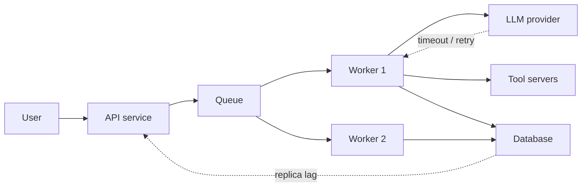

# Distributed Systems Fundamentals

> **Interview answer (say this first).** A distributed system is a set of independent computers that appear to users as one system, communicating only by messages over a network. The defining property is **partial failure**: some parts keep working while others fail, stall, or become unreachable, and you often cannot tell which. That single fact is why we need explicit ideas like availability, reliability, fault tolerance, redundancy, and consistency. A distributed system is not a bigger single machine; it is a system whose failure modes are fundamentally different.

## Why this exists

A single machine has a simple failure model. It works, or it is down. You can usually tell which.

The moment you split work across two machines, that clean model disappears.

```text
One machine:   up | down
Two machines:  up | down | A up & B down | A down & B up
N machines:    2^N combinations, most of them "half working"
```

Consider an agent platform. An API process accepts a request. It writes to a queue. A worker picks up the job, calls a model, calls two tools, and writes the result to a database. Each arrow crosses a network.

Now something goes wrong:

- The model call succeeds, but the database write times out. Did the write happen?
- The worker sends a result, then crashes before acknowledging the queue message. Will the job run twice?
- The network partitions. Two halves of the cluster both believe they are the leader.
- One node is not down, just slow. Every request routed to it hangs for 30 seconds.

None of these are possible on one machine. All of them are routine across many. This is **partial failure**, and it is the reason distributed systems is its own discipline.

The field exists to answer two questions for every component and every message:

> **The two questions of this phase.** *What happens when this component fails halfway?* and *what happens when this message is delivered twice?*

Everything else — consistency, queues, replication, retries, circuit breakers — is machinery built to make those two questions have boring answers.

## Start from zero

Learn these words first. They are used loosely in conversation and precisely in interviews.

| Word | Plain meaning |
| --- | --- |
| **Node** | One independent computer or process in the system. It has its own memory and can fail alone. |
| **Partial failure** | Some nodes work while others fail or stall. The system is neither fully up nor fully down. |
| **Network partition** | A network break that splits nodes into groups that cannot talk to each other, though each group is alive. |
| **Latency** | How long a message or request takes, usually measured in milliseconds. Not a failure, but it feels like one when it grows. |
| **Scalability** | The ability to handle more work by adding resources, without a proportional drop in efficiency. |
| **Availability** | The fraction of time the system answers requests successfully. Measured over a window. |
| **Reliability** | The probability that the system keeps working correctly for a period, without failure. |
| **Fault tolerance** | The ability to keep working correctly *while* some components fail. |
| **Fault** | A broken or misbehaving component. One fault may or may not cause a failure. |
| **Failure** | The system no longer providing its service as specified. |
| **Redundancy** | Deliberately duplicating a component so a copy can take over. |
| **Single point of failure (SPOF)** | One component whose failure takes down the whole system. |
| **MTBF** | Mean Time Between Failures. Average working time between breakdowns. |
| **MTTR** | Mean Time To Repair. Average time to restore service after a breakdown. |
| **SLO** | Service Level Objective: an internal availability target, such as 99.9% over 30 days. |
| **SLA** | Service Level Agreement: a contract with a customer, usually with penalties. |
| **The nines** | Shorthand for availability: 99% is "two nines", 99.9% is "three nines". |
| **Blast radius** | How much of the system is affected when one thing fails. |
| **Cascading failure** | One slow or failing component overloads its neighbours, which then fail too. |
| **Backpressure** | Telling upstream producers to slow down because downstream cannot keep up. |

Four pairs are easy to mix up. Pin them down now.

- **Availability vs reliability.** Availability is *time served*: were we answering? Reliability is *correctness over time*: did we answer without failing? A system can be available but unreliable (it answers with errors quickly) or reliable but unavailable (it never fails, but it is down for maintenance).
- **Fault vs failure.** A fault is a broken part. A failure is the service being down. Fault tolerance means containing the first so it does not become the second.
- **Scalability vs performance.** Performance is "how fast is it now?" Scalability is "does it stay fast as load grows?" A system can be fast at low load and scale terribly.
- **Latency vs availability.** Slow is not down, but at scale, slow is often worse: retries pile up and turn latency into a full outage.

## The core idea

Think of a relay race, then break the baton.

On a single machine, the baton passes inside one stadium. If a runner trips, the race stops and everyone knows.

In a distributed system, each hand-off is a network message. The baton can be dropped, duplicated, or delivered late. A runner can fall and nobody notices for a while. Worse, a runner who merely *looks* slow might be fine — or might be dead.

The mental model is a **chain of independent agents**:



Every box can fail alone. Every arrow can lose, duplicate, delay, or reorder a message. There is no global clock and no shared memory. The only way nodes agree is by exchanging messages, and messages take time.

Two consequences follow, and they hold for the rest of this phase:

1. **You must design for partial failure.** Assume any single component can be slow, dead, or lying. Decide what happens next.
2. **You must measure the outcome.** Availability is not a feeling; it is a number with a window. That number is what the nines describe.

> **The one-sentence mental model.** A distributed system is a set of independent parts that only agree by sending messages, so "half broken" is the normal state you design around, not an exception you debug.

### The fallacies of distributed computing

These are the false assumptions engineers make when moving from one machine to many. They were named at Sun Microsystems decades ago and are still the fastest way to explain why a design will fail.

| Fallacy | Reality |
| --- | --- |
| The network is reliable | Links drop packets, reset connections, and partition. |
| Latency is zero | A cross-region round trip can be 100 ms or more. |
| Bandwidth is infinite | Large payloads saturate links and cost money. |
| The network is secure | Traffic can be intercepted; trust must be explicit. |
| Topology does not change | Nodes and routes change constantly, especially in the cloud. |
| There is one administrator | Multiple teams and clouds each control part of the system. |
| Transport cost is zero | Serialisation and network hops cost CPU and time. |
| The network is homogeneous | Mixed versions, hardware, and protocols are the norm. |

An interview-ready line: *"I do not assume any of the eight fallacies. Partial failure and unbounded latency are the default."*

### Availability, reliability, and fault tolerance are not the same

Interviewers love this distinction because it is easy to blur.

| Property | Question it answers | Measured as | Improved by |
| --- | --- | --- | --- |
| **Availability** | Was the service answering when asked? | % uptime over a window (the nines) | Redundancy, fast recovery, graceful degradation |
| **Reliability** | Did it keep working correctly over time? | Failure rate, MTBF, error rate | Testing, simpler components, eliminating SPOFs |
| **Fault tolerance** | Does it keep serving *while* parts fail? | Behaviour under injected faults | Replication, failover, isolation, quorums |

A useful example: a cache with no replica is *available* until the single node dies, but it is not fault tolerant. A system that returns errors instantly during a dependency outage may look available to a naive uptime check (it responded), but under the successful-response definition it is not available, and it is clearly not reliable. Fault tolerance is the *mechanism*; availability and reliability are *outcomes*.

## How it works

Follow one request and note where each idea appears.

1. **A request arrives at a stateless entry point.** An API process accepts it. Because it holds no per-user memory, any instance can serve it. This is the first scalability decision.
2. **The entry point calls downstream services.** Each call has a timeout and a retry policy. Without a timeout, a slow dependency consumes a thread forever.
3. **Work that can wait goes to a queue.** The API returns quickly, and a worker processes the job later. This absorbs bursts and decouples the fast path from the slow path.
4. **Workers run in parallel and are redundant.** If one worker dies, others keep pulling messages. A message that was mid-flight is redelivered after a visibility timeout.
5. **State is replicated.** Databases and caches copy data across nodes. Replication improves availability and, depending on the mode, consistency.
6. **A health check watches each component.** Unhealthy nodes are removed from the pool. Draining lets in-flight work finish.
7. **Failures are detected, isolated, and retried.** Retries use backoff and jitter; circuit breakers stop hammering a dead dependency; bulkheads stop one bad tenant from consuming all capacity.
8. **A request either succeeds, fails fast, or degrades.** Perhaps the answer is returned from a cache, or without the optional tool call. Graceful degradation keeps the core service available.
9. **Metrics feed an error budget.** Availability is measured against the SLO. When the budget is exhausted, feature work pauses and reliability work takes priority.

Notice that availability is produced by **redundancy plus fast recovery**, not by making components perfect. MTTR matters as much as MTBF:

```text
availability = MTBF / (MTBF + MTTR)
```

If a component fails once a year but takes a week to repair, availability is poor. If it fails weekly but recovers in seconds, availability can be excellent. This is why automated failover and good runbooks beat "buy more reliable hardware."

> **The recovery insight.** You rarely control how often things fail. You very much control how fast they recover — so aim engineering effort at MTTR.

## The syntax you will use

These are real production forms. Read them once; later chapters explain each.

**Express an availability target as an SLO.** A 30-day window with a 99.9% target.

```yaml
# slo.yaml - a standard SLO object
service: agent-api
window: 30d
objective: 0.999          # three nines
sli: |
  sum(rate(http_requests_total{code=~"2..|3.."}[5m]))
  /
  sum(rate(http_requests_total[5m]))
```

The target turns "be reliable" into a number with an error budget you can spend.

**Compute the error budget in a query.** Errors allowed before the SLO is missed.

```promql
# error budget = (1 - objective) * total requests
(1 - 0.999) * sum(increase(http_requests_total[30d]))
```

This is how you decide whether to ship features or fix reliability this sprint.

**Run redundant replicas.** Kubernetes expresses redundancy as a replica count plus a disruption budget.

```yaml
spec:
  replicas: 3
  template:
    spec:
      containers:
        - name: api
          readinessProbe:            # only receive traffic when ready
            httpGet: {path: /healthz, port: 8080}
```

A readiness probe is what lets the load balancer stop sending traffic to a starting or broken instance.

**Spread replicas across failure domains.** Anti-affinity keeps all copies of one service off the same node or zone.

```yaml
affinity:
  podAntiAffinity:
    requiredDuringSchedulingIgnoredDuringExecution:
      - labelSelector:
          matchLabels: {app: api}
        topologyKey: topology.kubernetes.io/zone
```

Without this, three "redundant" replicas can all sit in one zone and fail together.

**Declare compute and stop noisy neighbours.** Requests and limits prevent one noisy neighbour from starving others.

```yaml
resources:
  requests: {cpu: "500m", memory: "512Mi"}
  limits:   {cpu: "1",    memory: "1Gi"}
```

Requests drive scheduling; limits cap the blast radius of a leak or a runaway loop.

**Set timeouts and retries explicitly.** In a service config or client.

```python
import httpx

# a default budget for everything, with a tighter connect timeout
client = httpx.Client(timeout=httpx.Timeout(3.0, connect=0.5))
# every remote call gets a budget; no call can hang forever
```

**Measure availability in application code.** A tiny script that turns nines and MTTR into concrete numbers.

```python
MINUTES_PER_YEAR = 365 * 24 * 60

def allowed_downtime_minutes(nines: int) -> float:
    """Minutes of downtime per year still allowed at N nines."""
    return MINUTES_PER_YEAR * (10 ** -nines)

print(allowed_downtime_minutes(3))   # 525.6 minutes = 8.76 hours
```

This is the arithmetic behind "we committed to three nines."

## Examples: simple to real

**Example 1 — the nines, made concrete.** Availability percentages sound abstract until you convert them to time. The output below comes from `allowed_downtime_minutes`.

```python
MINUTES_PER_YEAR = 365 * 24 * 60

def allowed_downtime_minutes(nines: int) -> float:
    return MINUTES_PER_YEAR * (10 ** -nines)

for n in range(2, 7):
    print(n, "nines ->", round(allowed_downtime_minutes(n), 2), "min/year")
# 2 nines -> 5256.0
# 3 nines -> 525.6
# 4 nines -> 52.56
# 5 nines -> 5.26
# 6 nines -> 0.53
```

Three nines allows about 8.8 hours of downtime a year. Five nines allows about 5 minutes. Each extra nine roughly multiplies cost by ten, which is why teams pick a target deliberately rather than "as high as possible."

**Example 2 — MTTR is as important as MTBF.** Two systems with the same failure rate can have very different availability.

```python
def availability(mtbf_hours: float, mttr_hours: float) -> float:
    return mtbf_hours / (mtbf_hours + mttr_hours)

print(round(availability(1000, 1), 6))    # 0.999001  -> ~99.9%
print(round(availability(1000, 10), 6))   # 0.990099  -> ~99.0%
print(round(availability(100, 1), 6))     # 0.990099  -> ~99.0%
```

A component that fails ten times more often but recovers ten times faster has the same availability. Automated failover is how you buy MTTR.

**Example 3 — redundancy compounds; chains erode.** Independent replicas multiply the *failure* probability, so parallel availability rises fast. Components in a serial dependency chain multiply *availability*, so it falls.

```python
def parallel_availability(a: float, n: int) -> float:
    """n independent replicas; at least one must work."""
    return 1 - (1 - a) ** n

def series_availability(*parts: float) -> float:
    """Every part must work."""
    result = 1.0
    for a in parts:
        result *= a
    return result

print(round(parallel_availability(0.99, 2), 6))   # 0.9999
print(round(parallel_availability(0.99, 3), 6))   # 0.999999
print(round(series_availability(*([0.999] * 10)), 6))  # 0.990045
```

Two independent 99% nodes give 99.99%. But ten 99.9% components in a chain give only ~99.0%. **This is the hidden cost of microservices:** every synchronous hop you add multiplies away availability. Redundancy must be per-hop, or the chain dominates.

**Example 4 — an agent fan-out that must succeed entirely.** A single agent run touches five services. If all must succeed, reliability is the product of the parts.

```python
def chain_reliability(hops: list[float]) -> float:
    result = 1.0
    for a in hops:
        result *= a
    return result

def with_retries(hops: int, per_hop_failure: float, attempts: int) -> float:
    per_hop = 1 - per_hop_failure ** attempts
    return per_hop ** hops

print(round(chain_reliability([0.99] * 5), 6))     # 0.95099
print(round(with_retries(5, 0.01, 2), 6))          # 0.9995
print(round(with_retries(5, 0.01, 3), 6))          # 0.999995
```

Five 99% hops give ~95%. One retry per hop lifts that to ~99.95%. **Retries are an availability technique, not just an error-handling detail** — as long as the operation is safe to retry.

**Example 5 — finding the single point of failure.** Walk the dependency graph and remove each node. If the client can no longer reach the database, that node is a SPOF.

```python
from collections import deque

def reachable(graph: dict[str, list[str]], start: str) -> set[str]:
    seen, q = set(), deque([start])
    while q:
        node = q.popleft()
        if node in seen:
            continue
        seen.add(node)
        q.extend(graph.get(node, []))
    return seen

graph = {
    "client": ["gateway"],
    "gateway": ["worker"],
    "worker": ["db"],
    "db": [],
}

def drop_node(g, node):
    return {k: [v for v in vs if v != node] for k, vs in g.items() if k != node}

print(sorted(reachable(graph, "client")))
# ['client', 'db', 'gateway', 'worker']
print(sorted(reachable(drop_node(graph, "worker"), "client")))
# ['client', 'gateway']  <- worker was a SPOF
```

A reachability check is the cheapest architecture review you can automate. Run it before you run production.

**Example 6 — the same idea at the messaging layer.** A queue with exactly one consumer is a SPOF even if the queue itself is replicated. Two consumers make it fault tolerant, and competing consumers also give you scale.

```text
One consumer:  producer -> [queue] -> consumer        (consumer dies => work stops)
Two consumers: producer -> [queue] -> consumer A
                                   -> consumer B      (one dies => other continues)
```

The queue is the redundancy boundary: state lives in the queue, so consumers can be replaced freely. That is why the same store that scales a service (externalised state) also makes it fault tolerant.

## In production

- **Availability is a budget, not a virtue.** Pick a target, measure it, and spend the error budget consciously. "As high as possible" is not an engineering decision.
- **Every synchronous hop multiplies unavailability.** Prefer fewer hops on the critical path, or make optional hops asynchronous and degradable.
- **Slow is often worse than down.** A hanging dependency holds threads, fills connection pools, and causes retries that amplify load. Always set timeouts.
- **Retries need limits, backoff, and jitter.** Unbounded retries turn a small failure into a self-inflicted denial of service.
- **Redundancy must cross failure domains.** Replicas in one zone, one rack, or one account fail together. Check anti-affinity and multi-AZ placement.
- **Beware correlated failure.** Shared databases, shared DNS, shared credentials, and shared config servers are common hidden SPOFs.
- **Fault tolerance is proved by testing, not by design diagrams.** Inject faults, kill nodes, and add latency in a controlled environment.
- **MTTR beats MTBF in the budget.** Automatic failover, health checks, and rehearsed runbooks move availability more than buying "better" hardware.
- **Graceful degradation preserves the core.** If recommendations are down, still answer the question. Define what can be dropped before you need to.
- **Cascading failures start with queues and threads.** Cap queue depth, cap concurrency, and add backpressure so overload becomes fast rejection, not a spiral.
- **Partial failure is the default, not the exception.** Design every call as if it can time out or run twice. Idempotency and timeouts are the cheapest insurance.
- **Write down the failure domains.** A short document listing what shares fate with what is worth more than another dashboard.

## Interview questions

### 1. What is a distributed system, and what makes it different from a single machine?

**Answer.** It is a set of independent computers that communicate by messages and appear as one system. The difference is **partial failure**: on one machine, things work or they do not; across many, some components work while others fail, stall, or become unreachable. There is no shared clock and no shared memory, so coordination happens only through messages.

**Follow-up: "Why can't I just use a bigger single machine?"** Cost and ceiling. Vertical scaling gets expensive and eventually hits a hardware limit, and a single machine is still one failure domain. Distribution also lets you place work near users and scale pieces independently.

**Trap.** Saying "a distributed system is multiple computers working together" and stopping there. The interviewer wants the failure model, not the definition.

### 2. Define availability, reliability, and fault tolerance, and explain how they differ.

**Answer.** Availability is the fraction of time the service answers successfully, measured over a window — the nines. Reliability is the probability it keeps working correctly over time, measured by failure rate or MTBF. Fault tolerance is the ability to keep serving *while* components fail. Fault tolerance is a mechanism; availability and reliability are outcomes.

**Follow-up: "Can a system be available but unreliable?"** Yes. A service that instantly returns HTTP 500 is technically responding, so a naive uptime check says it is available, but it is unreliable. This is why availability is measured on successful responses, not just open sockets.

**Trap.** Using "available" and "reliable" interchangeably. They answer different questions and need different measurements.

### 3. What is a single point of failure, and how do you find one?

**Answer.** A component whose failure takes down the whole service, or a critical path. You find them by mapping the request path and removing each component to see if the system still works — a reachability walk, a chaos experiment, or a design review with "what if this dies?" applied to every box.

**Follow-up: "How do shared dependencies hide SPOFs?"** Many services depend on the same DNS, config store, database, or identity provider. Each looks redundant alone, but they share fate. The fix is to list shared dependencies and make the critical ones themselves redundant.

**Trap.** Looking only at servers. SPOFs are often operational: one deploy pipeline, one dashboard, one person with credentials, one region.

### 4. What do MTTR and MTBF mean, and which should you optimise?

**Answer.** MTBF is mean time between failures — how long it works on average. MTTR is mean time to repair — how long recovery takes on average. Availability equals `MTBF / (MTBF + MTTR)`. You usually have limited control over failure frequency, so MTTR is the practical lever: automated failover, fast rollback, and good runbooks.

**Follow-up: "Give an example where improving MTTR beats improving MTBF."** A service that fails once a year but takes a day to restore is less available than one that fails monthly but recovers in seconds. Adding auto-failover raised availability more than making hardware marginally more reliable would.

**Trap.** Treating "five nines" as a component property. It is a system property produced by redundancy and fast recovery, not by a magic server.

### 5. Why is partial failure hard to reason about?

**Answer.** Because you cannot distinguish a slow node from a dead one, and you cannot get a consistent global view. A node that has not replied may be down, busy, or the network may have dropped the reply. Different observers see different truths at the same time, so decisions must be made without complete information.

**Follow-up: "What practical design rules follow?"** Use timeouts on every call, make operations idempotent so retries are safe, design for the possibility that a write succeeded but the acknowledgement was lost, and avoid distributed transactions when a saga or an outbox will do.

**Trap.** Assuming a timeout means the operation did not happen. The remote side may have completed it; the response was lost. That is exactly why idempotency matters.

### 6. Name the fallacies of distributed computing and why they matter.

**Answer.** The network is reliable; latency is zero; bandwidth is infinite; the network is secure; topology does not change; there is one administrator; transport cost is zero; the network is homogeneous. They matter because every one of them is false in production, and a design that assumes any of them breaks under load or failure.

**Follow-up: "Which ones cause the most incidents?"** The network is reliable, latency is zero, and topology does not change. Together they explain timeouts, retry storms, and the surprise when a node disappears from a pool.

**Trap.** Reciting the list without a design implication. Pair each fallacy with a mitigation: timeouts, retries with backoff, health checks, encryption, and service discovery.

### 7. How does redundancy improve availability, and when does it not help?

**Answer.** With independent replicas, the failure probability multiplies: `1 - (1 - a)^n`. Two 99% replicas give 99.99%. But redundancy only helps when failures are independent. Shared power, network, zone, deployment, or dependency makes replicas fail together, and then extra copies add cost without adding availability.

**Follow-up: "How do you keep redundancy effective?"** Spread replicas across failure domains, avoid shared fate, test failover regularly, and watch for common-mode failures such as a bad config pushed to every replica.

**Trap.** Counting replicas without checking whether they share a dependency. Three app servers behind one database still fail when the database fails.

### 8. What is the difference between latency and availability, and why does the distinction matter?

**Answer.** Latency is how long a request takes; availability is whether it succeeds within the window the caller will wait. A system can be "up" but so slow that users give up and clients time out, which looks like an outage and can cause one through retries. At scale, latency problems become availability problems.

**Follow-up: "How do you protect against slow dependencies?"** Set aggressive timeouts, use circuit breakers to stop calling a failing dependency, add bulkheads to isolate thread pools, and shed load with bounded queues and backpressure.

**Trap.** Monitoring only uptime. A p99 latency chart catches the outage that "everything is green" misses.

## Remember this

- **Partial failure is the defining property.** Some parts work, some do not, and you cannot always tell which.
- **Availability, reliability, and fault tolerance are different.** Availability is time served; reliability is correct operation over time; fault tolerance is surviving faults.
- **Availability = MTBF / (MTBF + MTTR).** Improving recovery is usually easier than improving failure rates.
- **Redundancy compounds only when failures are independent.** Watch for shared fate and single points of failure.
- **Every synchronous hop multiplies unavailability.** Timeouts, retries with backoff, and graceful degradation are the daily tools.
