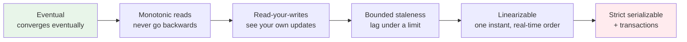

# Consistency and the CAP Theorem

> **Interview answer (say this first).** Consistency means every reader sees the writes they are entitled to see. **Strong consistency** guarantees that once a write is acknowledged, every later read sees it, as if there were one copy. **Eventual consistency** only promises that replicas converge if updates stop. **CAP** says that when a network partition happens, a system must choose between consistency and availability — partition tolerance is not optional, because networks do partition. **PACELC** adds that even with no partition you still trade latency against consistency. Different data needs different guarantees, so the real skill is picking per operation, not per company.

## Why this exists

With one database on one machine, consistency is free. A write commits, and the next read sees it. There is one copy, so there is no argument about which copy is right.

Replication breaks that for a good reason: copies on several nodes survive node failure and serve reads closer to users. But copies must be updated, and updating takes time. During that window, replicas disagree.

```text
t0: client writes balance = 100 to replica A
t1: replica A acknowledges the write
t2: (replication in flight)
t3: client reads replica B and sees balance = 50
```

Is that a bug? It depends entirely on what you promised. If the client just wrote the value and immediately reads it back, seeing 50 is a real failure called a **stale read**. If an analytics job reads a minute later, 50 may be perfectly fine.

The core tension is this:

> **The consistency sentence.** Replication is how you survive failure and scale reads; consistency is the promise about how fresh and how ordered those replicas are — and you pay for it in latency or availability.

Two related pressures make this unavoidable:

1. **Partitions happen.** Networks drop, switches fail, regions lose connectivity. You cannot opt out. A system that refuses to answer during a partition is choosing consistency; one that answers with possibly stale data is choosing availability.
2. **Coordination costs latency.** Getting nodes to agree requires at least one round trip, often more. That is the "else" in PACELC: even with no partition, strong consistency is slower.

For agentic AI this is everywhere. An agent's memory written in one step must be visible to the next tool call. Two workers must not both claim the same job. A cached embedding must not be older than the document. Getting the guarantee wrong produces the worst kind of bug: intermittent, hard to reproduce, and invisible in local testing.

## Start from zero

These words are used precisely in this topic. Learn them before the theorems.

| Word | Plain meaning |
| --- | --- |
| **Replica** | A copy of data on another node. Multiple replicas give redundancy and read capacity. |
| **Consistency** | A promise about what values readers may see. Always relative to a replica set. |
| **Strong consistency** | After a write is acknowledged, every subsequent read sees it. Behaves like one copy. |
| **Eventual consistency** | Replicas converge to the same value once writes stop. No promise about when or in what order. |
| **Linearizability** | Strong consistency for single operations: every operation appears to take effect instantly at one point in time, in real-time order. |
| **Serializability** | Transactions behave as if executed one at a time in some serial order. About transactions, not single reads. |
| **Strict serializability** | Serializability plus real-time order. The strongest practical model. |
| **Read-your-writes** | A client always sees its own earlier writes. A session guarantee, weaker than strong consistency. |
| **Monotonic reads** | A client never sees data go backwards in time. If it saw version 5, it will not later see version 3. |
| **Monotonic writes** | Writes from one client are applied in the order the client issued them. |
| **Quorum** | A minimum number of replicas that must respond for a read or write to count. |
| **N, W, R** | N replicas; a write succeeds after W acknowledgements; a read contacts R replicas. |
| **CAP** | During a network **partition**, pick **consistency** or **availability**. |
| **PACELC** | If **P**, choose **A** or **C**; **E**lse choose **L**atency or **C**onsistency. |
| **Replication lag** | The delay between a write on the primary and its appearance on a replica. |
| **Leader / primary** | The replica that accepts writes. Followers apply its log. |
| **Failover** | Promoting a replica to leader when the old leader fails. |
| **Split brain** | Two nodes both believe they are leader and accept writes. Leads to divergence. |
| **Fencing** | A token or epoch that makes an old leader's writes invalid, preventing split brain. |
| **CRDT** | A data type whose merges are commutative, associative, and idempotent, so replicas converge without coordination. |
| **Tunable consistency** | Per-operation choice of quorum sizes (for example, read from all, write to one). |

Two distinctions cause most confusion. Fix them now.

- **Consistency is not the "C" in ACID.** ACID's C means "constraints are not violated" (for example, a foreign key stays valid). CAP's C means "all nodes see the same data." Same letter, unrelated meanings.
- **Linearizability is not serializability.** Linearizability is about single operations and real time. Serializability is about transactions and allows a different order, as long as some serial order explains the result. Strict serializability is both.

## The core idea

Picture several clerks updating the same shared ledger. One clerk is the head office; the branches keep their own copies.

- **Strong consistency** is "no branch may write down a transaction until head office confirms it, and every branch's copy is the official one." Readers always see the truth, but every update waits for the phone call.
- **Eventual consistency** is "each branch accepts updates immediately and syncs at the end of the day." Readers may see yesterday's balance, but the branch never goes offline.

Neither is right in general. A bank balance wants the first; a "likes" counter can live with the second.

### The consistency spectrum

Consistency is a spectrum, not a switch. Stronger guarantees cost more coordination.



More consistency to the right, more coordination and latency to the right. Most production systems combine guarantees per operation: a checkout reads linearizably, a product-page view uses bounded staleness.

> **Not one strictness axis.** The arrows order common guarantees, but they do not form a single ladder. The session guarantees — read-your-writes, monotonic reads, monotonic writes — are separate axes and are incomparable to each other: a system can provide one without the others. Bounded staleness is orthogonal to the rest: any system, strongly consistent or eventual, can also place a limit on its lag.

### CAP, stated correctly

The common statement, "pick two of consistency, availability, and partition tolerance," is wrong. Partition tolerance is not a choice — networks partition whether you like it or not. The accurate statement is:

> **CAP, stated correctly.** When a network partition occurs, a system must choose between remaining consistent (refuse or block operations that cannot be sure) and remaining available (answer, possibly with stale or conflicting data). Outside a partition you can have both.

| Choice | Behaviour during a partition | Example |
| --- | --- | --- |
| **CP** | Refuse or block operations that cannot be confirmed | Consensus store, leader-based DB |
| **AP** | Answer anyway; replicas may diverge and reconcile later | Dynamo-style key-value store |

CP systems (think a consensus-backed store) keep the data correct but may be unavailable to the disconnected side. AP systems (think a Dynamo-style key-value store) keep answering but let replicas diverge, to be reconciled later.

### PACELC: the missing half

CAP only talks about partitions, which are rare. PACELC covers normal operation.

```text
PACELC:  if Partition -> choose Availability or Consistency
         Else (normal)  -> choose Latency or Consistency
```

Even with a healthy network, strong consistency needs a round trip between replicas. That round trip is latency. This is why "strongly consistent" and "fast" pull against each other every day, not just during incidents.

### Linearizability vs serializability

These are the two most-confused terms in the field.

| Model | Unit | Real-time order? | What it guarantees |
| --- | --- | --- | --- |
| **Linearizability** | Single read or write | Yes | Each op appears to take effect at one instant between call and return. |
| **Serializability** | A transaction | No | Some serial order explains all transactions' results. |
| **Strict serializability** | Transactions | Yes | Serial order also respects real time. |

A concrete contrast: a database can be serializable but not linearizable. It might run two transactions in an order that is internally consistent but observed differently by different clients at the same moment. If your application needs "everyone sees the same thing at the same time," you need linearizability, not just serializability.

### Quorums

Quorums are the practical dial between consistency and availability. With `N` replicas, a write acknowledged by `W` and a read from `R` are guaranteed to overlap when:

```text
W + R > N
```

If every write set and every read set share at least one replica, the read sees the latest write. For example, `N = 3, W = 2, R = 2` gives `2 + 2 > 3`, so they overlap on at least one node.

| Config | Tolerates | Behaviour |
| --- | --- | --- |
| N=3, W=3, R=1 | 0 failures on write | Fast reads, fragile writes |
| N=3, W=2, R=2 | 1 failure | Balanced; common default |
| N=3, W=1, R=1 | 2 failures | Fast but stale reads possible (AP) |

To tolerate `f` failures you need `N = 2f + 1` replicas and a majority quorum of `f + 1`. More replicas mean more durability but more coordination cost.

## How it works

Walk through a replicated write and see where each guarantee is decided.

1. **A client sends a write to a coordinator.** The coordinator is a node that fronts the replica set; it may be the leader or any node for a leaderless store.
2. **The coordinator forwards the write to replicas.** In a leader-based system, it goes to the leader, which appends it to a log and ships it to followers.
3. **The write is acknowledged according to the write concern.** `W=1` means the leader answered; `W=quorum` means a majority applied it; `W=all` means every replica applied it.
4. **A read is served according to the read concern.** A read from the leader is fresh. A read from a follower may lag. A quorum read contacts enough replicas to see the latest write.
5. **During a partition, the system makes its CAP choice.** A CP store refuses writes it cannot get a quorum for. An AP store accepts them on both sides.
6. **When the partition heals, replicas must reconcile.** AP stores use conflict resolution: last-write-wins, version vectors, or a CRDT merge. CP stores typically truncate the losing side's log and replay the leader's.
7. **Failover chooses a new leader.** If the old leader was merely slow, **fencing** prevents it from continuing to accept writes.
8. **Session guarantees cover the gap.** Read-your-writes, monotonic reads, and monotonic writes give a single client a coherent experience even on an AP store.
9. **The application chooses per operation.** A balance check reads with a quorum; a like count reads from any replica. Guarantees are a per-call decision, not a global setting.

> **The practical rule.** Do not ask "is this database consistent?" Ask "what does *this* read need to see, and what does *this* write promise?"

## The syntax you will use

Real production knobs for the same idea. Notice how each maps to N, W, R.

**A MongoDB write concern.** `w: "majority"` is a quorum write; `j: true` waits for the journal.

```javascript
db.accounts.insertOne(
  { _id: "acct-1", balance: 100 },
  { writeConcern: { w: "majority", j: true, wtimeout: 5000 } }
)
```

The write does not count as committed until a majority has it, which is what makes it survive a leader failover.

**A MongoDB read concern.** `"majority"` reads only data acknowledged by a majority; `"local"` may return data that can still be rolled back.

```javascript
db.accounts.findOne(
  { _id: "acct-1" },
  { readConcern: "majority" }
)
```

Pair a majority write with a majority read to get read-your-writes across replicas.

**A Cassandra-style quorum read and write.** The same N/W/R dial appears as consistency levels.

```sql
-- N = replication factor 3
CONSISTENCY QUORUM;   -- W = 2
INSERT INTO accounts (id, balance) VALUES ('acct-1', 100);

CONSISTENCY QUORUM;   -- R = 2, so W + R = 4 > 3
SELECT balance FROM accounts WHERE id = 'acct-1';
```

Setting `QUORUM` on both sides is the textbook `W + R > N` configuration.

**Postgres synchronous replication.** Wait for a replica to confirm the commit before acknowledging.

```sql
-- postgresql.conf
synchronous_standby_names = 'ANY 1 (replica1, replica2)'
synchronous_commit = on
```

`on` gives a durability guarantee close to `W=2`; `local` acknowledges after the local WAL flush only.

**Kafka durability.** `acks=all` plus `min.insync.replicas` is the quorum knob for a log.

```properties
acks=all                    # leader waits for in-sync replicas
min.insync.replicas=2       # at least 2 replicas must have the record
```

If the in-sync set falls below `min.insync.replicas`, producers fail rather than risk data loss — a CP-style choice.

**Redis `WAIT` for a stronger read-after-write.** Block until N replicas acknowledge.

```bash
redis-cli SET key value
redis-cli WAIT 1 100        # wait for 1 replica, max 100 ms
```

This is a manual quorum for the narrow read-your-writes case; ordinary Redis replication is asynchronous.

**A pure-Python quorum check.** The overlap condition is a one-liner.

```python
def overlap_guaranteed(n: int, w: int, r: int) -> bool:
    """Every write set meets every read set iff w + r > n."""
    return w + r > n

print(overlap_guaranteed(3, 2, 2))   # True
print(overlap_guaranteed(3, 1, 1))   # False
```

## Examples: simple to real

**Example 1 — quorum overlap proved by exhaustion.** For `N=3`, enumerate every possible write set of size `W` and every read set of size `R`, and check they intersect.

```python
from itertools import combinations

def write_sets(n, w): return [frozenset(c) for c in combinations(range(n), w)]
def read_sets(n, r):  return [frozenset(c) for c in combinations(range(n), r)]

for n, w, r in [(3, 2, 2), (3, 1, 1), (3, 2, 1), (5, 3, 3)]:
    all_meet = all(len(x & y) > 0 for x in write_sets(n, w) for y in read_sets(n, r))
    print(f"N={n} W={w} R={r} w+r>n={w + r > n} all_meet={all_meet}")
# N=3 W=2 R=2 w+r>n=True  all_meet=True
# N=3 W=1 R=1 w+r>n=False all_meet=False
# N=3 W=2 R=1 w+r>n=False all_meet=False
# N=5 W=3 R=3 w+r>n=True  all_meet=True
```

`W + R > N` is not a rule of thumb; it is exactly the condition for guaranteed overlap. `W=2, R=1` on three nodes fails because a write to `{0,1}` and a read from `{2}` never meet.

**Example 2 — why a read-modify-write must be atomic.** Two clients read, both add, both write. Without an atomic read-modify-write, one update vanishes.

```python
class Register:
    def __init__(self, value): self.value = value

reg = Register(100)
read_a = reg.value          # 100
read_b = reg.value          # 100 - both read the same version
reg.value = read_a + 10     # 110
reg.value = read_b + 10     # 110 again
print("expected 120, got", reg.value)   # expected 120, got 110
```

This is the **lost update**. The fix is not a bigger server; it is an atomic operation (compare-and-swap, an increment, or a transaction). Linearizability orders operations so every client agrees on their sequence, but it does not make a multi-step read-modify-write atomic by itself. Eventual consistency alone will not save you.

**Example 3 — read-your-writes on a lagging replica.** The client writes to the primary, then reads a replica that has not caught up.

```python
class Primary:
    def __init__(self):
        self.value = 0
        self.log = []

    def write(self, v):
        self.value = v
        self.log.append(v)


class Replica:
    def __init__(self, primary, lag):
        self.primary = primary
        self.lag = lag          # number of writes behind the primary
        self.applied = 0
        self.value = 0

    def pull(self):
        limit = len(self.primary.log) - self.lag
        while self.applied < limit:
            self.value = self.primary.log[self.applied]
            self.applied += 1


p = Primary()
r = Replica(p, lag=1)
p.write(42)
r.pull()
print("read replica right after the write:", r.value)   # 0  (stale)
p.write(99)          # an unrelated write lets the log advance
r.pull()
print("after replication catches up:", r.value)         # 42
print("read from the primary instead:", p.value)        # 99
```

The user wrote 42 and immediately saw 0. The fix is one of: route that client's reads to the primary, make the write wait for enough replicas, or pass a version token so the read waits until the replica reaches it. All three trade latency for freshness.

**Example 4 — eventual convergence without coordination.** A grow-only set (G-Set) uses a merge that is commutative, associative, and idempotent, so replicas converge no matter what order updates arrive in. This is a CRDT.

```python
class GSet:
    """Grow-only set: merge is order-independent and safe to repeat."""
    def __init__(self):
        self.items = set()

    def add(self, x):
        self.items.add(x)

    def merge(self, other):
        self.items |= other.items


a, b = GSet(), GSet()
a.add("x")
a.add("z")
b.add("y")

sent_by_a = GSet()
sent_by_a.items = set(a.items)   # snapshot of a's update in flight

a.merge(b)             # a receives b's update
b.merge(sent_by_a)     # b receives a's earlier update
print("node a:", sorted(a.items))       # ['x', 'y', 'z']
print("node b:", sorted(b.items))       # ['x', 'y', 'z']
print("converged:", a.items == b.items) # True
```

No quorum, no locks, no ordering. The cost is expressiveness: a set that only grows cannot represent a delete. CRDTs trade generality for always-writable availability.

**Example 5 — classify real systems with CAP and PACELC.** The theorem only becomes useful when mapped to products and operations.

| System / operation | Partition choice | Else (normal) | Notes |
| --- | --- | --- | --- |
| Consensus store (etcd, ZooKeeper) | CP | Consistency | Refuses to serve without quorum |
| Dynamo-style KV (Cassandra, Riak) | AP | Latency | Tunable quorums; last-write-wins |
| MongoDB with `w: majority` | CP | Consistency (tunable) | Majority writes, majority reads |
| MongoDB with `w: 1` | AP | Latency | Fast, can lose recent writes on failover |
| PostgreSQL primary/standby (sync commit + quorum failover) | CP | Consistency | CP only with synchronous commit and quorum failover; async standby reads are AP-like |
| Redis async replication | AP | Latency | Writes ack locally; replicas lag |
| Kafka `acks=all` | CP | Consistency | Fails when in-sync replicas drop below minimum |
| Like counter / view count | AP | Latency | Convergence is enough |

The lesson: the same product can be CP for one operation and AP for another. Choose per call.

## In production

- **Pick a guarantee per operation, not per database.** Balance checks need linearizable reads; recommendation feeds do not. Document the choice next to the call.
- **CAP only bites during partitions, but PACELC bites daily.** Strong consistency adds a round trip to ordinary traffic. Budget the latency before you promise the guarantee.
- **`W + R > N` is necessary but not sufficient.** It assumes all replicas store the same data and that failures are tolerated by the quorum. Sloppy membership or read repair can still break it.
- **Majority quorums need odd sizes.** Even numbers invite ties and require larger quorums. Use 3 or 5, not 4.
- **Fencing prevents split brain.** When a leader is slow rather than dead, a new leader may be elected. Epochs or leases must invalidate the old leader's writes.
- **Read-your-writes is the minimum for interactive apps.** Users notice their own writes vanishing immediately. Route those reads to the primary or carry a version token.
- **Eventual consistency needs conflict resolution designed in advance.** Last-write-wins silently drops data. Version vectors and CRDTs preserve intent.
- **Replication lag is a product feature.** Multi-region async replication trades milliseconds of user-visible staleness for survivability. Show "updating..." when it matters.
- **Tunable consistency is a footgun if undocumented.** One team reads at `ONE` for speed while another expects linearizable reads, and incidents follow. Enforce defaults in the data-access layer.
- **Caches are extra replicas you forgot to count.** A cache with a TTL is an eventually consistent replica. Invalidation lag is consistency lag.
- **Monotonic reads are cheap and high-value.** Pin a session to a version floor; the customer never sees a comment un-appear.
- **Test partition behaviour deliberately.** Run with a network split in staging. "It should survive" is a hypothesis until you have seen it.

## Interview questions

### 1. State CAP correctly. What is the common mistake?

**Answer.** CAP says that when a network partition occurs, a distributed system must choose between consistency and availability. The common mistake is "pick two of three": partition tolerance is not optional, because real networks partition. The honest framing is "during a partition, choose C or A." Outside a partition, you can have both.

**Follow-up: "What does choosing CP cost?"** Availability. A CP system rejects or blocks operations it cannot guarantee, so the disconnected side may be unable to serve requests. Choosing AP costs correctness until reconciliation.

**Trap.** Saying "we chose CA." That is only possible if you never have partitions, which is not a property you can promise. At best you have a system that prefers C and A but must still decide under partition.

### 2. What does PACELC add to CAP?

**Answer.** PACELC says: if there is a **P**artition, choose **A** or **C**; **E**lse, in normal operation, choose **L**atency or **C**onsistency. It covers the everyday trade-off CAP ignores, because strong consistency requires synchronous coordination that adds latency even when the network is healthy.

**Follow-up: "Give an example."** Cross-region synchronous replication makes a write wait for another continent before it is acknowledged — costly on every request, not just during outages. Asynchronous replication is fast but allows stale reads.

**Trap.** Treating CAP as the whole story. Most of the time there is no partition, so PACELC's latency-versus-consistency choice is the one users actually feel.

### 3. What is the difference between linearizability and serializability?

**Answer.** Linearizability is about single operations: each appears to take effect at one instant between its invocation and response, respecting real-time order. Serializability is about transactions: their combined effect equals some serial order, but that order need not match real time. Strict serializability combines both.

**Follow-up: "When do you need linearizability specifically?"** When different clients must agree on the state at the same moment — leader election, locks, unique IDs, or a balance read after a write. Serializability without real-time order is fine for batch-style transactions.

**Trap.** Assuming "serializable" implies "linearizable." It does not; a serializable system can reorder non-overlapping operations if it never promised real-time ordering.

### 4. Explain quorums and `W + R > N`.

**Answer.** With `N` replicas, a write is acknowledged by `W` of them and a read contacts `R`. If `W + R > N`, every read set intersects every write set, so a read at least touches one replica that has the latest write. For `N=3`, `W=2, R=2` is the common balanced setting. Tolerance for `f` failures needs `N=2f+1` and a quorum of `f+1`.

**Follow-up: "What breaks the guarantee?"** Reads and writes going to disjoint replica sets because of stale membership, a read repair policy that serves old data, or read-your-writes not being enforced for a client that writes to one replica and reads another.

**Trap.** Thinking `W=1, R=1` is consistent because a write "succeeded." It is fast and available, but the read may hit a different replica that has not been updated. That is AP behaviour.

### 5. What is read-your-writes, and why does it matter even on an eventually consistent system?

**Answer.** Read-your-writes means a client always sees its own earlier writes. It is a session guarantee, weaker than global strong consistency. It matters because users judge consistency by their own experience: if they update a profile and the next page load shows the old value, the system looks broken even if it converges a second later.

**Follow-up: "How do you implement it?"** Route the client's reads to the primary for a short window, carry a version or timestamp token and have replicas wait until they reach it, or pin the session to a replica that has caught up.

**Trap.** Implementing it globally instead of per client. Making every read wait for full replication is just strong consistency with extra steps and worse latency.

### 6. When is eventual consistency the right choice?

**Answer.** When the data is convergent, order-insensitive, and staleness is tolerable or invisible: counters, likes, view counts, presence, search indexes, recommendation feeds, and derived caches. The system stays writable and fast, and small divergences resolve on their own.

**Follow-up: "What must you add?"** A conflict-resolution policy. Last-write-wins loses concurrent updates; version vectors or CRDTs preserve them. You also need a bounded staleness target and a way to detect when convergence is too slow.

**Trap.** Applying eventual consistency to money or inventory without an atomic operation. Concurrent decrements can oversell, because "eventually correct" does not stop a negative stock count.

### 7. How do caches affect consistency?

**Answer.** A cache is an additional, usually asynchronous, replica. With a TTL it is eventually consistent by construction, and invalidation lag is a consistency window. Cache-aside reads can serve stale values after a write unless you invalidate or update the cache on write.

**Follow-up: "What is the safest cache strategy for read-after-write?"** Write through or invalidate on write, and read from the primary for the affected key for a short period. Otherwise a read can repopulate the cache with the pre-write value.

**Trap.** Assuming cache invalidation is atomic with the database write. Without care, a concurrent read can refill the cache with stale data after the invalidation.

### 8. Give a real example where choosing AP or CP changes the product.

**Answer.** A like counter can be AP: accept increments from any region and merge, accepting temporary undercounts. A payment ledger must be CP for the debit: reject the operation if a quorum cannot confirm the balance, because overspending is worse than a retry. Same company, different choices per feature.

**Follow-up: "How do you express this in code?"** Per-operation consistency levels: a quorum read/write for the ledger, a local read/write for the counter. The data-access layer should make the default explicit and safe, with the fast path opt-in.

**Trap.** Choosing one consistency level for the whole system. That forces the strictest requirement onto every operation, paying latency everywhere for a guarantee only a few calls need.

## Remember this

- **Consistency is a per-operation promise.** Do not ask "is this database consistent?"; ask what this read or write must guarantee.
- **CAP is about partitions only, and P is mandatory.** During a partition, choose C or A. PACELC covers normal operation: latency or consistency.
- **Linearizability is about single operations and real time; serializability is about transactions.** Strict serializability is both.
- **`W + R > N` guarantees quorum overlap.** Use odd N and majority quorums to tolerate `f = (N-1)/2` failures.
- **Eventual consistency is fine for convergent data, but you must design conflict resolution.** Last-write-wins silently loses updates; read-your-writes is the minimum for interactive apps.

