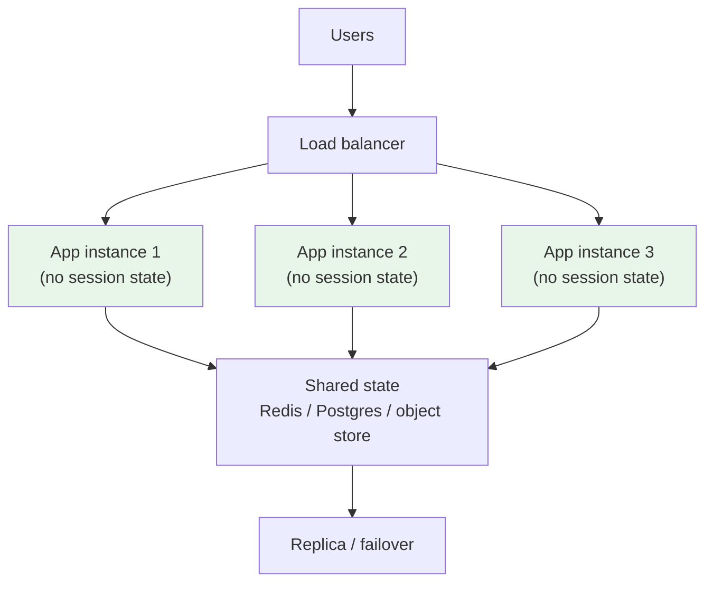

# Scaling Services

> **Interview answer (say this first).** Scaling is handling more work without getting proportionally slower or more expensive. **Vertical scaling** (scale up) means a bigger machine; **horizontal scaling** (scale out) means more machines. Vertical hits a hardware ceiling and stays a single failure domain, so long-term you scale out. Horizontally scaling is trivial only for **stateless** services, where any instance can serve any request; the hard part is finding and externalising the **state** that hides in sessions, caches, and sticky connections. The design rule is: keep compute stateless, push state into a shared store, and understand your connection and concurrency limits.

## Why this exists

Every service eventually meets a load it was not designed for. The question is whether adding resources helps, and by how much.

There are only two directions to add capacity:

```text
Vertical   (scale up):   bigger machine     1 x 16-core  ->  1 x 64-core
Horizontal (scale out):  more machines      1 x 16-core  ->  4 x 16-core
```

Vertical scaling is easy — change an instance size, restart. But it has hard limits:

- **Hardware ceiling.** There is a biggest machine you can buy, and you will hit it.
- **Cost curve.** Price grows faster than capacity at the top end. A 2× machine often costs more than 2×.
- **Still one failure domain.** One big machine is still one machine. If it dies, everything dies.
- **Restart required.** Resizing usually means downtime.

Horizontal scaling avoids those limits, but only if instances are interchangeable. That is where the real work is, because most services secretly hold state:

- A user logs in; the session lives in the instance's memory.
- A request is large; a copy sits in a local cache.
- A job's progress is tracked in a local dictionary.
- A WebSocket or streaming connection is pinned to one process.

If instance B does not have that state, the user gets logged out, the cache is cold, or the job is lost. So horizontal scaling is not "add replicas to the YAML." It is "find the state and move it out."

> **The scaling rule.** Stateless compute scales out almost linearly. State is the tax. Externalise it deliberately, or you will be forced into sticky sessions and awkward failover.

## Start from zero

Scaling has its own vocabulary. Learn these before the mechanisms.

| Word | Plain meaning |
| --- | --- |
| **Scalability** | The ability to handle growth by adding resources, without efficiency collapsing. |
| **Vertical scaling (scale up)** | Making one node bigger: more CPU, RAM, or disk. |
| **Horizontal scaling (scale out)** | Adding more nodes and spreading work across them. |
| **Stateless service** | An instance that keeps no per-client data between requests. Any instance can serve any request. |
| **Stateful service** | An instance that holds data needed to serve a request, such as a session, file, or connection. |
| **Session** | Short-lived per-user state, typically a login and its context. |
| **Session affinity (sticky sessions)** | Routing all of one client's requests to the same instance. |
| **Externalising state** | Moving state out of the instance into a shared store (Redis, database, object store). |
| **Shared-nothing** | An architecture where each node is independent and does not share memory or disk. |
| **Concurrency** | The number of requests being worked on at the same time. |
| **Throughput** | Requests completed per second. |
| **Latency** | Time for one request, usually measured as p50 and p99. |
| **Little's law** | `concurrency = arrival rate × latency`. The core sizing equation. |
| **Connection pool** | A fixed set of reusable connections to a database or downstream service. |
| **Backpressure** | Telling callers to slow down when capacity is exhausted. |
| **Graceful degradation** | Doing less work when overloaded, instead of failing entirely. |
| **Autoscaling** | Adding or removing instances automatically based on a metric. |
| **HPA** | Horizontal Pod Autoscaler: Kubernetes' scale-out controller. |
| **Head-of-line blocking** | One slow request holding a resource so others wait behind it. |
| **Amdahl's law** | Speedup is limited by the part of the work that cannot be parallelised. |
| **Scale-out efficiency** | Useful work added per extra node; falls as coordination grows. |

Two pairs to keep straight:

- **Scalability vs performance.** Performance is how fast it is today. Scalability is whether it stays fast as load grows. A system can be fast and unscalable, or slow and perfectly scalable.
- **Stateful vs sticky.** A service is *stateful* if it holds state at all. Sticky sessions are a *workaround* for stateful instances, not a property you want. Externalising state removes the need for stickiness.

## The core idea

Think of a supermarket.

**Vertical scaling** is hiring one faster cashier. They serve customers more quickly, but a flu day closes the store.

**Horizontal scaling** is opening more checkout lanes. Now the question is what each cashier needs: if a customer's loyalty card and basket are stored *at one lane*, they must return there — that is a sticky session. If instead the basket lives on a shared trolley system that any lane can read, customers can use any lane. That shared system is externalised state.



Instances are interchangeable; they all read and write the same state. Add a fourth and it is instantly useful. Lose one and nothing is lost but capacity.

### Why stateless scales trivially

For a stateless service, throughput is close to linear in the number of instances:

```text
capacity ≈ instances × per_instance_throughput
```

If one instance handles 25 requests per second, four handle roughly 100. Failures are also simple: a dead instance just disappears from the pool.

There are three caveats:

1. **Shared downstream limits.** Ten app instances hitting one database do not make the database faster. The bottleneck moves down the stack.
2. **Coordination overhead.** Load balancers, service discovery, and shared caches add a little cost per instance.
3. **Startup and cache warming.** A new instance may be slow until it warms up, so autoscaling must react before the load peaks.

### Where state hides

State rarely announces itself. These are the usual hiding places.

| Hiding place | Why it breaks scale-out | Fix |
| --- | --- | --- |
| In-memory session | Only the owning instance knows the user | Sessions in Redis or a signed cookie |
| Local in-process cache | Each instance has a different view | Shared cache, or accept per-instance caching |
| WebSocket / SSE connection | The socket is pinned to one process | Route by connection or use a pub/sub fan-out |
| Local temp files | Another instance cannot see them | Object storage or a shared volume |
| In-memory job queue | Work is lost if the instance dies | Durable broker (see later chapters) |
| In-process rate limiter | Limits are per instance, not global | Central counter in Redis |
| Sticky routing itself | Rebalancing moves users and drops state | Remove the need for stickiness |
| Long-running in-memory job | A deploy kills it | Durable workflow or checkpointing |
| Local scheduler / cron | Every instance fires the same job | Leader election or a single scheduler |
| Conversation memory in an agent | Only one worker remembers the context | Session store keyed by conversation ID |

> **The state audit.** Before scaling out, list everything the process holds in memory. Each item is either disposable, externalisable, or a reason you cannot scale.

### Scale-up vs scale-out trade-offs

| Dimension | Scale up (vertical) | Scale out (horizontal) |
| --- | --- | --- |
| Effort | Low: resize and restart | Higher: statelessness, discovery, LB |
| Ceiling | Hard hardware limit | Effectively none |
| Failure domain | Single node | Many nodes; needs coordination |
| Cost curve | Super-linear at the top | Roughly linear, plus overhead |
| Consistency | Simple: one process | Needs shared state or coordination |
| Ops complexity | Low | Higher: more moving parts |
| Best for | Databases, quick fixes, low traffic | Stateless web/API/worker tiers |

The practical answer in interviews: **scale up for the stateful tier when you can, scale out for the stateless tier, and do not let state leak into the stateless tier.**

## How it works

Walk through adding capacity to a running service.

1. **Measure the bottleneck.** Is it CPU, memory, I/O, or a downstream dependency? Scaling the wrong tier wastes money.
2. **Make the service stateless.** Move sessions to a shared store, replace local caches, and push files to object storage.
3. **Put instances behind a load balancer.** The balancer needs a health check and a drain path. Later chapters cover the algorithms.
4. **Size the connection pool.** Each instance holds a bounded number of connections. More instances times pool size must stay within the database's limit.
5. **Set concurrency limits per instance.** Cap in-flight requests so overload causes queuing and fast rejection, not collapse.
6. **Add autoscaling with sane bounds.** Scale on a leading metric (queue depth or concurrency), not just CPU; keep a minimum for fast recovery.
7. **Handle graceful shutdown.** On scale-in or deploy, stop accepting new work, finish in-flight requests, and only then exit.
8. **Test the shared tier.** Confirm the database, cache, and downstream services can absorb the new aggregate load.
9. **Watch the efficiency curve.** If doubling instances does not roughly double throughput, you have coordination overhead or a shared bottleneck.

> **The interview move.** When asked "how would you scale this?", first ask "where is the state?" and "what is the bottleneck?" The answer to scaling is usually a design change, not a bigger number.

## The syntax you will use

Real production forms for each idea. Read them once; later chapters explain the details.

**Run N interchangeable replicas.** The declaration of horizontal scale.

```yaml
apiVersion: apps/v1
kind: Deployment
metadata: {name: agent-api}
spec:
  replicas: 6                 # six identical, stateless instances
  strategy: {type: RollingUpdate}
```

Each replica is disposable; the controller replaces any that die.

**Autoscale on a metric.** The HPA adds or removes replicas to hold a target.

```yaml
apiVersion: autoscaling/v2
kind: HorizontalPodAutoscaler
metadata: {name: agent-api}
spec:
  minReplicas: 3              # never go below this; keeps failover headroom
  maxReplicas: 30
  metrics:
    - type: Resource
      resource: {name: cpu, target: {type: Utilization, averageUtilization: 70}}
```

`minReplicas` protects availability; `maxReplicas` protects the shared database from an unbounded stampede.

**Move sessions to a shared store.** Redis with a TTL is the common choice.

```python
import redis

r = redis.Redis(host="redis.internal", port=6379, decode_responses=True)

def save_session(token: str, user: str) -> None:
    r.set(f"session:{token}", user, ex=3600)   # expires in one hour

def load_session(token: str) -> str | None:
    return r.get(f"session:{token}")
```

Any instance can now load any session. The instance becomes disposable.

**Alternatively, keep the session in a signed cookie.** The client carries it; the server verifies the signature. No server-side store at all.

```text
Set-Cookie: session=eyJ1c2VyIjoiYWRhIn0.signature; HttpOnly; Secure; SameSite=Lax
```

Good for small, non-secret session data. Revocation is harder, because the token is self-contained.

**Set graceful shutdown.** Kubernetes sends SIGTERM, then waits `terminationGracePeriodSeconds` before SIGKILL.

```yaml
spec:
  terminationGracePeriodSeconds: 30
  containers:
    - name: api
      lifecycle:
        preStop:
          exec: {command: ["sh", "-c", "sleep 5"]}   # let the LB drain first
```

The pre-stop delay lets the load balancer stop sending new requests before the process exits.

**Bound the connection pool.** SQLAlchemy pools connections; the size must respect the database limit.

```python
from sqlalchemy import create_engine

engine = create_engine(
    "postgresql+psycopg://user:pass@db/agent",
    pool_size=10,          # steady-state connections per instance
    max_overflow=5,        # short bursts
    pool_timeout=5,        # fail fast instead of hanging forever
)
```

`instances × pool_size` must stay under the database's `max_connections`, or you trade one bottleneck for another.

**Size the pool with little arithmetic.** Little's law turns arrival rate and latency into concurrency.

```python
def pool_size(arrival_rate: float, latency: float, safety: float = 1.5) -> int:
    """Connections needed to cover concurrency with headroom."""
    import math
    return math.ceil(arrival_rate * latency * safety)

print(pool_size(100, 0.05))   # 8   (fast downstream)
print(pool_size(100, 2.0))    # 300 (downstream got slow!)
```

## Examples: simple to real

**Example 1 — stateful breaks, externalised works.** The same login, served by two instances. The in-memory version needs stickiness; the shared-store version does not.

```python
class StatefulServer:
    def __init__(self):
        self.sessions = {}
    def login(self, token, user):
        self.sessions[token] = user
    def whoami(self, token):
        return self.sessions.get(token)

s1, s2 = StatefulServer(), StatefulServer()
s1.login("tok-1", "ada")
print("hit s1:", s1.whoami("tok-1"))   # ada
print("hit s2:", s2.whoami("tok-1"))   # None -> must be sticky

store = {}
def login(token, user): store[token] = user
def whoami(token): return store.get(token)

login("tok-2", "ada")
print("shared store from any instance:", whoami("tok-2"))   # ada
```

The in-memory version must pin the user to `s1`. The shared store version lets any instance serve the request. Externalising state is the change that makes the fleet disposable.

**Example 2 — Amdahl's law limits scale-out.** If part of the work cannot be parallelised, adding nodes helps less and less. This is the coordination overhead made visible.

```python
def speedup(parallel_fraction, workers):
    return 1 / ((1 - parallel_fraction) + parallel_fraction / workers)

def efficiency(parallel_fraction, workers):
    return speedup(parallel_fraction, workers) / workers

for p in (1.0, 0.95, 0.9):
    speed = [f"{speedup(p, n):.2f}x" for n in (1, 4, 16)]
    eff = [f"{efficiency(p, n):.0%}" for n in (1, 4, 16)]
    print(f"parallel={p:.0%} speedup={speed} efficiency={eff}")
# parallel=100% speedup=['1.00x','4.00x','16.00x'] efficiency=['100%','100%','100%']
# parallel=95%  speedup=['1.00x','3.48x','9.14x']  efficiency=['100%','87%','57%']
# parallel=90%  speedup=['1.00x','3.08x','6.40x']  efficiency=['100%','77%','40%']
```

At 90% parallel work, 16 workers deliver only ~6.4× the throughput and 40% efficiency. Shared locks, a central database, or a single coordinator are the real-world versions of that serial 10%.

**Example 3 — Little's law sizes the fleet.** Concurrency is arrival rate times latency. This is the most useful back-of-envelope in capacity planning.

```python
def concurrent_requests(arrival_rate_per_sec, latency_sec):
    return arrival_rate_per_sec * latency_sec

def workers_needed(arrival_rate, latency, target_utilization):
    import math
    return math.ceil(concurrent_requests(arrival_rate, latency) / target_utilization)

print("50 rps, 200 ms ->", concurrent_requests(50, 0.2), "in flight")   # 10.0
print("workers at 70% ->", workers_needed(50, 0.2, 0.7))                # 15
print("200 rps, 200 ms ->", concurrent_requests(200, 0.2), "in flight") # 40.0
print("workers at 70% ->", workers_needed(200, 0.2, 0.7))               # 58
```

Note the second line: a fourfold traffic increase needs 58 workers, not 60. The reason is that `workers_needed` recomputes `ceil(concurrency / utilization)` from the new concurrency (40 / 0.7 = 57.14, rounded up to 58); it does not scale the already-rounded 15 by four (which would give 60). If latency doubles, concurrency doubles at the same request rate — which is why a slow dependency looks like a traffic spike.

**Example 4 — connection limits turn a slowdown into an outage.** A pool sized for fast downstream calls is starved when latency rises.

```python
def pool_size(arrival_rate, latency, safety=1.5):
    import math
    return math.ceil(arrival_rate * latency * safety)

print(pool_size(100, 0.05))   # 8    - healthy 50 ms downstream
print(pool_size(100, 2.0))    # 300  - downstream now takes 2 s
```

The same traffic that needed 8 connections now needs 300. If the pool and the database cap at 100, requests queue, time out, and retry — a cascading failure started by latency, not by traffic. Always set `pool_timeout` so callers fail fast.

**Example 5 — sticky sessions enlarge the blast radius.** When one sticky instance dies, its users must move and re-authenticate.

```python
def reconnect_fraction(sticky_node_count):
    return 1 / sticky_node_count

for n in (3, 10, 100):
    print(f"{n} nodes, one dies -> {reconnect_fraction(n):.1%} of sessions move")
# 3 nodes -> 33.3%; 10 nodes -> 10.0%; 100 nodes -> 1.0%
```

More nodes make the *fraction* smaller, so with a fixed total number of users the absolute number of disrupted users also shrinks (total users ÷ n). Externalised state removes the disruption entirely: any instance can pick up the session.

**Example 6 — capacity planning is just arithmetic.** Compute utilization against a target and decide when to scale.

```python
def capacity_utilization(workers, per_worker_rps, demand_rps):
    return demand_rps / (workers * per_worker_rps)

for w in (2, 4, 8):
    print(f"{w} workers -> {capacity_utilization(w, 25, 100):.0%} used")
# 2 -> 200% (overloaded); 4 -> 100% (no headroom); 8 -> 50% (healthy)
```

Run at 100% and the next hiccup becomes an outage. Target 50–70% utilization for latency-sensitive services so bursts have room.

## In production

- **Find the bottleneck before scaling.** Scaling the wrong tier adds cost and no throughput. Measure saturation per tier.
- **Externalise state early; it is the whole game.** Sessions, caches, files, and job progress are the reason scale-out stalls.
- **Stateless does not mean the data tier scales too.** Ten app instances do not make one database faster; the bottleneck moves down.
- **`instances × pool_size` must fit the database limit.** Otherwise more app instances reduce overall throughput by causing connection contention.
- **Set `pool_timeout` and request timeouts.** Failing fast beats a thread held forever; head-of-line blocking turns one slow call into a stall.
- **Use a leading metric for autoscaling.** CPU lags behind queue depth. Scale on concurrency or backlog so new instances arrive before users wait.
- **Keep `minReplicas` above one.** Autoscaling down to zero (or one) removes failover and makes cold starts visible.
- **Drain before shutdown.** Stop accepting new requests, finish in-flight work, then exit. Deploys that kill connections cause retry storms.
- **Beware per-instance limits.** Rate limiters, caches, and semaphores multiply by the instance count and stop being global limits.
- **Cache warming matters for bursty load.** A new instance with a cold cache can be slower than the one it replaced.
- **A single scheduler must run cron and background jobs.** Every instance firing the same job duplicates work; use leader election.
- **Watch for the serial fraction.** Locks, shared counters, and a central coordinator cap scale-out exactly as Amdahl's law predicts.

## Interview questions

### 1. Vertical vs horizontal scaling: what are the trade-offs?

**Answer.** Vertical scales a single node up (more CPU, RAM, disk) — simple, no code changes, but limited by hardware, super-linear in cost, and still one failure domain, usually with a restart. Horizontal scales out with more nodes — effectively unbounded and fault tolerant, but requires statelessness, a load balancer, and service discovery. Use vertical for the stateful tier and quick fixes; use horizontal for stateless tiers.

**Follow-up: "Why is scale-up still useful if scale-out is better?"** Databases scale up well because they are stateful and hard to distribute. A bigger database machine is often cheaper and simpler than sharding, well past the point people expect.

**Trap.** Saying horizontal scaling is always better. It adds coordination cost, and for a single-node database it may be impossible without a redesign.

### 2. Why do stateless services scale horizontally almost trivially?

**Answer.** Because any instance can serve any request. There is no per-client state to locate, so a load balancer can route freely, new instances are useful immediately, and a dead instance is simply removed. Throughput is roughly `instances × per_instance_throughput`.

**Follow-up: "What are the limits?"** Shared downstream dependencies, coordination overhead, and cold starts. The app tier may be stateless, but the database, cache, and third-party APIs are not, and they become the bottleneck.

**Trap.** Assuming stateless means no shared state at all. It means the service holds none between requests; it still reads and writes shared data stores.

### 3. Where does state hide in a supposedly stateless service?

**Answer.** In-memory sessions, local caches, WebSocket or SSE connections, temp files, in-memory job queues, per-instance rate limits, local schedulers, and agent conversation memory. Each is invisible until you run more than one instance or restart one.

**Follow-up: "How do you find it?"** Audit everything the process stores in memory and on local disk, then ask of each item: disposable, externalisable, or a blocker? Grep for module-level dictionaries, `lru_cache`, and file writes is a practical start.

**Trap.** Forgetting connection state. A streaming or WebSocket client is pinned to one instance even if the service has no session store, which forces connection-aware routing.

### 4. What is a sticky session, and what does it cost?

**Answer.** Session affinity routes all of one client's requests to the same instance, usually via a cookie or a hash of the client address. It lets a stateful instance keep serving without a shared store. The costs are uneven load, larger blast radius when an instance dies (all its sessions move), and difficult rolling deploys.

**Follow-up: "When is it acceptable?"** As a short-term bridge or when the session is genuinely tied to a connection, like WebSockets. Long term, externalise the session so any instance can serve it.

**Trap.** Treating stickiness as a scaling strategy. It is a workaround for state, and it makes autoscaling and failover worse.

### 5. Explain Little's law and how you use it.

**Answer.** Concurrency equals arrival rate times latency: `L = λ × W`. If you serve 50 requests per second at 200 ms each, about 10 requests are in flight. Divide by your target utilization to size workers or connections. It links traffic, latency, and capacity in one line.

**Follow-up: "What happens when latency doubles?"** In-flight concurrency doubles for the same request rate. That is why a slow dependency looks exactly like a traffic spike and can exhaust pools and threads.

**Trap.** Sizing to exactly the average. You need headroom for bursts and for the fact that latency rises under load, which increases concurrency further.

### 6. Why do connection pools and connection limits matter at scale?

**Answer.** Every instance holds a bounded number of connections, and the database has a hard `max_connections`. If each of 20 instances opens 20 connections, that is 400 — often more than the database allows. Requests then queue or fail, and the failure appears as latency and timeouts even though the app tier is healthy.

**Follow-up: "How do you size them?"** Use Little's law: concurrency equals rate times latency, plus headroom. Then ensure `instances × pool_size` is under the database cap, and set a short `pool_timeout` so callers fail fast instead of hanging.

**Trap.** Raising the pool size to "fix" slowness. Beyond the database's capacity, more connections make contention worse. The fix is usually fewer, longer-lived connections or a proxy like PgBouncer.

### 7. What is the difference between scalability and performance?

**Answer.** Performance is how fast the system is at the current load. Scalability is how well it maintains performance as load grows. A system can be fast but unable to scale past a point (a single-threaded in-memory service), or slow but scale cleanly (a simple stateless worker tier).

**Follow-up: "How would you find out if a service scales?"** Load test at increasing concurrency and plot throughput and p99 latency. If throughput plateaus while latency climbs, you have found the serial fraction or a shared bottleneck.

**Trap.** Judging scale from a benchmark at one load level. The interesting behaviour is the shape of the curve as load rises, not a single number.

### 8. How does autoscaling go wrong?

**Answer.** It can react to the wrong signal (CPU instead of queue depth), oscillate (scale up, then immediately down), stampede a shared dependency, or scale in too aggressively and drop in-flight work. It also cannot help a stateful tier, and a cold new instance may not help immediately.

**Follow-up: "How do you make it safe?"** Use leading metrics, cooldowns and hysteresis, `minReplicas` for headroom, `maxReplicas` to protect downstream systems, graceful shutdown, and scale-in protection for busy instances.

**Trap.** Assuming autoscaling equals statelessness. If instances hold state, adding and removing them corrupts sessions and jobs regardless of the metric.

## Remember this

- **Scale up is easy and bounded; scale out is harder and unbounded.** Vertical for stateful tiers, horizontal for stateless ones.
- **State is the tax on scale-out.** Sessions, caches, files, connections, and job progress must be externalised or made disposable.
- **Stateless compute scales roughly linearly, but shared dependencies do not.** The bottleneck moves down the stack.
- **Little's law guides sizing.** `concurrency = arrival rate × latency`; slow downstreams look like traffic spikes.
- **Sticky sessions are a workaround, not a strategy.** Any instance must be able to serve any request.
