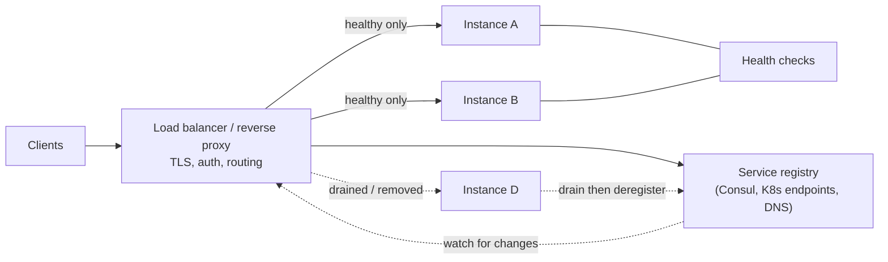

# Load Balancing, Proxies, and Service Discovery

> **Interview answer (say this first).** A load balancer distributes requests across several backends so no single one is overwhelmed and failures are hidden. **Layer 4** balancing routes by connection (TCP/IP, no payload knowledge); **Layer 7** balancing parses HTTP and can route by path, header, or cookie. A **reverse proxy** sits in front of servers, a **forward proxy** sits in front of clients, and an **API gateway** is a reverse proxy with auth, rate limiting, and routing policy. **Service discovery** is how clients find healthy instances as they come and go; **health checks** and **draining** decide which instances receive traffic. The recurring trap is **sticky sessions**, which quietly turn a shared pool into many brittle single points of failure.

## Why this exists

Suppose you have three instances of an API. You need something to answer the question "which one should get this request?" That is a load balancer.

But the first naive answer — round-robin — breaks as soon as the instances are not identical, or as soon as one of them dies. So load balancing grows into a set of related problems:

- **Distribution.** Spread requests so no backend is hot. Different algorithms suit different workloads.
- **Failure handling.** Stop sending traffic to broken instances, and bring new ones in gently.
- **Addressing.** Instances come and go with autoscaling and deploys. Who keeps track of the current set?
- **Routing policy.** Send `/api/v1/*` to one service, `/static/*` to a cache, and canary 5% of traffic to a new version.
- **Edge concerns.** TLS termination, authentication, rate limiting, and request logging live at the front door.

Without these, every client would need to know every backend address and implement its own retries, which is exactly the M × N problem again.

> **The purpose in one line.** Load balancing, proxying, and discovery are how a changing set of instances presents itself as one stable, healthy address.

## Start from zero

These terms are used loosely. Pin them down.

| Word | Plain meaning |
| --- | --- |
| **Load balancer (LB)** | A component that distributes requests across backend instances. |
| **Backend / upstream / origin** | A server that receives the forwarded request. |
| **Layer 4 (L4)** | Balancing at the transport layer: routes TCP/UDP connections by IP and port, without reading the payload. |
| **Layer 7 (L7)** | Balancing at the application layer: parses HTTP and routes by path, host, header, or cookie. |
| **Reverse proxy** | A server that accepts requests on behalf of backends and forwards them. Clients talk to the proxy. |
| **Forward proxy** | A server that clients use to reach the internet; it acts on behalf of the client. |
| **API gateway** | A reverse proxy specialised for APIs: routing, auth, rate limits, quotas, observability. |
| **Round-robin** | Send requests to backends in turn. |
| **Weighted round-robin** | Round-robin where bigger backends get more turns. |
| **Least connections** | Send to the backend with the fewest active requests. |
| **Least response time** | Send to the backend with the best recent latency. |
| **Consistent hashing** | Map keys to a ring of backends so adding or removing one moves few keys. |
| **Health check** | A periodic probe that decides whether a backend is healthy. |
| **Passive health check** | Infer health from real request failures, no extra probes. |
| **Active health check** | Send dedicated probe requests to each backend. |
| **Draining** | Stop sending new requests to an instance while its in-flight requests finish. |
| **Service discovery** | Finding the current healthy instances of a service. |
| **Registry** | A database of service instances and their health (Consul, etcd, Kubernetes endpoints). |
| **Client-side discovery** | The client asks the registry and picks an instance itself. |
| **Server-side discovery** | The client calls a stable LB or DNS name, which does the picking. |
| **DNS-based discovery** | Use DNS records (A, SRV) as the registry; TTL controls staleness. |
| **Sticky session (affinity)** | Route all of one client's requests to the same backend. |
| **Canary** | Send a small slice of traffic to a new version before full rollout. |
| **Blue-green** | Run two full environments and switch traffic between them. |
| **Connection draining timeout** | How long to wait for in-flight work before force-closing. |

The distinctions that matter most:

- **L4 vs L7** is about *how much you can see*. L4 sees packets; L7 sees HTTP. More insight means more CPU per request but smarter routing.
- **Reverse vs forward proxy** is about *who is being represented*. A reverse proxy hides servers from clients; a forward proxy hides clients from servers.
- **Client-side vs server-side discovery** is about *who tracks the instance list*. Client-side puts the registry in the client; server-side hides it behind a stable endpoint.

## The core idea

Think of a hotel front desk.

A **reverse proxy** is the front desk: guests only talk to the desk, and the desk decides which room or staff member handles each request. Guests never learn the internal layout.

A **forward proxy** is a travel agent: you (the client) use the agent to reach airlines and hotels, and the agent represents you.

**L4** is a doorman who only checks the building and floor number — fast, but blind to what you want. **L7** is a concierge who reads your request and sends you to the right department.

**Service discovery** is the hotel's staff directory that is updated as people join, leave, and change shifts.



Two loops keep this correct. The **data loop** carries requests to healthy instances. The **control loop** watches instances: register when ready, drain, then deregister.

### L4 vs L7

| Aspect | L4 (transport) | L7 (application) |
| --- | --- | --- |
| Sees | IPs, ports, TCP/UDP | HTTP methods, paths, headers, cookies |
| Routing | Connection-level | Content-aware |
| Speed | Very fast, low overhead | Slower; parses each request |
| TLS | Terminates or passes through | Usually terminates and inspects |
| Sticky sessions | By source IP | By cookie |
| Features | Throughput, basic failover | Retries, rewrites, canary, auth, WAF |
| Examples | Cloud NLB, HAProxy TCP mode | nginx, Envoy, Cloud ALB, API gateways |

Most architectures use both: an L7 proxy at the edge for smart routing, and L4 load balancing underneath for raw throughput.

### Balancing algorithms and when each fits

| Algorithm | How it picks | Best for | Weakness |
| --- | --- | --- | --- |
| **Round-robin** | Next backend in order | Identical, similar-duration requests | Long requests pile onto one backend |
| **Weighted round-robin** | In proportion to weight | Mixed instance sizes | Weights go stale as instances change |
| **Least connections** | Fewest in-flight requests | Variable request durations | Needs per-request accounting |
| **Least response time** | Fastest recent latency | Latency-sensitive traffic | Can oscillate; punishes slow starters |
| **Random** | Pick at random | Huge fleets, simplicity | Uneven load in small fleets |
| **Power of two choices** | Randomly pick two, take the less loaded | Huge fleets, near-optimal load | Slightly more work than random |
| **Consistent hashing** | Hash key onto a ring | Cache affinity, sharded state | Hot keys still skew |
| **IP hash** | Hash client IP | Simple session affinity | Unbalanced behind NAT/proxies |

The deep insight is that connection count is a good load signal only if requests cost the same. When they do not, least-connections wins; when requests are cheap and uniform, round-robin is fine. Consistent hashing solves a different problem: keeping the same key on the same backend across membership changes.

### Consistent hashing in one paragraph

Naive mapping is `backend = hash(key) % N`. Change `N` and almost every key moves, destroying caches and forcing re-sharding. Consistent hashing places both backends and keys on a ring. A key belongs to the first backend clockwise from it. Adding or removing one backend moves only the keys in its arc — about `1/N` of them. Virtual nodes (each backend placed many times) smooth out the distribution.

## How it works

Follow a request from the client to a backend and back.

1. **The client resolves a stable name.** Either a DNS name for a load balancer or, in client-side discovery, a registry lookup that returns a list of instances.
2. **The edge terminates TLS and applies policy.** Authentication, rate limiting, and routing rules run at the reverse proxy or API gateway.
3. **The balancer selects a backend.** Round-robin, least connections, or a hash of the key, using only instances that pass health checks.
4. **It retries safely.** A retry to another backend is only safe if the request is idempotent. Otherwise a retry can duplicate a side effect.
5. **The backend handles the request.** If it is slow, the balancer's timeout may fire and the request is retried elsewhere — with the same idempotency caveat.
6. **Health checks run continuously.** Active probes or passive failure counting mark an instance unhealthy and remove it from the pool.
7. **Deploys use draining.** A terminating instance is removed from discovery first, keeps serving in-flight work, and exits when drained.
8. **The registry updates.** Kubernetes endpoints, Consul, or DNS records reflect the change, and clients or the balancer pick up the new set.
9. **Observability closes the loop.** Per-backend latency and error rates feed autoscaling and alerting.

> **The retry warning.** Load balancers make retries easy, which makes duplicate side effects easy. Retry only idempotent requests, or carry an idempotency key.

## The syntax you will use

Real production forms, smallest to largest.

**nginx as an L7 reverse proxy with least-connections.** The classic self-hosted option.

```nginx
upstream agent_api {
    least_conn;                      # pick fewest in-flight requests
    server 10.0.0.1:8080 max_fails=3 fail_timeout=10s;
    server 10.0.0.2:8080 max_fails=3 fail_timeout=10s;
    server 10.0.0.3:8080 backup;     # only used when the others are down
    keepalive 32;                    # reuse upstream connections
}

server {
    listen 443 ssl;
    location /api/ {
        proxy_pass http://agent_api;
        proxy_next_upstream error timeout http_502;   # retry on failure
        proxy_connect_timeout 1s;
        proxy_read_timeout 10s;
    }
}
```

`max_fails` and `fail_timeout` are passive health checks: real errors mark a backend out.

**HAProxy with active health checks.** Common for high-throughput L4/L7.

```
backend agent_api
    balance leastconn
    option httpchk GET /healthz          # active check
    http-check expect status 200
    default-server inter 2s fall 3 rise 2
    server app1 10.0.0.1:8080 check
    server app2 10.0.0.2:8080 check
    server app3 10.0.0.3:8080 check backup
```

`fall 3 rise 2` means three failed checks to remove, two passes to re-add.

**Kubernetes Service with readiness gating.** A stable virtual IP in front of pods.

```yaml
apiVersion: v1
kind: Service
metadata: {name: agent-api}
spec:
  selector: {app: agent-api}     # which pods are backends
  ports:
    - port: 80
      targetPort: 8080
  type: ClusterIP
```

A pod only receives traffic once its **readiness** probe passes. That is the built-in drain-and-register mechanism.

**An Ingress for L7 routing.** Path and host routing at the edge.

```yaml
apiVersion: networking.k8s.io/v1
kind: Ingress
metadata: {name: agent}
spec:
  rules:
    - host: api.example.com
      http:
        paths:
          - path: /v1/agents
            pathType: Prefix
            backend:
              service: {name: agent-api, port: {number: 80}}
```

For canary and header-based routing, teams often use the Gateway API or a service mesh instead of Ingress.

**Client-side discovery with gRPC.** The client resolves instances and balances between them.

```python
import grpc

# "dns:///" resolves every address; round_robin spreads calls client-side
channel = grpc.insecure_channel(
    "dns:///agent-api.internal:50051",
    options=[("grpc.lb_policy_name", "round_robin")],
)
```

Client-side discovery removes one network hop but requires every client to implement balancing and health logic.

**DNS SRV records as a registry.** The simplest service-discovery mechanism.

```text
_agent-api._tcp.internal. 30 IN SRV 10 50 50051 app-1.internal.
_agent-api._tcp.internal. 30 IN SRV 10 50 50051 app-2.internal.
```

The TTL (30 seconds here) is the staleness window: clients may keep using a dead address until it expires.

**Consul registration.** A central registry with health checks: the instance registers its name, address, and a check endpoint, and Consul removes it from discovery when the check fails.

**Consistent hashing** is usually built into the proxy or client library. The next example implements the ring so you can see the mechanism.

## Examples: simple to real

**Example 1 — round-robin and its blind spot.** Requests go to backends in turn, regardless of how long each takes.

```python
class RoundRobin:
    def __init__(self, servers):
        self.servers, self.next_index = servers, 0
    def pick(self):
        s = self.servers[self.next_index]
        self.next_index = (self.next_index + 1) % len(self.servers)
        return s

rr = RoundRobin(["a", "b", "c"])
print([rr.pick() for _ in range(7)])
# ['a', 'b', 'c', 'a', 'b', 'c', 'a']
```

Perfect when every request costs the same. Under a mix of 1 ms and 5 s requests, the long ones stack up on whichever backend happens to receive them.

**Example 2 — least connections adapts to slow requests.** Three backends, one already busy with two slow requests.

```python
class LeastConnections:
    def __init__(self, servers):
        self.active = {s: 0 for s in servers}
    def acquire(self):
        s = min(self.active, key=self.active.get)
        self.active[s] += 1
        return s
    def release(self, s):
        self.active[s] -= 1

lc = LeastConnections(["a", "b", "c"])
lc.active["a"], lc.active["b"], lc.active["c"] = 2, 0, 1
print("active:", lc.active)          # {'a': 2, 'b': 0, 'c': 1}
print("next goes to:", lc.acquire()) # b
print("now active:", lc.active)      # {'a': 2, 'b': 1, 'c': 1}
```

The new request avoids the busy backend. This is why least-connections is the default for variable-duration traffic.

**Example 3 — consistent hashing minimises reshuffling.** Compare naive modulo with a hash ring when the fleet grows from four nodes to five. The ring class is included so the example runs on its own.

```python
import bisect
import hashlib

def h(key):
    return int.from_bytes(hashlib.sha256(key.encode()).digest()[:8], "big")

class HashRing:
    def __init__(self, nodes, vnodes=100):
        self.ring = {}
        for node in nodes:
            for i in range(vnodes):        # virtual nodes smooth the arcs
                self.ring[h(f"{node}#{i}")] = node
        self.sorted_keys = sorted(self.ring)

    def lookup(self, key):
        idx = bisect.bisect(self.sorted_keys, h(key))
        if idx == len(self.sorted_keys):
            idx = 0
        return self.ring[self.sorted_keys[idx]]

KEYS = [f"key-{i}" for i in range(5000)]
NODES = ["n1", "n2", "n3", "n4"]

def modulo_map(key, n):
    return h(key) % n

ring4 = HashRing(NODES)
before_ring = {k: ring4.lookup(k) for k in KEYS}
before_mod = {k: modulo_map(k, len(NODES)) for k in KEYS}

ring5 = HashRing(NODES + ["n5"])
after_ring = {k: ring5.lookup(k) for k in KEYS}
after_mod = {k: modulo_map(k, len(NODES) + 1) for k in KEYS}

ring_moved = sum(before_ring[k] != after_ring[k] for k in KEYS)
mod_moved = sum(before_mod[k] != after_mod[k] for k in KEYS)
print(f"ring moved {ring_moved / len(KEYS):.1%}, modulo moved {mod_moved / len(KEYS):.1%}")
# ring moved 16.4%, modulo moved 79.7%
```

Adding a fifth node moves ~1/5 of keys with a ring, but ~4/5 with modulo. For a cache, that difference is the number of cold keys after a scale-up.

**Example 4 — health checks and draining are a state machine.** An instance is not simply up or down; it moves through states so that deploys do not drop requests.

```python
class ServerState:
    def __init__(self, name):
        self.name, self.state = name, "healthy"
    def serves_new(self):
        return self.state == "healthy"

s = ServerState("web-1")
print(s.state, s.serves_new())   # healthy True
s.state = "draining"             # removed from the LB, still finishing work
print(s.state, s.serves_new())   # draining False
s.state = "removed"
print(s.state, s.serves_new())   # removed False
```

`draining` is the crucial middle state: new traffic stops, existing requests finish. Without it, every deploy severs live connections.

**Example 5 — discovery is a registry plus a watch.** Instances register, deregister, and clients read the current set.

```python
# a registry is just a mapping from service name to live addresses
registry = {"embedder": ["10.0.0.1:8000", "10.0.0.2:8000"]}
print("instances:", registry["embedder"])
# ['10.0.0.1:8000', '10.0.0.2:8000']

registry["embedder"].remove("10.0.0.1:8000")   # instance drained
print("after deregister:", registry["embedder"])
# ['10.0.0.2:8000']
```

In practice the registry is Consul, etcd, or Kubernetes endpoints, and clients watch for changes rather than polling.

## In production

- **Prefer least-connections or least-response-time when request durations vary.** Round-robin is only fair for uniform work.
- **Use L7 at the edge and L4 underneath.** Smart routing costs CPU; raw throughput wants a simple transport-level layer.
- **Health checks must reflect real readiness.** A process that is up but cannot reach its database should fail readiness, not receive traffic.
- **Drain before removing.** Stop new traffic, wait for in-flight requests, then exit. The pre-stop delay exists for exactly this.
- **Retries can duplicate side effects.** Only retry idempotent requests, or attach an idempotency key so the backend can deduplicate.
- **Sticky sessions concentrate risk.** They cause uneven load, larger blast radius on failure, and painful rolling deploys. Externalise state instead.
- **Consistent hashing keeps caches warm, but hot keys still skew.** One very popular key lands on one backend. Consider key salting or a cache tier.
- **DNS TTL is a staleness budget.** Long TTLs make failover slow; very short TTLs increase resolver load. Pick per service.
- **Client-side discovery removes a hop but multiplies logic.** Every language and client must implement balancing, health, and failover.
- **A gateway is a shared dependency.** If the gateway is unhealthy, everything is down. Run it in multiple zones and keep its policy simple.
- **Protect backends from the balancer's retries.** Retry budgets and circuit breakers stop a small failure from becoming a retry storm.
- **Watch per-backend metrics, not just the fleet average.** A single bad instance hides inside a healthy-looking average until it fails.

## Interview questions

### 1. What is the difference between L4 and L7 load balancing?

**Answer.** L4 balances connections using transport-layer information — IP and port — without reading the payload. It is fast and protocol-agnostic. L7 parses the application protocol, usually HTTP, and can route by path, host, header, or cookie, and terminate TLS, rewrite requests, and enforce auth. More insight costs more CPU per request.

**Follow-up: "When would you choose L4?"** For raw throughput, non-HTTP protocols like gRPC streaming or databases, and simple TCP failover. Use L7 when routing decisions depend on the request content.

**Trap.** Saying L7 is always better. It is more capable but more expensive and another place to terminate connections; many systems use L4 for the heavy lifting.

### 2. Explain consistent hashing and why it matters.

**Answer.** With naive `hash(key) % N`, changing `N` remaps almost every key, which cold-starts caches and forces re-sharding. Consistent hashing places backends and keys on a ring; a key belongs to the first backend clockwise. Adding or removing a backend moves only that backend's arc, about `1/N` of keys. Virtual nodes keep the distribution even.

**Follow-up: "What is the downside?"** Hot keys still concentrate on one backend, and the ring adds a little lookup cost. Also, a node failure moves its load entirely to its neighbours on the ring unless replicas are used.

**Trap.** Forgetting virtual nodes. Without them, random placement makes some backends own huge arcs, so load is badly skewed.

### 3. Reverse proxy vs forward proxy — what is the difference?

**Answer.** A reverse proxy sits in front of servers and represents them to clients; clients talk to the proxy and never see the backends. A forward proxy sits in front of clients and represents them to the internet, used for egress control, caching, and anonymity. Direction of representation is the distinction.

**Follow-up: "Where does an API gateway fit?"** It is a reverse proxy specialised for APIs, adding authentication, rate limiting, quotas, request transformation, and observability at the front door.

**Trap.** Calling an API gateway a load balancer. A gateway includes balancing, but its job is policy at the API boundary.

### 4. How do health checks and draining work together?

**Answer.** Health checks decide whether an instance is eligible for traffic; active probes send requests, passive checks count real failures. Draining is the transition: an instance is removed from discovery but keeps finishing in-flight requests before it exits. That is why deployments do not sever live connections.

**Follow-up: "What does a readiness probe check that a liveness probe does not?"** Readiness asks "can this instance serve traffic right now?" — it may be temporarily overloaded or waiting on a dependency. Liveness asks "is this process wedged and should be restarted?" They trigger different actions.

**Trap.** Using a shallow check like "process is listening." That passes while the instance cannot reach its database, so it receives traffic it cannot serve.

### 5. Client-side vs server-side service discovery?

**Answer.** In server-side discovery, the client calls a stable LB or DNS name and the infrastructure picks an instance. In client-side discovery, the client queries a registry and load-balances itself. Server-side is simpler for clients and adds a hop; client-side removes the hop but makes every client implement discovery, health awareness, and balancing.

**Follow-up: "How does DNS fit?"** DNS records can act as a registry, with the TTL as the staleness window. It is simple and universal, but failover is only as fast as the TTL and resolvers may cache longer than instructed.

**Trap.** Assuming DNS alone is enough for fast failover. Resolver caching and connection reuse can keep clients on a dead address well past the TTL.

### 6. What is the cost of sticky sessions?

**Answer.** Affinity pins a client to one backend, which creates uneven load, makes autoscaling less effective, enlarges the blast radius when that backend fails, and complicates rolling deploys because sessions must migrate or be re-established. It exists to work around in-memory state, so the real fix is externalising that state.

**Follow-up: "When is affinity unavoidable?"** When state is genuinely tied to a connection, such as a WebSocket or a long-lived stream. Even then, prefer routing by connection ID over hashing the client IP.

**Trap.** Using IP-hash affinity behind a NAT or corporate proxy. Thousands of users share one IP, so they all land on one backend.

### 7. How do you handle retries safely at the load balancer?

**Answer.** Retry only idempotent requests, cap the number of attempts, use a retry budget, and add backoff with jitter. Require an idempotency key for non-idempotent operations so the backend can deduplicate. Otherwise a slow backend plus automatic retries becomes a self-inflicted overload.

**Follow-up: "What is a retry budget?"** A limit on retries as a fraction of total requests, for example 10%. It stops retries from amplifying load when a dependency is already struggling.

**Trap.** Retrying a POST that charges a card because the first attempt timed out. The write may have succeeded; the retry charges again.

### 8. Why does load balancing not fix a shared bottleneck?

**Answer.** Because every backend talks to the same downstream. More app instances hitting one database or one third-party API do not increase the downstream's capacity; they increase contention. The balancer spreads work to the tier that is scalable, and the bottleneck simply moves down the stack.

**Follow-up: "How do you find the real bottleneck?"** Measure per tier under increasing load and watch where saturation appears first — connection pool usage, database CPU, queue depth, or a downstream error rate. Scale that tier or add caching and backpressure.

**Trap.** Assuming an even request distribution means an even load distribution. Backends with different caches, shards, or tenants can be unevenly loaded despite fair routing.

## Remember this

- **L4 routes connections; L7 routes requests.** Use L7 at the edge for policy, L4 underneath for throughput.
- **Reverse proxies represent servers; forward proxies represent clients.** An API gateway is a policy-rich reverse proxy.
- **Match the algorithm to the workload.** Round-robin for uniform requests; least-connections for variable ones; consistent hashing for cache affinity.
- **Health checks decide eligibility; draining removes traffic gracefully.** Readiness gates registration; pre-stop delay lets requests finish.
- **Sticky sessions are a workaround for state.** Externalise the session so any instance can serve any request.
