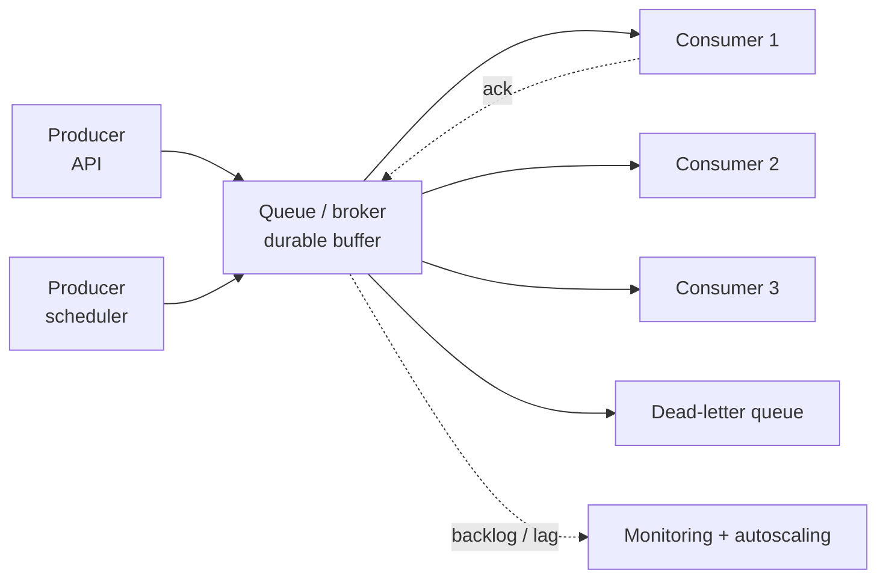
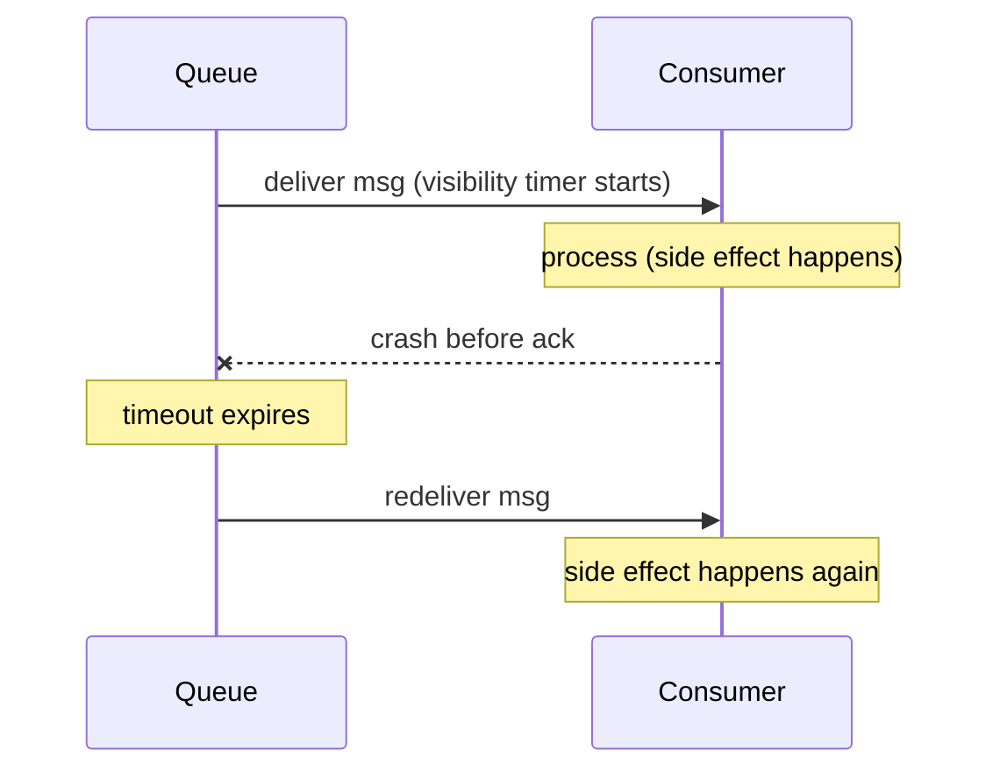

# Message Queues and Producer-Consumer

> **Interview answer (say this first).** A message queue lets one part of a system hand work to another without waiting for it. A **producer** publishes messages; a **consumer** reads and processes them; the queue stores them in between. This decouples the two sides in time, rate, and failure: the producer does not need the consumer to be up, and bursts are buffered. Queues are not free — they add a broker to operate, they deliver **at least once** in practice, so consumers must be **idempotent**, and they hide overload unless you add **backpressure** and a **dead-letter queue**. Use a queue for asynchronous, bursty, retryable work, not to fake a request/response call.

## Why this exists

Imagine an API that accepts an agent run. If it does all the work inline — call the model, call tools, write results — the request takes 30 seconds. That is bad for three reasons:

1. **The caller waits and times out.** A 30-second request eventually hits a gateway timeout, even though the work was fine.
2. **A spike looks like an outage.** Every concurrent run consumes a thread and a connection, so a burst of 500 requests exhausts the pool.
3. **A crash loses work.** If the process dies mid-task, the accepted job is gone.

A queue fixes all three. The API writes one small message and returns `202 Accepted` in milliseconds. A pool of workers processes runs at their own pace. A burst becomes a longer queue, not a dead server. A crash means the message is redelivered.

```text
Synchronous:  client ---(30 s)--- API --- model/tools/DB ---> response
Asynchronous: client ---(5 ms)--- API ---> [queue] ---> worker --- model/tools/DB
```

The second version is a producer-consumer system. The producer (API) and consumer (worker) share no memory and do not even need to run at the same time.

> **The one-sentence purpose.** A queue turns a synchronous call into a durable message, decoupling producer and consumer in time, rate, and failure.

## Start from zero

Queue vocabulary is used precisely. Learn these first.

| Word | Plain meaning |
| --- | --- |
| **Producer** | A program that publishes messages to a queue or topic. |
| **Consumer** | A program that reads messages and processes them. |
| **Broker** | The server that stores and delivers messages (RabbitMQ, Kafka, SQS, Redis). |
| **Message** | One unit of work: a payload plus metadata. |
| **Queue** | A destination that holds messages until they are consumed, then deletes them. |
| **Log / topic** | A stream that keeps messages for a retention period; consumers track offsets. |
| **Decoupling** | Producer and consumer do not know about or wait for each other. |
| **Backlog / lag** | The number of messages waiting, or how far behind a consumer is. |
| **Push model** | The broker delivers messages to consumers as they arrive. |
| **Pull model** | Consumers ask the broker for messages when they have capacity. |
| **Backpressure** | Slowing producers or rejecting work when consumers cannot keep up. |
| **Acknowledgement (ack)** | A consumer telling the broker it finished a message. |
| **Negative ack (nack)** | A consumer reporting failure, so the message can be retried. |
| **Visibility timeout** | How long a broker hides a delivered message before redelivering it unacked. |
| **Redelivery** | Sending an unacknowledged message again, often after a timeout. |
| **At-most-once** | Messages may be lost, never duplicated. |
| **At-least-once** | Messages are never lost, but may be duplicated. The common default. |
| **Exactly-once** | Delivered once in effect, usually via deduplication or transactions. Rare and costly. |
| **Idempotent** | Repeating the operation has the same effect as doing it once. |
| **Competing consumers** | Several consumers read from the same queue to share the work. |
| **Consumer group** | Consumers that share a subscription, each getting a subset of messages. |
| **Dead-letter queue (DLQ)** | Where messages go after too many failed attempts. |
| **Poison message** | A message that always fails, often because of bad data. |
| **In-memory queue** | A queue inside the process. Fast, but lost on restart. |
| **Brokered queue** | A separate, durable service that survives process and machine failure. |
| **Partition** | An ordered, append-only lane within a log. Ordering is per partition. |
| **Offset** | A consumer's position in a log partition. |

Three concepts cause most confusion:

- **Ack vs visibility timeout.** An ack removes the message; a visibility timeout hides it temporarily and redelivers if no ack arrives.
- **At-least-once vs exactly-once.** Exactly-once is an *effect*, usually achieved by at-least-once delivery plus deduplication. Do not assume the broker gives it for free.
- **Queue vs log.** A queue deletes messages after consumption; a log (Kafka) keeps them for a retention period. Same word, different models.

## The core idea

Think of a restaurant. A **producer** is a waiter taking orders. A **queue** is the order rail in the kitchen. A **consumer** is a cook. The waiter does not cook and the cook does not take orders. Orders wait on the rail when the kitchen is busy; if the rail fills, the waiter must slow down — that is backpressure.

Now add failure. If a cook drops a ticket, the order must come back — that is the visibility timeout. If a dish is made twice because the ticket was reissued, it is at-least-once; a good kitchen checks whether the order is already done — idempotency. A ticket nobody can read goes to a special pile — the dead-letter queue.



Producers push into a durable buffer; consumers pull at their own pace; failures route to a DLQ; backlog drives autoscaling.

### Why queues decouple and absorb bursts

| Decoupling | What it means | Benefit |
| --- | --- | --- |
| **Time** | Producer and consumer need not run at once | Accept work while workers deploy or are down |
| **Rate** | Bursts are absorbed by the queue | Protect the consumer from spikes |
| **Failure** | A consumer crash does not fail the request | Redeliver and retry |

A queue buys you time: a 10-minute burst can be worked off over an hour by a smaller pool, as long as the backlog drains. The arithmetic is simple — backlog grows when the arrival rate exceeds the service rate, and drains when it is lower. If arrivals permanently exceed capacity, no queue size saves you.

### Push vs pull

| Aspect | Push (broker sends) | Pull (consumer asks) |
| --- | --- | --- |
| Latency | Low; delivery on arrival | Slightly higher; poll interval |
| Overload | Can overwhelm a slow consumer | Consumer controls its own pace |
| Backpressure | Needs broker-side flow control | Natural: poll only when ready |
| Examples | RabbitMQ push (with prefetch) | Kafka, SQS, Redis Streams |

Most production systems use pull, or push with **prefetch limits**. Prefetch (the in-flight cap) stops a broker from dumping a thousand messages on one consumer.

### Acknowledgements, redelivery, and duplicates

1. Consumer receives a message. The broker marks it in-flight and starts a visibility timer.
2. Consumer processes it.
3. Consumer sends **ack**; the broker deletes it.
4. If the consumer crashes or the timer expires first, the message becomes visible and another consumer gets it.

Step 4 is why at-least-once is the norm: if the consumer finished the work but crashed before acking, it runs twice. So **idempotency is mandatory**, not optional.



### In-memory vs brokered queues

| Aspect | In-memory (`queue.Queue`) | Brokered (SQS, RabbitMQ, Kafka) |
| --- | --- | --- |
| Durability | Lost on process exit | Persisted; survives restarts |
| Ordering | FIFO within the process | Per queue or per partition |
| Backpressure | Only if you pass `maxsize`; `queue.Queue()` is unbounded by default (maxsize=0) | Needs prefetch and backlog alerts |
| Ops cost | None | A service to run, monitor, and pay for |
| Best for | Thread pools, in-process pipelines | Durable, distributed, retryable work |

### When a queue is the wrong answer

- **The caller needs the result now.** A queue makes responses asynchronous. Return a job ID and expose status instead.
- **The work is tiny and fast.** A broker round trip can cost more than the work itself. Do it inline.
- **You are hiding an overloaded consumer.** A queue turns a capacity problem into an ever-growing backlog.
- **Exactly-once side effects matter and you cannot make them idempotent.** No mainstream broker gives duplicate-free side effects across systems.

## How it works

Follow one message end to end.

1. **The producer creates a message.** A payload plus a key, and often a unique message ID and idempotency key.
2. **It publishes to the broker.** The publish usually needs an acknowledgement, or the producer cannot know the broker stored it.
3. **The broker persists and enqueues it.** Durable brokers write to disk or replicate before acknowledging.
4. **A consumer pulls or receives it.** With pull, it asks for a batch when it has capacity; with push, prefetch caps in-flight messages.
5. **The broker hides it for the visibility timeout.** This stops two consumers working the same message at once.
6. **The consumer processes it.** It must be idempotent, because redelivery is always possible.
7. **The consumer acks or nacks.** An ack deletes the message; a nack makes it visible again, usually with backoff.
8. **Retries are bounded by a policy.** After N attempts, the message moves to the dead-letter queue with its failure reason.
9. **Backlog drives reaction.** Consumer lag triggers alerts and autoscaling; sustained growth throttles producers.
10. **Ordering is per queue or partition.** Route a key consistently and process one message at a time if order matters.

> **The two rules of queues.** Every message may be delivered more than once, and every queue can grow without bound. Idempotency and backpressure are the answers.

## The syntax you will use

Real production forms for the same concepts.

**Publish and consume on a managed queue.** SQS is the common baseline.

```python
import boto3

sqs = boto3.client("sqs")
sqs.send_message(                       # producer
    QueueUrl=queue_url,
    MessageBody='{"job_id": "j-1"}',
    MessageGroupId="tenant-42",         # FIFO ordering key
    MessageDeduplicationId="j-1",       # suppress producer retry duplicates
)

resp = sqs.receive_message(             # consumer
    QueueUrl=queue_url,
    VisibilityTimeout=60,               # hidden for 60 s while we work
    WaitTimeSeconds=20,                 # long poll: fewer empty responses
)
for m in resp.get("Messages", []):
    handle(m["Body"])                   # must be idempotent
    sqs.delete_message(QueueUrl=queue_url, ReceiptHandle=m["ReceiptHandle"])
```

If `handle` raises, the message is not deleted and becomes visible again after the timeout.

**RabbitMQ with a dead-letter exchange and prefetch.** The classic broker.

```python
import pika

connection = pika.BlockingConnection(pika.ConnectionParameters("rabbitmq"))
channel = connection.channel()
channel.queue_declare(
    queue="agent_jobs",
    durable=True,
    arguments={"x-dead-letter-exchange": "dlx"},   # failures go here
)
channel.basic_qos(prefetch_count=10)               # in-flight limit = backpressure
channel.basic_consume(queue="agent_jobs", on_message_callback=on_message)
```

`prefetch_count` stops a fast broker from flooding a slow consumer.

**Kafka with durability, then manual commits.** `acks=all` waits for in-sync replicas.

```python
from kafka import KafkaConsumer, KafkaProducer

producer = KafkaProducer(
    bootstrap_servers="kafka:9092",
    acks="all",                  # wait for in-sync replicas
    enable_idempotence=True,     # suppress producer retry duplicates
)
producer.send("agent-jobs", key=b"tenant-42", value=b'{"job_id":"j-1"}')

consumer = KafkaConsumer(
    "agent-jobs",
    bootstrap_servers="kafka:9092",   # must match the producer, not the localhost default
    group_id="agent-workers",
    enable_auto_commit=False,    # commit only after successful processing
)
for record in consumer:
    handle(record.value)         # idempotent
    consumer.commit()            # ack: advance the offset
```

Auto-commit can advance before processing finishes, losing work on a crash. Manual commit after processing gives at-least-once.

## Examples: simple to real

**Example 1 — a bounded queue applies backpressure.** When the queue is full, the producer must wait or be rejected.

```python
import queue

bounded = queue.Queue(maxsize=2)
bounded.put("m1")
bounded.put("m2")
try:
    bounded.put_nowait("m3")
except queue.Full:
    print("producer must wait: bounded queue is full")

try:
    bounded.put("m3", timeout=0.05)
except queue.Full:
    print("still full after 50 ms -> backpressure")
```

The visible `Full` is the signal to slow producers or shed load. An unbounded queue hides the same overload until memory runs out.

**Example 2 — competing consumers share one queue.** Several workers pull from the same queue, so throughput scales and a dead worker loses nothing.

```python
import queue
import threading
import time

work = queue.Queue()
consumed = []

def worker(name):
    while True:
        item = work.get()
        if item is None:                 # shutdown signal
            work.task_done()
            return
        time.sleep(0.002)                # pretend work takes time
        consumed.append((name, item))    # list.append is atomic in CPython
        work.task_done()

workers = [threading.Thread(target=worker, args=(f"w{i}",)) for i in range(3)]
for t in workers:
    t.start()
for i in range(9):
    work.put(i)
for _ in workers:
    work.put(None)                       # one shutdown signal per worker
work.join()
for t in workers:
    t.join()
print("produced 9, consumed", len(consumed))        # produced 9, consumed 9
print("workers:", sorted({n for n, _ in consumed})) # ['w0', 'w1', 'w2']
```

Each message goes to exactly one worker. In a broker-based competing-consumers setup, if a worker dies mid-message the broker redelivers it — hence idempotency. This example uses an in-process `queue.Queue`, which has no broker and no redelivery: a crashed worker would lose the in-flight item.

**Example 3 — visibility timeout redelivers unacked work.**

```python
class Broker:
    def __init__(self, timeout):
        self.ready, self.inflight = ["job-1"], {}
        self.timeout, self.now = timeout, 0

    def receive(self):
        for msg, deadline in list(self.inflight.items()):
            if self.now >= deadline:          # visibility expired
                del self.inflight[msg]
                self.ready.append(msg)         # redeliver
        if not self.ready:
            return None
        msg = self.ready.pop(0)
        self.inflight[msg] = self.now + self.timeout
        return msg

    def ack(self, msg):
        self.inflight.pop(msg, None)

b = Broker(timeout=30)
print(b.receive())     # job-1
b.now = 10
print(b.receive())     # None: still owned, timer running
b.now = 40             # 40 s > 30 s timeout
print(b.receive())     # job-1 again (redelivered)
b.ack("job-1")
print(b.receive())     # None
```

The timeout is a trade-off: too short and slow work is redelivered (duplicates); too long and a crashed consumer stalls the message.

**Example 4 — at-least-once delivery needs idempotency.** The same message arrives twice; the consumer must not charge twice.

```python
processed = set()

def handle(message_id, payload):
    if message_id in processed:
        return "duplicate ignored"
    processed.add(message_id)
    return f"charged {payload}"

print(handle("msg-1", "10.00"))   # charged 10.00
print(handle("msg-1", "10.00"))   # duplicate ignored
```

The set stands in for a durable store of processed ids — a unique constraint, a Redis key with a TTL, or a deduplication table.

**Example 5 — retries end at a dead-letter queue.** A poison message should not block the queue forever.

```python
def process(msg):
    if msg == "poison":
        raise ValueError("cannot parse")
    return "ok"

inbox = ["good-1", "poison", "good-2"]
dlq = []
for msg in inbox:
    for attempt in range(1, 4):
        try:
            process(msg)
            break
        except ValueError:
            if attempt == 3:
                dlq.append(msg)
print("delivered:", [m for m in inbox if m not in dlq])
# delivered: ['good-1', 'good-2']
print("dead-lettered:", dlq)
# dead-lettered: ['poison']
```

Good messages proceed; the poison one is set aside with its failure context. Without a DLQ, one bad message can stall an ordered partition.

## In production

- **Assume at-least-once and make consumers idempotent.** Redelivery happens on timeouts, crashes, and network blips. A unique key or dedupe table is not optional.
- **Set the visibility timeout longer than worst-case processing.** Too short causes duplicates; too long stalls recovery. Renew it for long jobs.
- **Bound the queue or the in-flight count.** Unbounded queues turn overload into an out-of-memory crash. Prefetch limits protect slow consumers.
- **Monitor consumer lag, not just queue size.** Lag tells you whether the backlog is draining. Alert on the trend, not a fixed number.
- **Send poison messages to a DLQ after bounded retries.** Alert on DLQ depth; a growing DLQ is an unhandled bug.
- **A queue does not make work faster; it makes it survivable.** If the consumer can never keep up, the queue is just a delay before the failure.
- **Long-running jobs need heartbeats.** Extend the visibility timeout periodically, or the broker will redeliver work that is still running.
- **Do not use a queue for a question that needs an answer.** Use it for commands and events, and expose job status separately.

## Interview questions

### 1. Why use a message queue instead of calling the work directly?

**Answer.** A queue decouples producer and consumer in time, rate, and failure. The producer returns immediately instead of waiting for slow work, bursts are buffered instead of overwhelming the consumer, and a crash leads to redelivery instead of lost work. Each side can also scale and deploy independently.

**Follow-up: "What does that cost?"** A broker to run, eventual consistency between request and result, at-least-once delivery that forces idempotency, and harder debugging because the call stack becomes a message trace.

**Trap.** Adding a queue to make a system "faster." A queue lowers response latency for the caller, but total work time is unchanged — often higher, because of broker overhead.

### 2. Push vs pull: which should you choose?

**Answer.** Pull has the consumer request messages when it has capacity, which gives natural backpressure and is why Kafka and SQS use it. Push delivers as soon as messages exist, giving lower latency but requiring a prefetch or flow-control limit so a slow consumer is not buried.

**Follow-up: "How does prefetch work?"** The broker sends at most N unacknowledged messages per consumer, and sends no more until that consumer acks some. Its memory and concurrency stay bounded.

**Trap.** Choosing push without a limit. A fast broker can exhaust a slow consumer's memory in seconds.

### 3. What is a visibility timeout, and how do you set it?

**Answer.** When a broker delivers a message, it hides it for the visibility timeout so no other consumer processes it at the same time. If the consumer acks before the timer expires, the message is deleted; otherwise it becomes visible and is redelivered. Set it longer than worst-case processing time, and renew it for long jobs.

**Follow-up: "What happens if it is too short?"** The message is redelivered while the first consumer is still working, so the work happens twice. That is why consumers must be idempotent even with a good timeout.

**Trap.** Treating the visibility timeout as a hard processing deadline. It is not; the message reappears, it is not killed.

### 4. Explain at-least-once, at-most-once, and exactly-once.

**Answer.** At-most-once may lose messages but never duplicates. At-least-once never loses messages but may duplicate, and is the practical default. Exactly-once means the effect happens once; it is usually achieved by at-least-once delivery plus deduplication or a transaction, not by the broker alone.

**Follow-up: "Why is exactly-once so hard?"** A consumer can finish its work and crash before acknowledging, so the broker cannot know whether to redeliver. Solving it needs coordination between the message system and the side effect, which is expensive and impossible across arbitrary external systems.

**Trap.** Promising exactly-once because a broker's documentation mentions it. That guarantee usually applies only within the broker, not to your database writes.

### 5. How do you handle a poison message?

**Answer.** Bound the retries and route the message to a dead-letter queue after the limit, preserving the failure reason and original payload. Alert on DLQ depth so a silent bug is noticed. Never let a poison message retry forever, because it can block an ordered partition and consume capacity.

**Follow-up: "What do you do with DLQ messages?"** Inspect, fix the handler or the data, then replay them selectively. Some teams add a tool to redrive the DLQ after a deploy.

**Trap.** Auto-replaying the whole DLQ without fixing the cause. If the handler is still broken, the messages bounce straight back.

### 6. How do competing consumers and consumer groups work?

**Answer.** Competing consumers read from the same queue so each message goes to one of them, which scales throughput. In Kafka-like logs, a consumer group assigns each partition to exactly one consumer, preserving order per partition while the group scales up to the partition count.

**Follow-up: "What limits scaling?"** Partition or shard count and any shared downstream. Adding consumers beyond the partition count leaves some idle; a hot key in one partition caps throughput regardless of consumer count.

**Trap.** Assuming more consumers always means more throughput. If all consumers write to one database, or one key dominates a partition, the bottleneck is elsewhere.

### 7. What is backpressure, and how do queues implement it?

**Answer.** Backpressure is telling producers to slow down or rejecting work when consumers cannot keep up. Bounded queues, prefetch limits, and consumer-lag thresholds all provide it: when the limit is reached, the producer blocks, gets throttled, or the request is shed rather than silently queued forever.

**Follow-up: "Why not just use an unbounded queue?"** It grows until memory or disk is exhausted, and the failure arrives late and suddenly. A bound converts overload into a fast, visible signal.

**Trap.** Treating the queue as infinite capacity. Queue depth is a symptom; sustained growth means the consumer is under-provisioned or the work is too slow.

### 8. When is a queue the wrong choice?

**Answer.** When the caller needs the result immediately, when the work is tiny and fast, when strict global ordering or strong consistency is required, or when the queue is only hiding an overloaded consumer. A queue fits asynchronous, bursty, retryable work; it does not fit synchronous reads or transactions that must commit together.

**Follow-up: "How do you give the caller a result with a queue?"** Return a job ID immediately and expose a status or results endpoint, or push the result over a WebSocket or callback. That is the standard asynchronous request/reply pattern.

**Trap.** Using a queue to avoid a capacity problem. If the arrival rate permanently exceeds the service rate, the backlog grows no matter how large the queue is.

## Remember this

- **A queue decouples in time, rate, and failure.** The caller returns fast; workers process at their own pace.
- **At-least-once is the norm, so consumers must be idempotent.** Deduplicate by message or operation ID.
- **Visibility timeout plus ack is how redelivery works.** Set it longer than worst-case processing and renew it for long jobs.
- **Bound the queue and the in-flight count.** Backpressure converts overload into a visible signal instead of a crash.
- **A queue absorbs bursts, not sustained overload.** If arrivals exceed capacity, backlog grows forever; scale consumers or shed load.
