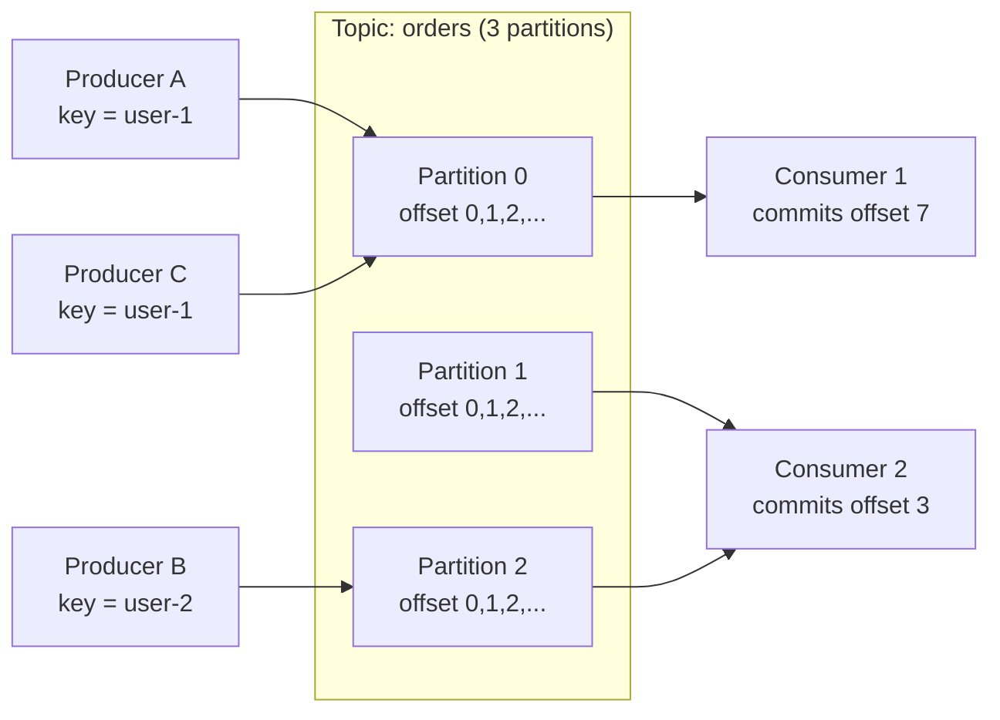

# Kafka

> **Interview answer (say this first).** Apache Kafka is a distributed, append-only log. Producers append records to a **topic**, and every topic is split into **partitions**. Each record gets a monotonically increasing **offset** inside its partition. Consumers read in order by tracking offsets, and a **consumer group** spreads the partitions across its members so work scales horizontally. Kafka keeps records until a **retention** or **compaction** policy removes them, so consumers can replay history. Ordering is guaranteed only *within a partition*, and durability comes from **replication** with an in-sync replica set (ISR).

## Why this exists

Start with the queue you already know. A producer puts a message on a queue, a consumer takes it off, and the queue deletes it. That works until you need a second consumer, a replay, or a slow reader.

Three problems appear:

```text
1. Two teams need the same events      -> a queue gives each message to one consumer
2. A bug corrupts a downstream table   -> the deleted messages cannot be replayed
3. A consumer is down for an hour      -> its messages may expire or pile up elsewhere
```

Kafka's answer is to stop thinking of messages as items to be handed out, and start thinking of them as **facts appended to a log**. The log is the product. Consumers do not remove records; they move a bookmark called an offset. Many consumers can read the same log independently, at different speeds, and re-read history whenever they need to.

That single change creates a new set of powers:

- **Replay.** Fix a bug, reset the offset, process the history again.
- **Fan-out.** Ten independent services read the same topic without copying data.
- **Backpressure as storage.** A slow consumer falls behind; the log holds the backlog.
- **Order per key.** All records for one user or one order land in one partition, in order.

The cost is equally clear. Kafka is a system to run, with brokers, partitions, replication, rebalancing, and retention to tune. It is not a good fit for a few low-volume tasks that a simple queue handles in an afternoon.

> **Note:**
>
> **The one-sentence purpose.** Kafka turns a stream of events into a durable, replayable, ordered log that many independent consumers can read at their own pace.

## Start from zero

Learn this vocabulary once and the rest of the page reads easily.

| Word | Plain meaning |
| --- | --- |
| **Record** | One entry in the log: an optional key, a value (bytes), a timestamp, and headers. |
| **Topic** | A named stream of records, such as `orders`. Producers write to it; consumers read from it. |
| **Partition** | An ordered, append-only slice of a topic. A topic has one or many partitions. |
| **Offset** | The position of a record inside one partition. Starts at 0 and never repeats. |
| **Segment** | One file on disk holding a range of offsets. Old segments are deleted or compacted. |
| **Broker** | One Kafka server. A cluster is several brokers. |
| **Cluster** | The set of brokers that together host your topics. |
| **Leader** | The broker that accepts reads and writes for a given partition. |
| **Follower** | A broker that copies the leader's records for redundancy. |
| **ISR** | In-Sync Replicas: the followers currently caught up with the leader. |
| **Replication factor** | How many copies of each partition exist, including the leader. Usually 3. |
| **Producer** | The client that appends records. |
| **Consumer** | The client that reads records by offset. |
| **Consumer group** | A set of consumers that share the partitions of a topic. Each partition goes to one member. |
| **Coordinator** | The broker that manages a group's membership and committed offsets. |
| **Rebalance** | Reassigning partitions when a consumer joins, leaves, or is thought to have died. |
| **Offset commit** | Recording "this group has processed up to offset N" for a partition. |
| **Lag** | How far behind a consumer group is: log end offset minus committed offset. |
| **Retention** | A time or size limit after which old records are deleted. |
| **Compaction** | Keeping only the latest record for each key, deleting older ones. |
| **Tombstone** | A record with a `null` value; in a compacted topic it deletes the key. |
| **`acks`** | How many replicas must confirm a write before the producer sees success. |
| **Batching** | Grouping records into one network request for throughput. |
| **Rebalance protocol** | The algorithm a group uses to agree on partition ownership. |

Two pairs cause most confusion:

- **A queue delivers; a log stores.** A queue is consumed away. A log is read and remembered.
- **Partition is the unit of scale and order.** More partitions means more parallelism **and** a weaker global order. Everything about Kafka follows from that trade.

## The core idea

Think of a bank's transaction journal, not a mailbox.

A mailbox is emptied. Once you take the letter, it is gone. A journal is written once and kept. Every entry has a line number. Anyone who wants the history starts at line 1 or at their bookmark, and reads forward. Two accountants can read the same journal without stealing pages from each other.

Kafka is a shared journal split into a few parallel volumes. The volume number is the **partition**, and the line number is the **offset**. Writers never edit old lines; they only append.



Read the diagram as three rules:

1. **Same key, same partition.** `user-1` always lands in Partition 0, so its events stay in order.
2. **One partition, one reader per group.** Consumer 1 and Consumer 2 do not overlap inside one group.
3. **Offsets are the contract.** A consumer restarts from its last committed offset, not from "wherever the server thinks it got to."

Now the comparison that interviewers expect you to draw:

| Property | Simple queue (task queue) | Kafka (distributed log) |
| --- | --- | --- |
| What the broker holds | A pending-message list | An ordered, durable log |
| After a consumer reads | Typically deleted | Kept until retention/compaction |
| Number of consumers | Competing: each message once | A group competes; other groups each get everything |
| Replay | Usually no | Yes, reset the offset |
| Ordering | Per queue, if any | Per partition |
| Fan-out to many apps | Copy to many queues | Many groups read one topic |
| Backlog | Bounded by policy | Stored on disk, bounded by retention |
| Best at | Task dispatch, work queues | Event streaming, logs, CDC, replayable pipelines |

Kafka beats a simple queue when **more than one consumer needs the same stream**, when **replay matters**, when **order per key matters**, or when **throughput is very high**. A simple queue usually wins when a job must be done by exactly one worker and the history has no value.

> **Tip:**
>
> **The mental model in one line.** A queue is a conveyor belt that disappears behind you; a Kafka partition is a tape you can rewind.

## How it works

Follow one record from producer to consumer.

1. **The producer builds a record.** It sets a topic, an optional key, a value, and optional headers. The key is what decides the partition.
2. **The partitioner chooses a partition.** With a key, it hashes the key and takes the remainder. Without a key, it spreads records for throughput (often in small sticky batches).
3. **The producer batches.** Records for the same partition are grouped into one request. Batching is the main reason Kafka is fast.
4. **The request goes to the partition leader.** Any broker can redirect the client to the leader. The leader appends the record and assigns the next offset.
5. **Followers replicate.** Each follower fetches from the leader, keeping its own copy in order. Followers that are caught up are in the ISR.
6. **`acks` decides when the producer hears success.** `acks=0` means fire and forget. `acks=1` means the leader wrote it. `acks=all` means every in-sync replica wrote it.
7. **Consumers subscribe.** A group subscription asks the coordinator to assign partitions to members.
8. **A rebalance hands out partitions.** With N partitions and M members, each member gets roughly N/M partitions. A partition belongs to exactly one member at a time.
9. **Each consumer fetches batches.** It reads from its committed offset and processes records in offset order.
10. **Offsets are committed.** The group records its progress, either automatically on a timer or manually after processing.
11. **Retention or compaction runs.** Time- and size-based retention deletes whole old segments. Compaction instead rewrites segments to keep only the latest value per key.
12. **Failure triggers recovery.** If a leader dies, a follower in the ISR is promoted. If a consumer dies, its partitions are redistributed in a new rebalance.

The two knobs that shape durability are `acks` and `min.insync.replicas`. `acks=all` with `min.insync.replicas=2` on a replication factor of 3 means a write succeeds only if the leader plus one follower have it.

## The syntax you will use

These are the real forms. Read them once now; the details come later.

**Create a topic with partitions and replication.**

```bash
kafka-topics.sh --bootstrap-server localhost:9092 \
  --create --topic orders \
  --partitions 6 --replication-factor 3
```

Six partitions allow up to six consumers in a group to work in parallel; three copies protect against broker loss.

**Describe a topic to see partition leaders and ISR.**

```bash
kafka-topics.sh --bootstrap-server localhost:9092 --describe --topic orders
```

The output lists each partition's leader, replicas, and which replicas are currently in sync.

**Produce from the command line.**

```bash
echo "user-1:created" | kafka-console-producer.sh \
  --bootstrap-server localhost:9092 --topic orders \
  --property parse.key=true --property key.separator=:
```

The key before `:` decides the partition, so all `user-1` records stay together.

**A producer in Python with explicit durability.**

```python
from confluent_kafka import Producer

producer = Producer({
    "bootstrap.servers": "localhost:9092",
    "acks": "all",                    # wait for all in-sync replicas
    "enable.idempotence": True,       # avoid duplicates from retries
})

def delivered(err, msg):
    if err is not None:
        print("delivery failed:", err)
    else:
        print("wrote to", msg.topic(), msg.partition(), msg.offset())

producer.produce("orders", key="user-1", value="created", callback=delivered)
producer.flush()                      # block until the send queue drains
```

`acks=all` plus idempotence is the safe default for data you cannot lose.

**A consumer in a group with manual commits.**

```python
from confluent_kafka import Consumer

consumer = Consumer({
    "bootstrap.servers": "localhost:9092",
    "group.id": "billing",
    "auto.offset.reset": "earliest",   # first run: start at the beginning
    "enable.auto.commit": False,       # commit only after real processing
})
consumer.subscribe(["orders"])

while True:
    msg = consumer.poll(1.0)
    if msg is None:
        continue
    process(msg.value())               # do the work first
    consumer.commit(asynchronous=False)  # then record progress
```

Committing after processing gives at-least-once delivery: a crash between the two steps replays the record.

**The classic Python client has a similar shape.**

```python
from kafka import KafkaProducer, KafkaConsumer

producer = KafkaProducer(bootstrap_servers="localhost:9092")
producer.send("orders", key=b"user-1", value=b"created").get(timeout=10)

consumer = KafkaConsumer(
    "orders",
    bootstrap_servers="localhost:9092",
    group_id="billing",
    auto_offset_reset="earliest",
    enable_auto_commit=False,
)
for record in consumer:
    process(record.value)
    consumer.commit()
```

**Turn a topic into a compacted table of latest values.**

```bash
kafka-configs.sh --bootstrap-server localhost:9092 \
  --alter --entity-type topics --entity-name user-profiles \
  --add-config cleanup.policy=compact,min.cleanable.dirty.ratio=0.1
```

Compaction keeps the newest record per key, which is how a topic doubles as a changelog.

**Inspect group progress and lag.**

```bash
kafka-consumer-groups.sh --bootstrap-server localhost:9092 \
  --describe --group billing
```

For each partition it shows current offset, log end offset, and the lag between them.

**Reset an offset to replay history.**

```bash
kafka-consumer-groups.sh --bootstrap-server localhost:9092 \
  --group billing --topic orders \
  --reset-offsets --to-earliest --execute
```

The group must be inactive. Replay is powerful and easy to do by accident, so treat it as a production change.

## Examples: simple to real

**Example 1 — an append-only partition in plain Python.** This is the whole data model in twenty lines.

```python
class Partition:
    """A Kafka-like partition: append-only records with offsets."""

    def __init__(self) -> None:
        self._records: list[str] = []

    def append(self, value: str) -> int:
        offset = len(self._records)
        self._records.append(value)
        return offset

    def read(self, offset: int, max_records: int = 10) -> list[tuple[int, str]]:
        window = self._records[offset:offset + max_records]
        return list(enumerate(window, start=offset))

p = Partition()
print(p.append("order-1"))   # 0
print(p.append("order-2"))   # 1
print(p.append("order-3"))   # 2
print(p.read(0))             # [(0, 'order-1'), (1, 'order-2'), (2, 'order-3')]
print(p.read(3))             # []  -> consumer is caught up
```

Offsets never change and appends never overwrite, which is why replay is safe.

**Example 2 — key to partition.** The same key must always map to the same partition, or per-key order breaks.

```python
import hashlib

def partition_for(key: str, num_partitions: int) -> int:
    digest = hashlib.sha256(key.encode()).digest()
    return int.from_bytes(digest[:4], "big") % num_partitions

for key in ["user-1", "user-2", "user-1", "user-3", "user-2"]:
    print(key, "-> partition", partition_for(key, 4))
# user-1 -> partition 0
# user-2 -> partition 3
# user-1 -> partition 0   (same key, same partition)
# user-3 -> partition 0
# user-2 -> partition 3
```

Change the partition count and keys move, so decide partitions up front where you can.

**Example 3 — group assignment.** A group splits partitions across members without overlapping.

```python
def assign(partitions: list[int], members: list[str]) -> dict[str, list[int]]:
    """Round-robin assignment: each partition goes to exactly one member."""
    result: dict[str, list[int]] = {m: [] for m in members}
    for index, partition in enumerate(partitions):
        result[members[index % len(members)]].append(partition)
    return result

print(assign([0, 1, 2, 3, 4, 5], ["alice", "bob", "carol"]))
# {'alice': [0, 3], 'bob': [1, 4], 'carol': [2, 5]}
```

If a fourth member joins, every partition may move. That movement is a rebalance, and it pauses consumption.

**Example 4 — commit after processing gives at-least-once.** The ordering of the two steps decides what a crash costs.

```python
def process_batch(batch: list[str], crash_after: int | None = None) -> tuple[int, list[str]]:
    """Process records, optionally crashing before the offset commit."""
    processed: list[str] = []
    for index, record in enumerate(batch):
        if crash_after is not None and index == crash_after:
            return len(processed), processed        # crash: no commit
        processed.append(record.upper())
    return len(processed), processed

batch = ["a", "b", "c"]
print(process_batch(batch, crash_after=2))   # (2, ['A', 'B']) -> replay from 0
print(process_batch(batch))                  # (3, ['A', 'B', 'C'])
```

A crash before the commit replays records, so processing must be idempotent. Commit before processing instead and you can lose records. There is no free option.

**Example 5 — compaction versus retention.** Retention deletes old records; compaction keeps the newest value per key.

```python
def compact(records: list[tuple[str, str | None]]) -> dict[str, str | None]:
    """Keep only the latest record per key; None means tombstone (delete)."""
    latest: dict[str, str | None] = {}
    for key, value in records:
        latest[key] = value
    return latest

events = [("u1", "A"), ("u2", "B"), ("u1", "C"), ("u1", None), ("u3", "D")]
state = compact(events)
print(state)
# {'u1': None, 'u2': 'B', 'u3': 'D'}  -> u1 is deleted, u2 and u3 survive
```

A compacted topic is a changelog: replaying it rebuilds current state, not every historical event.

**Example 6 — a real pipeline, end to end.** One topic, two groups, independent positions.

```text
Producer -> topic "orders" (6 partitions, replication 3)
             |
             +--> group "billing"   -> charges cards, commits offsets
             +--> group "search"    -> updates the search index
             +--> group "analytics" -> writes to the warehouse

Each group reads every record. Their offsets are independent.
Adding the "analytics" group changed nothing for the other two.
```

This is the fan-out that a single queue cannot provide, and it is the usual reason a team adopts Kafka.

## In production

- **Partition count is a one-way door.** You can add partitions, but keys remap and per-key order is not preserved across the change. Size for peak parallelism, not for today.
- **Order is per partition, never per topic.** If two events for the same entity must stay ordered, they must share a key and therefore a partition.
- **More partitions cost more.** Each partition has files, leader elections, and replication work. Thousands of tiny partitions hurt latency and recovery time.
- **`acks=all` is the safe write; `acks=1` is faster and can lose data.** With `acks=1`, a leader can accept a write and die before followers copy it.
- **`min.insync.replicas` is what makes `acks=all` meaningful.** Set it to at least 2 so a single surviving replica cannot accept writes alone.
- **Consumers must be idempotent.** Whatever the delivery mode, retries and rebalances can replay records. Design for at-least-once first, then add deduplication.
- **A slow consumer does not slow the producer; it builds lag.** Watch lag per partition, not just the group total, because one stuck partition hides behind healthy ones.
- **Rebalancing pauses consumption, but not always the whole group.** With the **eager** protocol, every member revokes all its partitions and the group stops the world during the rebalance. **Cooperative/incremental** rebalancing revokes only the partitions that change owner, so unaffected members keep consuming. Static membership additionally avoids a rebalance when a member restarts briefly.
- **Do not run one partition per consumer and call it scaling.** Parallelism is capped by partition count. Ten idle consumers on a three-partition topic do no work.
- **Retention is a storage decision and a correctness decision.** Too short and replay is impossible; too long and disks fill. Compaction is not a substitute for retention on event topics.
- **A topic is not a database.** Querying by anything other than offset means writing a consumer and a read model. Use a database for lookups.
- **The agentic-AI use case fits well.** Agent runs, tool calls, and model completions are events; Kafka gives you replay for evaluation, fan-out to scoring and memory services, and per-run ordering by keying on the run ID.

## Interview questions

### 1. What is Kafka, in one sentence?

**Answer.** Kafka is a distributed, partitioned, replicated commit log: producers append records to topics, each record lands in a partition at a monotonic offset, and consumer groups read those partitions in order by tracking committed offsets. It is a log, not a queue.

**Follow-up: "Why does that distinction matter?"** Because a log is replayable and shareable. A queue hands a message to one consumer and forgets it; a log keeps records and lets many independent groups read them at their own positions.

**Trap.** Calling Kafka "a message queue." It can act like one for competing consumers, but its defining property is durable, ordered, replayable storage per partition.

### 2. How does Kafka guarantee ordering?

**Answer.** It only guarantees ordering *within a partition*. Records appended to one partition are read in append order by offset. Across partitions there is no ordering, because different partitions are written and read independently. To order related events, give them the same key so they land in the same partition.

**Follow-up: "How would you get global ordering?"** In practice you do not. You either use a single partition, which caps throughput and parallelism, or you make the consumer handle reordering with sequence numbers and watermarks. The usual correct answer is to design so you never need global order.

**Trap.** Saying "Kafka preserves order." It preserves per-partition order only, and adding partitions to a keyed topic can break even that for existing keys.

### 3. What do `acks=0`, `acks=1`, and `acks=all` mean?

**Answer.** `acks=0`: the producer does not wait for any confirmation; fastest, and records can be lost silently. `acks=1`: the leader writes and confirms, but a leader failure before replication loses the record. `acks=all`: the leader waits for all in-sync replicas, which is the durable choice when combined with `min.insync.replicas`.

**Follow-up: "What does `min.insync.replicas` add?"** It sets the minimum ISR size required for a write to succeed. With replication factor 3 and `min.insync.replicas=2`, losing two replicas makes writes fail rather than silently accept un-replicated data.

**Trap.** Saying `acks=all` means "written to every replica that will ever exist." It means every replica *currently in the ISR*. A lagging follower outside the ISR is not waited for.

### 4. What is a consumer group and what happens during a rebalance?

**Answer.** A consumer group is a set of consumers that jointly consume a topic. Each partition is assigned to exactly one member, so the group processes the whole topic with no duplication between members. A rebalance reassigns partitions when a member joins, leaves, or is considered dead; during the rebalance, consumption pauses for that group.

**Follow-up: "What causes a consumer to be considered dead?"** Missing heartbeats within `session.timeout.ms`, or failing to poll within `max.poll.interval.ms`. The second is common when processing is slow, and it causes repeated rebalances.

**Trap.** Thinking consumers in one group all receive all messages. That is pub/sub fan-out, which in Kafka comes from *multiple groups*, not from multiple members of one group.

### 5. Retention versus compaction — what is the difference?

**Answer.** Retention deletes whole old segments after a time or size limit, so the topic keeps a moving window of history. Compaction rewrites segments to keep only the latest record for each key, so the topic becomes a changelog of current state. A topic can use both.

**Follow-up: "When would you choose compaction?"** When the topic represents state rather than a stream of events — for example, a `user-profiles` topic where consumers only care about the latest value per user, or Kafka Streams state changelogs.

**Trap.** Assuming compaction deletes records promptly. It runs periodically and only after enough dirty data accumulates, so old values can remain readable for a while.

### 6. How does Kafka stay durable if a broker dies?

**Answer.** Each partition has a leader and followers. Followers continuously fetch and copy the leader's log. If the leader fails, the controller promotes a follower that is in the ISR. With `acks=all` and an adequate `min.insync.replicas`, acknowledged records are on more than one broker.

**Follow-up: "What if a follower falls behind?"** It leaves the ISR. It keeps catching up but is no longer counted for `acks=all`. If enough replicas leave the ISR to drop below `min.insync.replicas`, writes fail to protect durability.

**Trap.** Confusing replication factor with durability. Three replicas on one rack, or `acks=1`, still loses data in the right failure. Durability is replication *plus* acknowledgement policy *plus* placement.

### 7. When would you use Kafka instead of a simple queue?

**Answer.** When more than one consumer needs the same stream, when replay or reprocessing matters, when you need high throughput with batched writes, or when you need per-key ordering at scale. A simple queue is better when each task must be done exactly once by one worker and history has no value.

**Follow-up: "What do you give up?"** Operational simplicity and latency predictability. Kafka has partitions to size, rebalances to tune, retention to manage, and a longer tail latency than a small queue under load.

**Trap.** Choosing Kafka for a low-volume task queue because it is "more scalable." You inherit real operational cost for no benefit.

### 8. How do you prevent duplicate processing?

**Answer.** You cannot make Kafka itself deliver exactly once across your side effects. The reliable pattern is at-least-once delivery plus an idempotent consumer: deduplicate on a stable business key or event ID, and make the write safe to repeat, often in the same transaction as the offset commit or via an upsert.

**Follow-up: "What about Kafka transactions?"** Producer transactions make writes to multiple topics and offset commits atomic *inside Kafka*. They do not make your database write atomic with Kafka unless the database participates, which is the transactional outbox pattern.

**Trap.** Promising end-to-end exactly-once by checking a Kafka setting. Exactly-once semantics inside Kafka plus a non-idempotent external effect is still at-least-once in the real world.

## Remember this

- **Kafka is a partitioned, replicated, append-only log**, not a queue. Offsets are bookmarks, not deletions.
- **Order is per partition only.** Key related events together and accept the partition count as a one-way door.
- **Durability is `acks=all` plus `min.insync.replicas` plus real replication.** Any one alone is not enough.
- **Consumer groups split partitions; multiple groups give fan-out.** One partition is read by one member per group.
- **At-least-once plus idempotent consumers is the practical guarantee.** Design for replay from day one.
