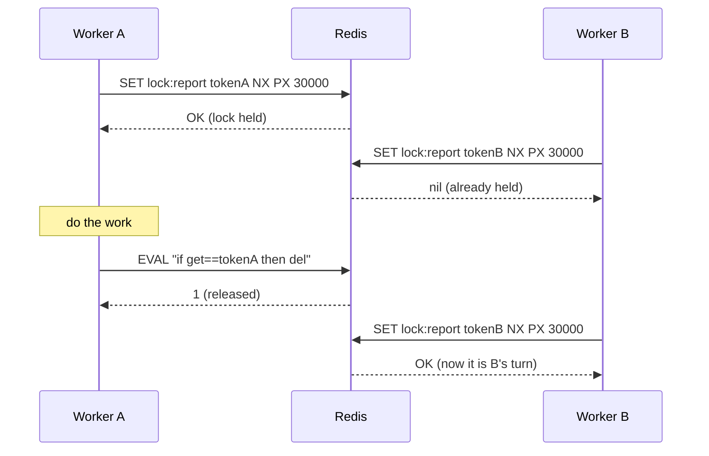

# Redis for Distributed Systems

> **Interview answer (say this first).** Redis is an in-memory data structure server. It is much more than a cache: it gives you atomic counters, keys with TTLs, lists, streams, sorted sets, hashes, pub/sub, and server-side Lua scripts. Because each command runs atomically and fast, distributed systems use Redis for shared counters, locks, rate limits, idempotency keys, and lightweight queues. But it is memory-first, it can evict keys under pressure, and its persistence is best-effort compared with a database — so it is a coordination layer, **not a system of record**.

## Why this exists

Distributed systems constantly need a small piece of shared state, shared by every instance, updated safely.

Consider four ordinary questions:

```text
1. How many API calls has this user made this minute?      -> a per-process counter is wrong
2. Who owns the "send daily report" job right now?         -> every worker thinks it does
3. Have we already processed request id req-9f2?           -> retries duplicate the charge
4. Which agent tasks are waiting, in priority order?       -> need a shared, ordered structure
```

You could answer each with a database, but a write-per-increment is slow and adds load to your durable store. You could answer each in process memory, but then two instances disagree, and a restart forgets. You need one shared point that is fast and gives atomic operations.

Redis is that point, and odds are it is already running in your stack for caching. That is both the appeal and the trap: it is easy to reach for, and easy to misuse as a database.

> **Note:**
>
> **The one-sentence purpose.** Redis is a shared, in-memory, single-threaded command server that makes small pieces of distributed state cheap and atomic — counters, locks, limits, and queues — while expecting you to keep the durable truth elsewhere.

## Start from zero

Redis has a small vocabulary but it is easy to blur two ideas: a *key* and a *data type*. A key is a name; the type is the structure stored under it.

| Word | Plain meaning |
| --- | --- |
| **Key** | The name you look up, such as `ratelimit:user-42`. Keys are binary-safe strings. |
| **Value** | The thing stored under a key. Its kind is set by the command that creates it. |
| **Data type** | String, list, set, sorted set, hash, stream, or bitmap. Different types get different commands. |
| **TTL** | Time to live: seconds (or milliseconds) until a key is deleted automatically. |
| **Expiry** | The event of a key disappearing because its TTL ended. |
| **Eviction** | Deleting keys to free memory when `maxmemory` is reached, per the eviction policy. |
| **`INCR`** | Atomically adds 1 to an integer value and returns the new value. |
| **`SET NX`** | Set a key only if it does not already exist. The basis of locks and idempotency. |
| **`EXPIRE` / `PEXPIRE`** | Attach a lifetime to a key. `PEXPIRE` uses milliseconds (`PX` is the `SET` option for the same). |
| **Atomic** | The whole command finishes before another client's command starts. No partial result. |
| **Single-threaded** | Redis runs commands on one main thread, one at a time. Slow commands block everyone. |
| **Pipeline** | Sending many commands without waiting for each reply, then reading all replies. |
| **Transaction (`MULTI`/`EXEC`)** | Queuing commands to run as one block, with `WATCH` for optimistic checking. |
| **Lua script** | Server-side code run atomically, for check-then-act logic that must not interleave. |
| **List** | An ordered sequence; `LPUSH`/`RPOP` make a simple queue. |
| **Sorted set** | A set where each member has a score, kept in score order. Great for leaderboards and priorities. |
| **Stream** | An append-only log with consumer groups, acks, and pending entries. |
| **Pub/sub** | Fire-and-forget publish and subscribe channels. No storage, no delivery guarantee. |
| **RDB** | Point-in-time snapshot persistence to disk. |
| **AOF** | Append-only file: every write command logged and replayed on restart. |
| **Replication** | Copies of a Redis primary, used for reads and failover. |
| **Cluster** | Horizontal sharding across nodes, with 16384 hash slots split between them. |
| **Hash tag** | `{...}` in a key that forces related keys into the same cluster slot. |
| **Idempotency key** | A client-supplied unique ID used to make a retried operation safe. |
| **Liveness vs safety** | A lock must eventually release (liveness) but never be held twice (safety). |

Two distinctions to keep straight:

- **Atomic is not transactional across many keys unless you make it so.** A single command is atomic. Multiple commands need `MULTI`/`EXEC`, a Lua script, or a design that tolerates partial work.
- **Fast is not durable.** Redis writes live in memory first. Persistence reduces loss; it does not eliminate it.

## The core idea

Think of a whiteboard in a shared office.

Everyone can read it instantly and write on it instantly. There is a strict rule: only one person writes at a time, so two people cannot corrupt the same line. Sticky notes can be given a self-destruct time. When the board fills up, the office manager erases the notes nobody has touched recently.

That whiteboard is wonderful for coordination — who is on duty, how many tickets are open, who holds the key. It is a terrible place for the company's official accounting ledger, because notes expire, the board can be wiped, and the board is small.

Redis is that board. The single writer is the **single-threaded command loop**. The self-destruct timers are **TTLs**. The manager erasing old notes is **eviction**. The ledger you keep elsewhere is your **system of record**.



The whole pattern is "check and act in one atomic step." `SET NX` is atomic, so exactly one client wins. Releasing with a Lua compare-and-delete is atomic, so you never delete someone else's lock.

Now the comparison that keeps you out of trouble:

| Question | Redis | A system of record (Postgres, object store) |
| --- | --- | --- |
| Where data lives | Memory first | Disk first |
| Speed | Microseconds | Milliseconds |
| Durability | Best-effort, tunable, can lose recent writes | Designed to survive crashes |
| Can lose keys? | Yes, via eviction or failover | No, by design |
| Transactions | Single-key atomic; multi-key with Lua/MULTI | Full ACID across rows and tables |
| Good for | Counters, locks, limits, queues, caches | Accounts, orders, audit, anything you cannot recompute |
| Query ability | By key and by structure; no joins | Rich queries, indexes, constraints |

The one-line rule: **if losing the value would be a business incident, it does not belong in Redis.**

## How it works

Walk through the mechanics, because most Redis bugs come from misunderstanding one of them.

1. **A client connects and sends a command.** `INCR ratelimit:u1`, `SET lock:x token NX PX 30000`, `LPUSH tasks t1`.
2. **The server parses and runs the command on the main thread.** Commands are serialized. There is no lock needed inside a single command.
3. **The reply goes back.** One command, one reply. This is the round-trip cost.
4. **The key gets a value and a type.** The type comes from the command, not from a schema.
5. **Expiry is checked lazily and actively.** Keys are removed when accessed past their TTL, and a background job samples and removes expired keys.
6. **Memory pressure triggers eviction.** When used memory crosses `maxmemory`, Redis applies the eviction policy, for example `allkeys-lru` or `volatile-ttl`.
7. **Persistence happens on the side.** RDB snapshots at intervals, and/or AOF with an `fsync` policy such as `everysec` or `always`.
8. **Replication copies writes to replicas.** A replica can take over on failover, but failover can drop recent writes that had not replicated.
9. **A pipeline batches many commands.** The client sends all of them, then reads all replies, cutting round trips.
10. **A Lua script runs atomically.** The whole script executes without other commands interleaving, so check-then-act is safe.
11. **Streams add durable, ordered consumption.** `XADD` appends, `XREADGROUP` delivers, `XACK` confirms, `XPENDING` shows unconfirmed work.
12. **Pub/sub delivers to whoever is listening now.** If no one is subscribed, the message is gone forever.

The last two points are the fork in the road: **pub/sub is a doorbell, streams are a mailbox.** Use streams when the message must not be lost.

## The syntax you will use

These are the real forms, first with `redis-cli`, then with `redis-py`.

**Set a value with an expiry and only if absent.**

```bash
SET lock:report "token-abc" NX PX 30000
```

`NX` makes it a lock acquisition; `PX 30000` means it self-releases after 30 seconds even if the holder dies.

**Atomic counters.**

```bash
INCR requests:user-42
EXPIRE requests:user-42 60
```

`INCR` creates the key at 1 if missing and never loses an update under concurrency.

**Check remaining TTL and delete explicitly.**

```bash
TTL lock:report
DEL lock:report
```

A negative TTL means the key has no expiry (`-1`) or does not exist (`-2`).

**Sorted sets for ranking and priority.**

```bash
ZADD agents:score 10 alice 30 bob
ZINCRBY agents:score 5 alice
ZREVRANGE agents:score 0 9 WITHSCORES
```

Members are unique; the score orders them. Ties are ordered by member name, not insertion time.

**Lists as a simple queue.**

```bash
LPUSH tasks "job-1"
BRPOP tasks 5
```

`BRPOP` blocks up to 5 seconds waiting for an item, which avoids busy polling.

**Streams with a consumer group.**

```bash
XADD events * type tool_call run r1
XGROUP CREATE events workers $ MKSTREAM
XREADGROUP GROUP workers w1 COUNT 10 STREAMS events >
XACK events workers 1700000000000-0
```

`>` means "never delivered to this group"; `XACK` confirms processing and clears the pending entry.

**Pub/sub.**

```bash
PUBLISH agent-updates '{"run":"r1","status":"done"}'
SUBSCRIBE agent-updates
```

Any subscriber connected at publish time gets it. Others miss it.

**A safe lock release in Lua.** This prevents deleting a lock that expired and was re-acquired by someone else.

```lua
if redis.call('get', KEYS[1]) == ARGV[1] then
  return redis.call('del', KEYS[1])
else
  return 0
end
```

Run it with `EVAL script 1 lock:report token-abc`.

**A pipeline and a transaction in Python.**

```python
import redis

r = redis.Redis(host="localhost", port=6379, decode_responses=True)

pipe = r.pipeline(transaction=True)   # MULTI/EXEC: queued as one block, no rollback
pipe.incr("requests:user-42")
pipe.expire("requests:user-42", 60)
results = pipe.execute()              # [1, True]
```

A pipeline without `transaction=True` still cuts round trips but allows other clients between commands.

**The main `redis-py` calls.**

```python
r.set("lock:report", "token-abc", nx=True, px=30000)   # True or None
r.incr("requests:user-42")                             # atomic counter
r.expire("requests:user-42", 60)
r.zadd("agents:score", {"alice": 10, "bob": 30})       # sorted set
r.zincrby("agents:score", 5, "alice")
r.xadd("events", {"type": "tool_call", "run": "r1"})   # stream
r.eval(RELEASE_SCRIPT, 1, "lock:report", "token-abc")  # atomic Lua
```

Those six lines cover most of what a distributed system uses Redis for.

## Examples: simple to real

**Example 1 — an atomic counter with a TTL.** No read-modify-write in application code, so concurrent workers cannot lose an update.

```python
import fakeredis

r = fakeredis.FakeRedis(decode_responses=True)

r.set("jobs:done", 0)
print(r.incr("jobs:done"))    # 1
print(r.incr("jobs:done"))    # 2
r.expire("jobs:done", 60)     # start a 60-second window
print(r.get("jobs:done"))     # "2"
```

`incr` is one command, so it is atomic even with thousands of concurrent clients.

**Example 2 — a lock that releases itself, and a safe release.** The token proves ownership before deleting.

```python
import fakeredis

r = fakeredis.FakeRedis(decode_responses=True)

RELEASE = """
if redis.call('get', KEYS[1]) == ARGV[1] then
  return redis.call('del', KEYS[1])
else
  return 0
end
"""

token = "token-abc"
print(r.set("lock:report", token, nx=True, px=30000))   # True
print(r.set("lock:report", "token-xyz", nx=True, px=30000))  # None
print(r.eval(RELEASE, 1, "lock:report", token))          # 1
print(r.eval(RELEASE, 1, "lock:report", token))          # 0
```

`px=30000` means a crashed holder cannot block forever. The token means a slow holder cannot delete the next holder's lock.

**Example 3 — a fixed-window rate limiter.** One counter per user per window, with an expiry set only on the first hit.

```python
import fakeredis

r = fakeredis.FakeRedis(decode_responses=True)

def allow(user: str, limit: int = 3, window_seconds: int = 60) -> tuple[bool, int]:
    key = f"ratelimit:{user}"
    count = r.incr(key)
    if count == 1:
        r.expire(key, window_seconds)
    return count <= limit, count

for _ in range(4):
    print(allow("user-42"))
# (True, 1) (True, 2) (True, 3) (False, 4)
```

Fixed windows can allow a burst at a boundary; a sliding window uses a sorted set of timestamps instead.

**Example 4 — an idempotency key.** The first request claims the key; retries see it already exists and return the stored result.

```python
import fakeredis

r = fakeredis.FakeRedis(decode_responses=True)

def start_request(request_id: str, ttl_seconds: int = 86400) -> bool:
    """Return True only for the first caller with this request id."""
    claimed = r.set(f"idem:{request_id}", "in-progress", nx=True, ex=ttl_seconds)
    return claimed is True

print(start_request("req-9f2"))   # True  -> do the work
print(start_request("req-9f2"))   # False -> return the stored result instead
```

This is the standard way to make an at-least-once delivery safe for a non-idempotent action such as charging a card.

**Example 5 — a priority queue with sorted sets.** Score is priority; low score can run first.

```python
import fakeredis

r = fakeredis.FakeRedis(decode_responses=True)
r.zadd("agent:tasks", {"task-low": 10, "task-urgent": 1, "task-mid": 5})

# lowest score first = highest priority
print(r.zrange("agent:tasks", 0, 0, withscores=True))   # [('task-urgent', 1.0)]

r.zincrby("agent:tasks", 100, "task-urgent")            # defer the urgent one
print(r.zrange("agent:tasks", 0, 0))                     # ['task-mid']
```

Use a plain list when order is only first-in-first-out; use a sorted set when priority changes.

**Example 6 — a stream with a consumer group.** Unlike pub/sub, unacknowledged work stays pending and can be retried.

```python
import fakeredis

r = fakeredis.FakeRedis(decode_responses=True)
r.xadd("events", {"type": "tool_call", "run": "r1"})
r.xadd("events", {"type": "tool_call", "run": "r2"})
r.xgroup_create("events", "workers", id="0", mkstream=True)

batch = r.xreadgroup("workers", "w1", {"events": ">"}, count=2)
entries = batch[0][1]
print([e[1]["run"] for e in entries])        # ['r1', 'r2']

entry_id = entries[0][0]
r.xack("events", "workers", entry_id)        # confirm the first one
print(r.xpending("events", "workers")["pending"])   # 1 still unconfirmed
```

If worker `w1` dies, another consumer can claim its pending entries with `XCLAIM` or `XAUTOCLAIM`.

## In production

- **Every ephemeral key needs a TTL.** A lock or rate-limit key without expiry is a permanent leak that eventually causes an outage.
- **Eviction can silently delete coordination state.** Under `allkeys-lru`, a memory spike can evict your lock or idempotency keys. Run coordination data on a separate Redis instance or shard configured with `noeviction`, or use a `volatile-*` policy and give every coordination key a TTL. A dedicated logical database does not help: logical databases share one server-wide `maxmemory` and `maxmemory-policy`, so it offers no protection from eviction. Never rely on a cache instance for locks.
- **Persistence is tunable, not guaranteed.** RDB snapshots lose everything since the last snapshot. AOF `everysec` can lose about a second of writes. `appendfsync always` is slow. Choose based on how much loss you can tolerate.
- **A lock is not a fence.** `SET NX PX` gives mutual exclusion for a bounded time, but a paused holder can still act after its lock expires. For storage writes, pass a monotonically increasing **fencing token** and reject stale ones.
- **Keep locks short and self-expiring.** If the work can outlast the TTL, either extend the lock with a watchdog or redesign so the critical section is short.
- **Multi-key commands need care in Cluster.** Operations touching several keys fail unless the keys share a hash slot; use hash tags like `{user-42}:balance` to colocate them.
- **Lua is atomic and blocking.** A long script stops the single thread for every client. Keep scripts small, and never `KEYS` inside them.
- **`KEYS` is a production hazard.** It scans the whole keyspace and blocks. Use `SCAN` with a cursor instead.
- **Pub/sub is fire-and-forget.** No storage, no ack, no replay. If the message matters, use Streams or a real broker.
- **Failover can lose recent writes.** If the primary dies before replicating, the promoted replica can be slightly behind. That is why Redis is not the ledger.
- **Watch hot keys.** One extremely popular key makes one thread and one node do all the work. Shard the key (for example `counter:{shard}`) or cache locally.
- **Agentic-AI uses fit naturally.** Rate-limit model calls per tenant, hold a lock so only one worker runs a given agent run, store idempotency keys for tool side effects, keep short-term memory under a TTL, and use streams for a lightweight task bus.

## Interview questions

### 1. Why is Redis described as single-threaded, and why does that matter?

**Answer.** Redis executes commands on one main thread, so commands are naturally serialized and each one is atomic. It matters two ways: you get simple atomic primitives without locks, and one slow command blocks every other client. That is why `KEYS`, large `SMEMBERS`, or a heavy Lua script can stall the whole server.

**Follow-up: "If it is single-threaded, how is it so fast?"** The work per command is tiny and memory-resident, and it uses an event loop with non-blocking I/O. Modern versions also use background threads for some tasks, but command execution logic is still one thread.

**Trap.** Thinking single-threaded means single-core for everything. Redis does use other threads for I/O, snapshots, and expiry housekeeping; the command path is what is serialized.

### 2. How do you build a distributed lock with Redis?

**Answer.** Acquire with `SET key token NX PX ttl`. The `NX` makes acquisition atomic, and the TTL guarantees release if the holder dies. Release with a Lua script that deletes the key only if the stored token matches your token, so you never delete someone else's lock.

**Follow-up: "What is the weakness?"** It is not a fencing mechanism. A process can be paused past the TTL, then keep writing after losing the lock. For safety-critical writes, use a fencing token that the storage layer validates.

**Trap.** Using `SETNX` plus a separate `EXPIRE`. Those are two round trips; a crash between them leaves a lock with no TTL. `SET ... NX PX` is one atomic command.

### 3. Where should you not use Redis?

**Answer.** Anywhere the value must survive failure exactly. Redis can lose recent writes on crash or failover, and eviction can remove keys under memory pressure. Do not use it as the only copy of orders, payments, audit logs, or any state you cannot recompute.

**Follow-up: "Can persistence fix that?"** It reduces loss but does not make Redis durable the way an ACID database is. `appendfsync always` narrows the window at a large latency cost, and failover can still lose un-replicated writes.

**Trap.** Saying "Redis is persistent now, so we store everything there." Persistence and durability are different claims.

### 4. How do you implement rate limiting in Redis?

**Answer.** A common approach is a fixed window: `INCR` a per-user key and set `EXPIRE` on the first increment of the window; allow while the count is under the limit. A sliding window uses a sorted set of request timestamps, removing entries older than the window and counting the rest. A token bucket can be implemented atomically with a Lua script.

**Follow-up: "What is wrong with a fixed window?"** It allows up to twice the limit around a window boundary, because the tail of one window and the head of the next both pass. Sliding windows or token buckets smooth this.

**Trap.** Doing `GET` then `SET` in application code for the counter. Two clients can interleave and both allow a request. Use `INCR`, which is atomic.

### 5. How do you make an at-least-once operation idempotent with Redis?

**Answer.** Insert a unique key derived from the request, using `SET key value NX EX ttl`. If the set succeeds, you are the first and should do the work. If it fails, the operation already started or finished, so return the stored result or status instead of repeating the side effect.

**Follow-up: "What if the process crashes after claiming but before finishing?"** The key can be left in an "in-progress" state. Use a short TTL, record a distinct "done" state with the result, and let retries either resume or wait. Never treat the claim alone as proof of completion.

**Trap.** Choosing a key that is not stable across retries, such as a fresh UUID generated per attempt. Then every retry looks new and nothing is deduplicated.

### 6. Pub/sub versus Streams — when do you use each?

**Answer.** Pub/sub is fire-and-forget fan-out to currently connected subscribers: fast, no storage, no replay, no ack. Streams are an append-only log with consumer groups, acknowledgements, pending entries, and replay from an ID. Use pub/sub for cache invalidation and live notifications; use Streams when a message must be processed reliably.

**Follow-up: "So is Redis Streams a Kafka replacement?"** For modest throughput and simple needs, often yes. Kafka scales higher, partitions more flexibly, and keeps data far longer. Streams are convenient when Redis is already there.

**Trap.** Using pub/sub for work that must not be lost. If the worker is restarting when the message is published, the message simply disappears.

### 7. What do pipelines and transactions give you?

**Answer.** A pipeline sends many commands without waiting for each reply, which removes network round trips and raises throughput. A transaction (`MULTI`/`EXEC`) queues commands to run as one block so other clients cannot interleave; `WATCH` adds optimistic concurrency. A Lua script gives you atomic read-check-write logic in one step.

**Follow-up: "Does MULTI give rollback?"** No. Redis executes the queued commands; if one fails at runtime, the others still run. There is no rollback like SQL. Design commands to be safe and use Lua when you need conditional logic.

**Trap.** Assuming pipelining makes a batch atomic. It does not; other clients' commands can run between the pipelined commands.

### 8. Why is Redis not a system of record?

**Answer.** Because its design optimizes for speed and memory, not durable, lossless, queryable storage. It can evict keys, lose the last seconds of writes on crash, serve a slightly stale replica, and offers no multi-row ACID transactions or rich queries. It is an excellent derived, recomputable, or coordination store, and a poor source of truth.

**Follow-up: "How would you use Redis alongside a database?"** Treat the database as the truth. Use Redis to cache reads, hold counters and locks, rate limit, and buffer work. Every Redis value should be rebuildable from the database or safely disposable.

**Trap.** Adding Redis and calling it a cache layer while also making it the only home for unique state. That is how a cache outage becomes permanent data loss.

## Remember this

- **Redis is a shared, in-memory, atomic data-structure server — not a database.** Keep the truth on disk.
- **`SET NX PX` is the lock; a token plus a Lua compare-and-delete is the release.** Locks need fencing for safety-critical writes.
- **`INCR` and `SET NX` make counters and idempotency safe.** Never do read-modify-write in application code.
- **TTL everything ephemeral, and keep coordination keys off an evicting cache instance.**
- **Pub/sub is a doorbell; Streams are a mailbox.** Choose based on whether a message may be lost.
