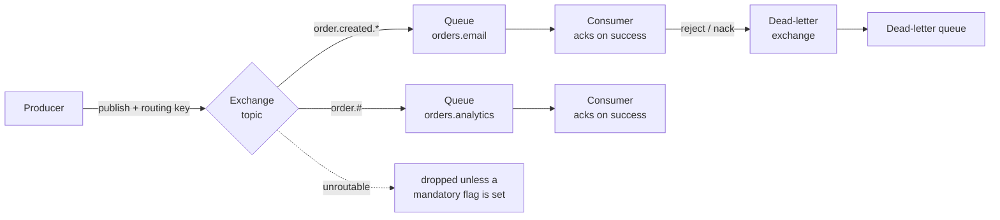
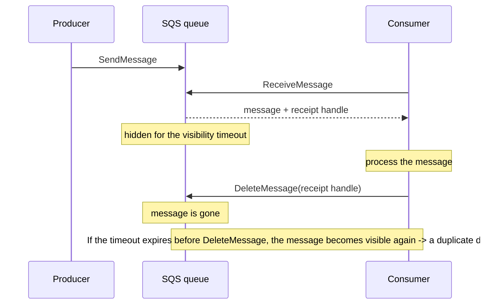

# RabbitMQ and SQS

> **Interview answer (say this first).** RabbitMQ and Amazon SQS both move messages from producers to consumers, but they sit at opposite ends of the build-versus-buy spectrum. **RabbitMQ** is a broker you run: producers publish to an **exchange**, the exchange routes to **queues** by rules, and the broker pushes to consumers that must **acknowledge** each message. **SQS** is a managed queue: consumers **poll**, a received message becomes invisible for a **visibility timeout**, and if it is not deleted in time it reappears. Both are at-least-once, so consumers must be idempotent. Choose RabbitMQ for rich routing and low latency under your control; choose SQS for elastic scale with almost no operations.

## Why this exists

The previous page covered Kafka, which is a log. But a large share of real work is plain *task dispatch*: send an email, resize an image, run an agent tool, call a slow API. For that, a log is heavier than you need.

Two families of queue solve task dispatch:

```text
Self-hosted broker   -> RabbitMQ     : you control routing, latency, and operations
Managed cloud queue  -> Amazon SQS   : AWS runs it, you get semantics over simplicity
```

The differences that matter day to day are **how routing works**, **how delivery is confirmed**, and **who operates the thing**.

- RabbitMQ gives you exchanges, routing keys, wildcards, priorities, per-message TTLs, and dead-letter exchanges. That power is useful when "send this type of event to these five places" needs real rules. The price is running a cluster, watching memory, and tuning consumers.
- SQS gives you a queue URL and an API. It scales on its own, needs no cluster, and integrates with IAM and the rest of AWS. The price is simpler routing, poll-based consumption, and visibility timeouts you must size correctly.

Because both deliver **at least once**, both can hand the same message to a consumer twice. That fact drives the most important design decision on this page: your consumer must be **idempotent**.

> **Note:**
>
> **The one-sentence purpose.** RabbitMQ is a routing broker with acknowledgements; SQS is a managed queue with visibility timeouts. Both guarantee at-least-once delivery and both push duplicate-handling into your consumer.

## Start from zero

Two vocabularies, one page. RabbitMQ terms come first, then SQS.

| Word | Plain meaning |
| --- | --- |
| **Broker** | The server that stores and routes messages. RabbitMQ is a broker. |
| **Producer / publisher** | The client that sends a message. |
| **Consumer / subscriber** | The client that receives and processes a message. |
| **Exchange** | The RabbitMQ router. Producers publish to it, not to a queue. |
| **Queue** | Where messages wait until a consumer takes them. |
| **Binding** | A rule linking an exchange to a queue, usually with a routing key pattern. |
| **Routing key** | A label on the message, such as `order.created.us`, matched against bindings. |
| **Direct exchange** | Routes to queues whose binding key equals the routing key exactly. |
| **Topic exchange** | Routes by wildcard patterns: `*` matches one word, `#` matches zero or more. |
| **Fanout exchange** | Ignores the routing key and copies to every bound queue. |
| **Headers exchange** | Routes on message header values instead of the routing key. |
| **Default exchange** | The nameless `""` exchange; routes to the queue whose name equals the routing key. |
| **Acknowledgement (`ack`)** | The consumer tells the broker the message was handled; the broker deletes it. |
| **`nack` / `reject`** | The consumer refuses the message, optionally asking for redelivery. |
| **Requeue** | Putting a rejected message back at the front of the queue for another try. |
| **Redelivered flag** | A marker that this message has been delivered before. |
| **Prefetch (`basic_qos`)** | The maximum number of unacknowledged messages the broker will push to one consumer. |
| **Dead-letter exchange (DLX)** | Where messages go when they are rejected, expire, or exceed a limit. |
| **Dead-letter queue (DLQ)** | The queue attached to a DLX that collects those messages. |
| **Publisher confirm** | The broker's acknowledgement back to the producer that it took the message. |
| **Durable queue / persistent message** | Queue metadata and messages written so they survive a broker restart. |
| **Quorum queue** | A replicated, Raft-based queue type used for durability and failover. |
| **Virtual host (vhost)** | A namespace that isolates exchanges, queues, and permissions. |
| **SQS queue** | An AWS-managed message queue identified by a URL. |
| **Visibility timeout** | After a receive, the period the message is hidden from other consumers. |
| **Receipt handle** | A per-receive token used to delete or extend the message. |
| **Long polling** | `ReceiveMessage` waits (up to 20 seconds) for a message instead of returning empty. |
| **Short polling** | `ReceiveMessage` returns immediately, often empty; costs more calls in practice. |
| **Standard queue** | SQS default: at-least-once, best-effort ordering, very high throughput. |
| **FIFO queue** | SQS ordered queue: per-message-group ordering, deduplication, lower throughput. |
| **Message group ID** | The FIFO key that defines an ordered lane. Messages in one group are ordered. |
| **Deduplication ID** | A FIFO token that suppresses duplicate sends within the dedup interval. |
| **Redrive policy** | The rule that moves a message to a DLQ after `maxReceiveCount` receives. |
| **Message retention** | How long SQS keeps an unconsumed message before discarding it. |
| **At-least-once** | Every message is delivered one or more times; duplicates are possible. |

The two distinctions that matter most:

- **Push versus poll.** RabbitMQ pushes messages to consumers and waits for `ack`. SQS consumers pull; the server makes a message invisible rather than holding it in a connection.
- **Delete versus ack.** In RabbitMQ, `ack` deletes the message. In SQS, you must call `DeleteMessage` with the receipt handle. Forgetting it is the classic SQS duplicate bug.

## The core idea

Picture two ways to hand out mail.

**RabbitMQ is a post office with sorting rules.** You drop a letter in a slot and write a routing label on it. The sorting clerk (exchange) reads the label and consults a wall of rules (bindings). A letter can be copied into many pigeonholes. Each pigeonhole has one or more clerks (consumers) who take a letter, do the work, and sign for it (`ack`). A clerk who cannot finish can hand it back or drop it in the "problems" bin (DLQ).

**SQS is a community mailbox.** You put a letter in the box. A neighbor opens the box, takes a letter, and the box hides it for a while so nobody else grabs it. If the neighbor finishes, they throw their copy away (`DeleteMessage`). If they wander off, the letter reappears in the box once the hiding time ends, and someone else picks it up — possibly a duplicate of work already half-done.



Now the SQS lifecycle, which is where most bugs live:



Read both diagrams as one rule: **the queue guarantees the message arrives; your code guarantees the side effect happens once.**

| Aspect | RabbitMQ | Amazon SQS |
| --- | --- | --- |
| Hosting | You run and operate a cluster | Fully managed by AWS |
| Routing | Exchanges with direct, topic, fanout, headers | One queue per destination; fan-out via SNS |
| Consumption | Broker pushes; consumer acks | Consumer polls; message hidden by timeout |
| Confirming work | `basic_ack` | `DeleteMessage` with receipt handle |
| Ordering | Per queue, with a single consumer | Best effort (standard) or per group (FIFO) |
| Duplicates | Possible (redelivery after nack or connection loss) | Possible (visibility timeout expiry) |
| Max payload | Large in principle, but keep messages small | 256 KB per message (use S3 offloading for more) |
| Retention | Until consumed, or per queue/message TTL | Default 4 days; configurable up to 14 days |
| Failure handling | DLX, message TTL, max length | Redrive policy to a DLQ after `maxReceiveCount` |
| Latency | Low and predictable | Low, with occasional multi-second poll latency |
| Best at | Complex routing, work queues, RPC-style flows | Cloud-native scale with minimal ops |

## How it works

Two mechanisms, side by side.

**RabbitMQ.**

1. **The producer declares topology.** Exchanges and queues are declared once, with `durable=True` if they must survive restart.
2. **The producer publishes to an exchange.** It sends a routing key and, optionally, `delivery_mode=2` for a persistent message.
3. **The exchange routes by bindings.** Direct matches exactly, topic uses `*` and `#`, fanout copies to all, headers matches on headers. An unroutable message is dropped unless the publisher set the mandatory flag.
4. **The message waits in one or more queues.** Queue-level TTL and max length can expire or drop messages before any consumer sees them.
5. **The broker pushes to a consumer.** Prefetch limits how many unacknowledged messages are in flight for that consumer.
6. **The consumer processes and acks.** `basic_ack` tells the broker to delete the message. If the connection drops before ack, the message is redelivered with the redelivered flag set.
7. **Failure routes to a DLX.** A `nack` with `requeue=False`, a TTL expiry, or exceeding `x-max-length` sends the message to the configured dead-letter exchange.
8. **Publisher confirms close the other loop.** With confirms on, the broker tells the producer it accepted the message, so the producer is not fire-and-forget.

**SQS.**

1. **The producer sends a message.** Batching up to 10 messages per call cuts cost and latency.
2. **SQS stores it redundantly across availability zones.** No cluster for you to run.
3. **The consumer calls `ReceiveMessage`.** With long polling it waits up to 20 seconds, which reduces empty responses.
4. **The queue grants a visibility timeout.** The message is hidden from other consumers while one works on it.
5. **The consumer processes and deletes.** `DeleteMessage` with the receipt handle removes it.
6. **If the timeout expires first, the message returns.** Another consumer sees it, and the work may happen twice.
7. **Repeated failures move it to a DLQ.** The redrive policy sends a message after `maxReceiveCount` receives.
8. **Retention eventually discards it.** If nobody deletes a message within the retention window, SQS drops it, which is data loss for an unconsumed task.

The single most important tuning value in SQS is the visibility timeout: it must be **longer than the worst-case processing time**, or healthy consumers will fight over the same message.

## The syntax you will use

Real forms, first RabbitMQ with `pika`, then SQS with `boto3`.

**Declare an exchange, a queue, and a binding.**

```python
import pika

connection = pika.BlockingConnection(pika.ConnectionParameters("localhost"))
channel = connection.channel()

channel.exchange_declare(exchange="orders", exchange_type="topic", durable=True)
channel.queue_declare(queue="orders.email", durable=True)
channel.queue_bind(queue="orders.email", exchange="orders", routing_key="order.created.*")
```

`order.created.*` matches one word after `order.created`, such as `order.created.us`.

**Publish a persistent message.**

```python
channel.basic_publish(
    exchange="orders",
    routing_key="order.created.us",
    body=b'{"order_id": "o-1"}',
    properties=pika.BasicProperties(delivery_mode=2),   # 2 = persistent
)
```

`delivery_mode=2` asks the broker to write the message to disk, which matters only with durable queues.

**Consume with manual acks and a prefetch cap.**

```python
channel.basic_qos(prefetch_count=10)   # at most 10 unacked messages in flight

def on_message(ch, method, properties, body):
    try:
        handle(body)
        ch.basic_ack(delivery_tag=method.delivery_tag)
    except ValueError:
        ch.basic_nack(delivery_tag=method.delivery_tag, requeue=False)  # to the DLX

channel.basic_consume(queue="orders.email", on_message_callback=on_message, auto_ack=False)
channel.start_consuming()
```

`auto_ack=False` is essential. With auto-ack, a crash while processing loses the message.

A queue can also declare `x-dead-letter-exchange`, `x-message-ttl`, and `x-max-length`; rejected, expired, or overflowing messages are then routed to a dead-letter queue instead of being silently lost.

**Send and receive with SQS.**

```python
import json
import boto3

sqs = boto3.client("sqs", region_name="us-east-1")
queue_url = sqs.get_queue_url(QueueName="tasks")["QueueUrl"]

sqs.send_message(QueueUrl=queue_url, MessageBody=json.dumps({"task": "resize", "id": 7}))

response = sqs.receive_message(
    QueueUrl=queue_url,
    MaxNumberOfMessages=10,
    WaitTimeSeconds=20,         # long polling
    VisibilityTimeout=60,       # override the queue default for this receive
)
for message in response.get("Messages", []):
    handle(message["Body"])
    sqs.delete_message(QueueUrl=queue_url, ReceiptHandle=message["ReceiptHandle"])
```

`ReceiptHandle` is per receive. Reusing an old handle after redelivery fails to delete the message. For long jobs, call `change_message_visibility` to extend the timeout before it expires, rather than setting a huge timeout for every message.

**A FIFO queue with ordering and deduplication.**

```python
sqs.send_message(
    QueueUrl=fifo_queue_url,
    MessageBody=json.dumps({"event": "payment", "id": "p-1"}),
    MessageGroupId="account-42",           # ordering lane
    MessageDeduplicationId="payment-p-1",  # suppresses duplicate sends
)
```

Messages in one `MessageGroupId` are delivered in order; different groups can proceed in parallel.

**Attach a dead-letter queue with a redrive policy.**

```python
sqs.set_queue_attributes(
    QueueUrl=queue_url,
    Attributes={
        "RedrivePolicy": json.dumps({
            "deadLetterTargetArn": dlq_arn,
            "maxReceiveCount": "5",
        })
    },
)
```

After five failed receives the message moves to the DLQ, where you can inspect and redrive it.

## Examples: simple to real

**Example 1 — model SQS visibility timeout, duplicates, and a DLQ.** This is the whole failure story in one small class.

```python
class VisibilityQueue:
    """A tiny model of SQS: hidden on receive, visible again on timeout."""

    def __init__(self, visibility: int = 3, max_receives: int = 2) -> None:
        self.messages: list[dict] = []
        self.visibility = visibility
        self.max_receives = max_receives
        self.dlq: list[str] = []

    def send(self, body: str) -> None:
        self.messages.append({"body": body, "receives": 0, "visible_at": 0})

    def receive(self, now: int) -> dict | None:
        for message in self.messages:
            if message["visible_at"] <= now:
                message["receives"] += 1
                if message["receives"] > self.max_receives:
                    self.messages.remove(message)
                    self.dlq.append(message["body"])
                    return None
                message["visible_at"] = now + self.visibility
                return message
        return None

    def delete(self, message: dict) -> None:
        self.messages.remove(message)

q = VisibilityQueue(visibility=3, max_receives=2)
q.send("job-1")

first = q.receive(now=0)
print(first["body"], "-> hidden until t=3")   # job-1 -> hidden until t=3
# the consumer crashes and never deletes

second = q.receive(now=4)
print(second["body"], "delivered again")      # job-1 delivered again
# it crashes again

third = q.receive(now=8)
print(third)                                  # None -> moved to DLQ
print(q.dlq)                                  # ['job-1']
```

The duplicate is not a bug; it is the contract. The DLQ catches the message after repeated failure.

**Example 2 — topic exchange routing with wildcards.** Small and worth understanding before you debug bindings.

```python
def topic_matches(pattern: str, routing_key: str) -> bool:
    """RabbitMQ topic matching: * = one word, # = zero or more words."""
    p, k = pattern.split("."), routing_key.split(".")

    def match(i: int, j: int) -> bool:
        if i == len(p):
            return j == len(k)
        if p[i] == "#":
            return match(i + 1, j) or (j < len(k) and match(i, j + 1))
        if j == len(k):
            return False
        return (p[i] == "*" or p[i] == k[j]) and match(i + 1, j + 1)

    return match(0, 0)

for pattern in ["order.created.*", "order.#", "order.*.eu"]:
    print(pattern, "matches order.created.us ->", topic_matches(pattern, "order.created.us"))
# order.created.* matches order.created.us -> True
# order.# matches order.created.us -> True
# order.*.eu matches order.created.us -> False
```

`#` is greedy and matches zero or more words, so `order.#` also matches bare `order`.

**Example 3 — prefetch and fair dispatch.** Prefetch caps unacknowledged messages per consumer.

```python
def push(queue: list[str], in_flight: list[str], prefetch: int) -> list[str]:
    """Deliver while the in-flight count is below the prefetch limit."""
    delivered = []
    while queue and len(in_flight) + len(delivered) < prefetch:
        delivered.append(queue.pop(0))
    return delivered

queue = ["job-1", "job-2", "job-3", "job-4", "job-5"]

fast = push(list(queue), [], prefetch=1)
print(fast)     # ['job-1'] -> one at a time, fair across consumers

hoard = push(list(queue), [], prefetch=5)
print(hoard)    # all five -> this consumer is busy; others get nothing
```

A very high prefetch improves throughput for fast handlers and starves slower consumers in a shared queue.

**Example 4 — FIFO ordering is per message group.** Ordering is guaranteed inside a group, not across groups.

```python
def deliver_fifo(sends: list[tuple[str, str]]) -> list[tuple[str, str]]:
    """SQS FIFO keeps order per MessageGroupId; groups may interleave."""
    groups: dict[str, list[str]] = {}
    for group, body in sends:
        groups.setdefault(group, []).append(body)
    out: list[tuple[str, str]] = []
    while any(groups.values()):
        for group in groups:
            if groups[group]:
                out.append((group, groups[group].pop(0)))
    return out

sends = [("account-1", "pay-1"), ("account-2", "pay-2"),
         ("account-1", "pay-3"), ("account-2", "pay-4")]
print(deliver_fifo(sends))
# [('account-1', 'pay-1'), ('account-2', 'pay-2'),
#  ('account-1', 'pay-3'), ('account-2', 'pay-4')]
```

`account-1` stays in order, but the global stream interleaves both accounts. Never assume one global order in FIFO.

**Example 5 — at-least-once forces an idempotent handler.** The same message may run twice, so the second run must be harmless.

```python
processed_ids: set[str] = set()

def handle(message: dict, fail_first_time: bool = False) -> str:
    if message["id"] in processed_ids:
        return "duplicate ignored"
    # simulate a crash after the side effect but before the delete
    if fail_first_time and message["id"] not in processed_ids:
        processed_ids.add(message["id"])
        raise RuntimeError("crashed before delete")
    processed_ids.add(message["id"])
    return "processed"

message = {"id": "evt-9f2"}

try:
    handle(message, fail_first_time=True)
except RuntimeError:
    print("consumer crashed")

print(handle(message))   # duplicate ignored -> the retry is safe
```

Real handlers deduplicate against a durable store, not a Python set, but the shape is the same.

## In production

- **Both systems are at-least-once, so idempotency is mandatory.** Deduplicate on a stable business key or event ID, and make writes upserts.
- **SQS visibility timeout must exceed real processing time.** If it does not, healthy consumers will redeliver the same work and create duplicates. Heartbeat with `ChangeMessageVisibility` for long jobs.
- **Forgetting `DeleteMessage` is the top SQS bug.** The message comes back, and the work happens again.
- **RabbitMQ needs manual acks and publisher confirms.** Fire-and-forget publishing can lose messages; auto-ack can drop them on a crash.
- **Prefetch is a throughput-versus-fairness dial.** Very high prefetch lets one consumer hoard work; prefetch of 1 is fair but slower. Tune per consumer type.
- **RabbitMQ flow control is real.** Under memory or disk pressure, the broker blocks publishing. Handle publish back-pressure instead of assuming success.
- **Set a DLQ on day one.** Without one, poison messages either loop forever or vanish during a requeue storm. Alert on DLQ depth.
- **Bound requeue retries.** Infinite `requeue=True` creates a hot loop that burns CPU. Use a retry count, TTL backoff, or a retry queue.
- **SQS retention is a deadline.** A message nobody consumes for the retention window is discarded. Default is 4 days, maximum 14.
- **SQS FIFO is not globally ordered.** Ordering is per `MessageGroupId`, and throughput is lower than standard queues. Model the group key carefully.
- **Fan-out in AWS is SNS to SQS, not one queue to many consumers.** A single SQS queue delivers each message to one consumer; use SNS topics with multiple subscribed queues for broadcast.
- **Agentic-AI relevance.** Use SQS for elastic agent task dispatch in AWS, RabbitMQ for routing tool jobs by type, and always key idempotency on the agent run ID so a redelivery does not trigger a second tool side effect.

## Interview questions

### 1. What is the difference between RabbitMQ and SQS?

**Answer.** RabbitMQ is a self-hosted broker with exchanges and bindings that route messages to queues, and it pushes to consumers who acknowledge. SQS is a fully managed queue that consumers poll; a received message is hidden for a visibility timeout and must be explicitly deleted. RabbitMQ offers richer routing and lower deterministic latency; SQS offers elastic scale with almost no operations.

**Follow-up: "Which is easier to operate?"** SQS by a wide margin. RabbitMQ requires a cluster, monitoring, upgrades, and capacity planning. That operational cost is the main reason teams pick SQS even when RabbitMQ's routing would fit.

**Trap.** Saying SQS is "just RabbitMQ as a service." The consumption model is different: push-and-ack versus poll-and-delete, and SQS has no exchange-based routing.

### 2. What is a visibility timeout and why does it cause duplicates?

**Answer.** When SQS delivers a message, it hides it for a configurable period called the visibility timeout. If the consumer finishes and deletes the message, it is gone. If the timeout expires first — because the consumer is slow, crashed, or forgot to delete — the message becomes visible again and another consumer receives it. That redelivery is the duplicate.

**Follow-up: "How do you set it correctly?"** Make it longer than the worst-case processing time, and call `ChangeMessageVisibility` to extend it while a long task is still running. Too short causes duplicates; too long delays retries after a crash.

**Trap.** Thinking the timeout is a delivery deadline or a retry interval. It is only the hidden window; retries appear the moment it expires.

### 3. How does RabbitMQ route messages?

**Answer.** Producers publish to an exchange with a routing key. The exchange applies its type: **direct** matches the routing key exactly against bindings, **topic** matches wildcard patterns (`*` one word, `#` zero or more), **fanout** copies to every bound queue, and **headers** matches message headers. Bindings connect exchanges to queues, so one message can reach many queues.

**Follow-up: "What happens to a message no queue matches?"** It is dropped by default. The publisher can set the mandatory flag to get it returned, or configure an alternate exchange.

**Trap.** Publishing straight to a queue name without realizing the default exchange routes by queue name. That works for simple cases but skips all routing power and is easy to misconfigure.

### 4. What do prefetch and acknowledgment do in RabbitMQ?

**Answer.** Acknowledgment (`basic_ack`) tells the broker the message was handled and can be deleted. Prefetch (`basic_qos`) caps how many unacknowledged messages the broker pushes to one consumer. Together they control reliability and fairness: without acks, a crash loses work; without a prefetch cap, one consumer can hoard the queue.

**Follow-up: "What does `nack` with `requeue=False` do?"** It rejects the message without putting it back in the same queue. If a dead-letter exchange is configured, the message goes there; otherwise it is discarded.

**Trap.** Using `auto_ack=True` for convenience. It acknowledges before your handler runs, so a crash mid-processing silently loses the message.

### 5. When would you choose SQS over RabbitMQ, and vice versa?

**Answer.** Choose SQS for cloud-native workloads that need elastic scale, minimal operations, and tight AWS integration. Choose RabbitMQ when you need rich routing (topic or headers exchanges), message priorities, per-message TTLs, request-reply patterns, or when you must run outside AWS or on-premises.

**Follow-up: "How do you get fan-out with SQS?"** Subscribe several SQS queues to one SNS topic. A single SQS queue cannot broadcast; it delivers each message to one consumer.

**Trap.** Choosing RabbitMQ purely for performance. For ordinary task queues, the performance gap is usually smaller than the operational burden you take on.

### 6. How do dead-letter queues work in each system?

**Answer.** In RabbitMQ, a dead-letter exchange sends messages there when a consumer nacks without requeue, when a message or queue TTL expires, or when a queue exceeds its max length. In SQS, a redrive policy moves a message to a DLQ after `maxReceiveCount` failed receives.

**Follow-up: "What do you do with the DLQ?"** Inspect and fix the cause, then redrive the messages back to the source queue. Alert on DLQ depth, because a growing DLQ means a real bug is being hidden.

**Trap.** Treating the DLQ as a graveyard. An unmonitored DLQ is where production incidents quietly accumulate.

### 7. How do you get ordering with each system?

**Answer.** RabbitMQ guarantees order per queue only when a single consumer processes it; multiple consumers interleave. SQS standard queues have best-effort ordering, while FIFO queues guarantee order within a `MessageGroupId`. Across groups, or across queues, there is no global order.

**Follow-up: "Why not just use one FIFO group?"** A single group serializes all processing and caps throughput. Use several groups, keyed by entity, to keep per-entity order while processing entities in parallel.

**Trap.** Assuming FIFO means global ordering, or that a standard queue with one consumer gives guaranteed order. Standard queues can still deliver out of order after retries.

### 8. How do you prevent duplicate processing?

**Answer.** You make the consumer idempotent. Use a stable deduplication key (an event ID, order ID, or request ID), record it in a durable store, and make the side effect repeat-safe — an upsert, a conditional write, or a check against the recorded key. In SQS FIFO, the deduplication ID suppresses duplicate *sends* for a window, but it does not protect against duplicate processing after a visibility timeout.

**Follow-up: "Can the broker give exactly-once processing?"** No. Brokers can suppress duplicate sends; they cannot make your database write and your queue delete atomic. At-least-once delivery plus idempotent handling is the practical answer.

**Trap.** Relying on SQS FIFO deduplication as your only protection. It covers a short send window, not redeliveries after a crash.

## Remember this

- **RabbitMQ is push-and-ack with routing; SQS is poll-and-delete with a visibility timeout.** Different mental models, different bugs.
- **Both deliver at least once, so consumers must be idempotent.** Deduplicate on a stable business key.
- **Delete or ack only after the work succeeds.** Forgetting to delete creates redeliveries; acking early loses messages.
- **Size the SQS visibility timeout above worst-case processing time**, and heartbeat for long tasks.
- **Set up a DLQ and alert on its depth.** Poison messages must go somewhere visible.
