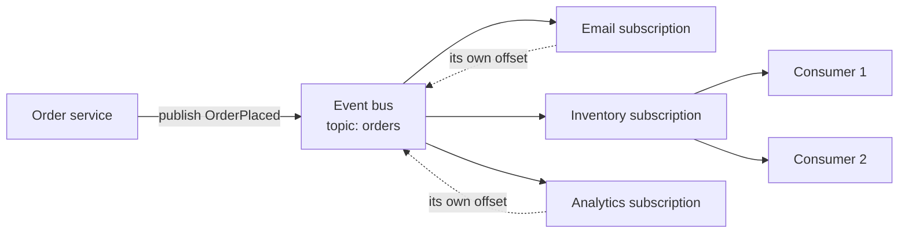
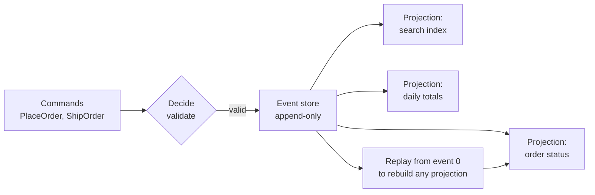

# Event-Driven Architecture and Pub/Sub

> **Interview answer (say this first).** Event-driven architecture flips the direction of dependency: instead of service A calling service B, A publishes a fact — "OrderPlaced" — and anyone who cares reacts. A **broker** fans events out through **topics** to **subscriptions**. Multiple subscribers give **fan-out**; multiple consumers on one subscription give **competing consumers** and scalability. The two big distinctions are **event notification** (a thin ping, the receiver fetches state) versus **event-carried state transfer** (the event contains the state). **Event sourcing** goes further and stores the events themselves as the source of truth, deriving read models called **projections** that can be rebuilt by **replay**. The wins are decoupling and auditability; the costs are eventual consistency, harder debugging, duplicate delivery, and schema evolution.

## Why this exists

Start with what synchronous calls cost you.

When the order service calls the email service, the inventory service, and the analytics service directly, the order service depends on all three at runtime:

```text
order -> email      (email slow  -> orders slow)
order -> inventory  (inventory down -> orders fail)
order -> analytics  (analytics schema change -> redeploy orders)
```

Every new reaction means a change to the caller. The caller must know who cares, retry each call, and handle each failure. That is **temporal coupling**: the caller waits, and the callee must be up now.

Events invert this. The order service publishes one fact and forgets. Whoever cares subscribes. Adding analytics is now analytics' problem, not the order service's:

```text
order -> [ OrderPlaced ] -> email
                        -> inventory
                        -> analytics
                        -> (new subscriber added later, no change to order service)
```

That is the core benefit: **the publisher does not know, and does not need to know, who consumes.** The costs are equally real — you trade a synchronous call you can reason about for an asynchronous flow you must observe, deduplicate, and version.

> **Note:**
>
> **The one-sentence purpose.** Event-driven architecture replaces "call everyone now" with "announce what happened," which decouples publishers from consumers at the cost of eventual consistency and harder debugging.

## Start from zero

| Word | Plain meaning |
| --- | --- |
| **Event** | A past-tense fact that something happened: `OrderPlaced`, `ToolCalled`, `RunFinished`. Immutable. |
| **Command** | An imperative request to do something: `PlaceOrder`, `SendEmail`. It can be rejected. |
| **Message** | Any payload sent through a broker; an event is one kind of message, a command another. |
| **Producer / publisher** | The component that emits events. |
| **Consumer / subscriber** | The component that reacts to events. |
| **Broker** | The system that receives and delivers events: Kafka, RabbitMQ, SNS, Redis Streams, NATS. |
| **Topic** | A named channel of related events, such as `orders` or `agent.runs`. |
| **Subscription** | A consumer's registration on a topic, with its own delivery and offset state. |
| **Fan-out** | Delivering one event to many independent subscribers, each getting its own copy. |
| **Competing consumers** | Several consumers sharing one subscription, so each event goes to only one of them. |
| **Consumer group** | The Kafka name for competing consumers on a topic; also called a subscription in other brokers. |
| **Event notification** | A thin event that says "something changed, go look it up." Small, but forces a callback. |
| **Event-carried state transfer** | A thick event that includes the changed state, so consumers need no callback. |
| **Event sourcing** | Storing events as the source of truth and deriving current state by replaying them. |
| **Event store** | The append-only log that holds the events in event sourcing. |
| **Projection / read model** | A derived view built by folding events, optimized for queries. |
| **Replay** | Re-processing stored events to rebuild or create a projection. |
| **Snapshot** | A saved point-in-time state so replay does not start from event zero. |
| **Choreography** | Coordination emerges from services reacting to each other's events. No central conductor. |
| **Orchestration** | A central coordinator tells each service what to do; contrast with choreography. |
| **Coupling** | How much one component must know or wait for another. Loose coupling is the goal. |
| **Temporal coupling** | A dependency on the other service being available at the same moment. |
| **Schema** | The agreed shape of an event's payload. |
| **Schema registry** | A service that stores schemas and enforces compatibility as they evolve. |
| **Schema evolution** | Changing event shape over time without breaking existing consumers. |
| **Backward compatible** | New consumers can read old events. |
| **Forward compatible** | Old consumers can read new events (tolerate unknown fields). |
| **Idempotent consumer** | A consumer that can safely process the same event more than once. |
| **Correlation ID** | An ID that ties all events and logs belonging to one request or run together. |
| **Eventual consistency** | Different views converge over time rather than matching instantly. |

The distinction that prevents most arguments:

- **A command is addressed; an event is broadcast.** "Send this email to Bob" is a command with one intended handler. "OrderPlaced" is a fact anyone may observe. If a message requires a specific service to act, it is a command, even if it travels through the same broker.
- **Pub/sub is not a queue.** Fan-out sends a copy to every subscription; competing consumers split one subscription. Most brokers support both, so be explicit about which you need.

## The core idea

Think about the difference between a phone call and a newspaper.

A **command** is a phone call. You dial a specific person, you wait, and if they do not answer, the task fails. The caller and callee are coupled in time.

An **event** is a newspaper. The publisher prints "Order 42 shipped" once and does not know or care who reads it. The email desk, the inventory desk, and the analytics desk each read the edition that interests them, at their own pace, and can re-read old editions. If a new desk opens next month, it subscribes — and the paper changes nothing.



The inventory subscription has two competing consumers, so they split the work. Email and analytics are separate subscriptions, so each gets every event. Those two ideas are independent knobs, and interviewers probe both.

Event sourcing takes the newspaper seriously: the archive of editions **is** the truth, and any "current state" is just a summary someone computed by reading all of them.



Because the events are kept, you can add a fourth projection next year and build it by replaying history. That is the superpower. The price is that every read model is now **eventually consistent**, and event shape is a long-lived public contract.

| Pattern | What travels | Consumer needs a callback? | Coupling |
| --- | --- | --- | --- |
| Command message | An instruction | No, it acts | Addressed to a handler |
| Event notification | Minimal ID and type | Yes, to fetch state | Loose, but chatty and possibly stale |
| Event-carried state transfer | Full changed state | No | Loosest at runtime, thickest contract |
| Event sourcing | The event is the truth | No, and state is derived | Strongest audit, most discipline |

## How it works

Follow an event from producer to projection.

1. **Something changes.** A user places an order, a model finishes a completion, a tool returns a result.
2. **The producer builds an event envelope.** A stable `event_id`, a `type`, a `version`, a timestamp, an aggregate or run ID, and the payload.
3. **The producer publishes to a topic.** It may also write to its own database in the same transaction, ideally via the transactional outbox, so the event and the state change cannot diverge.
4. **The broker persists and routes.** It stores the event and applies topic and subscription rules.
5. **Each subscription gets a copy.** Fan-out means one event per subscription; competing consumers mean one event per consumer within a subscription.
6. **Each consumer processes independently.** Consumers have their own offsets or acknowledgements, so one slow consumer does not block another subscription.
7. **The consumer must be idempotent.** Redelivery is normal, so it deduplicates on `event_id` or a business key.
8. **Projections fold events into read models.** A projection is a function from an ordered event stream to a queryable view.
9. **Replay rebuilds a projection.** Feed the same events from the beginning, or from a snapshot, into a new or fixed projector.
10. **Schema evolution happens continuously.** New fields are added as optional, and consumers ignore fields they do not know.
11. **Failures route to a dead-letter queue.** A poison event goes to a DLQ after bounded retries, so it cannot block the stream forever.
12. **Observability ties it together.** A correlation ID flows through every event, so a single run can be traced across services.

The discipline that makes this work is at step 2 and step 10: a good envelope and a versioning policy. Everything else is plumbing.

## The syntax you will use

Events are just structured messages; the broker API is often the easy part.

**A production event envelope.** This shape is worth standardizing across every service.

```json
{
  "event_id": "9f2c1a",
  "event_type": "order.placed",
  "event_version": 2,
  "occurred_at": "2026-09-13T10:15:00Z",
  "aggregate_id": "order-42",
  "correlation_id": "req-77",
  "causation_id": "cmd-31",
  "producer": "order-service",
  "data": {"order_id": "order-42", "total": 42.0}
}
```

`event_id` supports deduplication, `event_version` supports evolution, and `correlation_id` supports tracing.

**Publish and subscribe with Kafka.**

```python
producer.produce("orders", key="order-42", value=json.dumps(event))
consumer = Consumer({"group.id": "email", "auto.offset.reset": "earliest"})
consumer.subscribe(["orders"])
```

The `group.id` defines the subscription: different groups fan out, same group competes.

**Fan-out with SNS and SQS.**

```python
sns.publish(TopicArn=topic_arn, Message=json.dumps(event))
# each subscribed SQS queue receives its own copy
```

SNS is the fan-out point; each SQS queue is an independent subscription with its own DLQ and retry policy.

**Lightweight pub/sub with Redis.**

```python
r.publish("agent.updates", json.dumps(event))      # fire-and-forget
r.xadd("agent.updates", event)                     # durable alternative: Streams
```

Pub/sub loses messages when no one is subscribed; Streams keep them.

**A small in-process event bus in Python.**

```python
from collections import defaultdict

class EventBus:
    def __init__(self) -> None:
        self._subscribers: dict[str, list] = defaultdict(list)

    def subscribe(self, topic: str, handler) -> None:
        self._subscribers[topic].append(handler)

    def publish(self, topic: str, event: dict) -> None:
        for handler in list(self._subscribers[topic]):
            handler(event)
```

This is useful for decoupling modules inside one service before introducing a broker.

**Declare schema compatibility rules.** With a schema registry, the common mode is `BACKWARD`, meaning new schemas can read data written with the previous schema.

```text
compatibility = BACKWARD
Add an optional field        -> compatible
Remove a field               -> backward compatible (new readers ignore it)
                                but breaks old readers (not forward compatible)
Rename a field               -> looks like remove + add
Change a type (int -> string)-> incompatible unless the format allows it
```

Optional additions are cheap; removals and renames need a migration in two phases.

**A versioned event with a tolerant consumer.**

```python
def project_order(event: dict) -> dict:
    data = event["data"]
    return {
        "order_id": data["order_id"],
        "total": data.get("total", 0.0),          # tolerate absence in v1
        "currency": data.get("currency", "USD"),  # new optional field
    }
```

Tolerating absent and unknown fields is what makes rolling upgrades possible.

**The transactional outbox, named here and explained later.**

```text
BEGIN
  INSERT INTO orders (...);
  INSERT INTO outbox (event_id, payload) VALUES (...);
COMMIT
-- a separate relay publishes outbox rows to the broker, at least once
```

It is the standard fix for "the database committed but the event never left."

## Examples: simple to real

**Example 1 — pub/sub fan-out.** One publish, many independent handlers.

```python
from collections import defaultdict

class EventBus:
    def __init__(self) -> None:
        self._subscribers: dict[str, list] = defaultdict(list)

    def subscribe(self, topic: str, handler) -> None:
        self._subscribers[topic].append(handler)

    def publish(self, topic: str, event: dict) -> None:
        for handler in list(self._subscribers[topic]):
            handler(event)

bus = EventBus()
bus.subscribe("order.placed", lambda e: print("email:", e["id"]))
bus.subscribe("order.placed", lambda e: print("inventory:", e["id"]))
bus.subscribe("order.placed", lambda e: print("analytics:", e["id"]))

bus.publish("order.placed", {"id": "o-1"})
# email: o-1
# inventory: o-1
# analytics: o-1
```

Adding the analytics handler changed nothing for the publisher, which is the entire point.

**Example 2 — competing consumers.** One subscription, several workers, each event to exactly one worker.

```python
import itertools

class Subscription:
    """One logical subscription with competing consumers (a consumer group)."""

    def __init__(self, consumers: list) -> None:
        self.consumers = consumers
        self._turn = itertools.cycle(range(len(consumers)))

    def deliver(self, event: str) -> str:
        return self.consumers[next(self._turn)](event)

workers = [
    lambda e: f"worker-1 handled {e}",
    lambda e: f"worker-2 handled {e}",
]
subscription = Subscription(workers)
print([subscription.deliver(f"evt-{i}") for i in range(4)])
# ['worker-1 handled evt-0', 'worker-2 handled evt-1',
#  'worker-1 handled evt-2', 'worker-2 handled evt-3']
```

Fan-out is many subscriptions; scaling is many consumers inside one subscription. Do not confuse them.

**Example 3 — event sourcing, projections, and replay.** State is a fold over events, so it can always be rebuilt.

```python
from collections import defaultdict

events: list[dict] = []

def append(event: dict) -> None:
    events.append(event)

def project_balances(stream: list[dict]) -> dict[str, int]:
    balances: dict[str, int] = defaultdict(int)
    for event in stream:
        if event["type"] == "MoneyDeposited":
            balances[event["account"]] += event["amount"]
        elif event["type"] == "MoneyWithdrawn":
            balances[event["account"]] -= event["amount"]
    return dict(balances)

append({"type": "AccountOpened", "account": "a1"})
append({"type": "MoneyDeposited", "account": "a1", "amount": 100})
append({"type": "MoneyWithdrawn", "account": "a1", "amount": 30})
print(project_balances(events))   # {'a1': 70}

append({"type": "MoneyDeposited", "account": "a1", "amount": 5})
print(project_balances(events))   # {'a1': 75} -> same fold, recomputed
```

A new projection is a new function over the same log; no data migration is required.

**Example 4 — notification versus carried state.** The same fact, two very different contracts.

```python
def total_from_notification(event: dict, fetch_order) -> float:
    # thin event: must call back, can be stale, adds a runtime dependency
    return fetch_order(event["order_id"])["total"]

def total_from_carried(event: dict) -> float:
    # thick event: self-contained, no callback
    return event["total"]

notification = {"type": "OrderPlaced", "order_id": "o-1"}
carried = {"type": "OrderPlaced", "order_id": "o-1", "total": 42.0}

print(total_from_carried(carried))                    # 42.0
print(total_from_notification(notification, {"o-1": {"total": 42.0}}.get))
```

Thin events stay small but recreate coupling to a lookup service; thick events decouple reads but grow the contract.

**Example 5 — schema evolution and compatibility.** Adding an optional field is safe; removing a field breaks old readers.

```python
def old_consumer(event: dict) -> float:
    return event["data"]["amount"]           # v1 required field

def new_consumer(event: dict) -> float:
    data = event["data"]
    return data.get("amount", 0.0)           # tolerates old and new

v1_event = {"type": "Payment", "data": {"amount": 10.0}}
v2_event = {"type": "Payment", "data": {"amount": 10.0, "currency": "USD"}}

print(old_consumer(v1_event))     # 10.0
print(old_consumer(v2_event))     # 10.0 -> old reader ignores the new field
print(new_consumer(v1_event))     # 10.0 -> new reader tolerates the missing field
print(new_consumer(v2_event))     # 10.0
```

This tiny example is why "add optional fields, never remove them in place" is the safe default.

**Example 6 — an agent run as an event stream.** One run emits facts; several projections read them independently.

```text
agent.run.started      -> run_id, tenant, model
agent.tool.called      -> run_id, tool, arguments_hash
agent.tool.succeeded   -> run_id, tool, latency_ms
agent.token.used       -> run_id, prompt_tokens, completion_tokens
agent.run.finished     -> run_id, status, cost_usd

Subscriptions:
  billing   -> sums agent.token.used by tenant
  memory    -> indexes agent.run.finished summaries
  eval      -> pairs run.finished with expected outcomes
  tracing   -> builds the full timeline by run_id (correlation)
```

Each projection has its own offset, so a slow evaluation job never delays billing or memory.

## In production

- **Events create eventual consistency.** A consumer's view lags the producer by milliseconds to minutes. Product and UI must tolerate it, or you need a synchronous read path.
- **Duplicate delivery is normal.** Every broker worth using is at-least-once. Deduplicate on `event_id` or a business key before applying side effects.
- **There is no ordering guarantee across topics or partitions.** Order is per partition or per message group. Key related events by aggregate or run ID so they stay ordered together.
- **Schema is a public contract.** Once published, a field has consumers you may not know about. Add optional fields; deprecate before removing; use a schema registry to enforce compatibility.
- **Debugging is harder than a stack trace.** A request fans into events handled by services that never see the original caller. Invest in correlation IDs, structured logs, and tracing from day one.
- **Choreography can become untraceable.** With no central coordinator, "who sends what and when" lives only in people's heads. Document the flows, or orchestrate the critical paths explicitly.
- **A poison event blocks a partition.** One unprocessable event can stall an ordered stream. Use bounded retries and a DLQ so the stream keeps moving.
- **Replay is powerful and dangerous.** Replaying a projection that emits events causes an event storm. Replay into a side effect that is not idempotent and you double-charge. Make replay dry-run capable.
- **Event sourcing is a commitment, not a library.** You need snapshots for fast rebuilds, a plan for deleting personal data from an immutable log, and a versioning strategy for old events. Do not adopt it for CRUD.
- **Do not use events as a query API.** Rebuilding state for every request is slow. Events feed projections; projections answer queries.
- **Watch for event storms and consumer lag.** A retry loop or a reconnection can multiply events. Track lag per subscription, not just total throughput.
- **Agentic-AI systems are a natural fit.** Agent runs, tool calls, and model usage are facts that billing, memory, evaluation, and tracing each want. Event streams let those consumers evolve without touching the agent runtime.

## Interview questions

### 1. What is the difference between an event and a command?

**Answer.** An event is a past-tense fact about something that already happened, such as `OrderPlaced`. It is immutable and may have many consumers. A command is an imperative request to do something, such as `PlaceOrder` or `SendEmail`. It has an intended handler and can be rejected. Events describe; commands instruct.

**Follow-up: "Why does the distinction matter for design?"** Because the semantics differ. Commands need routing, validation, and a clear owner; events need fan-out, versioning, and independent consumers. Mixing them in one topic creates confusion about who is responsible for acting.

**Trap.** Naming events in the imperative, like `SendEmail`, which hides that it is a command. Past tense keeps the model honest.

### 2. What is fan-out and how does it differ from competing consumers?

**Answer.** Fan-out delivers a copy of each event to every subscriber, so independent services each see everything. Competing consumers are multiple workers inside one subscription, splitting the events so each event goes to exactly one worker. Fan-out is about breadth (many subscribers); competing consumers are about scale (more workers on one subscriber).

**Follow-up: "How do you combine them?"** Each subscription uses competing consumers internally, while the topic fans out to multiple subscriptions. That gives parallel processing per subscriber and independent consumption across subscribers.

**Trap.** Assuming a consumer group receives every event. Within one group, each event goes to one member; fan-out requires separate groups or subscriptions.

### 3. Event notification versus event-carried state transfer — what is the trade-off?

**Answer.** Event notification sends a thin event, often just an ID, and the consumer fetches current state from the producer. It keeps events small but recreates runtime coupling and can read stale data. Event-carried state transfer includes the changed fields, so consumers need no callback; it decouples reads more thoroughly but makes the event contract larger and longer-lived.

**Follow-up: "Which do you pick for sensitive data?"** Notification, because carrying full state into a broadcast topic spreads sensitive fields to every subscriber. Carry only what every consumer is allowed and needs.

**Trap.** Saying event-carried state transfer is always better because it "removes coupling." It replaces runtime coupling with schema coupling, and it can leak data.

### 4. What is event sourcing?

**Answer.** Event sourcing stores the sequence of events as the source of truth, instead of storing only current state. Current state is derived by replaying events through a projection. Because the log is kept, you can rebuild read models, audit exactly what happened, and add new projections without migrating data.

**Follow-up: "What are the costs?"** Eventual consistency, snapshots for performance, a hard problem deleting personal data from an immutable log, and the need to version old events forever. It suits domains with meaningful state transitions, not simple CRUD.

**Trap.** Saying event sourcing is "just keeping an audit log." An audit log is a side record; in event sourcing, the events *are* the system of record.

### 5. How do you evolve event schemas safely?

**Answer.** Treat the schema as a public API. Add optional fields, and make consumers ignore unknown fields. Never remove or rename a field in place; deprecate it, migrate consumers, then remove it in a later version. Use a schema registry with a compatibility mode such as `BACKWARD` to enforce these rules automatically.

**Follow-up: "What is the difference between backward and forward compatibility?"** Backward compatible: new consumers can read old events. Forward compatible: old consumers can read new events. Tolerant consumers that ignore unknown fields give you both.

**Trap.** Testing schema changes only with the latest producer. Old events in the log will still be read by new consumers, and old consumers may still be running during a rollout.

### 6. Why must consumers be idempotent in an event-driven system?

**Answer.** Because brokers deliver at least once. Retries, rebalances, visibility timeouts, and connection drops all cause redelivery, and event replay can redeliver history on purpose. An idempotent consumer produces the same result whether it processes an event once or several times, usually by deduplicating on `event_id` or using upserts.

**Follow-up: "Where do you store the deduplication record?"** In a durable store the consumer already uses, ideally in the same transaction as the side effect. A Redis key works for a time-bounded window but is not durable enough as the only guard.

**Trap.** Believing a broker setting gives exactly-once across your database. Atomic writes to multiple independent systems need the outbox or a saga, not a consumer flag.

### 7. What is a projection, and how does replay work?

**Answer.** A projection is a read model built by folding an ordered event stream into a queryable shape, such as a table, a search index, or a cache. Replay means re-running that fold over stored events, from the beginning or from a snapshot, to rebuild the projection or create a new one. Because events are immutable, replay is deterministic if the projector has no external side effects.

**Follow-up: "What makes replay risky?"** Non-idempotent side effects, emitting new events during replay, and long rebuild times on large logs. Use snapshots, dry runs, and a separate rebuild target.

**Trap.** Assuming replay is free. Rebuilding a year of events can take hours and load the whole pipeline.

### 8. When should you not use event-driven architecture?

**Answer.** When the operation is a simple request-response with no other interested party, when the caller genuinely needs an immediate consistent answer, or when the team cannot yet operate asynchronous systems. Long-running sagas, tracing, and schema management are real costs. A synchronous call with a timeout is often simpler and more debuggable.

**Follow-up: "How do you decide?"** Ask whether more than one consumer needs the fact, whether the caller can proceed without waiting, and whether the event has durable long-term value. If all three are no, use a direct call.

**Trap.** Adopting events everywhere for "decoupling" and ending up with a distributed monolith: dozens of services, no clear flow, and no one able to trace a request.

## Remember this

- **Events are past-tense facts; commands are instructions.** Name and route them differently.
- **Fan-out is many subscriptions; competing consumers are many workers in one subscription.** Two independent knobs.
- **Thin events decouple at the schema cost of a callback; thick events decouple reads but grow the contract.**
- **At-least-once delivery means idempotent consumers and a stable `event_id`.**
- **Schema is a public contract: add optional fields, never remove in place, enforce with a registry.**
