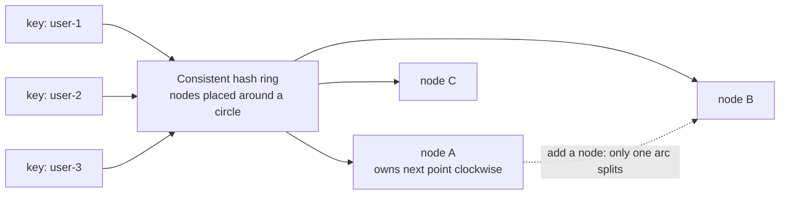
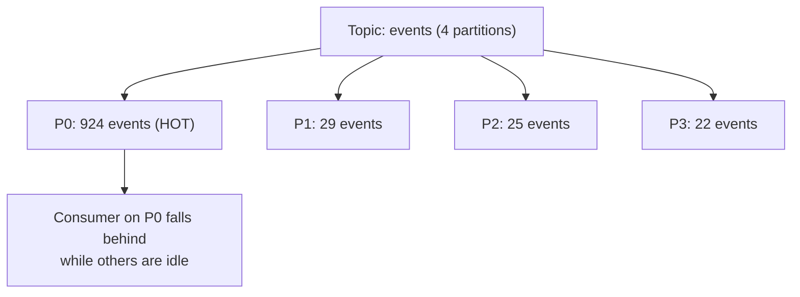

# Partitioning and Ordering

> **Interview answer (say this first).** Partitioning splits a dataset or stream into independent pieces so storage and work can spread across many nodes. It buys throughput and parallelism, and it costs global order and simple cross-partition operations. You choose a **partition key**, hash or range it to a partition, and every record with that key goes to the same partition. A good key has high cardinality and even access; a bad key creates **hot partitions** (skew). Ordering is guaranteed **only within a partition**. Global ordering needs a single partition (which caps scale) or a sequencing layer, so the usual answer is to design so you never need it. **Consistent hashing** minimizes how many keys move when nodes join or leave.

## Why this exists

A single node has a ceiling: CPU, memory, disk, and connections. When one machine cannot hold the data or keep up with the write rate, you split the data across machines. That split is partitioning, and it is the standard path from one node to many.

The naive fix — put everything in one place and buy a bigger machine — is vertical scaling. It works until it does not: costs grow faster than capacity, and you still have a single point of failure. Partitioning is horizontal scaling for data and streams.

But partitioning is a **one-way door in practice**. The mapping from key to partition is baked into where every record lives. Change the number of partitions and, with simple modulo hashing, most keys move to a new home. That movement means rebalancing, temporary unavailability, and broken ordering for keys that move.

The three questions you must answer before partitioning anything:

```text
1. What is the partition key?          -> decides order and balance
2. How many partitions?                -> decides max parallelism
3. What happens when I add a node?     -> decides rebalancing pain
```

Answer those badly and you get a system that is fast on average and terrible for one unlucky user — the classic hot-partition incident.

> **Note:**
>
> **The one-sentence purpose.** Partitioning trades global order and simplicity for horizontal scale, and the partition key decides whether the trade is fair or catastrophic.

## Start from zero

| Word | Plain meaning |
| --- | --- |
| **Partition** | One independent piece of a topic or dataset. Also called a shard in databases. |
| **Shard** | A horizontal slice of a database. Same idea as a partition. |
| **Partition key** | The value used to decide which partition a record belongs to, such as `user_id`. |
| **Hash partitioning** | Compute `hash(key) % N` (or a ring lookup) to pick the partition. Spreads keys evenly. |
| **Range partitioning** | Split key ranges, such as A–M and N–Z, or dates by month. Good for scans, prone to skew. |
| **List partitioning** | Assign explicit key values to partitions, such as one partition per region. |
| **Round-robin** | Ignore the key and rotate; perfectly even, but no per-key order. |
| **Hot partition** | One partition receiving far more traffic than the others. |
| **Skew** | Uneven distribution across partitions. The cause of hot partitions. |
| **Cardinality** | The number of distinct key values. High cardinality spreads better. |
| **Consistent hashing** | A ring where adding or removing a node moves only nearby keys, not most of them. |
| **Virtual node (vnode)** | Many ring positions per physical node, so load distributes evenly. |
| **Rendezvous hashing** | Each key is assigned to the node with the highest score for that key. Minimal movement. |
| **Hash slot** | A fixed bucket between key and node, as in Redis Cluster's 16384 slots. |
| **Rebalancing** | Moving partitions or keys between nodes after membership changes. |
| **Resharding** | Changing the number of partitions or the key mapping. Usually expensive. |
| **Ordering guarantee** | The promise that records are delivered or stored in a defined sequence. |
| **Per-partition order** | Records in one partition are ordered; records in different partitions are not. |
| **Global order** | One order across all records, regardless of partition. Expensive to provide. |
| **Sequence number** | A counter attached to records so a reader can detect gaps and ordering. |
| **Watermark** | "No records before this time will arrive later," used to reason about late data. |
| **Scatter-gather** | A query sent to every partition and merged. The cost of cross-partition reads. |
| **Fan-out** | Sending one write to many partitions. The cost of cross-partition writes. |
| **Salting** | Adding a small random or derived suffix to a hot key to spread it out. |
| **Locality** | Keeping related data on the same partition to avoid cross-partition work. |

The two ideas to hold together:

- **Partitioning is the unit of scale *and* order.** More partitions means more parallelism and a weaker global order. You cannot have both for free.
- **The key is a contract with your access pattern.** A key that is even for writes may be terrible for reads, and vice versa. Choose it from the queries you will run.

## The core idea

Picture a post office with one counter and one clerk. A line forms; throughput is capped by that clerk. Now open eight counters and sort customers by postcode: everyone with postcode 10001 goes to counter 1, 10002 to counter 2, and so on. Eight times the throughput, and each counter serves its own customers in arrival order.

But now one wealthy neighborhood generates most of the mail. Counter 3 has a line out the door while the others are idle. That is a **hot partition**. The sorting rule was fine; the world was skewed. You need a better key, salting, or a dedicated lane.

The same is true on a hash ring. A consistent hash ring places nodes around a circle and assigns each key to the first node clockwise. Adding a node splits one arc instead of remapping everything. Virtual nodes give each physical node many points, so the arcs are small and even.



And a hot partition looks like this, no matter what the average says:



The average looks fine. The maximum is the incident.

| Strategy | How it assigns | Strength | Weakness |
| --- | --- | --- | --- |
| **Hash (modulo)** | `hash(key) % N` | Even, simple | Almost all keys move when N changes |
| **Range** | Key ranges per partition | Efficient range scans | Skew from clustered keys, e.g. time |
| **List** | Explicit values per partition | Perfect per-tenant control | Manual, uneven as tenants grow |
| **Round-robin** | Rotate in order | Perfectly even writes | No per-key ordering, hard reads |
| **Consistent hashing** | Ring + vnodes | Few keys move on membership change | More complex, needs vnodes for balance |
| **Rendezvous (HRW)** | Highest score wins | Minimal movement, stateless | Node lookup costs O(nodes) per key |
| **Hash slots** | Key -> slot -> node | Decouples partition count from nodes | Slot map must be managed and rebalanced |

## How it works

1. **A record arrives with a key.** The key comes from the domain: user ID, tenant ID, agent run ID, order ID.
2. **The key is hashed.** Hash functions turn variable keys into fixed numbers with good spread. Kafka's Java client uses murmur2 by default; other systems use MD5, SHA, or a custom function.
3. **The hash selects a partition.** Modulo N, a ring lookup, or a slot table maps the number to a partition.
4. **The record is stored or queued in that partition.** All records with the same key stay together, preserving per-key order.
5. **Each partition is independent.** It has its own log, its own leader, its own consumers, and its own offset sequence.
6. **Consumers are assigned partitions.** In a consumer group, each partition goes to exactly one consumer, so parallelism is capped by partition count.
7. **A query may need many partitions.** Without a partition key in the filter, the system broadcasts and merges: a scatter-gather.
8. **A write may need many partitions.** Updating something grouped differently from the key means a fan-out write across partitions.
9. **Skew is measured and watched.** Track records and bytes per partition, not just per topic or table.
10. **Membership changes trigger rebalancing.** Nodes join or leave, and partitions or slots move; during the move, ordering can pause and duplicates can appear.
11. **Consistent hashing limits the blast radius.** Only keys whose arc changed move, roughly `1/N` of them for an N-node cluster.
12. **Virtual nodes even out the arcs.** Without them, random node placement produces uneven ownership.

The practical conclusion from steps 5 and 6: **order per key is a property of your key choice, not of the broker.** If two records must be ordered together, they must share a key.

## The syntax you will use

**Use a deterministic hash in your own code.** Never rely on Python's built-in `hash()` for stable partitioning; it is salted per process.

```python
import hashlib

def stable_hash(value: str) -> int:
    digest = hashlib.sha256(value.encode()).digest()
    return int.from_bytes(digest[:8], "big")

def partition_for(key: str, num_partitions: int) -> int:
    return stable_hash(key) % num_partitions
```

`hashlib` gives the same result in every process and language, which matters when clients and servers must agree.

**Salting a hot key to spread writes.** The salt goes in the partition key, not the business key.

```python
def salted_key(user_id: str, shard_hint: int) -> str:
    return f"{user_id}#{shard_hint}"

# writers rotate shard_hint across a few values
for event in events:
    key = salted_key(event["user_id"], event["seq"] % 4)
```

Reads must then gather all four salted keys, so salt only when writes truly need it.

**Kafka partitioning.** A keyed record goes to `hash(key) % num_partitions`; a null key is spread for throughput.

```python
producer.produce("events", key=str(event["run_id"]), value=payload)
```

Same `run_id` means same partition means ordered delivery for that run.

**Redis Cluster hash slots and hash tags.** Related keys must share a slot to allow multi-key operations.

```text
CLUSTER KEYSLOT user:42                 # which of the 16384 slots
SET {user:42}:balance 10                # {user:42} forces a shared slot
```

The `{...}` hash tag makes `{user:42}:balance` and `{user:42}:name` land in the same slot.

**PostgreSQL declarative partitioning.**

```sql
CREATE TABLE events (
    id          bigint,
    tenant_id   bigint,
    created_at  timestamptz
) PARTITION BY HASH (tenant_id);

CREATE TABLE events_p0 PARTITION OF events FOR VALUES WITH (MODULUS 4, REMAINDER 0);
CREATE TABLE events_p1 PARTITION OF events FOR VALUES WITH (MODULUS 4, REMAINDER 1);
```

Queries that filter on `tenant_id` prune to one partition; queries that do not scan all of them.

**DynamoDB and Cassandra keys.**

```text
DynamoDB : partition key = tenant_id, sort key = created_at
Cassandra: PRIMARY KEY ((tenant_id), created_at)
```

The partition key controls placement; the sort key controls order within the partition.

**Detecting skew in operation.** Compare the busiest partition to the average.

```python
max_lag = max(lag_per_partition)
avg_lag = sum(lag_per_partition) / len(lag_per_partition)
alert = max_lag > 3 * avg_lag
```

A single partition exceeding three times the average is an early hot-partition signal.

## Examples: simple to real

**Example 1 — why modulo is a trap.** Changing the partition count remaps most keys.

```python
import hashlib

def partition_for(key: str, num_partitions: int) -> int:
    digest = hashlib.sha256(key.encode()).digest()
    return int.from_bytes(digest[:8], "big") % num_partitions

keys = [f"user-{i}" for i in range(1000)]
before = {k: partition_for(k, 4) for k in keys}
after = {k: partition_for(k, 5) for k in keys}
moved = sum(1 for k in keys if before[k] != after[k])
print(moved, "of", len(keys), "keys moved")
# 805 of 1000 keys moved
```

Going from 4 to 5 partitions moved about 80% of keys. In a stateful store, that is a massive data migration.

**Example 2 — consistent hashing moves far less.** A ring with 100 virtual nodes per node limits the damage.

```python
import bisect
import hashlib

def ring_hash(value: str) -> int:
    digest = hashlib.sha256(value.encode()).digest()
    return int.from_bytes(digest[:8], "big")

class HashRing:
    def __init__(self, nodes: list[str], replicas: int = 100) -> None:
        self.replicas = replicas
        self.points: list[int] = []
        self.owner: dict[int, str] = {}
        for node in nodes:
            self.add(node)

    def add(self, node: str) -> None:
        for i in range(self.replicas):
            point = ring_hash(f"{node}:{i}")
            bisect.insort(self.points, point)
            self.owner[point] = node

    def get(self, key: str) -> str:
        index = bisect.bisect_left(self.points, ring_hash(key)) % len(self.points)
        return self.owner[self.points[index]]

keys = [f"user-{i}" for i in range(1000)]
ring = HashRing(["db-1", "db-2", "db-3", "db-4"])
before = {k: ring.get(k) for k in keys}
ring.add("db-5")
after = {k: ring.get(k) for k in keys}
print(sum(1 for k in keys if before[k] != after[k]), "of", len(keys), "keys moved")
# 168 of 1000 keys moved (about 1/5, as expected when adding a 5th node)
```

Roughly one node's share of keys moved instead of 80%. Virtual nodes keep the arcs reasonably even.

**Example 3 — a hot partition hides behind a good average.** One popular key concentrates traffic.

```python
import hashlib
from collections import Counter

def partition_for(key: str, num_partitions: int = 4) -> int:
    digest = hashlib.sha256(key.encode()).digest()
    return int.from_bytes(digest[:8], "big") % num_partitions

events = ["hot-user"] * 900 + [f"user-{i}" for i in range(100)]
counts = Counter(partition_for(k) for k in events)
print(dict(sorted(counts.items())))
# {0: 924, 1: 29, 2: 25, 3: 22}
print("hottest share:", round(counts.most_common(1)[0][1] / len(events), 3))
# hottest share: 0.924
```

The average is 250 events per partition. One partition has 924. Monitor the maximum, not the mean.

**Example 4 — rendezvous hashing is another minimal-movement option.** Each key picks the node with the highest score.

```python
import hashlib

def score(key: str, node: str) -> int:
    digest = hashlib.sha256(f"{key}:{node}".encode()).digest()
    return int.from_bytes(digest[:8], "big")

def pick(key: str, nodes: list[str]) -> str:
    return max(nodes, key=lambda node: score(key, node))

nodes = ["db-1", "db-2", "db-3", "db-4"]
keys = [f"user-{i}" for i in range(1000)]
before = {k: pick(k, nodes) for k in keys}
after = {k: pick(k, nodes + ["db-5"]) for k in keys}
print(sum(1 for k in keys if before[k] != after[k]), "of", len(keys), "keys moved")
# 195 of 1000 keys moved
```

Rendezvous needs no ring or shared state, but each lookup evaluates every node, so it suits modest node counts.

**Example 5 — per-partition order is not global order.** Each partition is internally ordered; the merge is not.

```python
partitions = {
    0: [("user-1", "t=10"), ("user-1", "t=30")],
    1: [("user-2", "t=20"), ("user-2", "t=40")],
}

# Per key, order is preserved.
print(partitions[0])   # [('user-1', 't=10'), ('user-1', 't=30')]
print(partitions[1])   # [('user-2', 't=20'), ('user-2', 't=40')]

# But a reader consuming both partitions can observe this order:
observed = [partitions[1][0], partitions[0][0], partitions[0][1], partitions[1][1]]
print([f"{user} {time}" for user, time in observed])
# ['user-2 t=20', 'user-1 t=10', 'user-1 t=30', 'user-2 t=40']
```

The global stream shows `t=20` before `t=10`. That is not a bug; there was never a global order to violate.

**Example 6 — choose a partition key by measuring skew.** Compare candidate keys before committing to one.

```python
import hashlib
from collections import Counter

def bucket(value: str, buckets: int = 8) -> int:
    digest = hashlib.sha256(value.encode()).digest()
    return int.from_bytes(digest[:8], "big") % buckets

def skew(keys: list[str], buckets: int = 8) -> float:
    counts = Counter(bucket(k, buckets) for k in keys)
    return max(counts.values()) / sum(counts.values())

users = [f"user-{i}" for i in range(1000)]
countries = [f"country-{i % 3}" for i in range(1000)]

print(round(skew(users), 3))       # 0.148 -> high-cardinality key spreads well
print(round(skew(countries), 3))   # 0.334 -> only 3 values; collisions and clustering
```

Low-cardinality keys such as country or status concentrate traffic. Prefer IDs, or salt them.

## In production

- **Choose the key from the access pattern, not from convenience.** The key decides both balance and which queries can avoid a scatter-gather.
- **Watch the maximum, not the average.** A partition at 10x the mean is an incident even when the mean is healthy. Alert on per-partition lag and bytes.
- **Salting fixes hot writes and breaks simple reads.** Spreading a hot key across N salted partitions means every read must gather N. Do it only for genuinely hot keys.
- **Partition count caps consumer parallelism.** More consumers than partitions means idle consumers. Size partitions for peak parallelism, and remember it is a one-way door for keyed data.
- **Adding a partition remaps keys under modulo hashing.** Use consistent hashing, hash slots, or a migration plan with dual reads.
- **Rebalancing has a cost.** Moving partitions consumes network and disk, pauses ordering for moved keys, and can cause duplicate processing. Plan for it and make consumers idempotent.
- **Cross-partition reads are scatter-gather.** They cost latency proportional to the slowest partition and load every node. Design a read path that can filter by the partition key.
- **Cross-partition writes are fan-out.** They cannot be atomic without a distributed transaction, so use sagas or outbox patterns instead.
- **Ordering and scale pull against each other.** Global order means one partition or a sequencing layer. Ask whether you need global order or just per-entity order — almost always the latter.
- **Late and out-of-order data is normal.** Use event time plus watermarks, or sequence numbers, when correctness depends on order across partitions.
- **Resharding needs a stable hash.** If clients and servers disagree on the hash function, keys land in different partitions. Pin the algorithm and version it.
- **Agentic-AI relevance.** Partition agent work by `run_id` or `tenant_id` so a run's events stay ordered, shard memory by tenant so no single tenant hogs a node, and watch for a popular tool or model being a hot key in your routing.

## Interview questions

### 1. Why do we partition data in the first place?

**Answer.** To scale beyond one machine. A single node has limited CPU, memory, disk, and connections. Partitioning spreads storage and throughput across many nodes, so capacity grows by adding nodes. It also isolates failures, because one partition can be unavailable without taking down the others.

**Follow-up: "What is the cost?"** Global ordering, atomic multi-partition operations, and simple queries. You also inherit rebalancing and hot-partition risk. Partitioning is a trade, not a free win.

**Trap.** Saying partitioning improves availability automatically. If a key is unavailable, its partition is unavailable; and more nodes means more things that can fail.

### 2. How do you choose a partition key?

**Answer.** Start from the access pattern. The key should be present in your common queries, have high cardinality, and receive even traffic. An ID such as `user_id`, `tenant_id`, or `run_id` is usually good. Low-cardinality fields such as status or country cause skew, and timestamps create a moving write hotspot.

**Follow-up: "What if the best key for writes is bad for reads?"** You may need two structures: partition the primary data for writes and build a secondary projection partitioned for reads. That is a form of CQRS, and it is common at scale.

**Trap.** Choosing a key because it is unique. Uniqueness is not enough; the key must also distribute load and match queries.

### 3. What is a hot partition and how do you fix it?

**Answer.** A hot partition receives disproportionate traffic, often because one key dominates or the key has low cardinality. Fixes include choosing a higher-cardinality key, salting the hot key across several partitions, caching or pre-aggregating the hot value, or giving that key a dedicated partition or lane.

**Follow-up: "What does salting cost?"** Reads must gather all salted partitions, so a write-side fix becomes a read-side fan-out. Cache the merged result or accept the extra latency.

**Trap.** Adding partitions to fix skew. If 900 of 1000 events share one key, more partitions do not help; that key still maps to one partition.

### 4. What ordering does partitioning actually guarantee?

**Answer.** Only per-partition order: records in the same partition are delivered in append order. Records in different partitions have no defined order, so the global stream can interleave arbitrarily. To order related events, give them the same partition key.

**Follow-up: "How would you get global ordering?"** Use a single partition, which caps parallelism, or attach sequence numbers and have consumers buffer and reorder with a watermark. Most teams instead redesign so per-entity order is enough.

**Trap.** Assuming event timestamps create order. Two partitions can deliver a later timestamp first; the system never promised to sort by time.

### 5. What is consistent hashing and why use it?

**Answer.** Consistent hashing maps both keys and nodes onto a ring and assigns each key to the next node clockwise. Adding or removing a node only remaps the keys in the affected arc, about `1/N` of keys, instead of the ~`(N-1)/N` remap that modulo hashing causes. Virtual nodes give each physical node many ring positions so ownership stays even.

**Follow-up: "When would you not use it?"** When the partition count is fixed and managed centrally, such as Redis Cluster's hash slots or Kafka's partition map. Those systems decouple partitioning from node membership a different way.

**Trap.** Using consistent hashing without virtual nodes and assuming it is balanced. One point per node can produce very uneven arcs.

### 6. How do you handle rebalancing when partitions move?

**Answer.** Plan for it: make consumers idempotent, because a moved partition can replay records; drain and pause assignment carefully; and migrate data in the background where possible. Systems with hash slots move slots, and systems with a coordinator reassign partitions. Expect a temporary hit to latency and ordering during the move.

**Follow-up: "How do you avoid a big-bang rebalance?"** Move a small number of partitions at a time, throttle the migration, and use a replica to serve reads while the primary catches up. Never move all partitions at once in a production cluster.

**Trap.** Assuming rebalancing is instant and harmless. It moves real bytes, consumes real bandwidth, and can trigger duplicate processing for keys that move.

### 7. When would you deliberately use a single partition?

**Answer.** When you need strict global order or a simple serialized workflow and the throughput fits. A single partition is a valid design for low-volume control topics, leader-election-style coordination, or a per-key lock. It is a conscious choice to trade scale for simplicity and order.

**Follow-up: "What is the risk?"** The partition is a bottleneck and a single point of failure. Plan a fallback and monitor its throughput and lag closely.

**Trap.** Starting with one partition "for simplicity" and never revisiting it, then discovering the topic cannot scale when traffic grows.

### 8. How do cross-partition queries and transactions work?

**Answer.** A query that cannot filter by the partition key is a scatter-gather: it runs on every partition and merges results, costing latency and load. A write spanning partitions is a fan-out that cannot be atomic without a distributed transaction, so teams use sagas, the transactional outbox, or event-driven reconciliation instead.

**Follow-up: "How do you make cross-partition reads cheap?"** Create a projection keyed for the query pattern, so the common read touches one partition. That is exactly what a read model or secondary index is for.

**Trap.** Promising ACID across partitions without a real distributed transaction. Most systems only guarantee atomicity within one partition.

## Remember this

- **Partitioning buys scale and costs global order, atomic cross-partition work, and query simplicity.**
- **The partition key is the design decision.** High cardinality, even traffic, and present in your common queries.
- **Order is per partition only.** Same key for order; different keys mean no order between them.
- **Watch the maximum, not the average.** One hot partition drives the incident while the mean looks healthy.
- **Modulo remaps almost everything when N changes; consistent hashing moves about 1/N.** Choose deliberately.
