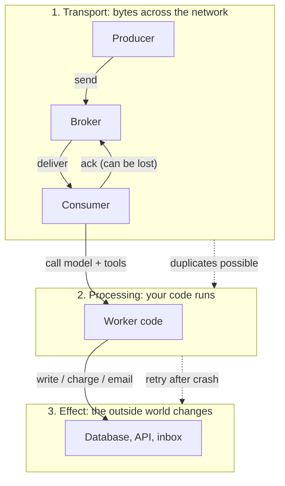

# Delivery Guarantees

> **Interview answer (say this first).** Delivery guarantees describe how many times a message can be handed to a consumer: **at-most-once** means zero or one time (loss is possible, duplicates are not), **at-least-once** means one or more times (duplicates are possible, loss is not), and **exactly-once** means one time. Exactly-once **delivery** does not exist across a network, because the sender can never be sure whether a lost acknowledgement means "not delivered" or "delivered but the ack was lost." What you can build is exactly-once **effects** — at-least-once delivery plus idempotent processing, so duplicates are harmless. Say the levels out loud: transport, processing, effect.

## Why this exists

A queue is a promise that is weaker than it looks. The promise is not "this message is processed once." The promise depends on where you crash and when you acknowledge.

Picture a worker that pulls a message and does three things: call an LLM, write a row to Postgres, then acknowledge the message. A crash can happen between any two of those. Whoever designed the system has to choose what happens next:

- Acknowledge **before** doing the work. If the worker dies mid-work, the message is gone. The user's request never completes. This is **at-most-once**.
- Acknowledge **after** the work. If the worker dies after writing the row but before acknowledging, the broker redelivers the message. The row is written twice. This is **at-least-once**.

There is no third option that a network gives you for free. The moment an acknowledgement can be lost, the sender cannot distinguish a lost message from a lost reply. This is the classic Two Generals problem (two parties cannot reach certain agreement over a channel whose last message may always be lost), and it is why "exactly-once delivery" in marketing usually means "exactly-once processing with deduplication."

That choice matters enormously for AI systems. An agent run might send one email, charge one credit card, or create one Jira ticket per step. A duplicate is not an annoyance; it is a second charge or a second ticket. You need to know, precisely, which guarantee your pipeline actually gives you — and where you must add idempotency to convert at-least-once into exactly-once effects.

> **Note:**
>
> **The one-sentence purpose.** Delivery guarantees tell you which failure you are allowed to have — loss or duplication — and idempotency is how you turn an allowed duplicate into a harmless one.

## Start from zero

Every term here is loaded, so define them before using them.

| Word | Plain meaning |
| --- | --- |
| **Producer** | The part that sends a message: an API handler, an agent step, a cron job. |
| **Consumer** | The part that receives and handles a message: a worker, a stream processor. |
| **Broker** | The message system in the middle: Kafka, RabbitMQ, SQS, Redis Streams. |
| **Acknowledgement (ack)** | The consumer telling the broker "I finished, you can delete/advance this." |
| **Delivery** | The act of handing a message to a consumer. |
| **At-most-once** | Each message is delivered zero or one times. Possible failure: **loss**. Duplicates: impossible. |
| **At-least-once** | Each message is delivered one or more times. Possible failure: **duplicates**. Loss: impossible (while the broker holds it). |
| **Exactly-once** | Each message is delivered exactly one time. Possible **in a single system** with transactions; not possible across an unreliable network. |
| **Idempotent** | Doing the operation twice has the same effect as doing it once. |
| **Deduplication (dedup)** | Remembering which message IDs were already processed, and skipping repeats. |
| **Offset** | A position number in a log or stream (Kafka, Redis Streams). Committing an offset means "I am done up to here." |
| **Commit** | Persisting progress: an offset, an ack, a cursor. |
| **Reordering** | Messages arriving out of the order they were sent. |
| **Poison message** | A message that always fails, forever, no matter how many times it is retried. |
| **Per-message guarantee** | Each message is acked independently, so a batch can be half-processed. |
| **Per-batch guarantee** | The whole batch is acked or none of it is; simpler, but one bad message blocks the batch. |

Two of these are the source of most interview mistakes, so pin them down now:

- **Delivery is not the same as processing or effect.** Delivery is bytes arriving. Processing is your code running. The effect is what the outside world sees (a charge, an email). The guarantee can differ at each level.
- **Exactly-once is scoped.** Kafka's exactly-once semantics hold *inside Kafka* (read-process-write in one transaction). They do not cover the email you send from inside the transaction.

## The core idea

The analogy is a courier delivering a signed-for parcel. The courier rings the bell and asks for a signature.

- If you take the parcel and the courier leaves **before you sign**, and the signature is lost, the courier must assume failure and try again. You might get two parcels. That is **at-least-once**.
- If the courier hands over the parcel and leaves **without waiting to check whether you actually received it**, then a parcel dropped on the way is never resent. That is **at-most-once**.
- The only way to get exactly one parcel is to make the *contents* harmless to receive twice — for example, a one-time code that can only be redeemed once. Then resending is safe.

That last move is the whole trick. You cannot fix the network. You fix the effect.



Read the diagram bottom line first: the guarantee you can *choose* is at the transport. The guarantee you can *trust* is at the effect, and only if you designed for it.

A compact comparison:

| Level | What it counts | Can you get exactly-once? |
| --- | --- | --- |
| Transport (bytes delivered) | Deliveries | No, not across an unreliable network. |
| Processing (code executed) | Executions | No, if a crash happens after work but before ack. |
| Effect (world changed) | Visible changes | **Yes**, with idempotency or transactions. |

The interview-safe sentence is: *"Exactly-once delivery is a myth; exactly-once effects are an engineering discipline."* When someone says their system is exactly-once, ask what happens when the worker dies between the write and the ack.

## How it works

Walk through the mechanism at the transport level, then the effect level.

1. **The producer sends a message.** The broker stores it and replies with an acknowledgement. If the reply is lost, the producer may resend. The broker now holds two copies.
2. **The consumer receives a message.** Depending on the broker, this may be a push (RabbitMQ, SQS) or a pull (Kafka, Redis Streams).
3. **The consumer does the work.** This is where the model call, the tool call, and the database write happen.
4. **The consumer acknowledges.** For a log, it commits an offset; for a queue, it deletes or acks the message.
5. **The ack can be lost or the consumer can crash before sending it.** The broker cannot tell the difference between "never processed" and "processed but the ack vanished." So it redelivers.
6. **Redelivery creates a duplicate.** At-least-once is now in effect.
7. **The consumer detects the duplicate.** It checks a **dedup store** keyed on a stable message ID, or relies on an idempotent write (`INSERT ... ON CONFLICT DO NOTHING`, `SET` instead of `INCREMENT`).
8. **The duplicate becomes a no-op.** The consumer acknowledges and moves on. The *effect* happened exactly once.
9. **Failure during step 3 forever** is a poison message. After N attempts it goes to a dead-letter queue instead of looping (chapter 15).

The key insight: step 7 is not optional if you want exactly-once effects. It is the entire design.

### Why exactly-once delivery is impossible

The proof is short and worth memorizing. A producer sends a message, then waits for an ack. The ack does not arrive. The producer has two choices:

- **Resend.** If the original arrived, the consumer sees two copies. At-least-once.
- **Do not resend.** If the original was lost, the consumer sees zero copies. At-most-once.

The producer cannot observe the network, so it cannot choose correctly. Any protocol that wants both no-loss and no-duplicates needs the receiver to remember which message IDs it has seen and to make the operation idempotent. That memory lives at the **effect** level, not in the transport.

### What "exactly-once" vendors actually offer

- **Kafka transactions and the idempotent producer.** Within Kafka, a producer can write to several partitions and commit offsets atomically, and consumers can read committed data only. This gives exactly-once *within Kafka*. Side effects outside Kafka (an HTTP call, an email) are still at-least-once.
- **Flink / Spark Structured Streaming checkpoints.** The operator state and the input offset are checkpointed together, so a restart resumes from a consistent point. External sinks need idempotent writes or two-phase commit connectors.
- **SQS FIFO deduplication.** A `MessageDeduplicationId` makes the broker drop repeats within a 5-minute window. That is a broker-level dedup window, not a permanent guarantee.

Every one of these is a scoped transaction plus deduplication. None of them defeats the network.

## The syntax you will use

These are real production forms. Each one shows where the acknowledgement happens, because that is what sets the guarantee.

**Kafka: manual offset commit after processing (at-least-once).**

```python
# enable.auto.commit=False is what makes this at-least-once.
# The offset is committed only after the work succeeds.
for msg in consumer:
    handle(msg.value)                 # model call, DB write
    consumer.commit()                 # ack = advance offset
```

If the process dies after `handle` and before `commit`, the message is redelivered. That is the duplicate you must tolerate.

**Kafka: idempotent producer and transactions (broker-internal exactly-once).**

```python
producer = KafkaProducer(
    enable_idempotence=True,          # broker dedups the producer's retries
    transactional_id="agent-1",       # required for transactions
    acks="all",                       # do not ack before replicas have it
)
producer.init_transactions()
producer.begin_transaction()
producer.send("results", value=payload)
producer.send_offsets_to_transaction(consumer.position(...), consumer.group_metadata())
producer.commit_transaction()         # read + write + offset land together
```

Broker-internal exactly-once: the write and the offset commit are one atomic unit inside Kafka. External side effects are still your problem.

**SQS: visibility timeout is the ack window.**

```json
{
  "RedrivePolicy": {
    "deadLetterTargetArn": "arn:aws:sqs:us-east-1:123:agent-dlq",
    "maxReceiveCount": "5"
  },
  "VisibilityTimeout": "60"
}
```

If the worker does not delete the message within the visibility timeout, SQS makes it visible again. Delete only after the work succeeds — at-least-once. `maxReceiveCount` moves a poison message to the DLQ after five attempts.

**RabbitMQ: manual ack after processing (at-least-once).**

```python
def callback(ch, method, properties, body):
    try:
        handle(body)                   # side effects happen here
        ch.basic_ack(delivery_tag=method.delivery_tag)
    except Exception:
        ch.basic_nack(delivery_tag=method.delivery_tag, requeue=True)
```

`requeue=True` redelivers; a broker without a DLQ will loop forever, which is why dead-letter exchanges exist.

**Redis Streams: consumer groups and `XACK`.**

```python
# Read new messages, process, then ack. Un-acked messages stay in the PEL.
messages = r.xreadgroup("agents", "worker-1", {"jobs": ">"}, count=10)
for stream, entries in messages:
    for entry_id, fields in entries:
        handle(fields)
        r.xack("jobs", "agents", entry_id)   # remove from pending list
```

Anything in the Pending Entries List (PEL) is a message that was delivered but not acked, so it can be claimed and retried.

**Idempotent write: turn a duplicate into a no-op.**

```sql
-- The unique key is the dedup store. The second insert changes nothing.
INSERT INTO charges (idempotency_key, user_id, amount)
VALUES ($1, $2, $3)
ON CONFLICT (idempotency_key) DO NOTHING;
```

This is the bridge from at-least-once delivery to exactly-once effects, and chapter 12 is entirely about it.

## Examples: simple to real

All examples below are pure Python simulations of the failure behaviour, so you can run them without a broker.

**Example 1 — at-most-once loses messages.** The consumer commits *before* working. A crash means the work never happens.

```python
def at_most_once(messages, crash_at: int):
    committed, processed = 0, []
    for i, msg in enumerate(messages):
        committed = i + 1          # commit first: "I have it"
        if i == crash_at:
            return committed, processed   # crash: work for this msg never ran
        processed.append(msg)      # work may never run
    return committed, processed

committed, processed = at_most_once(["a", "b", "c"], crash_at=1)
print(committed, processed)        # 2 ['a'] -> 'b' was acked but never handled
```

The offset advanced to 2, but only `a` was handled. This is loss.

**Example 2 — at-least-once duplicates.** The consumer commits *after* working. A crash after the work but before the commit redelivers the message.

```python
def run_worker(messages, committed: int, processed: list, crash_after: int) -> int:
    """One worker attempt. `committed` is the durable offset on entry."""
    for i in range(committed, len(messages)):
        processed.append(messages[i])       # work happens
        if len(processed) == committed + crash_after:
            raise RuntimeError("worker died before commit")
        committed = i + 1                   # commit after work
    return committed

messages = ["a", "b", "c"]
processed: list[str] = []
committed = 0                               # durable offset
try:
    committed = run_worker(messages, committed, processed, crash_after=1)
except RuntimeError:
    pass                                    # the offset never advanced
committed = run_worker(messages, committed, processed, crash_after=1)  # restart
print(processed)                            # ['a', 'a', 'b', 'c']
```

`a` appears twice because the commit never happened after the first delivery. Duplicates are the price of never losing a message.

**Example 3 — dedup gives exactly-once effects.** Add a set of processed IDs. The duplicate is seen and skipped.

```python
def exactly_once_effects(messages):
    seen = set()
    effects = []
    for msg in messages:                # the stream may contain duplicates
        if msg in seen:
            continue                    # dedup: duplicate becomes a no-op
        seen.add(msg)
        effects.append(f"charge:{msg}") # the real side effect
    return effects

delivered = ["a", "a", "b", "c", "c", "c"]
print(exactly_once_effects(delivered))  # ['charge:a', 'charge:b', 'charge:c']
```

Delivery was at-least-once; the effect was exactly-once. This is the pattern you should describe in interviews.

**Example 4 — processing guarantee vs effect guarantee.** A function can run twice and still produce one visible effect, if the effect is idempotent.

```python
from dataclasses import dataclass, field

@dataclass
class Account:
    balance: int = 0

def add_non_idempotent(account: Account, amount: int) -> None:
    account.balance += amount            # running twice double-charges

def add_idempotent(account: Account, amount: int, op_id: str,
                   applied: set[str]) -> None:
    if op_id in applied:                 # dedup on a stable operation id
        return
    account.balance += amount
    applied.add(op_id)

account = Account()
add_non_idempotent(account, 100)
add_non_idempotent(account, 100)
print(account.balance)                   # 200: wrong if it was one logical payment

account, applied = Account(), set()
add_idempotent(account, 100, "pay-1", applied)
add_idempotent(account, 100, "pay-1", applied)
print(account.balance)                   # 100: the retry was harmless
```

Same delivery, same retries, different effect. Idempotency is the difference.

**Example 5 — per-batch guarantee.** Committing per batch is faster but means one bad message can replay the whole batch.

```python
def process_batch(batch: list[str], fail_on: str) -> tuple[list[str], int]:
    done = []
    for msg in batch:
        if msg == fail_on:
            return done, 0            # crash: committed offset stays 0
        done.append(msg)
    return done, len(batch)

batch = ["m1", "m2", "poison", "m4"]
done, offset = process_batch(batch, fail_on="poison")
print(done, offset)                   # ['m1', 'm2'], 0
```

Because the offset never advanced, `m1` and `m2` run again next time. Per-message acking would have kept their progress. That is the per-batch trade-off: fewer commits, more repeated work.

**Example 6 — an agent tool call that must not run twice.** This is the AI-specific version. The model retries a tool call; the tool is a payment.

```python
class PaymentTool:
    def __init__(self) -> None:
        self.charged: dict[str, int] = {}   # idempotency key -> amount

    def charge(self, key: str, amount: int) -> str:
        if key in self.charged:
            return f"already charged {self.charged[key]}"   # replay
        self.charged[key] = amount
        return f"charged {amount}"

tool = PaymentTool()
print(tool.charge("run-42/step-3", 500))   # charged 500
print(tool.charge("run-42/step-3", 500))   # already charged 500
```

The agent can replay the tool call as many times as it wants; the customer is charged once. Chapter 12 formalizes this.

## In production

- **Name the guarantee at every hop.** A pipeline is only as strong as its weakest edge. One at-least-once queue followed by a non-idempotent consumer means duplicate effects, no matter what the rest of the stack advertises.
- **Default to at-least-once plus idempotency.** It is the honest, robust combination. At-most-once is only acceptable for disposable data such as metrics or a progress ping.
- **Never ack before the effect is durable.** Ack after the database commit or the external API confirms success. Acking early is how systems silently lose work.
- **Dedup keys must be stable and idempotent.** Derive them from business identity (`payment-<order-id>`) or a producer-generated unique ID, never from a timestamp or a retry counter.
- **Exactly-once products are scoped.** Kafka transactions cover Kafka; Flink checkpoints cover operator state. The email or webhook outside that boundary is still at-least-once. Ask "exactly-once *where*?"
- **Batch commits trade latency for replay size.** A 1,000-message batch with a per-batch commit repeats up to 1,000 messages after one failure. Use per-message acks when the work is expensive; use batches when it is cheap.
- **Reordering is a separate problem.** At-least-once does not promise order. A retried message can land after a newer one. If order matters, partition by key and make the consumer reject stale versions, or carry a sequence number (chapter 10).
- **Size the idempotency window to the retry horizon.** A committed Kafka offset is not permanent: once a consumer group is empty, its offsets expire after `offsets.retention.minutes` (default 10080 = 7 days), and a revived group may reset to the beginning or end. A Redis dedup key with a 24-hour TTL is enough only if no redelivery can reach you after 24 hours. If a dormant group can replay older data, keep the dedup window at least as long as the offset retention.
- **Duplicates are normal, not exceptional.** Monitor duplicate rate as a first-class metric. A sudden spike usually means a downstream timeout or a crashed worker, not a bug in the dedup code.
- **Poison messages must have a ceiling.** Without `maxReceiveCount` or a DLQ, one malformed message can block a partition forever. This is the topic of chapter 15.
- **Transactions do not cover non-transactional resources.** You cannot abduct an SMTP server into a database transaction. Model the email as a state change plus an outbox (a table written in the same transaction as the state change, then drained by a background sender), then send idempotently.
- **Test the crash points deliberately.** Inject a kill between the effect and the ack in a test. If duplicates corrupt state, your guarantee is a claim, not a property.

## Interview questions

### 1. What is the difference between at-most-once, at-least-once, and exactly-once?

**Answer.** They describe how many times a message can be delivered. At-most-once is zero or one time, so it can lose messages but never duplicates. At-least-once is one or more times, so it never loses a message but can duplicate it. Exactly-once is one time, which is achievable inside a single transactional system but not across an unreliable network.

**Follow-up: "Which do you pick?"** At-least-once plus idempotent consumers, almost always. It is the only option that avoids loss without pretending the network is reliable.

**Trap.** Saying "exactly-once is just at-least-once with dedup" without qualification. Broker-level exactly-once (Kafka transactions) is a real, atomic guarantee inside that broker; it just does not extend to external side effects.

### 2. Why is exactly-once delivery impossible?

**Answer.** Because acknowledgements can be lost. When a producer does not receive an ack, it cannot tell whether the message was lost before delivery or delivered and the ack was lost on the way back. If it resends, duplicates are possible; if it does not, loss is possible. No network protocol can avoid this without receiver-side state, which is deduplication, not delivery.

**Follow-up: "So how do real systems claim exactly-once?"** They scope it to a transaction boundary. Kafka makes the record write and the offset commit atomic; the guarantee holds for Kafka data, not for an HTTP call made along the way.

**Trap.** Confusing delivery with effects. The bytes can arrive once from the broker's point of view while your code runs twice.

### 3. What is the difference between exactly-once delivery and exactly-once effects?

**Answer.** Delivery counts how many times a message reaches the consumer. Effects count how many times the outside world changes. You cannot control delivery, but you can make effects idempotent so that any number of deliveries produces one visible change.

**Follow-up: "Give an example."** A duplicate charge message is deduplicated by an idempotency key stored with a unique constraint, so the second insert is a no-op. Delivery was at-least-once; the customer was charged once.

**Trap.** Assuming the effect is automatically idempotent because the database is transactional. Two transactions can both insert successfully unless a unique constraint or a dedup check blocks the second.

### 4. Where does the acknowledgement happen, and why does it matter?

**Answer.** The ack is the moment progress is recorded: a Kafka offset commit, an SQS `DeleteMessage`, a RabbitMQ `basic_ack`, or a Redis `XACK`. Ack before the work and you risk loss; ack after the work and you risk duplicates. The position of the ack defines the guarantee.

**Follow-up: "Where does an external API fit?"** After the API confirms success and your state is durable, then ack. If the API call succeeds but your database write fails, you have an effect with no record, so pair it with an outbox or an idempotency key.

**Trap.** Auto-committing in the background (Kafka's default `enable.auto.commit=true`) and believing you have exactly-once. Background commits can advance past work that never finished.

### 5. What is a poison message, and what do you do with it?

**Answer.** A message that always fails, no matter how many times it is retried — malformed JSON, a missing referenced entity, a schema change. If it is retried forever it blocks the queue or partition. The fix is a delivery-attempt limit plus a dead-letter queue, so it is set aside for inspection.

**Follow-up: "How many attempts before the DLQ?"** Depends on the work. Transient failures need a handful of retries with backoff; a permanent failure is obvious after one. Common settings are three to five attempts.

**Trap.** Sending a message to the DLQ on the first failure. Many failures are transient (a timeout, a leader election), and retrying fixes them without human involvement.

### 6. How would you get exactly-once effects for an agent that sends an email per step?

**Answer.** Make the email step a recorded state transition, not a fire-and-forget call. Write an outbox row with a unique key (`run-<id>/step-<n>`) in the same transaction as the agent state, then a sender reads pending rows, sends, and marks them sent. If it crashes, it re-reads the same row and the email provider's idempotency key stops a double send.

**Follow-up: "What if the email provider has no idempotency key?"** Include a stable `Message-ID` and accept that at-least-once email is the realistic guarantee; or make the email content itself safe to repeat. This is why "exactly-once email" is hard even in good systems.

**Trap.** Sending the email inside the transaction and assuming a rollback un-sends it. It does not; the mail server already has the message.

### 7. What is the difference between a per-message and a per-batch guarantee?

**Answer.** Per-message acks record progress for each message, so a failure replays only the un-acked message. Per-batch acks advance once for the whole batch, which is faster but replays the whole batch after any failure. The trade-off is commit overhead versus repeated work.

**Follow-up: "When is per-batch acceptable?"** When the work is cheap and idempotent, or when the batch is a single atomic logical unit. It is a bad fit for expensive, non-idempotent side effects.

**Trap.** Assuming per-batch confirms every message succeeded. It confirms the batch boundary advanced, which is why one poison message can replay or block all of it.

### 8. How do reordering and duplicates interact with delivery guarantees?

**Answer.** At-least-once says nothing about order, and retries can put a message behind a newer one. So a consumer can see duplicates and out-of-order versions at the same time. Partitioning by key preserves order within a key; a version or sequence number lets the consumer discard stale messages.

**Follow-up: "How does an agent handle a late duplicate?"** Treat the message as an update with a version, apply last-write-wins per key, and make the operation idempotent. Dedup handles the exact repeat; the version handles the older-but-not-identical repeat.

**Trap.** Believing a single consumer enforces order. Multiple workers, retries, and partition rebalancing all break it.

## Remember this

- **At-most-once loses; at-least-once duplicates; exactly-once delivery is impossible across a network** — and the guarantee is set by where you ack: before the work is at-most-once, after the work is at-least-once.
- **Exactly-once effects come from idempotency plus deduplication**, not from a magic transport setting.
- **"Exactly-once" products are scoped to a transaction** — Kafka covers Kafka, not your email.
- **Batch commits replay work; per-message commits replay less.**
- **Duplicates and reordering arrive together**, so design for both.
