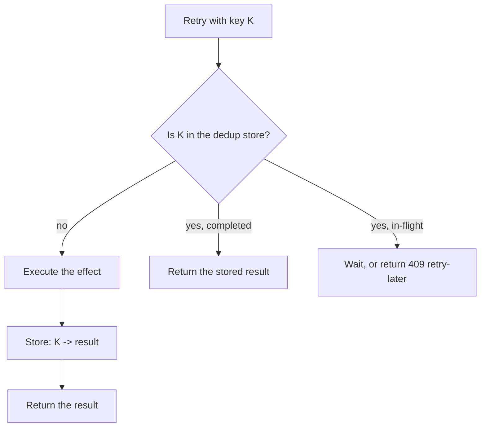

# Idempotency

> **Interview answer (say this first).** An operation is idempotent when running it many times has the same effect as running it once. Reads are usually naturally idempotent; writes depend on the operation (`SET balance = 100` is idempotent, `balance = balance + 100` is not). Side effects like charging a card or sending an email are made idempotent with an **idempotency key** — a unique, client-generated ID stored in a **dedup store** together with the operation's result. On a retry, the server finds the key and returns the stored result instead of repeating the effect. Idempotency is how you turn at-least-once delivery into exactly-once effects.

## Why this exists

Networks fail in the middle of work, and the caller cannot always tell whether the work happened.

Consider an agent step that calls a payment API. The request goes out. The connection times out. Two possibilities, indistinguishable to the agent:

- The payment never reached the server.
- The payment succeeded, but the response was lost.

If the agent retries blindly, a customer may be charged twice. If it does not retry, the customer may not be charged at all. There is no amount of clever client code that resolves the ambiguity, because the information simply is not there.

Now add more workers. A queue delivers the same message to two workers after a rebalance. Both run the step. Or a worker finishes the work and crashes before acknowledging, so the broker redelivers. Or a human clicks "Submit" twice because the page was slow. Every one of these produces a duplicate request.

Idempotency is the receiver's answer. The receiver remembers which logical operations it has already performed, so a duplicate is recognized and short-circuited. The caller is then free to retry as much as it wants, which is exactly what a reliable distributed system needs.

For AI agents the stakes are higher than for ordinary APIs, because an agent loop retries by design. The model proposes a tool call, the tool is slow, the orchestrator retries or the whole run is resumed from a checkpoint. Without idempotency, a resumed agent re-executes every side-effecting tool on the path to its checkpoint.

> **Note:**
>
> **The one-sentence purpose.** Idempotency lets a caller safely retry, because the receiver makes a duplicate request produce the same single effect.

## Start from zero

| Word | Plain meaning |
| --- | --- |
| **Idempotent** | Running it twice has the same effect as running it once. |
| **Pure function** | A function whose output depends only on its inputs and that changes nothing outside itself. Pure functions are side-effect-free, but not necessarily idempotent: `x + 1` is pure, yet applying it twice gives a different result. |
| **Side effect** | A change the outside world can observe: a charge, an email, a row written, a file deleted. |
| **Idempotency key** | A unique ID for one logical operation, usually generated by the client and sent on every retry. |
| **Dedup store** | The place that records which keys have been seen and what result they produced. Redis, a database table, or the service's own storage. |
| **Natural key** | A business identity that is already unique, such as `order_id`. Using it avoids inventing a second ID. |
| **Upsert** | Insert if absent, otherwise update (or do nothing). One statement that is safe to repeat. |
| **Unique constraint** | A database rule that rejects a second row with the same key. A cheap enforcement of dedup. |
| **Conditional write** | A write that only succeeds if a condition holds, such as "no row with this key exists." |
| **In-flight** | A request with this key has started but not finished. A duplicate must wait or be rejected, not run in parallel. |
| **Retry safety** | Whether it is safe to send the same request again after a timeout or failure. |
| **TTL** | Time to live. How long a dedup record is kept before it is deleted. |
| **At-least-once** | Delivery that can duplicate. The reason idempotency is necessary. |

Two distinctions to lock in early:

- **Idempotent is not the same as safe to retry.** A database delete is idempotent, but retrying it after a timeout may be pointless. Idempotency is about correctness, not about whether the retry is useful.
- **Idempotency is a property of the operation, not the transport.** Adding a header does nothing by itself. The server must actually check and store the key.

## The core idea

Think of an elevator call button. Press it once and the elevator is summoned. Press it ten more times and you do not summon ten elevators; the target state, "an elevator is coming to this floor," is already true. The button expresses a **desired state**, not a count of actions.

Now think of the ticket dispenser at a deli counter. Every press produces a new number. Pressing ten times creates ten tickets. The machine expresses an **action**, and actions accumulate.

Idempotent design moves operations from the ticket dispenser to the elevator button:

- "Charge this order" becomes "ensure this order has been charged", keyed on the order.
- "Append +100 to the balance" becomes "set the balance to 100 after applying operation X."
- "Send this email" becomes "ensure this notification with ID N has been sent."

The mental model is a **ledger of operations**, not a sequence of commands. Each operation has an identity. Applying the same identity twice is meaningless, like writing the same journal entry number twice.



The diamond is the whole idea. Everything else is about where you store the key, what you store with it, and how long you keep it.

A compact view of which operations are naturally idempotent:

| Operation | Idempotent? | Why |
| --- | --- | --- |
| `SELECT * FROM users WHERE id = 7` | Yes | Reads change nothing. |
| `UPDATE users SET name = 'Ada' WHERE id = 7` | Yes | Setting a value twice gives the same value. |
| `UPDATE users SET credits = credits + 10 WHERE id = 7` | **No** | Each run adds ten more. |
| `DELETE FROM users WHERE id = 7` | Yes | Deleting an absent row is still absent. |
| `INSERT INTO charges (...) VALUES (...)` | **No** | A second insert creates a second row. |
| `INSERT ... ON CONFLICT DO NOTHING` | Yes | The conflict is absorbed. |
| `POST /orders` with no key | **No** | `POST` means "create a new one." |
| `PUT /orders/42` | Yes | `PUT` sets a resource to a known state. |
| Send an email | **No** | You cannot un-send; the recipient sees two. |
| Charge a card | **No** | Money moves. Needs a provider-side idempotency key. |

Memorize the middle row. The increment is the classic idempotency bug, and it hides in counters, credits, quotas, retry counts, and token budgets.

## How it works

Walk through one idempotent request from the client's point of view.

1. **The client generates a key for the logical operation.** It must be stable across retries. A good key is `run-42/step-3` or a UUID created once before the first attempt. A bad key is `uuid4()` generated inside the retry loop, because every retry looks new.
2. **The client sends the request with the key** — a header, a field in the body, or part of the URL.
3. **The server looks the key up in the dedup store.** Three outcomes: missing, in-flight, or completed.
4. **If missing, the server claims the key atomically.** It writes a record with status `in_flight` using a conditional write (`SET NX`, `INSERT ... ON CONFLICT DO NOTHING`, `attribute_not_exists`). Atomicity matters: two servers may receive the duplicate at the same instant.
5. **The server performs the effect.** It calls the payment provider, writes the row, or sends the email.
6. **The server stores the result with the key** and marks the record `completed`.
7. **If the key was already completed, the server returns the stored result** without repeating the effect. The client gets the same answer it would have gotten the first time.
8. **If the key was in-flight, the server returns a conflict** (`409`) or waits briefly and retries the lookup. It must not run the effect in parallel with the first attempt.
9. **The dedup record expires after a TTL.** The TTL must be longer than the longest possible retry horizon, or a very late retry will re-run the effect.

The store is not just a set of seen keys. Storing the **result** is what lets a retry return the original response, which clients often need (for example, the charge ID). A set alone tells you "already done" but not what happened.

### Two ways to be idempotent

- **By construction.** Choose an operation whose repeated execution is naturally harmless: set a value instead of incrementing, delete by ID, upsert on a natural key. This is the cheapest fix because it needs no extra storage.
- **By deduplication.** Keep a record of operation IDs and skip repeats. This is necessary when the effect itself is not idempotent, such as an external charge or an email.

Prefer construction. Fall back to dedup when the effect leaves your system.

## The syntax you will use

Real production forms, from the client contract down to the storage.

**The HTTP contract: an idempotency key header.** This is the Stripe-style convention.

```http
POST /v1/charges HTTP/1.1
Idempotency-Key: 8f14e45f-ea3e-4b1e-9d3a-1c2b3a4d5e6f

{"amount": 500, "currency": "usd", "source": "tok_visa"}
```

A retry sends the **same** key. The server must return the original response, including the same charge ID, not create a second charge.

**Postgres: absorb the duplicate with a unique constraint.**

```sql
INSERT INTO charges (idempotency_key, order_id, amount)
VALUES ($1, $2, $3)
ON CONFLICT (idempotency_key) DO NOTHING
RETURNING id, created_at;
```

`RETURNING` gives the new row on the first attempt and nothing on a replay. Either way, one row exists.

**Redis: claim a key atomically with a TTL.**

```python
# NX = only set if absent; EX = expire in seconds. One round trip, atomic.
claimed = r.set(f"idem:{key}", "in_flight", nx=True, ex=86_400)
if not claimed:
    return replay_or_conflict(key)
```

`SET NX EX` is the simplest dedup lock. It also gives you expiry for free.

**DynamoDB: conditional write.**

```python
table.put_item(
    Item={"pk": f"IDEM#{key}", "status": "in_flight"},
    ConditionExpression="attribute_not_exists(pk)",   # fails if the key exists
)
```

The conditional expression is the atomic claim. A failed condition raises `ConditionalCheckFailedException`, which you treat as "duplicate."

**Kafka: idempotent producer.** This removes duplicates caused by the producer's own retries, keyed internally by `(producer id, sequence number)`.

```python
KafkaProducer(enable_idempotence=True, acks="all", max_in_flight_requests_per_connection=5)
```

This is broker-scoped. It does not make your downstream database write idempotent.

**SQLite / any SQL: idempotent upsert.** Safe to run repeatedly, no extra bookkeeping.

```python
conn.execute(
    "INSERT INTO subscriptions (user_id, plan) VALUES (?, ?) "
    "ON CONFLICT (user_id) DO UPDATE SET plan = excluded.plan",
    (user_id, plan),
)
```

Setting the plan twice is the same as setting it once. That is idempotency by construction.

**HTTP verbs carry an intent.** `PUT` and `DELETE` are expected to be idempotent; `POST` is expected to create. If you need a safe `POST`, add an idempotency key rather than pretending the request is something it is not.

## Examples: simple to real

**Example 1 — the increment bug.** The same retried request adds money twice.

```python
from dataclasses import dataclass

@dataclass
class Wallet:
    credits: int = 0

def add_credits(wallet: Wallet, amount: int) -> None:
    wallet.credits += amount          # NOT idempotent

def set_credits(wallet: Wallet, total: int) -> None:
    wallet.credits = total            # idempotent by construction

w = Wallet()
add_credits(w, 10)
add_credits(w, 10)
print(w.credits)                      # 20 — a retry silently double-adds

w = Wallet()
set_credits(w, 10)
set_credits(w, 10)
print(w.credits)                      # 10 — the retry is harmless
```

Prefer "set to a computed total" when you can compute the total from data you already trust.

**Example 2 — a dedup store turns at-least-once into exactly-once effects.**

```python
def process(deliveries: list[tuple[str, str]]) -> list[str]:
    """deliveries are (message_id, payload). The queue may repeat message_id."""
    seen: set[str] = set()
    effects: list[str] = []
    for message_id, payload in deliveries:
        if message_id in seen:
            continue                   # duplicate: skip the effect
        seen.add(message_id)
        effects.append(f"processed:{payload}")
    return effects

stream = [("m1", "pay"), ("m2", "pay"), ("m1", "pay"), ("m2", "pay")]
print(process(stream))                # ['processed:pay', 'processed:pay']
```

Four deliveries, two effects. That is the whole value of a dedup store.

**Example 3 — Redis as the dedup store, with response replay.** This is verified against `fakeredis`, the in-process Redis used in tests.

```python
import fakeredis

r = fakeredis.FakeRedis(decode_responses=True)

def charge(key: str, amount: int) -> str:
    stored = r.get(f"idem:{key}")
    if stored is not None:
        return f"replayed: {stored}"                 # return the original result
    won = r.set(f"idem:{key}", f"charged {amount}", nx=True, ex=86_400)
    if not won:                                      # lost the race; a peer claimed it
        return f"replayed: {r.get(f'idem:{key}')}"
    return f"charged {amount}"                       # the real side effect

print(charge("order-7", 500))     # charged 500
print(charge("order-7", 500))     # replayed: charged 500
```

Note what is stored: the **result**, not just a marker. The retry gets the same answer.

**Example 4 — in-flight duplicates need a third state.** Two workers receive the same key at the same time. One starts the effect; the other must not.

```python
from enum import Enum

class Status(Enum):
    IN_FLIGHT = "in_flight"
    DONE = "done"

class DedupStore:
    def __init__(self) -> None:
        self.records: dict[str, dict] = {}

    def begin(self, key: str) -> str:
        rec = self.records.get(key)
        if rec is None:
            self.records[key] = {"status": Status.IN_FLIGHT, "result": None}
            return "started"                 # caller now runs the effect
        if rec["status"] is Status.DONE:
            return f"replay:{rec['result']}"
        return "conflict"                    # in-flight: retry later, do not run

    def finish(self, key: str, result: str) -> None:
        self.records[key] = {"status": Status.DONE, "result": result}

store = DedupStore()
print(store.begin("op-1"))          # started
print(store.begin("op-1"))          # conflict
store.finish("op-1", "receipt-9")
print(store.begin("op-1"))          # replay:receipt-9
```

The `conflict` state is why real APIs return `409 Conflict` for a concurrent duplicate. Running both would defeat the purpose.

**Example 5 — idempotency by construction in SQL.** Verified with Python's built-in `sqlite3`.

```python
import sqlite3

conn = sqlite3.connect(":memory:")
conn.execute("CREATE TABLE charges (idempotency_key TEXT PRIMARY KEY, amount INTEGER)")

def charge(key: str, amount: int) -> int:
    cur = conn.execute(
        "INSERT INTO charges (idempotency_key, amount) VALUES (?, ?) "
        "ON CONFLICT(idempotency_key) DO NOTHING",
        (key, amount),
    )
    return cur.rowcount       # 1 = new charge, 0 = duplicate absorbed

print(charge("order-7", 500))   # 1
print(charge("order-7", 500))   # 0
print(conn.execute("SELECT COUNT(*) FROM charges").fetchone()[0])   # 1
```

No dedup table, no TTL, no race — the primary key is the dedup store. This is the cheapest correct design when you can express the operation as a keyed insert.

**Example 6 — retry safely with a stable key.** `tenacity` retries; the key does not change, so duplicates are harmless.

```python
from tenacity import retry, stop_after_attempt, wait_fixed, retry_if_exception_type

class Transient(Exception):
    pass

calls = {"n": 0}

@retry(stop=stop_after_attempt(3), wait=wait_fixed(0.01),
       retry=retry_if_exception_type(Transient), reraise=True)
def submit(key: str, payload: str) -> str:
    calls["n"] += 1
    if calls["n"] < 3:
        raise Transient("connection reset")
    return f"accepted:{key}"

print(submit("run-42/step-3", "send report"))   # accepted:run-42/step-3
print(calls["n"])                               # 3 attempts
```

The key is created once, outside the retry loop. On the server, the first two failed attempts either left no trace or are absorbed by the dedup store. This is the retry-safety pattern from chapter 14.

## In production

- **Generate the key once, before the first attempt.** A key created inside the retry loop makes every retry a new operation, which is the single most common idempotency bug.
- **Store the result, not just the key.** Clients need the original response (charge ID, created row) to make progress. A set of seen keys forces an awkward "already done, good luck" reply.
- **Claim the key atomically.** A read-then-write check has a race window where two workers both see "missing" and both run the effect. Use `SET NX`, a unique constraint, or a conditional write.
- **Handle the in-flight state.** A duplicate that arrives while the first attempt is running must wait or receive `409`, never execute in parallel.
- **Set the TTL longer than the longest retry.** Stripe keeps idempotency keys for 24 hours. If your retries can span a day (a resumed agent run), a 24-hour TTL is not long enough and a late retry re-runs the effect.
- **Idempotency records cost storage and add a write.** Every request now does an extra lookup and write, and the store grows. That is the correct trade at an effect boundary; it is the wrong trade for a pure read path.
- **Scope the key to the account or tenant.** A global key space lets one tenant's key collide with or probe another's. Namespace keys as `tenant:key`.
- **Do not make non-idempotent effects look idempotent.** An email provider's idempotency key stops a double send only within its own window. `Message-ID` headers help the receiver, but the realistic guarantee for email is at-least-once.
- **Beware the increment.** Counters, credits, quotas, token budgets, and "retry counts" are all `x = x + 1` under the hood. Convert them to idempotent set-based updates or gate them with an operation ID.
- **Log the key on both sides.** When a duplicate charge is investigated, the key is the only way to join the client attempt, the server record, and the provider's event.
- **Test the duplicate path explicitly.** Send the same request twice in an integration test and assert one effect. Most idempotency bugs are found this way, not in code review.
- **A dedup store can itself be a bottleneck.** A hot key (one global counter) serializes traffic. Partition by key, and keep the critical section as small as possible.

## Interview questions

### 1. What does idempotent mean, precisely?

**Answer.** An operation is idempotent if applying it more than once has the same effect as applying it once. It is a property of the operation's effect, not of the request. `SET x = 5` is idempotent; `x = x + 1` is not; sending an email is not.

**Follow-up: "Is a read idempotent?"** Yes, because it changes nothing. That is why retrying a GET is free and retrying a POST usually is not.

**Trap.** Confusing idempotent with "returns the same thing every time." A function can be idempotent but return different values; what matters is the effect on the world.

### 2. How do idempotency keys work?

**Answer.** The client generates a unique key for one logical operation and sends it with every retry. The server looks the key up in a dedup store. If absent, it claims the key atomically, performs the effect, stores the result, and returns it. If present and completed, it returns the stored result. If present and in-flight, it returns a conflict or waits.

**Follow-up: "Where should the key come from?"** The client, for external requests, so retries can reuse it. For internal event processing, the message ID or a derived business key works.

**Trap.** Putting the key generation inside the retry loop. Then each retry has a new key and nothing is deduplicated.

### 3. What is the difference between idempotency and exactly-once delivery?

**Answer.** Exactly-once delivery is a transport guarantee that cannot be achieved across an unreliable network. Idempotency is a receiver-side property that makes duplicate delivery harmless. Together, at-least-once delivery plus idempotent processing gives exactly-once **effects**, which is what actually matters.

**Follow-up: "Can you have idempotency without dedup storage?"** Yes, if the operation is idempotent by construction — an upsert on a natural key, a `PUT`, a delete by ID. Dedup storage is only needed when the effect itself is not naturally repeatable.

**Trap.** Saying "we use idempotency keys, so we have exactly-once delivery." You have exactly-once effects. Delivery is still at-least-once.

### 4. How long should you keep idempotency records?

**Answer.** At least as long as any retry of that operation can arrive. The TTL must exceed the maximum retry horizon, including manual retries and resumed workflows. Too short a TTL re-runs the effect; too long wastes storage. Common choices are 24 hours for request APIs and as long as the workflow for durable agent runs.

**Follow-up: "What happens after the TTL expires?"** A late duplicate looks brand new and re-runs the effect. If that is unacceptable, use a permanent unique key in the business table instead of a TTL cache.

**Trap.** Using a TTL because "the cache is temporary anyway." At an effect boundary, expiry is a correctness decision, not a caching decision.

### 5. How do you make an increment idempotent?

**Answer.** Stop expressing it as an increment. Either set the absolute value computed from trusted state (`SET balance = 100`), or attach the operation to a unique ID and apply it only once (a ledger of entries with a unique key, summed to get the total). A running counter with no operation boundary cannot be made idempotent after the fact.

**Follow-up: "What about a distributed counter that must increment?"** Use an idempotent application step: record each increment as a row with a unique operation ID, and derive the counter by aggregation. Redis `INCR` is not idempotent; a `SET` of a computed value, or a set of applied operation IDs, is.

**Trap.** Adding a dedup check around `INCR` but keeping the increment. If the check and the increment are not atomic with respect to the key, a race still double-counts.

### 6. What are common non-idempotent side effects, and how do you handle them?

**Answer.** Charges/payments (use the provider's idempotency key), emails and notifications (record the send in an outbox with a unique ID, accept at-least-once delivery, or use a provider-side dedup), file uploads and appends (make writes keyed or use object versioning), and counter updates (convert to set-based updates). The pattern is always: give the effect an identity and record it.

**Follow-up: "Why are emails special?"** Because the receiver sees the effect, and you cannot recall it. Even a correct server-side record cannot un-send a duplicate email, so the guarantee is inherently at-least-once; make the content safe to repeat.

**Trap.** Assuming a database transaction makes an external call idempotent. The transaction can roll back; the email or charge cannot.

### 7. How does an agent avoid re-running side-effecting tools after a resume?

**Answer.** Give every tool invocation an idempotency key derived from the run and step, persist the result in the agent's checkpoint or dedup store, and on resume check the key before executing. Side-effecting tools also carry their own keys so a duplicate call is safe even if the checkpoint is stale.

**Follow-up: "What if the tool has no idempotency support?"** Wrap it. Keep an outbox table of intended operations, execute them idempotently, and only advance the checkpoint after the effect is recorded. When in doubt, prefer read-only tools until the effect is required.

**Trap.** Resuming from a checkpoint that precedes the effect and re-executing every tool up to that point. Checkpoint ordering matters; record the effect and the checkpoint together.

### 8. What is the in-flight state and why does it matter?

**Answer.** A dedup record can be `in_flight` (claimed, effect running), `completed` (effect done, result stored), or absent. If a duplicate arrives while the first is in-flight, running it in parallel defeats the purpose. The server must return a conflict or wait and poll for completion.

**Follow-up: "What if the first attempt crashes while in-flight?"** The record is stuck. You need a lease or timeout on the in-flight state so another attempt can take over after the first is provably dead — the fencing-token problem from chapter 13.

**Trap.** Modeling the store as a simple boolean "seen". A boolean cannot distinguish "running" from "done" and induces either false success or parallel execution.

## Remember this

- **Idempotency means many executions, one effect.** It is about the world, not the response.
- **Increments are the classic bug; set absolute state or use a keyed ledger.**
- **Store the result and claim the key atomically** (`SET NX`, unique constraint, conditional write), or retries cannot replay the original answer and two workers may both execute.
- **TTL must exceed the retry horizon**, or a late duplicate re-runs the effect.
- **Generate the key once, outside the retry loop.** All other rules are easier than this one.
