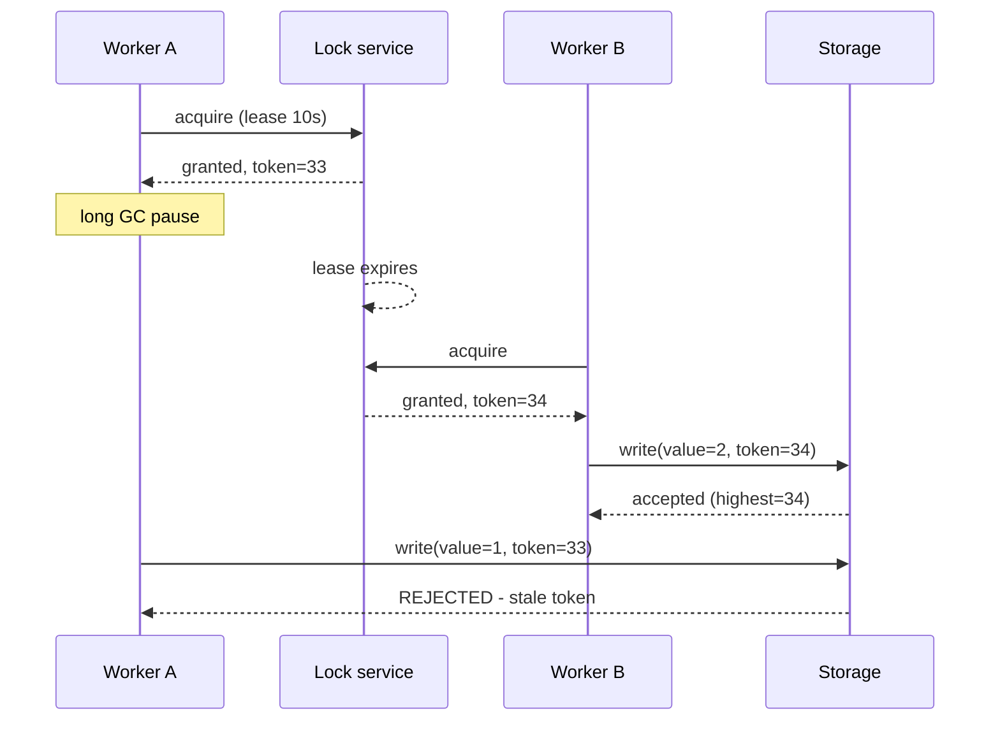

# Distributed Locks and Leader Election

> **Interview answer (say this first).** A distributed lock is a shared agreement that only one node runs a critical section at a time. The naive "write a key, delete it when done" version is unsafe, because a lock can expire while its holder is paused — a GC stop-the-world pause, a slow network, a process freeze — and a second holder starts while the first still believes it holds the lock. The fix is a **fencing token**: every lock grant carries a monotonically increasing number, and the protected resource rejects any operation carrying a token lower than one it has already seen. Prefer **leases** (locks with a TTL) over permanent locks. Leader election is the same problem with one winner; use a consensus system built on Raft or Paxos, not an ad-hoc "highest ID wins" algorithm. And often the strongest answer is to remove the need for a lock entirely with a single-writer design.

## Why this exists

Some work must happen exactly once, or strictly in order, and no amount of retrying and idempotency fixes that.

- A scheduled job that compiles a daily report must run on one node, not all twenty.
- A consumer must own a partition so its messages are processed in order by a single writer.
- A background compaction must not run twice and corrupt the same files.
- A leader must be unique so the cluster does not accept two conflicting decisions.

A single machine solves this with an operating-system mutex: one thread holds it, others wait. In a distributed system there is no shared memory, no kernel to arbitrate, and no reliable way to know whether another node is alive or merely slow. You have to build mutual exclusion out of messages and timeouts, and every timeout is a guess.

That guess is the danger. A lock with a 30-second lease does not mean "the holder cannot be running after 30 seconds." It means "if the holder has not renewed by 30 seconds, the lock service will let someone else in." If the first holder was frozen by a long garbage-collection pause, it will wake up still running its critical section, now with a competitor. Both believe they hold the lock. This is the central failure mode, and understanding it is what separates a candidate who has read about locks from one who has run them.

> **Note:**
>
> **The one-sentence purpose.** A lock tells you who *probably* is allowed to work; a fencing token tells the protected resource which worker's write is *actually* allowed to win.

## Start from zero

| Word | Plain meaning |
| --- | --- |
| **Coordination** | Getting independent nodes to agree on a shared fact, such as "who is the leader?" |
| **Mutual exclusion** | Only one actor is inside the critical section at a time. |
| **Critical section** | The code that must not run concurrently. |
| **Lock** | A token granting the right to enter the critical section. |
| **Lease** | A lock with an expiry time. It is released automatically if not renewed. |
| **TTL** | Time to live: how long a lease is valid before it expires. |
| **Expiry race** | The window where a lease has expired but the old holder has not noticed and keeps working. |
| **GC pause** | A stop-the-world garbage-collection pause. The process is frozen and does not learn that its lease expired. |
| **Fencing token** | A monotonically increasing number attached to each lock grant, used by the resource to reject stale holders. |
| **Clock skew** | Two machines disagree about the current time. Fatal for lock safety if not bounded. |
| **Consensus** | A protocol where a set of nodes agree on one value (or one leader) even when some fail. Raft and Paxos are examples. |
| **Quorum / majority** | More than half the nodes. Any two majorities overlap, which is why they are safe. |
| **Leader election** | Choosing exactly one node to act as coordinator. |
| **Split brain** | Two nodes both believe they are leader. Consensus protocols prevent it; ad-hoc ones do not. |
| **Term / epoch** | A monotonically increasing round number in Raft. A stale leader from an old term is rejected. |
| **Advisory lock** | A lock the database exposes to applications; it coordinates, but enforces nothing on its own. |
| **Single-writer pattern** | Design so that only one component is responsible for a piece of state, removing the need to lock. |
| **Compare-and-swap (CAS)** | Update a value only if it still equals the expected old value. The building block of lock-free coordination. |

Two distinctions to hold onto:

- **A lock is a performance optimization, not a correctness guarantee.** Correctness must come from the protected resource (fencing tokens, unique constraints, version checks). If a bug can occur when two holders overlap, the lock did not save you.
- **A lease is a bet on liveness, not a proof of death.** "The lease expired" means "we stopped hearing from you," not "you are stopped." You cannot know the difference without a fencing mechanism.

## The core idea

Picture a single restroom key at a gas station. There is exactly one key, so only one customer can be inside at a time. That works until the key-holder falls asleep. The attendant then makes a copy and hands it to the next impatient customer. Now two people believe they hold the only key. The mutual exclusion is gone.

The repair is a **display above the door that always shows the highest ticket number served**. When you enter, the door stamps you with the next number in sequence. If someone presents ticket 5 while the display already shows 7, the door refuses.

That display is a fencing token:

- The lock service hands out **increasing** numbers (1, 2, 3, …).
- The resource (database, storage, downstream API) remembers the **highest** number it has accepted.
- Any request with a **lower** number is rejected as stale.

The paused holder wakes up and tries to write with token 5. The resource has already served token 7, so it refuses. Two nodes ran the code, but only one effect landed. You cannot prevent the overlap; you make the overlap harmless. That is the same strategy as idempotency: accept the failure, neutralize its effect.



The story is in the last two arrows. The lock's expiry let a second worker in, but the storage's token check kept the stale write out.

## How it works

Follow one lease-based lock with fencing, end to end.

1. **Acquire with a TTL and a unique identity.** The client writes its lock key with `SET key <owner-token> NX PX <ttl>` (Redis) or a conditional row insert. `NX` means "only if absent," so exactly one client wins.
2. **The lock service returns a fencing token.** In a lock service designed for this, the token is a monotonic counter (or the lock's version number). A simple Redis lock can use a value derived from `INCR` on a shared counter per lock.
3. **The client does its work, passing the token to every write.** The downstream resource must understand the token. A token nobody checks is decoration.
4. **The client renews the lease while working.** A background heartbeat extends the TTL. This reduces, but does not eliminate, expiry races.
5. **If the client dies or pauses, the lease expires.** The lock service makes the lock available again.
6. **A second client acquires and receives a higher token.** It proceeds.
7. **The paused client wakes and attempts a write with its old, lower token.** The resource compares the token to the highest it has seen and rejects the write, or ignores it, or logs it.
8. **The client releases the lock only if it still owns it.** Release must be a compare-and-delete (`if value == my-token then delete`), not a blind delete, or a slow client will free someone else's lock.

Steps 2, 3, and 7 are the part most implementations skip, and they are the part that makes the lock safe.

### Leases instead of locks

A lock with no expiry can be held forever by a crashed process. Every practical distributed lock is therefore a lease:

- The holder promises to renew.
- The service promises to release after the TTL.
- The TTL is a trade-off: short TTLs recover quickly but expire during normal slowness; long TTLs are safer for the holder but leave the resource locked longer after a crash.

Leases are also how sessions, leader terms, and partition ownership are modeled. The lease is the primitive; the "lock" is a lease that a well-behaved client releases early.

### Redlock and its criticisms

**Redlock** is a Redis recipe for a lock across N independent Redis masters. The client tries to acquire on a majority; the lock has a validity time computed from the elapsed time, and a clock-drift factor. It was proposed as a safer alternative to a single Redis lock.

The criticism, most famously from Martin Kleppmann, is that Redlock does not solve the fundamental problem:

- It depends on **bounded clock drift**; a node whose clock jumps can violate the validity window.
- It has **no fencing tokens**, so a paused holder can still write after its lease expires.
- It assumes **independent failures** of the Redis nodes; correlated pauses (a VM freeze, a network partition) can break the majority assumption.

Antirez's reply is that Redlock is fine for efficiency locks (avoiding duplicate work) but not for correctness locks. Kleppmann's conclusion is the important one for interviews: **a lock used for correctness needs fencing tokens at the resource, regardless of how many Redis nodes you use.** If your lock is only an optimization, a single Redis `SET NX PX` is often enough. If it protects money, use a consensus system and fencing tokens.

### Leader election, high level

Leader election picks one coordinator so that decisions have a single source.

- **Bully algorithm.** The node with the highest ID becomes leader; nodes detect failures and hold an election. It is simple and was used in early systems, but it is **not partition-safe**: during a network split, each side can elect a leader, producing split brain.
- **Raft.** Nodes are followers, candidates, or leaders. Time is divided into **terms** (monotonic numbers). A follower that hears no heartbeat becomes a candidate, increments the term, and requests votes. It needs a **majority** to win. The leader replicates a log to followers and commits entries with a majority. A stale leader from an older term is rejected because its term is lower. This gives at most one leader per term, and a leader for the current term. etcd, Consul, and ZooKeeper (via ZAB, ZooKeeper's atomic-broadcast consensus protocol) implement equivalents.
- **Paxos.** The original consensus family. Same majority intuition, different mechanics. Raft is generally described as more understandable.

Use a consensus-backed election (etcd's lease + `Campaign`, or ZooKeeper ephemeral sequential nodes) rather than writing your own. The details of timeouts, term numbers, and log matching are exactly the kind of thing that is wrong in a home-grown version.

### When to avoid locks entirely

Locks add a dependency, a failure mode, and a latency hit. Many systems avoid them:

- **Single-writer by partitioning.** Kafka assigns each partition to exactly one consumer in a group. Ownership is the lock.
- **Unique constraints.** A `UNIQUE` index lets the database reject the duplicate; no lock needed.
- **Compare-and-swap.** Update only if the version matches; a conflict is retried.
- **Idempotent operations.** If a duplicate is harmless, you do not need mutual exclusion (chapter 12).
- **Queues as serializers.** Push work to a single-consumer queue instead of locking a shared resource.
- **Transactional outbox.** Let the database transaction be the coordinator.

The interview-safe framing: *a lock is one way to coordinate, but every lock is a potential outage. Prefer designs where only one writer ever exists.*

## The syntax you will use

**Redis: acquire with `SET NX PX`, release with a Lua compare-and-delete.** The Lua script makes the ownership check and the delete atomic.

```python
RELEASE_LUA = """
if redis.call('get', KEYS[1]) == ARGV[1] then
  return redis.call('del', KEYS[1])
else
  return 0
end
"""

def release(r, key, owner):
    return r.eval(RELEASE_LUA, 1, key, owner)   # 0 if we no longer own it
```

Blind `DEL` is wrong: a client whose lease expired would delete the new owner's lock.

**Redis: a per-lock fencing counter.** `INCR` gives every grant a higher number.

```python
def acquire(redis, lock_name, owner, ttl_ms=30_000):
    token = redis.incr(f"fence:{lock_name}")     # monotonic grant number
    # the lock value is the unique owner (so release can compare-and-delete);
    # the return value is the separate fencing token the resource checks
    ok = redis.set(f"lock:{lock_name}", owner, nx=True, px=ttl_ms)
    return token if ok else None
```

If `ok` is false, another holder owns the lock; the counter still advanced, which is safe because tokens only ever need to increase.

**etcd: a lease plus an election.** The lease is the TTL; `campaign` blocks until the node becomes leader.

```python
lease = etcd.lease(ttl=10)                 # server-side TTL
lease.refresh()                             # background heartbeat
election = etcd.election("report-leader", lease.id)
election.campaign("worker-3")               # returns when this node is leader
```

etcd uses Raft, so this is a real consensus-backed election with terms under the hood. ZooKeeper offers the same idea with ephemeral sequential nodes: the lowest sequence number becomes leader, and ephemeral nodes vanish when the session dies, so a crashed leader is removed automatically.

**Postgres: advisory lock.** Cheap mutual exclusion scoped to a database, but it is gone if the session ends — and it still needs fencing for correctness.

```sql
SELECT pg_try_advisory_lock(42);   -- true if we got it, false if someone else has it
-- ... critical section ...
SELECT pg_advisory_unlock(42);
```

**DynamoDB: a conditional write as a lease.** Atomic without a lock service.

```python
try:
    table.update_item(
        Key={"name": "report-lock"},
        UpdateExpression="SET holder = :h, expires = :e",
        ConditionExpression="attribute_not_exists(holder) OR expires < :now",
        ExpressionAttributeValues={":h": node, ":e": now + 30, ":now": now},
    )
except ClientError as e:
    # ConditionalCheckFailedException -> someone else holds it
    raise LockHeld from e
```

The condition is the compare-and-swap: only take the lock if it is free or expired.

## Examples: simple to real

**Example 1 — the blind-delete bug.** A lock released without checking ownership frees the wrong holder.

```python
class NaiveLock:
    def __init__(self) -> None:
        self.holder: str | None = None
    def acquire(self, name: str) -> bool:
        if self.holder is None:
            self.holder = name
            return True
        return False
    def release(self, name: str) -> None:
        self.holder = None          # BUG: ignores `name`

lock = NaiveLock()
lock.acquire("A")
lock.holder = None              # A's lease expired; B takes over
lock.acquire("B")
lock.release("A")               # A wakes and frees B's lock!
print(lock.holder)              # None -> C can now enter while B is working
```

A release must be conditional. This is why the Lua compare-and-delete exists.

**Example 2 — the expiry race that no lock key can fix.** A lease expires during a pause, so two workers overlap.

```python
class LeaseLock:
    def __init__(self, ttl: float) -> None:
        self.ttl = ttl
        self.holder: str | None = None
        self.expires_at = 0.0
    def acquire(self, name: str, now: float) -> bool:
        if self.holder is None or now >= self.expires_at:
            self.holder = name
            self.expires_at = now + self.ttl
            return True
        return False

lock = LeaseLock(ttl=10.0)
print(lock.acquire("A", now=0))       # True
# A pauses for 15 seconds (GC). B acquires at t=15.
print(lock.acquire("B", now=15))      # True -> now two workers think they hold it
```

From the lock service's point of view this is correct: the lease expired. From the data's point of view it is a disaster unless writes are fenced.

**Example 3 — fencing tokens make the overlap harmless.** Storage rejects a lower token.

```python
class FencedStorage:
    def __init__(self) -> None:
        self.highest_token = 0
        self.value: str | None = None
    def write(self, token: int, value: str) -> str:
        if token < self.highest_token:
            return f"REJECTED stale token={token} (< {self.highest_token})"
        self.highest_token = token
        self.value = value
        return f"accepted token={token}"

store = FencedStorage()
print(store.write(33, "A's result"))   # accepted token=33
print(store.write(34, "B's result"))   # accepted token=34
print(store.write(33, "A wakes up"))   # REJECTED stale token=33 (< 34)
print(store.value)                      # B's result
```

Two workers ran, one effect landed. This is the fix, and it lives in the **resource**, not the lock service.

**Example 4 — a correct Redis lock, verified with `fakeredis`.** Acquire with `NX PX`; release only if you still own the key.

```python
import fakeredis

r = fakeredis.FakeRedis(decode_responses=True)
RELEASE_LUA = """
if redis.call('get', KEYS[1]) == ARGV[1] then
  return redis.call('del', KEYS[1])
else
  return 0
end
"""

def acquire(key: str, token: str, ttl_ms: int = 30_000) -> bool:
    return bool(r.set(key, token, nx=True, px=ttl_ms))

def release(key: str, token: str) -> bool:
    return bool(r.eval(RELEASE_LUA, 1, key, token))

print(acquire("lock:job", "token-A"))      # True
print(acquire("lock:job", "token-B"))      # False
print(release("lock:job", "token-B"))      # False -> B cannot release A's lock
print(release("lock:job", "token-A"))      # True
print(acquire("lock:job", "token-C"))      # True
```

Run this with the `fakeredis[lua]` extra (`uv run --with 'fakeredis[lua]' python ...`); plain `fakeredis` raises `unknown command 'eval'`, because Lua scripting is only enabled by that extra.

Note there is still no fencing here. This lock is safe for efficiency (avoid duplicate work) and unsafe for correctness unless the downstream write is fenced.

**Example 5 — leader election on a lease.** One leader, re-elected when it stops renewing.

```python
class LeaderElection:
    def __init__(self, lease: float) -> None:
        self.lease = lease
        self.leader: str | None = None
        self.expires_at = 0.0
    def campaign(self, node: str, now: float) -> bool:
        if self.leader is None or now >= self.expires_at:
            self.leader = node
            self.expires_at = now + self.lease
        return self.leader == node
    def renew(self, node: str, now: float) -> bool:
        if self.leader == node:
            self.expires_at = now + self.lease
            return True
        return False

elect = LeaderElection(lease=5.0)
print(elect.campaign("A", now=0))    # True
print(elect.campaign("B", now=1))    # False
print(elect.renew("A", now=4))       # True -> A keeps leadership
print(elect.campaign("B", now=9))    # True -> A stopped renewing, B wins
```

A real system uses a consensus store for this so that a network partition cannot produce two leaders. The lease is the mechanism; consensus is what makes it safe.

**Example 6 — avoid the lock with a single-writer key.** The database itself guarantees one winner, so nothing needs to coordinate.

```python
import sqlite3

conn = sqlite3.connect(":memory:")
conn.execute("CREATE TABLE jobs (job_id TEXT PRIMARY KEY, owner TEXT)")

def claim(job_id: str, owner: str) -> bool:
    cur = conn.execute(
        "INSERT INTO jobs (job_id, owner) VALUES (?, ?) "
        "ON CONFLICT(job_id) DO NOTHING",
        (job_id, owner),
    )
    return cur.rowcount == 1     # exactly one caller gets True

print(claim("daily-report", "worker-A"))   # True
print(claim("daily-report", "worker-B"))   # False
```

The unique key is the lock, the database is the arbiter, and there is no TTL, clock, or fence to get wrong. This should be your first instinct, not your last.

## In production

- **A lock without a fencing check is an optimization.** Use it to avoid duplicate work, not to guarantee correctness. If two overlapping holders could corrupt data, fix the resource.
- **Release conditionally.** Compare-and-delete, never blind delete. The most common lock bug is a slow holder deleting the new holder's lock.
- **Renew the lease in a background task, and measure the pause.** If your GC pause or CPU stall can exceed the TTL, you have an expiry race. Either lengthen the TTL or add fencing — ideally both.
- **Keep the critical section short.** A lock held across a network call to an LLM is a lock held for seconds. Serialize the smallest possible unit of work.
- **A lock service is a new single point of failure.** If Redis or etcd is down, can your system make progress? Decide whether the lock is mandatory (availability drops) or advisory (proceed without it).
- **Clock skew breaks lease math.** Compute validity from monotonic time where possible, and never trust wall-clock comparison across machines for safety.
- **Redlock is not a correctness lock.** The bounded-clock-drift and no-fencing objections are well known. If the lock protects money, use consensus and fencing tokens.
- **Prefer consensus-backed elections.** etcd, Consul, and ZooKeeper implement Raft/ZAB and handle terms, quorums, and partitions. Hand-rolled bully election splits under partition.
- **Watch the network partition case.** A leader on the minority side of a partition must stop acting. Quorum-based protocols do this by refusing writes without a majority.
- **Fencing tokens must be checked at every write path.** A single unfenced code path (a cache write, a metrics write) can undo the protection.
- **Leases expire, so design for at-least-once execution.** Even with fencing, the old holder may have performed non-fenced side effects (an email). Combine with idempotency.
- **Single-writer and partitions beat locks.** Kafka consumer groups, unique constraints, and CAS are less code and fewer failure modes than a distributed lock.

## Interview questions

### 1. Why is a distributed lock harder than a local mutex?

**Answer.** A local mutex relies on shared memory and a kernel that knows whether a thread is alive. A distributed lock relies on messages and timeouts, and a timeout cannot distinguish a dead node from a slow one. A held lock can expire while its owner is paused, so two nodes may believe they hold it. Correctness therefore has to come from the protected resource, not the lock.

**Follow-up: "So are distributed locks useless?"** No. They are useful as efficiency locks (avoid duplicate work) and, combined with fencing tokens, as correctness locks. The mistake is trusting the lock alone.

**Trap.** Assuming a lock with a TTL gives mutual exclusion. It gives mutual exclusion only while the holder keeps renewing and never pauses past the TTL.

### 2. What is a fencing token and how does it fix the expiry race?

**Answer.** A fencing token is a monotonically increasing number granted with each lock acquisition. Every write to the protected resource carries the token, and the resource remembers the highest token it has accepted and rejects lower ones. A holder that was paused, lost its lease, and woke up will have a lower token than the new holder, so its write is rejected.

**Follow-up: "What if the resource has no token support?"** You must add a version check, a CAS, or a dedup key at that resource. If the resource truly cannot check anything, the lock cannot guarantee correctness.

**Trap.** Putting the token in the lock service but never passing it to the resource. An unchecked token does nothing.

### 3. Why do locks use leases instead of permanent ownership?

**Answer.** A permanent lock leaks forever if the holder crashes. A lease has a TTL, so the lock service can recover automatically after a timeout. The cost is the expiry race: a holder that pauses past the TTL can overlap with the next holder. TTL length is the trade-off between fast recovery and overlap risk.

**Follow-up: "How do you choose the TTL?"** Longer than the worst realistic pause plus renewal jitter, short enough that a crashed holder does not block work for long. Measure it; do not guess.

**Trap.** Reasoning only about crash time and forgetting pauses. GC and scheduler stalls are the usual cause of expired leases, not crashes.

### 4. What is wrong with Redlock?

**Answer.** It relies on bounded clock drift across nodes and provides no fencing tokens, so a paused holder can still write after its lease has (in real time) expired. It also assumes independent failures, which correlated pauses or partitions violate. It is acceptable for efficiency locks but not for correctness locks.

**Follow-up: "What would you use instead?"** A consensus-backed lock (etcd, ZooKeeper), and fencing tokens at the resource. Or redesign so the lock is not needed: single-writer assignment or a unique constraint.

**Trap.** Answering "Redlock is fine because it uses a majority of Redis nodes." Majority does not fix clock skew or missing fencing.

### 5. How does Raft elect a leader at a high level?

**Answer.** Nodes are followers, candidates, or leaders, and time is divided into monotonic terms. A follower that misses heartbeats becomes a candidate, increments the term, and asks for votes. It needs a majority to become leader. The leader heartbeats to suppress other candidates and replicates its log. A node with an older term is rejected, so at most one leader exists per term.

**Follow-up: "Why majority instead of all nodes?"** Any two majorities overlap in at least one node, so two leaders in the same term would need a node to vote twice. Majority also tolerates failures: a five-node cluster survives two failures.

**Trap.** Describing elections by "highest ID" (the bully algorithm). That is not consensus and produces split brain under partition.

### 6. What is split brain, and how do you prevent it?

**Answer.** Split brain is when two nodes both believe they are the leader, often after a network partition, and both accept writes. Prevent it with quorum: only the side with a majority may serve writes, and the minority side steps down. Consensus protocols enforce this with terms and majorities.

**Follow-up: "How does the minority side behave?"** It cannot commit anything, because it cannot reach a quorum. It should stop serving and report unavailability rather than risk divergence.

**Trap.** Using heartbeats alone to decide leadership. During a partition, each side stops hearing the other and may elect a leader unless a quorum rules it out.

### 7. When should you avoid a distributed lock entirely?

**Answer.** Whenever the system can be shaped so only one writer exists. Partition work by key and assign each partition to one consumer (Kafka consumer groups); rely on a database unique constraint; use compare-and-swap on a version; serialize through a single-consumer queue; or make the operation idempotent. Locks add a dependency and a failure mode, so the best lock is often no lock.

**Follow-up: "Give a concrete AI example."** Assign each agent run to one worker by run ID through a queue rather than locking shared agent state. The queue's partition assignment is the ownership mechanism.

**Trap.** Reaching for a lock first. Most "we need a lock" situations are really "we have two writers for one piece of state," which is a design fix.

### 8. How do locks interact with idempotency?

**Answer.** They solve different problems and combine well. A lock prevents concurrent execution; idempotency makes repeated execution harmless. Because leases expire and holders pause, a lock cannot prevent all repeats, so the operation behind it should still be idempotent. Fencing tokens stop stale writes; idempotency keys stop duplicate creates.

**Follow-up: "Which do you need for a payment?"** Both. A fence stops a stale holder from overwriting state, and an idempotency key stops a retried charge from doubling. Neither alone is sufficient.

**Trap.** Believing a lock makes retries unnecessary. A crash after the effect but before release means the work will be retried by the next holder.

## Remember this

- **A lease can expire while its holder is paused**, so two holders can overlap.
- **Fencing tokens fix the overlap**: increasing grant numbers, highest token wins at the resource.
- **Release locks conditionally**, never with a blind delete.
- **Use consensus, not ad-hoc tricks**: Redlock is only an efficiency lock, and leader election belongs to Raft terms and majorities.
- **The best lock is often no lock** — use single-writer, unique constraints, or CAS.
