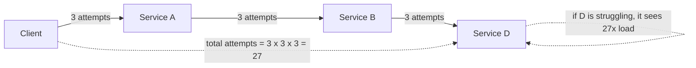

# Retries, Backoff, Jitter, and Timeouts

> **Interview answer (say this first).** Retrying is how you survive transient failures — a dropped connection, a leader election, a rate limit — but a naive retry loop turns a small outage into a large one. Retry only **idempotent** operations and only **transient** errors. Space attempts with **exponential backoff** and add **jitter** so thousands of clients do not retry in lockstep (a thundering herd). Set a **timeout on every network call**: connect, read, and a total deadline that is propagated to downstream calls. Cap retries with a **retry budget** so retries stay a small fraction of normal traffic. And remember that retries **multiply across layers**: three layers each retrying three times is twenty-seven attempts per user request. Most importantly, do not retry if the operation is not safe to repeat, if the deadline has passed, or if the downstream service is already overloaded.

## Why this exists

Distributed systems fail constantly and mostly briefly. A load balancer drops a connection, a database fails over, a service deploys a new version, a rate limiter returns 429, a garbage collection pause makes a call slow. These are not permanent problems; they resolve in milliseconds or seconds. Retrying is the cheapest way to hide them.

But a retry is extra load. If a service is already struggling, every client that retries makes it struggle more. When thousands of clients retry at the same instant — because they all failed at the same instant — you get a **thundering herd**: a spike far larger than the original traffic that can knock the service over again. This is why retries without backoff and jitter are dangerous.

Timeouts are the other half. A call with no timeout can block forever. A worker that blocks forever stops processing, its thread or connection is never freed, and slowly the whole pool is consumed. One slow dependency becomes a total outage. A missing timeout is not a style issue; it is a bug that guarantees a future incident.

The two topics belong together because retries without timeouts are unbounded, and timeouts without retries mean one blip fails a request. Together they define how a system absorbs failure without amplifying it.

> **Note:**
>
> **The one-sentence purpose.** Retries buy resilience; backoff, jitter, budgets, and deadlines stop retries from becoming the outage.

## Start from zero

| Word | Plain meaning |
| --- | --- |
| **Transient error** | A failure that will likely succeed if you try again shortly: a timeout, a reset connection, a 503. |
| **Permanent error** | A failure that will fail every time: a 400, a validation error, a missing resource. |
| **Idempotent** | Safe to repeat with the same effect. Retry only these, or use an idempotency key (chapter 12). |
| **Retry** | Sending the same request again after a failure. |
| **Backoff** | Waiting longer between each attempt. |
| **Exponential backoff** | Doubling the wait each attempt: 1s, 2s, 4s, 8s. |
| **Cap** | The maximum wait, so backoff does not grow without bound. |
| **Jitter** | Randomness added to the wait so clients do not retry together. |
| **Thundering herd** | A synchronized retry spike that overloads a recovering service. |
| **Retry budget** | A limit on retries as a fraction of total requests, so retries cannot dominate traffic. |
| **Retry storm** | A cascade where retries cause failures that cause more retries. |
| **Retry amplification** | The multiplication of attempts when several layers each retry. |
| **Timeout** | A maximum time to wait before giving up on a call. |
| **Connect timeout** | How long to wait for the TCP/TLS handshake to complete. |
| **Read timeout** | How long to wait for a response after the request is sent. |
| **Deadline** | An absolute time by which the whole operation must finish, shared across all downstream calls. |
| **Deadline propagation** | Passing the remaining deadline to each downstream call instead of granting a fresh timeout. |
| **Circuit breaker** | A guard that stops sending requests to a failing dependency for a while. |
| **Retry-After** | A header that tells the client how long to wait before retrying (used with 429 and 503). |

Two distinctions matter from the start:

- **A timeout is ambiguous.** A read timeout means "I did not hear back," not "it did not happen." The request may have succeeded. Retry only if the operation is idempotent.
- **A retry is a new request, not a continuation.** The server may see it as a brand-new call unless you send the same idempotency key.

## The core idea

Think of people calling a busy restaurant to book a table. The line is engaged. If everyone redials immediately, the line stays busy forever and the phone system collapses. If each person waits a random amount — some redial in 5 seconds, some in 40 — the calls spread out and the restaurant can answer them. That is **jitter**.

Now think of a queue of callers where the tenth caller gets a busy tone and tells the person behind them to call too. Each layer of callers multiplies the calls. That is **retry amplification**.

The mental model is a **budgeted, randomized, time-bounded** retry loop:

- **Budgeted:** retries are a small tax on real traffic, not a free action.
- **Randomized:** attempts spread out instead of synchronizing.
- **Time-bounded:** every attempt has a deadline, and the whole operation has one too.



The diagram is the argument for retrying at one layer only, and for propagating a deadline so the deepest call knows the time is nearly up.

A quick reference for which errors to retry:

| Error | Retry? | Why |
| --- | --- | --- |
| Connection reset / refused | Yes (with backoff) | Usually transient; the server may have restarted. |
| Connect timeout | Yes | The handshake never completed; no request was processed. |
| Read timeout | Only if idempotent | The request may have been processed; the reply was lost. |
| HTTP 429 Too Many Requests | Yes, after `Retry-After` | You are being asked to slow down. |
| HTTP 503 Service Unavailable | Yes, with backoff | Temporary overload or maintenance. |
| HTTP 500 Internal Server Error | Maybe, once | Could be transient, could be a bug. Budget it. |
| HTTP 400 Bad Request | No | The request is malformed; retrying repeats the mistake. |
| HTTP 401 / 403 | No | Fix the credentials or permissions. |
| HTTP 404 Not Found | No | The resource does not exist. |
| HTTP 409 Conflict | No (usually) | Resolve the state conflict first. |
| HTTP 422 Validation Error | No | The payload is wrong. |
| Deterministic parse / schema error | No | Same input, same failure, forever. |

## How it works

Follow one request through a well-behaved retry loop.

1. **The caller sets a total deadline.** For example, the user-facing request must finish in 2 seconds. This is the budget for everything.
2. **The caller sends the request with a timeout.** Connect timeout (say 200 ms) and read timeout (say 800 ms), both less than the remaining deadline.
3. **The call fails with a classified error.** The client decides: transient or permanent? Retryable or not? Is the operation idempotent?
4. **If permanent or unsafe, fail immediately.** Do not burn the deadline on a request that cannot succeed.
5. **If transient, compute the backoff.** `min(cap, base * 2 ** attempt)`, then apply jitter.
6. **Check the retry budget.** If the budget is exhausted, fail instead of retrying. This is what prevents a storm.
7. **Check the remaining deadline.** If `sleep + connect_timeout` exceeds the deadline, do not retry; fail now. A retry that cannot finish is just a slower failure.
8. **Sleep, then attempt again with the same idempotency key.** The key makes duplicates harmless.
9. **Give up after the attempt limit.** Return the last error, or fall back to a cached/default answer.
10. **Record the outcome.** Retry counts, attempt latency, and error classes are the signals that tell you whether the policy is working.

The subtle steps are 6, 7, and 8. Most retry bugs are a missing budget, a missing deadline check, or a fresh idempotency key per attempt.

### Backoff strategies

Exponential backoff alone is not enough; all clients still wake at the same times. Add jitter:

- **No jitter:** `min(cap, base * 2 ** attempt)`. Predictable, synchronized, herd-prone.
- **Full jitter:** `random(0, min(cap, base * 2 ** attempt))`. The most spread out; the AWS-recommended default.
- **Equal jitter:** `temp/2 + random(0, temp/2)`, where `temp = min(cap, base * 2 ** attempt)`. Keeps a guaranteed minimum wait while still spreading.
- **Decorrelated jitter:** `min(cap, random(base, previous_sleep * 3))`. Each wait depends on the last, which avoids the synchronized "all clients at the same doubling" pattern and adapts to the observed failure duration.

### Retry budgets and storms

A retry budget bounds retries as a fraction of successful traffic. A common policy is **10%**: for every 10 successful requests, the client may make 1 retry. This keeps the total load at most about 110% of normal, even during a partial outage. When the budget runs out, calls fail fast instead of piling on.

Budgets are usually enforced client-side with a token bucket (a counter that refills on success and is spent one token per retry), or server-side with a concurrency limit and 429s. Combine them with a circuit breaker: if a dependency is failing for everyone, stop sending entirely for a cooldown instead of retrying into the wall.

### Timeouts everywhere

Every network call needs at least two timeouts, and every request needs a total deadline:

- **Connect timeout.** Bound the handshake. A refused or black-holed host should not hold a worker.
- **Read timeout.** Bound the wait for a response after the request is sent. Without it, a hung server holds the connection indefinitely.
- **Write timeout** (where supported). Bound the time to send a large body.
- **Total deadline.** Bound the whole operation, including retries and downstream calls. This is the one that stops a chain of individually reasonable timeouts from adding up to minutes.

A missing timeout is a bug because it converts a slow dependency into an unbounded resource leak. Threads, connections, file descriptors, and memory are all held until the call returns. In a worker pool, enough stuck calls mean no capacity for healthy work.

### Deadline propagation

Give each hop the **remaining** time, not a fresh full timeout. If the client has 2 seconds, the first service has 1.8 seconds left, the next 1.5, and so on. gRPC makes this explicit with deadlines; HTTP systems pass it as a header or compute it from a start timestamp.

Without propagation, each hop can wait the full timeout. Ten hops × 1 second each is a 10-second request that the user abandoned after 2 seconds — all that work is wasted. With propagation, the deepest hop sees an expired deadline and fails immediately, freeing resources.

## The syntax you will use

**`tenacity`: retry a transient error with exponential backoff and jitter.** The decorator form is the most common.

```python
from tenacity import (retry, stop_after_attempt, wait_exponential_jitter,
                      retry_if_exception_type)

@retry(
    stop=stop_after_attempt(4),                       # 1 try + 3 retries
    wait=wait_exponential_jitter(initial=0.1, max=5), # backoff + jitter
    retry=retry_if_exception_type((TimeoutError, ConnectionError)),
    reraise=True,
)
def call_model(prompt: str) -> str:
    ...
```

`reraise=True` surfaces the real error after the last attempt instead of a generic retry error.

**`urllib3` / `requests`: a transport-level retry policy.** Applies to connection errors and chosen status codes.

```python
import requests
from requests.adapters import HTTPAdapter
from urllib3.util.retry import Retry

retry = Retry(
    total=3,
    backoff_factor=0.2,                 # sleeps 0.4s, 0.8s between tries (first retry is immediate)
    status_forcelist=[429, 500, 502, 503, 504],
    allowed_methods=["GET", "PUT", "DELETE"],   # only idempotent methods
    respect_retry_after_header=True,
)
session = requests.Session()
session.mount("https://", HTTPAdapter(max_retries=retry))
```

Note `allowed_methods`: the library defaults to idempotent verbs, and you should not casually add `POST` unless the endpoint supports idempotency keys.

**`httpx`: explicit connect and read timeouts.**

```python
import httpx

client = httpx.Client(
    timeout=httpx.Timeout(connect=0.5, read=2.0, write=2.0, pool=0.5),
)
```

A single float sets all of them; the object form lets you tune each phase.

**gRPC: a propagated deadline.** The deadline travels with the call to every downstream hop.

```python
import time
import grpc

deadline = time.time() + 1.5                     # absolute wall-clock budget
remaining = max(0.0, deadline - time.time())     # per-hop timeout = what is left
response = stub.Process(request, timeout=remaining)   # gRPC propagates the deadline
```

## Examples: simple to real

All examples are pure Python and run without external services.

**Example 1 — backoff and three jitter strategies.** Plain backoff synchronizes clients; jitter breaks the synchronization. Seeded for reproducibility.

```python
import random

def backoff(attempt: int, base: float = 0.1, cap: float = 10.0) -> float:
    return min(cap, base * (2 ** attempt))

print("no jitter", [round(backoff(i), 2) for i in range(6)])
# [0.1, 0.2, 0.4, 0.8, 1.6, 3.2]

def full_jitter(attempt: int, base: float = 0.1, cap: float = 10.0, rng=random) -> float:
    return rng.uniform(0, min(cap, base * 2 ** attempt))

def equal_jitter(attempt: int, base: float = 0.1, cap: float = 10.0, rng=random) -> float:
    high = min(cap, base * 2 ** attempt)
    return high / 2 + rng.uniform(0, high / 2)

def decorrelated_jitter(prev: float, base: float = 0.1, cap: float = 10.0, rng=random) -> float:
    return min(cap, rng.uniform(base, prev * 3))

rng = random.Random(42)
print("full  ", [round(full_jitter(i, rng=rng), 2) for i in range(5)])
print("equal ", [round(equal_jitter(i, rng=rng), 2) for i in range(5)])

prev = 0.1
seq = []
for _ in range(5):
    prev = decorrelated_jitter(prev, rng=rng)
    seq.append(round(prev, 2))
print("decor ", seq)
```

Every client that failed at the same moment retries at exactly the same moment without jitter. Full jitter can return near zero; equal jitter always waits at least half the backoff; decorrelated jitter wanders based on the previous wait. All three break synchronization.

**Example 2 — a retry budget stops a storm.** Successes refill tokens; retries spend them.

```python
class RetryBudget:
    def __init__(self, ratio: float = 0.1, burst: int = 10) -> None:
        self.ratio, self.burst, self.tokens = ratio, burst, float(burst)
    def record_success(self) -> None:
        self.tokens = min(self.burst, self.tokens + self.ratio)
    def allow_retry(self) -> bool:
        if self.tokens >= 1:
            self.tokens -= 1
            return True
        return False

budget = RetryBudget(ratio=0.1, burst=10)
for _ in range(100):
    budget.record_success()          # healthy traffic fills the budget
print(round(budget.tokens, 1))       # 10 (capped at burst)

allowed = sum(budget.allow_retry() for _ in range(50))
print(allowed)                       # 10 retries allowed, 40 denied
```

Once the dependency fails, successes stop, the budget drains, and only a bounded number of retries escape. That is the difference between a blip and an outage.

**Example 3 — retry amplification across layers.** Each layer multiplies the attempts.

```python
def total_attempts(layers: int, retries_per_layer: int) -> int:
    return (1 + retries_per_layer) ** layers

print(total_attempts(layers=3, retries_per_layer=2))   # 27
print(total_attempts(layers=4, retries_per_layer=3))   # 256
```

Three layers with two retries each turn one user request into 27 backend calls. Retry at one layer, usually the outermost, and propagate the deadline so inner layers fail fast.

**Example 4 — deadline propagation.** Nested calls spend the same total budget.

```python
import time

class Deadline:
    def __init__(self, seconds: float) -> None:
        self.expires = time.monotonic() + seconds
    def remaining(self) -> float:
        return max(0.0, self.expires - time.monotonic())
    def expired(self) -> bool:
        return self.remaining() <= 0.0

dl = Deadline(0.05)
print("hop1 remaining", round(dl.remaining(), 2) > 0)   # True
time.sleep(0.02)
print("hop2 remaining", round(dl.remaining(), 2) > 0)   # True
time.sleep(0.04)
print("hop3 expired", dl.expired())                     # True
```

The third hop sees no time left and should fail immediately rather than start work it cannot finish.

**Example 5 — `tenacity` retries a transient error, then succeeds.** Verified with the real `tenacity` package.

```python
from tenacity import (retry, stop_after_attempt, wait_exponential_jitter,
                      retry_if_exception_type)

class Transient(Exception):
    pass

attempts = {"n": 0}

@retry(stop=stop_after_attempt(5),
       wait=wait_exponential_jitter(initial=0.001, max=0.01),
       retry=retry_if_exception_type(Transient),
       reraise=True)
def flaky() -> str:
    attempts["n"] += 1
    if attempts["n"] < 3:
        raise Transient("upstream reset")
    return "ok"

print(flaky(), attempts["n"])   # ok 3
```

Two failures were absorbed; the third attempt succeeded. A permanent error would not match `retry_if_exception_type` and would fail immediately.

**Example 6 — a total deadline cancels a slow call.** `asyncio.wait_for` raises `TimeoutError` and cancels the task.

```python
import asyncio

async def slow() -> str:
    await asyncio.sleep(1.0)
    return "too late"

async def main() -> None:
    try:
        await asyncio.wait_for(slow(), timeout=0.02)
    except TimeoutError:
        print("call cancelled: deadline exceeded")

asyncio.run(main())
```

Without the timeout, this call would hold a task for a full second no matter how impatient the caller was.

## In production

- **Retry only idempotent operations.** If the effect is not repeatable, attach an idempotency key (chapter 12) or do not retry. A read timeout on a charge is the classic trap: it may already have succeeded.
- **Classify errors before retrying.** Retry connection failures, 429, and 503; do not retry 400, 401, 403, 404, or validation errors. A retry loop around a permanent error just wastes the deadline.
- **Always add jitter.** Exponential backoff without jitter synchronizes clients and causes the very herd you were trying to avoid. Full jitter is a good default.
- **Bound the total attempts and the total time.** Two limits, not one. Attempt count caps work; deadline caps latency.
- **Set a timeout on every call.** Connect, read, and total. A missing timeout is an unbounded resource leak and a guaranteed incident.
- **Propagate deadlines, do not reset them.** Pass the remaining time downstream. Ten hops with independent one-second timeouts can burn ten seconds for a request the user gave up on.
- **Budget retries at about 10% of traffic.** Without a budget, a partial outage can double or triple load exactly when the system can least afford it.
- **Retry at one layer.** Pick the outermost layer that owns the deadline and let inner layers fail fast. Multi-layer retries multiply into hundreds of attempts.
- **Honor `Retry-After`.** When a server says how long to wait, wait at least that long. Ignoring it escalates a rate limit into a ban.
- **Do not retry into an open circuit.** If the circuit breaker says the dependency is down, fail fast; retrying defeats the breaker.
- **Make retries visible.** Count attempts, retries, and final failures per dependency. A rising retry rate is an early warning of a degrading service.
- **Test the retry path.** Inject a transient failure in a test and assert the operation still completes once. Retry bugs are invisible until an outage.

## Interview questions

### 1. Which errors are safe to retry?

**Answer.** Transient errors on idempotent operations: connection resets and refused connections, connect timeouts, HTTP 429, 503, and sometimes 500. Permanent errors — 400, 401, 403, 404, 422, and schema/validation failures — should fail immediately. A read timeout is ambiguous: the request may have succeeded, so retry it only when the operation is idempotent or carries an idempotency key.

**Follow-up: "What about a 500?"** Retry once or twice with backoff. It may be a transient bug or an overloaded instance, but it may also be deterministic; the budget and attempt cap stop an infinite loop.

**Trap.** Retrying every non-2xx status. That turns a permanent client error into wasted time and load, and it can duplicate a non-idempotent write.

### 2. Why is exponential backoff not enough on its own?

**Answer.** Because all clients fail at the same time and therefore back off to the same schedule. Without jitter they retry in synchronized waves, which recreates the spike. Jitter randomizes each client's wait so the retries spread out.

**Follow-up: "Which jitter?"** Full jitter (`random(0, backoff)`) spreads the most; equal jitter keeps a minimum wait; decorrelated jitter adapts based on the previous sleep. Any is far better than none.

**Trap.** Adding a fixed small delay instead of jitter. A constant delay is still synchronized across clients.

### 3. What is a retry budget and why does it matter?

**Answer.** A retry budget caps retries as a fraction of normal traffic, often 10%. A token bucket refills on successful requests and spends a token per retry. When a dependency fails and successes stop, the budget drains and retries stop, so the client cannot amplify an outage. It is the client-side counterpart to a circuit breaker.

**Follow-up: "What happens when the budget is empty?"** The call fails fast with the last error. That is correct: better to shed load and surface the failure than to pile on and extend the outage.

**Trap.** Thinking retries are free. Every retry is real load on an already-struggling service.

### 4. What is retry amplification, and how do you prevent it?

**Answer.** When several layers each retry, attempts multiply: three layers with three attempts each produce 27 backend calls per user request. Prevent it by retrying at one layer, propagating deadlines so inner layers know the time is nearly gone, and using retry budgets at each layer. Often the right choice is to retry only at the edge, closest to the user.

**Follow-up: "Why is the edge the right place?"** It has the full context and the user-facing deadline, and it can decide whether a retry is worth the remaining time. Inner layers should fail fast.

**Trap.** Adding retries at every layer "for safety." Each addition multiplies load during exactly the incident when load matters most.

### 5. Why is a missing timeout a bug?

**Answer.** Because it lets a slow or hung dependency hold resources forever. Threads, connections, and memory stay allocated until the call returns, so enough stuck calls exhaust the worker pool and take down the healthy parts of the system. A timeout converts an unbounded wait into a bounded failure you can retry or shed.

**Follow-up: "Which timeouts do you set?"** A connect timeout, a read timeout, and an overall deadline for the operation. The deadline must be shorter than the caller's, and propagated downstream.

**Trap.** Setting only a socket timeout and believing you are safe. A chain of individually bounded calls can still exceed the user's deadline, so you also need a total budget.

### 6. What is deadline propagation and why does it matter?

**Answer.** It passes the remaining time budget from caller to callee instead of granting each hop a fresh full timeout. The deepest hop sees how much time is actually left and fails immediately if the deadline has passed. Without it, each hop can wait its full timeout and the total latency becomes the sum of all hops, wasting work the user has already abandoned.

**Follow-up: "How do you implement it over HTTP?"** Send a deadline header (or a start timestamp and budget) and have each service subtract elapsed time before calling downstream. gRPC has deadlines built into the call context.

**Trap.** Giving each retry a fresh timeout. A retry that starts with a full timeout can overshoot the overall deadline and return a result nobody is waiting for.

### 7. How do retries interact with idempotency?

**Answer.** Retrying is only safe when the operation is idempotent or carries an idempotency key. A read timeout does not tell you whether the request was processed, so a retry can duplicate a non-idempotent effect. The idempotency key lets the server recognize the retry and return the original result.

**Follow-up: "What key do you send on a retry?"** The same key as the first attempt, generated once before the loop. A new key per attempt defeats the purpose entirely.

**Trap.** Assuming an HTTP client's automatic retries are safe. Many libraries retry POST by default, which can double-create resources.

### 8. When should you not retry?

**Answer.** When the operation is not idempotent and has no key; when the error is permanent (4xx, validation); when the deadline has already passed or cannot fit another attempt; when the circuit breaker is open; and when the failure is caused by overload, where retrying makes it worse. In those cases, fail fast or fall back.

**Follow-up: "What is the fallback?"** A cached response, a default value, a degraded mode, or a clear error to the user. Graceful degradation is often better than a long retry loop.

**Trap.** Retrying a request that already exceeded the user's patience. The user is gone; the retry only adds load.

## Remember this

- **Retry only idempotent operations and transient errors.** A read timeout is ambiguous, not a failure.
- **Backoff plus jitter**: without jitter, clients synchronize and recreate the spike.
- **Bound retries twice** — by attempt count and by total deadline.
- **Every call needs a timeout**, and the deadline must propagate downstream.
- **Retry at one layer and budget it (~10%)**; don't retry when the deadline has passed, the circuit is open, or the service is overloaded.
