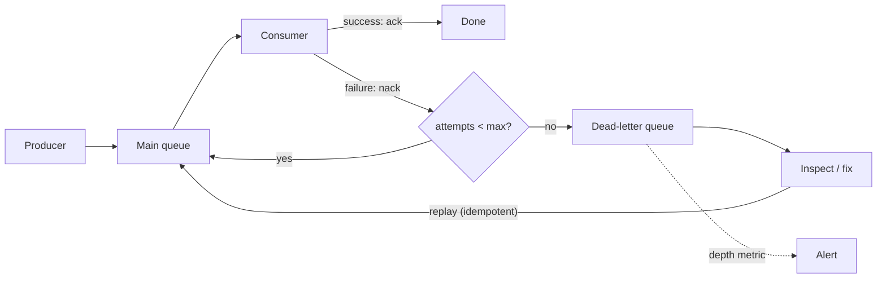

# Dead-Letter Queues

> **Interview answer (say this first).** A dead-letter queue (DLQ) is a separate queue where messages go after they fail too many times. It exists because some messages are **poison** — they fail every time, no matter how often they are retried. Without a DLQ, a poison message is redelivered forever, blocking the queue or partition and starving healthy work. The DLQ sets that message aside so a human or a repair job can inspect it, fix the cause, and replay it. The key ingredients are a **max receive count** (how many attempts before giving up), **alerting** on DLQ depth, **enrichment** so the message is debuggable, and a safe, **idempotent replay** path. A DLQ is not a graveyard; it is a worklist.

## Why this exists

At-least-once delivery has a failure mode that retries cannot solve: a message that is wrong.

Consider a worker that parses a job message into a Pydantic model (Pydantic is a Python library that validates raw data into typed objects). One message has a field that is the wrong type, or references a customer that does not exist, or uses a schema version the worker no longer understands. Every attempt raises the same exception. The worker does not acknowledge, so the broker redelivers. The worker fails again. This repeats forever.

Two bad things happen:

- The message is **never processed**, so whatever it represented never completes.
- Worse, it **blocks progress**. On a single-consumer queue it occupies the worker. On a Kafka partition, the consumer cannot advance its offset past the bad record, so every later message in that partition waits behind it. One malformed byte stalls a whole stream.

Retrying harder does not help. Backoff just slows the loop; it does not make the message valid. The system needs a way to say "we tried enough; set this aside and keep moving." That is the DLQ.

For AI agents this shows up constantly. A tool call returns a response the parser cannot handle; a model produces malformed JSON; a referenced document was deleted; an upstream API changed its schema. A DLQ turns an unbounded stall into a finite, visible, fixable backlog.

> **Note:**
>
> **The one-sentence purpose.** A DLQ caps retries so one bad message cannot block the queue forever, and it preserves that message so it can be diagnosed and replayed.

## Start from zero

| Word | Plain meaning |
| --- | --- |
| **Poison message** | A message that always fails, no matter how many times it is tried. |
| **Dead-letter queue (DLQ)** | A queue for messages that exhausted their retries. Also called a dead-letter queue, dead-letter topic, or DLT. |
| **Dead-letter exchange (DLX)** | RabbitMQ's routing rule that sends failed or expired messages to a DLQ. |
| **Max receive count** | The number of delivery attempts allowed before a message is dead-lettered (SQS term). |
| **Delivery limit** | The same idea in RabbitMQ quorum queues (`x-delivery-limit`). |
| **Receive count** | How many times this message has been delivered. Attached by the broker. |
| **Redrive policy** | The SQS configuration that names the DLQ and the max receive count. |
| **Redrive / replay** | Moving messages from the DLQ back to the source queue for another attempt. |
| **Retry topic** | A Kafka pattern: failed records move through retry topics with increasing delay, then to a DLT. |
| **Visibility timeout** | How long a message stays invisible after being received. If not deleted in time, it is redelivered. |
| **Ack** | Confirming success, which removes the message. |
| **Nack / reject** | Reporting failure, which triggers redelivery or dead-lettering. |
| **Enrichment** | Adding metadata (error, attempts, trace ID, original queue) so a dead letter is debuggable. |
| **Alerting threshold** | The DLQ depth at which an operator is paged. |
| **Dropping** | Deleting a message without processing. The opposite of preserving it. |

Three distinctions to hold:

- **A DLQ is a queue, not a folder.** It should be drained by a process, not left to grow. An unread DLQ is a silent outage.
- **A DLQ is not for permanent failures only.** It is for any message that exhausted its retry policy, transient or not. The point is to stop the loop.
- **A DLQ is not a substitute for validation.** If you can reject a bad message before publishing it, do that. The DLQ is the safety net, not the plan.

## The core idea

Think of a customer-support ticket that no agent can resolve. If it stays in the front of the queue, every agent picks it up, fails, and puts it back — and no other ticket ever gets served. The fix is not to keep trying; it is to move it to an "escalations" folder after three attempts, let the queue flow, and have a specialist review the escalations each day.

The DLQ is the escalations folder. The max receive count is the "after three attempts" rule. The alert is the specialist noticing the folder is filling up.

The crucial property is **bounded work per message**. Retrying is bounded by the attempt limit, and the message then leaves the hot path. No message can consume infinite worker time.



The loop on the left is bounded by `max`. The path through the DLQ is where humans and repair jobs live.

A quick decision table for a failed message:

| Option | When to use it | Risk |
| --- | --- | --- |
| **Retry** | Transient error, attempts remain, operation is idempotent. | Retry storms, duplicate effects. |
| **Dead-letter** | Retries exhausted, message may be fixable, you must not lose it. | DLQ grows unseen; replay may be unsafe. |
| **Drop** | The message is provably worthless: expired, superseded, invalid by policy. | Silent data loss. Never the default. |

The interview-safe rule: **retry while it is useful, dead-letter when it is not, and drop only with an explicit, audited reason.**

## How it works

Follow one message from a transient failure to a replay.

1. **The message is published.** The broker stores it and tracks a receive count (or the delivery attempt).
2. **A consumer receives it.** The message becomes invisible for the visibility timeout, or a delivery attempt is recorded.
3. **The handler fails.** It does not ack. It nacks, rejects, or simply lets the visibility timeout expire.
4. **The broker increments the attempt count.** If the count is below `max receive count`, the message is redelivered (often after a delay).
5. **The handler fails again.** The loop continues until the count reaches the limit. Backoff and jitter (chapter 14) space the attempts so the loop is not hot.
6. **The count reaches the limit.** The broker moves the message to the DLQ. This is the dead-lettering event.
7. **The main queue advances.** The poison message no longer blocks later messages. This is the whole point.
8. **The DLQ depth is monitored.** A metric crosses the alert threshold and pages an operator.
9. **The operator inspects the dead letter.** They read the payload, the error, the attempt count, and the trace ID.
10. **They fix the cause** — a code bug, a schema mismatch, a missing reference, or a one-off bad record — and **replay** the message to the source queue.
11. **The replay is idempotent.** If the original attempt had a partial effect, the replay must not duplicate it (chapter 12).

Steps 8 through 11 are the part teams forget. A DLQ with no alert is an outage waiting to be discovered by a customer. A DLQ with no replay path is a graveyard. A replay that is not idempotent creates a second incident.

### Retry vs DLQ: choose deliberately

- **Transient errors** (timeout, 503, connection reset) belong in the retry loop. They often succeed on the next attempt.
- **Permanent errors** (schema mismatch, 404, validation) should go to the DLQ quickly, sometimes after a single attempt. Retrying them wastes time.
- **Ambiguous errors** (a tool returned something unparseable) are worth a couple of retries, because the next call may return valid data. Then dead-letter.

Some systems route through **tiered retry topics**: a fast retry after 1 second, a slower one after 30 seconds, then the DLQ. This keeps short blips out of the DLQ while still bounding total attempts.

### DLQ vs dropping

Dropping is sometimes correct — an event for a deleted account, a metric that is 3 hours stale, a duplicate already handled. But dropping must be:

- **Explicit**, in code, with a named reason.
- **Logged and counted**, so you can see how much you dropped.
- **Never the fallback** when the queue is full or the handler is confused.

A DLQ preserves optionality. You can always decide later to drop what is in the DLQ; you cannot recover what you dropped.

### Designing debuggable payloads

A dead letter with just `{"id": 7}` is almost useless. Include enough context to reproduce the failure without re-running the whole system:

- The **original payload** exactly as published.
- The **message ID and a correlation/trace ID**.
- The **error type and message**, and a stack trace or error code.
- The **attempt count and first/last failure timestamps**.
- The **source queue/topic and the consumer name/version**.
- The **schema version** of the payload.
- The **agent run/step ID** for AI workloads, so you can find the whole trajectory.

This metadata turns a mystery into a five-minute diagnosis. It also makes replay possible: you know what to fix and where to send it back.

## The syntax you will use

**SQS: a redrive policy with a DLQ.** The queue sends messages to the DLQ after five receives.

```json
{
  "RedrivePolicy": {
    "deadLetterTargetArn": "arn:aws:sqs:us-east-1:123456789012:jobs-dlq",
    "maxReceiveCount": "5"
  },
  "VisibilityTimeout": "60"
}
```

To replay, you can start a redrive task from the DLQ back to the source queue, or move messages yourself with a small consumer.

**RabbitMQ: a dead-letter exchange.** Failed, rejected, or expired messages are routed to the DLX.

```python
channel.exchange_declare(exchange="jobs.dlx",           # the dead-letter exchange
                         exchange_type="direct", durable=True)

channel.queue_declare(
    queue="jobs",
    durable=True,
    arguments={
        "x-queue-type": "quorum",
        "x-delivery-limit": 5,                       # max attempts before DLX
        "x-dead-letter-exchange": "jobs.dlx",
        "x-dead-letter-routing-key": "jobs.dead",
    },
)
channel.queue_declare(queue="jobs.dead", durable=True)
channel.queue_bind(queue="jobs.dead", exchange="jobs.dlx", routing_key="jobs.dead")
```

`queue_declare` does not create the `jobs.dlx` exchange or bind `jobs.dead` to it; without the `exchange_declare` and `queue_bind` above, dead letters are published to a non-existent exchange and silently dropped. `x-delivery-limit` is the RabbitMQ equivalent of `maxReceiveCount`. Without it, a `basic_nack(requeue=True)` loops forever.

**Kafka: retry topics and a dead-letter topic.** Kafka has no built-in DLQ, so the pattern is explicit: failed records are produced to a retry topic, then to a DLT.

```python
TOPIC = "agent-jobs"
RETRY_1, RETRY_2, DLT = "agent-jobs.retry.1s", "agent-jobs.retry.30s", "agent-jobs.dlt"

def on_failure(record, attempts: int):
    if attempts == 1:
        producer.send(RETRY_1, record.value)
    elif attempts == 2:
        producer.send(RETRY_2, record.value)
    else:
        producer.send(DLT, value=record.value,
                      headers=[("x-error", str(error).encode()),
                               ("x-attempts", str(attempts).encode())])
    # only commit the original offset after routing the failure
```

The consumer commits the original offset only after the failed record has been safely routed, so nothing is lost. Retry topics add delay between attempts without blocking the main partition.

**Redis Streams: the pending entries list is the retry mechanism.** Claim un-acked messages after a timeout, and move them to a DLQ stream after N deliveries.

```python
MAX_ATTEMPTS = 3

# Reclaim messages idle for more than 30s (a dead worker's pending entries).
claimed = r.xautoclaim("jobs", "agents", "worker-2", min_idle_time=30_000)
for entry_id, fields in claimed[1]:
    pending = r.xpending_range("jobs", "agents", entry_id, entry_id, 1)
    delivered = pending[0]["times_delivered"] if pending else 1

    if delivered >= MAX_ATTEMPTS:                      # exhausted: move to the DLQ
        r.xadd("jobs.dlq", {"payload": str(fields), "error": "parse",
                            "id": entry_id, "attempts": delivered})
        r.xack("jobs", "agents", entry_id)             # remove from the pending list
        continue

    try:
        handle(fields)
        r.xack("jobs", "agents", entry_id)
    except Exception:
        pass      # leave it pending: the next claim retries it until MAX_ATTEMPTS
```

`xautoclaim` is how another worker picks up a dead worker's un-acked messages. The delivery count comes from `XPENDING` (`times_delivered`); only when it reaches `MAX_ATTEMPTS` does the message move to `jobs.dlq`, so a first failure is retried rather than dead-lettered.

## Examples: simple to real

All examples are pure Python simulations of a broker, so they run without SQS or Kafka.

**Example 1 — a poison message loops forever without a DLQ.** The broker never gives up.

```python
from collections import deque

class InfiniteBroker:
    def __init__(self) -> None:
        self.queue: deque[tuple[str, str]] = deque()
        self.receive_counts: dict[str, int] = {}
    def publish(self, msg_id: str, body: str) -> None:
        self.queue.append((msg_id, body))
        self.receive_counts[msg_id] = 0
    def receive(self):
        return self.queue.popleft() if self.queue else None
    def nack(self, msg_id: str, body: str) -> None:
        self.receive_counts[msg_id] += 1
        self.queue.append((msg_id, body))          # always redeliver

broker = InfiniteBroker()
broker.publish("m2", "poison")
for _ in range(5):
    msg_id, body = broker.receive()
    broker.nack(msg_id, body)                       # handler keeps failing
print(broker.receive_counts["m2"], len(broker.queue))   # 5 1 -> still stuck
```

Five attempts and the queue still holds the same message. This is the stall a DLQ prevents.

**Example 2 — a max receive count moves the poison message to the DLQ.** Healthy messages still get through.

```python
from collections import deque

class Broker:
    def __init__(self, max_receive: int) -> None:
        self.queue: deque[tuple[str, str]] = deque()
        self.dlq: list[tuple[str, str, int]] = []
        self.max_receive = max_receive
        self.receive_counts: dict[str, int] = {}
    def publish(self, msg_id: str, body: str) -> None:
        self.queue.append((msg_id, body))
        self.receive_counts[msg_id] = 0
    def receive(self):
        return self.queue.popleft() if self.queue else None
    def nack(self, msg_id: str, body: str) -> None:
        self.receive_counts[msg_id] += 1
        if self.receive_counts[msg_id] >= self.max_receive:
            self.dlq.append((msg_id, body, self.receive_counts[msg_id]))
        else:
            self.queue.append((msg_id, body))

def handle(body: str) -> str:
    if body == "poison":
        raise ValueError("cannot parse payload")
    return f"ok:{body}"

broker = Broker(max_receive=3)
for mid, body in [("m1", "good"), ("m2", "poison"), ("m3", "good")]:
    broker.publish(mid, body)

handled: list[str] = []
while (item := broker.receive()) is not None:
    msg_id, body = item
    try:
        handled.append(handle(body))
    except ValueError:
        broker.nack(msg_id, body)

print(handled)         # ['ok:good', 'ok:good'] -> the good messages got through
print(broker.dlq)      # [('m2', 'poison', 3)] -> the poison message is set aside
```

The good messages completed; the bad one is isolated with its attempt count.

**Example 3 — enriched dead letters are debuggable.** Compare a bare payload with a full envelope.

```python
import time

def dead_letter_bare(payload: dict) -> dict:
    return payload                                  # no idea what went wrong

def dead_letter_enriched(payload: dict, error: Exception, attempts: int,
                         trace_id: str) -> dict:
    return {
        "payload": payload,
        "error": {"type": type(error).__name__, "message": str(error)},
        "attempts": attempts,
        "first_failed_at": time.time() - 120,
        "last_failed_at": time.time(),
        "source": "agent-jobs",
        "consumer": "job-worker@2.4.1",
        "schema_version": 3,
        "trace_id": trace_id,
    }

print(dead_letter_bare({"id": 7}))
print(dead_letter_enriched({"id": 7}, ValueError("missing field 'prompt'"),
                           3, "trace-abc"))
```

The second record tells you what failed, where, how often, and which version of the consumer saw it. That is the difference between a five-minute fix and a multi-hour investigation.

**Example 4 — replay is safe because it is idempotent.** Re-processing the DLQ does not duplicate effects.

```python
def replay(dlq: list[tuple[str, str, int]], applied: set[str]) -> list[str]:
    results = []
    for msg_id, body, _attempts in dlq:
        if msg_id in applied:                # already processed before
            results.append(f"skipped duplicate {msg_id}")
            continue
        applied.add(msg_id)
        results.append(f"replayed {msg_id}:{body}")
    return results

dlq = [("m2", "poison", 3)]
applied: set[str] = set()
print(replay(dlq, applied))   # ['replayed m2:poison']
print(replay(dlq, applied))   # ['skipped duplicate m2'] -> safe to replay twice
```

The replay path uses the same dedup idea as chapter 12. Without it, a fixed-and-replayed charge could run twice.

**Example 5 — alert on DLQ depth.** A metric crossing a threshold pages an operator.

```python
def check_dlq(depth: int, threshold: int = 1) -> str:
    if depth >= threshold:
        return f"ALERT: {depth} message(s) in DLQ (threshold {threshold})"
    return "ok"

print(check_dlq(0))     # ok
print(check_dlq(1))     # ALERT: 1 message(s) in DLQ (threshold 1)
print(check_dlq(12))    # ALERT: 12 message(s) in DLQ (threshold 1)
```

A DLQ that nobody watches is just a slower way to lose messages. The alert is what makes it a worklist.

**Example 6 — tiered retries before the DLQ.** Short blips retry quickly; persistent failures go to the DLQ.

```python
def route(attempts: int) -> str:
    if attempts <= 1:
        return "retry after 1s"
    if attempts <= 3:
        return "retry after 30s"
    return "dead-letter"

print([route(n) for n in range(1, 6)])
# ['retry after 1s', 'retry after 30s', 'retry after 30s', 'dead-letter', 'dead-letter']
```

Tiered delays keep transient failures out of the DLQ and bound the total attempts. The exact thresholds are a policy choice based on how long a transient failure usually lasts.

## In production

- **Always set a max receive count.** A queue without one has an infinite retry loop waiting to happen. Pick a number based on how long transient failures last, commonly three to five.
- **Alert on DLQ depth, not just on errors.** A non-empty DLQ should page. An unmonitored DLQ turns a handled failure into silent data loss.
- **Enrich dead letters at the moment of failure.** The error, attempt count, consumer version, and trace ID are cheap to attach and expensive to reconstruct later.
- **Make replay idempotent.** A replay is a retry with a human in the loop; the same duplicate-effect risk applies. Use idempotency keys and dedup.
- **Separate permanent from transient failures.** Send schema and validation errors to the DLQ quickly; keep timeouts and 503s in the retry loop with backoff.
- **Watch the DLQ for size and age.** A message that has sat for a week is usually stale. Track the oldest message age, not only the count.
- **Do not use the DLQ as your primary error path.** If most messages dead-letter, the real bug is upstream; the DLQ is a symptom.
- **Give the DLQ its own consumer and runbook.** Who owns it, how do they triage, how do they replay, and how do they confirm the fix?
- **Preserve ordering assumptions.** Replaying DLQ messages can deliver them out of order. Check whether downstream logic tolerates that, or replay in timestamp order.
- **Do not dead-letter on the first failure.** Many errors are transient; a first-attempt DLQ floods you with noise and hides the real poison messages.
- **Bound the DLQ retention.** Keep messages long enough to fix the bug (days to weeks), then expire them deliberately rather than growing forever.
- **Test the DLQ path.** Publish a deliberately malformed message in a test and assert it lands in the DLQ, triggers the metric, and replays cleanly after a fix.

## Interview questions

### 1. What is a dead-letter queue and why does it exist?

**Answer.** A DLQ is a separate queue where messages go after they exceed the retry limit. It exists because a poison message — one that always fails — would otherwise be redelivered forever, occupying a worker or blocking a partition and starving healthy messages. The DLQ caps the work per message and preserves the bad message for inspection and replay.

**Follow-up: "What makes a message poison?"** A deterministic failure: malformed payload, schema mismatch, a missing referenced entity, a bug in the handler, or a permanent upstream error. Retrying cannot fix it.

**Trap.** Calling the DLQ a place where errors are "handled." Nothing is handled there; it is a holding area that requires a process and an owner.

### 2. What is max receive count, and how do you choose it?

**Answer.** It is the number of delivery attempts a message gets before being dead-lettered. Choose it from how long transient failures typically last: enough attempts with backoff to ride out a blip, few enough that a permanent failure does not waste time or hold up the queue. Three to five is common; critical, expensive work may allow more.

**Follow-up: "What happens after the limit?"** The broker moves the message to the DLQ and the main queue advances. That is the key benefit: no single message blocks progress.

**Trap.** Setting it too low and dead-lettering on normal, transient failures, which floods the DLQ with noise and hides real problems.

### 3. How do you inspect, fix, and replay DLQ messages?

**Answer.** Inspect by reading the enriched dead letter: payload, error, attempt count, consumer version, trace ID. Fix the cause — deploy a code fix, backfill a missing reference, correct the record — then replay the message to the source queue. The replay must be idempotent, because the original attempt may have had a partial effect.

**Follow-up: "How do you replay in bulk?"** A small consumer reads the DLQ, applies the fix or transformation, and re-publishes to the source queue with the same message ID. Replays are rate-limited so they do not recreate a spike.

**Trap.** Replaying before fixing the cause. The message fails again and returns to the DLQ, now with more attempts and more confusion.

### 4. Why is DLQ alerting important?

**Answer.** Because a DLQ that nobody watches is silent data loss. The messages are not being processed, and without an alert the only signal may be a customer noticing. Alert on DLQ depth and on the age of the oldest message, with a threshold low enough to catch problems early.

**Follow-up: "What else would you monitor?"** Dead-letter rate per queue, time to first human response, replay success rate, and the size of the retry backlog. Together they show whether failures are transient or systemic.

**Trap.** Alerting only on handler errors. A message can fail silently into the DLQ after the error log has already scrolled away.

### 5. How should you design a payload so DLQ messages are debuggable?

**Answer.** Include the original payload unchanged, a message/correlation ID, the error type and message, the attempt count and failure timestamps, the source queue and consumer version, the payload schema version, and a trace ID. For agents, include the run and step ID so the full trajectory is findable. The goal is to diagnose without re-running the system.

**Follow-up: "Where do you add this metadata?"** At the dead-lettering step, using the error and the broker's receive count. Some brokers support headers; otherwise wrap the original payload in an envelope.

**Trap.** Storing only an error string. Without the payload and context, the message cannot be reproduced or replayed.

### 6. What is the difference between retrying, dead-lettering, and dropping?

**Answer.** Retrying is for transient failures with attempts remaining and an idempotent operation. Dead-lettering is for exhausted or permanent failures you want to preserve and possibly fix. Dropping deletes the message permanently and is only appropriate for provably worthless data, with an explicit and logged reason. Retry while useful, dead-letter when not, drop only deliberately.

**Follow-up: "Can a message be dropped after sitting in the DLQ?"** Yes, if it is provably stale or superseded, but that decision should be auditable. Expiry is a form of deliberate dropping.

**Trap.** Using the DLQ as the drop path. If nobody ever reads it, the DLQ is just a slower deletion.

### 7. How do you handle DLQs in Kafka, which has no built-in DLQ?

**Answer.** Use the retry-topic pattern. The consumer routes a failed record to a retry topic with a delay, then to a longer-delay retry topic, and finally to a dead-letter topic. It commits the original offset only after the failure has been safely routed, so no record is lost. This keeps the main partition moving and bounds attempts.

**Follow-up: "Why retry topics instead of blocking retries?"** Because Kafka offsets are sequential. Retrying in place blocks the partition. Moving the record to another topic lets the main stream advance while the retry happens elsewhere.

**Trap.** Committing the offset before the failed record is safely routed. If the process dies in between, the record is lost.

### 8. What makes a replay safe?

**Answer.** Idempotency. The original attempt may have partially succeeded — a charge made, a row written, an email sent — before failing. A replay must recognize that work and not repeat it. Use the original message ID or a stable business key as an idempotency key, and dedup at the effect boundary.

**Follow-up: "What if the effect cannot be made idempotent?"** Then the replay must be manual and verified, or the effect must be moved behind an outbox or a provider idempotency key. Never bulk-replay a non-idempotent side effect.

**Trap.** Assuming a replay is safe because the message failed. A failure after the side effect is exactly the ambiguous case that creates duplicates.

## Remember this

- **A DLQ exists so one poison message cannot block the queue forever** — retry while useful, dead-letter when not, drop only deliberately.
- **Set a max receive count** — without one, retries are infinite.
- **Alert on DLQ depth and age**, or the DLQ is silent data loss.
- **Enrich dead letters** with payload, error, attempts, version, and trace ID.
- **Replay must be idempotent**, because the original attempt may have partially succeeded.
