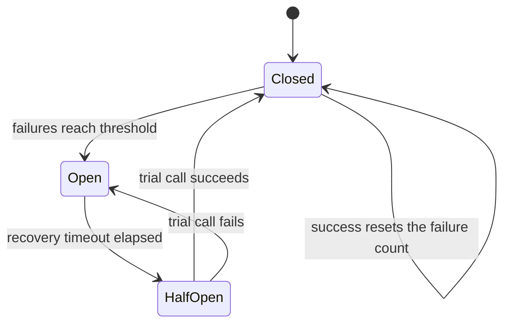

# Circuit Breakers and Bulkheads

> **Interview answer (say this first).** A circuit breaker watches calls to one dependency. When failures cross a threshold it **opens** and every call fails immediately, so callers stop waiting on a sick service. After a cool-down it goes **half-open** and allows one trial call; success closes it, failure opens it again. A bulkhead isolates capacity — separate pools per dependency or tenant — so one slow dependency cannot consume every thread. Timeouts come first, because a call that never returns defeats both patterns.

## Why this exists

A single slow dependency can take down a whole system. Here is the classic chain:

1. The recommendation service becomes slow. Each call now takes 30 seconds instead of 50 ms.
2. The product page calls it on every request, so request threads start to pile up.
3. The thread pool fills. New requests wait for a thread instead of for the database.
4. The product page becomes slow for everything, including pages that do not use recommendations.
5. The gateway times out, clients retry, and the extra retries add load.
6. The product page dies, and then the services that call it die too.

This is **cascading failure**: one broken part drains the shared resources of its neighbours. The dependency did not even fail loudly. It just got slow, which is worse, because slow calls consume a thread for a long time.

The same shape appears in agentic AI. An agent calls an embedding API, a retrieval service, a model provider, and three tools. If the vector store gets slow, every agent worker blocks on it, the worker pool empties, and unrelated agent runs queue behind a dependency they never call. Adding a fourth tool should not be able to freeze the other three.

Circuit breakers and bulkheads are two answers to the same question: **how do you stop one failure from spreading?** The breaker stops calling the sick dependency. The bulkhead stops it from owning all the capacity.

> **Note.** These patterns are not alternatives to a timeout. A timeout is the foundation. Without it, a slow call holds a thread forever, and there is nothing left for a breaker or a bulkhead to protect.

## Start from zero

| Word | Plain meaning |
| --- | --- |
| **Dependency** | A remote thing you call: a database, a model API, a queue, another service. |
| **Timeout** | A maximum wait. If the call has not answered by then, give up. |
| **p99** | The value below which 99% of measurements fall; a tail-latency measure. |
| **Failure** | A call that times out, errors, or returns something you treat as unhealthy. |
| **Circuit breaker** | A wrapper that stops calls to a failing dependency for a while. |
| **Closed** | Normal state. Calls pass through, and failures are counted. |
| **Open** | Tripped state. Calls fail fast without touching the dependency. |
| **Half-open** | Recovery state. A limited number of trial calls are allowed. |
| **Threshold** | How many failures (or what failure rate) trips the breaker. |
| **Trip** | The act of moving from closed to open. |
| **Cool-down** | The time the breaker stays open before allowing a trial. |
| **Recovery timeout** | The same as cool-down: how long open lasts. |
| **Trial call** | The probe sent in half-open to test whether the dependency recovered. |
| **Single-flight** | Only one trial call at a time, so the probe cannot become a stampede. |
| **Fail fast** | Return an error immediately instead of waiting. |
| **Fallback** | What you return when the call is blocked: cache, default, or a clear error. |
| **Bulkhead** | Separating resources into compartments so one failure cannot flood the rest. |
| **Thread pool** | A fixed set of threads that run work. A hidden shared resource. |
| **Connection pool** | A fixed set of open connections to a database or service. |
| **Semaphore** | A counter that limits how many callers may hold a resource at once. |
| **Tenant isolation** | Giving each customer their own capacity so one cannot starve others. |
| **Cascading failure** | One failure causing its neighbours to fail in turn. |
| **Hedge** | Sending a second request before the first times out, to cut tail latency. |

Two distinctions to hold apart:

- **Breaker vs bulkhead.** The breaker is about *time*: stop wasting time on a bad dependency. The bulkhead is about *capacity*: stop one dependency or tenant from using all of it.
- **Timeout vs breaker.** A timeout protects one call. A breaker protects many calls by remembering that recent ones failed.

## The core idea

Picture the electrical panel in a house. Wires can carry only so much current. When too much flows, a breaker in the panel flips and cuts that circuit. The lights on that circuit go out, but the rest of the house keeps working. You do not lose the whole house because one appliance shorted.

A software circuit breaker is the same. It sits between you and one dependency. It watches the calls. When too many fail, it flips and refuses new calls for a while. Crucially, it fails **immediately**. A fast failure frees the caller to try a fallback, and it stops the pile-up of waiting threads.

The three states, drawn once:



A **bulkhead** is the watertight compartment idea from ships. A hull is divided into sections; if one floods, the others stay dry and the ship floats. In software you divide the shared resource — threads, connections, memory, a worker pool — so a flood in one compartment cannot fill the whole hull.

Here is how the three protections differ. This table is the topic on one screen.

| Protection | Question it answers | Unit | Typical effect |
| --- | --- | --- | --- |
| **Timeout** | How long do I wait? | One call | Bounds a single wait |
| **Circuit breaker** | Should I call at all? | One dependency | Stops repeated calls to a sick service |
| **Bulkhead** | How much capacity may I use? | Pool / tenant / dependency | Prevents one area from draining all capacity |

Use all three. They cover different failure shapes. A slow dependency needs a timeout and a breaker; a noisy tenant needs a bulkhead.

## How it works

**The breaker, step by step.**

1. **Wrap the call.** All calls to the dependency go through one breaker object, not straight to the client.
2. **Keep the breaker closed by default.** Calls pass through. On success, reset or decay the failure count.
3. **Count failures.** A failure is a timeout, an exception, or an unhealthy response. A 500 is a failure; a 404 is usually not.
4. **Trip when the threshold is crossed.** Exactly what trips it is a policy choice: N consecutive failures, a failure rate over a window, or slow calls over a latency limit.
5. **Open.** Record the trip time. While open, `allow()` returns false immediately. Do not call the dependency at all.
6. **Cool down.** After the recovery timeout, move to half-open. The clock is checked lazily on the next call, so no background timer is required.
7. **Probe with a trial call.** Half-open allows a small number of calls, often one. This is **single-flight**: while the trial is in flight, everyone else is still rejected.
8. **Close or reopen.** If the trial succeeds, close the breaker and clear the failure count. If it fails, reopen and reset the cool-down.
9. **Return a fallback while open.** A cached value, a default, a cheaper model, or an explicit "try again later". A fast, honest failure beats a slow hang.

**The bulkhead, step by step.**

1. **Name the shared resource.** Threads, DB connections, HTTP connections to a given host, GPU memory, worker slots.
2. **Give each compartment a hard cap.** For example, 10 connections to the payment service, 5 to the search service.
3. **Acquire before the call, release after.** A semaphore or a dedicated pool enforces the cap.
4. **Choose a full-pool policy.** Wait briefly, or reject immediately. Waiting risks its own pile-up; rejecting preserves the rest of the system.
5. **Isolate tenants too.** One abusive tenant should hit its own limit, not everyone's.

> **Tip.** The cheapest bulkhead you already own is the connection pool. A pool with a maximum size is a bulkhead for the database. If the pool is shared by every dependency call, it is not isolating anything.

## The syntax you will use

**A timeout is a context manager.** `asyncio.timeout` turns a call that is too slow into a `TimeoutError` you can catch.

```python
async def call_model(prompt):
    async with asyncio.timeout(0.8):        # give up after 800 ms
        return await provider.generate(prompt)
# on timeout: raises TimeoutError; catch it and fall back
```

**A blocking call uses `future.result(timeout=...)`.** The thread keeps running, but your caller stops waiting.

```python
future = pool.submit(call_dependency)
try:
    result = future.result(timeout=0.8)
except concurrent.futures.TimeoutError:
    result = fallback()                     # stop waiting; do not block the request
```

**A circuit breaker is a small state machine.** This is the whole idea, in real Python.

```python
class State(Enum):
    CLOSED = "closed"
    OPEN = "open"
    HALF_OPEN = "half_open"

class CircuitBreaker:
    def __init__(self, fail_threshold=3, recovery_timeout=1.0, clock=time.monotonic):
        self.state = State.CLOSED
        self.failures = 0
        self.opened_at = None
        self.probe_in_flight = False        # single-flight guard for the half-open probe
        self.fail_threshold = fail_threshold
        self.recovery_timeout = recovery_timeout
        self.clock = clock

    def allow(self):
        now = self.clock()
        if self.state is State.OPEN:
            if now - self.opened_at >= self.recovery_timeout:
                self.state = State.HALF_OPEN
            else:
                return False                # fail fast, no call
        if self.state is State.HALF_OPEN:
            if self.probe_in_flight:
                return False                # a trial is already out; reject the rest
            self.probe_in_flight = True      # admit exactly one probe
        return True

    def record(self, ok):
        self.probe_in_flight = False         # the trial finished, one way or the other
        if ok:
            self.failures = 0
            self.state = State.CLOSED
        else:
            self.failures += 1
            if self.failures >= self.fail_threshold:
                self.state = State.OPEN
                self.opened_at = self.clock()
```

**Use it around every call to one dependency, with a fallback.**

```python
def call_search(query):
    if not breaker.allow():
        return cached_results(query)        # fallback path while open
    try:
        result = search_client.query(query, timeout=0.5)
        breaker.record(ok=True)
        return result
    except Exception:
        breaker.record(ok=False)
        return cached_results(query)
```

**A bulkhead is a semaphore.** Cap how many calls to one dependency may be in flight.

```python
search_sem = threading.Semaphore(5)         # at most 5 concurrent search calls

def call_search(query):
    if not search_sem.acquire(blocking=False):
        raise ServiceBusy("search bulkhead full")   # reject, do not queue forever
    try:
        return search_client.query(query, timeout=0.5)
    finally:
        search_sem.release()
```

**Per-tenant bulkheads use one pool per tenant.** The shape is a dictionary of pools, and it is what stops a noisy neighbour.

```python
pools = defaultdict(lambda: threading.Semaphore(2))
if not pools[tenant].acquire(blocking=False):
    raise TenantBusy(tenant)                 # tenant's own compartment is full
```

**A configuration table is easier to review than scattered numbers.** Put the policy in config, not in code.

| Setting | Meaning | Safe starting point |
| --- | --- | --- |
| `timeout_ms` | Max wait per call | p99 latency × 2 |
| `fail_threshold` | Failures before opening | 5 consecutive, or 50% rate |
| `recovery_timeout` | Cool-down while open | 5–30 s |
| `half_open_max_calls` | Trial calls | 1 |
| `bulkhead_size` | Max concurrent calls | peak concurrency + headroom |

## Examples: simple to real

**Example 1 — three failures trip the breaker.** A dependency fails three times, and the breaker moves to open. These are measured outputs from a real run of the class above, with a fake clock injected so the timings are deterministic.

```python
cb = CircuitBreaker(fail_threshold=3, recovery_timeout=1.0)
# each call records a failure
# trip: failed failed failed
# after 3 failures -> open
```

Nothing special happened at the dependency. The breaker simply stopped trusting it.

**Example 2 — while open, calls fail fast.** The next call is rejected without touching the dependency, even though the dependency has recovered.

```python
# open call: rejected (fast fail)
# state still open
```

This is the point of the open state: the caller gets an answer in microseconds, and the sick service gets breathing room.

**Example 3 — half-open, then recover.** After the cool-down, one trial call is allowed. It succeeds, and the breaker closes.

```python
# after timeout -> open          (transition is lazy: checked on next call)
# first trial: ok -> closed
# closed call: failed failures = 1
```

The failure counter resets on the success, so a single later failure does not immediately trip it again.

**Example 4 — a failed trial reopens the breaker.** If the probe fails, the breaker returns to open and waits again. This prevents flapping during a long outage.

```python
# cb2 state: open
# cb2 allow(trial): True half_open
# failed trial -> open
```

**Example 5 — half-open single-flight.** Two callers arrive at the same instant while half-open. Only one trial is allowed; the other is rejected. Without this, the probe becomes a mini stampede against a service that is barely alive.

```python
# trial 1: True trial 2: False
```

**Example 6 — a bulkhead keeps one bad tenant from draining the others.** Each tenant gets its own permit pool. Tenant A floods it; tenant B is unaffected. A single shared pool shows the opposite result.

```python
# A1: True   A2: True   A3: False      (A's compartment is full)
# B1: True   B2: True   B3: False      (B has its own capacity)
# in_use: {'A': 2, 'B': 2}
# rejected: {'A': 1, 'B': 1}
#
# shared pool: shared A1: True, shared A2: True, shared B1: False
# shared rejected: 1
```

With a shared pool, tenant B was rejected because tenant A got there first. The bulkhead made B's rejection depend only on B.

> **Note.** A fallback must be cheaper than the original call. If the fallback is a second remote service, a broken primary can simply shift the load to the backup and break that too. Prefer a cache, a default, a degraded answer, or a clear error.

## In production

- **Set the timeout from data.** Use the dependency's p99 latency, not a guess. A timeout that is too tight causes false failures; too loose and it holds threads.
- **Choose the trip metric deliberately.** Consecutive failures are simple but snap on one blip. A failure rate over a rolling window is smoother but needs a minimum request volume.
- **Fail fast is a feature.** Returning an error in 1 ms is better than a 30 s hang. Callers can retry, degrade, or show a message.
- **Always define a fallback.** An open breaker with no fallback turns a partial outage into a hard outage. A cached response, a cheaper model, or a clear "temporarily unavailable" all work.
- **Keep half-open traffic tiny.** One trial call is the default. If half-open allows many calls, you have recreated the overload you were protecting against.
- **Breakers must be per dependency and per instance.** A breaker is about one upstream. If two services share one breaker, a failure in one blocks calls to the other.
- **Do not put a breaker around your own database without thinking.** A shared database pool often needs load shedding and query limits more than a breaker; opening it can cause errors where a slow query would have succeeded.
- **Bulkheads need a full-pool policy.** Queueing forever is not isolation. Reject, or wait with a short timeout, and record every rejection as a metric.
- **Size bulkheads from concurrency, not request rate.** Little's law applies: concurrency = arrival rate × latency. A pool of 10 with 200 ms calls serves about 50 requests per second.
- **Watch for thread-pool coupling.** If the same executor serves all dependencies, you have no bulkhead. One slow dependency consumes the shared executor and starves the rest.
- **Avoid the retry-plus-breaker trap.** Retries multiply load during an incident. Use retries with backoff and jitter only for safe, idempotent calls, and let the breaker stop them when the dependency is clearly down.
- **Measure the breaker itself.** Track state transitions, rejected calls, and time spent open. A breaker that flips constantly is a tuning problem, not a solved one.

## Interview questions

### 1. What problem does a circuit breaker solve?

**Answer.** It stops cascading failure caused by repeated calls to a failing dependency. Once failures cross a threshold, the breaker opens and calls fail immediately instead of waiting. That frees caller threads and gives the dependency room to recover. It is a failure-isolation pattern, not a retry pattern.

**Follow-up: "Why not just rely on retries?"** Retries make overload worse because each attempt adds load. A retry is useful for a transient blip; a breaker is for a sustained problem. They compose: retry a little, then let the breaker stop the flood.

**Trap.** Saying a breaker "fixes" the dependency. It only protects the caller. The downstream problem still needs fixing.

### 2. Walk through the three states.

**Answer.** **Closed** is normal: calls pass and failures are counted. **Open** means the threshold was crossed: calls fail fast without touching the dependency for a cool-down period. **Half-open** is the recovery test: after the cool-down, a small number of trial calls are allowed. If a trial succeeds, the breaker closes and the count resets; if it fails, the breaker reopens.

**Follow-up: "What is single-flight in half-open?"** Only one trial call is allowed at a time. Other callers are rejected until that probe finishes. Without it, a burst of callers at the moment of recovery would all probe at once and re-break the dependency.

**Trap.** Forgetting that the transition is usually lazy. The breaker often checks the clock on the next call rather than using a background timer, so state changes only when someone asks.

### 3. What should trip a breaker, and what is a healthy threshold?

**Answer.** You can trip on consecutive failures, on a failure rate over a rolling window, or on latency. A common starting point is 5 consecutive failures or a 50% failure rate with a minimum request count, and a cool-down of 5 to 30 seconds. The right numbers come from the dependency's latency and your tolerance for stale fallbacks.

**Follow-up: "Why include a minimum request count?"** With a failure rate, a trickle of two requests and one failure looks like 50% and trips the breaker on noise. A minimum volume avoids that.

**Trap.** Tripping on every error. A 404, a validation error, or a client cancellation is not a dependency failure and should not open the breaker.

### 4. What is a bulkhead, and how is it different from a circuit breaker?

**Answer.** A bulkhead divides capacity into compartments so one bad area cannot consume everything. A circuit breaker decides whether to call at all based on recent failures. A bulkhead decides how much of a shared resource one dependency or tenant may hold. You often use them together: a per-dependency connection pool plus a breaker around each dependency.

**Follow-up: "Give a concrete bulkhead."** A service with a 20-connection database pool, a 5-slot pool for the search API, and a 2-slot pool per tenant. Search being slow can exhaust its 5 slots, but it cannot touch the other 15 connections.

**Trap.** Thinking a bulkhead is just a thread pool. A shared thread pool is the opposite of a bulkhead. Isolation requires *separate* limits per dependency or tenant.

### 5. Why are timeouts the foundation of both patterns?

**Answer.** A circuit breaker counts failures, and the main failure mode is a slow call. Without a timeout, a slow call never returns, so it never counts as a failure and it holds a thread forever. A bulkhead limits concurrent calls, but without a timeout those slots are never released. The timeout turns "slow" into a visible, countable, recoverable event.

**Follow-up: "What is a good timeout value?"** Start near the dependency's observed p99 and add headroom. Make it configurable, and consider separate connect and read timeouts. Measure, then tune.

**Trap.** Using a huge timeout "to be safe." A long timeout is what turns a slow dependency into a cascading failure.

### 6. How would you isolate failures between tenants in a multi-tenant AI product?

**Answer.** Give each tenant its own concurrency and cost budget: a per-tenant semaphore, a per-tenant rate limit, and a per-tenant spend cap. Route expensive work to separate worker pools if one tenant's traffic is huge. Then a single tenant's runaway agent consumes only its own compartment.

**Follow-up: "What if there are thousands of tenants?"** You cannot pre-create a pool per tenant at scale. Use a small number of pool classes or a weighted fair queue, and give large tenants dedicated pools. The goal is bounded impact, not one pool per customer.

**Trap.** Relying only on request rate limits. An agent can make few requests that are each very expensive. Concurrency and cost limits catch what rate limits miss.

### 7. A dependency is slow but not erroring. How do breakers and bulkheads respond?

**Answer.** A timeout turns the slow call into a failure, and a breaker can be configured to trip on that. A bulkhead limits how many slow calls can be in flight at once. Without either, slow calls accumulate and exhaust the thread or connection pool. This is why latency-based tripping exists: it catches the "slow but up" case that pure error counting misses.

**Follow-up: "Why is slow worse than fast failure sometimes?"** Slow failure consumes a resource for a long time. A fast failure frees the caller immediately. Slow failure is the main engine of cascading collapse.

**Trap.** Only counting HTTP 5xx responses. Timeouts and high latency are the more common early warning.

### 8. What are the failure modes of the patterns themselves?

**Answer.** A breaker with no fallback turns a partial outage into a full one. A breaker tuned too tight trips on noise and blocks a healthy service. A bulkhead set too small rejects normal traffic; set too large it does not isolate anything. Shared thread pools silently defeat isolation. And retries around a breaker can keep hammering a dependency even while it is open if they bypass the breaker. Each needs metrics and tuning.

**Follow-up: "How do you tune them safely?"** Start conservative, shadow the state transitions, and watch rejected-call and fallback rates. Canary config changes, and always alert when a breaker stays open for long, because that is a real outage signal.

**Trap.** Assuming a breaker that is closed means the dependency is healthy in every dimension. It only knows the calls it saw, through the threshold you configured.

## Remember this

- **Timeouts first.** A slow call that never ends defeats every other protection.
- **A breaker is time, a bulkhead is capacity.** Use both; they cover different failures.
- **Closed counts, open fails fast, half-open probes with a single trial.**
- **A fallback makes an open breaker survivable.** No fallback means a hard outage.
- **Isolate threads, connections, and workers per dependency and per tenant.** One shared pool is no bulkhead at all.
