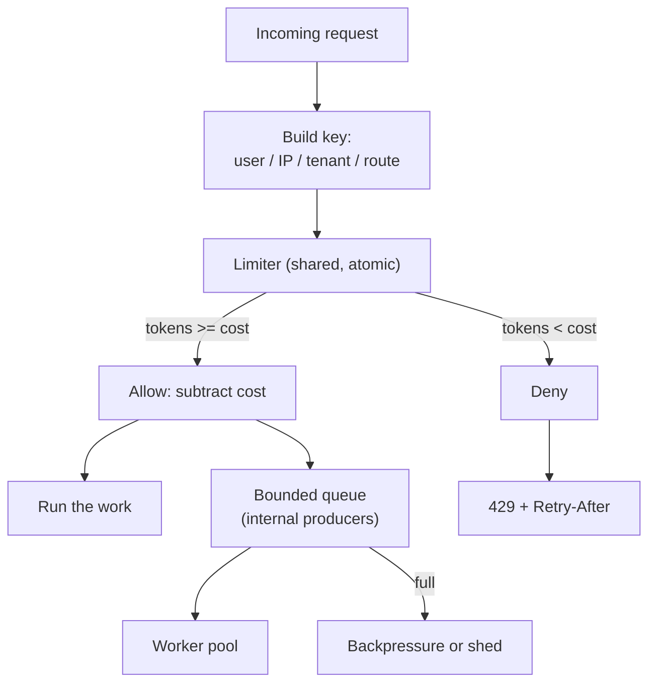

# Rate Limiting and Backpressure

> **Interview answer (say this first).** Rate limiting caps how many requests a caller may make in a window, so one caller cannot exhaust shared capacity or spend the budget. The common algorithms are fixed window, sliding window, token bucket, and leaky bucket; token bucket is the usual default because it allows short bursts. In a distributed system the counter must be shared and updated atomically, usually in Redis with a Lua script. When the limit is hit you return `429 Too Many Requests` with `Retry-After` for user traffic, and you apply backpressure with bounded queues for internal producers. An unbounded queue is not backpressure — it just moves the failure later and makes it bigger.

## Why this exists

Every service has finite capacity: CPU, database connections, worker slots, network bandwidth, and — for AI products — tokens and money. A limit is what stops one caller from consuming all of it.

Without rate limiting, four failures happen again and again:

1. **The retry storm.** A client hits an error and retries immediately. Every retry adds load, which causes more errors, which causes more retries. The service spends all its time rejecting work and none doing it.
2. **The runaway agent.** An agent endpoint calls a paid model. A loop with no stop condition can spend thousands of dollars in minutes. Request limits alone do not help if each request is very expensive.
3. **The noisy neighbour.** One tenant sends ten times the traffic of everyone else, saturates the database, and every other tenant sees timeouts.
4. **The provider limit.** Your model provider allows, say, 100,000 tokens per minute. When you exceed it, the provider returns `429` for everyone, including your well-behaved requests.

Notice that "requests" and "tokens" are different resources. You need both a request rate limit and a cost or token budget, because one agent call can cost as much as a thousand simple calls.

The second half of the topic is **backpressure**. A rate limiter rejects work before it starts. Backpressure slows the producer when the consumer cannot keep up. If you only reject and never signal, producers keep pushing and the queue between you grows without limit. Backpressure is how a system says "slow down" instead of silently dying.

> **Note.** Rate limiting and backpressure are both about *flow control*. Rate limiting answers "may this caller start?" Backpressure answers "is the system able to accept more work at all?"

## Start from zero

| Word | Plain meaning |
| --- | --- |
| **Rate limit** | The maximum number of requests allowed per unit of time. |
| **Window** | The period the limit is measured over: 1 second, 1 minute, 1 day. |
| **Fixed window** | A counter that resets at a fixed boundary, such as each whole second. |
| **Sliding window** | A window that always looks back from now, so it never resets abruptly. |
| **Token bucket** | A bucket that refills at a constant rate; each request spends tokens. |
| **Leaky bucket** | A queue that drains at a constant rate, smoothing traffic. |
| **Burst** | A short spike above the steady rate. |
| **Capacity** | The largest burst a bucket allows. |
| **Refill rate** | How fast a token bucket refills, in tokens per second. |
| **Cost** | How many tokens one request consumes. An LLM call may cost many. |
| **429** | HTTP status for "too many requests", defined in RFC 6585. |
| **`Retry-After`** | Response header telling the client how long to wait. |
| **Backpressure** | Making the producer slow down because the consumer is behind. |
| **Rejection** | Refusing work immediately with a `429` or an error. |
| **Load shedding** | Deliberately dropping lower-priority work to protect the system. |
| **Bounded queue** | A queue with a maximum size, so backlog cannot grow forever. |
| **Unbounded queue** | A queue with no limit; it hides overload until it runs out of memory. |
| **Little's law** | `concurrency = arrival rate × latency`; how many requests are in flight. |
| **Distributed limiter** | A limiter whose counter is shared by all app instances. |
| **Atomic** | An update that cannot be split by another update. |
| **Lua script** | A small program Redis runs atomically inside the server. |
| **Atomic counter** | A shared number incremented without lost updates. |
| **Fair queue** | A scheduler that gives each tenant a turn, so no one starves. |
| **Quota** | A budget over a long window: per day, per month, per dollar. |

Two distinctions that matter most:

- **Burst vs steady rate.** "10 per second" is steady. "Up to 30 at once, then refill" allows a burst. Token bucket expresses both; fixed window cannot.
- **Reject vs backpressure vs shed.** Reject returns an error now. Backpressure queues and slows the producer. Shedding drops the least important work to save the most important.

## The core idea

Picture a bucket with a small hole in the bottom. A tap drips tokens in at a constant rate. Each request must take a token out. If the bucket is empty, the request is rejected or waits. If the bucket is full, extra tokens are simply lost, which caps the burst.

That is the **token bucket**. Its two numbers are the **refill rate** (steady throughput) and the **capacity** (largest allowed burst). "5 per second with bursts up to 20" is one bucket, not two rules.

Now picture a rainwater tank with a drain. Water pours in from the top, and the drain lets it out at a fixed rate. If the tank overflows, the excess is rejected. That is the **leaky bucket**, and it produces a perfectly even output stream, which is what a fragile downstream needs.

Backpressure is the third picture: a pipe that is narrower at the far end. You cannot push water through faster than it drains. The pressure builds up at the source and forces the producer to slow down. If you replace the pipe with a giant tank of unlimited size, the pressure disappears — until the tank bursts.

The flow of one request:



Here is how the algorithms compare. This table is the topic on one screen.

| Algorithm | Burst behaviour | Memory | Precision | Typical use |
| --- | --- | --- | --- | --- |
| **Fixed window** | Up to 2× at boundaries | O(1) counter | Coarse | Simple daily quotas |
| **Sliding window log** | None at boundaries | O(limit) entries | Exact | Small, strict limits |
| **Sliding window counter** | Nearly smooth | O(1), two counters | Approximate | High-volume APIs |
| **Token bucket** | Up to capacity | O(1), two numbers | Exact | Public APIs, LLM calls |
| **Leaky bucket** | Smooths to a constant rate | O(capacity) queue | Exact pacing | Protecting a slow downstream |

## How it works

**Fixed window counter.**

1. Build a key that includes the window: `rl:user:42:1710000000`.
2. `INCR` the key.
3. If the result is 1, this is the first hit; set an expiry equal to the window.
4. If the result is greater than the limit, reject; otherwise allow.

It is one round trip and O(1) memory. Its flaw is the boundary: at the end of one window a client can send the full limit, and at the start of the next window send it again. Nearly 2× the limit lands in a fraction of a second.

**Sliding window log.**

1. Store each hit in a sorted set with its timestamp as the score.
2. Remove entries older than `now - window`.
3. Count what remains. If below the limit, add this hit and allow.

It is exact and never bursts at a boundary. The cost is memory: a limit of 1,000 per minute keeps up to 1,000 timestamps per key.

**Sliding window counter.** An approximation that blends two fixed windows:

```text
estimate = previous_count * (1 - elapsed_fraction) + current_count
```

O(1) memory and nearly as smooth as the log. It is what many large APIs use, at the price of a small over- or under-count.

**Token bucket.**

1. Read the token count and the timestamp of the last update.
2. Add `elapsed_seconds × refill_rate` tokens, capped at capacity.
3. If at least `cost` tokens remain, subtract them and allow. Otherwise reject.
4. Store the new count and timestamp.

Refill is computed lazily from the clock, so no background job is needed. Two numbers per key, exact burst control.

**Leaky bucket.**

1. Add the request's cost to a level.
2. Subtract `elapsed × drain_rate` to model the drain.
3. If the level would exceed capacity, reject. Otherwise accept.

Output is smooth, which protects a fragile downstream, at the cost of latency for queued work.

**Making it distributed.** In-process counters only limit one process. With several app instances, each has its own counter, so the effective limit becomes `limit × instances`. Move the counter to Redis and make every update atomic. A **Lua script** runs as one atomic unit on the Redis server, so the read-modify-write cannot interleave.

**Backpressure.**

1. Bound every queue. Pick a maximum size from memory and from the worker drain rate.
2. When the queue is full, pick a policy: block the producer, reject the item, or drop the oldest.
3. Never grow the queue to hide the problem. Memory is a finite resource too, and an unbounded queue turns a throughput problem into an out-of-memory crash.
4. Use Little's law to size worker pools: `concurrency = arrival rate × latency`. If 100 requests per second arrive and each takes 0.25 s, about 25 are in flight.

**Which policy when.**

- **User-facing read traffic:** reject with `429` and `Retry-After`.
- **Internal producers you control:** apply backpressure; block or slow the producer.
- **Under overload with priorities:** shed the least important work first.
- **Paid model calls:** limit by tokens and dollars, not just requests.

> **Tip.** Pick by what you must protect. Need bursts for real users? Token bucket. Need perfectly even output for a slow downstream? Leaky bucket. Need a simple daily quota? Fixed window. Need exactness at small scale? Sliding window log.

## The syntax you will use

**A distributed token bucket in Redis with an atomic Lua script.** This is the production form; the script is one atomic read-modify-write.

```lua
-- KEYS[1] bucket key; ARGV: now_ms, refill/ms, capacity, cost
local b = redis.call('HMGET', KEYS[1], 'tokens', 'ts')
local tokens = tonumber(b[1]) or tonumber(ARGV[3])
local ts = tonumber(b[2]) or tonumber(ARGV[1])
local delta = math.max(0, tonumber(ARGV[1]) - ts)
tokens = math.min(tonumber(ARGV[3]), tokens + delta * tonumber(ARGV[2]))
local allowed = tokens >= tonumber(ARGV[4])
if allowed then tokens = tokens - tonumber(ARGV[4]) end
redis.call('HMSET', KEYS[1], 'tokens', tokens, 'ts', ARGV[1])
redis.call('PEXPIRE', KEYS[1], 60000)
return allowed and 1 or 0
```

**Calling it from Python.** The cost argument is how you make one expensive LLM call consume many tokens.

```python
script = redis_client.register_script(LUA_TOKEN_BUCKET)

def allow(key, now_ms, rate_per_s=5, capacity=5, cost=1):
    # capacity must be >= cost, or a request costlier than the bucket is always denied
    ok = script(keys=[key], args=[now_ms, rate_per_s / 1000, capacity, cost])
    return bool(ok)

allow("rl:tenant:acme", now_ms, rate_per_s=500, capacity=1000, cost=1)     # a cheap request
allow("rl:tenant:acme", now_ms, rate_per_s=500, capacity=1000, cost=500)   # one expensive model call
```

**A shared fixed-window counter is just `INCR` plus `EXPIRE`.** Simple, but expect boundary bursts.

```python
def fixed_window(key, limit, window_s=1):
    n = redis_client.incr(key)
    if n == 1:
        redis_client.expire(key, window_s)
    return n <= limit
```

**Returning a `429` with `Retry-After`.** Tell the client exactly how long to wait; otherwise it will guess and retry immediately. `Retry-After` may be seconds or an HTTP date.

```python
from fastapi import HTTPException

def deny(retry_after_s: int):
    raise HTTPException(
        status_code=429,
        detail="rate limit exceeded",
        headers={"Retry-After": str(retry_after_s)},
    )
```

**A bounded queue is backpressure.** `asyncio.Queue(maxsize=...)` forces the producer to wait or to shed.

```python
q = asyncio.Queue(maxsize=100)          # bounded, so backlog cannot explode

await q.put(item)                       # producer waits when full (backpressure)
q.put_nowait(item)                      # or raises QueueFull, so you can shed
```

**A semaphore sheds load before the queue.** If every slot is busy, reject rather than queue forever.

```python
slots = asyncio.Semaphore(20)          # max concurrent agent runs

async def handle():
    if slots.locked():                 # all 20 permits are held
        deny(retry_after_s=1)          # shed load instead of queueing
    async with slots:
        return await run_agent()
```

**Cost-based limiting for model providers.** Estimate tokens before the call and charge the bucket accordingly.

```python
estimated_tokens = len(prompt.split()) * 1.3 + max_tokens
if not allow(f"rl:model:{tenant}", now_ms, rate_per_s=2000, capacity=50000,
             cost=estimated_tokens):
    deny(retry_after_s=2)
```

## Examples: simple to real

**Example 1 — a token bucket allows a burst, then throttles.** Capacity 10, refill 5 per second. Ten calls pass at once, then the next two are rejected. As the clock advances, tokens come back.

```text
burst: [True, True, True, True, True, True, True, True, True, True, False, False]
tokens after burst: 0.0
at t=0.5 (2.5 refilled): True  tokens: 1.5
at t=0.6 (+0.5 refilled): True tokens: 1.0
at t=0.7 (+0.5 refilled): True tokens: 0.5
at t=0.8 (needs 1, has 0.5 refilled): True tokens: 0.0
again at t=0.8 (bucket empty): False tokens: 0.0
```

This is the shape real users want: a quick burst is fine, sustained overload is not.

**Example 2 — the fixed-window boundary bug.** Five calls at `t=0.9` and five at `t=1.1` are all allowed, even with a limit of five per second. Ten calls land in 0.2 seconds.

```text
fixed window: 10 allowed in 0.2s across the boundary: True
```

The counter is correct per window and still wrong in reality. This is why production limiters rarely use a naive fixed window for bursty traffic.

**Example 3 — the sliding window counter smooths the boundary.** At `t=1.1`, 10% into the new window, 90% of the previous window's five hits are still counted, so the estimate is 4.5.

```text
sliding estimate at t=1.1: 4.5 -> reject? False
```

It is approximate, but the 2× surge is gone.

**Example 4 — a leaky bucket paces a slow downstream.** Rate 2 per second, capacity 3. A burst of five fills it, and two are rejected. After a second of draining, one more fits.

```text
leaky burst: [True, True, True, False, False]
level: 3.0
after 1s (drained 2): True level: 2.0
after 2s (drained): True level: 1.0
```

The output leaves at a steady two per second, which is what a fragile dependency needs.

**Example 5 — a bounded queue signals overload; an unbounded one hides it.** With capacity 3, the fourth and fifth items are rejected immediately. An unbounded queue accepts all six and simply grows.

```text
bounded produce: ['enqueue', 'enqueue', 'enqueue', 'reject', 'reject', 'reject']
                 -> queue [0, 1, 2] dropped 3
unbounded backlog length: 6 (no limit -> no signal)
```

The bounded queue told you it was full. The unbounded one did not, and that is the entire danger.

**Example 6 — distributed limiting with Redis over fakeredis.** One bucket is shared by every caller. Five requests cost one token each; the sixth is denied. After 200 ms one token has refilled.

```text
6 calls at t=0 (limit 5/s, cap 5): [True, True, True, True, True, False]
after 200ms: True (one token refilled)
after 1000ms: [True, True, True, True, False, False]
fixed window (limit 3/s): [True, True, True, False, False]
```

The Lua script makes the read-modify-write atomic, so ten app instances share one honest limit instead of each allowing the full amount.

**Example 7 — sizing the worker pool from Little's law.** If 100 requests per second arrive and each takes 0.25 s, about 25 are in flight. A pool of 5 will queue; a pool of 25 with headroom will keep up.

```text
concurrency in flight: 25.0
```

## In production

- **Return `429` with `Retry-After`.** Without a hint, clients retry immediately and turn a limit into a retry storm. Add jitter guidance if many clients share the limit.
- **Limits are per key, and the key choice is the policy.** `user:42`, `ip:1.2.3.4`, `tenant:acme`, `route:/chat`, `model:gpt`. Choose keys that match fairness and cost.
- **Use token bucket as the default.** It handles real bursts gracefully. Reach for leaky bucket only when the downstream must receive an even stream.
- **Do not count every request the same.** A chat completion and a health check are not equal. Charge by cost: tokens, estimated spend, or CPU seconds.
- **The counter must be shared and atomic.** In-process counters multiply the effective limit by the number of instances. Use Redis with a Lua script, and set a TTL so keys do not leak.
- **Bound every queue.** An unbounded queue is a delayed outage. Set the size from worker drain rate and memory, and alert on queue depth.
- **Choose a full-queue policy explicitly.** Block the producer (backpressure), reject the item, or drop the oldest. Decide which one suits the work, and write it down.
- **Reject early and cheaply.** Check the limiter before parsing the body, loading the model, or opening a database transaction. Wasted work is still work.
- **Protect provider limits like your own.** A provider `429` affects all your tenants at once. Keep a local token budget just under the provider's, and queue or degrade before you hit the hard edge.
- **Watch for the thundering herd.** When a limit resets, every blocked client wakes at the same instant. Add jitter to retries and round reset times.
- **Make limits configurable and observable.** Track allowed, denied, and shed counts per key. A limit that never triggers is untested; one that always triggers is misconfigured.
- **Separate fairness from protection.** A per-tenant quota is fairness; a global shed policy protects the system. You usually need both, and they should be tuned separately.

## Interview questions

### 1. Explain the four main rate-limiting algorithms and their trade-offs.

**Answer.** **Fixed window** is one counter per time bucket: O(1) memory but it allows up to 2× at boundaries. **Sliding window log** stores every hit and looks back exactly: precise but O(limit) memory. **Sliding window counter** blends two fixed windows: O(1) and nearly smooth but approximate. **Token bucket** refills at a constant rate and allows a burst up to capacity: two numbers per key and the usual default. **Leaky bucket** drains at a constant rate and smooths output, which suits a fragile downstream.

**Follow-up: "Why is token bucket so common?"** It matches how real clients behave — mostly quiet with short bursts — and it expresses both steady rate and burst size with two numbers. It also handles cost-based charging naturally: a request can spend more than one token.

**Trap.** Saying fixed window is "good enough" without mentioning the boundary burst. That burst is exactly when systems are most fragile.

### 2. How do you build a distributed rate limiter?

**Answer.** Keep the counter in a shared store, usually Redis, and perform the read-modify-write atomically. The standard approach is a Lua script that reads the bucket, refills from the clock, checks the cost, writes the new state, and returns allow or deny — all in one server-side step. Set a TTL so idle keys are cleaned up. Never use per-process counters, because N instances make the real limit N times too high.

**Follow-up: "What if Redis is unavailable?"** Decide the failure mode in advance: fail open (allow traffic, risking overload) or fail closed (reject, risking an outage). Many systems fail open for availability and add a small local limiter as a backstop.

**Trap.** Doing `GET` then `INCR` in application code. Two concurrent callers can both read the same value and both be allowed, so the limit leaks.

### 3. What is the difference between rate limiting, backpressure, and load shedding?

**Answer.** Rate limiting decides whether a specific caller may start, based on a per-key budget. Backpressure slows the producer when the consumer is behind, usually by blocking on a bounded queue. Load shedding drops work under overload, choosing low-priority work first. They are complementary: limit per caller, apply backpressure to internal producers, and shed when the system is genuinely saturated.

**Follow-up: "Why is an unbounded queue not backpressure?"** Because it never signals the producer. The queue absorbs the mismatch, memory grows, latency climbs, and the eventual failure is an out-of-memory crash rather than a clean rejection. A bound is what creates the pressure.

**Trap.** Treating them as synonyms. Rejection returns an error immediately; backpressure makes the producer wait; shedding makes a priority decision.

### 4. Why must a rate limiter use the caller's key correctly?

**Answer.** The key defines who shares a budget and therefore what fairness means. Per-user keys stop one user from starving others. Per-tenant keys give a customer their whole allocation. Per-IP keys help against anonymous abuse but punish users behind shared NAT. Per-route keys protect an expensive endpoint. You often apply several at once: a global limit, a per-tenant limit, and a per-route limit.

**Follow-up: "What goes wrong with IP keys?"** Many legitimate users share one IP (offices, mobile carriers), so a per-IP limit rejects them together while an attacker rotates IPs freely. Use IP limits as a blunt backstop, not your main fairness rule.

**Trap.** Picking a key and never revisiting it. Traffic changes; a key that worked at launch can become the bottleneck later.

### 5. How do you limit by tokens or cost instead of requests?

**Answer.** Make the cost a parameter of the bucket. Estimate the request's cost before running it — input tokens plus maximum output tokens for a model call — and spend that many tokens from the bucket. The refill rate is then in tokens per second, and the capacity is the largest burst of spend you allow. This catches the case where few requests are each very expensive.

**Follow-up: "What if the estimate is wrong?"** Reconcile after the call using the provider's reported usage: refund or charge the difference. Track a hard daily or monthly budget as a second line of defence, because a per-second limiter cannot stop slow, sustained overspend.

**Trap.** Limiting only request counts for an AI product. One agent loop with a large context can cost more than thousands of small requests.

### 6. What should a well-behaved client do when it gets a `429`?

**Answer.** Honour `Retry-After`, then wait and retry with exponential backoff and jitter. Do not retry immediately, and do not retry in parallel. Better still, reduce concurrency and prefer a degraded path. A client that ignores `Retry-After` is the reason the next incident is worse than the first.

**Follow-up: "What if `Retry-After` is missing?"** Use your own backoff with random jitter, and cap the number of retries. Report the missing header, because it is a server bug.

**Trap.** Retrying a non-idempotent request. A retried payment or tool call can double a side effect; combine retries with idempotency keys.

### 7. How do you protect against a model provider's own rate limits?

**Answer.** Treat the provider's limit as a shared resource for all your tenants. Keep a local budget slightly below it, so you queue or degrade before the provider rejects you. Use a token bucket with a cost per call, a concurrency cap per provider, and a queue for overflow. On a provider `429`, back off globally, not per request, so you do not amplify the problem.

**Follow-up: "Why a global budget rather than per-tenant only?"** Per-tenant limits can each be fine while the sum exceeds the provider's cap. You need a global limiter above the per-tenant ones.

**Trap.** Assuming every tenant is small. One large customer can consume the entire provider allowance if nothing tracks the total.

### 8. What is your strategy when the system is already overloaded?

**Answer.** Shed load deliberately and protect the core. Reject new low-priority work early with a clear status, keep serving the most important traffic, and let queues stay bounded so latency does not explode. Reduce retries and turn up timeouts if retries are feeding the fire. Above all, give operators a way to turn features off, because a fast degraded mode beats a slow total failure.

**Follow-up: "How do you decide what to shed?"** Rank work by business value and by cost. Health checks, logins, and paid critical paths survive; batch jobs, analytics, and best-effort enrichment go first. Encode the ranking before the incident, not during it.

**Trap.** Shedding at random. Random drops hit critical and non-critical work equally, which loses trust without protecting the system.

## Remember this

- **Token bucket is the default.** Two numbers — refill rate and capacity — express both steady rate and burst.
- **Share and atomise the counter.** Use Redis with a Lua script; per-process counters multiply the real limit.
- **Return `429` with `Retry-After`,** and have clients back off with jitter.
- **Bound every queue.** An unbounded queue is not backpressure; it is a delayed out-of-memory failure.
- **Limit cost, not just requests.** For AI, tokens and dollars are the resource that actually runs out.
