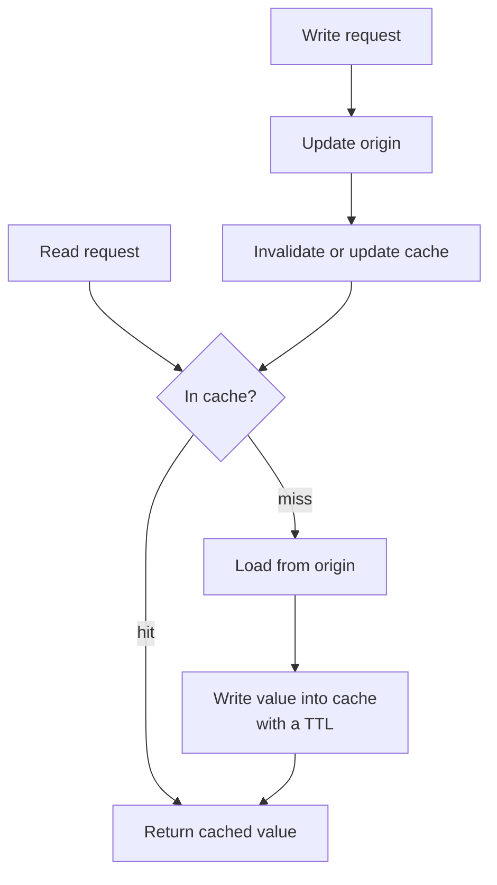

# Caching and Distributed Caching

> **Interview answer (say this first).** A cache stores the result of an expensive read so the next read is cheap. The usual pattern is cache-aside: the application checks the cache, loads from the source on a miss, and writes the value back with a TTL. You must choose an invalidation strategy, because stale data is the main risk. Two failure modes matter in production: a **cache stampede**, where many requests miss at once and hit the database together, and **hot keys**, where one key overwhelms a single cache node. Fixes include single-flight, negative caching, TTL jitter, and consistent hashing. Caching is not free — it adds a second source of truth and a whole new class of bugs.

## Why this exists

A database can answer a handful of queries per millisecond. A page might need twenty. Model calls are worse: an embedding or completion can take hundreds of milliseconds and cost money. If every request recomputes the same answer, you pay full price for a result you already had.

Caching exists because **reads vastly outnumber writes**, and many reads repeat. Product pages, user profiles, feature flags, retrieval results, embeddings, and system prompts are all read far more often than they change. Serving them from memory turns a 20 ms query into a 0.2 ms lookup.

Caching is also a **cost** tool for AI. If an embedding for the same chunk is computed once and cached, you do not pay the provider again. If a system prompt is identical across requests, a prompt cache can cut input tokens. If a retrieval result is reused across a conversation, you save a vector search.

But every cache introduces a second copy of the truth. The copy can be stale, and the moment you have two copies you have a consistency problem. Most caching incidents are not "the cache was slow"; they are "the cache was wrong" or "the cache went away and the origin could not cope."

> **Note.** The hard part of caching is not adding the cache. It is deciding when the cached value becomes invalid, and what happens when the cache is empty or cold.

## Start from zero

| Word | Plain meaning |
| --- | --- |
| **Cache** | A fast store that holds a copy of slower data. |
| **Origin / source of truth** | The authoritative store, usually a database or an API. |
| **Cache hit** | The value was found in the cache. |
| **Cache miss** | The value was not found, so you load it from the origin. |
| **Hit ratio** | Fraction of reads served by the cache. Higher is better, to a point. |
| **Cache-aside** | The app checks the cache, and on a miss loads and fills it. |
| **Read-through** | The cache itself loads from the origin on a miss. |
| **Write-through** | Writes go to the cache and the origin together. |
| **Write-behind** | Writes go to the cache first and reach the origin later, asynchronously. |
| **TTL** | Time to live: how long an entry stays valid before expiring. |
| **Eviction** | Removing entries to make room when the cache is full. |
| **LRU / LFU** | Eviction policies: least recently used, least frequently used. |
| **Invalidation** | Removing or updating a cached entry because the truth changed. |
| **Staleness** | How old or wrong a cached value may be. |
| **Cache stampede** | Many requests miss the same key at once and all hit the origin. |
| **Thundering herd** | The same idea: a crowd of requests waking together. |
| **Single-flight** | Only one caller loads a missing key; the rest wait for its result. |
| **Negative caching** | Caching the fact that a value does not exist. |
| **Cache penetration** | Repeated requests for keys that never exist, always missing. |
| **Cache avalanche** | Many keys expiring at once, causing a surge on the origin. |
| **Distributed cache** | A cache shared by many app instances, such as Redis or Memcached. |
| **Hot key** | One key read so often it overloads a single cache node. |
| **Consistent hashing** | A way to spread keys so adding a node moves few keys. |
| **Write amplification** | One logical write causing several physical writes. |

Two distinctions to keep straight:

- **Cache-aside vs read-through.** In cache-aside the application owns the logic. In read-through the cache library owns it. The behaviour is similar; the difference is where the code lives.
- **TTL vs explicit invalidation.** A TTL bounds staleness but cannot make data fresh. Explicit invalidation is fresh but must reach every copy. Most systems use both.

## The core idea

Think of your desk and a filing cabinet. The cabinet holds every document and never lies to you, but walking to it takes time. Your desk holds the handful you are using right now and is instant to reach. You keep a copy on the desk, and when the original changes you must remember to replace the desk copy.

That is a cache. The desk is fast but limited, so old papers get cleared to make room — that is **eviction**. A paper left too long may be out of date — that is **staleness**, bounded by the **TTL**. And if everyone stands up at once because their desk copy is gone, the cabinet gets mobbed — that is a **stampede**.

The read path, drawn once:



And here are the patterns side by side. This table is the topic on one screen.

| Pattern | Who loads on misses | Write path | Staleness risk | Typical use |
| --- | --- | --- | --- | --- |
| **Cache-aside** | Application | Update origin, then delete cache | Medium | The default for most services |
| **Read-through** | Cache library | Same as cache-aside | Medium | ORMs, data grids |
| **Write-through** | Application or cache | Cache and origin together | Low | Strong, simple consistency |
| **Write-behind** | Application or cache | Cache first, origin later | High | Write-heavy, loss-tolerant |

The interview-safe sentence: *cache-aside is the default; write-through buys freshness at the cost of write latency; write-behind buys write speed at the cost of durability.*

## How it works

**Cache-aside, the common pattern.**

1. Build a stable key, such as `user:42` or `embed:sha256(content)`.
2. Read the cache.
3. On a hit, return the value.
4. On a miss, read the origin.
5. Write the value into the cache with a TTL.
6. On a write, update the origin first, then **delete** the cache entry. Deleting beats updating because it avoids a race between concurrent writers.

> **Note.** The classic race: reader A misses and reads the old value, writer B updates the origin and deletes the cache, then reader A writes its old value back. The cache now holds stale data with a fresh TTL. A short TTL bounds the damage, and a version check or write-through closes the gap.

**Read-through.** The cache library performs steps 2 to 5 for you. The app only ever talks to the cache. It is convenient, but the load function must be robust and single-flighted inside the library.

**Write-through.** Every write updates the cache and the origin in the same operation. Freshness is good, but writes are slower and you may cache values that are never read.

**Write-behind.** Writes land in the cache and a background process flushes them to the origin. Writes are fast and can be batched, but a crash can lose data, and the cache is now a system of record. Use it only when losing a few writes is acceptable.

**TTL and eviction.**

- **TTL** bounds staleness and cleans up unused keys. Add **jitter** — a random extra few seconds — so many keys do not expire at the same instant and cause an avalanche.
- **Eviction** decides what leaves when memory is full. LRU is the common default; LFU suits skewed popularity. Redis can be configured with `maxmemory-policy`, for example `allkeys-lru`.
- **Never cache forever** unless the value is immutable and content-addressed. Immutable content (a file hash, a released document version) is the safest thing to cache.

**Invalidation strategies.**

1. **TTL only.** Simplest. Accept bounded staleness.
2. **Delete on write.** Fresh enough for most systems and race-prone only in narrow windows.
3. **Write-through.** Cache and origin update together.
4. **Versioned keys.** Key includes a version; publishing a new version points at new keys.
5. **Pub/sub invalidation.** One service publishes "user 42 changed" and every instance drops its copy. Needed when each instance has a local cache too.

**Stampede and hot keys.**

1. **Single-flight.** Only one caller loads a missing key; others wait for the result. This is the single most effective stampede fix.
2. **Lock the load.** In a distributed cache, a short `SET key NX` lock makes one instance the loader.
3. **Stale-while-revalidate.** Serve the stale value immediately and refresh in the background.
4. **TTL jitter.** Spread expiries so they do not coincide.
5. **Negative caching.** Cache "not found" for a short TTL so repeated misses do not hit the origin.
6. **Hot key mitigation.** Replicate a hot key across nodes, or keep a small local cache in front of the distributed cache.

**Distributed caches.** Redis and Memcached run as a fleet. Data is spread across nodes, usually by consistent hashing so adding a node moves few keys. Client libraries often handle this, but you must plan for a node failing: those keys now miss and the origin sees a burst. This is why a cold cache and a failed cache node have the same failure shape.

> **Tip.** The safest cache is one you can delete at any moment and still serve correctly. If losing the cache would take down the origin, your cache is not an optimisation; it is a fragile dependency.

## The syntax you will use

**Redis cache-aside in Python.** `SET` with `ex` sets a TTL; the value must be serialised.

```python
import json

def get_user(user_id):
    key = f"user:{user_id}"
    cached = redis_client.get(key)
    if cached is not None:
        return json.loads(cached)           # hit
    user = db.fetch_user(user_id)           # miss: load origin
    redis_client.set(key, json.dumps(user), ex=300)   # 5-minute TTL
    return user
```

**Invalidate on write.** Update the origin first, then delete the cache entry.

```python
def update_user(user_id, patch):
    db.update_user(user_id, patch)          # origin first
    redis_client.delete(f"user:{user_id}")  # then invalidate
```

**TTL with jitter avoids an avalanche.** Spread expiries so a fleet of keys does not expire at once.

```python
import random
ttl = 300 + random.randint(0, 60)           # 300-360 seconds
redis_client.set(key, value, ex=ttl)
```

**Negative caching.** Remember a miss for a short time so repeated bad keys do not hit the origin.

```python
MISS = b"__miss__"
def get_or_miss(key):
    cached = redis_client.get(key)
    if cached == MISS:
        return None                          # known missing, no origin call
    if cached is not None:
        return json.loads(cached)
    value = load_from_origin(key)
    redis_client.set(key, json.dumps(value) if value is not None else MISS, ex=30)
    return value
```

**A distributed single-flight lock.** One instance wins `SET NX` and loads; the others wait briefly.

```python
got_lock = redis_client.set(f"lock:{key}", "1", nx=True, ex=2)
if got_lock:
    try:
        value = load_from_origin(key)
        redis_client.set(key, json.dumps(value), ex=300)
    finally:
        redis_client.delete(f"lock:{key}")
else:
    for _ in range(10):                      # bounded re-read of the filled cache
        time.sleep(0.02)
        cached = redis_client.get(key)
        if cached is not None:
            value = json.loads(cached)
            break
    else:
        value = load_from_origin(key)        # leader was too slow; do not return None
```

**A local cache in front of the distributed cache.** This is how you shadow a hot key. It must be TTL-aware: a bare `lru_cache` never expires and never invalidates, so it is stale for the life of the process and it caches `None` misses forever too.

```python
import time

class TTLCache:
    def __init__(self, ttl_s=5.0):
        self.ttl_s = ttl_s
        self._data = {}                       # name -> (expires_at, value)

    def get(self, name, loader):
        now = time.monotonic()
        hit = self._data.get(name)
        if hit is not None and hit[0] > now:
            return hit[1]                     # fresh enough
        value = loader(name)                  # reload from the shared cache
        self._data[name] = (now + self.ttl_s, value)
        return value

    def invalidate(self, name=None):
        if name is None:
            self._data.clear()
        else:
            self._data.pop(name, None)

flags = TTLCache(ttl_s=5.0)

def feature_flag_cached(name):
    return flags.get(name, distributed_cache.get)   # stale for at most 5 s
```

Subscribe to the invalidation channel and call `flags.invalidate(name)` to make a change immediate instead of waiting out the TTL.
```

**Content-addressed keys are immutable and safe.** The hash changes when the content does, so no invalidation is needed.

```python
key = "embed:" + hashlib.sha256(text.encode()).hexdigest()
# the key is a function of the content -> never stale
```

## Examples: simple to real

**Example 1 — cache-aside serves a hit, then expires.** The first read misses and calls the origin; the second is a hit; after the TTL, the third read loads again. Store call counts are measured.

```text
1st read: Ranjeet store calls: 1
2nd read: Ranjeet store calls: 1
after TTL (t=11): Ranjeet store calls: 2
```

Three reads, two origin calls. The saving grows with traffic.

**Example 2 — the stampede.** One hundred requests miss the same hot key at the same instant. With no coordination they all hit the origin.

```text
stampede store calls: 100
```

This is the failure mode that takes a database down right after a cache restart or a popular key expires.

**Example 3 — single-flight collapses the stampede.** One leader loads; the other ninety-nine callers join it instead of loading.

```text
no single-flight store calls: 100
single-flight: loads = 1 joined = 99 store calls = 1
```

From one hundred origin calls to one. That is the highest-leverage caching fix there is.

**Example 4 — negative caching stops repeated misses.** Three lookups for a key that does not exist hit the origin only once, because the miss itself is cached.

```text
negative-cache store calls for 3 misses: 1
```

Without this, an attacker or a bug can hammer the origin with keys that will never exist — cache penetration.

**Example 5 — Redis as a shared cache.** Every instance sees the same entries. `SET ... ex=10` writes with a TTL, and `DELETE` invalidates.

```text
cache get: Ranjeet
after delete: None
```

The shared cache is what makes invalidation possible across many instances.

**Example 6 — a cold cache looks like a node failure.** When a Redis node dies or a cache is restarted, its keys are misses. If the origin can serve, say, 200 queries per second and the application receives 5,000, the burst is fatal. Single-flight, negative caching, TTL jitter, and a warm-up plan are what make the difference.

```text
cold keys  ->  all misses  ->  origin sees the full read rate
origin capacity: ~200 QPS   application rate: 5,000 QPS
```

**Example 7 — LRU eviction and the working-set trap.** With capacity 3 and accesses to `a, b, c`, then a read of `a`, then a write of `d`, the least recently used key `b` is evicted.

```text
keys after eviction: ['c', 'a', 'd']
get b: None evictions: 1
```

Now the trap: if the working set is larger than the cache, every access misses. A capacity of 10 with a working set of 100 produced **zero hits** and 190 evictions over two passes.

```text
capacity 10, working set 100 -> hits: 0 evictions: 190
```

A cache that is smaller than the working set does little but churn.

## In production

- **Decide staleness first.** Write down the maximum age a value may have. That number chooses your TTL and invalidation strategy; do not start from the TTL.
- **Delete on write, do not update.** A delete followed by a lazy reload avoids the concurrent-writer race and is simpler to reason about.
- **Always set a TTL.** An entry without a TTL is an entry that can be wrong forever. Make "no TTL" a deliberate, justified exception for immutable data only.
- **Add TTL jitter.** Otherwise a batch of keys written together expires together and creates a cache avalanche.
- **Use single-flight for every expensive key.** The cheap ones do not need it; hot or slow keys always do. This is the best defence against a stampede.
- **Negative-cache misses with a short TTL.** It controls penetration attacks and repeated lookups for absent data, but keep the TTL short so a newly created value is not hidden.
- **Watch the hit ratio and the miss latency.** A falling hit ratio is an early warning. Page on origin load, not just on cache errors.
- **Hot keys need special handling.** A single celebrity key can exceed one node's throughput. Replicate the key, split it into shards with a random suffix, or add a local cache in front.
- **Do not cache what changes constantly or is unique per request.** A low hit ratio plus invalidation traffic makes the cache a net loss.
- **Distinguish cache failures from origin failures.** If the cache is down, fail open and go to the origin if it can cope; otherwise shed. Decide this before the incident.
- **Cache at the right layer.** Per-request dedup, per-process LRU, and shared Redis solve different problems. Most systems want all three.
- **Make the cache observable.** Track hits, misses, evictions, key count, memory, and the age of served values. A silent cache is an untested cache.

## Interview questions

### 1. What is cache-aside, and why is it the default?

**Answer.** In cache-aside the application checks the cache, loads from the origin on a miss, and writes the value back with a TTL. On writes it updates the origin and deletes the cache entry. It is the default because it is simple, works with any cache and any database, and caches only data that is actually requested, so unused data never takes space.

**Follow-up: "What is the classic race?"** Reader A misses and reads the old value; writer B updates the origin and deletes the cache; then A writes its stale value back with a fresh TTL. A short TTL bounds the damage, and versioned keys or write-through close the gap.

**Trap.** Updating the cache on write instead of deleting. An update can land before a concurrent reader finishes, leaving stale data behind.

### 2. Compare write-through and write-behind.

**Answer.** Write-through updates the cache and the origin together, so reads are fresh but writes are slower and you may cache data that is never read. Write-behind writes to the cache and flushes to the origin asynchronously, so writes are fast and batchable, but a crash can lose acknowledged writes. Choose write-through when freshness and durability matter, and write-behind only when losing a few writes is acceptable.

**Follow-up: "Which do you pick for a payment record?"** Neither caching write path is ideal for the ledger. Write the payment to the durable database directly and invalidate the cache; the cache is for reads, not for financial truth.

**Trap.** Using write-behind and calling it durable. The data is only in the cache until the flush completes.

### 3. How do you choose a TTL and an invalidation strategy?

**Answer.** Start from the business's tolerance for staleness: how old may this value be before it causes a wrong decision? A price might allow seconds, a user profile minutes, a static document days. Then choose the weakest strategy that meets it: TTL only if bounded staleness is fine; delete on write if reads must see changes promptly; pub/sub invalidation if you also have local caches. Add jitter so expiries do not align.

**Follow-up: "Why not just use a very short TTL?"** A short TTL raises the miss rate and pushes load onto the origin. If the origin cannot absorb the misses, the cache stops protecting it. Staleness and origin load trade off.

**Trap.** Picking a TTL by intuition without knowing the read volume or the origin's capacity.

### 4. What is a cache stampede, and how do you prevent it?

**Answer.** A stampede is many requests missing the same key at once — usually right after it expires or the cache restarts — so they all load from the origin together. Prevent it with **single-flight** (one loader per key, others wait), a short distributed lock, stale-while-revalidate (serve the old value while one worker refreshes), and TTL jitter to spread expiries.

**Follow-up: "How is single-flight different from a lock?"** Single-flight is the goal — one load per key. A lock is one implementation, usually via `SET NX` in Redis. An in-process single-flight is simpler and handles one instance; you need the lock when the loaders are across instances.

**Trap.** Believing a TTL alone protects you. Every expiry is a potential mini-stampede for a hot key.

### 5. What is negative caching, and when does it backfire?

**Answer.** Negative caching stores the fact that a key does not exist, with a short TTL, so repeated lookups do not reach the origin. It defends against cache penetration, where requests target keys that never exist. It backfires when the TTL is too long: a value created after the negative entry is cached stays invisible until the entry expires, which looks like a bug to the user.

**Follow-up: "How do you fix a too-long negative cache?"** Invalidate the negative entry on creation, or use a short TTL — seconds, not minutes. Creation is usually rarer than lookup, so an explicit delete on create is cheap.

**Trap.** Caching `None` with the same long TTL as real values. Misses should expire much sooner.

### 6. What is a hot key, and how do you handle one?

**Answer.** A hot key is one entry read so often that a single cache node becomes the bottleneck — a celebrity profile, a global feature flag, a viral document. Fixes: keep a small per-process cache in front of the distributed cache; replicate the key to several nodes; split the key into shards with a random suffix and aggregate the results; or precompute and push the value into every instance with pub/sub.

**Follow-up: "Why not just increase the node size?"** A hot key can concentrate many thousands of reads per second on one core and saturate its network. Scaling that one node is expensive and does not remove the concentration. Spreading or localising the reads is more robust.

**Trap.** Ignoring hot keys until a single node's CPU pegs while the cluster looks healthy overall.

### 7. How does consistent hashing relate to distributed caches?

**Answer.** A distributed cache spreads keys across nodes. With naive `hash % N`, adding or removing a node remaps almost every key, and that is a mass invalidation. Consistent hashing places keys and nodes on a ring so a change moves only that node's share, typically `1/N` of keys. The trade is slightly uneven distribution, fixed with virtual nodes.

**Follow-up: "What happens when a cache node fails?"** Its keys become misses and the origin sees a burst. A replica of the node, request coalescing, and origin load shedding limit the damage. Always ask what a cold cache node does to the origin.

**Trap.** Assuming the cache client handles rebalancing with no origin impact. The remapping may be small, but the misses are still real.

### 8. When does caching make things worse?

**Answer.** When the hit ratio is low, the cache adds a network hop and serialisation for little gain. When values change often, invalidation traffic and stale reads outweigh the savings. When the working set is larger than the cache, you get eviction churn and almost no hits. When the origin cannot survive misses, the cache becomes a single point of failure rather than a protection. And when data must be consistent, a cache weakens that guarantee.

**Follow-up: "How do you know you have a bad cache?"** Measure the hit ratio, the origin's load with and without the cache, and the staleness incidents. If the hit ratio is poor or the origin is more fragile with the cache than without it, remove it.

**Trap.** Assuming a cache is always an optimisation. A badly chosen cache is a new dependency with new failure modes.

## Remember this

- **Cache-aside is the default:** read cache, miss to origin, fill with TTL, delete on write.
- **Staleness is the real risk.** Choose a maximum age, then a TTL and invalidation that meet it.
- **Single-flight prevents stampedes** and is the highest-value caching fix.
- **Negative-cache misses, add TTL jitter, and plan for hot keys.**
- **A cache you cannot delete safely is not an optimisation — it is a fragile dependency.**
