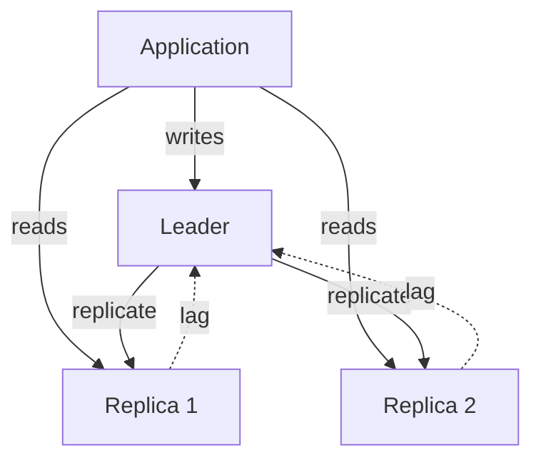
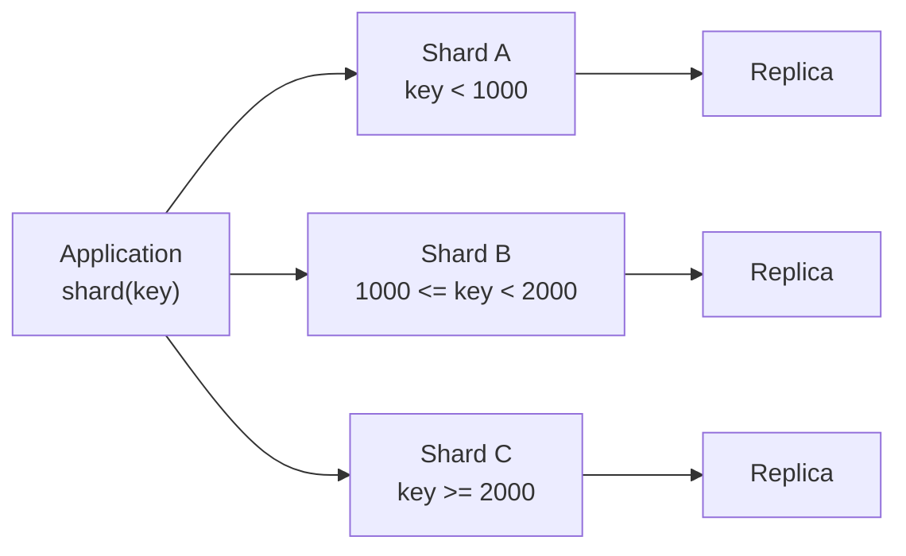

# Replication, Sharding, and Database Partitioning

> **Interview answer (say this first).** Replication keeps copies of the same data on several nodes, which buys availability and read scale; it is leader-follower (one writer, many readers), multi-leader, or leaderless. The key trade is synchronous versus asynchronous: synchronous waits for replicas and is safer but slower, asynchronous is fast but a crash can lose the last writes and readers can lag, which breaks read-your-writes unless you read from the leader. Sharding splits *different* data across nodes so writes and storage scale; the shard key decides whether the split is even. Partitioning is the same idea inside one database: horizontal by rows, vertical by columns. The hard part of sharding is choosing the key and resharding later.

## Why this exists

A single database server has a hard ceiling. Disk, memory, CPU, and connections all run out. Two different problems appear as you grow:

1. **Too much read traffic or a need for high availability.** The data fits on one node, but one node cannot serve all the reads, and if it dies the product stops. You want copies. This is **replication**.
2. **Too much data or too many writes for one node.** The dataset itself no longer fits, or the write rate exceeds one machine. You must split the data. This is **sharding** (or partitioning across machines).

They are not the same tool, and confusing them causes bad architecture. Replication gives you the *same* data in more places. Sharding gives you *different* data in different places. A system often uses both: each shard has a leader and replicas.

For AI systems the pressure is specific. Vector indexes and embeddings are large and read-heavy, so replicas help. Agent state, conversation history, and job records are write-heavy and grow forever, so sharding helps. And multi-tenant products need a shard key that keeps one tenant's data together while spreading tenants evenly.

There is also a correctness problem hiding in replication: **the replica is behind**. A user updates their profile, the write goes to the leader, then their next read hits a replica that has not caught up and shows the old value. That is a bug to the user even though every node is "working". Replication is easy to add and subtle to get right.

> **Note.** Replication is about copies; sharding is about splitting. Replication does not scale writes, and sharding does not by itself give you availability.

## Start from zero

| Word | Plain meaning |
| --- | --- |
| **Replication** | Keeping copies of the same data on multiple nodes. |
| **Leader (primary)** | The node that accepts writes. |
| **Follower (replica)** | A node that copies the leader and usually serves reads. |
| **Leader-follower** | One writer, many read replicas. The common default. |
| **Multi-leader** | Several nodes accept writes, so conflicts must be resolved. |
| **Leaderless** | Any node accepts reads and writes, using quorums. |
| **Synchronous** | The write waits for replicas before it is acknowledged. |
| **Asynchronous** | The write is acknowledged before replicas catch up. |
| **Semi-synchronous** | Wait for at least one replica, not all. |
| **Replication lag** | How far a replica is behind the leader, in time or bytes. |
| **Read-your-writes** | A client must see its own earlier write on a later read. |
| **Monotonic reads** | A client must not go backwards in time across reads. |
| **Failover** | Promoting a follower when the leader dies. |
| **Split brain** | Two nodes both believe they are leader and accept writes. |
| **Quorum** | A majority of nodes agreeing, used to avoid split brain. |
| **Sharding** | Splitting different data across independent nodes. |
| **Shard key** | The field used to decide which shard holds a row. |
| **Range partitioning** | Shards by contiguous key ranges, such as dates. |
| **Hash partitioning** | Shards by `hash(key)`, which spreads keys evenly. |
| **Hot shard** | One shard receiving far more traffic than the others. |
| **Resharding** | Changing the number or boundaries of shards. |
| **Partition pruning** | Skipping partitions that cannot match a query. |
| **Horizontal partitioning** | Splitting by rows (different rows in different places). |
| **Vertical partitioning** | Splitting by columns (different columns in different tables). |
| **Read replica** | A follower used only for read traffic. |

Two distinctions to pin down:

- **Replication vs sharding.** Replication = same data, many copies. Sharding = different data, many places. Replication scales reads and availability; sharding scales writes and storage.
- **Partitioning vs sharding.** Partitioning splits data into pieces; sharding spreads those pieces across machines. Partitioning can happen inside one database; sharding is the distributed version.

## The core idea

Two everyday pictures.

**Replication is photocopies of one book.** The original lives in the library (the leader). Several photocopies sit in reading rooms (followers). Anyone can read a copy, so many people read at once. But when the author edits the original, the photocopies are briefly out of date, and each copy is updated by hand. If the original is destroyed, you promote a copy — but any edits not yet copied are lost.

**Sharding is splitting one encyclopedia across shelves by letter.** Shelf A holds A–F, shelf B holds G–M, and so on. Each shelf is smaller and independently managed. Lookups are fast if you know the letter. But letters are not equally popular, so some shelves get far more use — that is a hot shard. And if you later add a shelf, you must move some volumes, which is resharding.

Replication with read scaling, drawn once:



And sharding across shards, each with its own leader and replica:



Here is the comparison that answers most interview questions. This table is the topic on one screen.

| Choice | Gives you | Costs you | Use when |
| --- | --- | --- | --- |
| **Synchronous replication** | No data loss on failover | Write latency, lower availability | Money, ledgers, anything you cannot lose |
| **Asynchronous replication** | Fast writes, high availability | Possible data loss, stale reads | Feeds, analytics, caches, timelines |
| **Leader-follower** | Simple, read scale | Single writer, lag | The common default |
| **Multi-leader** | Local writes in many regions | Conflict resolution | Multi-region writes |
| **Range sharding** | Efficient range scans | Hot shards | Time series, ordered data |
| **Hash sharding** | Even spread | Expensive range scans | Key-value lookups, user data |

## How it works

**Replication.**

1. All writes go to the leader, which appends them to a replication log (in Postgres, the write-ahead log).
2. Followers stream that log and apply it, in order, to their own copy.
3. Reads can go to the leader or to followers. Sending reads to followers spreads the load.
4. The acknowledgment policy decides durability: synchronous waits, asynchronous does not, semi-synchronous waits for one.
5. On leader failure, a controller promotes the most up-to-date follower. In a quorum system, promotion needs a majority so two leaders cannot both win.

**Read-your-writes.**

1. The write is acknowledged by the leader.
2. The user's next read goes to a lagging follower and shows old data.
3. Fix it by reading from the leader for a short window after a write, or by tracking a log position and waiting until a replica reaches it.
4. Session stickiness to one replica gives monotonic reads but not read-your-writes unless that replica is the leader or is caught up.

**Sharding.**

1. Choose a shard key with high cardinality, even distribution, and alignment with your common queries.
2. Compute the shard with a function: `hash(key) % N` or a lookup table, or a consistent-hash ring.
3. Route every read and write by that key.
4. Keep queries single-shard where possible. Cross-shard joins and transactions are expensive and often require a scatter-gather.
5. Plan resharding from day one: use many logical shards mapped onto few physical nodes, so you can move a whole logical shard without rehashing every key.

**Resharding.**

1. Add the new shard or node.
2. Copy the logical shards or key ranges it will own.
3. Switch reads to the new location, then writes.
4. Keep the old copy briefly for rollback, then delete it.

**Partitioning inside one database.**

1. **Horizontal partitioning** splits rows: `orders_2025`, `orders_2026`, or Postgres declarative partitions by range.
2. **Vertical partitioning** splits columns: hot, narrow columns in one table and large, rarely read columns (blobs, JSON) in another.
3. The database can then prune partitions a query cannot match, so it reads less.
4. Partitioning improves manageability and can improve performance, but it does not spread load across machines by itself.

> **Tip.** Choose the shard key by your most common query, not by what looks evenly distributed. A perfect hash of a key you never filter on forces every query to scatter across all shards.

## The syntax you will use

**Postgres streaming replication is configuration.** The leader records enough detail for replicas to replay.

```text
# postgresql.conf on the leader
wal_level = replica
max_wal_senders = 10
synchronous_standby_names = 'ANY 1 (replica1, replica2)'   # which standbys count as synchronous
synchronous_commit = on          # wait for synchronous_standby_names (durable, slower)
                                 # local = flush locally only; failover can lose recent writes
```

**The application routes reads and writes to different pools.** A read replica is just another connection target.

```python
WRITE_POOL = create_pool(leader_dsn)
READ_POOL = create_pool(replica_dsn)

def save_profile(user_id, data):
    with WRITE_POOL.connection() as conn:
        conn.execute("UPDATE profiles SET data=%s WHERE id=%s", (data, user_id))

def load_profile(user_id):
    with READ_POOL.connection() as conn:            # may be slightly behind
        return conn.execute("SELECT data FROM profiles WHERE id=%s", (user_id,)).fetchone()
```

**Read-your-writes: send the user to the leader briefly after a write.** A timestamp or a version token makes the choice explicit.

```python
def load_profile_after_write(user_id, last_write_at):
    pool = WRITE_POOL if time.time() - last_write_at < 2.0 else READ_POOL
    with pool.connection() as conn:
        return conn.execute("SELECT data FROM profiles WHERE id=%s", (user_id,)).fetchone()
```

**Consistent hashing spreads keys and limits remapping.** Virtual nodes keep the distribution even.

```python
class Ring:
    def __init__(self, nodes, vnodes=200):
        self.positions, self.owner = [], {}
        for node in nodes:
            for i in range(vnodes):
                pos = h(f"{node}#{i}")
                bisect.insort(self.positions, pos)
                self.owner[pos] = node

    def get(self, key):
        idx = bisect.bisect_left(self.positions, h(key)) % len(self.positions)
        return self.owner[self.positions[idx]]
```

**A logical-shard lookup makes resharding a mapping change.** Many logical shards move between few physical nodes, so you copy a shard rather than rehash every key.

```python
SHARD_MAP = {i: f"node-{i % 4}" for i in range(1024)}   # 1024 logical shards

def physical_node(key):
    logical = hash_key(key) % 1024
    return SHARD_MAP[logical]                            # remap one entry to reshard
```

**Postgres declarative partitioning splits a table by range.** Queries that filter on the partition key skip the other partitions.

```sql
CREATE TABLE events (
    id          bigint GENERATED ALWAYS AS IDENTITY,
    created_at  timestamptz NOT NULL,
    payload     jsonb
) PARTITION BY RANGE (created_at);

CREATE TABLE events_2026_09 PARTITION OF events
    FOR VALUES FROM ('2026-09-01') TO ('2026-10-01');
```

**Vertical partitioning moves cold, wide columns out of the hot table.**

```sql
-- hot path: small rows, fast scans
CREATE TABLE documents (id bigint PRIMARY KEY, title text, updated_at timestamptz);
-- cold data: large payloads, read only on detail view
CREATE TABLE document_bodies (document_id bigint PRIMARY KEY REFERENCES documents(id),
                              body text, embedding vector(1536));
```

## Examples: simple to real

**Example 1 — naive `hash % N` remaps almost everything.** Move from 3 shards to 4 and 74% of keys change shard. Every one of those is a cache miss and, if data is not moved, a wrong or missing read.

```text
mod-N 3 -> 4 nodes: 7391 / 10000 keys moved (74%)
```

This is why you do not reshard a hashed system by changing `N` in place.

**Example 2 — consistent hashing moves only the new node's share.** Adding a fourth node moves 22% of keys, close to the ideal 25%. The rest stay put, so only that slice needs migrating.

```text
consistent hashing 3 -> 4 nodes: 2164 / 10000 keys moved (22%)
expected ideal share: ~25%
```

**Example 3 — virtual nodes keep the ring balanced.** Without them, one node can own a large arc of the ring. With 200 virtual nodes each, the four shards hold 2,164 to 2,780 of 10,000 keys.

```text
shard distribution: {'shard-a': 2592, 'shard-b': 2464, 'shard-c': 2780, 'shard-d': 2164}
```

**Example 4 — range versus hash partitioning under a hotspot.** A burst of recent dates lands unevenly on range shards (one shard gets two of three), but spreads across hash shards (one each).

```text
range partition load for recent dates: {'shard-a': 1, 'shard-b': 2}
hash partition load for recent dates: {'shard-b': 1, 'shard-a': 1, 'shard-c': 1}
```

Range partitioning is efficient for "last 7 days" queries but concentrates recent writes. Hash partitioning spreads writes but makes range scans scatter.

**Example 5 — replication lag breaks read-your-writes.** The write is visible on the leader immediately. A follower that has not caught up returns nothing (or an old value) until replication arrives.

```text
read from leader: v2
read from lagging follower: None
read after replication catches up: v2
```

The user sees their update "disappear" for a moment. Route them to the leader briefly, or wait for the replica to reach the write's position.

**Example 6 — quorum overlap.** With three replicas, writing to two and reading from two guarantees the read set overlaps the write set, so a read sees the latest acknowledged write.

```text
quorum overlap (W + R > N): True
```

This is the arithmetic behind leaderless stores such as Cassandra and Dynamo-style systems: `R + W > N` for strong-enough reads.

## In production

- **Replication does not scale writes.** Every replica still applies every write. If writes are the bottleneck, you need sharding, not more replicas.
- **Choose synchronous only where loss is unacceptable.** Synchronous replication adds latency and can reduce availability when a replica is slow. Use it for money and ledgers, and mixed policies elsewhere.
- **Design for replication lag from the start.** A user who edits then reads is the common bug. Route the session to the leader after a write, or track the log position.
- **Plan failover and test it.** Promotion needs a majority to avoid split brain, and clients must reconnect to the new leader. An untested failover is not a failover.
- **Pick the shard key from real queries.** High cardinality and even distribution matter, but the decisive question is which key appears in your common `WHERE` clause. Avoid keys that you filter by only occasionally.
- **Avoid cross-shard transactions.** They need two-phase commit or an application-level saga, which is slower and more fragile. Model data so a business operation usually stays within one shard.
- **Do not shard too early.** Sharding adds routing, resharding, and cross-shard query costs. Replicate, index, and partition inside one database first.
- **Use many logical shards from day one.** Mapping 1,024 logical shards onto a few nodes makes future growth a copy operation instead of a global rehash.
- **Watch for hot shards.** A single celebrity user, a sequential ID, or a "latest" index can pin traffic to one shard. Salt the key, split the hot key, or use range partitioning only where it matches the access pattern.
- **Horizontal partitioning is not free.** Too many partitions slow planning and DDL. Prune them, and archive old partitions instead of keeping decades online.
- **Vertical partitioning helps when rows are wide.** Moving blobs and vectors out of the hot table reduces I/O for common queries, at the cost of a join on the detail path.
- **Replica reads are eventually consistent.** Reads from a lagging replica can break invariants. Do not run critical checks (like "has this coupon been used?") on a replica without accounting for lag.

## Interview questions

### 1. What is the difference between replication and sharding?

**Answer.** Replication keeps copies of the same data on multiple nodes, which improves availability and read throughput but does not increase write capacity, because every replica applies every write. Sharding splits different data across nodes, which increases write capacity and storage, but adds routing and cross-shard query complexity. They are complementary: each shard is usually replicated.

**Follow-up: "Which one solves a write bottleneck?"** Sharding. If one node cannot accept the write rate, more copies of the same data do not help. You must split the writes, which is sharding or partitioning.

**Trap.** Saying "we replicate for scale" when the problem is write volume. That answer does not address the bottleneck.

### 2. Synchronous vs asynchronous replication — how do you choose?

**Answer.** Synchronous waits for at least one replica before acknowledging, so an acknowledged write survives leader failure; the cost is write latency and lower availability if the replica is slow. Asynchronous acknowledges immediately and replicates in the background, so it is fast and available but can lose the last writes on failover and exposes readers to lag. Semi-synchronous waits for one replica, a middle ground.

**Follow-up: "What is the failure window with async replication?"** Any writes not yet replicated at the moment of failure are lost. The size of that window is the replication lag in time. For a ledger, that is unacceptable; for a timeline, it usually is not.

**Trap.** Assuming synchronous means zero loss in all cases. If the only synchronous replica fails together with the leader, or if the quorum is not configured, loss can still happen.

### 3. What is read-your-writes, and how do you enforce it?

**Answer.** Read-your-writes is the guarantee that after a client writes a value, its later reads see that value. Async replicas break it when a read hits a lagging follower. Enforce it by reading from the leader for a short window after a write, by passing the write's log position and waiting for a replica to reach it, or by pinning the session to the leader for writes and subsequent reads.

**Follow-up: "Why not always read from the leader?"** That defeats the purpose of replicas and puts all read load back on one node. The usual pattern is leader reads only for a short window after a write, and replica reads otherwise.

**Trap.** Confusing it with monotonic reads. Read-your-writes says you see your own write; monotonic reads say you never go backwards in time. A single lagging replica can preserve monotonicity but not read-your-writes.

### 4. How do you choose a shard key?

**Answer.** Look for high cardinality, even distribution, immutability, and, most importantly, alignment with your common queries so most operations touch one shard. A user ID is often ideal for user-centric products. Avoid low-cardinality keys, monotonically increasing keys that create hot shards, and keys that your main query does not filter on.

**Follow-up: "What if no single key fits all queries?"** You accept scatter-gather for some queries, maintain secondary lookup tables mapping other keys to the shard, or denormalise a copy of the data by the second access path. Each option trades write complexity for read speed.

**Trap.** Choosing a key for even distribution alone, then discovering that the most common query does not include it and must fan out to every shard.

### 5. Range versus hash partitioning — what are the trade-offs?

**Answer.** Range partitioning keeps ordered keys together, so range scans such as "all orders in September" are efficient, but recent or sequential keys concentrate on one shard. Hash partitioning spreads keys evenly and avoids that hotspot, but range scans must query every shard. Time-series and log data often suit range; user and key-value data often suit hash.

**Follow-up: "How do you fix a hot range shard?"** Split the range into smaller ranges, add a salt or a random suffix to spread writes, or use hash partitioning for the hot dimension. Some systems combine both: hash by user, range by time inside each user.

**Trap.** Assuming range partitioning automatically balances load. It balances storage, not necessarily traffic.

### 6. What is resharding, and why is it hard?

**Answer.** Resharding changes how many shards exist or where keys live. It is hard because it requires moving data while the system stays live, keeping reads and writes correct during the move, and avoiding a global rehash that touches nearly every key. The standard mitigation is many logical shards mapped onto physical nodes, so growth moves whole shards rather than rehashing all keys.

**Follow-up: "How do you keep reads correct during a move?"** Copy the data, then switch reads, then writes, with a short window where the old and new locations are both updated or the old is still authoritative. Dual writes, a change log, and a rollback path are the usual tools.

**Trap.** Planning to "just rehash" later. If `hash % N` is embedded everywhere, changing `N` is a full migration and an outage risk.

### 7. What is database partitioning, and when does it help?

**Answer.** Partitioning splits one logical table into smaller pieces. Horizontal partitioning splits rows, often by time or key range; vertical partitioning splits columns, moving wide, cold columns out of the hot table. It helps with manageability (drop an old partition instead of deleting millions of rows), query pruning, and index size. It does not by itself spread load across machines.

**Follow-up: "How is that different from sharding?"** Partitioning usually happens inside one database; sharding spreads partitions across independent nodes. You can think of sharding as distributed partitioning.

**Trap.** Believing partitioning multiplies write capacity. On a single server it does not; it mainly improves I/O locality and operations.

### 8. What are the main failure modes of a replicated, sharded system?

**Answer.** Replication lag causing stale reads and lost writes on failover; split brain when two nodes both accept writes; hot shards from a poor key; cross-shard queries and transactions being slow or unavailable; and resharding that corrupts or loses data if the copy and switch are not atomic. Each one needs monitoring and a tested recovery plan.

**Follow-up: "How do you detect split brain?"** Use quorum-based leader election and fencing tokens. A leader that cannot renew its lease must stop accepting writes. Never allow a leader to be promoted without a majority agreement.

**Trap.** Treating a replica as an exact copy. It is a copy with a delay, and during a partition it may be diverged or stale.

## Remember this

- **Replication copies data; sharding splits data.** Only sharding scales writes.
- **Sync replication is safe but slow; async is fast but can lose the last writes** and exposes stale reads.
- **Read-your-writes needs leader reads or a log-position wait** when replicas lag.
- **Choose the shard key from your common query,** not just for even distribution.
- **Use many logical shards and consistent hashing** so resharding moves a shard, not the world.
