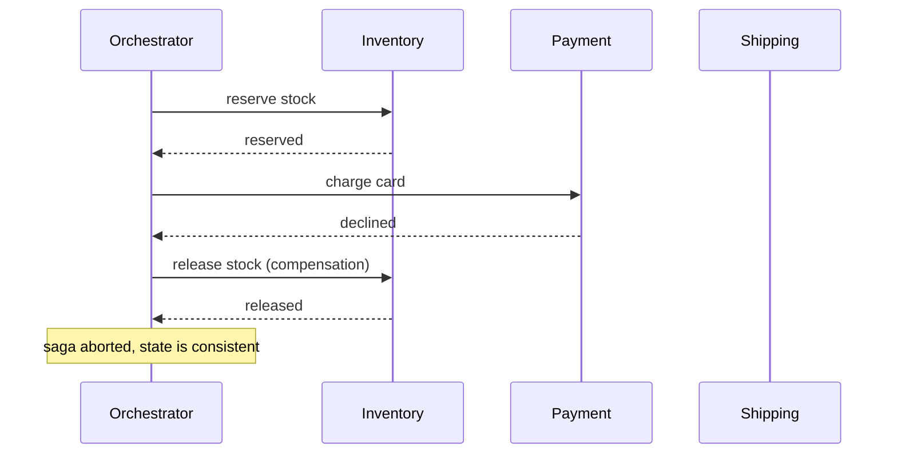
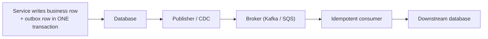

# Saga Pattern and Transactional Outbox

> **Interview answer (say this first).** You cannot have an atomic transaction across separate services and a message broker, and two-phase commit is avoided because it is slow, blocking, and operationally fragile. A **saga** replaces one big transaction with a sequence of local transactions, each with a **compensating action** to undo it if a later step fails. Sagas have no isolation, so intermediate states are visible and must be handled. The **transactional outbox** solves the related problem of publishing an event atomically with a database write: write the event into an outbox table in the same transaction as the business change, then a separate publisher forwards it to the broker. Combined with idempotent consumers, this gives reliable at-least-once delivery without distributed transactions.

## Why this exists

Imagine an order flow that must reserve inventory, charge a card, and create a shipment. In a single database these three writes are one transaction: `BEGIN`, do all three, `COMMIT`. If anything fails, roll back and nothing happened.

Now split those steps across three services, each with its own database, and add a message broker. The clean atomicity is gone:

- You cannot hold a database transaction open while calling a remote service. Locks would be held for the length of a network round trip, and a timeout would leave the lock in doubt.
- You cannot atomically write to your database *and* publish to Kafka. These are two different systems. Whichever you do first, a crash in between leaves a gap: the order is saved but no event was sent, or an event was sent for an order that was never saved.

Two classic solutions exist, and both are avoided for good reasons:

1. **Two-phase commit (2PC).** A coordinator asks every participant to prepare, then tells everyone to commit. It is atomic but **blocking**: a participant that has prepared holds locks until the coordinator decides. If the coordinator dies, participants are stuck. It is slow and operationally painful across services and brokers.
2. **Distributed locks and best-effort calls.** Fragile and easy to get wrong; a timeout leaves you unsure whether the remote action happened.

So distributed systems use two patterns instead:

- **Sagas** for long-running multi-step business processes that must undo partial work.
- **Transactional outbox** for publishing an event exactly when a database change is committed.

They are closely related. A saga step usually needs to publish an event, and that publish needs an outbox. Together they are the backbone of reliable event-driven systems, including long-running AI agent workflows.

> **Note.** The core problem is the **dual write**: you must update state and send a message, but you have no single transaction spanning both. The outbox turns two writes into one.

## Start from zero

| Word | Plain meaning |
| --- | --- |
| **Distributed transaction** | A transaction spanning several services or databases. |
| **2PC (two-phase commit)** | A prepare phase and a commit phase coordinated across participants. |
| **Coordinator** | The process that runs a 2PC transaction. |
| **Blocking protocol** | One where participants hold locks while waiting for a decision. |
| **Saga** | A sequence of local transactions, each with a compensating action. |
| **Local transaction** | A normal transaction inside one service's own database. |
| **Compensating action** | A reverse operation that undoes a completed step. |
| **Orchestration** | A central coordinator tells each step what to do. |
| **Choreography** | Services react to each other's events with no central coordinator. |
| **Pivot transaction** | The step after which the saga will complete, so no more rollback. |
| **Semantic lock** | A status flag that marks a record as "in progress" to hide partial state. |
| **Isolation** | The guarantee that other transactions cannot see uncommitted changes. |
| **Eventually consistent** | State converges if no new failures occur; intermediate states are visible. |
| **Outbox** | A table in the same database that holds events to be published. |
| **Inbox / dedup table** | A table that records processed event IDs to reject duplicates. |
| **CDC (change data capture)** | Streaming database changes, for example the write-ahead log, as events. |
| **Debezium** | A common open-source CDC tool that reads database logs. |
| **At-least-once** | Delivery may duplicate but will not silently drop. |
| **Idempotent consumer** | Processing the same message twice has the same effect as once. |
| **Dual write** | Writing to two systems with no shared transaction. |
| **Poison message** | A message that always fails and needs a dead-letter queue. |
| **Ordering** | Consumers see events for the same key in the order they were produced. |

Two distinctions to hold apart:

- **Saga vs outbox.** A saga is about *undoing multi-step business work*. An outbox is about *publishing an event atomically with a database write*. A saga step often uses an outbox to publish its result.
- **Orchestration vs choreography.** Orchestration has a central controller and is easier to reason about. Choreography has services listening to events and is more decoupled but harder to trace.

## The core idea

**Saga: a trip that can be cancelled.** You are booking a holiday: flight, hotel, car. Each booking is its own transaction with its own provider. If the car rental fails, you do not want to keep the flight and hotel. You call the hotel and cancel, then the airline and cancel. Those cancels are **compensating actions**. You never had one big transaction, but you end in a sensible state.

Notice what cancellation is *not*: it is not a rollback. The booking existed for a moment, a confirmation email may have been sent, and the seat was held. Compensation is a new forward action that undoes the *effect*, not a time machine.

**Outbox: the to-do list in the same drawer.** You cannot atomically update two systems. But you can update one system and write a reminder in that same system, atomically. The reminder says "after this commit, publish OrderPlaced". A background worker reads the reminders and publishes them. If the worker crashes, the reminder is still there and is retried. That reminder table is the **outbox**.

An orchestrated saga, drawn once:



The outbox flow, drawn once:



Here is how the two patterns compare. This is the topic on one screen.

| Aspect | Saga | Transactional outbox |
| --- | --- | --- |
| **Problem solved** | Multi-step work across services | Atomic state + event publication |
| **Core mechanism** | Local transactions + compensations | Outbox table + publisher or CDC |
| **Isolation** | None; partial states visible | Not applicable; it is about delivery |
| **Failure handling** | Compensate completed steps | Retry publishing until it succeeds |
| **Delivery** | Each step plus its event | At-least-once, so consumers must dedupe |
| **When to use** | Long business processes (orders, bookings) | Any service that publishes events on writes |

## How it works

**Orchestrated saga.**

1. The orchestrator runs the first local transaction: `reserve_inventory(order)`.
2. On success it records the step as completed and calls the next service.
3. If a step fails, it runs the compensating actions for all completed steps, **in reverse order**.
4. A compensation must be idempotent, because it can be retried.
5. A step may be retryable (a transient network error) or compensatable (already committed, so undo it). Distinguish the two.
6. After the **pivot transaction**, the saga will commit no matter what; remaining steps are retried until they succeed.
7. Persist saga state as it goes, so a crash can resume the saga rather than losing it.

**Choreographed saga.**

1. Each service publishes an event after its local transaction.
2. The next service subscribes and does its work, then publishes its own event.
3. If a later service emits a failure event, earlier services listen for it and compensate.
4. There is no central brain, so the flow lives in event subscriptions. It is decoupled but harder to see and debug; a side effect is accidental cycles.

**Lack of isolation.** A saga cannot hide intermediate state. Other transactions may see an order that is "placed" but not yet paid. Mitigate with:

- **Semantic locks:** mark the record `PENDING` and treat that state as not-final.
- **Committed-state reads:** only expose a record after the saga completes.
- **Versioning:** readers ignore versions that are still in progress.
- **Compensation that is visible:** show the user "cancelling" rather than pretending nothing happened.

**Transactional outbox.**

1. In one local transaction, write the business change **and** insert a row into the `outbox` table.
2. The transaction commits both or neither. This is the atomic step.
3. A publisher reads unpublished outbox rows and sends them to the broker.
4. After a successful publish, mark the row as published — in a second transaction. A crash between publish and mark causes a duplicate, which is why consumers must be idempotent.
5. Alternatively, **CDC** reads the database log and streams the outbox table automatically, so the application never polls.
6. Delete or archive old outbox rows to keep the table small.

**Idempotent consumers.**

1. Every event carries a unique `event_id`.
2. The consumer writes its side effect and inserts `event_id` into a unique `processed_events` table **in the same local transaction**.
3. A duplicate insert violates the unique constraint, so the consumer skips the side effect.
4. This makes at-least-once delivery safe: replaying an event changes nothing.

**Ordering.** Events for the same entity must be processed in order. Publish with the entity ID as the partition key so the broker keeps that entity's events in one ordered partition. Without a key, related events can arrive out of order and a consumer can apply an old state over a new one.

> **Tip.** A compensation is a business action, not a database rollback. It can fail, so it needs retries and an alert when it cannot complete. A saga stuck in "compensating" is an incident, not a solved problem.

## The syntax you will use

**An orchestrator runs steps and compensates in reverse.** The completed list is the key data structure.

```python
class Saga:
    def __init__(self):
        self.completed = []                 # (name, compensate_fn), in order

    def step(self, name, action, compensate):
        action()                            # local transaction
        self.completed.append((name, compensate))
        return True

    def rollback(self):
        for name, compensate in reversed(self.completed):
            compensate()                    # undo in reverse order
            log.info("compensated %s", name)
```

**The outbox table lives beside the business data.** One insert each, in one transaction.

```sql
CREATE TABLE outbox (
    id           bigint GENERATED ALWAYS AS IDENTITY PRIMARY KEY,
    event_id     uuid NOT NULL UNIQUE,
    aggregate_id text NOT NULL,
    event_type   text NOT NULL,
    payload      jsonb NOT NULL,
    published_at timestamptz,
    created_at   timestamptz NOT NULL DEFAULT now()
);
```

**Write the state and the event atomically.** If the transaction commits, both rows exist.

```python
with db.transaction():
    db.execute("INSERT INTO orders (id, sku, status) VALUES (%s, %s, 'placed')",
               (order_id, sku))
    db.execute(
        "INSERT INTO outbox (event_id, aggregate_id, event_type, payload) "
        "VALUES (%s, %s, 'OrderPlaced', %s)",
        (event_id, order_id, json.dumps({"order_id": order_id, "sku": sku})),
    )
# commit: order and event are now both durably present
```

**A publisher claims rows without blocking other publishers.** `SKIP LOCKED` lets several workers drain the outbox in parallel.

```sql
SELECT * FROM outbox
WHERE published_at IS NULL
ORDER BY id
LIMIT 100
FOR UPDATE SKIP LOCKED;
```

**Mark published after the broker acknowledges.** A crash before this line means a duplicate on the next pass.

```python
for row in claim_rows():
    broker.publish(row["event_type"], row["payload"])
    db.execute("UPDATE outbox SET published_at = now() WHERE id = %s", (row["id"],))
```

**An idempotent consumer dedupes in the same transaction as its side effect.** The unique key is the guard.

```sql
CREATE TABLE processed_events (
    event_id   uuid PRIMARY KEY,
    processed_at timestamptz NOT NULL DEFAULT now()
);
```

```python
def handle(event):
    with db.transaction():
        try:
            db.execute("INSERT INTO processed_events (event_id) VALUES (%s)",
                       (event["event_id"],))
        except UniqueViolation:
            return "already processed"      # duplicate: skip the side effect
        apply_side_effect(event)            # same transaction as the dedupe row
```

**CDC streams the outbox without polling.** Debezium reads the database log and publishes rows as they commit. This is a configuration shape, not application code.

```text
connector.class = io.debezium.connector.postgresql.PostgresConnector
table.include.list = public.outbox
transforms = route
transforms.route.type = org.apache.kafka.connect.transforms.ReplaceField$Value
# each committed outbox row becomes a Kafka record
```

## Examples: simple to real

**Example 1 — a saga that aborts and compensates.** Inventory is reserved, payment is declined, and the inventory reservation is released. The measured log shows the forward step and the compensation.

```text
saga result: aborted
  - inventory reserved
  - payment declined
  - inventory released (compensation)
```

There was no rollback. A real reservation was made and then explicitly reversed.

**Example 2 — compensation runs in reverse order.** A travel saga books flight, hotel, and car. The car fails, so the hotel is cancelled and then the flight. The order matters.

```text
result: aborted
  - do: book flight
  - do: book hotel
  - do: rent car
  - FAIL: rent car
  - compensate: book hotel
  - compensate: book flight
  - saga rolled back
```

Compensating in forward order can break invariants (for example, refunding before releasing stock that the refund depends on).

**Example 3 — a successful saga commits.** When every step succeeds, no compensation runs and the saga is committed.

```text
result: completed
  - do: book flight
  - do: book hotel
  - do: rent car
  - saga committed
```

**Example 4 — the outbox write is atomic with the state change.** The order row and the outbox event land together, and the event is unpublished until a publisher claims it.

```text
order stored: {'sku': 'widget', 'status': 'placed'}
outbox event stored: OrderPlaced published: False
```

If the process crashed immediately, the order would still be saved and the event would still be waiting.

**Example 5 — the publisher forwards exactly one event, and the consumer dedupes.** The publisher sends the outbox row; the broker receives one event. The consumer receives the same event twice and performs the side effect once.

```text
broker received: 1 event(s)
deliveries: ['processed', 'duplicate skipped']
side effects for 2 deliveries: 1
```

At-least-once delivery plus an idempotent consumer gives effectively-once side effects.

**Example 6 — crash recovery.** The process commits the order and outbox event, then crashes before publishing. A later publisher finds the unpublished row and forwards it.

```text
recovered outbox event: evt-order-10 published: False   (before the publisher runs)
after the next publisher: evt-order-10 published: True
```

No event was lost, because the event was already durable when the crash happened.

## In production

- **Prefer sagas to 2PC across services.** 2PC is blocking and fragile in a distributed system. Sagas trade atomicity for availability, which is usually the right trade for business processes.
- **Every compensating action must be idempotent and retryable.** It can run more than once. Make "cancel booking" safe to call twice.
- **Compensations can themselves fail.** Retry with backoff, alert when a saga is stuck, and provide a manual repair path. A saga that cannot compensate is a business incident.
- **No isolation means visible partial state.** Use semantic locks and statuses (`PENDING`, `CONFIRMED`) so readers do not treat in-progress work as final.
- **Persist saga state.** An in-memory orchestrator that dies mid-saga loses its place. Store the step and its result durably so the saga can resume.
- **Put the outbox in the same database as the business data.** A different database or a different transaction boundary reintroduces the dual write you are trying to remove.
- **Expect duplicates and design for them.** The gap between "published" and "marked published" guarantees at-least-once. Add a dedup or inbox table on the consumer side, storing processed event IDs next to the side effect in one transaction. Idempotent consumers are not optional.
- **Keep the outbox small.** Publish, then archive or delete old rows. An outbox that grows forever becomes a performance problem and slows every publisher scan.
- **Order events per entity.** Use the entity ID as the partition key, or include a version number and reject stale writes. Unordered events can apply old state over new.
- **Use a dead-letter queue for poison events.** An event that always fails will block a partition forever if you retry it in place.
- **Monitor outbox age, not just count.** The oldest unpublished row's age is your event-delivery latency. Alert on it before the broker backs up.
- **Test the crash points.** Kill the process after commit but before publish, and after publish but before mark. The system should recover both times.

## Interview questions

### 1. Why are distributed transactions and 2PC avoided?

**Answer.** Two-phase commit is a blocking protocol. Participants hold locks after preparing until the coordinator decides, so a slow or failed coordinator can stall them and lock resources. It adds latency, requires every participant to support the protocol, and is operationally fragile across microservices and message brokers. Most systems prefer sagas plus idempotency, which trade atomicity for availability.

**Follow-up: "When is 2PC still reasonable?"** Inside a single system or a tightly coupled cluster with reliable participants, where the lock time is short and the coordinator is highly available. It is a poor fit for cross-service, internet-scale workflows.

**Trap.** Assuming you can run a transaction across a database and Kafka. You cannot; that is the dual-write problem.

### 2. What is a saga, and how does it undo work?

**Answer.** A saga is a sequence of local transactions, one per service. If a step fails, the saga runs compensating actions for the steps that already completed, in reverse order. Compensation is a new business action that reverses the effect; it is not a database rollback, and it can fail, so it must be idempotent and retryable.

**Follow-up: "What if a compensation fails permanently?"** Retry with backoff, move the saga to a manual-repair state, and alert operations. The system must surface the stuck saga rather than silently leaving data inconsistent.

**Trap.** Calling compensation a rollback. The original action was committed and may have had visible effects such as an email.

### 3. Orchestration vs choreography — which do you choose?

**Answer.** Orchestration uses a central coordinator that calls each step and knows the whole flow; it is easier to reason about, trace, and change. Choreography has each service publish and subscribe to events with no central brain; it is more decoupled and can scale teams, but the end-to-end flow is implicit and cycles are easy to create. Most business processes with clear steps suit orchestration; a simple broadcast reaction suits choreography.

**Follow-up: "How do you debug a choreographed saga?"** Correlate events by a saga or correlation ID, and build a timeline. Without central state, tracing is the main cost.

**Trap.** Assuming choreography is always better because it is "loosely coupled". Loose coupling without observability gives you a system nobody can explain.

### 4. Sagas lack isolation. What does that mean in practice?

**Answer.** In a normal transaction, other transactions cannot see intermediate states. A saga has no such guarantee: another request can see an order that is placed but not paid, or inventory reserved but later released. That is why you use semantic locks or statuses such as `PENDING`, and why readers must be written to tolerate in-progress state.

**Follow-up: "How do semantic locks help?"** A `PENDING` flag tells other operations that the record is not final, so they can wait, reject, or hide it. It does not provide true isolation; it makes the partial state explicit and handleable.

**Trap.** Treating the saga's end state as if it were immediately consistent across services. Replicas, caches, and event consumers each have their own delay.

### 5. What is the transactional outbox, and what problem does it solve?

**Answer.** The outbox is a table in the same database as the business data. In one local transaction you write the business change and an outbox row describing the event to publish. A separate publisher reads unpublished rows and sends them to the broker. This removes the dual write: the event is durable exactly when the state change is committed, and a crash cannot lose it.

**Follow-up: "What publishes the rows?"** Either an application poller that claims rows with `FOR UPDATE SKIP LOCKED`, or CDC that streams the database log. CDC avoids polling and is often cleaner at high volume.

**Trap.** Writing the outbox row in a different transaction or database. That reintroduces the exact dual-write gap the pattern is meant to close.

### 6. Why do outbox systems still need idempotent consumers?

**Answer.** Because publication and marking are separate steps. If the publisher sends the event and then crashes before marking it published, the event is sent again on the next pass. That is at-least-once delivery, which is the honest guarantee. Consumers must therefore tolerate duplicates, usually by recording processed event IDs in the same transaction as the side effect, behind a unique constraint.

**Follow-up: "Can you get exactly-once delivery instead?"** Not end to end. You can get exactly-once *processing* by combining at-least-once delivery with idempotent, transactional consumers. The transport is still at-least-once.

**Trap.** Promising exactly-once delivery from Kafka or SQS alone. The broker does not control your consumer's side effects.

### 7. How do you handle ordering and duplicates together?

**Answer.** Key events by the entity ID so the broker keeps that entity's events in one ordered partition, and attach a version or sequence number so consumers can reject stale updates. For duplicates, use an inbox or dedup table with a unique event ID, committed with the side effect. Ordering and idempotency are separate concerns and you need both.

**Follow-up: "What if events arrive out of order across partitions?"** There is no global order across partitions. Design consumers to be commutative where possible, or include enough state (a version) to detect and drop stale events. If you need global order, you have a single partition and limited throughput.

**Trap.** Assuming per-key ordering gives global ordering. It does not, and cross-entity operations must not depend on it.

### 8. When would you not use a saga?

**Answer.** When the steps live in one database, where a normal transaction is simpler and stronger. When the operation is naturally idempotent and can simply be retried. When there is no meaningful compensating action — for example, sending an email or calling an external API with irreversible effects. And when a long-lived workflow engine already models the process; a durable workflow is often easier than hand-rolled saga state.

**Follow-up: "What about an irreversible external effect?"** Do not compensate it; schedule it as the last step, or put it behind a pivot transaction after which the saga can only move forward. Retry instead of undo.

**Trap.** Building a saga for a single-database operation. That adds failure modes for no benefit.

## Remember this

- **2PC is blocking and fragile; sagas trade atomicity for availability.**
- **Compensation is a forward action, not a rollback,** and it must be idempotent.
- **Sagas have no isolation**, so expose partial states explicitly with statuses.
- **The outbox makes the state change and the event one atomic write.**
- **Delivery is at-least-once; combine the outbox with idempotent consumers** for safe replay.
