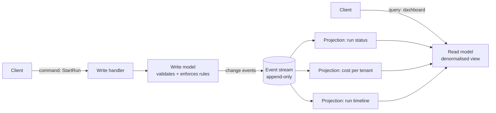

# CQRS

> **Interview answer (say this first).** CQRS — Command Query Responsibility Segregation — means you stop using one model for both writes and reads. The write side accepts commands, validates them, and enforces business invariants. The read side serves queries from one or more denormalised views built for the exact question being asked. The two sides are joined by a stream of change events, and because a projection lags the write, the read side is eventually consistent. CQRS pays off when read and write workloads differ in shape or scale; it is over-engineering for routine CRUD.

## Why this exists

Imagine an agent platform. The write side does a small amount of careful work: it starts a run, records each step, charges tokens, and finishes the run. Every write must enforce rules — a run cannot spend more than its budget, a step cannot be completed twice, a cancelled run cannot restart.

The read side does something completely different. A dashboard asks questions like:

- "How many runs are active right now, per tenant?"
- "What is the p95 token cost per step over the last seven days?"
- "Show me the full timeline of run `run-9`, with each tool call."

These questions need joins, aggregations, and a shape that is nothing like the normalised write tables. On a single model, the dashboard queries fight the writes:

```text
write side:  INSERT step, UPDATE run, INSERT token_ledger   (many small rows)
read side:   SELECT tenant, count(*), percentile(...)        (big scans, GROUP BY)
```

The read queries take locks, scan large tables, and slow the writes. The writes invalidate caches and churn indexes that the reads depend on. You scale the database for the average of two incompatible workloads, which is a good way to be bad at both.

The classic fix is to put a read replica in front. That helps with load, but not with **shape**: the replica still holds the write schema, so the dashboard keeps doing five-table joins. CQRS changes the shape. It maintains a separate view per query, updated as changes flow in.

> **The one-sentence purpose.** Split the write model from the read model, connect them with events, and let each side be optimised — and scaled — for its own job.

## Start from zero

| Word | Plain meaning |
| --- | --- |
| **Command** | A request to change state: `StartRun`, `RecordStep`, `CancelRun`. It can be rejected. |
| **Query** | A request to read state. It must not change anything. |
| **CQRS** | Command Query Responsibility Segregation. Separate models for commands and queries. |
| **Write model** | The authoritative state plus the rules. It validates commands and records changes. |
| **Read model** | A denormalised copy shaped for one query or screen. Also called a **projection** or **view**. |
| **Projection** | A process that consumes change events and updates a read model. |
| **Eventual consistency** | The read model is correct *eventually*; right after a write, it may be stale. |
| **Denormalisation** | Storing data joined or duplicated on purpose, so reads are cheap. |
| **Materialized view** | A database view whose result is stored and refreshed, instead of computed per query. |
| **Aggregate** | The cluster of objects a command changes together, with one consistency boundary. |
| **Event sourcing** | Storing the sequence of events as the source of truth, not just the current row. |
| **Read-your-writes** | A guarantee that a user sees their own write immediately, even if others do not. |
| **Idempotent projector** | A projector that can re-apply the same event without changing the result. |
| **Lag** | The delay between a write and the read model reflecting it. |

Two distinctions to hold on to.

**CQRS is not event sourcing.** CQRS separates read and write *models*. Event sourcing changes what you *store* — events instead of current state. You can do either without the other. They pair well because an event log is a convenient change stream for projections, but that is a choice.

**CQRS is not "two databases for fun."** The smallest form is two code paths over one store: a command handler writing normalised tables, a query handler reading a materialized view. The full form is separate stores. Start small.

## The core idea

Think of a restaurant. The **kitchen** accepts orders, enforces the rules (no dish before the ingredients are ready), and does the careful work. The **menu board** is a separate, simplified view for customers: it says what is available and what it costs. The board is updated shortly after the kitchen changes something. For a moment, the board can be stale — a dish just sold out may still be listed.

The kitchen and the board have different jobs, different formats, and different update rates. Nobody tries to serve customers by reading the kitchen's internal order tickets.



The arrows only go one way. Commands reach the write model. Queries reach the read model. Events flow between them. A query never touches the write model, so it cannot corrupt it or hold its locks.

Now the trade-off that defines CQRS, in one table:

| Question | One model (CRUD) | CQRS |
| --- | --- | --- |
| Read shape | Whatever the write schema gives you | Exactly the shape the query needs |
| Read/write scaling | Must scale together | Scale independently |
| Write validation | Easy, one place | Easy, still one place |
| Read freshness | Always current | Eventually consistent |
| Complexity | Low | Higher: projections, lag, replay, duplicate events |
| Good fit | Small apps, uniform load | Read-heavy, query-shaped, or separately scaled |

The cost of CQRS is **lag and moving parts**. You now own a stream, one projector per view, and the job of rebuilding a view when its shape changes. The benefit is that reads and writes stop compromising with each other.

## How it works

1. **A client sends a command.** `StartRun(run_id, tenant, budget)` is a request, not a statement of fact. It can fail validation.
2. **The write handler loads the aggregate.** It reads the current write state for that run, applies the rule, and decides.
3. **The write model commits state and emits an event in one transaction.** The state change and the event must be atomic, or you get an event with no state, or state with no event.
4. **The event lands in a durable stream.** This can be a Kafka topic, a Postgres `outbox` table, or a dedicated event store. Ordering per aggregate id matters; global ordering often does not.
5. **Each projection consumes the stream at its own pace.** One projection updates the dashboard counters; another updates the per-run timeline. They are independent and can lag by different amounts.
6. **A projection writes idempotently.** It records the last sequence number it applied per aggregate, so a redelivered event is skipped. This is what makes at-least-once delivery safe.
7. **A query reads only from a projection.** It does no joins against write tables. The view is shaped for the question, even if that duplicates data.
8. **Rebuild when the shape changes.** Because the event stream is durable, a projection can be replayed from the start into a fresh view, then swapped in. This is the superpower: the read model is disposable.
9. **Publish a version or token with writes.** The command response returns the new position (a sequence number or a version). A client that must see its own write polls the projection until it reaches that position.

> **Warning.** Ordering is per aggregate, not global. If two projectors consume the same stream with different parallelism, they can apply run A's events in different orders. Design each projection to depend only on events for one aggregate id, or to be commutative.

## The syntax you will use

**A command and its handler.** The command names an intent; the handler is the only place the rule is enforced.

```python
@dataclass
class RecordStep:
    run_id: str
    step_id: str
    tokens: int

def handle_record_step(cmd: RecordStep, store) -> Event:
    run = store.load(cmd.run_id)
    if run.status != "running":
        raise CommandRejected("run is not running")      # invariant lives here
    if run.tokens_spent + cmd.tokens > run.budget:
        raise CommandRejected("budget exceeded")
    return store.commit(run, "StepRecorded",
                        {"step_id": cmd.step_id, "tokens": cmd.tokens})
```

The handler does not serve reads. That separation is the whole idea.

**A projection with a checkpoint.** Store the last applied sequence per aggregate so re-delivery is a no-op.

```python
def apply_event(conn, event) -> None:
    run_id = event.payload["run_id"]     # the Event model keeps run_id in the payload
    row = conn.execute(
        "SELECT last_seq FROM projections WHERE view = %s AND aggregate_id = %s",
        ("run_summary", run_id),
    ).fetchone()
    if row and row[0] >= event.seq:
        return                                   # already applied: skip
    conn.execute(update_run_summary_sql, event)
    conn.execute(
        """INSERT INTO projections (view, aggregate_id, last_seq)
           VALUES (%s, %s, %s)
           ON CONFLICT (view, aggregate_id)
           DO UPDATE SET last_seq = EXCLUDED.last_seq""",
        ("run_summary", run_id, event.seq),
    )
```

The checkpoint row and the view update should be in one transaction.

**A read model shaped for the question.** No joins at query time; the projector does the join once.

```sql
CREATE TABLE run_summary (
    run_id       TEXT PRIMARY KEY,
    tenant       TEXT NOT NULL,
    status       TEXT NOT NULL,
    steps_done   INT  NOT NULL DEFAULT 0,
    tokens_spent BIGINT NOT NULL DEFAULT 0,
    last_seq     BIGINT NOT NULL DEFAULT 0
);
CREATE INDEX run_summary_tenant_status ON run_summary (tenant, status);
```

The dashboard query is now a single indexed `SELECT`, not a five-table aggregate.

**A materialized view for read-heavy reports.** Postgres can maintain the shape for you.

```sql
CREATE MATERIALIZED VIEW tenant_daily_cost AS
SELECT tenant, date_trunc('day', created_at) AS day, sum(tokens) AS tokens
FROM run_events GROUP BY 1, 2;

-- CONCURRENTLY requires a UNIQUE index on the view; without one the refresh fails.
CREATE UNIQUE INDEX tenant_daily_cost_key ON tenant_daily_cost (tenant, day);

REFRESH MATERIALIZED VIEW CONCURRENTLY tenant_daily_cost;   -- no read lock
```

Refresh on a schedule for reports; refresh per event only if you must.

**Reading your own write.** Return a position with the command result, then wait for the projection to catch up.

```python
def start_run(cmd) -> dict:
    event = write_model.start(cmd.run_id, cmd.tenant)
    return {"run_id": cmd.run_id, "position": event.seq}

def wait_until_visible(projection, run_id, position, timeout=2.0):
    # Pseudocode: `await_position` stands for whatever wait primitive the read
    # store exposes — poll last_seq, subscribe to a change feed, or block on a read.
    return projection.await_position(run_id, position, timeout)
```

**Transactional outbox.** Write the event in the same transaction as the state, then publish it from the outbox.

```sql
BEGIN;
UPDATE runs SET status = 'running' WHERE run_id = $1;
INSERT INTO outbox (aggregate_id, seq, kind, payload)
VALUES ($1, $2, 'RunStarted', $3::jsonb);
COMMIT;   -- a relay process publishes committed outbox rows
```

This closes the crash window between the state change and the event.

## Examples: simple to real

**Example 1 — separate read and write models, joined by events.** Verified below. The write model enforces the invariant; the read model answers the query; a projector moves events across.

```python
from dataclasses import dataclass


@dataclass
class Event:
    seq: int
    kind: str
    payload: dict


class CommandModel:
    """Write side: validates commands, enforces invariants, appends events."""

    def __init__(self) -> None:
        self.events: list[Event] = []
        self._balance: dict[str, int] = {}
        self._seq = 0

    def _emit(self, kind: str, payload: dict) -> Event:
        self._seq += 1
        event = Event(self._seq, kind, payload)
        self.events.append(event)
        return event

    def open_account(self, account_id: str, amount: int) -> Event:
        if account_id in self._balance:
            raise ValueError("account already exists")
        self._balance[account_id] = amount
        return self._emit("AccountOpened", {"account_id": account_id, "amount": amount})

    def deposit(self, account_id: str, amount: int) -> Event:
        if amount <= 0:
            raise ValueError("amount must be positive")
        self._balance[account_id] += amount
        return self._emit("MoneyDeposited", {"account_id": account_id, "amount": amount})

    def withdraw(self, account_id: str, amount: int) -> Event:
        if amount <= 0:
            raise ValueError("amount must be positive")
        if amount > self._balance[account_id]:
            raise ValueError("insufficient funds")   # the invariant lives here
        self._balance[account_id] -= amount
        return self._emit("MoneyWithdrawn", {"account_id": account_id, "amount": amount})


class ReadModel:
    """Read side: a denormalised projection, rebuilt by replaying events."""

    def __init__(self) -> None:
        self.balance: dict[str, int] = {}
        self.history: dict[str, list[str]] = {}
        self.last_seq = 0

    def apply(self, event: Event) -> None:
        if event.kind == "AccountOpened":
            a = event.payload["account_id"]
            self.balance[a] = event.payload["amount"]
            self.history[a] = [f"open {event.payload['amount']}"]
        elif event.kind == "MoneyDeposited":
            a = event.payload["account_id"]
            self.balance[a] += event.payload["amount"]
            self.history[a].append(f"+{event.payload['amount']}")
        elif event.kind == "MoneyWithdrawn":
            a = event.payload["account_id"]
            self.balance[a] -= event.payload["amount"]
            self.history[a].append(f"-{event.payload['amount']}")
        self.last_seq = event.seq


class Projector:
    """Moves the read model forward. It lags; that lag is eventual consistency."""

    def __init__(self, write_model: CommandModel, read_model: ReadModel) -> None:
        self.write_model = write_model
        self.read_model = read_model

    def lag(self) -> int:
        return len(self.write_model.events) - self.read_model.last_seq

    def catch_up(self) -> int:
        applied = 0
        for event in self.write_model.events:
            if event.seq > self.read_model.last_seq:
                self.read_model.apply(event)
                applied += 1
        return applied
```

**Example 2 — run it and watch the lag.** The write side is instantly correct; the read side is temporarily empty. This is eventual consistency made concrete.

```python
write = CommandModel()
read = ReadModel()
projector = Projector(write, read)

write.open_account("acct-1", 100)
write.deposit("acct-1", 50)
write.withdraw("acct-1", 30)

print("write-side truth:", write._balance["acct-1"])
print("read-side before projection:", read.balance)
print("projection lag:", projector.lag())

applied = projector.catch_up()
print("applied", applied, "events")
print("read-side after projection:", read.balance["acct-1"])
print("read history:", read.history["acct-1"])
print("projection lag now:", projector.lag())
```

Verified output:

```text
write-side truth: 120
read-side before projection: {}
projection lag: 3
applied 3 events
read-side after projection: 120
read history: ['open 100', '+50', '-30']
projection lag now: 0
```

The read model started empty and caught up. In production that window is milliseconds to seconds; under load and replay it can be longer.

**Example 3 — the read model is disposable; rebuild it from events.** New query shape or a projection bug: replay into a fresh view and swap it in.

```python
rebuilt = ReadModel()
Projector(write, rebuilt).catch_up()
print("rebuilt read model matches:", rebuilt.balance == read.balance)
```

Verified output:

```text
rebuilt read model matches: True
```

This is why an append-only change stream is worth its cost. The read side is a cache you are allowed to throw away.

**Example 4 — agent platform, end to end.** The shape you would actually deploy for an agent dashboard.

```text
Command side (one writer per run):
  RecordStep(run_id, step_id, tokens)
    -> validate budget and status
    -> UPDATE runs, INSERT step, INSERT outbox  (one transaction)
    -> return {"position": seq}

Event stream:  run.started, step.recorded, run.finished  keyed by run_id

Projections:
  run_summary    -> per-run status, steps_done, tokens_spent   (dashboard)
  tenant_cost    -> daily token totals per tenant              (billing report)
  run_timeline   -> ordered list of steps and tool calls       (detail view)

Query side:
  SELECT ... FROM run_summary WHERE tenant = $1 AND status = 'running'
```

Each projection has its own lag and its own checkpoint. A slow billing projection never blocks the status dashboard.

> **Tip.** Let the command response carry the new position. When a user clicks "start run" and is immediately sent to the run page, the page can pass that position and poll the projection until it is visible. That is read-your-writes without weakening the rest of the system.

## In production

- **Do not start with CQRS.** Start with one model. Split only when a read shape or a scaling mismatch actually hurts. The complexity is real and permanent.
- **Lag is a product decision.** Dashboards are usually fine with a second or two. A user who just saved a record is not. Decide per view and implement read-your-writes where it matters.
- **Projections must be idempotent.** With at-least-once delivery, every projector sees duplicates. Checkpoint the last applied sequence per aggregate and skip replays.
- **Checkpoint and view update in one transaction.** Otherwise a crash between them re-applies or drops an event. This is the same atomicity problem as any other side effect.
- **Order by aggregate, not globally.** Key the stream by `run_id` (or the aggregate id) so each run's events stay ordered. Do not assume total order across a partitioned topic.
- **Version your events and views.** An event schema change is a breaking change for every projector. Add fields with defaults; version the event kind; keep old projectors working during a rollout.
- **Rebuilds are routine, not emergencies.** Keep the raw stream long enough to rebuild every view. A projection bug fix should be a replay, not a data-repair script.
- **Guard against projection divergence.** Rename a field and one projector silently stops updating. Alert on projection lag and on "last processed position" stalls, not just on queue depth.
- **Denormalisation costs write amplification.** One write may update several views. Budget for it and keep projectors cheap; do heavy derivation at read time only if it is rare.
- **CQRS and event sourcing are independent.** You can have CQRS over ordinary tables with an outbox. Event sourcing adds audit and time travel but also snapshots, upcasting, and stream length. Adopt both only if you need both.

## Interview questions

### 1. What is CQRS in one sentence?

**Answer.** CQRS separates the model that handles writes from the model that serves reads. Commands go to a write model that validates and enforces invariants; queries go to one or more denormalised read models kept up to date by a stream of change events. The read side is eventually consistent.

**Follow-up: "Why separate them at all?"** Because reads and writes have different shapes and different scaling profiles. One shared model forces a compromise: read queries do heavy joins against write tables, and writes contend with read traffic.

**Trap.** Saying CQRS means two databases. The minimum is two code paths; the storage split is optional and often premature.

### 2. Is CQRS the same as event sourcing?

**Answer.** No. CQRS is about separating read and write models. Event sourcing is about storing the sequence of events as the source of truth instead of the current row. They often appear together because an event log is a natural change feed, but either can exist without the other.

**Follow-up: "Which would you adopt first?"** CQRS, usually, and in its lightest form: an outbox plus a materialized view. Event sourcing is a bigger commitment — snapshots, schema upcasting, stream length — that you adopt when audit and time travel are requirements.

**Trap.** Using "CQRS" and "event sourcing" as synonyms. Interviewers use this to check whether you have actually designed one.

### 3. How does the read side stay correct, and what is eventual consistency here?

**Answer.** A projection consumes change events and updates the read model. Each projection records the last sequence number it applied, so redelivery is a no-op. The read model is eventually consistent: right after a write, a query may see the old value until the projector catches up. Correctness comes from replaying the durable stream in order per aggregate.

**Follow-up: "What if the projector crashes mid-batch?"** It restarts from its recorded position and re-applies the batch. Because application is idempotent and the checkpoint moves atomically with the view update, restarting duplicates no effect.

**Trap.** Assuming eventual consistency means "sometimes wrong forever." It means stale for a bounded, observable window; you alert on the lag.

### 4. How do you handle a user who must see their own write immediately?

**Answer.** Return the write position with the command response, then have the read path wait until the projection has caught up to that position. That gives read-your-writes for that user without making the whole system strongly consistent. Alternatively, keep a small session-level cache of the user's recent writes.

**Follow-up: "What if the projection never reaches the position?"** Time out and fall back to the write model for that one read, or return a clear "still processing" state. Never hang forever.

**Trap.** Making every read strongly consistent to fix one screen, which throws away the scaling benefit of CQRS.

### 5. When is CQRS over-engineering?

**Answer.** When read and write workloads are small, similar, and served fine by one model. If a single table with the right indexes answers your queries and writes are not contending, CQRS adds a stream, projectors, lag, and rebuild machinery for no return. The rule of thumb: adopt it when a read shape or a scaling mismatch is actually causing pain.

**Follow-up: "What is the smallest useful CQRS?"** One write path, one `outbox` table, one projector, one materialized view that replaces an expensive join. No new database, no event sourcing.

**Trap.** Adopting CQRS because it sounds architecturally mature. It is a complexity trade, not a maturity badge.

### 6. What are the main failure modes of a projection?

**Answer.** Duplicate application (fixed by a per-aggregate checkpoint), out-of-order application (fix by partitioning on the aggregate id), schema drift (old events meeting new projector code), and silent divergence when a field rename stops a projector from updating. You detect them with lag and position alerts and fix them with replay.

**Follow-up: "How do you fix a broken projection?"** Fix the code, build a fresh view by replaying from the stream's beginning, then atomically swap the view. That is the payoff of keeping the raw stream.

**Trap.** Mutating the read model in place to fix it. Rebuilds are safer and repeatable.

### 7. How do CQRS and the transactional outbox relate?

**Answer.** The outbox is how you publish change events reliably. You write the state change and the event row in one database transaction, then a relay publishes committed rows. That removes the crash window where the state changed but the event was never emitted, which would leave projections permanently behind.

**Follow-up: "Can you use change data capture instead?"** Yes. Debezium-style CDC reads the database log and publishes changes. It removes the relay but couples you to the database's log format and needs care to avoid publishing uncommitted work.

**Trap.** Publishing the event before committing the state. A crash then emits an event for a change that never happened.

### 8. How would you apply CQRS to an agent platform?

**Answer.** Write side: one writer per run that validates budget and state and appends `run.started`, `step.recorded`, and `run.finished`, using an outbox. Read side: a `run_summary` projection for the live dashboard, a `tenant_cost` projection for billing, and a `run_timeline` projection for the detail view. Queries hit only projections; the command response returns the position for read-your-writes.

**Follow-up: "What about the trace UI that needs every tool call?"** Give it its own projection with the full event payload. Denormalise hard there; it is read-only and rebuilt from the stream if the shape changes.

**Trap.** Making the timeline projection read the write tables to fill gaps. If a field is missing, add it to the event and replay.

## Remember this

- **CQRS separates the write model from the read model** and joins them with change events; the read side is eventually consistent.
- **Commands validate; queries never change state.** Keep the invariant in the write model, in one place.
- **Idempotent projection + per-aggregate checkpoint** is what makes at-least-once event delivery safe.
- **The read model is disposable.** Rebuild it from the durable stream when the query shape or the projection code changes.
- **CQRS is a complexity trade, not a default.** Adopt it for a real read-shape or scaling mismatch, and keep event sourcing as a separate decision.
