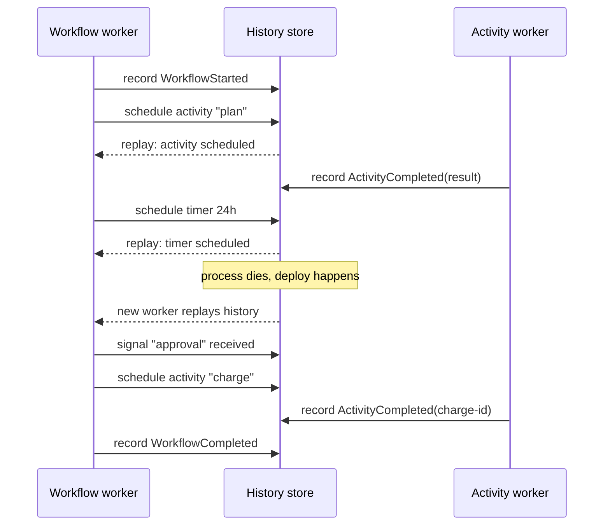

# Workflow Engines and Distributed Task Execution

> **Interview answer (say this first).** A workflow engine runs long-lived, multi-step work durably. You write the workflow as ordinary deterministic code; the engine records every step result in a history. If the process dies, the engine replays the history on another worker, skips completed steps, and resumes. Side effects live in activities, which get retries and timeouts. The engine also gives you durable timers and signals, and it routes each activity to a pool of workers by name. Temporal and AWS Step Functions are the canonical examples. You reach for one when a workflow spans minutes to months, must survive deploys, and needs reliable retries; a simple queue and worker is enough when it does not.

## Why this exists

Some work finishes in milliseconds. Some takes days. An agentic workflow often looks like this:

```text
1. receive a request
2. call a model to plan
3. wait 24 hours for a human approval
4. call an external API that is flaky
5. charge a card
6. wait for a webhook
7. send the result
```

If you write that as one function in a normal request handler, you inherit every failure mode at once. A deploy at step 3 loses the wait. A timeout at step 4 loses steps 1–3. A crash between charging the card and recording it charges the card twice on retry. And you cannot just keep the function in memory for a day.

The naive fix is a scheduler plus a database plus a queue plus retry code plus a "resume from where?" query. Every team writes a worse version of the same machine: a `state.step` counter that advances through `if` branches, a cron job to wake it up, and hand-rolled retries.

That works until it does not. The interesting bugs are in the gaps: a step that ran but was not recorded, a timer that never fires, two workers that resume the same run, a redeploy that changes the step numbering and makes old state meaningless.

A workflow engine exists to make that code boring. You write the workflow as if it ran top to bottom in one process. The engine handles persistence, replay, retries, timers, and worker routing.

> **The one-sentence purpose.** Write long-running work as ordinary deterministic code; let the engine durably record every step and replay it after any crash.

## Start from zero

| Word | Plain meaning |
| --- | --- |
| **Workflow** | The durable, deterministic orchestration function. It decides *what* happens. |
| **Activity** | A unit of real work with side effects (API call, DB write, model call). Retried by the engine. |
| **Worker** | A process that polls a task queue and executes workflow code or activities. |
| **Task queue** | A named queue a worker listens on. Routes work by capability, not by machine. |
| **History** | The append-only record of everything the workflow has observed: results, timers, signals. |
| **Replay** | Re-running workflow code against recorded history to rebuild in-memory state. |
| **Deterministic** | Same inputs and history produce the same decisions. No wall clock, no randomness in workflow code. |
| **Timer** | A durable sleep: "resume this workflow in 24 hours." Survives restarts. |
| **Signal** | A message delivered into a running workflow from outside: "the human approved." |
| **Continue-as-new** | Ending one run and starting a fresh one with the current state, to keep history bounded. |
| **Choreography** | Services react to each other's events with no central coordinator. |
| **Orchestration** | One coordinator calls each service in order. A workflow engine is orchestration. |

Two distinctions to pin down.

**Workflow code vs activity code.** Workflow code is deterministic and does no I/O. Activities do all the I/O and side effects. Mixing them breaks replay: a workflow that reads the clock or calls an API directly cannot be reproduced from history.

**Orchestration vs choreography.** Orchestration has a central brain that knows the sequence. Choreography has independent services reacting to events. Workflow engines are orchestration. Orchestration is easier to reason about and to observe; choreography scales organisationally but is hard to trace.

## The core idea

Think of a board game with a **recorded move log**. The game state is the position on the board. The move log records every move. If you knock the board over, you do not lose the game — you replay the moves and rebuild the position. The rules of the game are deterministic, so replay always produces the same board.

The workflow is the rulebook. The history is the move log. An activity is a move with a side effect (say, "draw a card"), and its result is recorded. On replay, the engine reads the recorded result instead of drawing again.



Read the diagram from the workflow's point of view: it always "sees" the same sequence. Sometimes the result comes from a live activity, sometimes from history. The workflow code cannot tell the difference, which is exactly the point.

| Approach | Survives deploy | Durable timers | Retries | Where state lives |
| --- | --- | --- | --- | --- |
| In-memory loop | No | No | Hand-rolled | Process memory |
| Cron + database flag | Yes, slowly | Approximate | Hand-rolled | Your DB |
| Queue + worker | Partly | No | Queue redelivery | Message payload |
| Workflow engine | Yes | Yes | First-class policy | Engine history store |

## How it works

1. **A client starts a workflow with an id.** The id (often a business key like `order-42`) is the dedupe key. By default, starting the same id while a run is in flight raises a duplicate-start error; set `id_conflict_policy=WorkflowIDConflictPolicy.USE_EXISTING` to return the existing run instead. (Reusing an id after a completed run is a separate policy, `id_reuse_policy`.)
2. **A worker picks up the workflow task.** It begins executing the deterministic workflow function.
3. **The first activity call becomes a command.** The workflow asks the engine to schedule activity `plan` on task queue `llm`. The engine writes `ActivityTaskScheduled` to history and suspends the workflow.
4. **An activity worker on that queue polls, runs the function, and records the result.** The engine writes `ActivityTaskCompleted` (or `Failed`) to history.
5. **The workflow resumes.** On the worker, the engine replays the workflow code. The `plan` call now returns the recorded result from history, so the workflow continues to the next line.
6. **Timers are scheduled the same way.** `sleep(24h)` writes a timer event; the engine sets a durable timer and the worker is free. When the timer fires, a workflow task is enqueued again.
7. **Signals are appended to history.** An external system calls `signal(workflow_id, "approval", "yes")`. The engine writes it, then delivers a workflow task. The workflow's `wait_for_signal` returns the value.
8. **Retries are engine policy, not workflow code.** If `charge` throws a retryable error, the engine schedules the next attempt with backoff. The workflow sees only the eventual success (or a terminal failure).
9. **On a crash or deploy, nothing special happens.** Another worker replays history from the last event and continues. The workflow resumes at the exact step it was on.
10. **When history grows large, continue-as-new.** The workflow returns "start a fresh run with this state," keeping each run's history bounded and replay fast.

> **Warning.** Workflow code must be deterministic. Do not read the clock, generate random UUIDs, read environment variables, or call APIs inside workflow code. If a value is needed, compute it in an activity and record it. Non-determinism turns replay into a different program, and the engine detects it as a non-determinism error.

## The syntax you will use

**A workflow and an activity in Temporal's Python SDK.** The decorators mark which code is replayable and which is side-effecting.

```python
from datetime import timedelta
from temporalio import activity, workflow
from temporalio.common import RetryPolicy, WorkflowIDConflictPolicy

@activity.defn
async def charge(order_id: str) -> str:
    return await payment_gateway.charge(order_id)      # real I/O goes here

@workflow.defn
class OrderWorkflow:
    def __init__(self) -> None:
        self.approved = False

    @workflow.run
    async def run(self, order_id: str) -> str:
        charge_id = await workflow.execute_activity(
            charge, order_id,
            start_to_close_timeout=timedelta(seconds=30),
            retry_policy=RetryPolicy(maximum_attempts=5),
        )
        await workflow.sleep(timedelta(hours=24))       # durable timer
        await workflow.wait_condition(lambda: self.approved)
        return "shipped" if self.approved else "refunded"
```

Workflow code reads like normal async code. The engine makes each call durable.

**Receiving a signal.** The signal sets state and wakes the `wait_condition`.

```python
@workflow.signal
def approve(self) -> None:
    self.approved = True
```

`workflow.wait_condition` blocks the workflow durably until the condition is true, at no compute cost.

**Scheduling activities with a retry policy.** Retry policy is declared, not coded.

```python
retry = RetryPolicy(
    initial_interval=timedelta(seconds=1),
    backoff_coefficient=2.0,
    maximum_interval=timedelta(minutes=1),
    maximum_attempts=5,
    non_retryable_error_types=["ValidationError"],
)
```

A `ValidationError` fails immediately; a timeout retries five times with exponential backoff.

**Distributing tasks to capability queues.** The workflow says *what* it needs; routing finds a worker.

```python
await workflow.execute_activity(
    call_llm, prompt,
    task_queue="gpu-workers",               # only GPU machines listen here
    start_to_close_timeout=timedelta(minutes=5),
)
```

A small GPU fleet consumes `gpu-workers`; general workers consume `default`. This is the same idea as a task queue per capability in chapter 23.

**AWS Step Functions: the same shape in ASL.** Orchestration as declarative JSON with `Retry` and `Wait` states.

```json
{
  "StartAt": "Charge",
  "States": {
    "Charge": {
      "Type": "Task",
      "Resource": "arn:aws:lambda:...:charge",
      "Retry": [{"ErrorEquals": ["States.TaskFailed"],
                 "IntervalSeconds": 2, "MaxAttempts": 5, "BackoffRate": 2.0}],
      "Next": "WaitForApproval"
    },
    "WaitForApproval": {"Type": "Wait", "Seconds": 86400, "Next": "Ship"}
  }
}
```

Step Functions is managed orchestration; Temporal is a general-purpose durable runtime. The concepts map: states are workflow steps, tasks are activities, `Wait` is a timer.

**Starting with an idempotent id.** A business key prevents duplicate runs.

```python
handle = await client.start_workflow(
    OrderWorkflow.run, "order-42",
    id="order-42",
    task_queue="default",
    id_conflict_policy=WorkflowIDConflictPolicy.USE_EXISTING,  # return the running run
)
```

Without `USE_EXISTING`, a second start with the same id fails with a duplicate-start error while the first run is still open. The policy makes the start idempotent.

## Examples: simple to real

**Example 1 — the whole simulation in one model.** A history store records what the workflow observed. Activities fail the first time to show retries. Verified below.

```python
class ActivityFailure(Exception):
    """A transient failure from a side-effecting activity."""


class WorkflowBlocked(Exception):
    """The workflow is waiting for an external event (timer or signal)."""

    def __init__(self, waiting_for: str) -> None:
        super().__init__(waiting_for)
        self.waiting_for = waiting_for


class History:
    """Append-only record of everything the workflow has observed."""

    def __init__(self) -> None:
        self.events: list[dict] = []


class WorkflowContext:
    """Replay-aware context. Same workflow code runs on first run and on replay."""

    def __init__(self, history, activities, pending_signals=None, max_attempts=3):
        self.history = history
        self.activities = activities
        self.pending_signals = dict(pending_signals or {})
        self.max_attempts = max_attempts
        self.pos = 0            # cursor over recorded history
        self.replayed = 0       # steps served from history
        self.executed = 0       # steps actually run

    def _take_recorded(self, kind: str, name: str):
        if self.pos < len(self.history.events):
            event = self.history.events[self.pos]
            if event["kind"] == kind and event["name"] == name:
                self.pos += 1
                self.replayed += 1
                return True, event
        return False, None

    def activity(self, name: str, fn, *args):
        found, event = self._take_recorded("activity", name)
        if found:
            return event["result"]           # replay: recorded result, no side effect
        last_error = None
        for attempt in range(1, self.max_attempts + 1):
            try:
                result = fn(*args)
                self.history.events.append(
                    {"kind": "activity", "name": name,
                     "attempts": attempt, "result": result}
                )
                self.executed += 1
                return result
            except ActivityFailure as exc:
                last_error = exc
        raise ActivityFailure(f"{name} failed after {self.max_attempts} attempts: {last_error}")

    def timer(self, timer_id: str):
        found, event = self._take_recorded("timer", timer_id)
        if found:
            return event["result"]
        result = "fired"
        self.history.events.append({"kind": "timer", "name": timer_id, "result": result})
        self.executed += 1
        return result

    def wait_for_signal(self, name: str):
        found, event = self._take_recorded("signal", name)
        if found:
            return event["value"]
        if name in self.pending_signals:
            value = self.pending_signals.pop(name)
            self.history.events.append({"kind": "signal", "name": name, "value": value})
            self.executed += 1
            return value
        raise WorkflowBlocked(name)          # suspend; driver re-runs after the signal
```

**Example 2 — the workflow itself is plain deterministic code.** Note there is no I/O and no clock here. Everything side-effecting is an activity.

```python
class Activities:
    """The real world. It is unreliable on purpose."""

    def __init__(self) -> None:
        self.charge_attempts = 0
        self.ship_calls = 0

    def charge(self, order_id: str) -> str:
        self.charge_attempts += 1
        if self.charge_attempts == 1:
            raise ActivityFailure("payment gateway timeout")
        return f"charge-{order_id}"

    def ship(self, order_id: str) -> str:
        self.ship_calls += 1
        return f"shipped-{order_id}"


def approval_workflow(order_id: str, ctx: WorkflowContext) -> dict:
    """Deterministic workflow code: no wall clock, no randomness, no direct I/O."""
    charge_ref = ctx.activity("charge", ctx.activities.charge, order_id)
    ctx.timer("follow-up-24h")
    decision = ctx.wait_for_signal("approval")
    if decision == "approve":
        ship_ref = ctx.activity("ship", ctx.activities.ship, order_id)
        return {"status": "shipped", "ref": ship_ref}
    return {"status": "refunded", "charge": charge_ref}
```

**Example 3 — a driver that starts, blocks, and resumes.** This models the engine's job: run until blocked, record, then re-run after the signal.

```python
def run(history, activities, order_id, signals=None):
    ctx = WorkflowContext(history, activities, signals)
    try:
        result = approval_workflow(order_id, ctx)
        return {"state": "completed", "result": result,
                "replayed": ctx.replayed, "executed": ctx.executed}
    except WorkflowBlocked as block:
        return {"state": "blocked", "waiting_for": block.waiting_for,
                "replayed": ctx.replayed, "executed": ctx.executed}
```

**Example 4 — first run: an activity retries, then the workflow blocks for approval.** Verified output.

```python
history = History()
activities = Activities()

first = run(history, activities, "order-42")
print("run 1:", first["state"], "waiting for", first.get("waiting_for"))
print("run 1 charge attempts:", activities.charge_attempts, "history:", len(history.events))
```

Verified output:

```text
run 1: blocked waiting for approval
run 1 charge attempts: 2 history: 2
```

The charge failed once and succeeded on the second attempt. The workflow then recorded a timer and suspended. In a real engine the worker is now free; no thread is held for the 24-hour wait.

**Example 5 — the signal arrives and the workflow replays to completion.** Verified output shows replay skips the charge and does not re-run it.

```python
attempts_before = activities.charge_attempts
second = run(history, activities, "order-42", signals={"approval": "approve"})
print("run 2:", second["state"], second["result"])
print("run 2 replayed/executed:", second["replayed"], "/", second["executed"])
print("charge attempts before/after replay:", attempts_before, "/", activities.charge_attempts,
      "(unchanged: charge was not re-run)")
print("ship calls:", activities.ship_calls)
```

Verified output:

```text
run 2: completed {'status': 'shipped', 'ref': 'shipped-order-42'}
run 2 replayed/executed: 2 / 2
charge attempts before/after replay: 2 / 2 (unchanged: charge was not re-run)
ship calls: 1
```

Two events came from history (charge, timer) and two ran live (the signal and ship). The retried charge cost the payment gateway nothing on replay. Replaying the finished run again returns the same recorded result. That is the central guarantee.

> **Tip.** Keep workflow code thin. Put all decisions you can into activities that return plain data. The less branching in workflow code, the smaller the chance of a non-determinism bug after a deploy.

## In production

- **Determinism is a hard rule, not a style guide.** No `time.time()`, no `random`, no UUIDs, no environment reads, no direct network calls in workflow code. Compute in an activity, record the value, read it on replay.
- **Version workflow code deliberately.** Changing the order of activity calls breaks replay of old histories. Engines offer versioning APIs (Temporal's `workflow.patched` / worker versioning, Step Functions' versioned state machines). Use them or run old and new versions in parallel.
- **Task queues are your routing table.** One queue per capability (GPU, browser, code-sandbox) so you scale the right machines. A workflow does not choose a machine; it chooses a queue.
- **Retries need a policy, not hope.** Set max attempts, exponential backoff, and non-retryable error types. Retrying a validation error forever is a self-inflicted outage.
- **Activities must be idempotent.** The engine may re-deliver an activity after a worker crash mid-execution. Give each effect a stable idempotency key (see chapter 25).
- **Keep activities small.** A long activity holds a worker and delays heartbeats. Split big jobs into several activities so a retry is cheap.
- **Beware the history limit.** Long loops accumulate events. Use continue-as-new to reset history and keep replay fast.
- **Timers are cheap; polling is not.** Prefer a durable timer over a worker that wakes every minute to check. You pay for compute, not for sleeps.
- **Signals are inputs, not RPC.** A signal is a one-way message appended to history. Use workflow queries for read-only inspection, and never block the workflow on a synchronous call to the outside world.
- **Orchestrate when the sequence is known; choreograph when teams must decouple.** A workflow engine centralises the logic in one readable place, at the cost of a central component. Both are valid; do not mix them in one flow without a reason.
- **The engine is a critical dependency.** Your history store holds the truth of every in-flight process. Back it up, size it, and plan for its outage like you plan for your database's.
- **Not every job needs an engine.** A stateless consumer of a queue with a unique business key already gives you retries and dedupe. Add a workflow engine when you need durable timers, multi-step coordination, or human pauses.

## Interview questions

### 1. What is a workflow engine, and what does it actually do for you?

**Answer.** It runs long-lived workflows durably. You write the workflow as deterministic code; the engine records every step result in a history and replays that history after a crash to resume from the last completed step. It provides durable timers, signals, retries, and worker routing by task queue. Temporal, Cadence, and AWS Step Functions are examples.

**Follow-up: "So it is a queue plus a database?"** Those are components, but the value is the replay model and the programming model. You write sequential code and get durability, instead of hand-managing state machines and resume queries.

**Trap.** Calling it "just a scheduler." A scheduler triggers work; a workflow engine owns the state, ordering, and recovery of each run.

### 2. Why must workflow code be deterministic?

**Answer.** On recovery the engine re-executes the workflow code against recorded history. If the code makes a different decision than it did originally — because it read the clock, generated a random value, or reordered calls — the replay diverges from history and the engine cannot reconcile it. Determinism guarantees replay reconstructs the same state.

**Follow-up: "Where do I put the non-deterministic work?"** In activities. An activity runs once, produces a value, and the engine records it. Replay reads the recorded value instead of re-running the activity.

**Trap.** Assuming the engine snapshots memory. It records the history of decisions and results; the in-memory state is rebuilt by replay.

### 3. How do retries work, and where is the retry logic?

**Answer.** Retry is a declared policy on the activity call: initial interval, backoff coefficient, max interval, max attempts, and non-retryable error types. The engine schedules the next attempt and records each one. Workflow code does not contain a retry loop; it sees the eventual result or a terminal failure.

**Follow-up: "What makes an activity safe to retry?"** Idempotency. A worker can crash after doing the work but before recording success, so the engine may re-deliver. Use a stable idempotency key per effect.

**Trap.** Writing retry loops inside workflow code. That hides attempts from the engine and breaks the history model.

### 4. How do durable timers and signals work?

**Answer.** A timer is a workflow command that records a wake-up time; the engine fires it and enqueues a workflow task. The worker is freed immediately, so a 24-hour sleep costs no compute. A signal is an external message appended to history; the workflow's wait condition is re-evaluated, and a workflow task is delivered. Both survive restarts because they live in history.

**Follow-up: "What is the difference between a signal and a query?"** A signal is a one-way write into the workflow that can change its state. A query is a read-only request for current state and does not append to history or wake the workflow.

**Trap.** Implementing a wait as a polling loop. That burns worker time and is not durable across a deploy unless the engine owns it.

### 5. How does task routing to workers work?

**Answer.** Workflows and activities are enqueued onto named task queues. Workers register which queues they listen on, so capacity is matched to capability. A GPU activity goes to `gpu-workers`; a browser activity goes to `browser-workers`; general steps go to `default`. The workflow names the queue, the engine routes, and workers scale independently.

**Follow-up: "How is that different from a plain message queue?"** A plain queue routes one message to one consumer. A workflow queue also has the engine depending on the task completing correctly, with retries and heartbeats tied back into the workflow's history.

**Trap.** Treating the task queue as the source of truth for run state. The history store is the source of truth; queues are just dispatch.

### 6. Orchestration vs choreography — which do you choose?

**Answer.** Orchestration uses a central coordinator that calls each step in order; it is easier to read, trace, and change, which is why workflow engines are orchestration. Choreography has services reacting to each other's events with no central brain; it decouples teams and avoids a bottleneck, but end-to-end tracing and reasoning get harder. Choose orchestration for known sequences, choreography for independent domain events across teams.

**Follow-up: "Can you mix them?"** Yes, deliberately: a workflow can orchestrate a sequence while also publishing events other services react to. Mixing without discipline creates two sources of truth for the same process.

**Trap.** Saying "choreography scales better" as a blanket rule. It scales organisational autonomy, not raw throughput; orchestration scales fine when the engine does.

### 7. When is a workflow engine worth the cost?

**Answer.** When workflows are long-lived, multi-step, and critical: they span minutes to months, must survive deploys, need durable timers or human pauses, and require reliable retries over flaky external services. If a job is a single queue message with a unique key, an ordinary worker is enough.

**Follow-up: "What is the cost?"** A new critical dependency (the engine and its history store), a learning curve around determinism and versioning, and operational work to run and size it. For a five-minute single-step job, that is not repaid.

**Trap.** Adopting an engine for a workflow that is really one activity plus a queue. You pay the dependency and get nothing back.

### 8. How do you change a running workflow's code safely?

**Answer.** Replay means old histories execute under new code, so changes must be compatible. Use the engine's versioning APIs to branch behaviour by version, deploy new code so it can still replay old histories, and only remove old paths once no runs use them. For structural changes, drain or continue-as-new. Never silently reorder or remove activity calls.

**Follow-up: "What about changing an activity?"** Activities are safer: they run once and record results, so changing their internals only affects future calls. Changing the workflow's call sequence is the dangerous change.

**Trap.** Deploying a refactor that reorders steps and discovering that thousands of in-flight runs fail replay with non-determinism errors.

## Remember this

- **Workflow code decides, activities act.** Keep workflow code deterministic and free of I/O; put every side effect in an activity.
- **History is the truth.** Replay reconstructs state from recorded results, so a crash or deploy resumes exactly where it left off.
- **Retries, timers, and signals are engine features**, declared as policy and history — not hand-rolled loops and cron jobs.
- **Task queues route by capability**, letting you scale GPU, browser, or sandbox workers independently.
- **Adopt an engine for long, multi-step, critical work**; a queue and a worker with a unique key is enough for the rest.
