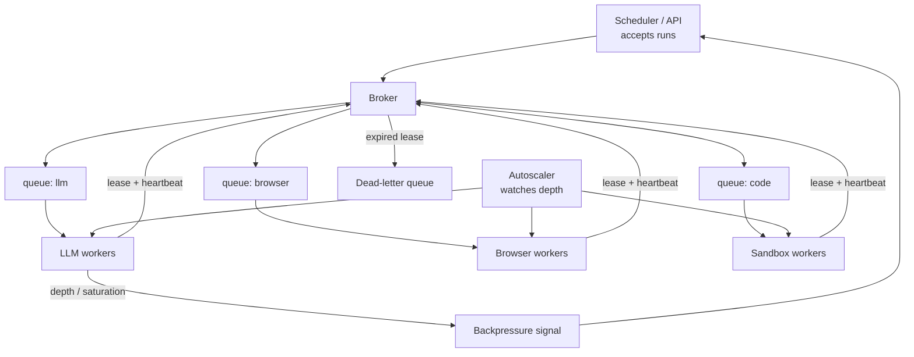

# Agent Worker Pools and Scheduling

> **Interview answer (say this first).** An agent worker pool is a set of interchangeable processes that pull runs or steps off queues and execute them. Because agent work is heterogeneous — model calls, browsing, code execution, retrieval — you run a queue per capability and let workers register the capabilities they can serve. Sizing matters because each worker holds resources (tokens, GPU memory, browser sessions). A worker takes a task under a lease, renews it with a heartbeat, and the broker reclaims the task if the heartbeat stops, so a dead worker does not strand work. You autoscale on queue depth, not CPU, and you push back on the scheduler when the pool is saturated rather than accepting unlimited work.

## Why this exists

One agent run is easy to reason about. A thousand concurrent runs are not. They compete for the same scarce things: model rate limits, GPU slots, browser sessions, sandbox containers, and money. Without a pool and a scheduler you get the classic failure pattern: every request spawns a thread, the process runs out of file descriptors, the model provider returns 429s, and retries amplify the overload.

The work is also not uniform. Some steps are cheap string parsing. Some call a large model. Some open a headless browser for thirty seconds. Some run untrusted code in a sandbox. If you run all of them on the same generic worker, one browser step occupies a slot that a fast step could have used, and you cannot scale the expensive capability separately.

There is a third problem: **ownership**. A worker that picks up a long step may die. If the queue deleted the message on delivery, the step is lost forever. If it never deletes it, the step runs twice. You need a middle state — a lease — that says "worker W owns task T until time X," renewable while the worker is alive and reclaimable when it is not.

A worker pool with per-capability queues, leases, heartbeats, and depth-based autoscaling answers all three.

> **The one-sentence purpose.** Run many agent runs safely by pulling work from capability queues under a renewable lease, sizing the pool to the work, and refusing overload instead of absorbing it.

## Start from zero

| Word | Plain meaning |
| --- | --- |
| **Worker** | A long-lived process that repeatedly pulls one task, executes it, and reports the result. |
| **Worker pool** | A group of interchangeable workers consuming the same queue(s). |
| **Task queue** | A durable, ordered list of pending tasks for one capability. |
| **Capability** | A kind of work a worker can serve: `llm`, `browser`, `code`, `search`. |
| **Capability routing** | Sending a task to the queue for the capability it needs. |
| **Lease** | A time-bounded claim on a task: only the holder may finish it, and it expires. |
| **Visibility timeout** | How long a lease lasts before the broker makes the task visible again. |
| **Heartbeat** | A periodic renewal of the lease while the worker is still working. |
| **Stuck worker** | A worker whose lease expired without ack: it is presumed dead. |
| **Poison task** | A task that fails every time; it must go to a dead-letter queue, not loop forever. |
| **Backpressure** | Telling the producer to slow down or reject work because the pool is saturated. |
| **Autoscaling** | Adding or removing workers based on a signal, usually queue depth. |
| **Fair scheduling** | Prevents one tenant or one priority class from starving the others. |
| **Priority** | A ranking so important tasks run before low-priority ones. |
| **Token budget** | A cap on model tokens a pool may spend in a window; a resource like any other. |

Two distinctions that decide your design.

**Queue depth is the right autoscaling signal, not CPU.** Agent workers are I/O-bound: they wait on models and browsers, so CPU is idle while the queue grows. Scale on pending tasks per capability, or on oldest-task age, not on CPU.

**A lease is not a lock you hold forever.** A lease expires. The worker must renew it with a heartbeat. If it forgets, the broker assumes death and redelivers the task — which is why every task must be idempotent.

## The core idea

Think of a **tool checkout desk at a repair shop**. There are special tools — a torque wrench, a diagnostic computer — that only some technicians can use. A technician who needs one signs it out for a period. If they walk away and the timer runs out, the tool returns to the desk and another technician can take it. Nobody has to hunt down the missing technician.

A worker is the technician. A capability queue is the drawer for a tool. A lease is the sign-out slip with a due time. A heartbeat is signing the slip again. Reclaim is the tool returning to the drawer when the timer lapses.



The autoscaler watches depth per queue, so the browser fleet grows when browser tasks pile up, independent of the LLM fleet. The backpressure arrow is what keeps the system honest: when the pool is full, the scheduler is told to slow down or shed load.

| Signal | What it tells you | Use it for |
| --- | --- | --- |
| Queue depth | How much work is waiting | Autoscaling up |
| Oldest task age | How long the queue has been stuck | Latency SLO alerts, autoscaling up |
| In-flight / pool size | Utilisation of the current workers | Autoscaling down when low |
| Error rate | Tasks failing, not just slow | Circuit breaking, human alert |
| Token spend rate | Money burning per minute | Budget backpressure |
| Heartbeat misses | Workers dying or wedged | Stuck-worker recovery |

## How it works

1. **A scheduler accepts a run and enqueues its first step.** The step is a task with a capability, a payload, and an idempotency key.
2. **The broker stores the task in that capability's queue.** Priority and enqueue time decide its position.
3. **A compatible worker polls the queue.** It leases one task for a fixed visibility timeout (say 30 seconds) and starts work.
4. **The worker renews the lease with heartbeats.** Every few seconds it says "still alive, still working." The lease expiry moves forward each time.
5. **On success the worker acks the task; on failure it nacks it.** Success removes the task and records the result; failure increments the task's attempt count and requeues it, and once it reaches `max_attempts` the broker moves it to the dead-letter queue. (Backoff between attempts is a production refinement; the model below implements the counter and the DLQ.)
6. **If the worker dies, heartbeats stop.** When the lease expires, the broker reclaims the task and returns it to the queue. Another worker picks it up. The task runs again, so it must be idempotent.
7. **An autoscaler adjusts the pool per queue.** Depth above a high-water mark adds workers; sustained low utilisation removes them.
8. **When the pool cannot keep up, it applies backpressure and caps.** The scheduler gets a "busy, retry later" signal; budgets and fair-share caps stop any tenant or priority class from taking the whole pool.

> **Warning.** A lease timeout that is shorter than your longest task is a bug factory. If a browser step takes 90 seconds and the visibility timeout is 30, the broker reclaims and re-runs it while the original is still working. Set the timeout with headroom and heartbeat inside it.

## The syntax you will use

**A task and a worker.** A task names a capability and a cost; a worker declares the capabilities it serves and what it currently holds. The examples below show the full dataclasses.

**Lease, heartbeat, reclaim.** The broker hides a task while a worker owns it; heartbeats extend the lease; reclaim requeues tasks whose lease lapsed.

```text
lease(capability, worker, now):
    task = highest-priority task from queues[capability]
    leases[task.id] = (task, worker, now + lease_seconds)
    return task

heartbeat(task_id, now):   leases[task_id].expiry = now + lease_seconds
reclaim(now):              for each lease with expiry < now, requeue the task
```

**Autoscaling on depth.** Scale up when work is waiting; scale down after sustained idleness. Base the decision on queue depth and oldest-task age, never CPU. The examples below implement it.

**SQS-style visibility timeout, in the queue's own words.** The lease concept has a name in every broker.

```text
SQS:        VisibilityTimeout, ChangeMessageVisibility (heartbeat), ReceiveRequestAttemptId (dedupe)
Kafka:      consumer group rebalance + offset commit; a slow consumer is removed from the group
RabbitMQ:   consumer ack/nack, delivery tags, unacked message limit
Temporal:   activity task with heartbeat timeout; a missed heartbeat fails the activity for retry
Redis:      BRPOPLPUSH into a processing list; a reaper moves stale entries back
```

**Backpressure to the scheduler.** Return "busy" instead of accepting a run.

```python
def submit(run) -> dict:
    if broker.total_depth() > max_depth:
        return {"accepted": False, "reason": "pool saturated", "retry_after_s": 30}
    broker.publish(Task(run.run_id, run.capability, run.cost))
    return {"accepted": True}
```

**A per-tenant fair share.** Cap how much of the pool one tenant may occupy.

```python
def can_lease(tenant: str, in_flight: dict[str, int], pool_size: int) -> bool:
    cap = max(1, int(pool_size * 0.25))     # no tenant exceeds 25% of the pool
    return in_flight.get(tenant, 0) < cap
```

## Examples: simple to real

**Example 1 — the broker and worker model.** Capability queues, leases, heartbeats, and reclaim. Verified below.

```python
from dataclasses import dataclass


@dataclass
class Task:
    task_id: str
    capability: str
    cost: int          # ticks of work
    priority: int = 0  # higher runs first


@dataclass
class Worker:
    worker_id: str
    capabilities: set[str]
    speed: int = 1                       # work units per tick
    busy_with: Task | None = None
    remaining: int = 0
    lease_expires_at: int = 0
    last_heartbeat: int = 0
    crashed: bool = False

    def can_take(self, task: Task) -> bool:
        return self.busy_with is None and task.capability in self.capabilities


class Broker:
    """Per-capability queues. Leases hide a task while a worker owns it."""

    def __init__(self, lease_seconds: int = 3, max_attempts: int = 3) -> None:
        self.queues: dict[str, list[Task]] = {}
        self.leases: dict[str, tuple[Task, str, int]] = {}   # task_id -> (task, worker, expiry)
        self.completed: list[str] = []
        self.lease_seconds = lease_seconds
        self.max_attempts = max_attempts
        self.attempts: dict[str, int] = {}                   # task_id -> failed attempts
        self.dead_letters: list[Task] = []                   # poison tasks, set aside

    def publish(self, task: Task) -> None:
        self.queues.setdefault(task.capability, []).append(task)

    def depth(self, capability: str) -> int:
        return len(self.queues.get(capability, []))

    def total_depth(self) -> int:
        return sum(len(q) for q in self.queues.values())

    def lease(self, capability: str, worker_id: str, now: int) -> Task | None:
        queue = self.queues.get(capability, [])
        if not queue:
            return None
        queue.sort(key=lambda t: -t.priority)          # priority, then FIFO
        task = queue.pop(0)
        self.leases[task.task_id] = (task, worker_id, now + self.lease_seconds)
        return task

    def heartbeat(self, task_id: str, now: int) -> None:
        task, worker_id, _ = self.leases[task_id]
        self.leases[task_id] = (task, worker_id, now + self.lease_seconds)

    def ack(self, task_id: str) -> None:
        self.leases.pop(task_id, None)
        self.completed.append(task_id)

    def nack(self, task_id: str) -> None:
        task, _worker, _exp = self.leases.pop(task_id)
        self.attempts[task_id] = self.attempts.get(task_id, 0) + 1
        if self.attempts[task_id] >= self.max_attempts:
            self.dead_letters.append(task)              # poison task: stop the loop
        else:
            self.publish(task)                          # put it back for another try

    def reclaim_expired(self, now: int) -> list[str]:
        reclaimed = []
        for task_id, (task, _worker, expiry) in list(self.leases.items()):
            if expiry < now:                            # worker died or stalled
                self.leases.pop(task_id)
                self.publish(task)
                reclaimed.append(task_id)
        return reclaimed
```

**Example 2 — the simulation loop with autoscaling.** Each tick reclaims expired leases, scales, and lets each worker pull work.

```python
class Sim:
    """Ticks, not threads. One tick = one unit of simulated time."""

    def __init__(self, broker: Broker, workers: list[Worker], max_workers: int = 6,
                 scale_up_depth: int = 2, idle_ticks_before_shrink: int = 4) -> None:
        self.broker = broker
        self.workers = workers
        self.max_workers = max_workers
        self.scale_up_depth = scale_up_depth
        self.idle_ticks_before_shrink = idle_ticks_before_shrink
        self.next_worker = len(workers)
        self.idle_ticks = 0
        self.log: list[str] = []

    def autoscale(self) -> None:
        depth = self.broker.total_depth()
        if depth >= self.scale_up_depth and len(self.workers) < self.max_workers:
            self.next_worker += 1
            w = Worker(f"w{self.next_worker}", {"llm", "search", "code"})
            self.workers.append(w)
            self.log.append(f"scale up -> {len(self.workers)} workers (depth {depth})")
            self.idle_ticks = 0
        elif depth == 0 and len(self.workers) > 1:
            self.idle_ticks += 1
            if self.idle_ticks >= self.idle_ticks_before_shrink:
                # Only evict a worker that holds no lease. Dropping a busy worker
                # would orphan its task and let a second worker duplicate the work.
                idle = [w for w in self.workers if w.busy_with is None and not w.crashed]
                if idle:
                    self.workers.remove(idle[-1])
                    self.log.append(f"scale down -> {len(self.workers)} workers")
                    self.idle_ticks = 0
                else:
                    self.log.append("scale down skipped: all workers busy")
        else:
            self.idle_ticks = 0

    def tick(self, now: int) -> None:
        reclaimed = self.broker.reclaim_expired(now)
        for task_id in reclaimed:
            self.log.append(f"reclaimed {task_id} from a dead worker")
        self.autoscale()

        for worker in self.workers:
            if worker.crashed:
                continue
            if worker.busy_with is not None:
                worker.remaining -= worker.speed
                if worker.remaining <= 0:
                    self.broker.ack(worker.busy_with.task_id)
                    self.log.append(f"{worker.worker_id} finished {worker.busy_with.task_id}")
                    worker.busy_with = None
                else:
                    self.broker.heartbeat(worker.busy_with.task_id, now)
                continue
            # Pull work across capabilities; fairness comes from checking each in turn.
            for capability in sorted(self.broker.queues):
                task = self.broker.lease(capability, worker.worker_id, now)
                if task is not None:
                    worker.busy_with = task
                    worker.remaining = task.cost
                    self.log.append(f"{worker.worker_id} leased {task.task_id} ({capability})")
                    break
```

**Example 3 — run it: autoscale up, lose a worker, recover the orphaned task.** Verified output. `t3` is a priority code task that `w1` leases first; `w1` then dies, its lease expires, and `w2` reclaims and finishes it.

```python
broker = Broker(lease_seconds=2)
for i, (cap, cost, prio) in enumerate([
    ("llm", 2, 0), ("llm", 3, 0), ("search", 1, 0),
    ("code", 4, 1), ("code", 2, 0), ("llm", 4, 0),
]):
    broker.publish(Task(f"t{i}", cap, cost, prio))

workers = [Worker("w1", {"llm", "search", "code"})]
sim = Sim(broker, workers)

for tick in range(16):
    if tick == 1:
        workers[0].crashed = True                  # hard death: no more heartbeats
        sim.log.append("w1 crashed mid-task (lease not renewed)")
    sim.tick(tick)

for line in sim.log:
    print(line)
print("completed:", sorted(broker.completed))
print("still leased (in flight):", sorted(broker.leases))
print("remaining queue depth:", broker.total_depth())
print("worker count at end:", len(sim.workers))
```

Verified output:

```text
scale up -> 2 workers (depth 6)
w1 leased t3 (code)
w2 leased t4 (code)
w1 crashed mid-task (lease not renewed)
scale up -> 3 workers (depth 4)
w3 leased t0 (llm)
scale up -> 4 workers (depth 3)
w2 finished t4
w4 leased t1 (llm)
reclaimed t3 from a dead worker
scale up -> 5 workers (depth 3)
w2 leased t3 (code)
w3 finished t0
w5 leased t5 (llm)
w3 leased t2 (search)
w3 finished t2
w4 finished t1
w2 finished t3
w5 finished t5
scale down -> 4 workers
scale down -> 3 workers
```

Read the important line: `reclaimed t3 from a dead worker`, then `w2 leased t3 (code)`. The task was not lost and not duplicated. That is the lease and heartbeat doing their job.

**Example 4 — priority scheduling.** `t3` has `priority=1`, so it is leased before the other code task.

```python
q = Broker()
q.publish(Task("low", "code", 1, priority=0))
q.publish(Task("high", "code", 1, priority=5))
print("leased first:", q.lease("code", "w1", now=0).task_id)
```

Verified output:

```text
leased first: high
```

Priority is a blunt tool. In production, pair it with fair-share caps so a flood of high-priority work cannot starve everyone else.

**Example 5 — backpressure.** The scheduler refuses work when the queue is beyond its limit, instead of accepting runs it cannot finish.

```python
def submit(broker, run, max_depth=100) -> dict:
    if broker.total_depth() > max_depth:
        return {"accepted": False, "reason": "pool saturated", "retry_after_s": 30}
    broker.publish(Task(run, "llm", 1))
    return {"accepted": True}

full = Broker()
for i in range(101):
    full.publish(Task(f"x{i}", "llm", 1))
print(submit(full, "run-200"))
```

Verified output:

```text
{'accepted': False, 'reason': 'pool saturated', 'retry_after_s': 30}
```

Saying "busy" is a feature. A system that never says no eventually fails on everything instead of failing on the excess.

> **Tip.** Instrument **oldest task age** per capability, not just depth. A queue of 10 tasks where the oldest is two hours old is a worse signal than a queue of 1,000 tasks that are all seconds old.

## In production

- **Idempotency is mandatory, because leases re-deliver.** A worker can finish the work and die before acking. The task runs again. Use a stable idempotency key per task so the second run is a no-op.
- **Set the visibility timeout above your p99 task duration.** Too short causes duplicate work; too long delays recovery from a real crash. Heartbeat at roughly a third of the timeout.
- **Scale on queue depth and oldest-task age.** CPU is a misleading signal for I/O-bound agent workers. Scale each capability independently.
- **Use a dead-letter queue for poison tasks.** A task that fails five times will fail forever. Move it aside, alert, and keep the queue flowing.
- **Size workers to the resource, not just the task count.** A worker running four browser sessions needs four times the memory. Cap concurrency per worker and model the scarce resource per capability.
- **Apply backpressure at admission, not at the queue.** Once work is accepted you owe a result. Refuse early, with a retry hint, when the pool is saturated.
- **Budget tokens across the pool.** A token budget is a shared resource. Track spend per tenant and per window, and pause low-priority work when the budget is exhausted.
- **Fair-share, then priority.** Priority alone lets one noisy tenant starve others. Cap each tenant's share of in-flight work and reserve a slice of the pool for interactive traffic.
- **Distinguish liveness from progress.** A worker that heartbeats but makes no progress (a wedged browser) still holds its lease. Track per-task progress, not just heartbeats.
- **Watch cost per completed run, not just cost per token.** A pool that retries, reclaims, and re-runs tasks can spend more on duplicate work than on real work. Reclaim rate is a key metric.

## Interview questions

### 1. Why run a worker pool instead of one process per run?

**Answer.** Because runs compete for scarce resources. A pool bounds concurrency to what the system can handle, reuses long-lived processes, and lets you size each capability independently. One process per run explodes under load, cannot be rate-limited easily, and loses work when the process dies.

**Follow-up: "What does the pool give up?"** Isolation and simplicity. Every task now shares a worker, so a crash affects in-flight work and you must add leases and idempotency to recover it.

**Trap.** Assuming more workers always means more throughput. When the bottleneck is the model provider or a database, extra workers just add contention and 429s.

### 2. Why a queue per capability?

**Answer.** Because agent steps need different machines and different resources. Model calls need GPU or provider rate-limit headroom; browser steps need session memory; code steps need sandboxes. Separate queues let you route to the right workers, scale each fleet on its own depth, and stop a slow capability from blocking a fast one.

**Follow-up: "How does a workflow choose a queue?"** It names the queue when it schedules the activity. The engine routes; the workflow does not know or care which machine runs it.

**Trap.** One generic pool with one queue. Browser steps then hog slots and the autoscaler, which watches CPU, stays at the wrong size.

### 3. How do leases and heartbeats prevent lost or duplicated work?

**Answer.** A lease gives one worker exclusive, time-bounded ownership. While working, the worker heartbeats to extend the lease. If it dies, the lease expires and the broker reclaims the task for another worker, so work is not lost. Because a reclaimed task may have partially run, the task must be idempotent, so the retry does not duplicate the effect.

**Follow-up: "What if the worker finishes but dies before acking?"** The task is reclaimed and re-run. The idempotency key makes the second run observe that the effect already happened and skip it.

**Trap.** Using a lease without a heartbeat on a long task. The lease expires mid-work, the task is reclaimed, and two workers run it at once.

### 4. What signal do you autoscale on?

**Answer.** Queue depth and oldest-task age, per capability. Agent workers are I/O-bound, so CPU stays low while tasks wait. Depth tells you how much is waiting; oldest-task age tells you whether users are actually feeling it. Scale in on low utilisation over a sustained window to avoid flapping.

**Follow-up: "What about scaling on token spend?"** Token spend is a budget signal, not a capacity signal. Use it to throttle or shed work when the budget is exhausted, and to choose cheaper models — not to add workers.

**Trap.** Autoscaling on CPU. It does not move when the queue is deep because the workers are blocked on network I/O.

### 5. How do you handle priority and fairness?

**Answer.** Priority orders tasks within a queue; fairness caps how much of the pool any one tenant or class can occupy. Typical scheme: reserve a slice of the pool for interactive work, cap each tenant at a share of in-flight tasks, and let background work use the remainder. Priority alone starves; fairness alone ignores urgency.

**Follow-up: "What is starvation here?"** One tenant submits a huge batch, fills the queue and every worker, and other tenants' interactive runs never get a slot. The cap prevents it.

**Trap.** Letting a single global priority number decide everything. It is easy to reason about but impossible to keep fair as tenants and task types grow.

### 6. What is backpressure and where do you apply it?

**Answer.** Backpressure means telling producers to slow down when the system is saturated. Apply it at admission: reject or defer new runs when queue depth exceeds a limit, return a retry-after, and stop pulling from upstream sources. Once a run is accepted you owe a result, so the cheapest place to shed load is before acceptance.

**Follow-up: "Is dropping work ever correct?"** Yes, for low-priority or expired work. An analytics job from yesterday can be dropped or deferred when interactive traffic spikes. State the policy explicitly.

**Trap.** Accepting everything and hoping the queue absorbs it. The queue grows without bound until something times out or crashes.

### 7. How do you recover a stuck worker?

**Answer.** Its lease expires because heartbeats stop, the broker reclaims the task, and a healthy worker picks it up. You also need a way to detect a worker that heartbeats but makes no progress: track per-task checkpoints and fail tasks whose last checkpoint is too old. For a permanently wedged task, send it to the dead-letter queue after max attempts and alert a human.

**Follow-up: "How do you avoid reclaim storms?"** Add jitter to visibility timeouts and backoff, and don't set the timeout so tight that normal long tasks get reclaimed. A reclaim storm duplicates work and makes the outage worse.

**Trap.** Detecting stuck workers only by process liveness. A hung process that still answers a ping looks alive but is stuck.

### 8. How do you control cost across a worker pool?

**Answer.** Treat tokens and money as first-class resources. Track spend per tenant and per window, set budget caps, route easy work to cheaper models, cache repeated prompts, and pause background work when the budget is exhausted. Measure cost per completed run, including duplicate work from retries and reclaims, not just cost per token.

**Follow-up: "What if a single run is genuinely expensive?"** Cap per-run token and time budgets and fail the run with a clear reason. An unbounded run can consume the pool's entire budget.

**Trap.** Optimising only the model price while ignoring retries and reclaims. A cheap model that fails often can cost more than an expensive one that succeeds.

## Remember this

- **One queue per capability, workers register what they can serve**, and each fleet scales on its own depth.
- **Lease + heartbeat + reclaim** is how work survives a dead worker; idempotency makes the re-run safe.
- **Autoscale on queue depth and oldest-task age**, because agent workers are I/O-bound, not CPU-bound.
- **Priority orders, fairness caps, backpressure at admission.** Refusing excess work early beats accepting everything and failing all of it.
