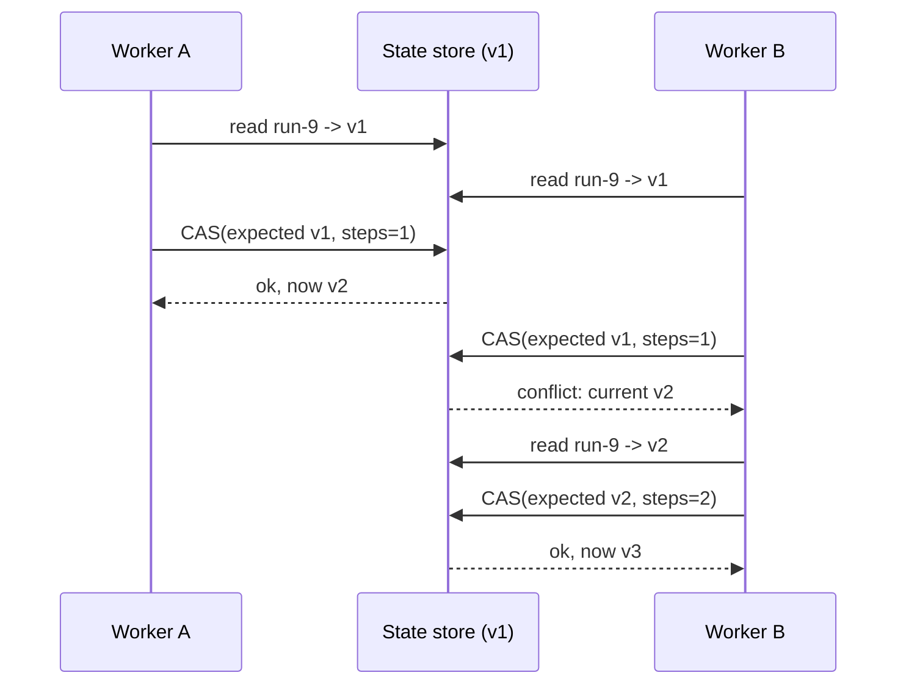

# Distributed State Management

> **Interview answer (say this first).** In a distributed agent system, the first question is *where the truth lives*. Keep the authoritative state in one place — a database, or a service that owns it — and let every other copy be a cache or a derived view. When several workers may update the same record, do not let them overwrite each other blindly. Use optimistic concurrency: every record carries a version, a writer says which version it read, and the store rejects the write if the version moved. That turns a lost update into a detectable conflict the caller can retry. Last-write-wins is the cheap alternative; it is fine for some fields and wrong for counters and state machines. CRDTs let replicas merge without coordination, at the cost of never being able to enforce a global rule.

## Why this exists

An agent run is state. It has a status, a step number, a list of tool calls, a token count, an owner, and a deadline. In a single process you would keep that in a Python object and not think about it. In a distributed system, several workers may touch it:

```text
worker A: reads run-9 {status: running, steps_done: 2}
worker B: reads run-9 {status: running, steps_done: 2}
worker A: writes {status: running, steps_done: 3}
worker B: writes {status: running, steps_done: 3}   # A's step is silently lost
```

Both workers did the right thing locally. The result is wrong because the operations were not serialised. This is the **lost update**: the most common distributed-state bug, and the one that quietly corrupts counters, step lists, and status machines.

The same problem shows up in gentler forms:

- A retry re-applies a step because the worker cannot tell "already done" from "never started."
- A cache serves a run status that is two minutes stale and a user makes a wrong decision.
- Two workers both decide they are the owner of a run and both execute the irreversible step.
- A deploy brings up a new worker holding old in-memory state, and it overwrites newer state on disk.

The answer is not "be careful." It is to make the state's location and the write rules explicit: one writer or a version check, authoritative state separated from derived copies, and a clear policy for what happens on a conflict.

> **The one-sentence purpose.** Decide where the single source of truth lives, and make concurrent writes either serialise through one writer or fail loudly on a version check.

## Start from zero

| Word | Plain meaning |
| --- | --- |
| **State** | The data that describes where a run is: status, step, counters, ownership. |
| **Stateful service** | A service that keeps state in its own process memory or local disk. |
| **Externalised state** | State moved out of the process into a store (database, Redis, object storage). |
| **Single writer** | Only one component is allowed to change a given piece of state. |
| **Shared state** | Several components can change the same record. |
| **Optimistic concurrency** | Assume no conflict, then detect one at write time with a version check. |
| **Pessimistic locking** | Take a lock before reading, so no one else can change the row. |
| **Version column** | A number on each row, incremented on every write, used to detect changes. |
| **CAS** | Compare-and-swap: write only if the current version equals the expected version. |
| **Conflict** | The version moved since you read, so your write was rejected. |
| **Lost update** | Two writers read the same version and the second silently overwrites the first. |
| **Last-write-wins (LWW)** | On conflict, keep the newest timestamp. Simple; drops the other write. |
| **Merge** | On conflict, combine both writes with domain rules instead of dropping one. |
| **CRDT** | A data type designed so replicas can merge without coordination. |
| **Fencing token** | A monotonically increasing number that invalidates an old owner's writes. |
| **Single source of truth** | The one authoritative copy; everything else is derived and disposable. |
| **Cache invalidation** | Deciding when a derived copy is stale and must be refreshed or dropped. |

Two distinctions carry the topic.

**Stateful service vs externalised state.** A stateful service keeps state in memory and is hard to move or restart. Externalised state lives in a store, so any worker can take over. For agents that must survive deploys and scale horizontally, externalise the state and keep the compute stateless.

**Optimistic vs pessimistic.** Optimistic concurrency is cheap when conflicts are rare and expensive when they are common (you retry a lot). Pessimistic locking is safe under contention but holds locks and can deadlock. For short agent steps, optimistic with a retry loop is usually the right default.

## The core idea

Think of a **shared whiteboard with numbered revisions**. Everyone reads the current revision, makes their edit, and writes it back with the next revision number. If two people try to publish revision 8, only the first succeeds; the second is told "the board is already on revision 8, re-read and try again." Nothing is silently lost.

The key is that the number is not decoration. It is the mechanism that turns a race into a detectable, recoverable event.



A's update was never lost. B detected the conflict, re-read the freshest state, applied its change on top, and retried. The system stayed correct because the store arbitrated.

| Strategy | Conflict behaviour | Use when | Danger |
| --- | --- | --- | --- |
| Single writer | None; one owner | Ordering must be strict, e.g. a run's lifecycle | Owner is a bottleneck or single point of failure |
| Pessimistic lock | Write blocks | High contention, short critical section | Deadlocks, lock held too long |
| Optimistic CAS + retry | Write rejected, caller retries | Conflicts rare, operations are small | Retry storms under high contention |
| Last-write-wins | Newest wins, old write lost | Independent fields, telemetry, presence | Silent data loss on counters and state |
| Merge rules | Combine both writes | Counters (add), sets (union), text (diff) | Rules are per-field and easy to get wrong |
| CRDT | Automatic merge | Multi-region, offline-first, presence | Cannot enforce global invariants |

## How it works

1. **Name the single source of truth per fact.** Ownership belongs in the runs table. Step results belong in the event log. Token totals belong in a ledger that is summed, not overwritten.
2. **Externalise the state.** Move it out of worker memory into Postgres, Redis, or object storage, so any worker can read it and a restart loses nothing.
3. **Give every mutable record a version.** An integer that increments on each write. Timestamps alone are unreliable across clocks.
4. **Read the version with the state.** The read returns `(state, version)`, not just `state`.
5. **Write with a compare-and-swap.** `UPDATE ... WHERE version = $expected` (or `SET version = version + 1` with the check). Zero rows changed means a conflict.
6. **On conflict, re-read and retry.** Recompute the mutation against the fresh state, up to a bounded number of attempts with jittered backoff.
7. **Make the retried write idempotent.** Carry a request id or idempotency key so a retry after a timeout does not apply twice. This is optimistic concurrency plus exactly-once effects.
8. **Choose a conflict policy per field.** Counters merge (`+`); status transitions validate (reject illegal); free text needs a decision (LWW or merge); sets union.
9. **Reserve one writer for state machines.** A run's status should change through one owner or one conditional update, so two workers cannot both promote it.
10. **Treat caches as disposable.** A cache is a copy with a TTL. Never let a cache be the only place a fact exists; if it is lost, you must be able to rebuild it from the source of truth.

> **Warning.** A version check protects one row, not a transaction across several rows. If a run's state spans three tables, wrap them in a database transaction or route the change through a single writer. Versioning each row separately does not give you cross-row atomicity.

## The syntax you will use

**Optimistic update in SQL, with a version column.** The `WHERE version` clause is the compare; `version + 1` is the swap.

```sql
UPDATE runs
SET status = 'completed', version = version + 1
WHERE run_id = $1 AND version = $2;      -- 0 rows updated = conflict
```

If the update affects zero rows, another writer moved first.

**A CAS helper in Python.** The store rejects a stale write; the caller decides whether to retry.

```python
@dataclass
class Record:
    record_id: str
    value: dict
    version: int


class ConflictError(Exception):
    """The caller's expected version was stale; it must reload and retry."""


class VersionedStore:
    def __init__(self) -> None:
        self._records: dict[str, Record] = {}
        self._token = 0

    def get(self, record_id: str) -> Record:
        current = self._records[record_id]
        # Copy the payload too. Returning the stored dict would let a caller
        # mutate state in place, bypassing the version check entirely.
        return Record(current.record_id, dict(current.value), current.version)

    def create(self, record_id: str, value: dict) -> Record:
        if record_id in self._records:
            raise ValueError("record exists")
        self._records[record_id] = Record(record_id, dict(value), 1)
        return self.get(record_id)

    def cas(self, record_id: str, expected_version: int, new_value: dict) -> Record:
        current = self._records[record_id]
        if current.version != expected_version:
            raise ConflictError(f"expected v{expected_version}, found v{current.version}")
        self._records[record_id] = Record(record_id, dict(new_value), current.version + 1)
        return self.get(record_id)

    def next_token(self) -> int:
        """Monotonic fencing token; every new ownership claim gets a higher one."""
        self._token += 1
        return self._token

    def cas_conditional(self, record_id: str, expected: dict, new: dict) -> Record:
        """Compare field values, then merge ``new`` in. Each key in ``expected`` must
        equal the stored payload value; the special key ``"version"`` is compared
        against the record version instead."""
        current = self._records.get(record_id)
        value = dict(current.value) if current else {}
        version = current.version if current else 0
        for key, want in expected.items():
            have = version if key == "version" else value.get(key)
            if have != want:
                raise ConflictError(f"{key}: expected {want!r}, found {have!r}")
        self._records[record_id] = Record(record_id, {**value, **new}, version + 1)
        return self.get(record_id)
```

**The retry loop every optimistic writer needs.** Read, mutate, CAS; on conflict start over.

```python
def update_with_retry(store, record_id, mutate, max_attempts=5):
    for attempt in range(1, max_attempts + 1):
        current = store.get(record_id)
        new_value = mutate(current.value)
        try:
            return store.cas(record_id, current.version, new_value), attempt
        except ConflictError:
            continue
    raise ConflictError("gave up after retries")
```

**A conditional state transition.** Only one writer can move `running -> completed`.

```sql
UPDATE runs
SET status = 'completed'
WHERE run_id = $1 AND status = 'running';
-- 0 rows updated: someone else already completed it, or it was cancelled
```

This is the single-writer pattern expressed as a guarded update.

**Last-write-wins in SQL, for telemetry fields where losing a write is acceptable.** No version check at all.

```sql
UPDATE run_telemetry
SET last_heartbeat_at = now(), host = $2
WHERE run_id = $1;
```

Fine for "which host last checked in." Wrong for `steps_done`.

**Redis optimistic locking.** `WATCH` fails the transaction if the key changed.

```python
with r.pipeline() as pipe:
    while True:
        try:
            pipe.watch(f"run:{run_id}")
            raw = pipe.get(f"run:{run_id}")
            if raw is None:                 # missing key: not a lost update, just absent
                raise KeyError(f"run:{run_id} does not exist")
            state = json.loads(raw)
            state["steps_done"] += 1
            pipe.multi()
            pipe.set(f"run:{run_id}", json.dumps(state))
            pipe.execute()
            break
        except redis.WatchError:
            continue                    # someone else changed it; retry
```

**A merge rule for a counter.** Two writers can both increment without a conflict if the store supports atomic add.

```sql
UPDATE run_counters SET tokens_spent = tokens_spent + $2 WHERE run_id = $1;
```

Atomic add is a conflict-free merge for one field. Prefer it to read-modify-write wherever it fits.

## Examples: simple to real

**Example 1 — the lost update, made explicit.** Verified below.

```python
store = VersionedStore()
store.create("run-1", {"status": "running", "steps_done": 0})

# Two workers both read v1 at the same time.
worker_a = store.get("run-1")
worker_b = store.get("run-1")

# Worker A writes first: accepted, version becomes 2.
store.cas("run-1", worker_a.version, {"status": "running", "steps_done": 1})
print("after A:", store.get("run-1"))

# Worker B writes with a stale version: rejected, so no lost update.
try:
    store.cas("run-1", worker_b.version, {"status": "running", "steps_done": 1})
except ConflictError as exc:
    print("B rejected:", exc)

print("no lost update, steps_done:", store.get("run-1").value["steps_done"])
```

Verified output:

```text
after A: Record(record_id='run-1', value={'status': 'running', 'steps_done': 1}, version=2)
B rejected: expected v1, found v2
no lost update, steps_done: 1
```

Without the version check, B's write would have overwritten A's and `steps_done` would still be 1 instead of 2.

**Example 2 — the retry loop turns a conflict into progress.** A rival write lands between our read and our CAS, so the first attempt fails and the second succeeds.

```python
def increment(state):
    return {**state, "steps_done": state["steps_done"] + 1}


def cas_with_one_race(store, record_id, mutate):
    """Demonstrates the retry path: one competing write lands first."""
    current = store.get(record_id)
    new_value = mutate(current.value)
    store.cas(record_id, current.version, {**current.value, "status": "running"})  # rival write
    for attempt in (1, 2):
        try:
            return store.cas(record_id, current.version, new_value), attempt
        except ConflictError:
            current = store.get(record_id)          # reload and recompute
            new_value = mutate(current.value)
    raise ConflictError("gave up")


(record, attempts) = cas_with_one_race(store, "run-1", increment)
print("retry loop succeeded on attempt", attempts, "->", record)
```

Verified output:

```text
retry loop succeeded on attempt 2 -> Record(record_id='run-1', value={'status': 'running', 'steps_done': 2}, version=4)
```

Attempt 1 read v2; another writer moved the row to v3, so the CAS failed. Attempt 2 re-read the fresh v3, applied the increment on top, and wrote v4. The conflicting write was re-read, not lost, and the increment landed exactly once. Conflicts are a normal path under optimistic concurrency, not errors.

**Example 3 — idempotent retries on top of optimistic concurrency.** A request id stops a retried write from applying twice.

```python
class IdempotentUpdater:
    def __init__(self, store) -> None:
        self.store = store
        self.seen: dict[str, int] = {}   # request_id -> resulting version

    def apply(self, request_id: str, record_id: str, mutate):
        if request_id in self.seen:
            return f"duplicate ignored (v{self.seen[request_id]})"
        record, _ = update_with_retry(self.store, record_id, mutate)
        self.seen[request_id] = record.version
        return f"applied at v{record.version}"

updater = IdempotentUpdater(store)
print(updater.apply("req-1", "run-1", increment))
print(updater.apply("req-1", "run-1", increment))
print("final:", store.get("run-1"))
```

Verified output:

```text
applied at v5
duplicate ignored (v5)
final: Record(record_id='run-1', value={'status': 'running', 'steps_done': 3}, version=5)
```

The second delivery of `req-1` changed nothing. Versioning fixes lost updates; idempotency fixes duplicate effects. You need both.

**Example 4 — last-write-wins drops a write silently.** Verified below. The same two writers, but with no version check.

```python
lww_store = {"run-2": {"status": "running", "steps_done": 0}}
lww_store["run-2"] = {"status": "running", "steps_done": 1}   # A
lww_store["run-2"] = {"status": "running", "steps_done": 1}   # B overwrites A
print("last-write-wins result:", lww_store["run-2"], "(A's increment was lost)")
```

Verified output:

```text
last-write-wins result: {'status': 'running', 'steps_done': 1} (A's increment was lost)
```

Two increments happened; the count shows one. LWW is acceptable for `last_seen_at` and dangerous for anything that accumulates.

**Example 5 — atomic add avoids the conflict entirely.** For counters, an atomic increment is a built-in merge.

```sql
-- Two concurrent increments, no lost update, no retry loop needed.
UPDATE run_counters SET tokens_spent = tokens_spent + 100 WHERE run_id = 'run-9';
UPDATE run_counters SET tokens_spent = tokens_spent + 250 WHERE run_id = 'run-9';
```

The database serialises the two `UPDATE`s on the row. Use this for counters and pick versioned CAS for state transitions.

**Example 6 — a run's state machine has one writer.** Only the owner may advance the run, and a fencing token invalidates an old owner after a takeover.

```python
def claim_run(store, run_id, worker_id, lease_until):
    """One conditional write. The winner becomes the sole writer."""
    return store.cas_conditional(
        run_id,
        expected={"owner": None},
        new={"owner": worker_id, "lease_until": lease_until, "fencing_token": store.next_token()},
    )

def complete_run(store, run_id, worker_id, fencing_token, version):
    return store.cas_conditional(
        run_id,
        expected={"owner": worker_id, "fencing_token": fencing_token, "version": version},
        new={"status": "completed"},
    )
```

A reassigned run gets a higher fencing token, so the old owner's write is rejected even if it wakes up late. This is the same idea as a lease in a worker pool, applied to state ownership.

> **Tip.** Decide the conflict policy per field, and write it down. "`status` is single-writer, `steps_done` is atomic add, `notes` is last-write-wins, `tags` is set union." Ambiguity here becomes data loss later.

## In production

- **Externalise state before you scale out.** In-memory state cannot be shared or recovered. Move run state to a store, and make the workers stateless so any worker can take over.
- **Pick one owner per fact.** Two components writing the same field is the root of most corruption. Write down which service owns which data.
- **Use versions for state machines, atomic operations for counters.** Read-modify-write on a counter loses updates; an atomic `+` does not. A status transition needs a conditional check.
- **Bound your retries.** Under high contention, an unbounded retry loop becomes a retry storm. Cap attempts, add jittered backoff, and fail the request with a clear error.
- **Make retried writes idempotent.** A CAS retry after a network timeout can apply twice. Carry a request id and record applied ids.
- **Understand what LWW loses.** It is fine for presence and telemetry; it is wrong for money, step counts, and anything a user expects to accumulate.
- **Beware clock-based ordering.** Machine clocks drift. A timestamp version can misorder writes. Use a monotonic version, a sequence from the store, or a logical clock.
- **Cross-row consistency needs a transaction or one writer.** Per-row versions do not make a multi-table change atomic. Use a database transaction or funnel the change through a single owner.
- **Cache with a policy, not a hope.** Give every cached value a TTL and an invalidation path. Never let the cache be the only copy; be able to rebuild it.
- **Invalidate on the write path, not just in time.** "Expires in 60 seconds" means a user can act on state that is a minute stale. Bump a version key or delete the cache entry on write when freshness matters.
- **CRDTs trade invariants for availability.** They merge without coordination, which is great for presence and offline edits and impossible for "balance must never go negative." Do not use a CRDT where you need a global rule.
- **Alert on conflict and retry rates.** A rising CAS conflict rate means hot rows or a bug, not just load. It is an early signal of contention and lost work.

## Interview questions

### 1. Where should agent run state live?

**Answer.** In one authoritative store — typically a database — with workers kept stateless. Each fact has one owner: run lifecycle in the runs table, step results in the event log, token totals in a ledger. Workers read state, do work, and write back through the owner, so any worker can take over after a crash and deploys do not lose in-flight progress.

**Follow-up: "Why not keep it in the worker's memory and checkpoint occasionally?"** You lose everything written since the last checkpoint on a crash, and no other worker can take over. In-memory state also makes horizontal scaling impossible because a run is pinned to one process.

**Trap.** Storing truth in a cache. A cache is a copy; if it is the only copy, a flush or eviction loses the run.

### 2. What is optimistic concurrency, and why prefer it here?

**Answer.** Every record carries a version. A writer reads the version, computes its change, and writes with `WHERE version = expected`. If the version moved, the write is rejected and the caller re-reads and retries. It is preferred when conflicts are rare and operations are short, because it holds no locks and scales well. Agent steps are usually short and mostly independent, which makes it a good fit.

**Follow-up: "When is pessimistic locking better?"** When contention is high and the critical section is short but expensive to redo — you would rather wait than repeatedly retry. The risk is deadlock and lock hold time.

**Trap.** Using a version check but forgetting the retry loop, so a conflict becomes a user-visible error instead of a brief pause.

### 3. What is a lost update, and how do you prevent it?

**Answer.** A lost update is when two writers read the same version and the second overwrites the first, so one change disappears. Prevent it with a version check (CAS), an atomic operation for counters, a pessimistic lock, or a single writer. The version check is the general-purpose answer because it detects the race instead of guessing.

**Follow-up: "Give an agent example."** Two workers both read `steps_done = 2`, both write `3`, and one completed step is unaccounted for. A version check rejects the second write and it retries with the fresh value.

**Trap.** Believing a transaction is unnecessary because "the write is fast." Fast writes still race.

### 4. Last-write-wins vs merge — how do you choose?

**Answer.** Choose per field. LWW is acceptable when the field represents current truth and older writes are worthless: `last_heartbeat_at`, `current_model`, presence. Merge is required when both writes carry information: counters add, sets union, maps merge keys, text needs a diff or a conflict marker. State machine fields need validation, not merging — reject illegal transitions.

**Follow-up: "What does LWW do to a counter?"** Silently loses increments, which is why counters should be atomic adds or CRDT counters, never LWW.

**Trap.** Applying one policy globally. "We use last-write-wins" is a bug for at least one field in almost every schema.

### 5. What are CRDTs, at a high level, and when would you use one?

**Answer.** A CRDT is a data type whose replicas can be merged in any order and still converge to the same value, without coordination. Counters, sets, and maps have CRDT variants. They are useful for presence, multi-region or offline editing, and anything where availability matters more than a global rule. The cost is that you cannot enforce invariants like "never negative" or "only one owner" without coordination anyway.

**Follow-up: "Would you use a CRDT for a run's status?"** No. Status is a state machine with legal transitions, which needs a single arbiter or a conditional write.

**Trap.** Thinking CRDTs remove the need to think about consistency. They replace one set of trade-offs with another.

### 6. How do you cache distributed state safely?

**Answer.** Treat the cache as a derived copy with an explicit TTL and invalidation path. The source of truth is the database; the cache can always be rebuilt. Invalidate on the write path when freshness matters, not only on expiry, and include the version in the cache key if callers must not see stale data. For per-request correctness, read through to the source of truth.

**Follow-up: "What is a cache stampede?"** Many workers miss the same key at once and all hit the database. Mitigate with request coalescing, a short lock, or staggered TTLs.

**Trap.** Writing only to the cache and calling it the database. Eviction then silently loses state.

### 7. What is the single source of truth rule?

**Answer.** For every fact, exactly one component or store is authoritative, and every other copy is derived and disposable. It answers "who do I believe when two copies disagree?" Once you name the owner, conflict handling, caching, and recovery all follow. Violating it means two systems can both be "right," which is the same as neither being right.

**Follow-up: "How does that interact with CQRS?"** In CQRS the write model is the source of truth and projections are derived, disposable views. That is exactly the rule: you can rebuild every read model from the write side or the event log.

**Trap.** Letting a downstream service keep the only copy of a fact it derived. If it is authoritative, it is not derived; name it as an owner.

### 8. How do you handle a takeover when a worker holding state dies?

**Answer.** Use a lease with a fencing token. The new owner claims the run with a conditional write and receives a higher token. The old owner's writes carry the token they held, and the store rejects any write with a stale token, even if the old worker wakes up. Combined with idempotent effects, takeover neither loses nor duplicates work.

**Follow-up: "Why not just check the owner id?"** The old worker still thinks it is the owner. A monotonic fencing token is the only way to distinguish "the current owner" from "an owner that used to be current."

**Trap.** Leasing without fencing. A paused or partitioned old worker resumes and overwrites the new owner's state.

## Remember this

- **One source of truth per fact; everything else is a derived, disposable copy.**
- **Externalise state and keep workers stateless**, so any worker can take over and deploys lose nothing.
- **Version + CAS + retry** turns a lost update into a detectable conflict; add idempotency keys so retries do not double-apply.
- **Choose a conflict policy per field**: atomic add for counters, conditional write for state machines, LWW only for replaceable telemetry.
- **CRDTs merge without coordination but cannot enforce global rules** — use them for presence, not for invariants.
