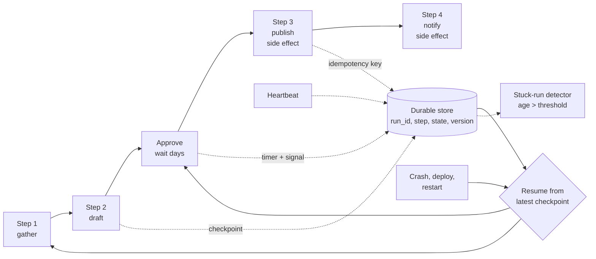

# Long-Running Workflow Reliability

> **Interview answer (say this first).** A long-running workflow is one that lives for hours, days, or months — waiting on human approvals, external callbacks, or scheduled times. Reliability means it survives everything that happens in that window: process crashes, deploys, restarts, and dependency outages. You get that by checkpointing progress durably after each step, resuming from the last checkpoint, making every activity idempotent so retries do not double-apply effects, and using durable timers and heartbeats instead of sleeping in memory. You also need run versioning, stuck-run detection, and a manual repair path, because no amount of automation removes the need for an operator.

## Why this exists

A fast workflow fails fast. A long one fails slowly and in more ways. In the course of a day, a workflow can be interrupted by:

```text
- a deploy that replaces every worker
- a pod eviction or an autoscaler shrinking the pool
- an external API that is down for an hour
- a human who does not approve until tomorrow
- a database failover that drops the connection mid-step
- an expired credential that only shows up after the token refresh window
- a clock change, a leap second, or a timezone bug in a deadline
```

A workflow that keeps its state in memory loses all of that progress on the first interruption. A workflow that retries from the start re-runs side effects. A workflow that sleeps in a thread holds a resource for hours. A workflow that is simply "running" with no heartbeat cannot be distinguished from a wedged one, so a stuck run sits for days until a user complains.

Long-running reliability is a set of small, boring mechanisms that together make hours-long work survive a bad day. Each one is simple; the value is in having all of them.

> **The one-sentence purpose.** Checkpoint durably after each step, resume from the last checkpoint, keep every effect idempotent, and detect runs that stop making progress.

## Start from zero

| Word | Plain meaning |
| --- | --- |
| **Long-running workflow** | A run that spans minutes to months and outlives many processes. |
| **Checkpoint** | A durable snapshot of state and the step it represents. |
| **Resume** | Load the latest checkpoint and continue from the next step. |
| **Replay** | Re-execute workflow code against recorded history to rebuild state. |
| **Idempotent activity** | An activity whose effect is the same whether run once or many times. |
| **Exactly-once effect** | At-least-once delivery plus idempotent handling, so the effect applies once. |
| **Heartbeat** | A periodic "still working" signal that proves a run or task is alive. |
| **Deadline** | An absolute time by which the workflow or step must finish, or be failed. |
| **Durable timer** | A named wait that the engine owns, so it survives restarts. |
| **Stuck run** | A run whose heartbeat or checkpoint is older than its expected progress interval. |
| **Versioning** | Making new code able to resume old runs, usually by branching on a version marker. |
| **Continue-as-new** | Closing a long run and starting a fresh one with the current state, to bound history. |
| **Compensation** | An action that undoes a completed step when the workflow must roll back. |
| **Manual intervention** | An operator action to inspect, repair, retry, or cancel a run. |
| **Reconciliation** | Periodically comparing recorded state with the outside world to find drift. |

Two distinctions to hold.

**Long-running is not the same as slow.** A slow step takes minutes. A long-running workflow waits for external events for days. The problem is not compute; it is surviving time.

**A heartbeat is not a progress signal.** A worker can heartbeat and make no progress — a wedged browser or a looping model call. Track the last completed step, not just the last sign of life. Liveness and progress are different.

## The core idea

Think of a **multi-day film shoot**. Each day the crew shoots scenes, and at the end of the day the production log records exactly what was shot. If the power goes out, or the lead actor is unavailable for a week, or the studio replaces the director, the shoot resumes from the log, not from scene one. Re-shooting a completed scene is wasteful and sometimes impossible (the set was struck). Reshooting a scene must also be safe if it happens.

A long agent workflow is the shoot. The log is the checkpoint history. Scene numbers are step names. The "set was struck" problem is exactly why a completed side effect must not be repeated.



The pattern is: progress is only real once it is written down. Between the effect and the record there is a window; idempotency keys close it. Everything after that is monitoring and repair.

| Failure | Without durability | With checkpoints + idempotency |
| --- | --- | --- |
| Deploy mid-run | Run lost or restarted from zero | Resume at the next step |
| Crash after a side effect | Effect repeated on retry | Keyed effect skipped |
| Human approves next day | In-memory wait is gone | Signal appended to durable history |
| External API down for an hour | Run fails permanently | Retries with backoff, run waits |
| Run wedged with no progress | Discovered by the user | Heartbeat/timeout alert fires |
| New code deployed | Old run cannot resume | Version branch resumes old runs |

## How it works

1. **Start with a stable run id.** Derive it from the business key (`order-42`, `invoice:2026-09`) so a duplicate start returns the existing run instead of creating a second one.
2. **Break the work into small steps.** Each step is a unit whose result can be recorded and whose re-execution is cheap or idempotent.
3. **Compute an idempotency key before each side effect.** Derive it from stable facts: `f"publish:{draft_id}"`, `f"charge:{order_id}"`. The key names the intent, so a repeat produces the same key.
4. **Perform the effect, then record the key.** The ledger below checks the key, runs the effect, and records the key only on success, so a crash before recording means the next attempt re-runs the effect. Close that window by passing a provider-side idempotency key or by writing the intent in the same transaction as the state change (the transactional outbox idea).
5. **Checkpoint after every completed step.** Store the step number, the state, and a schema version atomically. A half-written checkpoint is worse than none.
6. **Use durable timers for waits.** Schedule a wake-up in the engine's store, then release the worker. A wait of 24 hours should cost no compute.
7. **Receive external input as signals.** A webhook, an approval, or another service appends a message to the run's history and wakes it. Never block on a synchronous call.
8. **Heartbeat long activities.** Prove the task is alive and, where possible, record progress within the step. A missing heartbeat fails the activity so it can be retried.
9. **Set deadlines.** Give the run and each step an absolute deadline. A run that cannot finish by its deadline should fail or be escalated, not run forever.
10. **Resume by replay.** On a new worker, the engine replays history, skips completed steps, and continues. Because effects are keyed and idempotent, replay is safe even if it touches the effect boundary.
11. **Version the workflow and the state.** New code must be able to resume old runs. Branch on a version marker for behavioural changes, and store a schema version with every checkpoint.
12. **Detect stuck runs and keep a repair path.** Alert when the last checkpoint is older than the expected interval. Let an operator inspect, retry, patch state, or cancel — with the same idempotency guarantees as an automatic retry.

> **Warning.** The dangerous window is between performing an effect and recording it. A crash there means the effect happened but the record did not, so the retry repeats it. Close the window by writing the intent in the same transaction as the state change, or by having the external provider honour an idempotency key.

## The syntax you will use

**A checkpoint that carries everything needed to resume.** Keep the schema version in the record, not in your head.

```python
@dataclass
class Checkpoint:
    run_id: str
    step: int
    schema_version: int
    completed: list[str]
    result: dict
    updated_at: float
```

**A durable checkpoint write with a version guard.** The `WHERE version` makes concurrent resumes safe.

```sql
UPDATE run_checkpoints
SET step = $2, state = $3::jsonb, schema_version = $4, version = version + 1, updated_at = now()
WHERE run_id = $1 AND version = $5;     -- 0 rows = another worker advanced the run
```

**An idempotency ledger.** Record the key only after the effect succeeds, so a crash before recording causes a safe (not duplicated) retry in the common case where the provider also dedupes.

```python
class IdempotencyLedger:
    def __init__(self) -> None:
        self.done: dict[str, str] = {}

    def run_once(self, key: str, fn):
        if key in self.done:
            return f"skipped:{key}"
        result = fn()
        self.done[key] = str(result)     # record AFTER success
        return result
```

**A durable timer in Temporal.** The worker is released while the timer is pending.

```python
await workflow.sleep(timedelta(days=1))                    # durable, costs no worker
await workflow.wait_condition(lambda: self.approved, timeout=timedelta(days=7))
```

**A heartbeat for a long activity.** The activity reports progress; a miss fails it for retry.

```python
@activity.defn
async def transcode(run_id: str) -> str:
    for i, chunk in enumerate(chunks):
        process(chunk)
        activity.heartbeat({"chunk": i, "of": len(chunks)})   # proves progress
    return "done"
```

**Versioning workflow code.** New deployments branch instead of reordering, so old histories still replay.

```python
if workflow.patched("add-review-step-v2"):
    result = await workflow.execute_activity(
        run_review_step,                   # an @activity.defn defined next to the workflow
        start_to_close_timeout=timedelta(minutes=5),
    )
# old runs take the original path and resume correctly
```

**Stuck-run detection.** One query finds runs with no progress beyond their interval.

```sql
SELECT run_id, step, updated_at, now() - updated_at AS age
FROM run_checkpoints
WHERE status = 'running'
  AND now() - updated_at > make_interval(secs => expected_interval_s)
ORDER BY age DESC;
```

Alert on `age`, and distinguish "waiting on a known timer" from "no progress."

**Manual repair.** An operator action is just another idempotent, audited write.

```python
def repair_state(run_id, expected_version, patch, operator):
    conn.execute("""
        UPDATE run_checkpoints
        SET state = state || %s::jsonb, version = version + 1, updated_at = now()
        WHERE run_id = %s AND version = %s
    """, (json.dumps(patch), run_id, expected_version))
    audit_log(operator, run_id, patch)      # every manual change is recorded
```

## Examples: simple to real

**Example 1 — checkpoints plus idempotent effects.** Verified below. The workflow records each step; effects are keyed.

```python
import time
from dataclasses import dataclass


@dataclass
class Checkpoint:
    run_id: str
    step: int
    schema_version: int
    completed: list[str]
    result: dict
    updated_at: float


class CheckpointStore:
    """Durable store: survives process death. A dict stands in for Postgres/S3."""

    def __init__(self) -> None:
        self._data: dict[str, Checkpoint] = {}

    def save(self, cp: Checkpoint) -> None:
        self._data[cp.run_id] = cp

    def latest(self, run_id: str) -> Checkpoint | None:
        return self._data.get(run_id)


class IdempotencyLedger:
    """Records the key of each effect, so a retry or replay never repeats it."""

    def __init__(self) -> None:
        self.done: dict[str, str] = {}

    def run_once(self, key: str, fn):
        if key in self.done:
            return f"skipped:{key}"
        result = fn()
        self.done[key] = str(result)     # record AFTER success
        return result


STEPS = ["fetch_docs", "draft", "review", "publish", "notify"]
SCHEMA_VERSION = 2


class LongWorkflow:
    def __init__(self, store, ledger) -> None:
        self.store = store
        self.ledger = ledger
        self.effects: list[str] = []

    def _do(self, name: str, state: dict, crash_after_effect: bool = False) -> dict:
        if name == "fetch_docs":
            state["docs"] = ["design.md", "adr-7.md"]
        elif name == "draft":
            state["draft"] = "v1 draft"
        elif name == "review":
            state["review"] = "approved"
        elif name == "publish":
            self.ledger.run_once(
                f"publish:{state['draft']}", lambda: self.effects.append("published")
            )
            state["published_url"] = "https://docs.example.com/v1"
            if crash_after_effect:
                raise RuntimeError(
                    "simulated crash after the publish effect, before checkpoint"
                )
        elif name == "notify":
            self.ledger.run_once(
                f"notify:{state.get('published_url')}",
                lambda: self.effects.append("notified"),
            )
            state["notified"] = True
        return state

    def run(self, run_id: str, crash_after: int | None = None,
            crash_after_effect_at: int | None = None) -> dict:
        cp = self.store.latest(run_id)
        if cp is None:
            state, completed, step = {}, [], 0
        elif cp.schema_version != SCHEMA_VERSION:
            raise RuntimeError(
                f"resume refused: checkpoint v{cp.schema_version}, code v{SCHEMA_VERSION}"
            )
        else:
            state, completed, step = dict(cp.result), list(cp.completed), cp.step
        for name in STEPS:
            if name in completed:
                continue
            state = self._do(
                name, state, crash_after_effect=(step + 1) == crash_after_effect_at
            )
            completed.append(name)
            step += 1
            self.store.save(
                Checkpoint(run_id, step, SCHEMA_VERSION, completed, dict(state), time.time())
            )
            if crash_after is not None and step == crash_after:
                raise RuntimeError(f"simulated crash after step {step}")
        return state
```

**Example 2 — crash after three steps, then resume.** Verified below. The resumed run skips completed steps and completes.

```python
store = CheckpointStore()
ledger = IdempotencyLedger()
wf = LongWorkflow(store, ledger)

try:
    wf.run("run-9", crash_after=3)
except RuntimeError as exc:
    print("crashed:", exc)

cp = store.latest("run-9")
print("checkpoint at crash -> step", cp.step, "completed", cp.completed)
print("effects so far:", wf.effects)

resumed = wf.run("run-9")
print("resumed to completion:", resumed["published_url"], "notified:", resumed["notified"])
print("effects after resume:", wf.effects)
```

Verified output:

```text
crashed: simulated crash after step 3
checkpoint at crash -> step 3 completed ['fetch_docs', 'draft', 'review']
effects so far: []
resumed to completion: https://docs.example.com/v1 notified: True
effects after resume: ['published', 'notified']
```

The crash landed before any side effect, so the resume simply continued. Each effect ran exactly once.

**Example 3 — replaying is safe, and the ledger closes the effect/checkpoint window.** Verified below. Running the finished run again must not publish or notify a second time; a crash *after* an effect but *before* its checkpoint must also not duplicate the effect.

```python
wf.run("run-9")
print("effects after replay:", wf.effects)

# Crash after the publish effect but before its checkpoint is written. The
# checkpoint's `completed` list cannot help here, so the ledger must.
store2 = CheckpointStore()
ledger2 = IdempotencyLedger()
wf2 = LongWorkflow(store2, ledger2)
try:
    wf2.run("run-10", crash_after_effect_at=4)   # step 4 is publish
except RuntimeError as exc:
    print("crashed:", exc)
print("ledger recorded publish:", "publish:v1 draft" in ledger2.done)
wf2.run("run-10")
print("effects after resume:", wf2.effects)
```

Verified output:

```text
effects after replay: ['published', 'notified']
crashed: simulated crash after the publish effect, before checkpoint
ledger recorded publish: True
effects after resume: ['published', 'notified']
```

On the replay of `run-9`, the checkpoint's `completed` list skipped `publish` and `notify` before `IdempotencyLedger.run_once` was ever reached; the keys are a second line of defence, not the mechanism that made that replay safe. The crashed `run-10`, though, failed between the effect and its checkpoint, so `completed` did not contain `publish`; the idempotency key (`publish:v1 draft`) is what stopped the second publish. Either way, each effect ran exactly once in total.

**Example 4 — stuck-run detection and version-guarded resume.** Verified below. A heartbeat age beyond the threshold flags a run; a checkpoint from old code is refused rather than misread.

```python
cp = store.latest("run-9")
heartbeat_age = time.time() - cp.updated_at
stuck_timeout = 0.000001
print("stuck?", heartbeat_age > stuck_timeout, "(age > timeout)")

old = store.latest("run-9")
store.save(Checkpoint(old.run_id, old.step, 1, old.completed, old.result, old.updated_at))
try:
    wf.run("run-9")
except RuntimeError as exc:
    print("version guard:", exc)
```

Verified output:

```text
stuck? True (age > timeout)
version guard: resume refused: checkpoint v1, code v2
```

The threshold is tiny here to make the point; in production it would be minutes. The version guard is the safety net that stops a new binary from interpreting old state incorrectly.

The deploy-safe shape puts each step in its own activity with a retry policy and idempotency key, waits as a signal with a timeout, and durability in the engine store. Operations then query stuck runs by last-checkpoint age and repair with a conditional, audited write — the same ideas as chapter 22, concentrated on the time dimension.

> **Tip.** Give every run an explicit terminal state and an owner. "Running forever" is not a state; it is a missing alert. If a run exceeds its deadline, fail it, escalate it, or move it to a manual queue.

## In production

- **Checkpoint after every step, and write atomically.** A deploy at step 9 of 10 should cost one step. Store the state and the step number in one transaction.
- **Make every irreversible effect idempotent by key.** Retries, reclaims, and replay will all re-enter the effect path. A stable key is the difference between a correction and a duplicate charge.
- **Prefer durable timers to sleeping threads.** A 24-hour wait should free the worker. Polling loops waste compute and break on restart.
- **Heartbeat long activities and track progress, not just liveness.** A wedged task that still pings looks healthy. Record progress so stuck detection is meaningful.
- **Set deadlines on runs and steps.** Unbounded runs consume budget and hide failures. Escalate at the deadline instead of letting the run drift.
- **Version your workflow code before you deploy it.** Reordering or removing steps breaks replay of in-flight runs. Branch on a version marker, and only remove old branches when no runs use them.
- **Store a schema version with every checkpoint.** On resume, migrate or refuse. Never let old-shaped state flow into new code silently.
- **Bound history with continue-as-new.** Long loops accumulate events and slow replay. Roll state forward into a fresh run when history grows.
- **Alert on last-checkpoint age, not just failures.** The scariest run is the one that is neither failed nor progressing, because nothing pages.
- **Keep a manual repair path and audit it.** Operators need to inspect, retry, patch state, or cancel. Make every manual change an idempotent, version-checked, logged write.
- **Reconcile against the outside world.** Periodically compare recorded effects with reality: payments marked sent but not settled, notifications recorded but not delivered. Reconciliation finds the crashes inside the atomicity window.
- **Test crash points deliberately.** Inject failure before and after every side effect and assert that resume neither duplicates nor drops. Untested recovery code is wishful thinking.

## Interview questions

### 1. What makes a long-running workflow different from a normal job?

**Answer.** It outlives the process that started it, often by days or months, so it must survive deploys, crashes, dependency outages, and long human waits. It cannot hold state in memory or sleep in a thread, and it must be inspectable while it is in flight. The mechanisms are checkpoints, durable timers, signals, heartbeats, idempotent effects, and stuck-run detection.

**Follow-up: "Is a slow step a long-running workflow?"** No. A slow step takes minutes in one process. A long-running workflow waits for external events across many processes and restarts.

**Trap.** Treating it as "a job with a bigger timeout." Timeouts do not make state durable.

### 2. How do you achieve exactly-once effects in a workflow that runs for days?

**Answer.** You deliver at least once and make the effect idempotent. Before the effect, derive a stable idempotency key from business facts and record it durably; when the effect succeeds, mark it done. On any retry, replay, or takeover, the key is already present, so the effect is skipped. For external providers that support it, pass the same key so their side also dedupes.

**Follow-up: "What about the crash between the effect and the record?"** That is the atomicity window. Shrink it by writing the intent in the same transaction as the state change (outbox), or by relying on the provider's idempotency key so a repeat is harmless. Reconciliation catches whatever slips through.

**Trap.** Claiming a workflow engine gives exactly-once delivery. It gives durable at-least-once plus the tools to make effects idempotent.

### 3. How do durable timers and signals work, and why not sleep?

**Answer.** A durable timer is a wake-up scheduled in the engine's store; the worker is released immediately, and the engine enqueues a new task when the time arrives. A signal is an external message appended to the run's history that wakes it. Sleeping in a thread holds a resource for the entire wait and dies on restart; a timer costs nothing while it waits and survives everything.

**Follow-up: "What if the signal never arrives?"** Attach a timeout to the wait and branch to a failure or escalation path. Waiting forever is not a state; it is a missing decision.

**Trap.** Polling a database every minute to see if approval arrived. It wastes compute and adds load for no durability benefit.

### 4. How do you deploy new code without breaking in-flight runs?

**Answer.** Replay means old histories execute under new code, so a change must be compatible. Use the engine's versioning API to branch behaviour by a version marker: old runs take the original path, new runs take the new path. Store a schema version with checkpoints and migrate on read or refuse to resume. Never silently reorder, rename, or remove steps.

**Follow-up: "When can you delete the old branch?"** Only after no in-flight run uses it. Track it by version, drain or let runs complete, then remove the branch in a later release.

**Trap.** Refactoring the workflow for readability and discovering that thousands of live runs fail to replay.

### 5. How do you detect and handle a stuck run?

**Answer.** Track the last time a run made progress — the last completed step or the last durable checkpoint — not just whether its worker responded to a ping. Alert when that age exceeds the expected interval, and distinguish a known wait (a timer or a signal) from unexplained silence. Then repair: retry the current step, patch state through a versioned write, or cancel the run.

**Follow-up: "Why is liveness not enough?"** A hung process can still answer a health check. A progress-based signal is the only reliable indication that the work is advancing.

**Trap.** Alerting only on failures. A run that neither fails nor progresses pages no one and burns budget indefinitely.

### 6. What is continue-as-new and when do you need it?

**Answer.** Continue-as-new ends the current run and starts a fresh one with the current state, keeping history bounded. Long workflows that loop — a polling agent, a monthly subscription, a watcher — accumulate events and slow replay. Rolling into a new run resets the history while preserving logical continuity through the state passed in.

**Follow-up: "Does that change the run id?"** It typically creates a new run with the same workflow id but a new run id, linked as a chain. Your external systems should reference the workflow id, not the run id.

**Trap.** Letting history grow without bound, then watching replay slow to the point of timeouts.

### 7. How do you handle a run that must be repaired by a human?

**Answer.** Provide an operator interface that can inspect history, retry the current step, patch state through a version-checked conditional write, or cancel the run. Every manual action must be idempotent, version-guarded, and written to an audit log, so a repair is as safe and as traceable as an automatic retry. After repairing, reconcile with the outside world to catch effects that already happened.

**Follow-up: "Who should be allowed to patch state?"** A tightly scoped operator role, with approval for irreversible actions, and full audit. Manual repair is a power with real consequences.

**Trap.** Fixing state with an ad-hoc `UPDATE` that bypasses version checks and audit, then having a worker overwrite the repair.

### 8. What is the single biggest reliability mistake in long workflows?

**Answer.** Putting the state or the wait in the worker process instead of in durable storage. An in-memory run cannot be resumed, a thread sleep holds resources and dies on deploy, and nobody can see in-flight progress. Externalising state, using durable timers, and checkpointing each step fixes the majority of long-running failures in one move.

**Follow-up: "What is the second biggest?"** Failing to make effects idempotent, so the recovery mechanisms themselves cause duplicates. The two go together: durability lets you retry, and idempotency makes retrying safe.

**Trap.** Assuming the platform handles recovery so your code does not need idempotency. Recovery re-runs activities; the activity author owns the effect.

## Remember this

- **Checkpoint after every step; resume from the last one.** Hours of work should not depend on one process staying alive.
- **Every irreversible effect gets a stable idempotency key**, because replay and takeover re-enter the effect path.
- **Use durable timers and signals for waits.** A day-long wait should cost no compute and survive every restart.
- **Track progress, not just liveness.** Stuck-run alerts fire on last-checkpoint age, and every run has a deadline and a terminal state.
- **Version the workflow and the state**, and keep an audited manual repair path for the runs automation cannot fix.
