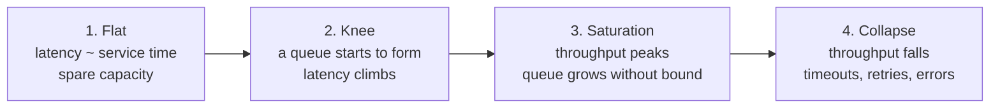

# Load Testing, Capacity, and Saturation

> **Interview answer (say this first).** A load test measures how a system behaves as offered load rises, and a capacity plan turns those measurements into a number of instances with headroom. The useful result is not one number but the shape of the load/latency curve. Latency is flat while capacity is spare, starts to climb at the **knee** (the load where a queue begins to form), and then throughput stops rising and eventually falls. Find the knee, name the first saturated resource, run below it, and put admission control or backpressure in front of it.

## Why this exists

A document-processing API passed staging at 40 requests per second. Production launch hit 400 requests per second at 09:00. Within two minutes p99 latency went from 60 ms to 11 s, the database connection pool was exhausted, the queue grew into the millions, and the service was restarted three times. Nothing was wrong with the code. Nobody had measured where the system stopped coping, and nobody had a policy for what to do past that point.

The staging number was not a lie. It was a measurement of a different system: one replica instead of six, tiny payloads, and a handful of human testers who could not push hard enough to expose the queue. A benchmark at one load level only proves that the system works at that load.

Three failures repeat in almost every incident of this kind:

- **Nobody measured the saturation point.** The team knew the service was "fast", not how much load it could take.
- **No headroom policy.** The service was sized to exactly the expected peak, so the first burst was also the outage.
- **No limit in front of the bottleneck.** When the queue filled, nothing rejected work or slowed producers, so the queue kept growing and took the database down with it.

Load testing produces the evidence. Capacity planning turns the evidence into a decision. Saturation analysis explains why the curve bends where it does.

## Start from zero

Every term here is used precisely in interviews, so define them first.

| Word | Plain meaning |
| --- | --- |
| **Load test** | Send a defined amount of work and measure latency, throughput, and errors at that load. |
| **Stress test** | Push load up until something breaks, to find the limit and the failure mode. |
| **Soak test** | Run a steady load for hours, to expose leaks, fragmentation, and slow queues. |
| **Spike test** | Jump from low to high load suddenly, to see whether the system absorbs and recovers. |
| **Concurrency** | The number of requests being worked on at the same instant. |
| **Throughput** | Work completed per second. Also called goodput when it counts only successful work. |
| **Latency** | Time for one request from start to finish. Reported as percentiles, never just an average. |
| **p50 / p95 / p99** | The latency that 50%, 95%, or 99% of requests finish within. p99 is the slow tail. |
| **Saturation** | The point where a resource cannot accept more work, so work queues instead of being served. |
| **Queue depth** | How many items are waiting. The clearest early signal of saturation. |
| **Utilisation** | The fraction of a resource that is busy, such as CPU at 70%. |
| **Little's Law** | `concurrency = arrival rate × latency`. Relates how many requests are in flight to rate and latency. |
| **Bottleneck** | The resource that saturates first and therefore sets the system's capacity. |
| **Headroom** | The spare capacity left below the knee, so bursts and failures do not overload the system. |
| **Capacity plan** | A written estimate of how many instances are needed for a demand target, with assumptions. |
| **Admission control** | Deciding whether to accept a request at all, usually by rejecting early under overload. |
| **Backpressure** | Signalling producers to slow down when the consumer cannot keep up. |
| **Closed workload** | A fixed number of clients or workers; the next request starts only when one finishes. |
| **Open workload** | Requests arrive at a fixed rate, independent of how fast the system is answering. |
| **Coordinated omission** | A measurement bias where a load generator slows down under load, so the worst latencies are never issued or never recorded. |

Two distinctions carry most of the topic:

- **Latency vs throughput.** Throughput can stay flat while latency explodes, because a full queue still serves work at the same rate. That is why p99, not throughput, is the first warning.
- **Closed vs open.** A closed generator can never overload the system, because it only ever has a fixed number of requests outstanding. An open generator can, which is what production does.

## The core idea

Picture a motorway. With few cars, speed is set by the speed limit and traffic flows freely. As density rises, one driver braking forces the next to brake harder, and small jams appear. Push further and traffic enters stop-and-go waves: the throughput of the road actually *falls*, because every car spends time stopped. Load works the same way.

The curve has four regions.



| Region | Offered load | Latency | Throughput | Queue depth | What it means |
| --- | --- | --- | --- | --- | --- |
| **Flat** | Well below knee | Near service time | Tracks offered load | Empty | Safe. Spare capacity absorbs bursts. |
| **Knee** | Near knee | Starts to rise | Still tracking | Rising | The last predictable load. Plan below here. |
| **Saturation** | Above knee | Steep | Plateau | Large and growing | Latency is already unacceptable. |
| **Collapse** | Far above knee | Unbounded | Falls | Massive | Timeouts and retries amplify the load. |

The **knee** is the number to plan around, not peak throughput. Peak throughput is achieved only when the queue is already deep, which means users are already waiting seconds and timeouts are firing. The knee is the highest load at which latency is still close to the service time, so it is the highest load you can serve predictably.

Different tests answer different questions. Run the one that matches the decision you are making.

| Test | Load shape | Question it answers |
| --- | --- | --- |
| **Load** | Steady target for minutes | Do we meet the SLO at expected traffic? |
| **Stress / breakpoint** | Ramp in steps until failure | Where is the knee, and what breaks first? |
| **Soak** | Steady for hours | Do memory leaks, file handles, or slow queues build up? |
| **Spike** | Sudden jump, then back down | Do we absorb a burst, and do we recover? |
| **Capacity** | Steps up to the knee | How many instances for N rps with headroom? |
| **Chaos** | Normal load plus a failure | Does reliability hold when a dependency dies? |

> **The mental shortcut.** Flat means safe, the knee is the budget, and saturation is a queue, not a CPU number. A resource can be at 60% CPU and still be saturated if the queue in front of it is full.

## How it works

1. **Define the workload before you measure.** Decide the mix of endpoints (for example 70% reads, 25% model calls, 5% writes), the arrival-rate shape, the payload size distribution, and whether clients are closed or open. A realistic mix matters more than a large number.
2. **Take a baseline at low load.** Run at a comfortable rate and record latency percentiles, throughput, and resource use. This is the "healthy" shape every later step is compared against.
3. **Ramp in steps.** Increase offered load in roughly 25–50% steps and hold each step long enough to reach steady state. Steady state means latency and queue depth stop drifting; for a 20 ms service, 30–60 seconds per step is typical.
4. **Measure four things per step.** Latency percentiles (p50, p95, p99), achieved successful throughput, queue depth, and utilisation of each resource (CPU, memory, connections, disk, network).
5. **Find the knee.** The knee is the step where p99 starts to rise faster than offered load, and where throughput stops tracking offered load. Plot both and read the bend.
6. **Name the first saturated resource.** Follow the queue to its cause: a CPU run queue, a thread or connection pool, database connections, a message backlog, or disk I/O. The next resource is often hidden behind the first.
7. **Explain the shape with Little's Law.** `concurrency = arrival rate × latency`. As latency rises at a fixed arrival rate, more requests are in flight at once, which fills thread pools and connection pools and makes latency rise further. This feedback is the mechanism behind the knee.
8. **Leave headroom.** Choose a target utilisation below the knee, commonly 50–70% for latency-sensitive services, so that a burst, a lost replica, or a slow dependency does not tip the system into saturation.
9. **Add admission control or backpressure before the knee.** Reject or shed work early with a clear status, or bound the queue and slow producers. A limit placed after saturation just moves the failure.
10. **Re-test after every change.** The bottleneck moves. Fixing the database exposes the CPU; adding CPU exposes the network. The knee is only valid for the build and payload you measured.
11. **Write the plan down.** Record the demand target, the measured knee, the target utilisation, the instance count, and the assumptions. A plan without assumptions cannot be revised.

> **The feedback loop.** Latency raises concurrency, concurrency exhausts a pool, an exhausted pool raises latency. Break the loop with a bound, not with a bigger pool.

## The syntax you will use

**A percentile function.** Do not use the mean. This linear-interpolation version matches the common statistical libraries; `p` is a fraction in `[0, 1]`.

```python
def percentile(samples: list[float], p: float) -> float:
    """Latency at percentile p, for example p=0.99."""
    if not samples:
        raise ValueError("no samples")
    ordered = sorted(samples)
    rank = p * (len(ordered) - 1)
    lower = int(rank)
    upper = min(lower + 1, len(ordered) - 1)
    weight = rank - lower
    return ordered[lower] * (1 - weight) + ordered[upper] * weight
```

**Time with a monotonic clock.** `time.perf_counter()` never jumps backwards, so it is the right clock for latency.

```python
import time

async def timed_call(call) -> float:
    started = time.perf_counter()
    await call()
    return (time.perf_counter() - started) * 1000
```

**An open-loop generator at a fixed arrival rate.** Requests are scheduled at `due` intervals regardless of how fast the system answers. Latency is measured from the *intended* start, so time spent waiting for a slot counts.

```python
import asyncio
import time

async def open_loop(
    rate_per_sec: float, duration_s: float, call
) -> list[float]:
    interval = 1.0 / rate_per_sec
    latencies: list[float] = []
    start = time.perf_counter()
    due = start
    pending: list[asyncio.Task[None]] = []

    async def one(scheduled: float) -> None:
        await call()
        latencies.append((time.perf_counter() - scheduled) * 1000)

    while time.perf_counter() - start < duration_s:
        pending.append(asyncio.create_task(one(due)))
        due += interval                              # fixed schedule, never drifts
        await asyncio.sleep(max(0.0, due - time.perf_counter()))
    await asyncio.gather(*pending)
    return latencies
```

**Read the queue depth.** Items waiting, excluding the ones already being handled. In production, read it from the queue itself alongside latency.

```python
import asyncio

queue: asyncio.Queue[bytes] = asyncio.Queue(maxsize=1_000)

def read_queue_depth() -> int:
    return queue.qsize()      # waiting items, not in-flight work
```

```text
# Other real sources of queue depth:
# Redis list       -> redis.llen("jobs:pending")
# RabbitMQ         -> queue_declare(...).method.message_count
# Amazon SQS       -> ApproximateNumberOfMessages (delayed CloudWatch metric)
# Kafka            -> consumer lag = latest offset - committed offset
# Kubernetes HPA   -> a pending-pods or queue-length custom metric
```

**Tools, not dependencies.** You can point a load generator at an HTTP service without writing the loop yourself. `k6` (JavaScript, scriptable), `Locust` (Python, code-defined users), `wrk` and `hey` (fast command-line HTTP benchmarks) are the common choices. Locust's default fixed-`users` model is closed: each user waits for a response before starting its next task, so its latency tail hides overload. Use its `constant_throughput` wait time for an open arrival rate, and read a tool's docs before trusting its tail.

## Examples: simple to real

**Example 1 — the mean and the median hide the tail.** A workload where 95% of requests take 18–22 ms and 5% take 400–900 ms. The mean looks fine; the tail is what users feel.

```python
import random
import statistics

rng = random.Random(7)
samples: list[float] = []
for _ in range(1000):
    if rng.random() < 0.95:
        samples.append(rng.uniform(18, 22))        # the fast majority
    else:
        samples.append(rng.uniform(400, 900))      # the slow minority

print(f"mean={statistics.fmean(samples):.0f}ms "
      f"p50={percentile(samples, 0.50):.0f}ms "
      f"p95={percentile(samples, 0.95):.0f}ms "
      f"p99={percentile(samples, 0.99):.0f}ms "
      f"p99.9={percentile(samples, 0.999):.0f}ms")
```

```text
mean=48ms p50=20ms p95=22ms p99=765ms p99.9=877ms
```

The mean of 48 ms suggests a healthy service, and the p50 of 20 ms looks excellent. But about 5% of requests take 400–900 ms, and the slowest 1% take longer than ~0.77 s. The mean hides all of it. Always report the tail, and always at a percentile that matches your SLO.

**Example 2 — a closed loop hides overload; an open loop exposes it.** The toy server handles at most four requests at once, each taking 20 ms, so its capacity is about 200 requests per second. Excess requests wait in a queue.

```python
import asyncio
import time

class ToyServer:
    """Handles at most `slots` requests at once; the rest wait in a queue."""

    def __init__(self, slots: int, service_s: float) -> None:
        self._slots = asyncio.Semaphore(slots)
        self._service_s = service_s
        self.in_handle = 0          # requests inside handle(): active plus waiting
        self.peak_in_handle = 0

    async def handle(self) -> None:
        self.in_handle += 1
        self.peak_in_handle = max(self.peak_in_handle, self.in_handle)
        async with self._slots:
            self.in_handle -= 1
            await asyncio.sleep(self._service_s)     # stands in for real work

async def closed_loop(server: ToyServer, workers: int, duration_s: float) -> list[float]:
    """Fixed workers: the next request starts only when one finishes."""
    end = time.perf_counter() + duration_s
    latencies: list[float] = []

    async def worker() -> None:
        while time.perf_counter() < end:
            started = time.perf_counter()
            await server.handle()
            latencies.append((time.perf_counter() - started) * 1000)

    async with asyncio.TaskGroup() as tg:
        for _ in range(workers):
            tg.create_task(worker())
    return latencies
```

```text
closed  4 workers: rate ~192/s  p99 =   21 ms  peak in-handle =   1
closed  8 workers: rate ~196/s  p99 =   42 ms  peak in-handle =   8
closed 16 workers: rate ~204/s  p99 =   85 ms  peak in-handle =  16
open   400 rps:                 p99 = 1066 ms  peak in-handle = 200
```

The closed loop can never push the server past its capacity, however many workers you add. With eight workers it offers about the same ~196/s as four, because each request now takes twice as long. The queue is bounded by the worker count, so latency grows gently and never explodes. The open loop keeps arriving at 400/s while the server drains at ~200/s, so the queue grows all run and p99 reaches a second. This is coordinated omission: the closed generator quietly reduces its own offered rate exactly when the system is struggling, so it never records the latency a real user would see.

**Example 3 — find the knee by ramping.** The same server, driven by the open-loop generator at increasing rates. Goodput counts only requests that *complete* inside the measurement window; the peak in-handle count (active plus waiting) is the high-water mark.

```text
offered  goodput   p50      p99     peak_queue
   50        48/s     21ms      21ms        1
  100        96/s     21ms      22ms        1
  150       144/s     21ms      22ms        1
  200       190/s     22ms      27ms        2
  300       192/s    144ms     282ms       50
  500       192/s    399ms     795ms      150
```

Below 200/s, goodput tracks offered load and latency is flat. At 200/s, goodput starts to fall short and latency picks up: this is the knee. At 300/s and 500/s, goodput is stuck at about 192/s while latency and queue depth climb linearly. The system is saturated, and adding offered load only makes the wait longer. The measured knee of ~190/s is close to the predicted 200/s (`4 slots ÷ 0.02 s`), and the prediction and measurement together give you confidence.

**Example 4 — Little's Law relates the three numbers.** If you know any two of arrival rate, latency, and concurrency, the third follows.

```python
import math

def in_flight(rate_per_sec: float, latency_s: float) -> float:
    """Little's law: concurrency = arrival rate x latency."""
    return rate_per_sec * latency_s

def workers_needed(rate_per_sec: float, latency_s: float, target_utilisation: float) -> int:
    return math.ceil(in_flight(rate_per_sec, latency_s) / target_utilisation)

print("100 rps at  50 ms ->", in_flight(100, 0.05), "in flight")   # 5.0
print("100 rps at 200 ms ->", in_flight(100, 0.2), "in flight")    # 20.0
print("workers at 70% for 100 rps, 200 ms ->", workers_needed(100, 0.2, 0.7))  # 29
```

```text
100 rps at  50 ms -> 5.0 in flight
100 rps at 200 ms -> 20.0 in flight
workers at 70% for 100 rps, 200 ms -> 29
```

At 100 requests per second and 50 ms each, about 5 requests are in flight. If a dependency slows to 200 ms, the same traffic needs 20 in flight — four times the concurrency for the same load. This is why a slow dependency looks exactly like a traffic spike, and why you size pools with `in_flight ÷ target_utilisation`, not with `in_flight` alone.

**Example 5 — turn measurements into a capacity plan with headroom.** Use the measured knee, a target utilisation below it, a demand forecast, and one spare instance for failover.

```python
import math

def instances_for(
    peak_rps: float,
    per_instance_knee_rps: float,
    target_utilisation: float = 0.6,
    growth: float = 2.0,
    spare: int = 1,
) -> int:
    """Instances to serve peak_rps, grown by `growth`, at a share of the knee."""
    usable_per_instance = per_instance_knee_rps * target_utilisation
    planned_demand = peak_rps * growth
    return math.ceil(planned_demand / usable_per_instance) + spare

n = instances_for(peak_rps=600, per_instance_knee_rps=200)
print("instances:", n)                                    # 11
print("usable per instance:", 200 * 0.6, "rps")           # 120.0
print("planned demand:", 600 * 2.0, "rps")                # 1200.0
print("provisioned capacity:", n * 200 * 0.6, "rps")      # 1320.0
print("headroom:", f"{(n * 200 * 0.6) / (600 * 2.0) - 1:.0%}")   # 10%
```

```text
instances: 11
usable per instance: 120.0 rps
planned demand: 1200.0 rps
provisioned capacity: 1320.0 rps
headroom: 10%
```

The measured knee is 200 requests per second per instance. Running at 60% of the knee gives 120 usable requests per second. Peak demand of 600, doubled for the plan horizon, needs 1200, so ten instances cover it and one more keeps the fleet alive if an instance dies. Write the assumptions (knee, target, growth, spare) next to the number, because the next person will need to revise them.

## In production

- **Measure before you optimise.** A change without a baseline is a guess. Record the knee and the first bottleneck, then make one change and re-measure.
- **Report p95 and p99, not the mean.** A mean hides the tail where users actually suffer. State the percentile your SLO uses, and watch it at the same percentile.
- **Closed-loop tests hide overload.** A fixed worker count bounds the queue by the worker count, so it can never grow without limit. Use open-loop arrivals for overload tests, and treat a flat latency curve from a closed test with suspicion.
- **Run a soak test.** Leaks, connection growth, log rotation, and cache eviction only appear over hours. A 15-minute test cannot find a slow memory leak.
- **Expect the bottleneck to move.** Fix the database and the CPU saturates; add CPU and the network or the lock saturates. Re-test after every change, and expect the knee to move with it.
- **Saturation is a queue, not a CPU percentage.** A service can be saturated at 50% CPU while a bounded connection pool is fully checked out. Watch queue depth and wait time, not only utilisation.
- **Headroom is a policy, not a leftover.** Decide the target utilisation in advance, usually 50–70%, and treat it as a requirement. A service sized to 100% of the knee is already in the incident.
- **Load test with realistic payloads and mixes.** Small JSON bodies and a single endpoint produce a number that does not transfer. Use production-like sizes, think times, and the real read/write/model mix.
- **Test the dependencies too.** Your service is only as fast as its slowest dependency. Load the database, cache, model provider, and downstream APIs, and find their knees as well.
- **Capacity plans need a stated safety margin.** Include growth, failover, and a cost or quota ceiling. A plan that exactly meets today's peak fails at tomorrow's.
- **Autoscaling reacts after saturation, so it is not a substitute for a limit.** New instances take time to start and warm, and they add pressure to shared dependencies. Keep admission control or backpressure in front so the system degrades instead of collapsing.
- **Watch for retry amplification.** When latency rises, clients time out and retry, which adds load and raises latency further. Bound retries, add jitter, and shed load before the feedback loop starts.

## Interview questions

### 1. How do you run a load test that actually predicts production?

**Answer.** Match the production shape, not just the peak number. Use the real endpoint mix, payload size distribution, and dependency latencies; use an open-loop arrival rate so the generator can overload the system; and then ramp through several steps to find the knee. Run long enough to reach steady state at each step, record p50/p95/p99 plus queue depth and resource use, and repeat after every change because the bottleneck moves.

**Follow-up: "Why not just run at the expected peak for an hour?"** That tells you whether you survive the expected peak, not where the edge is. Without the ramp you cannot size headroom, and without queue depth you cannot name the first bottleneck.

**Trap.** Load testing one endpoint with tiny payloads. Real traffic is a mix, and the slow or expensive endpoint usually sets the capacity.

### 2. What is the knee, and why plan around it rather than peak throughput?

**Answer.** The knee is the load where latency starts rising faster than offered load, just as a queue begins to form. Peak throughput happens later, when the queue is already deep and users are waiting seconds. The knee is the highest load you can serve predictably, so it is the right basis for a capacity plan. Planning at peak throughput means planning to run with a saturated queue.

**Follow-up: "How do you find it?"** Ramp in steps and plot p99 and goodput against offered load. The knee is where p99 bends upward and goodput stops tracking offered load.

**Trap.** Quoting a single throughput number from a benchmark as "capacity". Without the latency at that load, the number is meaningless.

### 3. What is coordinated omission, and how do you avoid it?

**Answer.** Coordinated omission is a measurement bias: a closed-loop generator waits for each response before sending the next, so when the system slows it sends fewer requests and never records the delay a real user would experience. The fix is an open-loop generator that keeps a fixed arrival schedule and measures latency from the intended start time, including time spent queued. Report queue depth alongside latency so an unbounded queue is visible even when recorded latencies look fine.

**Follow-up: "Can a closed test ever be useful?"** Yes, for correctness and for steady-state resource checks at a known concurrency. It is just not a valid overload test.

**Trap.** Trusting a closed-loop tool's p99 under overload. Many tools default to closed-loop behaviour, and their numbers look excellent while the real queue grows.

### 4. How do you find the first saturated resource?

**Answer.** Record utilisation, queue depth, and wait time for each tier while ramping: CPU run queue, memory, disk I/O, network, thread and connection pools, database connections, and message backlog. The first resource whose queue grows as load increases is the bottleneck. Confirm it by relieving that resource and re-running; if the knee moves, you found the real limiter.

**Follow-up: "What if two resources rise together?"** Test them one at a time. Change only one dimension between runs, because the true bottleneck is whichever one actually caps throughput.

**Trap.** Assuming CPU is the answer. In I/O-bound and AI services the bottleneck is often a connection pool, a model provider quota, or a queue.

### 5. Explain Little's Law and how you use it for capacity planning.

**Answer.** Little's Law says the average number of requests in a system equals arrival rate times average time in the system: `L = λ × W`. At 100 requests per second and a 200 ms response, 20 requests are in flight. Divide by a target utilisation to size workers or connections; always include headroom, because latency rises under load and that raises concurrency again.

**Follow-up: "What happens when latency doubles?"** For the same arrival rate, in-flight concurrency doubles. That is why a slow dependency can exhaust a pool without any increase in traffic.

**Trap.** Sizing to the average. Averages hide bursts and the tail, and the tail is where pools run out.

### 6. What is the difference between load, stress, soak, and spike tests?

**Answer.** A load test holds a steady expected load and checks the SLO. A stress test ramps until failure to find the knee and the failure mode. A soak test holds a steady load for hours to expose leaks and slow degradation. A spike test jumps to high load suddenly to see whether the system absorbs the burst and recovers. They answer different questions, so a serious capacity review uses several.

**Follow-up: "Which one first?"** Stress, to find the knee, then load at a safe fraction of it. Soak and spike come once the steady behaviour is known.

**Trap.** Running only a load test at the expected peak. It can pass while the service has no headroom and no recovery behaviour.

### 7. Why is autoscaling not enough, and where does admission control fit?

**Answer.** Autoscaling reacts after a metric crosses a threshold, and new instances take time to start, warm caches, and connect. In the meantime the queue grows, and scaling out can stampede a shared database or model provider. Admission control decides whether to accept a request at all; backpressure slows producers. Put a limit before the bottleneck so the system rejects or queues predictably instead of collapsing.

**Follow-up: "What metric should trigger scaling?"** A leading one, such as queue depth or concurrency, rather than CPU, which lags the queue.

**Trap.** Believing autoscaling raises the ceiling. It adds capacity at a tier; it cannot make a saturated database faster, and `maxReplicas` exists to protect that database.

### 8. How do you write a capacity plan, and what headroom do you choose?

**Answer.** Record the demand target, the measured knee per instance, the target utilisation, the growth assumption, and a spare for failover. Compute `instances = ceil(peak × growth ÷ (knee × target_utilisation)) + spare`. For latency-sensitive services, run at 50–70% of the knee; for batch work you can run higher. State the assumptions so the plan can be revised when any of them changes.

**Follow-up: "What if the demand forecast is wrong?"** That is what headroom is for. Also alert on the leading indicators (queue depth, p99) so you notice before the headroom is gone, and keep `maxReplicas` to protect shared dependencies.

**Trap.** Giving a single instance count with no assumptions. A plan without assumptions cannot be re-derived and quietly becomes wrong.

## Remember this

- **The knee, not peak throughput, is the number.** It is the highest load you can serve with predictable latency.
- **Latency percentiles tell the truth; the mean hides it.** Report p95 and p99, and watch queue depth beside them.
- **Closed-loop tests hide overload.** Use an open arrival rate and measure from the intended start to avoid coordinated omission.
- **Little's Law links everything:** `concurrency = arrival rate × latency`. Slow dependencies look like traffic spikes.
- **Headroom and a limit are the plan.** Run below the knee, and put admission control or backpressure in front of the bottleneck.
