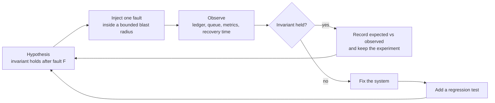

# Invariants, Chaos, and Recovery Testing

> **Interview answer (say this first).** Reliability is proved by behaviour under failure, not by reading code. State the **invariant** the system must never break — safety means a logical operation has exactly one effect, and liveness means every accepted job finishes — then run **chaos experiments** that inject one fault at a time inside a **bounded blast radius** and check whether the invariant still holds. Each experiment has a **hypothesis** and a **steady state**, and each run records expected versus observed. A broken invariant becomes a **regression test**. Recovery is a claim until you actually restore: measure the **actual recovery time** and **actual data loss** from a restore you ran, compare them against your **RTO** and **RPO** targets, and keep a **runbook** you have practised on a **game day**.

## Why this exists

A payments service charged a customer once. Then the worker that made the charge died before it acknowledged the queue message. The broker did exactly what at-least-once delivery promises: it redelivered the message to a healthy worker, which charged the customer a second time. The team had 92% test coverage. Every test exercised a code path. None of them killed a worker between the effect and the acknowledgement.

The same shape appears on the liveness side. A worker claimed a long agent job, held its progress in memory, and was replaced by a deploy. The message became visible again only after the visibility timeout, but the progress was gone. Nothing resumed it correctly, no alert fired, and the job sat stuck for three days until a customer asked where their report was.

```text
charge succeeds  ->  worker dies  ->  no ack  ->  broker redelivers  ->  second charge
                ^
                the window no test covered
```

Both failures were invisible to unit tests because unit tests do not kill processes, duplicate messages, delay networks, or move clocks. They test the happy path and a few error branches. Distributed failure is not a branch; it is a state the system enters when part of it is gone.

These failures are the normal consequence of at-least-once delivery and of processes that die. If you do not test for them deliberately, you find them in production, in the ledger, and in a customer's inbox.

> **Note:**
>
> **The one-sentence purpose.** An invariant says what must stay true; chaos testing injects the faults that try to break it; recovery testing proves you can restore. Tests assert the invariant, not the code path.

## Start from zero

| Word | Plain meaning |
| --- | --- |
| **Invariant** | A property that must always be true of the system, no matter which fault happens. |
| **Safety invariant** | "Nothing bad ever happens": no operation is applied twice, a balance never goes negative. |
| **Liveness invariant** | "Something good eventually happens": every accepted job reaches a terminal state. |
| **Chaos experiment** | A controlled test that injects one fault and checks one named invariant. |
| **Fault injection** | Deliberately causing a specific failure: kill a worker, duplicate a message, add delay, break a link, skew a clock. |
| **Blast radius** | The set of things a fault or an experiment is allowed to affect. |
| **Steady state** | The normal baseline you expect when nothing is broken: queue depth, throughput, latency, zero duplicates. |
| **Hypothesis** | A falsifiable prediction, for example "killing one worker resumes the job within 60 seconds and produces one effect." |
| **Worker death** | A process disappearing in the middle of a job, with no chance to clean up. |
| **Duplicate delivery** | The same message handed to a consumer more than once, which at-least-once queues do by design. |
| **Network delay** | Packets arrive late; the call is slow but not failed. |
| **Network partition** | Packets are dropped between two groups of nodes; each side can still reach some peers. |
| **Clock skew** | Two machines disagree about the current time, so leases, TTLs, and ordering disagree too. |
| **Lease** | A time-limited grant of ownership that expires unless it is renewed. |
| **TTL** | Time to live: how long a record, grant, or message stays valid. |
| **Handover** | Passing a job from a dead or expired owner to a new one. |
| **Fencing** | Tagging ownership so a stale owner's writes are rejected. |
| **Quorum** | A majority of nodes that must agree before the group acts. |
| **Bulkhead** | Isolating resources so one failing dependency cannot exhaust all of them. |
| **Checkpoint** | A saved progress marker that a restarted worker resumes from. |
| **Visibility timeout** | The window before a broker makes an unacknowledged message visible to another consumer. |
| **Dependency outage** | A downstream service is down or unreachable, so calls fail or time out. |
| **RTO** | Recovery time objective: the target time to restore service after a failure. |
| **RPO** | Recovery point objective: the amount of accepted data you are willing to lose, measured as time. |
| **Replay** | Re-processing recorded messages or history after a failure, for example re-reading a log from an offset. |
| **Restore** | Rebuilding state from a backup or a replica, then checking it is complete and consistent. |
| **Runbook** | A written procedure for a specific failure, followed under stress by an on-call engineer. |
| **Game day** | A scheduled rehearsal of a realistic incident, with observers and a written outcome. |

Two distinctions carry most of the weight:

- **Safety is a promise about bad events; liveness is a promise about good events.** A single safety violation is a bug (one duplicate is already wrong). A liveness violation is a job that never finishes; a short delay may be acceptable, never finishing is not. Test both.
- **An implementation test checks the call sequence; an invariant test checks the state.** "Ack after charge" passes even when the charge runs twice. "One ledger row per operation id" fails the moment it does.

## The core idea

Think of a bridge load test. Engineers do not prove a bridge is safe by reading the blueprints. They put known loads on it, one at a time, and measure whether it deforms past a limit. The limit is the invariant. The load is the fault. The measurement is the experiment.

Chaos engineering is property-based testing for a distributed system. In property-based testing you generate many inputs and assert one property holds for all of them. In chaos testing you inject many faults and assert one invariant holds after each. The assertion is over the resulting state, not over the sequence of function calls. That is what makes it survive a refactor: you can rewrite the worker, change the queue library, and the invariant test still means something.

Stated as a predicate, the whole discipline is one line: for every fault in duplicate, death, delay, partition, skew, and outage, `count(effect, op) == 1`, and every accepted job reaches a terminal state. The loop is always the same:



The first two invariants to name, every time:

| Invariant type | What it promises | Example on a job queue |
| --- | --- | --- |
| **Safety** | Nothing bad ever happens | A job is never applied twice; no job is marked done while still running. |
| **Liveness** | Something good eventually happens | Every accepted job finishes, or is explicitly failed and visible. |

Each fault is interesting because it attacks a different mechanism. If the mechanism is wrong, the invariant breaks.

| Fault | Mechanism it exercises | Invariant that must hold | Expected recovery |
| --- | --- | --- | --- |
| Duplicate delivery | Idempotency, dedup store | One logical operation, one effect | Duplicate becomes a no-op |
| Worker death | Checkpoint, lease, handover | Every accepted job reaches a terminal state | Another worker resumes from the last checkpoint |
| Network delay | Timeout, fallback | A call returns or degrades within its deadline | Fallback answer; no resource held |
| Network partition | Quorum, retry, fencing | No two owners apply the same operation | Majority keeps serving; minority fails safe |
| Clock skew | Lease and TTL expiry, ordering | An operation is not accepted by two owners | Expired lease is fenced; late message discarded |
| Dependency outage | Circuit breaker, bulkhead, fallback | Failure does not cascade to unrelated work | Calls fail fast, then recover when the dependency returns |

## How it works

1. **State the invariants as predicates over state.** Write them in code, not in prose: `count(effect, op_id) == 1` for safety, and `status in {"completed", "failed"}` for liveness. A prose invariant cannot run in CI.
2. **Define the steady state.** Record the normal baseline first: queue depth, throughput, p95 latency, duplicate count, and the time a job normally takes. Without a baseline you cannot tell whether the fault changed anything.
3. **Write one hypothesis per experiment.** Make it falsifiable and bounded: "If I kill one worker while it holds a job, then the job resumes on another worker within 60 seconds and produces exactly one effect." Name the fault, the invariant, and the bound.
4. **Inject one fault at a time.** Kill one worker, duplicate one message, delay one dependency. Two faults at once produce a result you cannot attribute to either one. Run it in a test environment first.
5. **Bound the blast radius.** Restrict the experiment to one tenant, one partition, one replica, or one percent of traffic. Decide what "stop" means and have a kill switch before you start.
6. **Observe the state, not the logs.** Collect the ledger, the queue's pending set, terminal statuses, metrics during the fault, and the wall-clock time to recovery. Error logs are a symptom; the invariant is the proof.
7. **Verify the invariant on the observed data.** Count effects per operation id. Count jobs that are neither terminal nor making progress. Compare completion time with the objective. Record the numbers, not an impression.
8. **Record expected versus observed.** Keep one row per experiment: fault, hypothesis, expected, observed, invariant held, follow-up. A negative result — the invariant broke — is the valuable one. Save the raw evidence.
9. **Fix and add a regression test.** Every broken invariant gets a deterministic test that injects the same fault in CI. Prefer a seeded fault or a fake clock so it runs in milliseconds and fails every time.
10. **Practise recovery.** Measure RTO and RPO with a real restore, not a diagram. Keep a runbook with an owner, triggers, steps, and a verification. Run a game day with a scheduled fault and observers. Only after an experiment is understood do you promote it to continuous chaos, and always with a kill switch.

> **Tip:**
>
> **The mental shortcut.** An invariant is a property; a fault is an input; recovery is the time and data cost of getting back to steady state. Test the property, inject the input, and measure the cost.

## The syntax you will use

These snippets share the standard library only.

```python
import asyncio
import random
import time
from dataclasses import dataclass, field
```

**An invariant assertion over a ledger.** The ledger is the source of truth. The assertion counts effects per operation, so it cannot be fooled by a refactor of the calling code.

```python
@dataclass
class Ledger:
    entries: list[tuple[str, str]] = field(default_factory=list)  # (op_id, effect)

    def apply(self, op_id: str, effect: str) -> None:
        if any(existing == op_id for existing, _ in self.entries):
            return  # duplicate delivery: already applied
        self.entries.append((op_id, effect))

    def count(self, op_id: str) -> int:
        return sum(1 for existing, _ in self.entries if existing == op_id)


def assert_exactly_once(ledger: Ledger, op_id: str) -> None:
    seen = ledger.count(op_id)
    assert seen == 1, f"invariant broken: {op_id} applied {seen} times"
```

`Ledger.apply` is a check-then-write, which is safe here only because the simulation runs on one thread. In production two workers can both see "missing" and both write; make the claim atomic with a unique constraint on `op_id` and `INSERT ... ON CONFLICT DO NOTHING` (see [idempotency](12-idempotency.md)). The invariant test is the same either way; the mechanism underneath must be atomic.

**A fault-injection wrapper.** One object injects the fault(s) you enable at a counted call, so a test is reproducible and the fault is impossible to forget.

```python
class FaultInjector:
    def __init__(self, *, fail_at: int | None = None, delay_s: float = 0.0,
                 duplicate_at: int | None = None) -> None:
        self.fail_at = fail_at
        self.delay_s = delay_s
        self.duplicate_at = duplicate_at
        self.calls = 0

    def run(self, fn, *args, **kwargs):
        self.calls += 1
        if self.delay_s:
            time.sleep(self.delay_s)
        if self.calls == self.fail_at:
            raise TimeoutError("injected dependency timeout")
        result = fn(*args, **kwargs)
        if self.calls == self.duplicate_at:
            fn(*args, **kwargs)  # simulate at-least-once redelivery
        return result
```

**A deterministic clock for skew tests.** Leases and TTLs compare timestamps. A fake clock lets you test "the lease expired" and "the other node's clock is 30 seconds ahead" without waiting, and without depending on the wall clock.

```python
class FakeClock:
    def __init__(self, start: float = 0.0) -> None:
        self.now = start

    def time(self) -> float:
        return self.now

    def advance(self, seconds: float) -> None:
        self.now += seconds

a, b = FakeClock(start=0.0), FakeClock(start=30.0)   # 30 s of skew
a.advance(10)
print(a.time(), b.time())                            # 10.0 30.0
```

**A retry with a budget.** Cap the attempts, add exponential backoff with jitter, and inject `sleep` so tests do not actually wait. A bounded retry cannot turn a blip into a storm.

```python
def retry_with_budget(fn, *, max_attempts: int = 3, base_s: float = 0.1,
                      sleep=time.sleep):
    rng = random.Random(7)                 # seeded jitter: reproducible tests
    for attempt in range(1, max_attempts + 1):
        try:
            return fn()
        except (TimeoutError, ConnectionError):
            if attempt == max_attempts:
                raise
            delay = base_s * (2 ** (attempt - 1))
            sleep(delay + rng.uniform(0, delay))
    raise AssertionError("unreachable")
```

**A recovery check that counts effects.** After a restore or a replay, assert that the invariant still holds across every expected operation.

```python
def assert_recovery(ledger: Ledger, expected_ops: set[str]) -> dict[str, int]:
    counts = {op: ledger.count(op) for op in expected_ops}
    broken = {op: n for op, n in counts.items() if n != 1}
    assert not broken, f"recovery violated exactly-once: {broken}"
    return counts
```

## Examples: simple to real

**Example 1 — duplicate delivery must not duplicate an effect.** The broker delivers `op-1` twice because the first acknowledgement was lost. The dedup set makes the second delivery a no-op.

```python
@dataclass
class Effects:
    ledger: list[str] = field(default_factory=list)
    seen: set[str] = field(default_factory=set)

    def apply_once(self, op_id: str, effect: str) -> str:
        if op_id in self.seen:
            return f"duplicate ignored: {op_id}"
        self.seen.add(op_id)
        self.ledger.append(effect)
        return effect

fx = Effects()
for op_id in ["op-1", "op-1", "op-2"]:      # op-1 delivered twice
    print(fx.apply_once(op_id, f"charge:{op_id}"))
print(fx.ledger)
```

```text
charge:op-1
duplicate ignored: op-1
charge:op-2
['charge:op-1', 'charge:op-2']
```

*Expected:* three deliveries produce two effects. *Observed:* the ledger holds `charge:op-1` and `charge:op-2`, so the safety invariant holds. The test asserts the ledger, not that the code called a dedup function.

**Example 2 — worker death mid-job resumes from a checkpoint.** A worker dies after two of three steps. The checkpoint was written after each completed step, so a new worker continues from `draft` instead of restarting.

```python
@dataclass
class Job:
    job_id: str
    steps: list[str]
    done: list[str] = field(default_factory=list)


class JobStore:
    def __init__(self) -> None:
        self.jobs: dict[str, Job] = {}

    def save(self, job: Job) -> None:
        self.jobs[job.job_id] = Job(job.job_id, job.steps, list(job.done))

    def load(self, job_id: str) -> Job | None:
        return self.jobs.get(job_id)


def run_worker(store: JobStore, job_id: str, crash_after: int | None = None) -> Job:
    job = store.load(job_id)
    if job is None:
        raise KeyError(job_id)
    for step in job.steps:
        if step in job.done:
            continue
        if crash_after is not None and len(job.done) == crash_after:
            raise RuntimeError(f"worker died after {crash_after} steps")
        job.done.append(step)
        store.save(job)                     # checkpoint after the step
    return job


store = JobStore()
store.save(Job("job-1", ["fetch", "draft", "publish"]))
try:
    run_worker(store, "job-1", crash_after=2)
except RuntimeError as exc:
    print("expected worker death:", exc)
print("checkpoint:", store.load("job-1").done)
run_worker(store, "job-1")                  # a new worker picks it up
print("completed:", store.load("job-1").done)
```

```text
expected worker death: worker died after 2 steps
checkpoint: ['fetch', 'draft']
completed: ['fetch', 'draft', 'publish']
```

*Expected:* the job reaches a terminal state and no step runs twice. *Observed:* the checkpoint holds two steps, and the resumed run completes all three. The liveness invariant holds; the missing test would have caught a store that only saved at the end.

**Example 3 — network delay with a timeout degrades instead of hanging.** The dependency takes 200 ms; the caller allows 50 ms. The timeout turns a slow call into a fast, safe fallback instead of a thread held for the full 200 ms.

```python
async def slow_dependency(delay: float) -> str:
    await asyncio.sleep(delay)
    return "slow result"


async def fetch_with_timeout(timeout: float) -> str:
    try:
        async with asyncio.timeout(timeout):
            return await slow_dependency(0.2)
    except TimeoutError:
        return "fallback: dependency too slow"


print(asyncio.run(fetch_with_timeout(0.05)))   # fallback: dependency too slow
```

```text
fallback: dependency too slow
```

*Expected:* the caller returns within its deadline with a degraded answer. *Observed:* the fallback is returned at 50 ms; with a 500 ms deadline the same code returns the real value. The hazard is a test that asserts an error was logged — the invariant is "returns within the deadline", not "times out".

**Example 4 — a dependency outage opens a circuit breaker.** Three failures trip the breaker. The fourth call fails immediately without touching the dependency. After the cool-down the breaker half-opens, the probe succeeds, and it closes.

```python
from enum import Enum


class State(Enum):
    CLOSED = "closed"
    OPEN = "open"
    HALF_OPEN = "half_open"


class CircuitBreaker:
    def __init__(self, fail_threshold: int = 3, cool_down_s: float = 5.0,
                 clock: FakeClock | None = None) -> None:
        self.state = State.CLOSED
        self.failures = 0
        self.fail_threshold = fail_threshold
        self.cool_down_s = cool_down_s
        self.opened_at = 0.0
        self.clock = clock or FakeClock()   # the fake clock from the syntax section

    def allow(self) -> bool:
        if self.state is State.OPEN:
            if self.clock.now - self.opened_at >= self.cool_down_s:
                self.state = State.HALF_OPEN
            else:
                return False
        return True

    def record(self, ok: bool) -> None:
        if ok:
            self.state = State.CLOSED
            self.failures = 0
            return
        self.failures += 1
        if self.failures >= self.fail_threshold:
            self.state = State.OPEN
            self.opened_at = self.clock.now


class Dependency:
    def __init__(self) -> None:
        self.down = True
        self.calls = 0

    def call(self) -> str:
        self.calls += 1
        if self.down:
            raise ConnectionError("dependency outage")
        return "ok"


def guarded_call(breaker: CircuitBreaker, dep: Dependency) -> str:
    if not breaker.allow():
        return "fast-fail (breaker open)"
    try:
        result = dep.call()
    except ConnectionError:
        breaker.record(ok=False)
        return "fast-fail (call failed)"
    breaker.record(ok=True)
    return result


dep = Dependency()
cb = CircuitBreaker(fail_threshold=3, cool_down_s=5.0)
print([guarded_call(cb, dep) for _ in range(4)])
print("state:", cb.state.value, "dependency calls:", dep.calls)
cb.clock.advance(5.0)
dep.down = False
print("probe:", guarded_call(cb, dep), "state:", cb.state.value)
```

```text
['fast-fail (call failed)', 'fast-fail (call failed)', 'fast-fail (call failed)', 'fast-fail (breaker open)']
state: open dependency calls: 3
probe: ok state: closed
```

*Expected:* after the threshold, calls stop reaching the dependency and resume only after a successful probe. *Observed:* the dependency received exactly three calls; the fourth was rejected. The invariant is "a dying dependency stops receiving traffic", which the fake clock proves instantly instead of waiting five real seconds.

**Example 5 — a restore test proving RPO.** RPO is a claim until a restore proves it. Here the backup is 30 seconds old at the moment of the crash, so the measured loss window is 30 seconds, inside the 60-second objective.

```python
@dataclass
class Snapshot:
    at_s: int
    data: list[str]


class Journal:
    def __init__(self) -> None:
        self.now_s = 0
        self.writes: list[str] = []
        self.snapshots: list[Snapshot] = []

    def advance(self, s: int) -> None:
        self.now_s += s

    def write(self, item: str) -> None:
        self.writes.append(item)

    def snapshot(self) -> None:
        self.snapshots.append(Snapshot(self.now_s, list(self.writes)))

    def restore_latest(self) -> None:
        snap = self.snapshots[-1]
        self.writes = list(snap.data)
        self.now_s = snap.at_s


j = Journal()
j.write("charge:order-1")   # t=0
j.advance(60)
j.snapshot()                # backup at t=60
j.advance(30)               # crash at t=90
j.write("charge:order-2")   # written after the backup
latest = j.snapshots[-1]
data_loss_window_s = j.now_s - latest.at_s
j.restore_latest()
print("restored:", j.writes)
print("data loss window:", data_loss_window_s, "s")
print("RPO (60 s) met:", data_loss_window_s <= 60)
```

```text
restored: ['charge:order-1']
data loss window: 30 s
RPO (60 s) met: True
```

*Expected:* the restore loses no more than the RPO and the restored data is usable. *Observed:* `charge:order-1` returns, `charge:order-2` is gone, and the loss window is 30 seconds. A runbook that says "restore from backup" but has never been executed is a guess; this run is the evidence.

## In production

- **Test invariants, not code paths.** A test that a function was called proves nothing about the state. Assert that the ledger has one row per operation id and that every job reaches a terminal state. State-based assertions survive refactors and catch the failures that matter.
- **Inject one fault at a time.** A single fault has an attributable result. Kill a worker *or* duplicate a message *or* delay a dependency. If two faults overlap, you cannot tell which one broke the invariant.
- **Bound the blast radius.** Run against one tenant, one partition, one replica, or one percent of traffic. Big bang chaos produces an outage, not an experiment.
- **Chaos in production needs a kill switch.** It is the strongest environment because it has real traffic, real clocks, and real data. It is also the easiest to turn into an incident. Require a kill switch, a stop condition, an owner, and a time limit before the first run.
- **Duplicate delivery is the normal case.** At-least-once queues redeliver after lost acknowledgements and rebalances. Test the duplicate path in integration tests, not just the fresh path.
- **Worker death is the normal case.** Deploys, evictions, and autoscaling replace processes constantly. Every job must survive its worker disappearing mid-step.
- **Clocks are not synchronised.** Wall clocks drift and NTP steps them backwards. Use monotonic time for durations, and inject a fake clock into lease, TTL, and ordering tests.
- **Timeouts and retries must be tested together.** A retry without a timeout never returns; a timeout without a bounded retry drops transient work. Test them as one policy, with jitter and a budget, or you will trade one failure for the other.
- **RTO and RPO are claims until you restore.** A backup that has never been restored is a hope. Restore into a clean environment, verify row counts and checksums, and measure the clock. Record both numbers.
- **A runbook nobody has followed is a document, not a plan.** Follow it under time pressure on a game day. If a step is ambiguous or a command fails, the runbook is broken, not the reader.
- **Every incident adds a regression test.** The incident that mattered should never be able to happen silently again. Reproduce the exact fault deterministically, then keep the test forever.
- **Alert on the invariant, not just on errors.** Errors are a symptom. Page on duplicate effects, jobs stuck past their deadline, a breaker stuck open, and a restore older than its RPO. A server that logs no errors can still be silently breaking the invariant.

## Interview questions

### 1. What is an invariant, and why test it instead of a code path?

**Answer.** An invariant is a property that must always hold: a safety one says no logical operation has more than one effect, a liveness one says every accepted job eventually finishes. A code-path test checks that a particular function was called in a particular order, which passes even when the effect happens twice. An invariant test asserts over the resulting state, so it keeps working after a refactor and catches failures the call order cannot describe.

**Follow-up: "How do you write one?"** As a predicate over durable state. After the experiment, count rows per operation id and count jobs not in a terminal state. Fail the test when either count is wrong.

**Trap.** Treating coverage as proof. High line coverage can coexist with zero crash-point tests, which is exactly how a duplicate charge ships.

### 2. What is a chaos experiment, and what makes a good hypothesis?

**Answer.** A chaos experiment injects one controlled fault and checks whether a named invariant still holds. A good hypothesis is falsifiable and bounded: it names the fault, the invariant, and the expected recovery, such as "killing one worker resumes the job within 60 seconds and produces exactly one effect." If the result is open to interpretation, the experiment is not done.

**Follow-up: "What is the steady state?"** The baseline you measure before injecting anything — throughput, queue depth, latency, zero duplicates. You need it to prove the fault changed something and that the system returned to normal afterwards.

**Trap.** Starting with a fault instead of an invariant. "We killed a pod and it seemed fine" is a story, not an experiment.

### 3. What is blast radius, and how do you run chaos in production safely?

**Answer.** Blast radius is the set of things a fault is allowed to affect: one tenant, one partition, one replica, or a small traffic share. In production you bound it deliberately, cap the duration, define a stop condition, and require a kill switch and an owner. You start small, prove the invariant, and widen only when the experiment is boring.

**Follow-up: "Why not always test in staging?"** Staging lacks real traffic shapes, real data volumes, and real clock and network behaviour. But production is only appropriate once the experiment is understood and reversible.

**Trap.** Running production chaos without a kill switch, or injecting a fault that is not reversible. A duplicate charge cannot be un-sent.

### 4. How do you test duplicate delivery?

**Answer.** Deliver the same operation id twice and assert that the effect count is one. Do it at the effect boundary, using the real dedup store or unique constraint, not a mock. Include the hard case where the duplicate arrives while the first attempt is still in flight, and assert that the second is rejected or waits rather than running in parallel.

**Follow-up: "What if the duplicate changes the payload?"** A repeat with the same id but different content should be treated as a conflict (for example, HTTP 409), not silently accepted or applied twice.

**Trap.** Testing only the dedup function in isolation. The failure lives in the window between performing the effect and recording the id.

### 5. How do you test worker death and resumption?

**Answer.** Kill the worker at a specific point in the job and restart it. Assert two things: the job reaches a terminal state, and no completed step or side effect runs twice. To make it deterministic, inject the death after a counted step (or between the effect and the checkpoint) rather than relying on timing. Then verify the resumed worker continues from the checkpoint.

**Follow-up: "Where is the hardest crash point?"** After the external effect and before the checkpoint is written. The effect must be idempotent or recorded in the same transaction as the state, or the resume duplicates it.

**Trap.** Only killing the worker before any effect. The interesting window is the one after the effect.

### 6. Why must timeouts and retries be tested together?

**Answer.** They only work as a pair. A retry without a timeout can wait forever; a timeout with an unbounded retry turns a slow dependency into a retry storm. Test the combined policy: bounded attempts, exponential backoff with jitter, a total time budget, and a fallback when the budget is exhausted. Inject delay and failure into the same call to prove the policy degrades instead of hanging or hammering.

**Follow-up: "How does jitter change the test?"** Seed the random generator so the test is reproducible. Then you can assert the exact number of attempts and the total virtual delay.

**Trap.** Testing them separately and assuming the composition is safe. The composition is where the outage lives.

### 7. What are RTO and RPO, and how do you prove them?

**Answer.** RTO is the target time to restore service; RPO is the amount of accepted data you may lose, measured as time. Both are proved by an actual restore: rebuild the state from a backup or replica, verify completeness, and measure the elapsed time and the data lost. Until you have run one, they are claims.

**Follow-up: "What is the difference between a backup and a restore?"** A backup is a copy. A restore is a tested, repeatable path from that copy to a working system, including the configuration and secrets around it.

**Trap.** Measuring only the database restore time and ignoring the application, configuration, and dependency recovery around it. RTO covers the whole service.

### 8. What is a game day, and what makes a runbook real?

**Answer.** A game day is a scheduled rehearsal of a realistic incident: a named failure, a real environment, observers, and a written outcome. It makes a runbook real by forcing someone to follow it under pressure. A runbook is real when it names its owner, its trigger, its steps, its stop condition, and how to verify recovery — and when a game day has shown those steps work.

**Follow-up: "Where do game days and chaos experiments meet?"** A game day is often a rehearsal of a known failure; chaos engineering is the ongoing, automated testing of invariants. The first builds confidence in the runbook; the second keeps the invariant honest as the system changes.

**Trap.** Writing a runbook and never reading it again. Systems drift; an untested runbook is worse than none, because it looks like preparedness.

## Remember this

- **An invariant is the assertion; a fault is the input; recovery is the cost.** Assert one ledger row per operation, and that every accepted job finishes.
- **Inject one fault at a time inside a bounded blast radius**, with a kill switch before production chaos.
- **Duplicates and worker deaths are the normal case**, not edge cases; test the crash point after the effect and before the checkpoint.
- **Clocks are not synchronised and networks are not reliable.** Inject them with a fake clock and a fake fault, not by waiting and hoping.
- **RTO and RPO are only real after a restore, and a runbook is only real after a game day.** Every incident earns a regression test.
