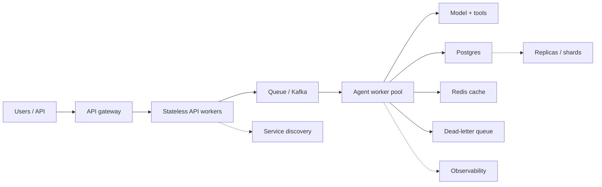

# Phase 6 — Distributed Systems for AI

AI systems are distributed systems with a language model in them. When one agent run fans out into tool calls, queues, workers, and databases across several machines, the hard problems are no longer about prompts — they are the classic distributed-systems problems: what happens when a message is delivered twice, when a worker dies mid-task, when two nodes disagree, when a queue backs up, or when a downstream service gets slow.

This phase builds that toolkit. It is the difference between an agent that works in a notebook and an agent platform that survives a bad day.

## What you will be able to do

By the end of this phase you should be able to:

- Reason about scalability, availability, reliability, fault tolerance, consistency, and the CAP trade-off.
- Choose between horizontal and vertical scaling, and between stateless and stateful services.
- Design traffic flow with load balancers, reverse proxies, API gateways, and service discovery.
- Work with message queues, Kafka, RabbitMQ, SQS, and Redis for asynchronous work.
- Explain event-driven architecture, pub/sub, consumer groups, and event sourcing.
- Reason about partitioning, ordering, and the delivery guarantees: at-most-once, at-least-once, exactly-once.
- Make operations idempotent, use distributed locks and leader election safely, and retry with backoff and jitter.
- Protect systems with timeouts, dead-letter queues, circuit breakers, bulkheads, rate limiting, and backpressure.
- Cache, replicate, shard, and partition data, and apply the saga pattern, transactional outbox, and CQRS.
- Run distributed agents: worker pools, scheduling, distributed state, and reliable long-running workflows.

## The shape of a distributed AI system

Every box is a place where partial failure is normal, and every arrow is a place where a message can be lost, duplicated, delayed, or reordered. The engineering is making those outcomes boring.

## Topic order

1. [Distributed systems fundamentals](01-distributed-systems-fundamentals.md) — scalability, availability, reliability, fault tolerance.
2. [Consistency and the CAP theorem](02-consistency-and-the-cap-theorem.md) — what you trade away.
3. [Scaling services](03-scaling-services.md) — horizontal vs vertical, stateless vs stateful.
4. [Load balancing, proxies, and discovery](04-load-balancing-proxies-and-discovery.md) — getting traffic to the right place.
5. [Message queues and producer-consumer](05-message-queues-and-producer-consumer.md) — asynchronous work.
6. [Kafka](06-kafka.md) — the distributed log.
7. [Redis for distributed systems](07-redis-for-distributed-systems.md) — locks, counters, queues, and caching.
8. [RabbitMQ and SQS](08-rabbitmq-and-sqs.md) — brokered and cloud queues.
9. [Event-driven architecture and pub/sub](09-event-driven-architecture-and-pubsub.md) — events, consumer groups, and event sourcing.
10. [Partitioning and ordering](10-partitioning-and-ordering.md) — scale and sequence.
11. [Delivery guarantees](11-delivery-guarantees.md) — at-most-once, at-least-once, exactly-once.
12. [Idempotency](12-idempotency.md) — the price of at-least-once.
13. [Distributed locks and leader election](13-distributed-locks-and-leader-election.md) — coordination.
14. [Retries, backoff, jitter, and timeouts](14-retries-backoff-jitter-and-timeouts.md) — failing without making it worse.
15. [Dead-letter queues](15-dead-letter-queues.md) — where bad messages go.
16. [Circuit breakers and bulkheads](16-circuit-breakers-and-bulkheads.md) — containing failure.
17. [Rate limiting and backpressure](17-rate-limiting-and-backpressure.md) — protecting the system.
18. [Caching and distributed caching](18-caching-and-distributed-caching.md) — speed without stale lies.
19. [Replication, sharding, and database partitioning](19-replication-sharding-and-partitioning.md) — scaling data.
20. [Saga pattern and transactional outbox](20-saga-pattern-and-transactional-outbox.md) — consistency without distributed transactions.
21. [CQRS](21-cqrs.md) — separating reads and writes.
22. [Workflow engines and distributed task execution](22-workflow-engines-and-distributed-task-execution.md) — durable orchestration.
23. [Agent worker pools and scheduling](23-agent-worker-pools-and-scheduling.md) — running many agents.
24. [Distributed state management](24-distributed-state-management.md) — where the truth lives.
25. [Long-running workflow reliability](25-long-running-workflow-reliability.md) — surviving for hours or days.
26. [Load testing, capacity, and saturation](26-load-testing-capacity-and-saturation.md) — finding the knee before production does.
27. [Invariants, chaos, and recovery testing](27-invariants-chaos-and-recovery-testing.md) — proving the system behaves when parts of it die.

> **How to study this phase.** Ask two questions of every pattern: *what happens when this component fails halfway?* and *what happens when this message is delivered twice?* Nearly every idea here is an answer to one of those two.

## Checkpoint and evidence

Complete this checkpoint before moving on. It follows the [competency and evidence contract](../projects/competency-evidence.md) — **learn → build → measure → break → explain**. The artifact is the proof; the explanation is the interview rehearsal.

| Step | Artifact | Pass condition |
| --- | --- | --- |
| **Build** | `artifacts/phase-06/load-chaos/` — a load and chaos harness with safety and liveness invariants for each mechanism. | Every mechanism has a named invariant and a test. |
| **Measure** | Throughput, queue depth, p95, saturation point, RTO, and RPO. | Numbers are recorded at increasing load with a named first bottleneck. |
| **Break** | Worker death, duplicate delivery, network delay, dependency outage, and clock skew. | Each experiment has an expected result, an observed result, and a follow-up change. |
| **Explain** | The invariant each reliability mechanism protects. | You connect each mechanism to its test and runbook and answer “why not just add more workers?”. |

> **Evidence tip.** Keep the artifact in your own repository and record it in the [checkpoint record](../projects/competency-evidence.md#the-checkpoint-record). If the artifact does not exist, the phase is not finished.
