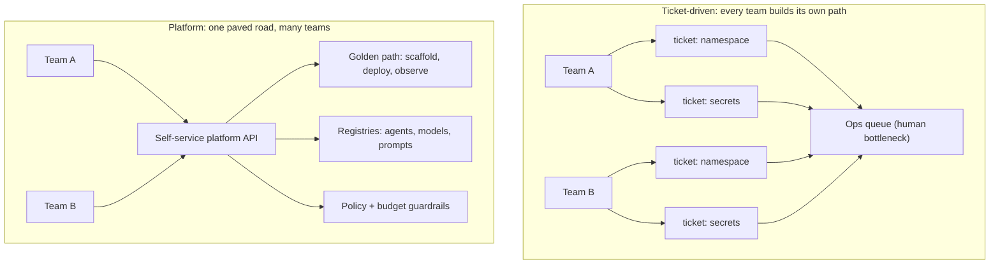

# Platform Engineering Fundamentals

> **Interview answer (say this first).** Platform engineering is the discipline of building and running an internal product — the platform — that gives software teams self-service access to the compute, runtimes, data, and guardrails they need to ship software. It treats the platform as a product with real users (developers), a roadmap, and adoption metrics. It replaces ticket-driven operations with **golden paths**: supported, opinionated ways to do common things. For AI, the platform is what turns one team's agent prototype into a hundred teams' governed, budgeted, rollback-able production agents.

## Why this exists

Start with the pain that creates platform teams.

You are an AI engineer. You want to ship an agent. Before your code runs once in production, you must: get a cloud account, get a Kubernetes namespace, get database credentials, get an API key for a model provider, get a log sink, get a place to store prompts, get an evaluation pipeline, and get someone from security to approve the whole thing. Each item is a different team and a different ticket. Your feature is blocked for three weeks on work that is not your feature.

Now multiply that by fifty teams. Every team solves the same problems its own way. Some pin model versions; some float `latest`. Some store prompts inline in code; some in a wiki. Some enforce budgets; some discover a five-figure bill at the end of the month. The organisation is paying the **integration tax** over and over, and the results are inconsistent and unauditable.

Platform engineering is the response. Instead of every team building its own path to production, one team builds a shared path — and makes it the easiest path to take.

The name comes from the idea that the platform is not a pile of tools. It is a **product**, and developers are its customers. If they do not adopt it, it has failed, no matter how good the technology is.

> **Note:**
>
> **The one-sentence purpose.** A platform turns repeated, error-prone, per-team setup work into a shared, self-service product so product teams can ship faster and safer.

## Start from zero

Platform vocabulary is full of words that sound like synonyms but are not. Learn the differences now.

| Word | Plain meaning |
| --- | --- |
| **Platform** | A shared set of capabilities and guardrails that many teams use to build and run their software. |
| **Platform engineering** | The practice of building and operating that shared platform as a product for internal developers. |
| **Internal Developer Platform (IDP)** | The concrete thing developers interact with: a portal, CLI, templates, pipelines, and APIs that expose the platform's capabilities. |
| **Platform team** | The team that owns the platform, its roadmap, and its reliability. |
| **Golden path** | A supported, recommended way to accomplish a common task, such as "deploy a Python service" or "register an agent." Also called a **paved road**. |
| **Paved road** | Same idea as golden path: the path is smooth because the platform team maintains it. |
| **Guardrail** | A constraint that keeps a golden path safe, such as "images must be pinned by digest." Not the same as a gate. |
| **Gate** | A manual checkpoint that blocks progress until a person approves, such as a change advisory board. |
| **Self-service** | Developers get what they need through an API or portal, without filing a ticket and waiting for another team. |
| **Ticket-driven** | Every request goes to a human queue. Slow, and it does not scale with headcount. |
| **Cognitive load** | How much a team must hold in their heads to get work done. Platforms exist to lower it. |
| **Toil** | Repetitive, manual, automatable work that does not create lasting value. |
| **Thinnest viable platform** | The smallest platform that delivers real value. A strategy to avoid building a giant platform nobody asked for. |
| **Adoption** | The share of eligible teams actually using the platform. The first sign of success. |
| **Lead time** | The time from "developer starts a change" to "change is running in production." A core platform metric. |
| **Build vs buy** | The decision to build a platform capability yourself or pay a vendor for it. |
| **API-first** | The platform exposes capabilities as APIs, so they can be automated and composed, not just clicked. |

Two distinctions to lock in early:

- **A golden path is not a mandate.** It is the easiest, supported route. Teams can leave it, but then they own the consequences. A gate forces everyone through one door; a paved road just makes one door much nicer.
- **An IDP is not the platform.** The platform is the whole set of capabilities (compute, registries, gateways, policy). The IDP is the user-facing surface on top of it — the portal, CLI, and templates.

## The core idea

Think about a city. There are public roads, traffic lights, water, and power. A business does not build its own power plant or its own highway; it plugs into the shared infrastructure and focuses on its actual product. The city maintains the roads so everyone can move.

Platform engineering is "build the roads, not the trucks." The platform team builds and maintains the shared roads. Product teams drive their own trucks.

Now make it a product, not a public utility. A public utility does not care whether you liked the experience; a product team does. The platform has users. It needs onboarding, docs, feedback loops, and a roadmap. If a developer tries the golden path and it is worse than doing it themselves, they will route around it. That is the platform's most important failure signal.

The central design question is always: **what is the thinnest platform that removes the most pain?** Teams do not want a platform; they want to ship. Build only what they actually pull for.



On the left, work scales with headcount because a human handles every request. On the right, the platform handles the common case, and the platform team spends its time on the next improvement instead of the same ticket.

A comparison of the two operating models:

| Dimension | Ticket-driven | Self-service platform |
| --- | --- | --- |
| How you get a namespace | File a ticket, wait days | `platform create service` returns in seconds |
| Who knows the standard | Ops, in their heads | Encoded in templates and policy |
| Scaling limit | Number of ops people | Compute and engineering, not headcount |
| Consistency | Whatever the last reviewer remembered | Enforced by the golden path |
| Feedback loop | Complaints after the fact | Metrics on every self-service call |
| Cost of a new team | New tickets for everything | New account in the platform, minutes |

The AI twist: AI work adds new shared concerns on top of ordinary software — model access, prompt storage, evaluation, token budgets, and data governance. If you do not platform them, every team invents its own, and you cannot answer "which model, which prompt, which cost" across the company.

## How it works

Walk through how a platform team actually builds and runs a platform.

1. **Find the repeated pain.** Interview teams or look at ticket queues. The top repeated requests — namespaces, credentials, deploy pipelines, model access — are the first candidates. Do not start with a technology; start with a bottleneck.
2. **Define the golden path.** Pick one supported way to do the most common task. "To ship a Python agent, use this template, this pipeline, and this registry." Write it as a template, not a wiki page, so it is executable.
3. **Expose it self-service.** Wrap the golden path in something developers call directly: a CLI (`platform new agent`), a portal button, or an API. No ticket, no waiting.
4. **Add guardrails, not gates.** Encode policy where the work happens: images must be pinned by digest, agents must declare a budget, secrets must come from the vault. Fast rejection with a clear message beats slow human approval.
5. **Make the platform observable.** Measure adoption, lead time, error rates, and the toil removed. If a golden path is slow or broken, you need to see it before developers route around it.
6. **Run it as a product.** Ship improvements on a roadmap, publish docs and changelogs, and treat developer feedback as product feedback. A platform with no users is a science project.
7. **Let teams leave the road deliberately.** Provide an escape hatch for genuine edge cases. The platform covers the 80 percent; the 20 percent is allowed, but it is owned by the team that chose it.
8. **Iterate toward the thinnest viable platform.** Add the next capability only when teams pull for it. Big platforms built speculatively are abandoned speculatively.

### Measuring a platform

You cannot improve what you do not measure. The four families of metrics:

- **Adoption:** how many eligible teams use the golden path, and how many active users it has.
- **Velocity:** developer lead time, deployment frequency, and time to first deploy for a new team.
- **Reliability:** platform availability, change failure rate, and time to restore.
- **Toil removed:** manual hours eliminated, tickets avoided, and self-service success rate.

A useful single number is **self-service completion rate**: the fraction of requests that finish without a human touching them. If it is low, you still have a ticket-driven platform wearing a portal.

## The syntax you will use

These are real, common forms you will recognise in platform work. Each is a pattern, not a specific vendor.

**A golden-path template.** Instead of a checklist, the platform ships a repository template that generates a working service. In practice this is a repo template, a Cookiecutter, or a CLI scaffolder.

```text
platform-template-agent/
  service/
    app.py              # entry point with a /healthz route
    Dockerfile
    requirements.txt
  registry/
    agent.yaml          # agent metadata for the agent registry
  pipeline/
    ci.yml              # build, test, scan, publish
    deploy.yml          # canary + promote
  README.md             # golden path docs
```

A developer runs one command and gets all of it. The template is the documentation.

**A self-service API call.** The platform is API-first, so the portal, CLI, and CI all use the same endpoint.

```http
POST /v1/services HTTP/1.1
Authorization: Bearer <platform-token>
Content-Type: application/json

{"name": "claims-agent", "template": "agent-python", "team": "claims", "budget_usd_per_month": 500}
```

One call provisions the namespace, pipeline, registry entry, and budget. No ticket.

**Guardrails as policy, evaluated at admission.** Policy runs where the change is created, so bad input is rejected in seconds.

```rego
# policy: every deployable agent must pin its model and declare a budget
package platform.admission

deny[msg] {
  input.kind == "Agent"
  not input.spec.model.version          # no pinned model version
  msg := "agent must pin model.version"
}

deny[msg] {
  input.kind == "Agent"
  not input.spec.budget_usd_per_month
  msg := "agent must declare budget_usd_per_month"
}
```

Fast rejection in the pipeline is a guardrail. A person reviewing every change is a gate.

**A service catalog entry.** The catalog is the directory of what exists, who owns it, and how healthy it is.

```yaml
apiVersion: platform.example.com/v1
kind: Service
metadata:
  name: claims-agent
  owner: team-claims
spec:
  tier: tier-1
  repo: github.com/acme/claims-agent
  runbook: https://runbooks.example.com/claims-agent
  dashboards:
    - https://grafana.example.com/d/claims-agent
  budget_usd_per_month: 500
```

The catalog answers "who do I call at 2 a.m.?" — the first question in any incident.

**A paved-road pipeline.** CI is standardised so quality gates and publishing are automatic.

```yaml
# .github/workflows/deploy.yml (shape, not vendor-specific)
on:
  push:
    branches: [main]
jobs:
  verify:
    steps:
      - run: make test
      - run: make eval          # run the evaluation registry suite
      - run: make policy-check  # guardrails
  canary:
    needs: verify
    steps:
      - run: platform deploy --agent claims-agent --version $GIT_SHA --stage canary
      - run: platform verify-canary --agent claims-agent --version $GIT_SHA
  promote:
    needs: canary
    steps:
      - run: platform promote --agent claims-agent --version $GIT_SHA --to prod
```

Notice the shape: verify, canary, promote. That shape is the same whether the tool is GitHub Actions, GitLab CI, or Jenkins.

## Examples: simple to real

**Example 1 — the ticket-driven bottleneck in numbers.** When a human serves every request, capacity is headcount.

```python
from dataclasses import dataclass

@dataclass
class Request:
    kind: str
    lead_time_days: float

tickets = [
    Request("database", 9.0),
    Request("database", 7.0),
    Request("namespace", 4.5),
    Request("secret", 1.0),
]

def mean(values: list[float]) -> float:
    return sum(values) / len(values)

lead = [r.lead_time_days for r in tickets]
print(f"requests={len(tickets)} mean_lead_days={mean(lead):.2f}")
# requests=4 mean_lead_days=5.38
```

The average hides the pain. Two teams waited over a week for a database.

**Example 2 — the golden path as a template.** A scaffolder returns a whole project, so developers start on a supported path.

```python
GOLDEN_PATH: dict[str, str] = {
    "service/Dockerfile": "FROM python:3.12-slim\n",
    "service/app.py": "def handler():\n    return {'status': 'ok'}\n",
    "service/tests/test_app.py": "def test_ok():\n    assert True\n",
    "registry/agent.yaml": "name: {name}\nmodel: pinned\n",
    "pipeline/ci.yml": "name: ci\n",
}

def scaffold(name: str) -> dict[str, str]:
    """Create a new project on the paved road."""
    return {path.replace("service", name): body.replace("{name}", name)
            for path, body in GOLDEN_PATH.items()}

files = scaffold("claims-agent")
print(sorted(files))
print(len(files))
# ['claims-agent/Dockerfile', 'claims-agent/app.py', 'claims-agent/tests/test_app.py',
#  'pipeline/ci.yml', 'registry/agent.yaml']
# 5
```

The template is the standard. Updating the template updates every new service.

**Example 3 — self-service completion rate.** The metric that tells you whether you actually removed the ticket queue.

```python
def self_service_rate(total_requests: int, human_requests: int) -> float:
    """Fraction of requests that finished without a human touching them."""
    return 1 - human_requests / total_requests

print(f"{self_service_rate(1000, 120):.1%}")   # 88.0%
print(f"{self_service_rate(1000, 600):.1%}")   # 40.0%
```

88 percent self-service is a platform. 40 percent is a queue with a nice front end.

**Example 4 — guardrails reject bad input fast.** Policy runs at admission, before anything is deployed.

```python
POLICY = {"image_digest_required": True, "max_replicas": 20}
DIGEST_PREFIX = "@sha256:"

def admit(spec: dict, policy: dict = POLICY) -> list[str]:
    """Return a list of policy violations; empty means allowed."""
    errors: list[str] = []
    if policy["image_digest_required"] and DIGEST_PREFIX not in spec.get("image", ""):
        errors.append("image must be pinned by digest")
    if spec.get("replicas", 0) > policy["max_replicas"]:
        errors.append("replicas exceed policy")
    return errors

print(admit({"image": "ghcr.io/acme/agent@sha256:abc123", "replicas": 3}))
# []
print(admit({"image": "ghcr.io/acme/agent:latest", "replicas": 50}))
# ['image must be pinned by digest', 'replicas exceed policy']
```

A guardrail says no in milliseconds and explains why. A gate says "come back tomorrow."

**Example 5 — adoption over time.** Track weekly active teams to see whether the platform is growing or plateauing.

```python
weeks = {"w1": 120, "w2": 150, "w3": 165, "w4": 180, "w5": 190}

def growth(series: dict[str, int]) -> float:
    values = list(series.values())
    return (values[-1] - values[0]) / values[0]

print(f"adoption_growth={growth(weeks):.0%}")   # adoption_growth=58%
```

Adoption growth without a matching drop in tickets means people are using the portal but still filing tickets underneath.

**Example 6 — build vs buy, in rough numbers.** A total-cost comparison, not a religious argument.

```python
def tco(*, build_cost: int, annual_run: int, years: int,
        buy_per_seat: int, seats: int) -> dict[str, int | str]:
    build = build_cost + annual_run * years
    buy = buy_per_seat * seats * years
    return {"build": build, "buy": buy, "cheaper": "build" if build < buy else "buy"}

print(tco(build_cost=300_000, annual_run=80_000, years=3,
          buy_per_seat=1_500, seats=200))
# {'build': 540000, 'buy': 900000, 'cheaper': 'build'}
```

Cheaper is not automatically better: the build option also costs you the engineers who maintain it and the delays while you build it. Buy when the capability is undifferentiated and mature; build when it is core and nobody sells it well.

## In production

- **Adoption is the only proof of value.** A platform nobody uses is pure cost. Track active teams and time-to-first-deploy, and treat a flat line as a bug.
- **Do not mandate the golden path too early.** A forced path that is worse than the DIY route breeds resentment and shadow infrastructure. Make the road good first, then encourage.
- **Guardrails beat gates.** Every human approval you add is a queue, a delay, and a single point of failure. Automate the check wherever you can, and reserve humans for genuinely irreversible decisions.
- **The escape hatch is a requirement.** Some teams have real edge cases. If the platform cannot express them, teams will leave — and if there is no supported exit, they will hide it from you.
- **Build the thinnest viable platform.** Resist the urge to build multi-region, multi-cloud, and a plugin system before anyone has shipped. Scope creep is the platform team's classic failure.
- **A platform is a product with a roadmap, docs, and support.** No docs and no support means no adoption. Budget for developer experience, not just infrastructure.
- **Measure lead time, not just deployments.** A pipeline that deploys often but takes a week to get a change through review is not fast. Lead time is what developers feel.
- **For AI, budgets and model access are first-class platform features.** Without a shared budget and a model gateway, teams get surprise bills and unauditable model use.
- **Beware the platform team as a new bottleneck.** If the platform team becomes the only team that can change the platform, you have rebuilt the ticket queue one level up.
- **Keep a self-service API even if there is a portal.** Portals go stale and click-ops does not scale. The API is what CI and automation use.
- **Charge back or show back costs.** Teams that can see their token and compute spend change their behaviour. Opaque shared cost creates waste.
- **Run the platform to a real SLO.** If the platform is down, every product team is blocked. Treat it as tier-1 infrastructure.

## Interview questions

### 1. What is platform engineering, and how is it different from DevOps and SRE?

**Answer.** Platform engineering builds an internal product — the platform — that gives product teams self-service access to shared capabilities and guardrails. DevOps is a culture and set of practices for developer-operations collaboration. SRE applies software engineering to operations and reliability, with SLOs and error budgets. Platform engineering is the productised delivery mechanism: it turns the shared practices into a curated, self-service path.

**Follow-up: "So is a platform team just an ops team with a new name?"** No, if it is done right. An ops team serves tickets; a platform team ships a product with users, a roadmap, and adoption metrics. If the platform team still handles every request by hand, the rename changed nothing.

**Trap.** Saying platform engineering replaces DevOps or SRE. It implements their ideas in a self-service product; you still need SLOs, incident response, and automation discipline.

### 2. What does "platform as a product" actually mean?

**Answer.** It means treating developers as customers. The platform has users, a value proposition, onboarding, documentation, a support path, and a roadmap driven by feedback. Success is measured by adoption and outcomes, not by the number of features shipped. If developers do not choose it, it has failed.

**Follow-up: "How do you get feedback?"** Usage telemetry (what is slow, what fails), direct interviews, ticket and friction analysis, and a published roadmap. Treat repetitive complaints as backlog items, not noise.

**Trap.** Building what leadership finds impressive instead of what developers pull for. A multi-cloud control plane is worthless if teams cannot get a database in under a day.

### 3. What is an internal developer platform (IDP)?

**Answer.** The IDP is the developer-facing surface of the platform: a portal, CLI, and API plus templates, pipelines, and catalogs that expose the platform's capabilities. It is what a developer touches. The underlying platform includes compute, registries, networking, policy, and data services.

**Follow-up: "Is a portal an IDP?"** A portal is one interface to the IDP. The IDP also has an API and a CLI, because CI and automation need to drive it too. A portal alone is a thin shell over whatever is underneath.

**Trap.** Calling the IDP "the platform." They are layers: capabilities underneath, developer experience on top.

### 4. What is a golden path, and why not just give teams total freedom?

**Answer.** A golden path is one supported, opinionated way to do a common thing, maintained by the platform team. Total freedom means every team re-solves the same problem, with inconsistent security, cost, and reliability. The golden path gives a fast default while leaving an escape hatch for real edge cases. It is a paved road, not a wall.

**Follow-up: "What if a team does not want the golden path?"** They can leave it, and they own the operational burden. That is fine. What is not fine is an unsupported bespoke platform that the central team then has to page for at 3 a.m.

**Trap.** Confusing a golden path with a mandate. Mandating a bad path produces shadow IT; making a good path the easiest choice produces adoption.

### 5. Self-service versus ticket-driven — what actually changes?

**Answer.** In a ticket-driven model, capacity equals the number of people in the queue, so lead time grows with demand and standards live in reviewers' heads. In a self-service model, developers call an API or CLI, the platform handles the common case automatically, and policy is encoded in the path. Lead time drops, consistency improves, and the platform team's time shifts from repetitive fulfillment to improvement.

**Follow-up: "Where do humans still belong?"** Irreversible or high-risk decisions: production data access, security exceptions, large budget increases, and anything with legal or compliance weight.

**Trap.** Automating something without guardrails and calling it self-service. That is just unattended risk. Fast and safe is the goal, not fast alone.

### 6. How do you measure whether a platform is working?

**Answer.** Four families: adoption (active teams, golden-path share), velocity (lead time, deployment frequency, time to first deploy), reliability (availability, change failure rate, time to restore), and toil removed (manual hours, tickets avoided, self-service completion rate). A cheap headline metric is self-service completion rate.

**Follow-up: "Which metric catches a fake platform?"** Self-service completion rate and ticket volume. If tickets stay flat while portal logins rise, the portal is cosmetic.

**Trap.** Reporting only vanity metrics like "services created." Created services that are not deployed or used mean nothing.

### 7. How do you decide build vs buy?

**Answer.** Build when the capability is core to your differentiation, when no vendor solves it well, and when you can maintain it. Buy when the capability is undifferentiated, mature, and cheaper to rent than to run. Compare total cost, not license price: engineering time, ongoing operations, integration, and opportunity cost. For AI platforms, registries and governance tend to be build-worthy; managed model serving and cloud primitives are often buy.

**Follow-up: "What is the hidden cost of building?"** Maintenance forever. A home-grown registry is a product with an on-call rotation, migrations, and security patches. Count the people, not just the sprint.

**Trap.** Building because "we can." A team of three building a control plane they cannot staff is a slow-motion outage.

### 8. What makes AI platforming different from ordinary platforming?

**Answer.** AI adds shared concerns that ordinary software does not have: model access and routing, prompt and evaluation storage, dataset governance, token budgets and cost, non-deterministic outputs, and auditability of "which model and prompt produced this." These must be platform capabilities, or every team invents its own and the company cannot answer basic governance questions. The platform also has to handle variable latency and GPU or provider capacity, not just CPU.

**Follow-up: "Which of those would you build first?"** A model gateway with a shared budget, plus an agent and prompt registry. Those unblock every team and create the audit trail everything else depends on.

**Trap.** Treating AI as just another stateless service. The registry, evaluation, and cost dimensions are new, and they are where AI platforms fail.

## Remember this

- **Platform engineering builds a shared product for developers**, not a pile of tools. Adoption is the only proof of value.
- **Golden path, not gate.** Make the supported route the easiest route; automate the check instead of queueing the human.
- **Self-service is measured by completion rate and lead time**, not by how many features the portal has.
- **Build the thinnest viable platform.** Add capabilities when teams pull for them, not because they might be nice.
- **For AI, budgets, model access, and registries are first-class platform products** — they are what make many teams' agents governable.
