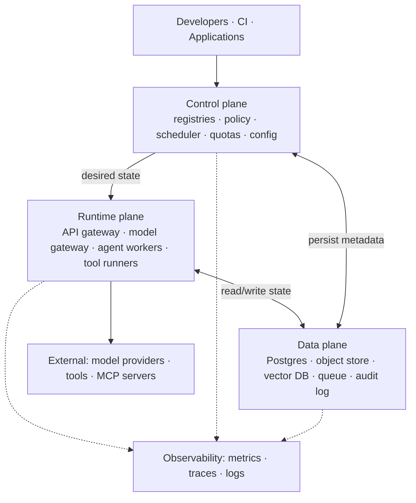

# AI Platform Architecture

> **Interview answer (say this first).** An AI platform is organised into three planes and one rule: the **control plane decides what may run**, the **data plane remembers**, and the **runtime plane does the work**. The control plane owns registries, policy, scheduling, and configuration. The data plane owns durable state — databases, object storage, vectors, logs, and audit. The runtime plane owns the actual execution — the model gateway and the agent workers. Separating them lets you scale, secure, and fail each one independently. It echoes the control-plane/data-plane split that worked for networks and cloud infrastructure, though the labels shift: in networking the data plane is the packet-forwarding path, which maps to this chapter's **runtime plane**, while this chapter's **data plane** is durable storage.

## Why this exists

An AI platform starts as one agent and one service. Then reality arrives.

The first agent calls a model directly with an API key in an environment variable. The second agent is written by another team and hard-codes a different model. The third needs a tool that the first two also need, so a fourth copy of the tool appears. Prompts live in three repositories. Nobody can say which model version produced last week's answer. Costs are split across five cloud accounts and nobody owns the total.

The problem is not any single agent. It is that there is **no shared structure**. Every concern — access, versioning, budgets, isolation, observability — is solved per agent, badly and inconsistently.

The platform must serve many teams without them breaking each other, handle artifacts that change independently, keep stateless and stateful parts separate, survive a provider outage, and stop one runaway agent from starving everyone. You cannot build that as one service, so you separate it by **what it owns** — the plane model.

> **Note:**
>
> **The one-sentence rule.** Control decides, runtime does the work, data remembers. Every component belongs to exactly one plane, and the interfaces between them are the architecture.

## Start from zero

| Word | Plain meaning |
| --- | --- |
| **Plane** | A group of components with one responsibility. Here: control, data, runtime. |
| **Control plane** | The part that decides *what may run and how*: registries, policy, scheduling, config, quotas. |
| **Data plane** | The part that *stores durable state*: databases, object storage, vector stores, logs, audit, artifacts. |
| **Runtime plane** | The part that *executes work*: agent workers, the model gateway, tool execution. Also called the data plane in some cloud products — context matters. |
| **Admission control** | The check that decides whether a requested deployment is allowed, before it runs. |
| **Scheduler** | The component that decides which worker or node runs a job. |
| **Worker** | A process that runs an agent step or a job. |
| **Gateway** | The single entry point for traffic. Here, the model gateway and the API gateway. |
| **Registry** | The catalogue of versioned artifacts the platform can run: agents, models, tools, prompts, datasets. |
| **Reconciliation** | Comparing desired state to actual state and fixing the difference. The core control-plane loop. |
| **Desired state** | What the platform *should* look like, declared as data (for example, YAML). |
| **Stateless** | Holds no local state between requests; any instance can serve any request. |
| **Stateful** | Holds durable state that must survive restarts, such as a database or a queue. |
| **Tenant** | One customer or team whose data and resources must be isolated from others. |
| **Failure domain** | The blast radius of one failure. A good design keeps it small. |
| **Blast radius** | Everything affected when a component fails. |
| **Observability** | Logs, metrics, and traces that tell you what the system did and why. |

## The core idea

Use air traffic control. The tower decides which planes may take off, where they may fly, and when they may land. The planes do the flying. The flight recorder stores what happened. Three separate jobs, three separate systems, each able to fail without immediately destroying the others.

An AI platform is that airport:

- **Control tower** — registries, policy, scheduler, quotas. It decides what may run.
- **Aircraft** — the runtime plane: model gateway and agent workers. It does the work.
- **Flight recorder and ground systems** — the data plane: databases, object storage, logs, audit. It remembers.



Read the arrows as ownership. Control writes desired state. Runtime reads it and executes. Data persists facts. Observability watches all three. External systems are reached only from the runtime plane, never from control.

The three planes compared:

| Dimension | Control plane | Runtime plane | Data plane |
| --- | --- | --- | --- |
| Job | Decide what may run | Do the work | Remember |
| Examples | Registries, policy, scheduler, quotas | Model gateway, workers, tool runners | Postgres, S3, vector DB, logs |
| State | Mostly desired state (stateless compute) | Stateless where possible | Durably stateful |
| Scales with | Number of artifacts and teams | Request and job volume | Data volume and query load |
| Failure impact | Cannot change the platform; running work continues | Requests stall or fail | Data loss or read/write unavailability |
| Security focus | Who may register and deploy | Who may call models and tools, and with what limits | Who may read or write which data |
| Change rate | Moderate, reviewed | Continuous deploys | Careful migrations |

## How it works

Follow one request from a developer to a result, and watch the planes take turns.

1. **A team registers an agent.** They push an agent manifest to the control plane. The registry stores it immutably with a digest. Nothing has run yet.
2. **Admission control checks it.** The control plane validates the manifest against policy: pinned model version, declared budget, allowed tools, required labels. Bad input is rejected now, in seconds.
3. **The control plane records desired state.** It writes the desired deployment — this agent version, this many replicas, these limits — into the data plane. This is the source of truth.
4. **The scheduler picks a home.** When work arrives (or the desired state changes), the scheduler selects a worker with capacity and writes a job or assignment. It reasons about load, tenancy, and limits.
5. **The runtime plane executes.** A worker reads the job, calls the model gateway, invokes tools through the tool or MCP registry, and produces a result. The model gateway handles routing, fallback, and provider credentials.
6. **The data plane remembers.** The worker writes state to the database, artifacts to object storage, and events to the audit log. Nothing important lives only in the worker's memory.
7. **Observability records the whole path.** Every hop carries a trace ID, so one query shows the agent version, model version, prompt version, tools, latency, and cost.
8. **Quotas are enforced where the work happens.** The model gateway checks the token budget before calling a provider, so a runaway agent is stopped at the runtime boundary, not after the invoice.
9. **Reconciliation keeps reality matching intent.** A control-plane loop compares desired state to actual state and fixes drift: crashed workers are replaced, deleted agents are cleaned up.
10. **Retries and failure stay inside a domain.** A provider outage trips the model gateway's fallback. One tenant's runaway agent is throttled. A data-plane replica fails over. Each failure is contained.

Notice that the control plane never serves user traffic, and the runtime plane never enforces registration policy. That is the split that makes the system testable.

### Responsibility boundaries

What the AI platform *does* own, and what it does not:

| The platform owns | The team owns |
| --- | --- |
| Model access, routing, and provider credentials | Which model is right for the task |
| Registries and version pinning | What the agent does |
| Budget enforcement and quotas | Staying within the budget |
| Isolation and access control | Correct use of shared data |
| Runtime scheduling and scaling | Agent-level reliability logic |
| Observability plumbing and audit | Interpreting traces and fixing quality |
| Deployment and rollback mechanics | Choosing when to deploy |

The boundary is simple: the platform owns **how work runs safely and repeatably**; the team owns **what the work does**. If the platform starts deciding business logic, it becomes a bottleneck. If the team starts managing credentials, you have lost control.

## The syntax you will use

These are representative production forms. The exact API depends on your stack; the shape is stable.

**An agent manifest: desired state for the control plane.** This is what gets registered and admitted.

```yaml
apiVersion: platform.example.com/v1
kind: Agent
metadata:
  name: claims-agent
  team: claims
spec:
  version: 1.4.0
  image: ghcr.io/acme/claims-agent@sha256:9f2c...   # immutable, pinned
  model:
    name: gpt-4o-mini
    version: 2024-07-18                             # pinned, never "latest"
  prompt: support-answer@7
  tools: [search_docs, create_ticket]
  replicas: 3
  budget_usd_per_month: 500
```

Every field is data the control plane can validate. If it is not declared, the platform cannot govern it.

**An API gateway route: the runtime entry point.**

```yaml
routes:
  - path: /v1/agents/claims-agent/invoke
    method: POST
    upstream: claims-agent-svc
    auth: jwt
    rate_limit:
      requests_per_minute: 600
      per: tenant
    timeout_seconds: 60
```

The gateway owns auth, rate limits, and timeouts. The worker owns the logic.

**A model gateway route with fallback: keeping a provider outage small.**

```python
MODEL_ROUTES = {
    "gpt-4o-mini": ["azure-openai", "openai", "bedrock"],   # try in order
    "claude-sonnet": ["bedrock", "anthropic"],
}

def choose_providers(model: str) -> list[str]:
    return MODEL_ROUTES.get(model, [])
```

Fallback is a runtime concern. It should not require a redeploy of the agent.

**A scheduler policy: who runs where.**

```yaml
scheduler:
  strategy: least-loaded          # spread work across workers
  constraints:
    - tenant_isolation             # never co-locate two tenants on one worker
    - max_concurrent_jobs: 8       # per worker, protects the model quota
  priority_classes:
    - name: interactive
      weight: 10
    - name: batch
      weight: 1
```

Constraints encode safety; weights encode fairness. Both are control-plane data.

**A worker deployment: the runtime plane, stateless and replaceable.**

```yaml
apiVersion: apps/v1
kind: Deployment
metadata:
  name: agent-worker
spec:
  replicas: 6
  selector:
    matchLabels:
      app: agent-worker
  template:
    metadata:
      labels:
        app: agent-worker
    spec:
      containers:
        - name: worker
          resources:
            requests: {cpu: "500m", memory: "1Gi"}
            limits: {cpu: "2", memory: "4Gi"}
```

The worker keeps no durable state, so it can be killed and replaced at any time.

**An observability span: linking every plane.**

```python
span = {
    "trace_id": "t-9f2c",
    "tenant": "claims",
    "agent": "claims-agent@1.4.0",
    "model": "gpt-4o-mini@2024-07-18",
    "prompt": "support-answer@7",
    "cost_usd": 0.0027,
    "latency_ms": 840,
    "status": "ok",
}
```

One span answers "which version answered this request?" — the question every AI platform must be able to answer.

## Examples: simple to real

**Example 1 — assign every component to one plane.** The first architecture exercise is a table, not a diagram.

```python
COMPONENTS = {
    "api-gateway": "runtime",
    "agent-registry": "control",
    "model-registry": "control",
    "prompt-registry": "control",
    "policy-engine": "control",
    "scheduler": "control",
    "quota-manager": "control",
    "agent-worker": "runtime",
    "model-gateway": "runtime",
    "tool-runner": "runtime",
    "postgres": "data",
    "object-store": "data",
    "vector-db": "data",
    "audit-log": "data",
    "message-queue": "data",
}

def in_plane(plane: str) -> list[str]:
    return sorted(name for name, p in COMPONENTS.items() if p == plane)

print("control:", in_plane("control"))
print("runtime:", in_plane("runtime"))
print("data:", in_plane("data"))
# control: ['agent-registry', 'model-registry', 'policy-engine', 'prompt-registry',
#           'quota-manager', 'scheduler']
# runtime: ['agent-worker', 'api-gateway', 'model-gateway', 'tool-runner']
# data: ['audit-log', 'message-queue', 'object-store', 'postgres', 'vector-db']
```

If a component does not fit one bucket cleanly, that is the signal to split it.

**Example 2 — admission control rejects unsafe desired state.** The control plane accepts or refuses before anything runs.

```python
def admit(agent: dict) -> list[str]:
    """Validate an agent manifest. Empty list means admitted."""
    errors: list[str] = []
    model = agent.get("model", {})
    if "version" not in model:
        errors.append("model.version is required; pin it")
    if "version" not in agent:
        errors.append("agent.version is required")
    if agent.get("replicas", 0) < 1:
        errors.append("at least one replica is required")
    if "budget_usd_per_month" not in agent:
        errors.append("budget_usd_per_month is required")
    return errors

good = {"version": "1.4.0", "replicas": 3, "budget_usd_per_month": 500,
        "model": {"name": "gpt-4o-mini", "version": "2024-07-18"}}
bad = {"version": "1.4.0", "replicas": 0,
       "model": {"name": "gpt-4o-mini"}}

print(admit(good))   # []
print(admit(bad))
# ['model.version is required; pin it', 'at least one replica is required',
#  'budget_usd_per_month is required']
```

The rule: reject in the control plane, not in a pager alert at 3 a.m.

**Example 3 — the scheduler picks the least-loaded worker.** Decisions live in the control plane; execution lives in workers.

```python
def schedule(workers: dict[str, int], job: str) -> tuple[str, dict[str, int]]:
    """Assign the job to the worker with the fewest running jobs."""
    target = min(workers, key=lambda w: workers[w])
    workers[target] += 1
    return target, workers

workers = {"w1": 2, "w2": 5, "w3": 1}
print(schedule(workers, "job-a"))   # ('w3', {'w1': 2, 'w2': 5, 'w3': 2})
print(schedule(workers, "job-b"))   # ('w1', {'w1': 3, 'w2': 5, 'w3': 2})
```

Real schedulers add constraints, priorities, and tenancy, but the core is a decision over data.

**Example 4 — stateless control-plane instances share state through the data plane.** Add instances freely; no request is pinned to one.

```python
class SharedStore:
    """Stand-in for the data plane."""
    def __init__(self) -> None:
        self.desired: dict[str, str] = {}


class ControlInstance:
    def __init__(self, store: SharedStore) -> None:
        self.store = store

    def apply(self, agent: str, version: str) -> str:
        self.store.desired[agent] = version
        return f"{agent} -> {version}"

    def read(self, agent: str) -> str:
        return self.store.desired[agent]


store = SharedStore()
cp_a, cp_b = ControlInstance(store), ControlInstance(store)

print(cp_a.apply("claims-agent", "1.4.0"))   # claims-agent -> 1.4.0
print(cp_b.read("claims-agent"))             # 1.4.0  (any instance can answer)
print(cp_b.apply("claims-agent", "1.5.0"))   # claims-agent -> 1.5.0
print(cp_a.read("claims-agent"))             # 1.5.0
```

This is why the control plane can sit behind a plain load balancer with no sticky sessions.

**Example 5 — one trace across all three planes.** The audit trail is the point of the architecture.

```python
PLANES = {
    "admit": "control",
    "schedule": "control",
    "call-model": "runtime",
    "call-tool": "runtime",
    "persist-result": "data",
    "write-audit": "data",
}

def trace(trace_id: str, steps: list[str]) -> list[str]:
    return [f"{trace_id} {step} [{PLANES[step]}]" for step in steps]

for line in trace("t-9f2c", ["admit", "schedule", "call-model",
                             "call-tool", "persist-result", "write-audit"]):
    print(line)
# t-9f2c admit [control]
# t-9f2c schedule [control]
# t-9f2c call-model [runtime]
# t-9f2c call-tool [runtime]
# t-9f2c persist-result [data]
# t-9f2c write-audit [data]
```

When something goes wrong, the trace tells you which plane and which version was involved.

## In production

- **Keep the control plane off the request path.** If control goes down, running agents should keep serving. Coupling them means every control-plane deploy risks user traffic.
- **Make the runtime plane stateless wherever possible.** Stateless workers can be killed, scaled, and replaced freely. Anything stateful needs a durable home in the data plane.
- **Put credentials only in the runtime plane's reach.** Teams should never hold raw provider keys. The model gateway brokers access and logs it.
- **Enforce quotas at the runtime boundary.** Budget checks belong where tokens are consumed, so a runaway agent stops mid-run instead of after the invoice.
- **Design explicit failure domains.** Provider, tenant, worker, and data-plane failures should each be contained. Write down the blast radius of each component.
- **Do not let one tenant affect another.** Isolation is a first-class constraint in the scheduler and the gateway, not an afterthought.
- **Reconcile continuously.** Desired state drifts: pods crash, jobs linger, registrations go stale. A loop that compares intent to reality is what keeps the platform true.
- **The data plane is the hardest part to migrate.** Schema changes and storage moves are slow and risky. Choose its technology deliberately and version its interfaces.
- **Control-plane changes need review and rollout discipline.** A bad policy can block every deploy. Treat policy like code, with tests and canaries.
- **Observe across planes with one correlation ID.** Without it, debugging a slow agent means joining logs from three systems by timestamp, which never works.
- **Expect partial failure to be normal.** Model providers time out, queues back up, replicas lag. The runtime plane must degrade, not collapse.
- **Model the platform as a dependency with an SLO.** Product teams need to know whether they can rely on it, and the platform team needs an error budget to spend.

## Interview questions

### 1. What are the control plane, data plane, and runtime plane?

**Answer.** The control plane decides what may run and how: registries, policy, scheduling, quotas, and configuration. The runtime plane does the work: the API gateway, model gateway, agent workers, and tool runners. The data plane remembers: databases, object storage, vector stores, queues, logs, and audit. The split exists so each concern can scale, be secured, and fail independently.

**Follow-up: "Why not one service that does all three?"** Because their scaling and failure profiles differ. Control changes rarely and must be safe; runtime scales with traffic; data must be durable. One service couples all three and makes every change risky.

**Trap.** Calling the runtime plane "the data plane" without context. Cloud vendors sometimes use "data plane" to mean the runtime path. Define your terms explicitly in an interview.

### 2. Where does the AI platform's responsibility end?

**Answer.** The platform owns *how work runs safely and repeatably*: model access, registries, version pinning, budgets, isolation, scheduling, observability, and rollback mechanics. The product team owns *what the work does*: agent logic, prompt quality, model choice, and staying within budget. If the platform starts making business decisions it becomes a bottleneck; if teams manage credentials, control is lost.

**Follow-up: "Who owns an agent's quality?"** The team. The platform supplies evaluation tooling and the audit trail, but quality is a product decision, not a platform guarantee.

**Trap.** Saying the platform should restrict which model each agent uses. The platform should *enable the choice safely*, not make it.

### 3. How does the platform serve many teams without becoming a bottleneck?

**Answer.** Self-service interfaces plus isolation plus quotas. Teams register and deploy through an API, not a ticket. Tenants are isolated by namespace, identity, and network policy. Shared capacity is protected by per-tenant quotas and scheduler constraints. The platform team maintains the road; it does not drive every car.

**Follow-up: "What stops one team from consuming everything?"** Per-tenant quotas at the model gateway, priority classes in the scheduler, and budget enforcement. Fairness has to be designed, not hoped for.

**Trap.** Relying on goodwill. Without hard quotas and isolation, one noisy team degrades everyone and the platform gets blamed.

### 4. What are the typical components of an AI platform?

**Answer.** A gateway tier (API gateway and model gateway), registries (agents, models, tools, MCP, prompts, evaluations, datasets), a policy and quota engine, a scheduler, a worker pool, a tool runtime, and a data tier (relational store, object store, vector store, queue), all tied together by observability and audit.

**Follow-up: "Which are control and which are runtime?"** Registries, policy, scheduler, and quotas are control. Gateways, workers, and tool runners are runtime. The stores and queues are data.

**Trap.** Listing tools without saying what they own. A component list is not an architecture; ownership is.

### 5. Why keep the control plane stateless, and the data plane stateful?

**Answer.** Control-plane instances hold only transient request state and read desired state from the data plane, so they scale horizontally behind a load balancer with no sticky sessions. Durable state must live in the data plane, where it can be replicated, backed up, and versioned. Mixing durable state into the control plane makes it fragile and hard to scale.

**Follow-up: "Where do you cache then?"** In the runtime and control compute, with short TTLs and invalidation. Caches are not sources of truth; the data plane is.

**Trap.** Keeping a "current deployment" map in a control-plane process's memory. Any restart or second instance loses it or disagrees with the others.

### 6. What is a failure domain, and how do you design for one?

**Answer.** A failure domain is the set of things affected when a component fails — its blast radius. You design by isolating: separate provider accounts or regions, per-tenant namespaces, bulkheads around worker pools, and fallback routes in the model gateway. Then you decide, per component, what should happen when it fails: degrade, queue, or reject.

**Follow-up: "What is the riskiest shared component?"** Usually the data plane or the model gateway, because everything depends on it. Those deserve the strongest isolation and the most careful capacity planning.

**Trap.** Assuming a shared database is safe because it is managed. A managed database is still a single logical failure domain unless you design replication and failover.

### 7. Walk through a request from registration to result.

**Answer.** A team registers an agent manifest; admission control validates policy; the control plane writes desired state to the data plane; the scheduler assigns work to a worker with capacity; the worker calls the model gateway and tools; the data plane persists results and audit; observability records one trace covering agent, model, and prompt versions. Reconciliation continuously keeps actual state matching desired state.

**Follow-up: "Where does the model gateway sit?"** In the runtime plane, between the worker and external providers. It owns routing, fallback, credentials, and quota checks.

**Trap.** Putting policy enforcement in the worker. Policy belongs in control and at the gateway boundary, not scattered through agent code.

### 8. Why separate the model gateway from the agent runtime?

**Answer.** The gateway centralises what every agent needs and no agent should own: provider credentials, routing, fallback, retries, rate limits, and token accounting. Separating it means one place to add a provider, one place to enforce budgets, and one place to see all model traffic. The agent runtime stays focused on agent logic.

**Follow-up: "What does the gateway give up?"** It is on the hot path, so it must be fast and highly available, and it becomes a shared failure domain. That is why it is replicated and why fallback logic lives inside it.

**Trap.** Letting agents call providers directly "just for now." Every direct call is a credential leak, an unaccounted cost, and a blind spot.

## Remember this

- **Control decides, runtime does the work, data remembers.** Assign every component to exactly one plane.
- **Keep the control plane off the user request path**, so control-plane problems do not become outages.
- **Runtime is stateless where possible; durable state belongs in the data plane.**
- **Contain failure to small domains** — per provider, per tenant, per worker pool — and write down each blast radius.
- **One trace ID across all three planes** is how you answer "which version answered this request?"
