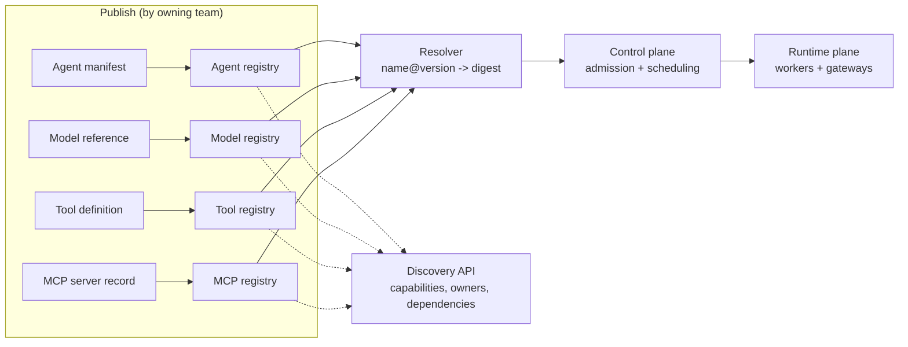

# Registries: Agents, Models, Tools, and MCP

> **Interview answer (say this first).** A registry is a versioned, queryable catalogue of the artifacts a platform can run, and it is the platform's **source of truth**. Agents, models, tools, and MCP servers each get a registry entry with metadata, a version, and a content digest. The registry answers three questions: *what exists*, *what can it do*, and *who may use it*. It enables discovery at build time and runtime, promotion across environments, and pinning by immutable digest so a deployment always refers to one exact artifact. Without a registry, the platform cannot govern what it runs.

## Why this exists

Imagine a platform with fifty agents. A developer wants to reuse the "search the support docs" capability. Where does it live? In one team's repository, perhaps. Is it up to date? Unknown. Which version does the platform approve? Nobody wrote it down. Can the payments team use it? No one knows. The capability exists, but it is **undiscoverable**.

Now add change. A model provider deprecates a version. Which agents use it? Grep across fifty repositories. A tool has a security bug. Which agents call it? Grep again, and hope the names match. An auditor asks what a specific answer used. Nobody can reconstruct it.

The root cause is that the platform has artifacts but no **catalogue**. Everything runs, but nothing is known centrally and nothing is traceable.

Registries fix this by making each artifact a first-class, named, versioned, and immutable thing. Once artifacts are registered, you can discover them, pin them, promote them, audit them, and control access to them.

For AI this matters even more than for ordinary services, because AI behavior comes from a chain of artifacts: an agent uses a prompt, which is evaluated on a dataset, and calls a model and tools. If any link is unregistered, the chain cannot be reproduced.

> **Note:**
>
> **The one-sentence purpose.** A registry is the platform's source of truth: it names, versions, describes, and controls every artifact the platform is allowed to run.

## Start from zero

| Word | Plain meaning |
| --- | --- |
| **Registry** | A catalogue of versioned artifacts with metadata, plus the API and storage behind it. |
| **Artifact** | One thing the platform can run or use: an agent, a model reference, a tool, an MCP server, a prompt, an evaluation, a dataset. |
| **Entry** | One record in the registry, usually `name` plus `version`. |
| **Version** | A label for one artifact state, ideally immutable once published, such as `1.4.0`. |
| **Digest** | A content hash of the artifact, such as `sha256:...`. Two identical artifacts share a digest; any change changes it. |
| **Immutable** | Once published, the artifact at that version or digest cannot change. Corrections get a new version. |
| **Tag** | A human-friendly pointer to a digest, such as `latest` or `stable`. Tags can move; digests cannot. |
| **Mutable tag** | A tag that can be reassigned, like `latest`. Convenient for humans, dangerous for deployments. |
| **Promotion** | Moving a specific immutable artifact through environments, for example staging to production. The artifact does not change; the environment pointer does. |
| **Environment** | An isolated place to run artifacts: development, staging, production. |
| **Capability discovery** | Asking the registry "what can this artifact do?" — for example, which tools an agent needs or which MCP servers expose a capability. |
| **Metadata** | Descriptive data about an artifact: owner, team, description, inputs, outputs, dependencies, model, tags. |
| **Provenance** | Where an artifact came from: source commit, build, author, and time. |
| **Access control** | Rules about who may read, publish, promote, or delete entries in a registry. |
| **Source of truth** | The system whose record is authoritative. If the registry and a wiki disagree, the registry wins. |
| **Drift** | Reality diverging from what the registry or desired state says. |
| **MCP registry** | A registry specifically for MCP servers, describing where to connect and what capabilities they expose. |
| **OCI** | Open Container Initiative. A standard for packaging and content-addressing artifacts, commonly used for container images and reusable for other artifacts. |

## The core idea

Think of a public library. A book is not "some papers on a shelf." It has a catalogue record: title, author, edition, subject, shelf location, and availability. The catalogue lets you find it, reference one exact edition, and know who wrote it. A library without a catalogue is a warehouse.

A registry is the catalogue. Each artifact is a book. The **digest** is the edition's exact identity: two printings with different content are different books with different records. The **tag** is a sticky note a librarian might move around; the edition itself never changes.

The second half of the analogy is **access control**. Some books are reference-only; some are behind the desk; some anyone can borrow. Registries have the same per-collection rules: a team can read the model registry but only the platform team can publish to it.



Publish on the left, resolve in the middle, consume on the right. Discovery is the cross-cutting query surface.

How the four registries differ:

| Registry | What it stores | Key metadata | Who publishes |
| --- | --- | --- | --- |
| **Agent registry** | Agent versions and their composition | Image digest, model pin, prompt pin, tools, budget, owner | Product teams |
| **Model registry** | Approved model references and provider info | Provider, model id, pinned version, context window, cost, region | Platform / AI governance |
| **Tool registry** | Tool definitions and implementations | Name, JSON Schema, side effects, auth scopes, endpoint | Tool owners |
| **MCP registry** | MCP servers and their capabilities | Endpoint or package, transport, tools/resources, auth, trust tier | MCP server authors |

They share one contract: name, version, digest, metadata, and access policy. That shared contract is what lets a resolver and a policy engine treat them uniformly.

## How it works

Walk an artifact from author to running deployment.

1. **The author publishes.** A team pushes an artifact with a name, a version, and metadata. The registry computes a digest over the content and stores the record immutably.
2. **The registry validates.** It checks that the name is unique, the version does not already exist with different content, required metadata is present, and the publisher has permission.
3. **Dependencies are pinned.** An agent entry pins its model, prompt, and tools by exact version or digest. The registry stores those references, not loose names.
4. **Environments are assigned.** Promotion moves the *same* digest through dev, staging, and production. Each environment holds a pointer to a digest, with an approval record.
5. **Consumers discover.** A developer or a runtime queries the registry: "which agents exist?", "what can this agent do?", "which tools are approved for production?"
6. **The resolver turns a reference into an identity.** `claims-agent@1.4.0` resolves to one digest. The platform uses the digest from then on.
7. **Admission uses the registry.** Policy checks that the referenced artifacts exist, are approved for the target environment, and are not deprecated.
8. **The runtime pulls and verifies.** A worker fetches the artifact, verifies the digest matches, and runs it. If the digest does not match, the run is refused.
9. **Audit records the digests.** Every run logs the exact agent, model, prompt, tool, and MCP versions used, so any result can be traced back.
10. **Deprecation is a registry event.** When a model or tool version is retired, the registry marks it and consumers can query "what is affected?" instead of grepping.

### Promotion and environments

Promotion is the disciplined part. The wrong way is to rebuild for each environment; then staging validated a different artifact than production runs. The right way is build once, promote the same digest:

```text
build  -> digest sha256:9f2c...  (one immutable artifact)
dev    -> points at sha256:9f2c...
staging-> points at sha256:9f2c...  after tests pass
prod   -> points at sha256:9f2c...  after approval
```

The registry stores the environment pointers and the approvals. Rollback is just repointing production at the previous digest.

### Immutability and digests

Immutability is what makes everything else trustworthy. If version `1.4.0` could change, then "we ran 1.4.0 in staging" proves nothing about production. Content addressing enforces it: the digest is computed from the bytes, so any change is a different artifact by construction.

## The syntax you will use

**An agent registry entry.** The entry points at immutable artifacts; it does not inline them.

```yaml
name: claims-agent
version: 1.4.0
digest: sha256:9f2c1a...
owner: team-claims
description: Answers claims questions using support docs.
image: ghcr.io/acme/claims-agent@sha256:9f2c1a...
model: gpt-4o-mini@2024-07-18
prompt: support-answer@7
tools:
  - search_docs@1.2.0
  - create_ticket@2.0.1
environments:
  staging: approved
  production: approved
provenance:
  commit: 4b1e9d3
  built_by: github-actions
  built_at: 2026-08-14T09:12:00Z
```

Every dependency is pinned. An unpinned agent cannot be reproduced.

**A model registry entry.** The platform's approved list, not the provider's whole catalogue.

```json
{
  "name": "gpt-4o-mini",
  "version": "2024-07-18",
  "provider": "azure-openai",
  "regions": ["eastus", "westus"],
  "context_window": 128000,
  "input_cost_per_1k_usd": 0.00015,
  "output_cost_per_1k_usd": 0.0006,
  "status": "approved"
}
```

Note what is stored: enough to route, budget, and govern — not the model weights.

**A tool registry entry.** The contract the model sees, plus operational metadata.

```json
{
  "name": "search_docs",
  "version": "1.2.0",
  "digest": "sha256:ab12cd...",
  "input_schema": {
    "type": "object",
    "properties": {"query": {"type": "string"}},
    "required": ["query"]
  },
  "side_effects": false,
  "auth_scopes": ["docs:read"],
  "endpoint": "https://tools.internal/search_docs"
}
```

`side_effects` and `auth_scopes` let policy reason about risk before an agent may use it.

**An MCP registry entry.** Where to connect and what the server exposes.

```yaml
name: github-mcp
version: 1.0.0
transport: streamable-http
endpoint: https://mcp.example.com/github
trust_tier: internal
capabilities:
  - tools
  - resources
methods:
  - tools/list
  - tools/call
  - resources/read
auth:
  type: oauth2
  scopes: [repo:read]
```

The registry records the trusted endpoint; the platform does not let agents connect to arbitrary URLs. `capabilities` names the artifact classes the server offers (`tools`, `resources`, `prompts`); `methods` lists the JSON-RPC calls the host may make against them.

**A content digest in Python.** Canonical serialisation then hashing. This is how immutability is enforced.

```python
import hashlib
import json

def digest(spec: dict) -> str:
    canonical = json.dumps(spec, sort_keys=True, separators=(",", ":")).encode()
    return "sha256:" + hashlib.sha256(canonical).hexdigest()
```

Key-order-independent and change-sensitive. That is the whole property.

**A resolution call.** Name plus version in, immutable digest out.

```http
GET /v1/registries/agents/claims-agent/versions/1.4.0 HTTP/1.1
Authorization: Bearer <platform-token>

200 OK
{"name": "claims-agent", "version": "1.4.0", "digest": "sha256:9f2c1a...", "status": "approved"}
```

Consumers should resolve once and pin the digest for the rest of the deployment.

## Examples: simple to real

**Example 1 — a digest is content-addressed and order-independent.** Same content, same digest; any change, a new digest.

```python
import hashlib
import json

def digest(spec: dict) -> str:
    canonical = json.dumps(spec, sort_keys=True, separators=(",", ":")).encode()
    return "sha256:" + hashlib.sha256(canonical).hexdigest()

a = {"name": "claims-agent", "version": "1.4.0", "tools": ["search_docs"]}
b = {"tools": ["search_docs"], "version": "1.4.0", "name": "claims-agent"}
c = {"name": "claims-agent", "version": "1.4.0",
     "tools": ["search_docs", "create_ticket"]}

print(digest(a) == digest(b))   # True  (key order does not matter)
print(digest(a) == digest(c))   # False (content changed)
print(digest(a)[:24])           # sha256:6c0057979e63a44f6  (first 24 chars)
```

Two teams can independently compute the same digest and prove they mean the same artifact.

**Example 2 — an immutable registry with exact-version lookup.** Publishing a version twice with different content must fail.

```python
class RegistryError(Exception):
    pass


class Registry:
    def __init__(self) -> None:
        self.entries: dict[str, dict[str, dict]] = {}

    def publish(self, name: str, version: str, spec: dict) -> None:
        versions = self.entries.setdefault(name, {})
        if version in versions and versions[version] != spec:
            raise RegistryError(
                f"{name}@{version} already exists with different content; use a new version"
            )
        versions[version] = dict(spec)

    def get(self, name: str, version: str) -> dict:
        return self.entries[name][version]


reg = Registry()
reg.publish("claims-agent", "1.4.0", {"model": "gpt-4o-mini", "prompt": "support-answer@7"})
reg.publish("claims-agent", "1.4.0", {"model": "gpt-4o-mini", "prompt": "support-answer@7"})
print(reg.get("claims-agent", "1.4.0"))
# {'model': 'gpt-4o-mini', 'prompt': 'support-answer@7'}

try:
    reg.publish("claims-agent", "1.4.0", {"model": "gpt-4o", "prompt": "support-answer@7"})
except RegistryError as exc:
    print("rejected:", exc)
# rejected: claims-agent@1.4.0 already exists with different content; use a new version
```

This one rule is what makes "we ran 1.4.0" a meaningful statement.

**Example 3 — promotion moves one digest across environments, with approval.** Rebuilds are forbidden; pointers move.

```python
def promote(envs: dict[str, dict], name: str, version: str, digest: str,
            frm: str, to: str, approved_by: str) -> dict[str, dict]:
    if envs.get(frm, {}).get(name) != digest:
        raise ValueError(f"{name}@{version} is not the artifact in {frm}")
    envs.setdefault(to, {})[name] = digest
    return {"environments": envs, "approval": {"by": approved_by, "action": f"promote {frm}->{to}"}}


state = {"environments": {"staging": {"claims-agent": "sha256:9f2c"}}}
result = promote(state["environments"], "claims-agent", "1.4.0",
                 "sha256:9f2c", "staging", "production", "release-manager")
print(result["environments"])
# {'staging': {'claims-agent': 'sha256:9f2c'}, 'production': {'claims-agent': 'sha256:9f2c'}}
print(result["approval"])
# {'by': 'release-manager', 'action': 'promote staging->production'}
```

Staging and production now point at the **same** digest. That is what makes staging meaningful.

**Example 4 — capability discovery across registries.** Who can use a tool, and which agents need it?

```python
AGENTS = {
    "claims-agent": {"tools": ["search_docs", "create_ticket"]},
    "reply-agent": {"tools": ["search_docs"]},
    "billing-agent": {"tools": ["lookup_invoice"]},
}

def agents_using(tool: str) -> list[str]:
    return sorted(name for name, spec in AGENTS.items() if tool in spec["tools"])

def tools_of(agent: str) -> list[str]:
    return sorted(AGENTS[agent]["tools"])

print(agents_using("search_docs"))   # ['claims-agent', 'reply-agent']
print(tools_of("claims-agent"))      # ['create_ticket', 'search_docs']
print(agents_using("deprecated_tool"))  # []
```

When a tool is deprecated, this query tells you the blast radius immediately.

**Example 5 — per-registry access control.** Read and publish rights differ by registry and role.

```python
RBAC = {
    "agent-registry": {
        "team-claims": {"read", "publish"},
        "team-payments": {"read"},
    },
    "model-registry": {
        "team-claims": {"read"},
        "ai-governance": {"read", "publish", "deprecate"},
    },
}

def allowed(actor: str, registry: str, action: str) -> bool:
    return action in RBAC.get(registry, {}).get(actor, set())

print(allowed("team-claims", "agent-registry", "publish"))   # True
print(allowed("team-claims", "model-registry", "publish"))  # False
print(allowed("team-claims", "model-registry", "read"))     # True
print(allowed("ai-governance", "model-registry", "deprecate"))  # True
```

The model registry is a governed list; product teams consume it, they do not edit it.

## In production

- **Pin by digest in production, even when you talk in versions.** A tag can move; a digest cannot. This is the single most effective defense against "we deployed the approved version" turning out false.
- **Never rebuild for an environment.** Build once and promote the same digest. Rebuilding means the artifact you tested is not the artifact you shipped.
- **Make versions immutable.** Allow only additive changes; a correction is a new version. Mutable versions make audits meaningless.
- **Store enough metadata to be useful.** Owner, team, description, dependencies, and provenance. A registry of names without owners becomes a list nobody trusts.
- **Govern the model registry centrally.** It should list approved models, versions, regions, and costs. Teams consuming it is fine; teams editing it is a governance hole.
- **Resolve dependencies, do not inline them.** An agent pins `prompt@7`; the prompt registry holds the content. Copying the prompt into the agent removes it from the audit chain.
- **Deprecate, do not silently delete.** Mark entries deprecated with a sunset date and a replacement. Consumers can query the impact before the break.
- **Treat MCP servers as supply-chain dependencies.** You are trusting remote code and descriptions. Record trust tier, endpoint, auth, and capabilities; allowlist what agents may connect to.
- **Scope access per registry.** Publishing to the model registry is a governance action, not a team action. Separate read, publish, promote, and deprecate rights.
- **Cache discovery, but verify at use.** A resolver cache speeds things up; the digest check at pull time is the correctness guarantee. Cache failures must not become trust failures.
- **The registry is the source of truth, so make it authoritative.** Any other system that disagrees is wrong by definition, and drift checks should flag it.
- **Registry outages are control-plane outages.** Do not put the registry on the request path. Running agents should continue if the registry is briefly unavailable; only new deploys should block.

## Interview questions

### 1. What is a registry and why does a platform need one?

**Answer.** A registry is a versioned, queryable catalogue of the artifacts the platform may run, with metadata and access control. It provides discovery (what exists and what it can do), governance (what is approved), reproducibility (pinning exact versions and digests), promotion (moving one artifact across environments), and audit (which artifact produced a result). Without it, artifacts exist but are undiscoverable and untraceable.

**Follow-up: "Could a Git repository be the registry?"** Git is a fine storage backend, but a registry adds structured metadata, discovery APIs, access control, immutability guarantees, and promotion state. A repo of YAML files without those is a convention, not a registry.

**Trap.** Confusing a registry with a package repository. A package repository stores bytes; a registry also governs approval, promotion, capabilities, and access.

### 2. What is the difference between the agent, model, tool, and MCP registries?

**Answer.** Each records a different artifact type. The agent registry stores deployable agents and their composition (image, model, prompt, tools). The model registry stores approved model references, providers, regions, and costs. The tool registry stores tool definitions, schemas, side effects, and auth scopes. The MCP registry stores MCP server endpoints, transports, capabilities, and trust tiers. They share a common contract — name, version, digest, metadata, access — but each has domain-specific fields.

**Follow-up: "Why separate them instead of one big registry?"** Different owners, lifecycles, and access rules. The model registry is governed centrally; the agent registry is populated by product teams; MCP servers are external supply-chain dependencies. One store would blur those boundaries.

**Trap.** Putting model weights in the model registry. It stores references and metadata; the weights live with the provider or in a model store.

### 3. How does capability discovery work?

**Answer.** Registry entries declare capabilities as structured metadata: tools an agent uses, scopes a tool needs, or methods an MCP server exposes. A discovery API answers queries like "which agents use this tool?", "what can this agent do?", or "which MCP servers expose a search capability?" This turns grep-and-hope into a query, which matters for impact analysis, reuse, and policy.

**Follow-up: "How is this different from MCP discovery?"** MCP discovery is runtime: a host asks a connected server what tools it offers. Registry discovery is design-time and governance-time: what exists, who owns it, and what is approved. They complement each other.

**Trap.** Treating discovery as documentation. If the metadata drives policy and impact analysis, it must be structured and complete, not prose.

### 4. How should promotion across environments work?

**Answer.** Build one immutable artifact with a digest, then promote that same digest from development to staging to production, recording approvals at each step. The artifact never changes; only environment pointers move. Rollback repoints production at the previous digest. Rebuilding per environment invalidates the testing you did.

**Follow-up: "What must be true before promotion?"** The artifact passed tests and evaluations, dependencies are pinned, policy admits it, and the target environment's approver signed off. The registry records all of that.

**Trap.** Promoting a tag like `latest`. You may promote a different artifact than the one you validated. Promote digests.

### 5. Why immutability and content digests?

**Answer.** A digest is computed from the artifact's content, so any change produces a different digest. That makes a version a fixed identity: "we ran 1.4.0" is verifiable, staging and production can be compared, and a tampered artifact is detected at pull time. Immutability is the property that makes promotion, audit, and rollback trustworthy.

**Follow-up: "What if we need to fix a typo in the metadata?"** Publish a new version. The old one stays for history. Metadata changes can be allowed in a separate mutable layer, but the runnable content must stay immutable.

**Trap.** Assuming a version tag is enough. Tags move; digests do not. Always verify the digest at use.

### 6. How do you control access per registry?

**Answer.** Role-based rules per registry and per action: read, publish, promote, deprecate, delete. Product teams typically read the model registry and read/publish their own agents, while a platform or governance group publishes and deprecates models. Access is checked at publish, at promotion, and at runtime when the platform resolves what an agent may use.

**Follow-up: "Who can delete?"** Almost nobody. Prefer deprecation with a sunset date. Deletion breaks history and audits; if you must delete, do it through a controlled, logged process.

**Trap.** Giving one broad "admin" role. A single registry admin means one compromised account can rewrite the platform's source of truth.

### 7. How do you make the registry the source of truth and prevent drift?

**Answer.** Make the registry authoritative by policy: if anything disagrees with it, the registry wins. Deploy only resolved digests from it, and run continuous drift checks comparing registered desired state with what is actually running. Anything running but unregistered, or registered but running a different digest, is a finding. Reconciliation then either fixes it or blocks it.

**Follow-up: "What about an emergency hotfix?"** It goes through the same registry, possibly with a fast-track approval. An unregistered hotfix is exactly the drift you are trying to eliminate.

**Trap.** Keeping a parallel spreadsheet or wiki as "the real list." Two sources of truth means no source of truth.

### 8. How do registries relate to MCP?

**Answer.** The MCP registry stores MCP servers as governed dependencies: endpoint or package, transport, capabilities, auth, and trust tier. It lets the platform allowlist which servers agents may connect to and reason about their tools. At runtime, the host still uses MCP discovery to list a connected server's tools; the registry governs *which* servers are permitted and records that they were used for audit.

**Follow-up: "Why not let agents connect to any MCP server?"** Supply-chain risk. Remote servers execute or describe actions, so unvetted servers can exfiltrate data or mislead the model. The registry is the allowlist and the audit record.

**Trap.** Assuming MCP registry entries make a server safe. They make it *known*; safety comes from vetting, scopes, and sandboxing on top.

## Remember this

- **A registry is the platform's source of truth**: name, version, digest, metadata, access, and environment pointers.
- **Tags move; digests do not.** Pin production by digest and verify at pull time.
- **Promote the same immutable artifact; never rebuild per environment.**
- **Discovery is a query, not a wiki.** Structured capabilities drive reuse, policy, and impact analysis.
- **Govern the model and MCP registries like a supply chain**, and scope access per registry and per action.
