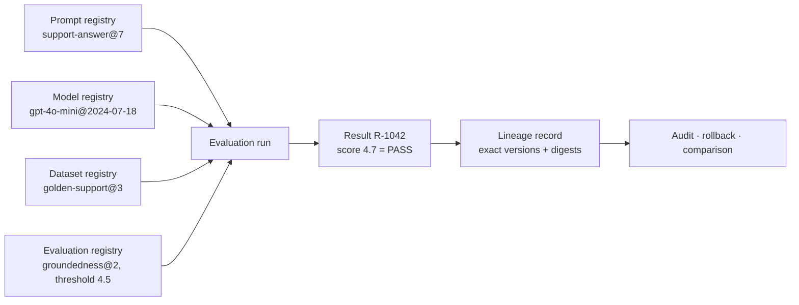

# Registries: Prompts, Evaluations, and Datasets

> **Interview answer (say this first).** Prompts, evaluations, and datasets are the artifacts that define an AI system's **behaviour**, so they get the same treatment as code: versioned, immutable, governed, and linked. A **prompt registry** stores templates and their versions with rollback. An **evaluation registry** stores evaluators, thresholds, and results. A **dataset registry** stores golden and regression sets with versions and PII rules. The critical property is **lineage**: every result points at the exact prompt version, model version, dataset version, and evaluator that produced it, so you can reproduce and trust any claim about quality.

## Why this exists

Change one word in a prompt and quality can fall off a cliff. Yet in most teams, prompts are strings buried in code, edited in a hurry, and never versioned. When quality drops, nobody knows which prompt was live or what it replaced. Evaluations have the mirror problem: a team runs an offline eval, sees 4.3, and declares victory, without recording which dataset, evaluator, and prompt produced it. Datasets are the third leg, drifting as the product changes and sometimes carrying customer PII.

The common failure is a broken **chain of custody**: the agent, prompt, model, dataset, and evaluator are each versioned somewhere, but the links between them are not. An audit asks why an answer looked like that, and no one can rebuild the inputs.

> **Note:**
>
> **The one-sentence purpose.** Version prompts, evaluators, and datasets, and record the exact versions behind every result, so quality is reproducible and auditable instead of anecdotal.

## Start from zero

| Word | Plain meaning |
| --- | --- |
| **Prompt registry** | A catalogue of prompt templates with versions, variables, and rollback. |
| **Prompt template** | Text with named placeholders, such as `{context}` and `{question}`, filled at runtime. |
| **Variable** | A named slot in a template that the caller supplies. |
| **System prompt** | The standing instruction that shapes the model's behaviour, separate from user input. |
| **Prompt version** | An immutable label for one template state, such as `support-answer@7`. |
| **Rollback** | Repointing an environment at an earlier immutable version. |
| **Evaluation registry** | A catalogue of evaluators, metrics, thresholds, and their results. |
| **Evaluator** | A method that scores a model output, either programmatic (exact match) or model-based (LLM as judge). |
| **Metric** | The thing being measured: accuracy, groundedness, latency, cost, safety. |
| **Threshold** | The pass line for a metric, such as groundedness ≥ 4.5. |
| **Evaluation suite** | A named set of evaluators run together, with pass criteria. |
| **Run** | One execution of a suite against a prompt, model, and dataset. |
| **Dataset registry** | A catalogue of datasets with versions, splits, schema, and sensitivity labels. |
| **Golden set** | A curated, trusted dataset representing desired behaviour. Small and high quality. |
| **Regression set** | Cases kept specifically to catch things that broke before. |
| **Split** | A named slice of a dataset: train, dev, test, or a purpose-built subset. |
| **PII** | Personally identifiable information. Data that must be protected. |
| **Redaction** | Removing or masking PII before data is used or shared. |
| **Lineage** | The recorded links from a result back to the exact artifacts that produced it. |
| **Governance** | Rules and approvals for who may change or promote behaviour-defining artifacts. |

## The core idea

Think of a scientific experiment. A result is only credible if the lab notebook records the exact materials: which reagent batch, which instrument, which procedure version. Change any ingredient and you ran a different experiment. The notebook is the lineage.

A prompt registry, evaluation registry, and dataset registry are the lab's material catalogue. A result is a notebook entry. The **lineage record** is the sentence that ties the result to the exact materials:

```text
result R-1042 = evaluator groundedness@2
                x prompt support-answer@7
                x model gpt-4o-mini@2024-07-18
                x dataset golden-support@3
```

Swap any term and it is a different result. Swap the prompt and the score belongs to a prompt you no longer run.



What each registry stores:

| Registry | Stores | Immutable unit | Who owns it |
| --- | --- | --- | --- |
| **Prompt** | Templates, variables, versions, metadata | `name@version` template | Product team, reviewed |
| **Evaluation** | Evaluators, metrics, thresholds, runs, results | `evaluator@version` and each run | AI quality / platform |
| **Dataset** | Versions, splits, schema, sensitivity, provenance | `dataset@version` | Data / product team, governed |

## How it works

Walk a prompt change from edit to production, and watch the registries cooperate.

1. **A prompt is authored as a template.** Named variables, no hard-coded values. It is stored as a new immutable version; the old version stays.
2. **Metadata is attached.** Owner, intended behaviour, required variables, and the model it targets. Missing variables are a validation error, not a runtime surprise.
3. **An evaluation suite is chosen.** The evaluators and thresholds for this use case live in the evaluation registry. The dataset version is pinned.
4. **The candidate runs against the suite.** The run records scores per evaluator, plus the exact prompt, model, dataset, and evaluator versions.
5. **The gate decides.** The suite passes only if every required metric clears its threshold. A single failing threshold fails the candidate.
6. **Lineage is written.** The result points at all four artifact versions. Now the score is comparable and reproducible.
7. **Promotion is gated on the result.** The prompt moves to staging, then production, only after the recorded run passed and an approver signed off.
8. **Behaviour is observed in production.** Online metrics and sampled traces feed back into the evaluation registry, often as new regression cases.
9. **Rollback is a pointer move.** If quality drops, production repoints to the previous immutable prompt version, and the decision is recorded.
10. **Datasets evolve under governance.** New golden cases are added as a new dataset version; PII-bearing sets are access-controlled and redacted for broader use.

### Linking artifacts: the lineage record

The lineage record is the single most valuable thing in this chapter. It answers, for any result or any production answer:

- Which prompt version was used, with its digest?
- Which model version, provider, and region?
- Which dataset version, and was it PII-bearing?
- Which evaluator versions and thresholds judged it?
- Which code and agent version produced it?

With that record, "the new prompt is better" becomes a checkable claim rather than an opinion.

## The syntax you will use

**A prompt registry entry.** The template is data; variables are declared; the version is immutable.

```yaml
name: support-answer
version: 7
digest: sha256:7a3d...
owner: team-support
variables: [context, question]
template: |
  Answer the question using only the context.
  If the answer is not in the context, say "I do not know".

  Context:
  {context}

  Question: {question}
```

Declaring `variables` lets the platform reject a call that forgets `context` before it reaches the model.

**A prompt reference in an agent.** Pinned, never `latest`.

```yaml
prompt:
  name: support-answer
  version: 7
```

The agent registry stores this reference; the prompt content lives in the prompt registry.

**An evaluator definition.** Metric, method, threshold, and direction.

```json
{
  "name": "groundedness",
  "version": "2",
  "method": "llm_judge",
  "scale": [1, 5],
  "threshold": 4.5,
  "direction": "gte",
  "judge_model": "gpt-4o-mini@2024-07-18"
}
```

The judge model is pinned too. Otherwise your measuring instrument silently changes.

**An evaluation result with lineage.** The record that makes the score meaningful.

```json
{
  "run_id": "run-2026-08-14-001",
  "result_id": "R-1042",
  "prompt": "support-answer@7",
  "model": "gpt-4o-mini@2024-07-18",
  "dataset": "golden-support@3",
  "evaluators": ["groundedness@2", "answer_completeness@1"],
  "scores": {"groundedness": 4.7, "answer_completeness": 4.2},
  "passed": true
}
```

If `passed` is true, you can name exactly what passed.

**A dataset registry entry.** Version, split, schema, sensitivity, and provenance.

```yaml
name: golden-support
version: 3
digest: sha256:b21e...
split: golden
rows: 250
schema:
  - {name: context, type: string}
  - {name: question, type: string}
  - {name: expected_answer, type: string}
contains_pii: false
```

`contains_pii` is a governance field: it determines where the dataset may be used.

**A PII access rule.** Sensitivity drives access, not convenience.

```python
DATASET_POLICY = {
    False: {"development", "staging", "production"},
    True: {"staging-masked", "production-masked"},
}

def allowed_environments(contains_pii: bool) -> set[str]:
    return DATASET_POLICY[contains_pii]
```

PII-bearing data does not reach a developer laptop unless it is masked.

## Examples: simple to real

**Example 1 — render a versioned prompt template.** Version selection is explicit; variables are checked.

```python
PROMPTS = {
    "support-answer": {
        6: "Answer using the context.\nContext: {context}\nQuestion: {question}",
        7: ("Answer using only the context. If unsure, say 'I do not know'.\n"
            "Context: {context}\nQuestion: {question}"),
    }
}


def render(name: str, version: int, **values: str) -> str:
    template = PROMPTS[name][version]
    missing = {"context", "question"} - values.keys()
    if missing:
        raise ValueError(f"missing variables: {sorted(missing)}")
    return template.format(**values)


print(render("support-answer", 7, context="Refunds take 5 days.", question="How long?"))
# Answer using only the context. If unsure, say 'I do not know'.
# Context: Refunds take 5 days.
# Question: How long?

try:
    render("support-answer", 7, context="Refunds take 5 days.")
except ValueError as exc:
    print("rejected:", exc)
# rejected: missing variables: ['question']
```

Validating variables at render time turns a silent `KeyError` or a literal `{question}` in the prompt into a clear error.

**Example 2 — immutable prompt versions with rollback.** The active pointer moves; the versions never change.

```python
class PromptRegistry:
    def __init__(self) -> None:
        self.versions: dict[str, dict[int, str]] = {}
        self.active: dict[str, int] = {}

    def publish(self, name: str, version: int, template: str) -> None:
        versions = self.versions.setdefault(name, {})
        if version in versions and versions[version] != template:
            raise ValueError(f"{name}@{version} exists with different content")
        versions[version] = template

    def activate(self, name: str, version: int) -> None:
        if version not in self.versions[name]:
            raise KeyError(f"{name}@{version} is not published")
        self.active[name] = version

    def rollback(self, name: str) -> None:
        history = sorted(self.versions[name])
        current = self.active[name]
        earlier = [v for v in history if v < current]
        if not earlier:
            raise ValueError("nothing to roll back to")
        self.active[name] = earlier[-1]


reg = PromptRegistry()
reg.publish("support-answer", 6, "v6 template")
reg.publish("support-answer", 7, "v7 template")
reg.activate("support-answer", 7)
print(reg.active["support-answer"])   # 7
reg.rollback("support-answer")
print(reg.active["support-answer"])   # 6
print(sorted(reg.versions["support-answer"]))  # [6, 7]  history preserved
```

Rollback is instant and auditable because versions are immutable.

**Example 3 — an evaluation gate with thresholds and direction.** Every required metric must pass.

```python
EVALUATORS = {
    "groundedness": {"threshold": 4.5, "direction": "gte"},
    "answer_completeness": {"threshold": 4.0, "direction": "gte"},
    "latency_p95_ms": {"threshold": 3000, "direction": "lte"},
}


def gate(scores: dict[str, float]) -> tuple[bool, list[str]]:
    failures: list[str] = []
    for name, spec in EVALUATORS.items():
        value = scores[name]
        ok = (value >= spec["threshold"] if spec["direction"] == "gte"
              else value <= spec["threshold"])
        if not ok:
            failures.append(f"{name}={value} fails {spec['direction']} {spec['threshold']}")
    return (not failures), failures


print(gate({"groundedness": 4.7, "answer_completeness": 4.2, "latency_p95_ms": 2100}))
# (True, [])
print(gate({"groundedness": 4.1, "answer_completeness": 4.2, "latency_p95_ms": 3400}))
# (False, ['groundedness=4.1 fails gte 4.5', 'latency_p95_ms=3400 fails lte 3000'])
```

A candidate that improves quality but blows the latency budget does not ship. That trade is explicit.

**Example 4 — dataset registry with a PII gate.** Sensitivity decides where a dataset may be used.

```python
DATASETS = {
    "golden-support": {"version": 3, "rows": 250, "contains_pii": False, "split": "golden"},
    "prod-tickets-redacted": {"version": 7, "rows": 2000, "contains_pii": True, "split": "regression"},
}

DATASET_POLICY = {
    False: {"development", "staging", "production"},
    True: {"staging-masked", "production-masked"},
}


def may_use(dataset: str, environment: str) -> bool:
    spec = DATASETS[dataset]
    return environment in DATASET_POLICY[spec["contains_pii"]]


print(may_use("golden-support", "development"))          # True
print(may_use("prod-tickets-redacted", "development"))   # False
print(may_use("prod-tickets-redacted", "staging-masked"))  # True
```

The registry enforces the rule, so a developer cannot accidentally pull customer data onto a laptop.

**Example 5 — lineage: reconstruct the exact run behind a result.** Given a result ID, recover the artifacts.

```python
from dataclasses import dataclass, asdict


@dataclass(frozen=True)
class Lineage:
    result_id: str
    prompt: str
    model: str
    dataset: str
    evaluators: tuple[str, ...]
    score: float


RESULTS: dict[str, Lineage] = {
    "R-1042": Lineage("R-1042", "support-answer@7", "gpt-4o-mini@2024-07-18",
                      "golden-support@3", ("groundedness@2",), 4.7),
    "R-1043": Lineage("R-1043", "support-answer@6", "gpt-4o-mini@2024-07-18",
                      "golden-support@3", ("groundedness@2",), 4.1),
}


def explain(result_id: str) -> str:
    rec = RESULTS[result_id]
    return (f"{rec.result_id}: {rec.score} [{rec.prompt} + {rec.model} + "
            f"{rec.dataset} judged by {','.join(rec.evaluators)}]")


print(explain("R-1042"))
print(explain("R-1043"))
# R-1042: 4.7 [support-answer@7 + gpt-4o-mini@2024-07-18 + golden-support@3 judged by groundedness@2]
# R-1043: 4.1 [support-answer@6 + gpt-4o-mini@2024-07-18 + golden-support@3 judged by groundedness@2]
print(asdict(RESULTS["R-1042"])["dataset"])   # golden-support@3
```

Because both results share model, dataset, and evaluator, the 4.7 versus 4.1 gap is attributable to the prompt change.

## In production

- **Treat prompts as reviewed code.** Review, version, test, and roll them back like software. A prompt edit that skips review is a production change with no change control.
- **Pin the judge model in model-based evaluations.** If the judge floats, your scores drift for reasons unrelated to the system under test. A moving ruler measures nothing.
- **Store lineage with every result.** A score without prompt, model, dataset, and evaluator versions is not a result; it is a rumour.
- **Never let a prompt change bypass evaluation.** "It is just wording" is how quality regressions reach production. If it changes behaviour, it runs the suite.
- **Classify data sensitivity at the source.** `contains_pii` and similar labels must be set when the dataset is created, not guessed later. Enforcement depends on accurate labels.
- **Redact before broad access, not after.** Masking at use is fragile. Produce a masked dataset version and govern it like any other.
- **Pin the dataset version in every run.** Evaluating against a moving dataset makes before-and-after comparisons meaningless.
- **Keep an audit trail for approvals.** Who approved which prompt, on which evidence, at what time. Governance that cannot be shown is not governance.

## Interview questions

### 1. Why do prompts need a registry instead of living in code or a database?

**Answer.** Prompts change behaviour, so they need versioning, review, testing, rollback, and audit. A registry gives each prompt a name, immutable versions, declared variables, ownership, and a promotion path. Strings in code couple prompt changes to deploys; live database edits remove history. For AI systems, the prompt is a behaviour-defining artifact and deserves artifact-grade governance.

**Follow-up: "Is a prompt registry just feature flags?"** No. Flags toggle behaviour without new artifacts; a prompt registry stores versioned content and lineage. Flags decide whether to use a version; the registry defines what it is.

**Trap.** Saying prompts are "just configuration." Configuration that changes model behaviour and quality is code in every meaningful sense.

### 2. How do you version a prompt and roll it back?

**Answer.** Publish each change as a new immutable version (`support-answer@7`), keep prior versions, and have each environment hold a pointer to an active version. Rollback repoints the environment at the previous version. Because versions are immutable, the old behaviour is exactly reproducible, and the rollback decision is recorded.

**Follow-up: "What if you need to change a variable name?"** That is a breaking change: publish a new major version and update consumers. Do not mutate the existing version; consumers pinned to it would silently change behaviour.

**Trap.** Editing version 7 in place. Now staging and production, both claiming `@7`, ran different prompts, and no result is comparable.

### 3. What goes in an evaluation registry?

**Answer.** Evaluator definitions (method, metric, scale, threshold, direction, judge model and version), evaluation suites that group evaluators, and the runs and results produced by executing a suite against a pinned prompt, model, and dataset. It is both the definition of "good" and the record of whether a candidate met it.

**Follow-up: "Programmatic or model-based evaluators?"** Both. Programmatic checks (exact match, schema validity, latency) are cheap and deterministic; model-based judges handle open-ended quality but need a pinned judge and calibration against human labels.

**Trap.** Storing only the final pass/fail. Without per-metric scores and versions, you cannot debug a regression or compare two candidates.

### 4. How do you manage golden and regression datasets, including PII?

**Answer.** Register them with versions, splits, schema, provenance, and a sensitivity label. Golden sets are small, curated, trusted; regression sets accumulate real failure cases. PII-bearing datasets are access-controlled and used only in masked environments. Every evaluation pins the dataset version, so results are comparable and the data used is known.

**Follow-up: "What stops dataset drift?"** Immutable versions plus a deliberate new version when cases change. If the underlying file changes under the same version, lineage lies.

**Trap.** Copying a dataset into a repo or notebook. Copies escape governance, lose provenance, and become an unlabelled PII risk.

### 5. How do you link a result to the exact prompt, model, and dataset versions?

**Answer.** Write a lineage record with every result: prompt name and version, model name and version, dataset name and version, evaluator versions, plus agent and code versions. Resolve each to a digest and store them together. Then any result is reproducible and any production answer can be explained after the fact.

**Follow-up: "Where does lineage come from at runtime?"** The agent already knows its pins from the registries. The runtime propagates them into the trace and the evaluation record rather than looking them up later.

**Trap.** Reconstructing lineage after the fact from logs. If the versions were never recorded at run time, you are guessing, and "latest" makes the guess wrong.

### 6. What governance and approvals do you need?

**Answer.** Behaviour-defining artifacts — prompts, evaluators, datasets, thresholds — need owners, review rules, and recorded approvals before promotion, especially to production. Typically one owner and one quality or platform approver. Thresholds for safety-critical metrics should be owned by a governance group, not the team being measured.

**Follow-up: "Who approves a threshold change?"** Not only the team it affects. If a team can lower its own pass bar, the gate is theatre. Keep thresholds under governance.

**Trap.** Governing prompts but not datasets or thresholds. All three move the quality needle, and all three can be gamed.

### 7. How do prompt versions and feature flags differ, and when do you use each?

**Answer.** A prompt version is immutable content with lineage; a flag is a runtime switch that decides which version a request uses. Use the registry to define and compare versions, and a flag to control rollout, percentage exposure, or emergency off. They compose: the flag chooses, the registry defines, the lineage records.

**Follow-up: "Why not put the prompt in the flag value?"** Flag values are typically not versioned, hashed, or linked to results. You would lose lineage and approvals. Keep content in the registry and only a reference in the flag.

**Trap.** Using flags as an unlogged prompt store. Then no result can be traced to the content that produced it.

### 8. How do you stop evaluation overfitting?

**Answer.** Separate the datasets. Tune against a development set; judge with a held-back test set that is touched rarely. Rotate and refresh golden cases, add real production cases to the regression set, and watch for scores that rise offline while online quality stalls. Track how often the test set is used; frequent use is a warning sign.

**Follow-up: "What is the honest way to compare two prompts?"** Run both against the same pinned dataset and evaluators, record full lineage, and compare like for like. If the test set has been seen too many times, its signal is exhausted.

**Trap.** Reporting the best score across many attempts. That is a maximum of noise, not an expected result. Report the score from a fresh, held-back set.

## Remember this

- **Prompts are code**: versioned, immutable, reviewed, tested, rollback-able.
- **A score without lineage is meaningless.** Every result names the exact prompt, model, dataset, and evaluator versions.
- **Pin the judge model** in model-based evals, or your measuring instrument drifts.
- **Classify datasets at the source** and enforce PII rules by environment, not by promise.
- **Govern the thresholds**, not just the artifacts, or teams can lower their own bar.
