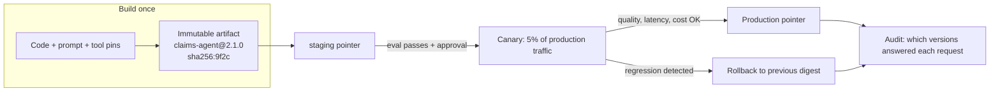

# Versioning and Deployment

> **Interview answer (say this first).** Everything that shapes an agent's behaviour is versioned immutably: the agent, the model, the prompt, and the tools. Deployments **pin** exact versions — ideally by digest — and promotion moves one immutable artifact through environments. You can also **float** within a range for convenience, but you must know and record what a float resolved to at run time. Agents ship with canary and rollback: send a small slice of traffic to the new version, compare quality, latency, and cost against the baseline, then promote or roll back. The audit question — *which version answered this request?* — must have an exact answer.

## Why this exists

An agent's behaviour comes from a composition: agent code, a prompt, a model, tools, and configuration. Any one of them changing can change the output. If they are not versioned together, you cannot explain or reproduce anything.

Consider the ways a deployed agent silently changes under your feet. The provider updates the alias `gpt-4o-mini` and your outputs shift. Someone edits the prompt in a shared database at 4 p.m. A tool's implementation is updated in place. A new agent image ships with no record of which prompt it expects. None of these look like a deploy, so none of them trigger your deployment process. Quality drops, and there is no obvious change to blame.

Now add environments. Staging runs prompt `@6`; production runs `@7`; both call the same model alias. Staging told you nothing about production. Meanwhile an auditor asks why a customer answer was wrong three months ago, and the only available answer is "probably `latest`."

The fix is a discipline: immutable versions, pinned deployments, a controlled promotion path, canary releases, and an audit record for every request.

> **Note:**
>
> **The one-sentence purpose.** Pin immutable versions, deploy them through a controlled canary path, and record the exact composition behind every request so behaviour is reproducible and reversible.

## Start from zero

| Word | Plain meaning |
| --- | --- |
| **Version** | A label for one immutable state of an artifact, such as `2.1.0`. |
| **Immutable version** | Once published, the content cannot change. Corrections get a new version. |
| **Digest** | A content hash that identifies exact bytes, such as `sha256:...`. |
| **Pin** | Reference one exact version or digest. Reproducible, but needs deliberate updates. |
| **Float** | Reference a range or alias, such as `2.x` or `latest`. Convenient, but what runs can change. |
| **Semantic versioning** | `MAJOR.MINOR.PATCH`: breaking, additive, and fix changes respectively. A shared meaning for versions. |
| **Breaking change** | A change that can break a consumer, such as removing a tool or changing an input schema. |
| **Compatibility** | Whether two versioned artifacts can work together, such as an agent and a model version. |
| **Deployment** | Making a version serve traffic in an environment. |
| **Canary** | Sending a small slice of traffic to a new version before full rollout. |
| **Blue-green** | Running two full environments and switching traffic between them. |
| **Promotion** | Moving a validated immutable version to the next environment. |
| **Rollback** | Returning to the previous version after a problem. |
| **Bake time** | How long a canary runs before you trust its metrics. |
| **Deprecation** | Marking a version as still working but scheduled to be removed. |
| **Audit record** | The stored facts about which versions served a request. |
| **Release train** | A regular, predictable cadence for shipping, rather than ad-hoc releases. |

## The core idea

Think of a published book. A reader says "the 3rd edition of this book," and that edition is fixed: same text, same page numbers, forever. A reprint with corrections becomes the 4th edition, not a quiet edit to the 3rd. That fixed edition is an immutable version.

Now think of a library's reading list that says "the latest edition." It is easy to maintain, but two people following it next month may read different books. That is a float.

A deployment is a reading list for production. The safe list names exact editions:

```text
claims-agent 2.1.0
  + prompt support-answer@7
  + model gpt-4o-mini@2024-07-18
  + tool search_docs@1.2.0
```

Every line is an exact edition. Reproduce the list and you reproduce the behaviour.



Build once, canary, promote or roll back, and audit throughout.

Pinning and floating compared:

| Dimension | Pinned | Floating |
| --- | --- | --- |
| Reference | `prompt@7` or `@sha256:...` | `search_docs@^1.2.0`, `latest`, `stable` |
| Reproducible | Yes | Only if the resolution is recorded |
| Picks up fixes | No, needs a deliberate update | Yes, automatically |
| Surprise risk | Low | High, changes without a deploy |
| Best for | Production, audits, incidents | Development, early exploration |
| Audit answer | Exact by construction | Requires run-time resolution logging |

Range floats (`^1.2.0`, `1.x`) require an artifact versioned with semantic versioning, such as an agent or a tool. Prompts are integer-versioned (`support-answer@7`), so they can be pinned exactly but not floated as a range.

The professional posture: pin in production, float in development, and always record what a float resolved to.

## How it works

Walk an agent change from commit to full rollout.

1. **Build one immutable artifact.** The agent image, its prompt pin, model pin, and tool pins are packaged and hashed. The same digest goes everywhere; you never rebuild per environment.
2. **Assign a semantic version.** Decide what changed: breaking (major), additive (minor), or fix (patch). The version carries meaning, but the digest is the identity.
3. **Deploy to staging.** Staging's pointer moves to the new digest. Evaluations run against pinned prompts and datasets, and the recorded result must pass the gate.
4. **Admit and schedule.** Policy checks the pins, budget, and allowed tools. The scheduler places the canary replicas next to, not instead of, the baseline.
5. **Start a canary.** Route a small percentage of production traffic to the new version — typically 1 to 10 percent. Keep the baseline running for comparison.
6. **Bake and compare.** Over the bake window, compare canary against baseline on quality signals, error rate, latency, and cost. Watch guardrail metrics continuously.
7. **Promote or roll back.** If all metrics hold, shift more traffic in steps (5, 25, 50, 100 percent). If a guardrail trips, roll back by repointing production at the previous digest.
8. **Update the desired state.** The control plane records the new production pointer. Reconciliation replaces the remaining old replicas.
9. **Record the audit trail.** Every request stores the agent, prompt, model, and tool versions, tied to a trace ID.
10. **Deprecate the old version.** Mark it deprecated with a sunset date. Keep it resolvable for rollback and for auditing historical requests.

### Compatibility across versions

Versions only work if they compose. Define compatibility explicitly:

- **Agent ↔ model:** which model versions the agent was tested against and supports.
- **Agent ↔ prompt:** the prompt's required variables must match what the agent supplies.
- **Agent ↔ tool:** tool input schemas must match the calls the agent makes.
- **Prompt ↔ model:** some prompts rely on model-specific behaviour.

When a dependency releases a new major version, the agent does not silently pick it up. A compatibility matrix, checked at admission, turns a runtime surprise into a control-plane rejection.

## The syntax you will use

**Semantic versioning in an agent manifest.** The version means something; the digest is the identity.

```yaml
name: claims-agent
version: 2.1.0            # MAJOR.MINOR.PATCH
image: ghcr.io/acme/claims-agent@sha256:9f2c1a...   # pinned identity
prompt: support-answer@7
model: gpt-4o-mini@2024-07-18
tools: [search_docs@1.2.0]
```

MAJOR for breaking changes, MINOR for backward-compatible additions, PATCH for fixes.

**Pin versus float.** Both appear in real systems; be explicit about which you chose.

```yaml
# Production: pinned, reproducible
model: gpt-4o-mini@2024-07-18

# Development: floating, convenient
model: gpt-4o-mini@latest

# Range float: ^1.2.0 means >=1.2.0 <2.0.0, may change under you
tools: search_docs@^1.2.0
```

If you float, the platform must record what it resolved to at run time, or your audit is fiction.

**A canary deployment.** Two versions serving at once, with a controlled split.

```yaml
strategy:
  type: canary
  baseline:
    version: 2.0.0
    digest: sha256:11aa...
  canary:
    version: 2.1.0
    digest: sha256:9f2c...
  steps: [1, 5, 25, 50, 100]      # percent of traffic
  bake_minutes: 30                 # per step
  abort_on:
    - metric: error_rate
      threshold: 0.02
    - metric: groundedness
      threshold: 4.5
      direction: gte
    - metric: p95_latency_ms
      threshold: 3000
      direction: lte
```

The abort conditions are the guardrails. Without them, a canary is just a slow full rollout.

**A rollback.** A pointer move, not a rebuild.

```http
POST /v1/agents/claims-agent/rollback HTTP/1.1
Authorization: Bearer <platform-token>

{"to_digest": "sha256:11aa...", "reason": "canary groundedness dropped to 4.1"}
```

Because the previous artifact is immutable, rollback restores exactly the prior behaviour.

**A run-time audit record.** Every request names its composition.

```json
{
  "trace_id": "t-9f2c",
  "agent": "claims-agent@2.1.0",
  "agent_digest": "sha256:9f2c...",
  "prompt": "support-answer@7",
  "model": "gpt-4o-mini@2024-07-18",
  "latency_ms": 840,
  "cost_usd": 0.0027
}
```

This one record answers the audit question for that request, forever.

**A compatibility declaration.** What the agent was tested against.

```yaml
compatibility:
  model_majors: [4]
  prompt_variables: [context, question]
  tool_contracts: [search_docs@1]
```

Admission rejects a combination the agent was never tested with.

## Examples: simple to real

**Example 1 — parse and compare semantic versions.** Ordering is mechanical once versions are numeric.

```python
def parse(version: str) -> tuple[int, int, int]:
    core = version.split("-", 1)[0]          # ignore any pre-release suffix here
    major, minor, patch = core.split(".")
    return int(major), int(minor), int(patch)


def is_newer(candidate: str, current: str) -> bool:
    return parse(candidate) > parse(current)


print(parse("2.1.0"))                 # (2, 1, 0)
print(is_newer("2.1.0", "2.0.9"))     # True
print(is_newer("2.0.0", "2.1.0"))     # False
print(is_newer("10.0.0", "9.9.9"))    # True  (numeric, not string, order)
```

Compare numerically, not as strings. `"10.0.0" < "9.9.9"` is true as text and false as versions — a classic release bug.

Pre-release and build metadata are not modelled: `parse` drops the suffix, so `2.1.0-rc1` compares equal to `2.1.0` here.

**Example 2 — resolve a floating range and record the resolution.** Range floats pick up fixes automatically; the platform must record what a float became.

```python
def parse(version: str) -> tuple[int, int, int]:
    core = version.split("-", 1)[0]
    major, minor, patch = core.split(".")
    return int(major), int(minor), int(patch)


def satisfies_caret(requested: str, candidate: str) -> bool:
    """^1.2.0 allows >= 1.2.0 and < 2.0.0; for major 0, ^0.2.0 allows >= 0.2.0 and < 0.3.0."""
    r_major, r_minor, r_patch = parse(requested)
    c_major, c_minor, c_patch = parse(candidate)
    if c_major != r_major:
        return False
    if r_major == 0 and c_minor != r_minor:
        return False
    return (c_minor, c_patch) >= (r_minor, r_patch)


def resolve_caret(requested: str, available: list[str]) -> str:
    matches = [v for v in available if satisfies_caret(requested, v)]
    if not matches:
        raise ValueError(f"no version satisfies ^{requested}")
    return max(matches, key=parse)


def resolve(reference: str, available: list[str]) -> tuple[str, bool]:
    """Return (resolved_version, was_floating)."""
    if "@" in reference:
        range_part = reference.split("@", 1)[1]
        if range_part.startswith("^"):
            return resolve_caret(range_part[1:], available), True
        return range_part, False        # exact pin
    return reference, False


available = ["1.2.0", "1.3.0", "1.3.5", "2.0.0"]
print(resolve_caret("1.2.0", available))          # 1.3.5
print(resolve("search_docs@1.2.0", available))    # ('1.2.0', False)
print(resolve("search_docs@^1.2.0", available))   # ('1.3.5', True)
```

A floating range silently picks `1.3.5` today and `1.3.6` tomorrow. If `was_floating` is true, the resolved version goes into the audit record; otherwise you cannot say what actually ran.

Caret semantics tighten for pre-1.0 versions, which may break at any minor: `^0.2.0` means `>= 0.2.0 < 0.3.0`, not `< 1.0.0`.

**Example 3 — canary decision logic.** Promote only when every guardrail holds.

```python
def canary_decision(canary: dict, baseline: dict) -> str:
    if canary["error_rate"] > baseline["error_rate"] + 0.01:
        return "rollback: error rate regression"
    if canary["groundedness"] < 4.5:
        return "rollback: quality below threshold"
    if canary["p95_latency_ms"] > baseline["p95_latency_ms"] * 1.2:
        return "rollback: latency regression"
    if canary["cost_usd_per_1k"] > baseline["cost_usd_per_1k"] * 1.1:
        return "rollback: cost regression"
    return "promote"


baseline = {"error_rate": 0.010, "groundedness": 4.7,
            "p95_latency_ms": 2400, "cost_usd_per_1k": 2.10}

print(canary_decision(baseline, baseline))                       # promote
print(canary_decision({**baseline, "groundedness": 4.2}, baseline))
# rollback: quality below threshold
print(canary_decision({**baseline, "p95_latency_ms": 3000}, baseline))
# rollback: latency regression
```

Quality gates ship, guardrails stop. A canary that watches only errors misses quality and cost regressions.

**Example 4 — an audit lookup: which version answered a request?** Reproduce the composition at any point in time.

```python
DEPLOYMENTS = [
    {"version": "1.3.0", "digest": "sha256:aa01", "since": 100, "until": 200},
    {"version": "2.0.0", "digest": "sha256:11aa", "since": 200, "until": 260},
    {"version": "2.1.0", "digest": "sha256:9f2c", "since": 260, "until": None},
]


def version_at(agent: str, when: int) -> dict:
    for d in DEPLOYMENTS:
        end = d["until"] if d["until"] is not None else float("inf")
        if d["since"] <= when < end:
            return {"agent": agent, **d}
    raise KeyError(f"no deployment recorded for {agent} at {when}")


record = version_at("claims-agent", 270)
print(record)
# {'agent': 'claims-agent', 'version': '2.1.0', 'digest': 'sha256:9f2c', 'since': 260, 'until': None}
request_time = 210
print(version_at("claims-agent", request_time)["version"])   # 2.0.0
```

With a deployment timeline plus per-request composition, "which version answered this?" is a lookup, not an investigation.

**Example 5 — compatibility checked at admission.** Reject a combination the agent was never tested with.

```python
AGENT_REQUIREMENTS = {
    "2.0.0": {"model_major": 4, "prompt_variables": {"context", "question"}},
    "3.0.0": {"model_major": 5, "prompt_variables": {"context", "question", "locale"}},
}

MODEL_MAJORS = {"gpt-4o-mini@2024-07-18": 4, "gpt-5@2026-01-01": 5}


def compatible(agent_version: str, model: str, prompt_variables: set[str]) -> tuple[bool, str]:
    req = AGENT_REQUIREMENTS[agent_version]
    model_major = MODEL_MAJORS[model]
    if model_major != req["model_major"]:
        return False, f"agent {agent_version} needs model major {req['model_major']}, got {model_major}"
    missing = req["prompt_variables"] - prompt_variables
    if missing:
        return False, f"prompt is missing variables {sorted(missing)}"
    return True, "compatible"


print(compatible("2.0.0", "gpt-4o-mini@2024-07-18", {"context", "question"}))
# (True, 'compatible')
print(compatible("3.0.0", "gpt-4o-mini@2024-07-18", {"context", "question"}))
# (False, 'agent 3.0.0 needs model major 5, got 4')
print(compatible("2.0.0", "gpt-4o-mini@2024-07-18", {"context"}))
# (False, "prompt is missing variables ['question']")
```

Catching incompatibility at admission is far cheaper than catching it in production.

## In production

- **Pin production; float development.** Floating in production means your behaviour can change with no deploy, no review, and no rollback. Float ranges are for exploration.
- **Record what a float resolved to.** If you must float, write the resolved version into the request's audit record. Otherwise the audit cannot answer basic questions.
- **Pin models by dated snapshot, not a moving alias.** Provider aliases can point at new snapshots. A dated model version is the reproducible reference.
- **Deploy by digest.** Tags move. The digest is what makes "staging validated this" true of production too.
- **Make a canary's abort conditions explicit and automatic.** Manual judgement during a rollout is slow and inconsistent. Guardrails should roll back without waiting for a human.
- **Watch quality, latency, and cost, not just errors.** AI regressions often show up as worse answers, slower responses, or higher spend while the error rate stays flat.
- **Set the bake time long enough.** A canary that runs for two minutes on low traffic has not seen enough requests to detect a rare failure. Base the time on sample size, not convenience.
- **Keep the previous version runnable.** Rollback must be fast and boring. If the old image was deleted, rollback becomes a rebuild under pressure.
- **Version the whole composition, not just the code.** An agent version that leaves the prompt floating is not a reproducible version.
- **Document compatibility and enforce it at admission.** A matrix and a check turn a runtime crash into a fast rejection.
- **Deprecate, then remove.** Give consumers a sunset window and an impact report from the registry. Silent removal breaks teams unexpectedly.
- **Audit records are append-only.** Never rewrite the record of what ran. Immutability is what makes the audit trustworthy.

## Interview questions

### 1. What does it mean to version an agent?

**Answer.** It means giving an immutable identity to the whole composition that determines behaviour: agent code and image, prompt version, model version, and tool versions. The version has a semantic label and a content digest. Changes create new versions; the old ones stay for rollback and audit. Versioning only the code while the prompt floats leaves the agent unreproducible.

**Follow-up: "Is the agent version the same as the git commit?"** The commit is part of provenance, but the agent also pins non-code artifacts. The deployable identity is the built artifact digest plus its pinned composition.

**Trap.** Treating an agent as just a container image. The prompt, model, and tools change behaviour just as much as the code does.

### 2. What is the difference between pinning and floating, and which should production use?

**Answer.** Pinning references one exact version or digest; floating references a range or alias and may resolve differently over time. Production should pin, because it needs reproducibility, controlled change, and a reliable audit. Development can float to pick up fixes quickly. If anything floats in production, the platform must record the resolved version at run time.

**Follow-up: "What breaks if a provider updates an alias?"** Every agent using that alias can change behaviour with no deploy. That is why you pin dated model snapshots in production.

**Trap.** Saying "we pin `latest`." `latest` is a moving tag; it is the opposite of a pin. Pin a digest or a dated version.

### 3. How do you canary an agent?

**Answer.** Run the new version alongside the current one and send a small percentage of production traffic to it. Over a bake window, compare it against the baseline on quality, error rate, latency, and cost, with explicit abort thresholds. If every guardrail holds, shift traffic in steps to 100 percent; if any fails, roll back automatically. Keep the canary and baseline on the same prompt and dataset versions so the comparison is fair.

**Follow-up: "What is the hardest part?"** Defining the quality signal and getting enough traffic for statistical confidence. Error rates are easy; answer quality often needs sampled evaluation or user feedback.

**Trap.** Canarying with no baseline or no abort conditions. That is not a canary; it is a slow, unmonitored rollout.

### 4. How do you roll back safely?

**Answer.** Repoint the environment at the previous immutable digest. Because the artifact is unchanged and still stored, rollback restores exactly the prior behaviour quickly. Record the rollback reason and the affected versions. Verify after rollback that the baseline metrics recover, rather than assuming they will.

**Follow-up: "What if the prompt changed, not the code?"** Roll back the prompt pointer independently. That is why prompt versions are immutable and separately addressable.

**Trap.** Rolling back by rebuilding old code. Under pressure, a rebuild introduces new differences and takes far too long.

### 5. How do you answer "which version answered this request?"

**Answer.** Every request carries an audit record: agent version and digest, prompt version, model version, tool versions, plus a trace ID and cost. Agent and prompt versions come from the deployment context; if a float resolved at run time, its resolution is recorded too. Then the question is a lookup, not an investigation.

**Follow-up: "How does this help three months later?"** Keep the records append-only and the artifacts resolvable. Historical requests stay explainable even after versions are deprecated.

**Trap.** Reconstructing from logs after the fact. Logs roll over, and a floating alias means the answer may no longer be recoverable. Record at run time.

### 6. What counts as a breaking change in an agent?

**Answer.** Anything that can break a consumer or invalidate prior validation: removing or renaming a tool, changing a tool's input schema, requiring a new prompt variable, raising the model major version, changing the output schema, or altering safety behaviour. Breaking changes get a new major version and an explicit compatibility decision. Additive changes are minor; backwards-compatible fixes are patch.

**Follow-up: "Is a prompt change that alters tone a breaking change?"** Not by interface, but by behaviour and evaluation. Treat behaviour-affecting changes as at least a minor version and re-run the evaluation suite.

**Trap.** Calling everything a patch. Then consumers pin a range, pick up a breaking change, and break without warning.

### 7. Why must versions be immutable?

**Answer.** Immutability is what makes versions meaningful. If `2.1.0` can change, then staging validation, canary results, rollback, and audit all refer to ambiguous artifacts. Content addressing enforces immutability: the digest is computed from the bytes, so a change produces a new identity. Corrections become new versions, and history stays intact.

**Follow-up: "What about a metadata typo?"** Fix it as a new version, or keep mutable descriptive metadata separate from the immutable runnable content. Never mutate the runnable artifact.

**Trap.** "Fixing forward" by editing the deployed version. Now two environments claim the same version and behave differently.

### 8. How do agent, model, and prompt versions compose?

**Answer.** They compose into a deployment manifest: an agent version pins a prompt version, a model version, and tool versions. Compatibility rules link them, so admission can reject an untested combination. A change to any component can require a new agent version and a re-run of the evaluation suite. Together they form a single reproducible composition.

**Follow-up: "Can you upgrade the model without a new agent version?"** Only if the agent explicitly supports that model range and the evaluation suite still passes. Otherwise it is a new agent version with its own canary and rollback.

**Trap.** Upgrading the model under a floating alias without a new version. The agent changed behaviour but no version, canary, or audit captured it.

## Remember this

- **Version the whole composition**: agent, prompt, model, and tools, each immutable with a digest.
- **Pin production; float development; log the resolution** whenever anything floats.
- **Canary with explicit abort conditions** on quality, errors, latency, and cost — then promote or roll back automatically.
- **Rollback is a pointer move to a previous immutable digest**, never a rebuild.
- **Every request records its exact versions**, so "which version answered this?" is a lookup, not an investigation.
