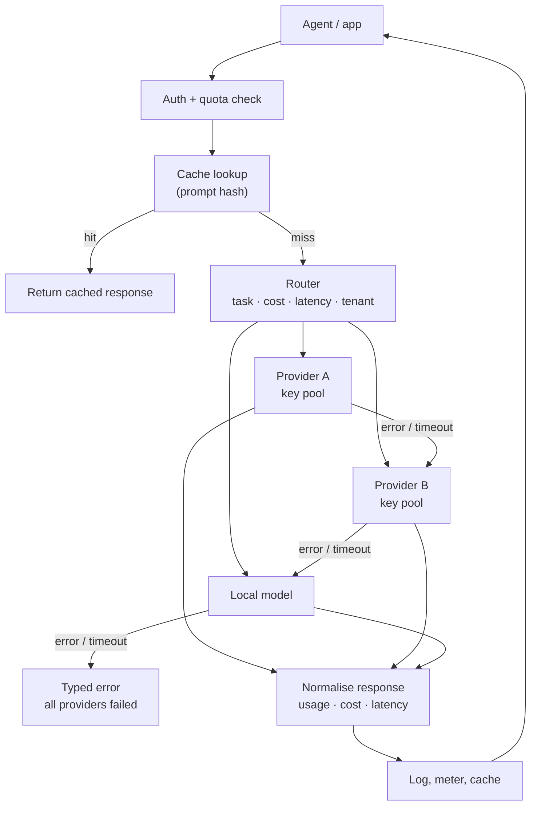

# Model Gateway and Routing

> **Interview answer (say this first).** A model gateway is one service that puts a single, stable API in front of many model providers. It owns provider credentials, translates a common request into each vendor's format, chooses which model to call, falls back when one fails, balances across API keys, enforces quotas, and records cost and latency. Routing is the policy that picks the model: by task, by cost, by latency, or by tenant. The gateway is where all your LLM traffic becomes observable, governable, and portable, instead of being scattered across every service that ever called OpenAI.

## Why this exists

Every AI product starts the same way. One service imports one provider SDK and calls one model:

```text
agent-service -> OpenAI SDK -> api.openai.com
```

That is fine for a prototype. It stops being fine the moment any of these become true:

- You want to use a cheaper model for simple tasks and a stronger one for hard tasks.
- A provider has an outage and you need to stay up.
- Different tenants have different data-residency or cost rules.
- You want to know what you spent, per team, per day.
- You need to rotate an API key without redeploying every service.
- Some requests need a fallback, a cache, or a retry that no product team should reimplement.

Without a gateway, each of those becomes a separate change inside every calling service. Provider SDKs multiply, credentials multiply, and billing becomes a pile of unrelated dashboards. The gateway centralises all of it behind one interface.

The second reason is **portability**. Vendor APIs differ in field names, auth headers, streaming formats, tool-call shapes, and error codes. If those differences leak into application code, switching models is a refactor. If they are hidden behind an adapter, switching models is a config change. The gateway is the seam that keeps the rest of the system provider-agnostic.

> **Note:** The gateway is not just a proxy. A transparent proxy forwards bytes. A model gateway understands the model request: it can route it, rewrite it, cache it, meter it, and fail it over. That understanding is the whole point.

## Start from zero

| Word | Plain meaning |
| --- | --- |
| **Provider** | A company or endpoint that serves models: OpenAI, Anthropic, Google, Bedrock, a self-hosted vLLM. |
| **Model** | One specific model behind a provider, such as `gpt-4o-mini` or `claude-sonnet`. |
| **Gateway** | The service that receives every model request and forwards it to a provider. |
| **Adapter** | A small class that translates the common request into one provider's format and normalises the response back. |
| **Routing** | Choosing which provider and model to call for a given request. |
| **Fallback** | Trying the next candidate when the chosen one errors, times out, or is unhealthy. |
| **Health check** | A lightweight probe that asks "is this provider usable right now?" |
| **Load balancing** | Spreading requests across keys, providers, or instances. |
| **Key pool** | Several API keys for one provider, rotated so no single key hits its rate limit. |
| **Failover** | Moving traffic to a backup after a failure. |
| **Circuit breaker** | A switch that stops sending traffic to a failing provider for a while. |
| **Normalisation** | Converting provider-specific responses into one internal shape. |
| **Usage** | Token counts and cost reported for a call. |
| **Cache hit** | A request answered from a stored response instead of a provider call. |
| **Prompt hash** | A fingerprint of the exact request used as a cache key. |
| **TTFT** | Time to first token; the streaming latency a user actually feels. |
| **Policy** | A rule that maps a request to a routing decision, such as "cheap for classification". |
| **Control plane** | The config and policy store the gateway reads: routes, weights, keys, budgets. |

Two terms interviewers use loosely and expect you to separate:

- **Routing vs load balancing.** Routing decides *which kind of model* (cheap, strong, local). Load balancing decides *which instance or key* of that model. You often do both in one call.
- **Gateway vs proxy.** A gateway is model-aware: it parses tokens, cost, and tools. A generic HTTP proxy is not.

## The core idea

Think of an international airport. You arrive with one ticket format, but the airline desks, security lanes, and gates all differ by destination. The airport's job is to give you one consistent experience while coordinating many carriers behind the scenes.

The gateway is that airport. Callers speak one language; providers are the carriers. A router is the departure board deciding which gate handles your trip.

The flow of one request:



Notice the two control loops. The **data path** carries requests. The **control plane** — routes, weights, health, quotas — decides where the data path goes. Keeping them separate is what lets you change routing without redeploying callers.

Here is how the four common routing policies differ:

| Policy | Decides by | Best for | Risk |
| --- | --- | --- | --- |
| **By task** | The labelled workload, e.g. `classify`, `reason` | Quality-per-task | Mislabeling sends hard tasks to weak models |
| **By cost** | Cheapest model that meets a quality floor | High-volume, low-stakes traffic | Quality drift if the floor is not measured |
| **By latency** | Fastest healthy candidate | Interactive chat, streaming | May pick a cheaper-but-unreliable path |
| **By tenant** | Contract, region, or plan | Residency and enterprise deals | Provider sprawl and higher ops cost |

A routing decision should be **explainable**. Every response should record which route was chosen and why, for example `tenant=acme, task=reason, policy=cost -> anthropic/claude-sonnet`. When a bill spikes or quality drops, that one field tells you whether the code changed, the routing config changed, or the traffic mix changed. A router you cannot explain is a router you cannot operate, and a route that changes silently is a regression that no dashboard will show.

## How it works

1. **The caller sends one common request.** Usually an OpenAI-compatible chat payload: `model`, `messages`, optional `tools`, `temperature`, `max_tokens`. The caller does not know or care which vendor runs it.
2. **The gateway authenticates and meters.** It resolves the caller's key to a tenant, checks that the tenant may use the requested model, and applies any quota or budget check before spending money.
3. **The router turns intent into a candidate list.** A policy maps the request to an ordered list of `(provider, model)` pairs. The first is the primary; the rest are fallbacks. Tenant rules may filter the list (for example, EU-only).
4. **Health and load balancing narrow the list.** Unhealthy providers are skipped. Among healthy candidates, a balancing rule picks a key or instance: round-robin, weighted, or least-latency.
5. **The adapter translates the request.** It maps field names, auth, and tool schemas into the chosen provider's format. This is the only provider-specific code, and it lives in one place.
6. **The provider is called, with a timeout and retry budget.** Retries are bounded and ideally only for safe, idempotent operations. A timeout is a normal outcome, not an exception to ignore.
7. **On failure, the next candidate is tried.** The fallback chain continues until one succeeds or the list is exhausted. Repeated failures trip a circuit breaker so the gateway stops hammering a dead provider.
8. **The response is normalised.** Text, tool calls, finish reason, token usage, and cost are mapped back to one internal shape.
9. **The gateway records and caches.** It logs tenant, model, tokens, cost, latency, and TTFT, then stores the response under a prompt hash if caching is enabled.
10. **The caller gets one response shape.** The same shape comes back whether the call hit OpenAI, Anthropic, or a local model.

The order matters: auth and budget checks come before the spend, cache lookup comes before routing, and fallback comes after the primary attempt. Each step exists to save money, time, or availability.

## The syntax you will use

**The common request is the OpenAI chat-completions shape.** This is the de facto standard, which is why almost every gateway exposes it.

```json
{
  "model": "gpt-4o-mini",
  "messages": [
    {"role": "system", "content": "You are a support agent."},
    {"role": "user", "content": "Where is order 411?"}
  ],
  "temperature": 0.2,
  "max_tokens": 500,
  "stream": true
}
```

One payload works against every provider once the gateway translates it.

**A provider adapter is a small, uniform class.** Every vendor hides behind the same two methods: `health()` and `chat()`.

```python
class Provider:
    def __init__(self, name, models, cost_per_1k, latency_ms, region="us", keys=("k1",)):
        self.name = name
        self.models = models
        self.cost_per_1k = cost_per_1k
        self.latency_ms = latency_ms
        self.region = region
        self.keys = list(keys)
        self._healthy = True

    def health(self) -> bool:
        return self._healthy

    def chat(self, model, messages, max_tokens=256):
        # real adapters build the vendor payload and call the vendor SDK here
        ...
```

Adding a provider means writing one adapter, not changing every caller.

**Routing policy is data, not code.** A table maps task to an ordered candidate list; a policy argument sorts it.

```python
TASK_ROUTES = {
    "classify": ["local:llama-3", "openai:gpt-4o-mini"],
    "reason":   ["anthropic:claude-sonnet", "openai:gpt-4o"],
    "chat":     ["openai:gpt-4o-mini", "local:llama-3"],
}
# policy="cost" or "latency" reorders the healthy candidates
```

Because routes are config, you can change a model without a release.

**Fallback is just iteration with a typed error.** The first candidate that succeeds wins; the rest are tried in order.

```python
for name, model in self.route(task, tenant, policy):
    try:
        return self.providers[name].chat(model, messages)
    except ProviderError as exc:
        errors.append(f"{name}: {exc}")
raise ProviderError("all providers failed: " + "; ".join(errors))
```

A hard failure becomes a clean, typed error instead of a stack trace in a random service.

**The response is normalised too.** Callers see one shape, including usage and cost, no matter which provider answered.

```json
{
  "id": "chatcmpl-123",
  "model": "gpt-4o-mini",
  "provider": "openai",
  "route": "chat:cost",
  "choices": [{"message": {"role": "assistant", "content": "..."}, "finish_reason": "stop"}],
  "usage": {"prompt_tokens": 42, "completion_tokens": 18, "total_tokens": 60},
  "cost_usd": 0.0000171
}
```

The `provider` and `route` fields are what make a routing decision auditable after the fact.

**Real provider calls keep their real shape.** LiteLLM gives one function across vendors; boto3 talks to Bedrock.

```python
# litellm: the model string selects the provider
from litellm import completion
resp = completion(model="anthropic/claude-sonnet", messages=messages)

# boto3: Bedrock runtime is a real AWS API
import boto3
client = boto3.client("bedrock-runtime", region_name="us-east-1")
```

The gateway wraps these so callers never import either package.

**A health check is a cheap, bounded probe.** Never make the probe as expensive as the work it guards.

```python
def health(self) -> bool:
    if time.monotonic() - self._last_check < 5:
        return self._cached_ok
    self._cached_ok = self._probe()      # a tiny request or a status endpoint
    self._last_check = time.monotonic()
    return self._cached_ok
```

Cache the result briefly; a health check on every request doubles your traffic.

## Examples: simple to real

**Example 1 — the problem: two providers, two shapes.** Direct calls mean every service knows both vendors. Switching models is a code change, and each team repeats it.

```text
service.py  -> openai SDK    -> field names, auth, tool schema
service2.py -> anthropic SDK -> different field names, auth, tool schema
# cost: two integrations per service, times every service
```

**Example 2 — one interface, many providers.** Callers send one payload. The gateway owns the translation, so switching a model is a routing change.

```text
service.py -> gateway /v1/chat/completions -> {local, openai, anthropic}
# the caller imports no provider SDK at all
```

**Example 3 — routing by policy changes the order.** The same task produces different candidate orders depending on what you optimise. Balanced prefers the configured primary; cost and latency reorder the healthy set.

```text
balanced: ['openai', 'eucloud', 'local']
cost:     ['local', 'eucloud', 'openai']
latency:  ['local', 'eucloud', 'openai']
```

This is the interview point: routing is a policy over the same catalog, not a hard-coded chain.

**Example 4 — tenant policy filters the catalog.** A tenant with EU residency must never touch a US endpoint, even as a fallback.

```text
eu tenant only: ['eucloud']
# the US candidates are removed before balancing, not after
```

Enforcing this at the gateway makes residency auditable in one place.

**Example 5 — fallback on failure, and a clean error when all fail.** When the primary is unhealthy, the next candidate serves the request. When every candidate is down, the caller gets one typed error.

```text
after failover: local llama-3
all failed cleanly: all providers failed: local: local is unhealthy
```

**Example 6 — cache and key rotation.** A repeated prompt is answered from cache with zero provider latency. Within a provider, keys rotate so per-key rate limits are spread.

```text
first call: openai gpt-4o-mini key=oa-1
second call: openai key=cache latency_ms=0
openai keys: ['oa-2', 'oa-1']
```

Caching cuts cost and latency; key rotation protects throughput. Both belong in the gateway, because both are cross-cutting.

## In production

- **Pin the interface, not the model.** Expose one stable request/response shape. Every provider change then touches one adapter, and callers keep working.
- **Make routes config, and version the config.** Routing tables, weights, and fallbacks change often. Treat them as reviewed, versioned artefacts with an audit trail, not as constants in code.
- **Check auth and budget before the call.** A gateway that spends first and checks later cannot prevent overspend. Ordering is a correctness property.
- **Bound retries and time out every call.** An unbounded retry chain multiplies cost and load during an outage. Give each provider a timeout, cap attempts, and only retry safe operations.
- **Circuit-break failing providers.** Without a breaker, fallback hammers a dead vendor and adds latency to healthy traffic. Trip the breaker after a threshold and probe to recover.
- **Cache carefully and honestly.** Key the cache on model, parameters, and tenant. Never share one tenant's cached completion with another; prompts can contain private data. Exact-match caching is safe; semantic caching needs a similarity threshold and a privacy review.
- **Rotate keys, do not share them.** A key pool spreads rate limits and lets you revoke one key without a full outage. Store keys in a secret manager, never in the routing config file.
- **Log per request, at the gateway.** Record tenant, route, provider, model, prompt tokens, completion tokens, cost, latency, and TTFT. Without this you cannot explain a bill or debug a regression.
- **Normalise errors, not just successes.** Map provider error codes to a small internal set (`rate_limited`, `timeout`, `invalid_request`, `provider_error`) so callers can react consistently.
- **Separate streaming from non-streaming paths, and stay out of the hot path.** TTFT and cancellation behave differently, and a cancelled stream must stop the upstream call or you keep paying for tokens nobody reads. For streaming, proxy the stream instead of buffering the whole response. The gateway should add control, not latency.
- **Watch for routing drift.** As you add policies, the effective model for a task can change silently. Emit the chosen route in every response and alert when the distribution shifts.
- **Treat the gateway as a product.** Teams depend on it. It needs an owner, an SLO, docs, and a self-service way to add a provider or change a route.

## Interview questions

### 1. Why put a gateway in front of model providers instead of calling them directly?

**Answer.** Because the concerns are cross-cutting and repeated. Credentials, routing, fallback, retries, budgeting, caching, and observability are identical for every caller. A gateway implements them once, gives one interface, and makes provider swaps a config change. Direct calls duplicate all of that in every service and lock each service to a vendor SDK.

**Follow-up: "What does the gateway cost you?"** An extra network hop, a new critical service, and a potential bottleneck. You mitigate with horizontal scaling, streaming passthrough, and a local SDK that talks only to the gateway.

**Trap.** Calling it "a proxy." A proxy is not model-aware. The value here is understanding requests enough to route, meter, and rewrite them.

### 2. How do you decide which model handles a request?

**Answer.** With a routing policy. The common axes are task (a labelled workload such as `classify` or `reason`), cost (cheapest model above a quality floor), latency (fastest healthy candidate), and tenant (contract, plan, or residency). In practice you combine them: filter by tenant and policy, then sort by the chosen objective, and keep the rest as fallbacks.

**Follow-up: "How do you know the cheap model is good enough?"** You measure it. Run offline evals per task and track online quality signals. A cost route without a quality floor is just a way to save money by getting worse answers.

**Trap.** Routing by the model name the user typed. If callers can name any model, tenants can pick the most expensive one. The gateway should map intent to an allowed catalog.

### 3. What is the adapter pattern, and why does it matter here?

**Answer.** An adapter is a small class that converts a common request into one provider's format and converts the response back. Every provider implements the same interface. It matters because it isolates vendor differences — field names, auth, tool schemas, streaming, error codes — in one place, so the rest of the system is provider-agnostic and adding a vendor is additive.

**Follow-up: "What has to be normalised?"** Request fields, tool/function schemas, streaming event format, finish reasons, token usage, and error codes. Usage and errors are the ones teams forget.

**Trap.** Leaking provider-specific fields through the common API. Once a caller depends on them, your abstraction is gone.

### 4. How do fallback and health checks work together?

**Answer.** Routing produces an ordered candidate list. Health checks remove providers that are known bad. The gateway tries the first healthy candidate and, on timeout or provider error, moves to the next. Repeated failures should trip a circuit breaker so the gateway stops sending traffic to a dead provider. Health checks can be active (a probe) or passive (derived from recent real errors).

**Follow-up: "Why not just retry the same provider?"** A retry helps with transient blips, but if the provider is down you add latency and still fail. Fallback to a different provider is what preserves availability.

**Trap.** Falling back on every error. A bad request will fail on every provider; only fall back on retryable classes such as timeouts, 5xx, and rate limits.

### 5. How do you load balance across API keys and providers?

**Answer.** Keep a pool of keys per provider and rotate through them (round-robin or least-recently-used), so no single key hits its per-key rate limit. Across providers, use weighted balancing or least-latency selection. Keep the gateway stateless so any instance can serve any request, and read the pools from shared config.

**Follow-up: "What is the danger of round-robin?"** It can send a burst to a key that is already near its limit. Least-loaded or token-bucket-aware selection handles bursts better, and you reconcile to provider-reported limits.

**Trap.** Assuming keys are interchangeable. Different keys can have different quotas, regions, and models.

### 6. What should the gateway log and cache?

**Answer.** Log per request: tenant, route, provider, model, prompt and completion tokens, computed cost, latency, time to first token, cache status, and outcome. Cache exact matches keyed on model, parameters, and tenant. Never let one tenant read another tenant's cached response, because prompts contain private data.

**Follow-up: "Is semantic caching safe?"** Only with a high similarity threshold, a clear privacy boundary per tenant, and a way to invalidate. It trades a small correctness risk for cost savings, so measure it and keep it off by default.

**Trap.** Caching on the prompt text alone. Temperature, model version, tools, and system prompt all change the answer.

### 7. Where exactly does the gateway sit in an agent system?

**Answer.** Between the agent runtime and the providers, after authentication and before the spend. The agent decides what it wants to do; the gateway decides which model executes it and enforces the platform's rules. It commonly also fronts embeddings and rerankers, so all model traffic shares one control point.

**Follow-up: "Does the gateway replace the agent's own planning?"** No. The agent still chooses tools and builds context. The gateway only handles model selection, transport, and governance.

**Trap.** Putting business logic in the gateway. The moment it starts reasoning about the user's task, it becomes a second, hidden agent.

### 8. What are the main failure modes of a model gateway?

**Answer.** It becomes a bottleneck or single point of failure; a bad routing config sends all traffic to one model; unbounded retries amplify an outage; a cache serves stale or cross-tenant data; a provider outage is masked until the fallback also saturates; and cost accounting drifts from reality. Each is addressed with horizontal scaling, reviewed config, bounded retries, tenant-scoped caches, capacity planning for fallbacks, and reconciliation against provider billing.

**Follow-up: "How do you test routing changes safely?"** Shadow or canary a percentage of traffic, compare quality and cost against the incumbent, and keep an instant rollback. Treat a route change like a deploy.

**Trap.** Assuming the fallback has capacity. If the primary carries all traffic, the backup must be able to absorb the overflow at least for the duration of an incident.

## Remember this

- **One API, many providers.** The gateway's core job is a stable interface plus adapters behind it.
- **Routing is a policy over a catalog:** by task, cost, latency, and tenant, with the rest as fallbacks.
- **Check budget and auth before the call; fall back only on retryable errors.**
- **Keys, retries, caching, and logging are cross-cutting — implement them once, in the gateway.**
- **Never share a cache or a key across tenants.** Isolation is part of the gateway's contract.
